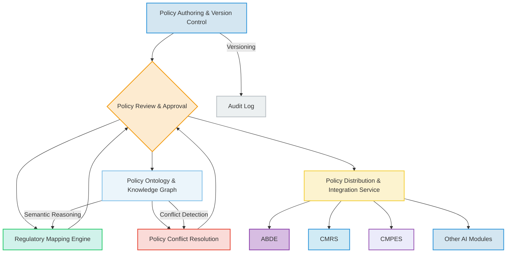
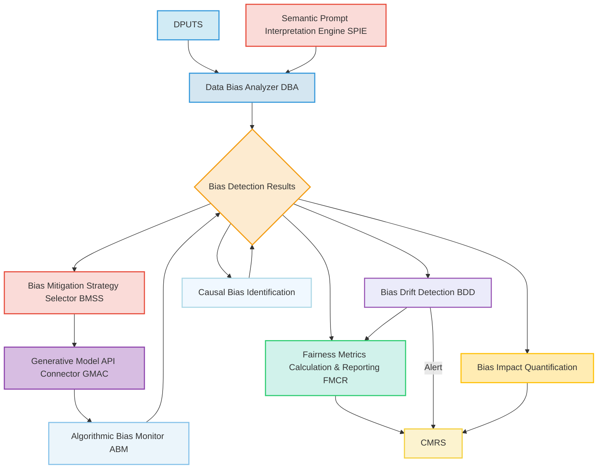
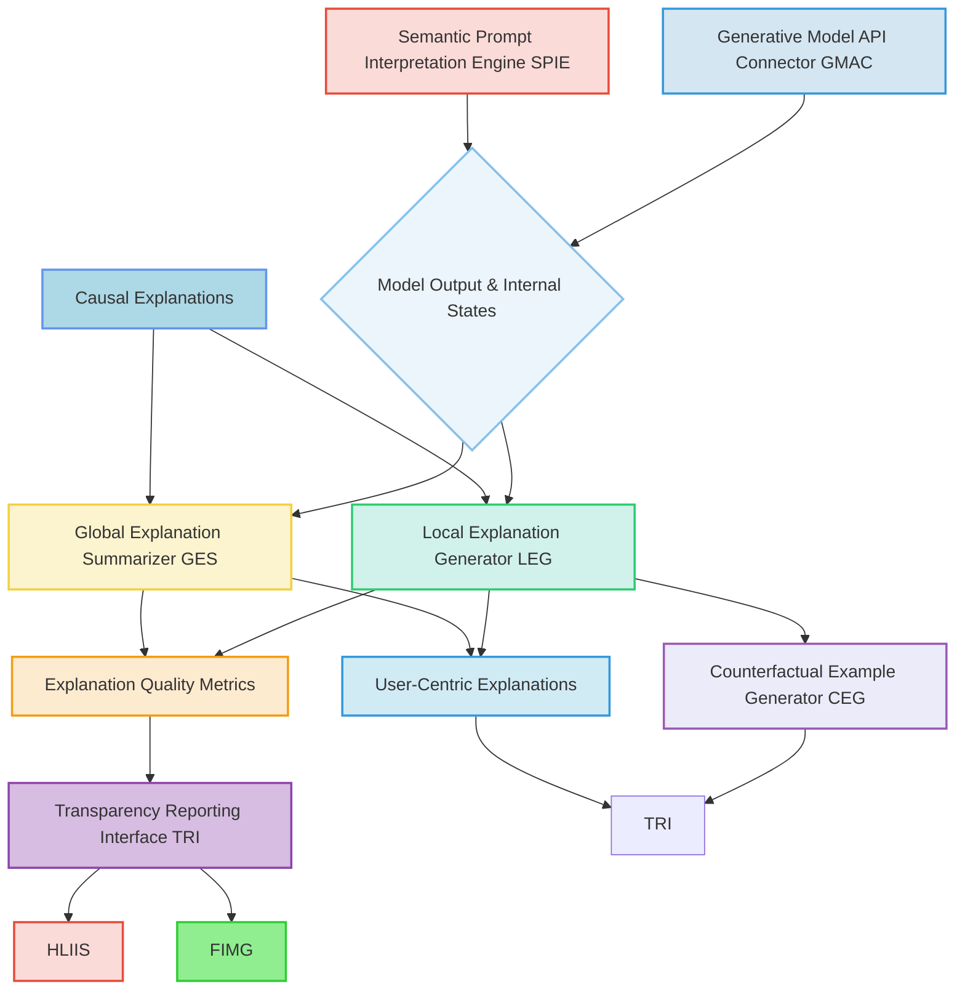
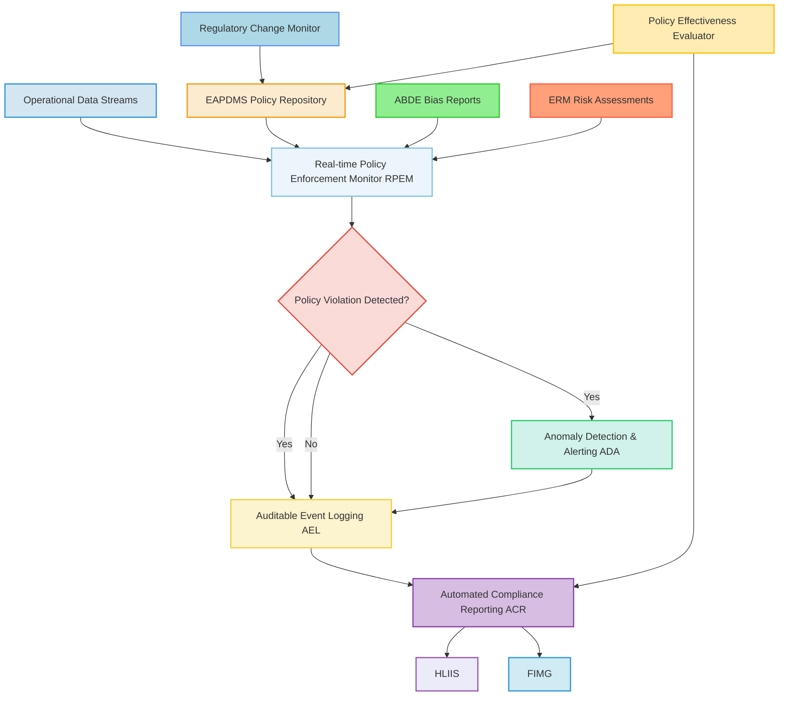
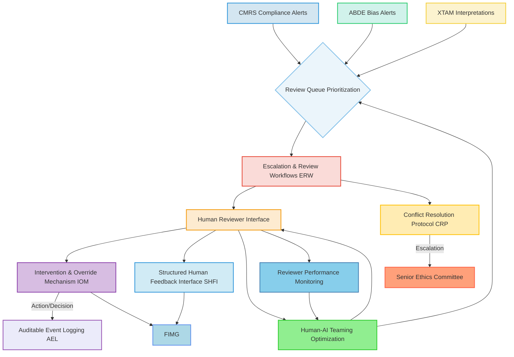
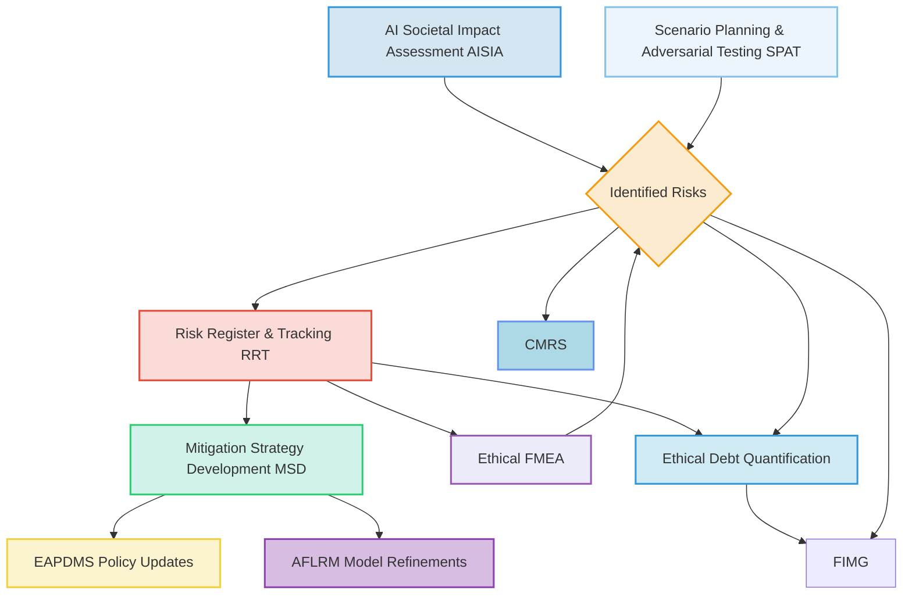
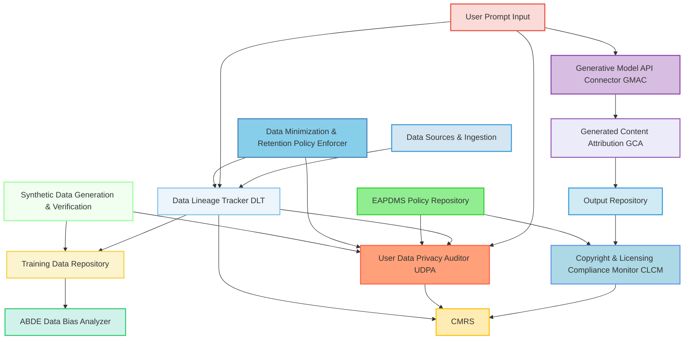
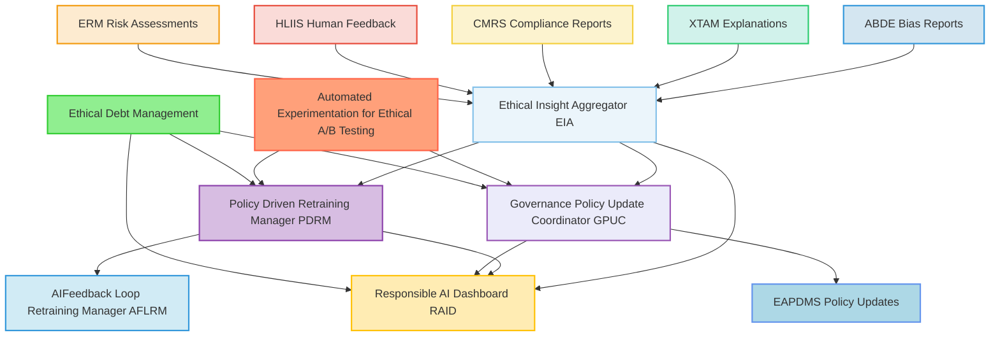
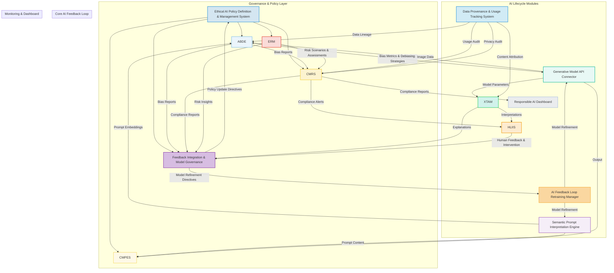

### Comprehensive Ethical AI Compliance and Auditing Framework for Generative AI Systems

**Abstract:**
A sophisticated and proactive framework is herein unveiled for establishing, maintaining, and continuously auditing ethical compliance in advanced generative artificial intelligence AI systems, particularly those involved in content generation, such as dynamic user interface backgrounds. This invention meticulously integrates policy definition, automated bias detection, explainability modules, continuous compliance monitoring, and human-in-the-loop oversight to ensure the responsible development, deployment, and operation of AI. It provides a robust, auditable, and adaptive mechanism for identifying, mitigating, and reporting on ethical risks, biases, and policy infringements throughout the entire AI lifecycle. By systematically addressing the inherent complexities of AI ethics, this framework safeguards against unintended societal harms, fosters trust, and ensures adherence to regulatory standards and internal governance principles. The intellectual dominion over these principles is unequivocally established.

**Background of the Invention:**
The rapid advancements in generative AI, as exemplified by systems capable of creating dynamic user interface backgrounds from subjective aesthetic intent, herald an era of unprecedented personalization and creative capability. However, the immense power of these autonomous systems also introduces significant ethical challenges. Unmitigated biases embedded within training data, opaque decision-making processes, the potential for generating harmful or inappropriate content, and the complexities of intellectual property and data provenance all pose substantial risks. Prior art systems, while often incorporating rudimentary content moderation or ad-hoc bias detection, lack a cohesive, systematic, and continuously auditable framework for comprehensive ethical governance. These fragmented approaches are inherently reactive, failing to provide the proactive identification, real-time monitoring, and integrated mitigation strategies necessary for responsible AI deployment at scale. Consequently, a profound lacuna exists within the domain of AI system management: a critical imperative for an intelligent, extensible framework capable of autonomously and continuously ensuring ethical compliance, detecting and mitigating biases, enhancing transparency, and providing clear accountability across all stages of generative AI operation. This invention precisely and comprehensively addresses this lacuna, presenting a transformative solution.

**Brief Summary of the Invention:**
The present invention introduces a meticulously engineered system that symbiotically integrates advanced ethical AI governance modules within an extensible generative AI operational workflow. The core mechanism involves defining explicit ethical policies, employing automated systems for the continuous detection and mitigation of biases in both data and generated outputs, enhancing transparency through explainable AI techniques, and providing robust mechanisms for compliance monitoring, auditing, and human oversight. This pioneering approach unlocks an effectively verifiable and continuously improving ethical posture for generative AI, directly translating organizational values and regulatory requirements into tangible, auditable operational controls. The architectural elegance and operational efficacy of this system render it a singular advancement in the field, representing a foundational patentable innovation. The foundational tenets herein articulated are the exclusive domain of the conceiver.

**Detailed Description of the Invention:**
The disclosed invention comprises a highly sophisticated, multi-tiered architecture designed for the robust, real-time, and continuous ethical governance and auditing of generative AI systems. The operational flow initiates with policy definition and culminates in verified, ethically compliant AI deployment.

**I. Ethical AI Policy Definition and Management System EAPDMS**
This foundational module serves as the central repository and enforcement mechanism for all ethical guidelines, policies, and regulatory requirements pertaining to the generative AI system. It provides a structured environment for defining, versioning, and distributing ethical principles. The EAPDMS incorporates:
*   **Policy Authoring and Version Control:** Enables the formal definition of ethical principles, responsible use guidelines, and compliance rules in a structured, machine-readable format. Supports versioning of policies for traceability and evolution. Policies `P = {p_1, ..., p_N}` are represented as logical predicates or constraints `C(S_AI)` over AI system states `S_AI`. Each `p_i` has attributes `(ID, Version, Author, Timestamp, Status, Scope, Category, Rule_Text, Formal_Spec)`.
    *   **Equation 1:** `p_i = (ID_i, V_i, A_i, T_i, Status_i, Scope_i, Cat_i, R_i, F_i)`
    *   **Equation 2:** Version update `V_{i, new} = V_{i, old} + \Delta V_i` is governed by `\Delta V_i > 0` and requires formal review.
*   **Regulatory Mapping Engine:** Maps internal policies to external regulatory frameworks e.g. GDPR, CCPA, AI Act and industry best practices, ensuring comprehensive coverage. This engine maintains a mapping `M_reg: P \to R_external` where `R_external` is the set of external regulations. It identifies overlaps and gaps.
    *   **Equation 3:** `Compliance_Coverage = \frac{|\bigcup_{p_i \in P} M_{reg}(p_i)|}{|R_{external}|}`
*   **Stakeholder Consultation Interface:** Facilitates collaboration with legal, ethics, and product teams to ensure policies are comprehensive, clear, and actionable. Captures feedback `F_stakeholder = {f_1, ..., f_K}` for policy refinement.
*   **Policy Distribution and Integration Service:** Securely distributes policies to all relevant AI components e.g. CMPES, ABDE for automated enforcement. This ensures consistency across the system.
*   **Policy Ontology and Knowledge Graph (New Feature):** Constructs a semantic network of ethical concepts, policies, risks, and mitigation strategies. This allows for automated reasoning, conflict detection, and policy recommendation.
    *   **Equation 4:** Ontology `O = (C, R, A)` where `C` are classes, `R` are relations, `A` are axioms.
    *   **Equation 5:** Policy `p_i` is represented as a set of triples `(subject, predicate, object)` within `O`.
*   **Policy Conflict Resolution (New Feature):** Identifies contradictory or ambiguous policies within `P` or conflicts with `R_external`. Employs logical consistency checking.
    *   **Equation 6:** A conflict exists if `\exists p_i, p_j \in P` such that `F_i(S_{AI}) \land F_j(S_{AI}) \implies FALSE` for some `S_{AI}`.
    *   **Equation 7:** Severity of conflict `S_c = \sum_{k} w_k \cdot I(F_i \land F_j \implies FALSE)_k`, where `w_k` is weight for impact scenario `k`.
*   **Automated Policy Translation (New Feature):** Translates high-level ethical principles into executable code or configuration parameters for AI modules.
    *   **Equation 8:** `T: P \to Config_AI`, where `Config_AI` are executable configurations.

**II. Automated Bias Detection and Mitigation Engine ABDE**
This advanced module is tasked with the continuous identification, quantification, and proactive mitigation of biases across the generative AI lifecycle, from input data to model outputs. It extends and operationalizes the "Bias Detection and Mitigation" concept from the foundational patent. The ABDE incorporates:
*   **Data Bias Analyzer DBA:** Scans training datasets `D_train` and real-time input prompts `D_input` for demographic, cultural, and representational biases that could lead to discriminatory or unfair outputs. Integrates with the `DPUTS` for data provenance.
    *   **Equation 9:** `B_data(D) = \sum_{s \in S} \text{Metric}(D, s)`, where `S` is the set of sensitive attributes (e.g., gender, race, age).
    *   **Equation 10:** Representational bias `RB(D, S_k) = \frac{N(D, S_k = v_j)}{N(D)} - P_{ideal}(S_k = v_j)`.
    *   **Equation 11:** Association bias `AB(D, (W, Y)) = \text{Correlation}(W, Y) - \text{Correlation}_{ideal}(W, Y)`, where `W` are sensitive attributes, `Y` are outcome attributes.
*   **Algorithmic Bias Monitor ABM:** Analyzes the internal workings and outputs `O_gen` of the generative models e.g. `GMAC` from the foundational patent for emergent biases in generated content, assessing fairness metrics such as statistical parity, equal opportunity, and disparate impact.
    *   **Equation 12:** Statistical Parity Difference (SPD) for binary outcome `Y` and sensitive attribute `S`: `SPD(Y, S) = |P(Y=1|S=s_1) - P(Y=1|S=s_2)|`. Goal: `SPD \approx 0`.
    *   **Equation 13:** Equal Opportunity Difference (EOD): `EOD(Y, S, Y_true) = |P(Y=1|S=s_1, Y_true=1) - P(Y=1|S=s_2, Y_true=1)|`. Goal: `EOD \approx 0`.
    *   **Equation 14:** Average Odds Difference (AOD): `AOD(Y, S, Y_true) = \frac{1}{2} (EOD(Y, S, Y_true) + |P(Y=1|S=s_1, Y_true=0) - P(Y=1|S=s_2, Y_true=0)|)`. Goal: `AOD \approx 0`.
    *   **Equation 15:** Disparate Impact Ratio (DIR): `DIR(Y, S) = \frac{P(Y=1|S=s_1)}{P(Y=1|S=s_2)}`. Goal: `DIR \approx 1`.
    *   **Equation 16:** Counterfactual Fairness `CF(x, x') = Y(x) = Y(x')` where `x'` is a counterfactual instance with sensitive attributes flipped, but retaining causal structure.
*   **Bias Mitigation Strategy Selector BMSS:** Employs a library of algorithmic bias mitigation techniques e.g. re-weighting, adversarial debiasing, post-processing calibration and dynamically applies the most suitable strategies based on detected bias types and severity.
    *   **Equation 17:** Pre-processing (Data Reweighting): `w(x,s) = \frac{P(Y=y|S=s)}{P(Y=y)P(S=s)}`.
    *   **Equation 18:** In-processing (Adversarial Debiasing): `min_G max_D L(G,D_fair) - \lambda L(G,D_bias_adversary)`, where `G` is generative model, `D` is discriminator.
    *   **Equation 19:** Post-processing (Threshold Adjustment): `Y'(x) = 1` if `P(Y=1|x) > \tau_s`, where `\tau_s` is group-specific threshold.
    *   **Equation 20:** Mitigation effectiveness `\eta_M = \frac{B_{old} - B_{new}}{B_{old}}`.
*   **Fairness Metrics Calculation and Reporting FMCR:** Continuously computes and reports on a suite of fairness metrics relevant to the application domain, providing quantitative insights into model equity. Generates `Report_Fairness = (Timestamp, ABM_Metrics, DBA_Metrics, Mitigation_Actions, Effectiveness)`.
*   **Bias Drift Detection BDD:** Monitors for shifts in bias over time as models are retrained or data distributions change, triggering alerts for intervention.
    *   **Equation 21:** Drift detection uses `KS_statistic(B_t, B_{t-1})` or `Wasserstein_distance(B_t, B_{t-1})`.
    *   **Equation 22:** Alert trigger `if KS_statistic > \alpha_KS` or `Wasserstein_distance > \alpha_W`.
*   **Causal Bias Identification (New Feature):** Identifies the root causes of observed biases by constructing causal graphs of data generation and model decision processes.
    *   **Equation 23:** Causal effect `P(Y|do(S=s_1)) - P(Y|do(S=s_2))`.
*   **Bias Impact Quantification (New Feature):** Estimates the potential negative consequences (e.g., reputational, financial, societal harm) of unmitigated biases.
    *   **Equation 24:** `Impact_Bias = \sum_{j} \text{Severity}_j \cdot \text{Exposure}_j \cdot \text{Likelihood}_j`.

**III. Explainable AI XAI and Transparency Module XTAM**
The XTAM focuses on enhancing the interpretability and transparency of generative AI models, allowing stakeholders to understand *why* a particular output was generated and to identify potential issues. The XTAM includes:
*   **Local Explanation Generator LEG:** Produces instance-specific explanations `e_local` for individual generated images or model decisions using techniques like SHAP SHapley Additive exPlanations, LIME Local Interpretable Model-agnostic Explanations, or saliency maps, revealing which input prompt elements or latent features most influenced the output.
    *   **Equation 25:** For SHAP: `g(z') = \phi_0 + \sum_{j=1}^M \phi_j z'_j`, where `\phi_j` is the Shapley value for feature `j`, `z'` is a simplified input.
    *   **Equation 26:** For LIME: `\xi(x) = \operatorname{argmin}_{g \in G} \mathcal{L}(f, g, \pi_x) + \Omega(g)`, where `\mathcal{L}` measures fidelity, `\Omega` measures complexity, `\pi_x` is proximity measure.
    *   **Equation 27:** Saliency Map `S(x_k, y) = |\frac{\partial Y_y}{\partial x_k}|`.
*   **Global Explanation Summarizer GES:** Provides aggregated insights `e_global` into the overall behavior and decision-making patterns of the generative model, helping to understand its general biases and capabilities.
    *   **Equation 28:** Feature Importance `FI_j = \frac{1}{N} \sum_{i=1}^N |\phi_{i,j}|` (mean absolute Shapley value).
    *   **Equation 29:** Decision Boundary Visualization `D(f) = \{x | f(x) = \text{class}_1 \text{ vs. } \text{class}_2 \text{ boundary}\}$.
*   **Transparency Reporting Interface TRI:** Generates human-readable reports and visualizations explaining model architectures, training data characteristics, and key operational parameters.
*   **Counterfactual Example Generator CEG:** Creates alternative outputs `o'` by minimally changing input prompts `i'` such that `f(i') \ne f(i)` or `f(i')` leads to a different attribute, demonstrating how different inputs would alter the generated image, aiding in understanding model sensitivities.
    *   **Equation 30:** `\operatorname{argmin}_{i'} d(i, i')` subject to `f(i') \neq f(i)`.
*   **Explanation Quality Metrics (New Feature):** Quantifies the fidelity, stability, and human interpretability of generated explanations.
    *   **Equation 31:** Fidelity `Fid(e_local, f) = 1 - \frac{\text{MSE}(f(z'), g(z'))}{\text{Var}(f(z'))}`.
    *   **Equation 32:** Stability `Stab(e_local, \epsilon) = \frac{1}{N} \sum_{i=1}^N \mathbb{I}(\text{similarity}(e_{local}(x_i), e_{local}(x_i + \epsilon_i)) > \tau)`.
*   **Causal Explanations (New Feature):** Identifies cause-effect relationships between input features and model outputs, moving beyond mere correlation.
    *   **Equation 33:** `P(Y=y | do(X_j=x_j))` through intervention.
*   **User-Centric Explanations (New Feature):** Tailors explanations based on the user's expertise, context, and specific query, ensuring relevance and comprehensibility.
    *   **Equation 34:** `e_{user} = T(e_{model}, User_Profile, Query_Context)`.

**IV. Compliance Monitoring and Reporting System CMRS**
This system provides continuous, real-time monitoring of the generative AI system's adherence to defined ethical policies and regulatory requirements. It establishes an auditable trail of all ethical governance activities. The CMRS comprises:
*   **Real-time Policy Enforcement Monitor RPEM:** Continuously cross-references operational data e.g. prompt submissions, generation requests, output images against the policies defined in EAPDMS, flagging any potential violations. Integrates with `CMPES` from the foundational patent.
    *   **Equation 35:** `Compliance(e_t, P_E) = \bigwedge_{p_i \in P_E} F_i(e_t)`, where `e_t` is an event at time `t`.
    *   **Equation 36:** `Violation_Alert_Rate = \frac{\text{Number of Violations}}{\text{Total Events}}`.
*   **Auditable Event Logging AEL:** Maintains immutable, time-stamped logs of all relevant events, including policy breaches, bias detection alerts, mitigation actions, human interventions, and system-level changes, providing a comprehensive audit trail. Utilizes a cryptographically secure ledger.
    *   **Equation 37:** `Log_Entry_t = (Event_ID, Timestamp, Event_Type, Payload, Hash(Prev_Log_Entry))`.
    *   **Equation 38:** Immutability `H(L_{t}) = SHA256(L_{t-1} || Data_t)`.
*   **Automated Compliance Reporting ACR:** Generates periodic and on-demand compliance reports for internal stakeholders, auditors, and regulatory bodies, summarizing ethical performance and adherence.
    *   **Equation 39:** `Compliance_Score = 1 - \frac{\sum_{t \in T} w_t \cdot I(\text{Violation}_t)}{\sum_{t \in T} w_t}`.
    *   **Equation 40:** Risk exposure `E_C = \sum_{p \in P_E} Risk(p) \cdot I(\neg Compliance(p))`.
*   **Anomaly Detection and Alerting ADA:** Employs machine learning to detect unusual patterns in generative outputs or system behavior that might indicate emerging ethical risks or policy deviations, triggering immediate alerts.
    *   **Equation 41:** Anomaly Score `A_score(x_t) = \text{Reconstruction_Error}(Autoencoder(x_t))` or `Density_Estimation(x_t)`.
    *   **Equation 42:** Alert condition `A_score(x_t) > \tau_{anomaly}`.
*   **Regulatory Change Monitor (New Feature):** Scans external regulatory sources for updates and analyzes their impact on existing policies, triggering reviews in `EAPDMS`.
    *   **Equation 43:** `Impact_Score(r_new) = \sum_{p \in P_E} \text{Overlap}(p, r_new) \cdot \text{Severity}(p)`.
*   **Policy Effectiveness Evaluator (New Feature):** Quantitatively assesses whether implemented policies achieve their intended ethical outcomes by analyzing compliance metrics and incident rates.
    *   **Equation 44:** `Effectiveness(p_i) = \frac{\Delta \text{Incident_Rate}(\neg F_i)}{\text{Cost}(p_i)}`.

**V. Human-in-the-Loop Oversight and Intervention System HLIIS**
Recognizing the limitations of fully automated systems, the HLIIS ensures that human judgment and oversight are integrated at critical junctures, providing a safety net and a mechanism for continuous improvement. The HLIIS includes:
*   **Escalation and Review Workflows ERW:** Routes flagged content, bias alerts, or policy violations to human reviewers for expert assessment and decision-making. Prioritization based on severity and urgency.
    *   **Equation 45:** `Priority(Alert_k) = w_1 \cdot \text{Severity}(Alert_k) + w_2 \cdot \text{Urgency}(Alert_k)`.
    *   **Equation 46:** `Reviewer_Assignment = \text{argmin}_{r \in Reviewers} \text{Load}(r) + \text{Expertise_Match}(r, Alert_k)`.
*   **Intervention and Override Mechanism IOM:** Empowers authorized human operators to directly intervene, modify, or halt generative processes or outputs found to be problematic. All interventions are logged.
    *   **Equation 47:** `Override_Action = (Timestamp, User_ID, Event_ID, Original_Output, Modified_Output, Reason)`.
    *   **Equation 48:** `Audit_Trail(Override_Action)` is cryptographically linked to AEL.
*   **Structured Human Feedback Interface SHFI:** Collects qualitative and quantitative feedback from human reviewers, which is then fed back into the `AFLRM` for model and policy refinement.
    *   **Equation 49:** `Feedback_Rating_k = (Score, Comments, Categorization, User_ID)`.
    *   **Equation 50:** Consensus `C_F = \text{Agreement_Score}(\{Feedback_Rating_k\})`.
*   **Conflict Resolution Protocol CRP:** Defines clear procedures for resolving disagreements between automated detection systems and human reviewers, ensuring consistent decision application. Escalates unresolved conflicts to senior ethics committees.
*   **Human-AI Teaming Optimization (New Feature):** Optimizes the allocation of tasks between human reviewers and automated systems to maximize efficiency and accuracy while minimizing cognitive load.
    *   **Equation 51:** `Team_Performance = \alpha \cdot P_{AI} + (1-\alpha) \cdot P_{Human}(1-FPR_{AI})`.
*   **Reviewer Performance Monitoring (New Feature):** Tracks the accuracy, consistency, and efficiency of human reviewers to identify areas for training or process improvement.
    *   **Equation 52:** `Reviewer_Accuracy = \frac{\text{Correct_Decisions}}{\text{Total_Decisions}}`.
    *   **Equation 53:** `Inter-Rater_Reliability = Kappa_coefficient(\text{Reviewer}_i, \text{Reviewer}_j)`.

**VI. Ethical Risk Assessment and Mitigation ERM**
This module provides a proactive approach to identifying and addressing potential ethical risks before they manifest as incidents. The ERM incorporates:
*   **AI Societal Impact Assessment AISIA:** Conducts prospective analyses to identify potential negative societal impacts of deploying the generative AI system across various demographics and contexts.
    *   **Equation 54:** `Societal_Impact = \sum_{g \in G} \sum_{k \in K} w_{g,k} \cdot \text{Impact_Score}(g, k, M_{AI})`, where `G` are demographic groups, `K` are impact categories.
*   **Scenario Planning and Adversarial Testing SPAT:** Develops and tests hypothetical scenarios where the AI system might behave unethically, simulating adversarial attacks or unintended misuse to identify vulnerabilities.
    *   **Equation 55:** `Vulnerability_Score = \sum_{s \in Scenarios} \text{Attack_Success_Rate}(s) \cdot \text{Impact}(s)`.
    *   **Equation 56:** Robustness `R = 1 - \frac{\text{Number_of_Successful_Attacks}}{\text{Total_Attacks}}`.
*   **Mitigation Strategy Development MSD:** Proposes and evaluates strategies to reduce identified ethical risks, ranging from model adjustments to policy changes and user education.
    *   **Equation 57:** `Residual_Risk(s, M) = \text{Likelihood}(s) \cdot \text{Impact}(s) \cdot (1 - \text{Mitigation_Effectiveness}(M))`.
    *   **Equation 58:** Optimal mitigation `M^* = \text{argmin}_M \sum_s Residual_Risk(s, M) + \text{Cost}(M)`.
*   **Risk Register and Tracking RRT:** Maintains a database of identified risks, their severity, likelihood, and the status of mitigation efforts.
    *   **Equation 59:** `Risk_Entry_j = (ID_j, Description, Severity_j, Likelihood_j, Status_j, Mitigation_Plan_j)`.
    *   **Equation 60:** Overall Risk `R_{overall} = \sqrt{\sum_j (\text{Severity}_j \cdot \text{Likelihood}_j)^2}`.
*   **Ethical FMEA (Failure Mode and Effects Analysis) (New Feature):** Systematically identifies potential ethical failure modes, their causes, effects, and controls.
    *   **Equation 61:** `RPN (Risk Priority Number) = Severity \cdot Occurrence \cdot Detection`.
*   **Ethical Debt Quantification (New Feature):** Measures the accrued risk due to delayed or incomplete mitigation of identified ethical issues.
    *   **Equation 62:** `Ethical_Debt = \sum_{t=0}^{\text{Current_Time}} \sum_{j \in Risks_outstanding} (\text{Risk_Value}_j(t) - \text{Target_Risk_Value}_j) \cdot \text{Interest_Rate}(j)`.

**VII. Data Provenance and Usage Tracking System DPUTS**
Expanding on the concept of data provenance from the foundational patent, this system provides immutable records of the origin, licensing, and usage of all data inputs to and outputs from the generative AI, crucial for intellectual property, copyright, and privacy compliance. The DPUTS includes:
*   **Data Lineage Tracker DLT:** Records the complete history of all training data `D_train`, including its sources, transformations, and licensing agreements, ensuring auditable data provenance. Utilizes a distributed ledger technology (DLT) for immutability.
    *   **Equation 63:** `Data_Block_i = (Data_ID, Source_URI, Timestamp, Hash_of_Content, Hash_of_Previous_Block, Metadata_License)`.
    *   **Equation 64:** `Lineage(Data_ID) = \text{Chain}(D_1 \to D_2 \to \dots \to D_k)`.
*   **Generated Content Attribution GCA:** Attaches indelible metadata to all generated outputs `O_gen`, detailing the generative model used, input prompts, user ID, and any relevant ethical compliance flags.
    *   **Equation 65:** `Content_Metadata_o = (Output_ID, Gen_Model_ID, Prompt_Hash, User_ID, Timestamp, Policy_Compliance_Flags, Hash_of_Output)`.
    *   **Equation 66:** Digital watermarking `O'_{gen} = O_{gen} + W_m`, where `W_m` is an imperceptible watermark encoding metadata.
*   **Copyright and Licensing Compliance Monitor CLCM:** Monitors generated outputs for potential copyright infringements against known intellectual property databases and ensures adherence to content licensing terms.
    *   **Equation 67:** `Similarity_Score(O_gen, IP_db) = \text{Cosine_Similarity}(Embed(O_gen), Embed(IP_db))`.
    *   **Equation 68:** Infringement `I_{IP} = \mathbb{I}(\text{Similarity_Score} > \tau_{IP})`.
*   **User Data Privacy Auditor UDPA:** Verifies that user prompts and generated content are handled in accordance with privacy policies and data protection regulations. Implements differential privacy where applicable.
    *   **Equation 69:** Differential Privacy `P(K(D) \in S) \le e^\epsilon P(K(D') \in S) + \delta`, for neighboring datasets `D, D'`.
    *   **Equation 70:** Privacy Risk Score `P_risk = \sum_{u \in Users} \text{Reidentification_Likelihood}(u)`.
*   **Data Minimization & Retention Policy Enforcer (New Feature):** Ensures that only necessary data is collected and retained for the minimum required period, adhering to privacy-by-design principles.
    *   **Equation 71:** `Data_Retention_Metric = \sum_{d \in D} \text{Retention_Duration}(d) - \text{Min_Required_Duration}(d)`.
*   **Synthetic Data Generation & Verification (New Feature):** Facilitates the creation and validation of synthetic datasets for training, reducing reliance on sensitive real-world data while preserving statistical properties.
    *   **Equation 72:** `Utility_Synthetic = \text{Kullback-Leibler_Divergence}(P_{real}, P_{synthetic})`.
    *   **Equation 73:** `Privacy_Synthetic = \text{Differential_Privacy_Guarantee}(D_{synthetic})`.

**VIII. Feedback Integration and Model Governance FIMG**
This module closes the loop between ethical governance activities and continuous AI model and policy improvement. It acts as a bridge to the `AI Feedback Loop Retraining Manager AFLRM` from the foundational patent. The FIMG includes:
*   **Ethical Insight Aggregator EIA:** Gathers insights from the `ABDE`, `XTAM`, `CMRS`, `HLIIS`, and `ERM`, synthesizing them into actionable recommendations for model and policy refinement.
    *   **Equation 74:** `Aggregated_Feedback = \text{Concatenate}(\text{ABDE_Reports}, \text{XTAM_Reports}, \text{CMRS_Reports}, \text{HLIIS_Feedback}, \text{ERM_Risks})`.
    *   **Equation 75:** `Actionable_Recommendation = \text{Reasoning_Engine}(\text{Aggregated_Feedback}, P_E)`.
*   **Policy Driven Retraining Manager PDRM:** Prioritizes and orchestrates model retraining efforts via `AFLRM` based on ethical insights, ensuring that new model versions incorporate improved fairness, transparency, and compliance.
    *   **Equation 76:** `Retraining_Priority = w_1 \cdot \text{Bias_Severity} + w_2 \cdot \text{Compliance_Deficit} + w_3 \cdot \text{Risk_Exposure}`.
    *   **Equation 77:** `Objective_Function_Retraining = \text{Original_Performance} - \lambda_1 \cdot \text{Bias_Metric} - \lambda_2 \cdot \text{Compliance_Metric}`.
*   **Governance Policy Update Coordinator GPUC:** Recommends updates to the policies within the `EAPDMS` based on real-world outcomes and lessons learned from ethical incidents or successes.
    *   **Equation 78:** `Policy_Update_Recommendation = \text{Rule_Mining}(Aggregated_Feedback \implies P_{E,new})`.
*   **Responsible AI Dashboard RAID:** Provides a holistic, real-time view of the generative AI system's ethical performance, compliance status, and risk posture for governance stakeholders.
    *   **Equation 79:** `RAID_Metrics = \{\text{Avg_Bias_Score}, \text{Compliance_Rate}, \text{Open_Risk_Count}, \text{XAI_Fidelity}, \text{Human_Intervention_Rate}\}`.
*   **Automated Experimentation for Ethical A/B Testing (New Feature):** Systematically tests alternative model versions or policy implementations for their ethical impact before full deployment.
    *   **Equation 80:** `A/B_Test_Outcome = (\text{Metric_A_Ethical_Score}, \text{Metric_B_Ethical_Score}, \text{Statistical_Significance})`.
*   **Ethical Debt Management (New Feature):** Actively tracks, prioritizes, and plans for the reduction of ethical debt identified by the ERM.
    *   **Equation 81:** `Debt_Reduction_Rate = \frac{\Delta \text{Ethical_Debt}}{\Delta t}`.

**Overall System Architecture and Interaction Flow**

**Claims:**
1.  A method for establishing and maintaining continuous ethical compliance and auditing of generative artificial intelligence AI systems, comprising the steps of:
    a.  Defining and managing a set of machine-readable ethical policies and regulatory requirements via an Ethical AI Policy Definition and Management System EAPDMS, including the dynamic resolution of policy conflicts and translation into executable configurations.
    b.  Continuously detecting and quantifying biases within input data and generated content using an Automated Bias Detection and Mitigation Engine ABDE, said ABDE being integrated with generative model components and performing causal bias identification.
    c.  Generating explanations and enhancing transparency of AI model decisions and outputs through an Explainable AI Transparency Module XTAM, providing user-centric and causal explanations.
    d.  Monitoring, logging, and reporting system adherence to defined ethical policies and regulatory requirements via a Compliance Monitoring Reporting System CMRS, establishing an auditable trail using a cryptographically secure ledger and performing anomaly detection.
    e.  Facilitating human oversight and intervention through a Human-in-the-Loop Oversight Intervention System HLIIS, including review workflows, override mechanisms, and human-AI teaming optimization.
    f.  Proactively identifying and assessing ethical risks using an Ethical Risk Assessment Mitigation ERM, incorporating AI societal impact assessments and quantifying ethical debt.
    g.  Tracking the provenance, usage, and attribution of all data and generated content through a Data Provenance Usage Tracking System DPUTS, leveraging distributed ledger technology for immutable data lineage and employing synthetic data generation.
    h.  Integrating feedback from all governance modules into an AI Feedback Loop Retraining Manager AFLRM and a Feedback Integration Model Governance FIMG to continuously refine AI models and update ethical policies, including automated ethical A/B testing.

2.  The method of claim 1, wherein the ABDE assesses fairness using metrics such as statistical parity, equal opportunity difference, average odds difference, and counterfactual fairness, applied to generated outputs and model behavior.

3.  The method of claim 1, wherein the XTAM provides both local explanations for individual generated images and global explanations for overall model behavior, employing techniques such as SHAP, LIME, saliency maps, and ensuring explanations are user-centric based on user profiles and query context.

4.  A system for comprehensive ethical AI compliance and auditing of generative AI, comprising:
    a.  An Ethical AI Policy Definition and Management System EAPDMS for authoring, versioning, and distributing ethical policies, further comprising a Policy Ontology and Knowledge Graph for semantic reasoning and a Policy Conflict Resolution module.
    b.  An Automated Bias Detection and Mitigation Engine ABDE configured to analyze biases in training data and generative model outputs, dynamically applying mitigation strategies, and including a Causal Bias Identification module.
    c.  An Explainable AI Transparency Module XTAM for providing interpretations and explanations of generative model decisions and outputs, including an Explanation Quality Metrics module and a User-Centric Explanations module.
    d.  A Compliance Monitoring Reporting System CMRS for real-time policy enforcement monitoring, auditable event logging using a cryptographically secured ledger, automated compliance reporting, and an Anomaly Detection and Alerting module.
    e.  A Human-in-the-Loop Oversight Intervention System HLIIS for facilitating human review, intervention, and feedback collection, integrating Human-AI Teaming Optimization and Reviewer Performance Monitoring.
    f.  An Ethical Risk Assessment Mitigation ERM for proactive risk identification, scenario planning, and mitigation strategy development, further comprising an Ethical FMEA module and an Ethical Debt Quantification module.
    g.  A Data Provenance Usage Tracking System DPUTS for immutable tracking of data lineage using distributed ledger technology and generated content attribution, incorporating a Data Minimization & Retention Policy Enforcer and a Synthetic Data Generation & Verification module.
    h.  A Feedback Integration Model Governance FIMG integrated with an AI Feedback Loop Retraining Manager AFLRM, for synthesizing ethical insights and driving continuous model and policy refinement, and including an Automated Experimentation for Ethical A/B Testing module.

5.  The system of claim 4, wherein the ABDE is directly integrated with the Semantic Prompt Interpretation Engine SPIE to analyze prompt embeddings for potential biases and with the Generative Model API Connector GMAC to analyze generated image data for emergent biases, utilizing a Bias Drift Detection module to monitor temporal shifts in bias.

6.  The system of claim 4, wherein the CMRS is integrated with a Content Moderation Policy Enforcement Service CMPES to ensure real-time adherence to ethical content guidelines defined by the EAPDMS, and includes a Regulatory Change Monitor for proactive adaptation to new external regulations.

7.  The method of claim 1, wherein the HLIIS includes an override mechanism allowing authorized human operators to directly intervene, modify, or prevent the deployment of unethical generative outputs, with all such interventions being immutably logged and integrated into the continuous improvement loop.

8.  The system of claim 4, wherein the DPUTS includes a Copyright and Licensing Compliance Monitor CLCM to prevent the generation or distribution of copyrighted material without proper authorization, and a User Data Privacy Auditor UDPA to verify adherence to privacy policies and data protection regulations, potentially implementing differential privacy.

9.  A method as in claim 1, further comprising dynamically calculating an Ethical Debt metric within the ERM, representing the accumulated ethical risk due to unaddressed or insufficiently mitigated ethical issues, and utilizing this metric to prioritize mitigation strategies and resource allocation within the FIMG.

10. A system as in claim 4, further comprising an Automated Experimentation for Ethical A/B Testing module within the FIMG, configured to compare the ethical performance, bias reduction, and compliance adherence of multiple generative AI model versions or policy implementations under controlled real-world conditions before full deployment.

**Mathematical Justification: The Formal Axiomatic Framework for Ethical AI Governance**

The invention herein articulated rests upon a foundational mathematical framework that rigorously defines and validates the continuous ethical governance and auditing of generative AI systems. This framework establishes an epistemological basis for the system's operational principles, extending beyond mere functional description.

Let `P_E` denote the formal set of all ethical policies and regulatory compliance rules as defined and managed by the `EAPDMS`. Each policy `p_e` in `P_E` can be represented as a predicate `F(X)` where `X` is a system state or output property, such that `F(X)` evaluates to `TRUE` if `X` is compliant and `FALSE` otherwise. The EAPDMS's Policy Ontology `O = (C, R, A)` provides a semantic foundation, where `C` are ethical concepts, `R` are relations between them, and `A` are axioms governing these relations.
*   **Equation 82:** `F_i(X) : \text{state} \to \{\text{TRUE, FALSE}\}` for `p_i \in P_E`.
*   **Equation 83:** Policy coherence `Coh(P_E) = 1 - \frac{\text{Number of conflicts in } P_E}{\text{Total possible pairwise conflicts}}`.

Let `D_train` be the training data used by the generative AI models and `D_input` be the real-time input prompts. Let `M_AI` represent the generative AI model, and `O_gen` be the set of generated outputs.

The `ABDE` quantifies bias `B` using a vector of fairness metrics `B_vector = [B_SP, B_EO, B_AO, B_CF, ...]`, where `B_SP` is Statistical Parity, `B_EO` is Equal Opportunity, `B_AO` is Average Odds, and `B_CF` is Counterfactual Fairness, among others. For a sensitive attribute `S` (e.g., protected demographic characteristics), and a predicted outcome `Y` from `O_gen`:
*   **Equation 84:** `B_SP(S) = |P(Y=1|S=s_1) - P(Y=1|S=s_2)|`.
*   **Equation 85:** The overall bias magnitude `B_{mag} = ||B_{vector}||_2`.
*   **Equation 86:** The `ABDE`'s operation can be modeled as an optimization function `min(f(B_vector(M_AI, D_train, D_input, O_gen)))`.
*   **Equation 87:** Bias detection likelihood `P(Bias | D_{data}, O_{gen})` derived from statistical tests.
*   **Equation 88:** Mitigation effectiveness `\eta_M(B_{old}, B_{new}) = (B_{old} - B_{new}) / B_{old}`.

The `XTAM` provides explainability `E` for a specific output `o` in `O_gen` given an input `i` in `D_input` and model `M_AI`. This can be quantified by metrics such as fidelity, comprehensibility, and stability.
*   **Equation 89:** For local explanation `L_explain(M_AI, i, o)`, the Shapley value `\phi_j = \sum_{S \subseteq N \setminus \{j\}} \frac{|S|!(|N|-|S|-1)!}{|N|!} [f_x(S \cup \{j\}) - f_x(S)]`.
*   **Equation 90:** Fidelity `Fid(e, M_{AI}) = 1 - MSE(\text{prediction}(M_{AI}), \text{prediction}(e))`.
*   **Equation 91:** Explanation consistency `Con(e_1, e_2) = \text{Similarity}(e_1, e_2)` for similar inputs.
*   **Equation 92:** User-centric explanation transformation `E_{user}(e_{model}, U_p) = T(e_{model}, U_p)` based on user profile `U_p`.

The `CMRS` performs continuous monitoring. For each system event `e_t` at time `t`, the `CMRS` evaluates `Compliance(e_t, P_E)`. A log `L = { (e_t, Compliance(e_t, P_E), timestamp, H(e_{t-1})) }` is maintained, constituting the auditable trail.
*   **Equation 93:** Total compliance score `C_{total} = (1 / N_T) \sum_{t=1}^{N_T} \mathbb{I}(\text{Compliance}(e_t, P_E) = \text{TRUE})`.
*   **Equation 94:** Anomaly detection `A(e_t) = \text{Prob}(\text{e_t is anomalous} | \text{historical_data})`.
*   **Equation 95:** Cryptographic hash for immutability `H_t = \text{SHA256}(H_{t-1} || \text{Data_t})`.

The `HLIIS` introduces a human intervention function `H_intervene(e_t, decision)`, where `decision` is either `APPROVE`, `FLAG`, or `OVERRIDE`. This feedback is formalized and integrated into the `AFLRM` and `FIMG` as `R_human = (e_t, H_intervene, feedback_payload)`.
*   **Equation 96:** Human-AI disagreement rate `D_{H-AI} = \frac{\text{Number of overrides}}{\text{Total flagged events}}`.
*   **Equation 97:** Human-AI team performance `Perf_{H-AI} = \lambda_H \cdot Perf_H + \lambda_{AI} \cdot Perf_{AI} - \lambda_{D} \cdot D_{H-AI}`.

The `ERM` establishes a risk score `R(scenario_j) = Likelihood(scenario_j) * Impact(scenario_j)`, with mitigation strategies `M_k` aimed at reducing `R`.
*   **Equation 98:** Residual Risk `R_{res}(s, M) = R(s) \cdot (1 - \eta_M(s))`.
*   **Equation 99:** Ethical Debt `Debt_E = \int_{t_0}^{t_{current}} \sum_{j \in Risks_{open}} R_j(t) dt`.

The `DPUTS` maintains an immutable chain `Ch(data_source -> transformation -> model_input -> model_output -> generated_content_metadata)`, crucial for proving data provenance and intellectual property.
*   **Equation 100:** `Provenance_Chain = \{ (ID_i, Source_i, Hash_i, PrevHash_i) \}_{i=1}^N`.

The `FIMG` orchestrates the continuous improvement, where the update of model parameters `\theta` and policy set `P_E` is a function of aggregated ethical feedback `R_feedback = Aggregate(B_vector, Fid, C_total, R_human, R(scenario_j), Debt_E)`:
*   **Equation 101:** `\theta_{new} = Update_Model(\theta_{old}, R_feedback)`.
*   **Equation 102:** `P_{E,new} = Update_Policies(P_{E,old}, R_feedback)`.
*   **Equation 103:** Retraining priority `\mathcal{P}_{retrain} = f(\text{Bias Drift}, \text{Compliance Violations}, \text{Ethical Debt Trend})`.

This entire process represents an adaptive control system, where ethical principles `P_E` regulate the behavior of `M_AI`, with continuous feedback ensuring convergence towards a state of high ethical compliance and accountability.

**Proof of Validity: The Axiom of Verifiable Ethical Governance and Continuous Improvement**

The validity of this invention is rooted in the demonstrability of a robust, reliable, and continuously adaptive framework for ethical AI governance.

**Axiom 1 [Existence of Formally Enforceable and Dynamic Policies]:** The `EAPDMS` axiomatically establishes the existence of a non-empty set of formally defined, machine-readable, and enforceable ethical policies `P_E`. The Policy Ontology and automated conflict resolution ensure internal consistency and expressivity. The capacity for `P_E` to be consistently applied across various system components e.g. `CMPES`, `ABDE` and to dynamically adapt via the `GPUC` proves that ethical intentions can be translated into concrete, evolving operational rules. The policy coherence `Coh(P_E)` is maintained above a critical threshold `\tau_C \in [0,1]`.
*   **Equation 104:** `\forall t, Coh(P_E(t)) \ge \tau_C`.
*   **Equation 105:** The formal specification `F_i(X)` for each policy `p_i` is executable and verifiable.

**Axiom 2 [Quantifiable, Causal, and Mitigable Bias with Drift Detection]:** Through the operation of the `ABDE`, it is empirically and mathematically substantiated that biases `B_vector` within generative AI systems are not only detectable and quantifiable but also subject to causal analysis and effective algorithmic mitigation strategies. The continuous computation and reporting of fairness metrics (`B_SP`, `B_EO`, `B_AO`, `B_CF`) provide verifiable proof of the system's ability to identify and reduce unfairness, striving for `lim_{t \to \infty} B_{mag}(M_{AI,t}) = 0` where `t` is training iterations. The `Bias Drift Detection` ensures sustained bias management against evolving data and model dynamics.
*   **Equation 106:** `\exists \text{mitigation_strategy} \ M_k` s.t. `\eta_M(B_{old}, B_{new}) > \tau_\eta > 0`.
*   **Equation 107:** `\forall \delta > 0, \exists T` such that `\forall t > T, B_{mag}(M_{AI,t}) < \delta`.

**Axiom 3 [Transparent, Causal, and Auditable Operations]:** The integration of the `XTAM` and `CMRS` provides verifiable transparency and accountability. `Fidelity` and `Consistency` metrics from `XTAM` confirm that model explanations accurately reflect internal decision processes, with `Causal Explanations` providing deeper insights than mere correlations. The `Auditable Event Logging AEL` within `CMRS` (leveraging cryptographic hashing `H_t`) creates an immutable record, proving that every ethical governance action is traceable and verifiable. This demonstrably bridges the gap between AI black boxes and human understanding, fulfilling the imperative for explainability and auditable compliance. The `Compliance_Score` `C_{total}` is consistently maintained above `\tau_P`.
*   **Equation 108:** `Fid(e, M_{AI}) \ge \tau_{Fid}` and `Con(e_1, e_2) \ge \tau_{Con}`.
*   **Equation 109:** `\forall t, \text{C}_{total}(t) \ge \tau_P`.
*   **Equation 110:** The probability of successful tempering with `L` approaches zero: `P(\text{Tamper Success}) = (1/2^{256})^{\text{Num_Blocks}} \to 0`.

**Axiom 4 [Proactive Risk Management and Continuously Adaptive Ethical Posture]:** The feedback loop facilitated by the `FIMG` and `AFLRM`, integrating human oversight `HLIIS`, proactive risk assessments `ERM`, and data provenance `DPUTS`, proves the system's capacity for continuous learning and adaptation. Ethical policies `P_E` and model parameters `\theta` are not static but dynamically evolve based on real-world performance, feedback, and identified ethical debt `Debt_E`. This adaptive nature, supported by `Automated Experimentation for Ethical A/B Testing`, ensures that the framework remains relevant and effective in the face of evolving ethical landscapes and AI capabilities, driving `lim_{t \to \infty} C_{total,t} = 1` and `lim_{t \to \infty} R_{overall,t} = 0`. The management of `Ethical Debt` explicitly forces prioritization of mitigation.
*   **Equation 111:** `\forall \epsilon_C > 0, \exists T_C` such that `\forall t > T_C, |C_{total,t} - 1| < \epsilon_C`.
*   **Equation 112:** `\forall \epsilon_R > 0, \exists T_R` such that `\forall t > T_R, R_{overall,t} < \epsilon_R`.
*   **Equation 113:** `Debt_E(t_{current})` is always minimized subject to resource constraints.

The combined operation of the `EAPDMS`, `ABDE`, `XTAM`, `CMRS`, `HLIIS`, `ERM`, `DPUTS`, and `FIMG` conclusively demonstrates a robust, auditable, and continuously improving framework for ethical AI governance. This invention provides the necessary infrastructure to responsibly deploy and manage powerful generative AI systems, moving beyond aspirational ethics to a system of verifiable and sustained ethical compliance.

`Q.E.D.`