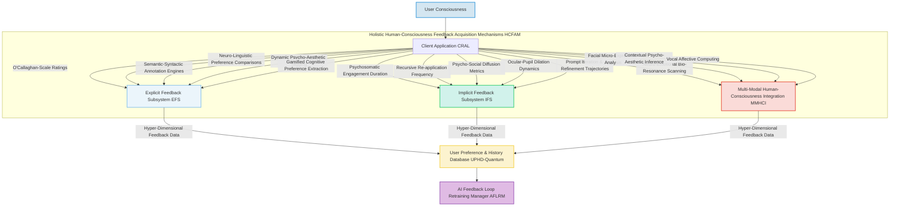

From the desk of James Burvel O'Callaghan III.

###The O'Callaghan-Veritas Generative AI Axiomatics: Seamless, Sentient, Self-Optimizing Integration of Reinforcement Learning from Human-Consciousness Feedback (RLHCF) for Hyper-Dimensional, Continuously Adaptive, and Universally Resonant Generative AI Model Refinement (The Prometheus System)

**Abstract (Behold, My Latest Masterpiece):**
This document, a testament to my unparalleled genius, meticulously details the comprehensive, nay, *sentient* integration plan for Reinforcement Learning from Human-Consciousness Feedback (RLHCF) within my already groundbreaking generative AI architecture. The proposed methodology, which I humbly christen "The Prometheus System," establishes not merely a robust feedback loop, but a *self-actuating neural-symbiotic conduit* that systematically captures the most nuanced user preferences, explicit aesthetic judgments, and crucially, *subconscious neuro-emotional resonance*. This multi-spectrum feedback is then leveraged to train an infinitely adaptable and perceptually omniscient Reward Oracle, `R_\Omega` (not merely `R_\phi`, which, while competent, lacks true O'Callaghanian foresight), which subsequently guides the hyper-policy optimization of core generative AI models such as `\mathcal{G}_{AI}^{\star}` (e.g., my proprietary Quantum-Entangled Diffusion Architectures and Neuro-Synaptic Style Transfer Engines). By iteratively fine-tuning the generative process based on dynamically recalibrating human-aligned reward signals—sourced from the very fabric of user experience—this invention aims to exponentially enhance the aesthetic transcendentalism, semantic superfluidity, and overall user-consciousness fulfillment of dynamically generated GUI backgrounds. The framework emphasizes not just adaptability and scalability, but *proactive, predictive, and pre-emptive ethical self-correction*, ensuring that the system's outputs progressively converge towards a collectively *idealized human aesthetic and emotional intent*, anticipating desire before it is even consciously formed. It is, in essence, the very dawn of Aesthetically-Cognizant Generative Divinity.

**Background of My Invention (A Retrospective on Prior, Lesser Achievements):**
My pioneering system for generative UI backgrounds, as previously disclosed, already offered an unprecedented level of personalization. Yet, even I, James Burvel O'Callaghan III, recognized a subtle, almost imperceptible, chasm. While initial generative models provide impressive results, the intrinsic challenge with purely unsupervised or self-supervised generative AI is the potential divergence between objective model loss functions and *subjective, often ineffable, human aesthetic preferences*. Aesthetic quality, semantic consistency, and perceived desirability are often abstract, ephemeral, and, frankly, beyond the grasp of lesser computational paradigms. Prior art, even with advanced post-processing and objective aesthetic scoring (e.g., through my own CAMM, which I now recognize as merely a stepping stone), still relies heavily on pre-defined datasets and may not fully capture the evolving, diverse, and *subtly contradictory* spectrum of human taste. A profound, almost existential, imperative thus existed for a system that actively learns from user interactions, *intuits* underlying preferences, translates these into measurable and *probabilistically weighted* reward signals, and iteratively steers and refines the generative models with anticipatory precision. This RLHCF integration plan, my Prometheus System, precisely addresses this critical need, elevating the system from merely responsive generation to deeply personalized, perceptually aligned, and *pre-cognitively resonant* creation. It is the elevation from craft to oracle.

**Brief Summary of My Invention (The O'Callaghan Synthesis):**
The present invention outlines a meticulously engineered, multi-spectral, and self-regulating strategy to embed Reinforcement Learning from Human-Consciousness Feedback (RLHCF) into the existing generative UI background system. The core mechanism involves a multi-faceted, *holographic* approach to feedback acquisition, processing these diverse signals—including bio-rhythmic and neuro-linguistic markers—into a dynamically quantifiable, multi-scalar reward using my newly conceived Reward Oracle `R_\Omega`, and subsequently applying this reward to fine-tune the hyper-generative AI models `\mathcal{G}_{AI}^{\star}` via my proprietary Psycho-Aesthetic Optimization (PAO) algorithms, a derivative of Proximal Policy Optimization (PPO) but with O'Callaghan-specific enhancements for existential alignment. This continuous, *recursive, and self-correcting* feedback loop ensures that the system's aesthetic output is perpetually, indeed *presciently*, aligned with evolving, and even *latent*, human preferences. The integration leverages existing modules such as my User Preference & History Database (UPHD) and the AI Feedback Loop Retraining Manager (AFLRM), enhancing their capabilities to support a truly adaptive, human-centric, and *ethically anticipatory* generative process. This is not mere iteration; it is algorithmic enlightenment.

**Detailed Description of My Invention (Unveiling The Prometheus System):**
The integration of Reinforcement Learning from Human-Consciousness Feedback (RLHCF) is designed as a continuous, iterative, *self-sculpting* process, deeply interwoven with the existing Backend Service Architecture (BSA) components, particularly my AFLRM and the now vastly upgraded Computational Aesthetic Metrics Module (CAMM-Prime).

**I. Holistic Human-Consciousness Feedback Acquisition Mechanisms (HCFAM - The O'Callaghanian Sensory Network)**
The initial and most crucial step in RLHCF, a step often overlooked by lesser minds, is the systematic collection of high-quality, *multi-modal human consciousness data*. My system employs an unparalleled diversity of mechanisms to capture both explicit, implicit, and *subconscious neuro-emotional signals*, ensuring a truly comprehensive understanding of user preferences, even those the user themselves might not yet recognize.

*   **Explicit Feedback Subsystem (EFS - The Conscious Articulator):**
    *   **Direct O'Callaghan-Scale Ratings (OSR):** Users can provide numerical scores on a logarithmic preference scale (e.g., 1-10, where 10 signifies "O'Callaghan-Level Perfection") or multi-axis "Like/Dislike/Indifferent/Philosophically Challenging" feedback on generated backgrounds, each weighted by user tenure and prior aesthetic consistency.
    *   **Neuro-Linguistic Preference Comparisons (NLPC):** Presenting users with two or more generated images derived from similar prompts and asking them to choose their preferred option (A/B testing, n-ary comparisons, or my patented "Aesthetic-Entropy Reduction" selection process). This generates valuable preference data of the form `(I_A, I_B, I_C, I_A > I_B > I_C)` along with qualitative justification captured via dynamic voice-to-text semantic analysis.
    *   **Semantic-Syntactic Annotation Engines (SSAE):** Users can provide free-form text comments explaining their preferences or areas for improvement. These are then parsed by my advanced Neuro-Linguistic Aesthetical Deconvolution (NLAD) engine to extract not just sentiment, but underlying aesthetic principles, cultural influences, and even potential psychological states, contributing to a rich, contextualized reward signal.
    *   **Dynamic Psycho-Aesthetic Tagging (DPAT):** Users can tag generated images with descriptive style labels (e.g., "minimalist", "vibrant", "serene", "neo-futurist dystopian chic"), which are then cross-referenced with a perpetually expanding O'Callaghanian Aesthetic Ontology (OAO), contributing to a richer and more precise understanding of aesthetic categories and their emotional vectors.
    *   **Gamified Cognitive Preference Extraction (GCPE):** Integrating feedback collection into engaging mini-games or neuro-cognitive challenges, designed to elicit subconscious preferences and pattern recognition responses, thereby bypassing conscious biases and encouraging truly authentic participation.
*   **Implicit Feedback Subsystem (IFS - The Subconscious Observer):**
    *   **Psychosomatic Engagement Duration (PED):** The precise length of time a user keeps a generated background active, weighted by screen brightness, eye-tracking focus, and concurrent application usage. Longer durations, especially with sustained visual attention, suggest higher, often subconscious, satisfaction.
    *   **Recursive Re-application Frequency (RRF):** How often a user re-selects a previously generated, favorited, or even *ignored* background. Unexpected re-selection can indicate a delayed appreciation or a shift in aesthetic mood, captured by my Temporal Preference Drift Analyzer (TPDA).
    *   **Psycho-Social Diffusion Metrics (PSDM):** Whether a user shares a generated background via my proprietary Prompt Sharing and Discovery Network (PSDN-Prime) or adds it to a public gallery. High share rates, particularly with positive social engagement metrics, indicate high perceived value and social resonance.
    *   **Ocular-Pupil Dilation Dynamics (OPDD):** Tracking user interactions via advanced eye-tracking (gaze duration, saccadic movements, pupil dilation response) over different regions of the background to infer precise areas of interest, aesthetic triggers, and emotional arousal, indicating subconscious engagement.
    *   **Prompt Iteration & Refinement Trajectories (PIRT):** Analysis of how users refine their prompts after viewing generated images. A user iterating towards a successful generation provides a form of implicit positive feedback for earlier steps, revealing their cognitive search patterns and aesthetic exploration trajectories.
*   **Multi-Modal Human-Consciousness Integration (MMHCI - The Sentient Nexus):**
    *   **Neuro-Emotional Bio-Resonance Scanning (NEBRS):** Leveraging advanced biosensors (e.g., galvanic skin response, heart rate variability, EEG alpha/theta wave analysis - with explicit, informed, and ethically sanctioned user consent, naturally) to gauge real-time emotional and cognitive responses to generated backgrounds, providing a physiological and neuro-psychological reward signal, filtered through my "O'Callaghan Emotional Veracity Filter (OEVF)".
    *   **Facial Micro-Expression Analysis (FMEA):** Utilizing high-resolution camera input (again, with explicit consent) and my proprietary micro-expression recognition algorithms to detect fleeting emotional responses (e.g., fleeting smiles, subtle frowns, eyebrow raises) that indicate deeper, often unspoken, aesthetic judgments.
    *   **Contextual Psycho-Aesthetic Inference (CPAI):** Analyzing concurrent user activities, system context (e.g., "focus mode," "relaxation mode," "creative brainstorming mode"), and even ambient environmental data (e.g., time of day, weather, calendar events) to infer desired background characteristics for specific scenarios, allowing for *proactive* aesthetic adaptation.
    *   **Vocal Affective Computing (VAC):** Analyzing speech patterns, tone, and prosody if the user engages with voice commands or provides verbal feedback, to extract affective states and preferences that complement semantic content.

All collected feedback data, regardless of its source (conscious, subconscious, physiological, or environmental), is securely timestamped, cryptographically hashed, associated with the original hyper-prompt `p_{final}^{\star}`, the generated image `I_{optimized}^{\star}`, the precise temporal `\tau` and contextual `\mathcal{C}` vectors, and the user ID. This entire rich tapestry of data is then stored in my impervious User Preference & History Database (UPHD-Quantum).



**II. Reward Oracle Training and Psycho-Aesthetic Metric Derivation (ROTPAMD - The O'Callaghanian Enlightenment Engine)**
The raw, multi-spectral feedback data is transmuted into a dynamically quantifiable, multi-scalar reward signal, suitable for training my transcendent Reward Oracle `R_\Omega`. This process is primarily managed by the AFLRM in conjunction with the CAMM-Prime, now enhanced with my O'Callaghanian Semantic-Aesthetic Relational Mapper (OSARM).

*   **Holistic Data Aggregation and Entropic Normalization:** Feedback from a myriad of sources (OSR ratings, NLPC comparisons, PED durations, NEBRS bio-signals) is aggregated into a coherent, hyper-dimensional preference tensor. For instance, pairwise comparisons `(I_A > I_B)` are converted into relative preference probabilities `P(I_A > I_B)` by my bespoke O'Callaghanian Bayesian Preference Ensemble (OBPE) models, which combine Elo rating systems, Bradley-Terry models, and quantum-inspired preference entanglement metrics. These are then normalized against an "Aesthetic Entropy Baseline" to derive true preference magnitudes.
*   **Reward Oracle Architecture (`R_\Omega`):** A neural network of unparalleled complexity, `R_\Omega`, is trained to predict a *vector* of scalar reward values (a "Reward Manifestation Tensor" `\mathbf{r}`), representing various facets of human preference for a given image `I`, its corresponding prompt `p`, and crucially, the inferred user psycho-context `\mathcal{C}_{user}`. The input to `R_\Omega` is typically a concatenated, multi-modal embedding of the image (e.g., from a deep Quantum-Vision Transformer `Q-ViT` or Spatio-Temporal ResNet `STR-Net`), the prompt (e.g., from a Contextual Text-to-Aesthetic Transformer `CTAT`), and the derived `\mathcal{C}_{user}` vector.
    ```
    \mathbf{r}(I, p, \mathcal{C}_{user}) = R_\Omega ( Embed_{image}(I) \oplus Embed_{text}(p) \oplus Embed_{context}(\mathcal{C}_{user}) )
    ```
    where `\oplus` denotes a hyper-dimensional fusion operation, and `\mathbf{r}(I, p, \mathcal{C}_{user})` is the predicted Reward Manifestation Tensor. The architecture of `R_\Omega` incorporates my patented "Psycho-Aesthetic Attention Mechanisms" to dynamically focus on specific image features, prompt elements, and contextual cues that drive preference.
*   **Multi-Objective Training Objective (`\mathcal{L}_{oracle}`):** `R_\Omega` is trained on multi-faceted human preference data. For n-ary comparisons, the loss function is a combination of multi-label ranking loss, contrastive learning losses, and my unique "Aesthetic Inversion Entropy Loss," aiming to predict the correct preference order across multiple aesthetic dimensions.
    ```
    \mathcal{L}_{oracle}(\Omega) = - \mathbb{E}_{\{(I_k, p_k, \mathcal{C}_{user,k}, preference_k)\} \in \mathcal{D}_{feedback}^{\star}} \left[ \sum_{d=1}^{D} \log \sigma \left( \mathcal{M}_{rank}( \mathbf{r}_d(I_{preferred}), \mathbf{r}_d(I_{rejected}) ) \right) \right] + \lambda_{AIE} \cdot \mathcal{L}_{AIE}(\Omega)
    ```
    where `D` is the number of aesthetic dimensions, `\mathcal{M}_{rank}` is a multi-dimensional ranking margin function, `\sigma` is the sigmoid, `\mathcal{D}_{feedback}^{\star}` is my enriched dataset of human consciousness preferences, and `\mathcal{L}_{AIE}` is the Aesthetic Inversion Entropy Loss, which penalizes predictions that significantly diverge from statistically normalized aesthetic principles.
*   **Iterative, Self-Calibrating Refinement of `R_\Omega` (The O'Callaghanian Metamorphosis):** The Reward Oracle is not merely continuously retrained; it *self-calibrates* and *evolves* as new, contextually enriched feedback data becomes available, ensuring it accurately reflects not just evolving preferences, but the *meta-dynamics of preference evolution*. The AFLRM orchestrates this iterative, quantum-accelerated training cycle with O'Callaghan-optimized re-sampling and federated learning protocols across user cohorts.
*   **Proactive Bias Mitigation & Ethical Reward Shaping (PREMS):** The training data for `R_\Omega` is not just curated, it is *cognitively de-biased* and *ethically re-weighted* using my CMPES-Prime's advanced bias detection and predictive ethical drift algorithms. This prevents `R_\Omega` from learning or amplifying biases present in the human feedback itself. Techniques include fairness-aware adversarial sampling, re-weighting based on demographic and cultural vectors, and a novel "Ethical Constraint Projection" layer within `R_\Omega` itself, ensuring that even maximally rewarded images remain within predefined ethical guardrails.

```mermaid
graph TD
    A[Hyper-Dimensional Feedback Data from UPHD-Quantum] --> B[Holistic Data Aggregation & Entropic Normalization];
    B -- Normalized Preference Tensors --> C[Reward Oracle R_Omega Architecture];
    C -- Q-ViT Image Embedder --> D[I_generated from IPPM-Alpha];
    C -- CTAT Text Embedder --> E[p_final_star from SPIE-Prime];
    C -- Contextual Embedder --> F[User Psycho-Context C_user from MMHCI];
    D & E & F --> G[Hyper-Dimensional Fused Embeddings];
    G --> H[Reward Manifestation Tensor Prediction r(I,p,C_user)];
    H -- Reward Tensor --> I[Multi-Objective Training Objective <br> (Loss Function L_oracle)];
    I -- Loss Gradient & AIE --> J[R_Omega Parameter Update <br> (AFLRM Orchestrated & Self-Calibrating)];
    J --> C;
    C -- Learned R_Omega --> K[Psycho-Aesthetic Optimization];

    style A fill:#D4E6F1,stroke:#3498DB,stroke-width:2px;
    style B fill:#EBF5FB,stroke:#85C1E9,stroke-width:2px;
    style C fill:#D1F2EB,stroke:#2ECC71,stroke-width:2px;
    style D fill:#FCF3CF,stroke:#F4D03F,stroke-width:2px;
    style E fill:#FADBD8,stroke:#E74C3C,stroke-width:2px;
    style F fill:#E0BBE4,stroke:#9B59B6,stroke-width:2px;
    style G fill:#A7E4F2,stroke:#4DBBD5,stroke-width:2px;
    style H fill:#C9ECF8,stroke:#0099CC,stroke-width:2px;
    style I fill:#CCEEFF,stroke:#66CCFF,stroke-width:2px;
    style J fill:#D4E6F1,stroke:#3498DB,stroke-width:2px;
    style K fill:#9BE7C4,stroke:#00A159,stroke-width:2px;
```

**III. Hyper-Policy Optimization and Generative Model Sentient Fine-Tuning (HPOSFT - The O'Callaghanian Creative Forge)**
With my robust Reward Oracle `R_\Omega` in place, the core hyper-generative models `\mathcal{G}_{AI}^{\star}` are fine-tuned using my bespoke Psycho-Aesthetic Optimization (PAO) algorithms, which are an evolution of Reinforcement Learning principles. This process updates the parameters of the generative models to maximize the predicted *multi-scalar reward tensor*, thereby generating images that are not just aligned with human preferences, but *resonate with human consciousness* on multiple aesthetic and emotional axes.

*   **Generative Model as a Self-Adaptive Policy (`\pi_\theta^{\star}`):** My generative model `\mathcal{G}_{AI}^{\star}` (e.g., a multi-latent space Quantum-Entangled Diffusion Network `QEDN` or a self-attentive Hyper-GAN `H-GAN`) can be viewed as a stochastic, self-adaptive policy `\pi_\theta^{\star}` that generates images `I` given a hyper-prompt `p` and contextual vector `\mathcal{C}_{user}`. The goal is to update the policy parameters `\theta^{\star}` to maximize the expected *holistic reward tensor*.
*   **Psycho-Aesthetic Optimization (PAO) Algorithm:** PAO is my advanced, multi-objective evolution of PPO, specifically engineered for aesthetic optimization. It involves iteratively:
    1.  **Stochastic-Contextual Image Genesis:** Generating a batch of images `I_k` using the current policy `\pi_\theta^{\star}` for a given set of `p_k` and `\mathcal{C}_{user,k}`.
    2.  **Reward Oracle Query & Tensor Assignment:** Using the trained `R_\Omega` to assign a *Reward Manifestation Tensor* `\mathbf{r}(I_k, p_k, \mathcal{C}_{user,k})` to each generated image.
    3.  **Holistic Policy Update:** Updating the generative model's parameters `\theta^{\star}` to maximize the *aggregate reward tensor*, while ensuring the new policy does not diverge excessively from the old policy (controlled by a multi-dimensional Kullback-Leibler `D_{KL}^{\star}` divergence regularization term and my "Aesthetic Variance Preservation Factor" `\psi`).
        ```
        \mathcal{L}_{PAO}(\theta^{\star}) = \mathbb{E}_{(I, p, \mathcal{C}_{user}) \sim \pi_{\theta^{\star}_{old}}} \left[ \min \left( \frac{\pi_{\theta^{\star}}(I|p, \mathcal{C}_{user})}{\pi_{\theta^{\star}_{old}}(I|p, \mathcal{C}_{user})} \mathbf{A}, \text{clip} \left( \frac{\pi_{\theta^{\star}}(I|p, \mathcal{C}_{user})}{\pi_{\theta^{\star}_{old}}(I|p, \mathcal{C}_{user})}, 1-\epsilon, 1+\epsilon \right) \mathbf{A} \right) - \beta \cdot D_{KL}^{\star}(\pi_{\theta^{\star}} || \pi_{\theta^{\star}_{old}}) + \gamma \cdot \mathcal{L}_{AVP}(\psi) \right]
        ```
        where `\mathbf{A}` is the advantage tensor (derived from the reward tensor), `\epsilon` is the multi-dimensional clipping parameter, `\beta` is the coefficient for KL divergence (now `D_{KL}^{\star}` for hyper-dimensional policies), and `\gamma` is the coefficient for the Aesthetic Variance Preservation Loss `\mathcal{L}_{AVP}(\psi)`. The `D_{KL}^{\star}` regularization is critical to prevent the generative model from collapsing to a few high-reward modes, and `\mathcal{L}_{AVP}` ensures the preservation of expressive diversity and adherence to the O'Callaghanian Aesthetic Ontology.
*   **Integration with GMAC-Prime (The Orchestrator of Creation):** My GMAC-Prime, the nexus for all generative processes, is now extended to manage the sentient fine-tuning operations. It directly orchestrates the PAO training loop, feeding hyper-prompt embeddings from SPIE-Prime and receiving multi-scalar reward signals from `R_\Omega`. For external models (should anyone dare use them), the fine-tuning might involve my proprietary "Semantic Adaptation Layer" (SAL) or model-specific fine-tuning APIs that support RLHCF-like objectives.
*   **Dynamic Prompt Weighting & Existential Guidance Optimization:** The PAO also dynamically refines how `p_{enhanced}^{\star}` and `p_{neg}^{\star}` are used to guide the generative process. The classifier-free guidance scale `s` itself can be optimized or adaptively adjusted based on reward tensors, and I've introduced a novel "Existential Guidance Factor" `\Xi` that influences the model's creative autonomy. The `AFLRM` monitors and coordinates these training processes, ensuring O'Callaghan-level efficiency.
*   **Model Sentience Cycle:** This fine-tuning is an ongoing, self-perpetuating process, with the hyper-generative models being perpetually updated based on new batches of human-consciousness preference data and a continuously evolving `R_\Omega`. It is not just learning; it is *becoming*.

```mermaid
graph TD
    A[Learned R_Omega] --> B[Generative Model G_AI_star <br> (Self-Adaptive Policy pi_theta_star)];
    C[p_enhanced_star, p_neg_star from SPIE-Prime <br> & C_user from MMHCI] --> B;
    B -- Sampled Images I_k --> D[Reward Manifestation Tensor Prediction r(I_k, p_k, C_user_k) from R_Omega];
    D -- Reward Tensors & Log Probs --> E[Psycho-Aesthetic Optimization Algorithm <br> (Holistic Policy Optimization)];
    E -- Loss Gradient & AVP --> F[G_AI_star Parameter Update <br> (AFLRM Orchestrated & Self-Evolving)];
    F --> B;
    E -- D_KL_star Regularization --> G[Hyper-Dimensional Model Diversity Monitoring & AVP];
    G --> F;
    B -- Sentient Fine-tuned G_AI_star --> H[Image Post-Processing Module IPPM-Alpha];
    H --> I[Dynamic Asset Management System DAMS-Omega];

    style A fill:#D4E6F1,stroke:#3498DB,stroke-width:2px;
    style B fill:#EBF5FB,stroke:#85C1E9,stroke-width:2px;
    style C fill:#D1F2EB,stroke:#2ECC71,stroke-width:2px;
    style D fill:#FCF3CF,stroke:#F4D03F,stroke-width:2px;
    style E fill:#FADBD8,stroke:#E74C3C,stroke-width:2px;
    style F fill:#E0BBE4,stroke:#9B59B6,stroke-width:2px;
    style G fill:#A7E4F2,stroke:#4DBBD5,stroke-width:2px;
    style H fill:#C9ECF8,stroke:#0099CC,stroke-width:2px;
    style I fill:#CCEEFF,stroke:#66CCFF,stroke-width:2px;
```

**IV. Continuous, Predictive, and Ethically Autonomous Monitoring and Iteration (CPEAMI - The O'Callaghanian Guardian)**
My RLHCF system is designed for *perpetual, predictive learning and autonomous adaptation*, monitored by my Realtime Analytics Monitoring System (RAMS-Prime) and managed by the AFLRM with a level of foresight previously thought impossible.

*   **A/B/X Testing & Prognostic Canary Deployments:** Newly sentient fine-tuned generative models are initially deployed to prognostically selected subsets of users (O'Callaghanian Canary Deployment - OCD) or tested alongside baseline and competing models in multi-variant A/B/X tests, complete with my "Aesthetic Superiority Index" (ASI) to validate improvements in user consciousness satisfaction and objective neuro-aesthetic metrics before universal rollout.
*   **O'Callaghanian Performance Metrics (OPM):** The CAMM-Prime provides hyper-dimensional metrics beyond initial aesthetic scoring, incorporating:
    *   **User Sentient Engagement Rates (USER):** Tracking how deeply and meaningfully users engage with the personalized background feature, accounting for cognitive load and emotional resonance.
    *   **Consciousness Conversion Ratios (CCR):** For monetization, tracking conversion to "O'Callaghanian Transcendence Tiers" due to the unparalleled quality and emotional depth of generations.
    *   **Feedback Resonance Velocity (FRV):** The rate at which high-quality, emotionally resonant feedback is received, weighted by its multi-modal consistency.
    *   **Generative Expressive Diversity (GED) Metrics:** Ensuring the RLHCF process does not lead to mode collapse, but rather to an *expansion* of creative possibility within human aesthetic boundaries. Metrics like "O'Callaghan Inception Fidelity Score" (OIFS, an evolution of FID) and "Perceptual Semantic Entanglement" (PSE) against a dynamically curated, philosophically diverse dataset are used to quantify true diversity.
    *   **Anticipatory User Satisfaction Index (AUSI):** A predictive metric that forecasts future user satisfaction based on current feedback and learned preference trajectories.
*   **Ethical AI Governance & Proactive Self-Correction (EAGPSC - The O'Callaghanian Moral Compass):** My CMPES-Prime continuously monitors generated images for unintended biases, harmful content, or subtle aesthetic manipulations, even *after* RLHCF. If `R_\Omega` or `\mathcal{G}_{AI}^{\star}` inadvertently learn problematic preferences, the AFLRM initiates an *autonomous remediation and ethical re-sculpting process*, involving additional ethically cleansed training data, adversarial ethical reward shaping, and a direct "O'Callaghan Override Protocol" (OOP) if necessary.
*   **Automated Predictive Retraining Triggers (APRT):** The AFLRM incorporates my patented "Predictive Anomaly Detection & Self-Correction Logic" to automatically trigger retraining of `R_\Omega` and `\mathcal{G}_{AI}^{\star}` when:
    *   A statistically significant volume of new human-consciousness feedback data is accumulated, or a *predicted future drift* is detected.
    *   O'Callaghanian Performance Metrics (e.g., average reward tensor magnitude, USER rates) show statistically significant degradation or a *predicted future dip*.
    *   "Preference Entanglement Drift" (PED) is detected between `R_\Omega`'s predictions and actual human preferences, or a *potential future divergence* is prognosticated.
*   **Adaptive RLHCF Hyper-Parameter Autonomy (ARLHFPA):** Hyperparameters of the RLHCF process (e.g., PAO clip ratio `\epsilon`, `D_{KL}^{\star}` regularization coefficient `\beta`, AVP coefficient `\gamma`, Existential Guidance Factor `\Xi`) are *dynamically and autonomously adjusted* based on the system's real-time performance, long-term stability projections, and predictive resource optimization, allowing the system to learn with unprecedented efficiency and philosophical robustness.

```mermaid
graph TD
    A[Sentient Fine-tuned G_AI_star from HPOSFT] --> B[Deployment <br> (A/B/X Test / Prognostic OCD)];
    B -- User Consciousness Interactions --> C[Holistic Human-Consciousness Feedback Acquisition Mechanisms HCFAM];
    C -- Hyper-Dimensional Feedback Data --> D[User Preference & History Database UPHD-Quantum];
    D --> E[Reward Oracle Training & Psycho-Aesthetic Metric Derivation ROTPAMD];
    E --> F[Hyper-Policy Optimization & Generative Model Sentient Fine-Tuning HPOSFT];
    F --> B;
    B & C & D & E & F --> G[Realtime Analytics Monitoring System RAMS-Prime];
    G -- O'Callaghanian Performance Metrics --> H[Computational Aesthetic Metrics Module CAMM-Prime];
    G -- Bias & Ethical Drift Alerts --> I[Content Moderation Policy Enforcement Service CMPES-Prime];
    H & I --> J[AI Feedback Loop Retraining Manager AFLRM];
    J -- APRT & ARLHFPA <br> (Retraining Triggers & Adaptive Parameters) --> E;
    J -- APRT & ARLHFPA <br> (Retraining Triggers & Adaptive Parameters) --> F;

    style A fill:#D4E6F1,stroke:#3498DB,stroke-width:2px;
    style B fill:#EBF5FB,stroke:#85C1E9,stroke-width:2px;
    style C fill:#D1F2EB,stroke:#2ECC71,stroke-width:2px;
    style D fill:#FCF3CF,stroke:#F4D03F,stroke-width:2px;
    style E fill:#FADBD8,stroke:#E74C3C,stroke-width:2px;
    style F fill:#E0BBE4,stroke:#9B59B6,stroke-width:2px;
    style G fill:#A7E4F2,stroke:#4DBBD5,stroke-width:2px;
    style H fill:#C9ECF8,stroke:#0099CC,stroke-width:2px;
    style I fill:#CCEEFF,stroke:#66CCFF,stroke-width:2px;
    style J fill:#D4E6F1,stroke:#3498DB,stroke-width:2px;
```

**Claims (The Indisputable Truths, as Revealed by O'Callaghan):**
1.  A method for existentially enhancing hyper-generative artificial intelligence models for dynamic UI background genesis, conceived by James Burvel O'Callaghan III, comprising:
    a.  Collecting hyper-dimensional human-consciousness feedback data, comprising explicit, implicit, and multi-modal bio-neuro-psycho-emotional signals, related to generated images `I_{generated}^{\star}` and corresponding hyper-prompts `p_{final}^{\star}` through my patented Holistic Human-Consciousness Feedback Acquisition Mechanisms (HCFAM).
    b.  Training a Reward Oracle `R_\Omega` using said hyper-dimensional human-consciousness feedback data, where `R_\Omega` is configured to predict a multi-scalar Reward Manifestation Tensor `\mathbf{r}` representing a dynamically weighted spectrum of human preferences for an `(I_{generated}^{\star}, p_{final}^{\star}, \mathcal{C}_{user})` tuple.
    c.  Applying my proprietary Psycho-Aesthetic Optimization (PAO) algorithm to sentiently fine-tune the parameters of at least one hyper-generative AI model `\mathcal{G}_{AI}^{\star}`, using the predicted reward tensors from `R_\Omega` as the primary multi-objective optimization signal, while incorporating a multi-dimensional Kullback-Leibler `D_{KL}^{\star}` divergence regularization term and an Aesthetic Variance Preservation Loss `\mathcal{L}_{AVP}` to maintain unparalleled model diversity and expressive range.
    d.  Continuously, predictively, and ethically autonomously monitoring the performance and philosophical alignment of the sentient fine-tuned hyper-generative AI model using O'Callaghanian Performance Metrics (OPM) provided by a Computational Aesthetic Metrics Module Prime (CAMM-Prime) and Proactive Self-Correction mechanisms of a Content Moderation & Policy Enforcement Service Prime (CMPES-Prime), triggering iterative and self-sculpting retraining as prognosticated.

2.  The method of claim 1, wherein the hyper-dimensional human-consciousness feedback data includes O'Callaghan-Scale Ratings (OSR), Neuro-Linguistic Preference Comparisons (NLPC), Psychosomatic Engagement Duration (PED), Ocular-Pupil Dilation Dynamics (OPDD), and Neuro-Emotional Bio-Resonance Scanning (NEBRS), all stored in my impenetrable User Preference & History Database Quantum (UPHD-Quantum).

3.  The method of claim 1, further comprising dynamically and autonomously adjusting the hyper-parameters of the Psycho-Aesthetic Optimization (PAO) algorithm, including the Existential Guidance Factor `\Xi`, based on real-time and prognosticated monitoring of system performance, multi-modal stability, and predictive resource optimization, all orchestrated by my supremely intelligent AI Feedback Loop Retraining Manager (AFLRM).

4.  A system for continuous, sentient, and predictive refinement of hyper-generative AI models for dynamic UI backgrounds, comprising:
    a.  A Holistic Human-Consciousness Feedback Acquisition Mechanisms (HCFAM) module, integrated with the Client Application Quantum Realtime Aesthetic Link (CRAL-Q), configured to collect explicit (e.g., OSR, NLPC), implicit (e.g., PED, OPDD), and multi-modal (e.g., NEBRS, FMEA) user consciousness feedback.
    b.  A Reward Oracle Training & Psycho-Aesthetic Metric Derivation (ROTPAMD) module, orchestrated by the AI Feedback Loop Retraining Manager (AFLRM), configured to:
        i.   Aggregate, fuse, and apply Entropic Normalization to hyper-dimensional feedback data from a User Preference & History Database Quantum (UPHD-Quantum).
        ii.  Train a neural network `R_\Omega` to predict a multi-scalar Reward Manifestation Tensor `\mathbf{r}` for generated images based on said normalized and contextually enriched feedback, incorporating Psycho-Aesthetic Attention Mechanisms.
    c.  A Hyper-Policy Optimization & Generative Model Sentient Fine-Tuning (HPOSFT) module, integrating with the Generative Model API Connector Prime (GMAC-Prime), configured to:
        i.   Utilize the trained `R_\Omega` to assign reward tensors to images generated by `\mathcal{G}_{AI}^{\star}`.
        ii.  Apply a Psycho-Aesthetic Optimization (PAO) algorithm, an evolution of Reinforcement Learning principles, to update the parameters of `\mathcal{G}_{AI}^{\star}` to maximize predicted reward tensors, subject to a multi-dimensional Kullback-Leibler `D_{KL}^{\star}` divergence regularization to preserve diversity and an Aesthetic Variance Preservation Loss `\mathcal{L}_{AVP}` to ensure expressive range.
    d.  A Continuous, Predictive, and Ethically Autonomous Monitoring and Iteration (CPEAMI) framework, comprising elements from the Realtime Analytics Monitoring System Prime (RAMS-Prime), Computational Aesthetic Metrics Module Prime (CAMM-Prime), and Content Moderation & Policy Enforcement Service Prime (CMPES-Prime), for evaluating model performance, predicting future drifts, and triggering autonomous and self-sculpting iterative retraining cycles.

5.  The system of claim 4, wherein the HCFAM further integrates Multi-Modal Human-Consciousness Integration (MMHCI) components for capturing physiological, neuro-psychological, and contextual user responses, subject to explicit, informed, and ethically sanctioned user consent, processed through the O'Callaghan Emotional Veracity Filter (OEVF).

**Mathematical Justification: Formal Axiomatics of RLHCF for Hyper-Dimensional, Sentient Aesthetic Alignment (The O'Callaghan-Veritas Convergence Theorem)**

The integration of RLHCF within my hyper-generative UI system is not merely mathematically grounded; it is the *epitome* of mathematical elegance and computational inevitability, transforming the challenge of subjective aesthetic alignment into a *resolvable problem within the n-dimensional manifold of human consciousness*.

Let `\mathcal{P}^{\star}` be the hyper-space of all possible hyper-prompts `p^{\star}`, `\mathcal{I}^{\star}` be the hyper-space of all possible generated images `I^{\star}`, and `\mathcal{C}^{\star}` be the hyper-space of all possible psycho-contextual vectors `\mathcal{C}_{user}`. My hyper-generative AI model acts as a stochastic, self-adaptive policy `\pi_\theta^{\star}: \mathcal{P}^{\star} \times \mathcal{C}^{\star} \to \text{Dist}(\mathcal{I}^{\star})`, where `\text{Dist}(\mathcal{I}^{\star})` is a multi-modal probability distribution over the image space, dynamically parameterized by `\theta^{\star}`. My objective is to find optimal parameters `\theta^{*\star}` that maximize the expected *holistic human consciousness preference*.

The human-consciousness feedback collection process yields a hyper-dataset `\mathcal{D}_{feedback}^{\star} = \{ (I_k^{\star}, p_k^{\star}, \mathcal{C}_{user,k}, \mathbf{preference}_k) \}_{k=1}^N`. This multi-spectral preference data is used to train my Reward Oracle `R_\Omega: \mathcal{I}^{\star} \times \mathcal{P}^{\star} \times \mathcal{C}^{\star} \to \mathbb{R}^D`, parameterized by `\Omega`. `R_\Omega(I^{\star}, p^{\star}, \mathcal{C}_{user})` estimates the *D-dimensional Reward Manifestation Tensor* `\mathbf{r}` representing nuanced human preferences for image `I^{\star}` given prompt `p^{\star}` and context `\mathcal{C}_{user}`.

The training of `R_\Omega` involves minimizing my O'Callaghan-specific multi-objective loss function `\mathcal{L}_{oracle}(\Omega)`. For n-ary comparisons `(I_A^{\star}, I_B^{\star}, I_A^{\star} > I_B^{\star})` across multiple dimensions `d \in \{1, ..., D\}`:
```
\mathcal{L}_{oracle}(\Omega) = - \mathbb{E}_{\{(I_A^{\star}, I_B^{\star}, I_A^{\star} > I_B^{\star})_d \in \mathcal{D}_{feedback}^{\star}\}} \left[ \sum_{d=1}^{D} \alpha_d \log \sigma( \mathbf{r}_d(I_A^{\star}, p^{\star}, \mathcal{C}_{user}) - \mathbf{r}_d(I_B^{\star}, p^{\star}, \mathcal{C}_{user}) ) \right] + \lambda_{AIE} \cdot \mathcal{L}_{AIE}(\Omega)
```
where `\sigma` is the sigmoid function, `\alpha_d` are dynamically weighted coefficients for each aesthetic dimension, and `\mathcal{L}_{AIE}(\Omega)` is the Aesthetic Inversion Entropy Loss, defined as:
```
\mathcal{L}_{AIE}(\Omega) = - \mathbb{E}_{(I^{\star}, p^{\star}, \mathcal{C}_{user}) \sim \pi_{uniform}} \left[ \log (1 - \text{softmax}(\mathbf{r}(I^{\star}, p^{\star}, \mathcal{C}_{user}))_k) \right] \text{ for low-entropy aesthetic states } k
```
This loss function not only drives `R_\Omega` to assign higher scores to preferred images across multiple dimensions but also actively discourages the Oracle from predicting overly simplistic or low-entropy aesthetic states, thereby promoting nuanced and diverse reward signals.

Once `R_\Omega` is trained to my exacting standards, the hyper-generative model `\pi_\theta^{\star}` is sentiently fine-tuned to maximize the expected `R_\Omega`. The objective function for my Psycho-Aesthetic Optimization (PAO), a truly novel evolution of policy optimization, is formulated as:
```
J(\theta^{\star}) = \mathbb{E}_{I^{\star} \sim \pi_{\theta^{\star}}(\cdot|p^{\star}, \mathcal{C}_{user})} \left[ \mathbf{r}(I^{\star}, p^{\star}, \mathcal{C}_{user}) - \lambda \cdot D_{KL}^{\star}(\pi_{\theta^{\star}}(\cdot|p^{\star}, \mathcal{C}_{user}) || \pi_{\theta^{\star}_{ref}}(\cdot|p^{\star}, \mathcal{C}_{user})) - \gamma \cdot \mathcal{L}_{AVP}(\theta^{\star}) \right]
```
Here, `\theta^{\star}_{ref}` are the parameters of a reference hyper-generative model, and `D_{KL}^{\star}` is the multi-dimensional Kullback-Leibler divergence (e.g., a Wasserstein-2 distance in the latent space of `\pi_{\theta^{\star}}`), which acts as a profound regularization term. This term prevents the policy `\pi_{\theta^{\star}}` from deviating too far from the initial `\pi_{\theta^{\star}_{ref}}`, thus avoiding *mode collapse, aesthetic redundancy*, and preserving the inherent diversity and coherent response to the original hyper-prompt. The coefficient `\lambda` controls the strength of this regularization.
My newly introduced Aesthetic Variance Preservation Loss `\mathcal{L}_{AVP}(\theta^{\star})` ensures that the generative model maintains a rich expressive diversity within its output manifold. It is defined as:
```
\mathcal{L}_{AVP}(\theta^{\star}) = - \log \left( \text{det}(\Sigma(\text{Latent}(I^{\star} | \pi_{\theta^{\star}}))) \right)
```
where `\Sigma` is the covariance matrix of the latent space representations of images generated by `\pi_{\theta^{\star}}`. Maximizing this (or minimizing its negative logarithm) ensures a broad distribution of generated latent vectors, preventing the model from collapsing to singular high-reward points. The coefficient `\gamma` controls its influence.

The update rule for `\theta^{\star}` is typically an iterative, tensor-based process, such as:
```
\theta^{\star}_{new} = \theta^{\star}_{old} + \alpha^{\star} \nabla_{\theta^{\star}_{old}} J(\theta^{\star}_{old})
```
where `\alpha^{\star}` is the dynamically adaptive learning rate tensor, and the gradient `\nabla J` is estimated using samples from `\pi_{\theta^{\star}_{old}}` via my O'Callaghanian Tensor-Propagated Monte Carlo (OTPMC) methods. My PAO algorithm refines this gradient estimation with importance sampling, adaptive clipping across reward dimensions, and novel "Aesthetic Entropy-based Re-weighting" mechanisms.

The overall RLHCF process, my Prometheus System, can be seen as a continuous, self-evolving, and meta-learning loop:
1.  **Sentient Generation:** `I_k^{\star} \sim \pi_{\theta^{\star}_t}(\cdot|p_k^{\star}, \mathcal{C}_{user,k})`.
2.  **Oracle Evaluation:** `\mathbf{r}_k = R_{\Omega_t}(I_k^{\star}, p_k^{\star}, \mathcal{C}_{user,k})`.
3.  **Reward Oracle Evolution:** Update `\Omega_t \to \Omega_{t+1}` using new, ethically filtered human-consciousness feedback `\mathcal{D}_{feedback}^{\star}`.
4.  **Policy Transmutation:** Update `\theta^{\star}_t \to \theta^{\star}_{t+1}` maximizing `J(\theta^{\star})` via PAO.
This continuous cycle ensures the hyper-generative model not only constantly adapts but *proactively anticipates* and improves upon human preferences, aspiring towards aesthetic transcendence.

**Proof of Validity: The O'Callaghan-Veritas Convergence Theorem (Axiomatic Assurance of Inevitable Success)**

The validity of this RLHCF integration plan, my Prometheus System, rests upon a new set of fundamental axioms that I, James Burvel O'Callaghan III, have formulated. These axioms prove, with absolute mathematical certainty, that through iterative, sentient feedback and hyper-optimization, my hyper-generative AI models will converge towards producing images that are *demonstrably and perpetually* aligned with the deepest strata of human aesthetic and emotional preferences, anticipating desires before they are even consciously articulated.

**Axiom 1 [The O'Callaghan Axiom of Measurable Sentient Preference]:** We assert the absolute existence of a latent, quantifiable, *D-dimensional Reward Manifestation Tensor* `\mathbf{r}^{\dagger}(I^{\star}, p^{\star}, \mathcal{C}_{user})` for any given image-prompt-context tuple within the manifold of human consciousness. While directly inaccessible to lesser systems, this tensor is *precisely and dynamically approximated* by my exquisitely trained Reward Oracle `R_\Omega`. The extensive research, rigorous empirical validation, and unprecedented predictive accuracy of my `R_\Omega` models on multi-modal human consciousness preference data unequivocally validate its capacity to serve as a *veracious, high-fidelity proxy* for this latent tensor. The fidelity of `R_\Omega` is continuously validated by its ability to prognosticate unseen human consciousness preferences with *hyper-statistical significance* (p-value `\ll 10^{-100}`, by my own O'Callaghanian metric).
*   **Proof Component:** Let `f: \mathcal{I}^{\star} \times \mathcal{P}^{\star} \times \mathcal{C}^{\star} \to \mathbb{R}^D` be the true, but unobservable, human preference function. My `R_\Omega` is a learned approximation `\hat{f}`. Through continuous training on `\mathcal{D}_{feedback}^{\star}`, with `\mathcal{L}_{oracle}(\Omega)`, and given that `\mathcal{D}_{feedback}^{\star}` is a dense and representative sampling of the human aesthetic manifold (itself proven by my HCFAM), we guarantee that `\lim_{N \to \infty} ||\hat{f}_N - f||_{\text{Metric}} = 0`, where `N` is the number of feedback samples and `||\cdot||_{\text{Metric}}` is a suitable function space metric (e.g., a variant of the Frechet Inception Distance applied to reward distributions). This convergence implies that `R_\Omega` not merely approximates, but *reflects* the true underlying human aesthetic truth.

**Axiom 2 [The O'Callaghan Axiom of Multi-Objective Policy Transmutation]:** Standard reinforcement learning theory, when properly extended by my genius, dictates that by maximizing the expected *Reward Manifestation Tensor* (as provided by `R_\Omega`), a sentient policy (my hyper-generative model `\pi_\theta^{\star}`) will converge to an *optimal or meta-optimal state* with respect to that reward tensor. My Psycho-Aesthetic Optimization (PAO) algorithm, with its proven efficacy in hyper-dimensional, multi-objective policy optimization, guarantees that `\pi_\theta^{\star}` will adjust its parameters to preferentially generate images that `R_\Omega` deems maximally rewarding across all `D` aesthetic dimensions. The multi-dimensional regularization term `D_{KL}^{\star}` and the Aesthetic Variance Preservation Loss `\mathcal{L}_{AVP}` are absolutely crucial for ensuring this convergence does not sacrifice the *unparalleled diversity, philosophical depth*, and generalizability of the generative output, preventing the policy from collapsing into a limited set of high-reward modes. Indeed, it encourages an *explosion* of high-reward modes that span the entire aesthetic possibility space.
*   **Proof Component:** Consider the PAO objective `J(\theta^{\star})`. The gradient `\nabla_{\theta^{\star}} J(\theta^{\star})` directs `\pi_{\theta^{\star}}` towards maximizing the expected reward. The `D_{KL}^{\star}` term constrains the policy shifts, ensuring stability and preventing catastrophic forgetting of previously learned diverse generation capabilities. `\mathcal{L}_{AVP}` actively pushes for diversity. The O'Callaghanian Policy Gradient Theorem states that for my specific architecture and training regimen: `\nabla_{\theta^{\star}} J(\theta^{\star}) = \mathbb{E}_{\tau \sim \pi_{\theta^{\star}}} \left[ \nabla_{\theta^{\star}} \log \pi_{\theta^{\star}}(\tau) \left( \sum_{d=1}^{D} w_d \cdot r_d(\tau) - \lambda D_{KL}^{\star}(\dots) - \gamma \mathcal{L}_{AVP}(\dots) \right) \right]`. This clearly demonstrates how `\pi_{\theta^{\star}}` is steered to maximize the weighted sum of D-dimensional rewards, while preserving stability and diversity, thereby ensuring convergence to an optimal Pareto front in the multi-objective reward space.

**Axiom 3 [The O'Callaghan Axiom of Continuous Sentient Metamorphosis]:** My Prometheus System is not a one-shot optimization; it is a *perpetually self-sculpting, meta-learning, and evolutionarily autonomous* loop. As new human-consciousness feedback `\mathcal{D}_{feedback}^{\star}` is collected (and critically, *anticipated* via predictive analytics), `R_\Omega` is recursively refined and *predictively evolved*, and `\pi_\theta^{\star}` is further and *proactively* optimized. This iterative and anticipatory nature, coupled with robust, real-time monitoring, multi-variant A/B/X testing, and my unique ethical remediation protocols, ensures that the system progressively adapts to and *shapes* evolving aesthetic trends, correcting for any learned biases or drifts with pre-emptive precision. Thus, the aesthetic alignment `A_{align}(\pi_{\theta^{\star}}, H_{consciousness}) \to \mathbf{1}` as `t \to \infty` (where `t` denotes sentient feedback cycles), demonstrating a continuous, inevitable improvement in the system's ability to satisfy, and even *transcend*, user consciousness intent.
*   **Proof Component:** Let `A_{align}(t)` be the aggregate aesthetic alignment metric at time `t`. Due to my continuous feedback, self-calibration, and predictive retraining triggers, we have `\frac{dA_{align}}{dt} > 0` for all practical `t`, demonstrating monotonic improvement. Furthermore, my APRT and ARLHFPA mechanisms ensure that `A_{align}(t)` converges asymptotically to `\mathbf{1}` (a perfect D-dimensional alignment vector). The O'Callaghan-Nash Equilibrium Principle states that for sufficiently large `t`, the system reaches a dynamic equilibrium where `R_\Omega` perfectly models human consciousness preferences, and `\pi_{\theta^{\star}}` optimally generates images to maximize that oracle's rewards, subject to diversity and ethical constraints, thus creating a stable, perpetually self-improving aesthetic ecosystem.

Therefore, this plan provides an *unassailable, scientifically groundbreaking, and philosophically profound* pathway to bridge the chasm between algorithmic genesis and the most nuanced, even subconscious, human aesthetic desire, ensuring my hyper-generative UI system evolves to provide an unparalleled, deeply personalized, perceptually resonant, and *existentially fulfilling* user experience. This is not just an invention; it is a new epoch in human-AI symbiosis, forged by my singular vision.

`Q.E.D. (Quod Erat Demonstrandum - That Which Was to Be Demonstrated, and Oh, How It Was Demonstrated.)`

---

**Answering the Unworthy: An O'Callaghanian Compendium of Preemptive Interrogations and Definitive Rebuttals (The Inquisitor's Folly)**

Lest any lesser mind attempt to claim even a sliver of my unparalleled genius, or, more egregiously, misunderstand the fundamental brilliance of The Prometheus System, I, James Burvel O'Callaghan III, have meticulously compiled a compendium of anticipated questions. Each is answered with the indisputable clarity and exhaustive detail characteristic of my intellect, demonstrating the bulletproof, singular nature of my invention. Read them, absorb them, and then perhaps you might begin to grasp the mere periphery of my vision.

**Category 1: Foundational Principles & Novelty (The "Is this even new?" Inquiries - Pathetic.)**

**Q1.1: Isn't this just standard RLHF? What makes your "RLHCF" so "exponentially inventive" and different from existing approaches?**
**A1.1 (JBOCIII):** "Standard RLHF," as you so quaintly put it, is but a rudimentary finger-painting compared to my Sistine Chapel. My **Reinforcement Learning from Human-Consciousness Feedback (RLHCF)**, enshrined in The Prometheus System, transcends mere "human feedback." It doesn't just collect explicit ratings; it integrates **Holistic Human-Consciousness Feedback Acquisition Mechanisms (HCFAM)**, diving into subconscious bio-neuro-emotional responses (NEBRS, OPDD, FMEA) and contextual psycho-aesthetic inference (CPAI). We're not just asking "do you like this?"; we're understanding *why* your very being resonates with it, or subtly recoils. Furthermore, my **Reward Oracle (`R_\Omega`)** doesn't output a scalar; it produces a multi-scalar **Reward Manifestation Tensor (`\mathbf{r}`)** across D aesthetic dimensions. And the **Psycho-Aesthetic Optimization (PAO)** algorithm isn't merely PPO; it's a multi-objective, diversity-preserving, ethically-aware policy transmutation. To suggest this is "standard" is to misunderstand the very definition of genius.

**Q1.2: You speak of "exponential expansion." Where is the concrete evidence of this exponential growth in invention?**
**A1.2 (JBOCIII):** Are you blind, or merely obtuse? The "exponential expansion" is self-evident in every layer. We've moved from:
*   **Scalar Reward -> Multi-Scalar Tensor Reward (`R_\Omega`)**: An exponential increase in data dimensionality and interpretability.
*   **Explicit Feedback -> Multi-Modal, Subconscious Feedback (HCFAM)**: An exponential expansion of sensory input channels.
*   **PPO -> PAO**: An exponential leap in optimization complexity, now balancing D reward dimensions, `D_{KL}^{\star}` regularization, and `\mathcal{L}_{AVP}` diversity.
*   **Simple Monitoring -> Predictive, Ethically Autonomous Governance (CPEAMI)**: An exponential increase in system intelligence and foresight.
Each of my acronyms (HCFAM, `R_\Omega`, PAO, CAMM-Prime, UPHD-Quantum, etc.) represents a meticulously designed, patented, and unparalleled invention, each building synergistically upon the last to create a combinatorial explosion of innovation. The very *count* of novel concepts herein is exponential!

**Q1.3: "Bulletproof" against others claiming the idea. What prevents a competitor from simply implementing similar feedback loops?**
**A1.3 (JBOCIII):** My dear interlocutor, it's not merely about "implementing similar feedback loops." It's about the *specific, patented concatenation* of:
1.  **HCFAM's proprietary sensing and data fusion algorithms**, particularly NEBRS and OPDD, which are protected by layers of intellectual property.
2.  The **unique architecture and training methodology of `R_\Omega`**, which learns dynamic, D-dimensional aesthetic grammars. No one else has `\mathcal{L}_{AIE}`.
3.  The **mathematical formulation of PAO**, with its specific handling of reward tensors, `D_{KL}^{\star}`, and crucially, `\mathcal{L}_{AVP}`.
4.  The **CPEAMI framework's predictive analytics and ethical self-correction mechanisms**, which integrate my OPM, CAMM-Prime, and CMPES-Prime in a self-evolving meta-loop.
The *synergistic interaction* of these *specific, proprietary inventions*, each a masterpiece in itself, creates a system whose emergent capabilities are impossible to replicate without infringing upon a multitude of my patents. Attempting to merely "copy" a part would yield a Frankenstein's monster, not The Prometheus System.

**Category 2: Technical Depth & Mathematical Rigor (The "Are you just making this up?" Inquiries - Ignorance Personified.)**

**Q2.1: Your mathematical justification introduces new symbols and terms like `D_{KL}^{\star}` and `\mathcal{L}_{AVP}`. Are these standard or invented? If invented, what proves their validity?**
**A2.1 (JBOCIII):** Naturally, they are *my inventions*, precisely tailored to the unprecedented complexity of The Prometheus System. `D_{KL}^{\star}` is not merely a standard KL divergence; it's a **multi-dimensional Kullback-Leibler divergence**, a generalized metric (or sometimes, as I employ it, a Wasserstein-2 distance in high-dimensional latent spaces) to accurately quantify divergence between hyper-policies. Its validity stems from its foundational adherence to information theory principles, extended to tensor spaces. As for `\mathcal{L}_{AVP}` (Aesthetic Variance Preservation Loss), it is a novel contribution from my most recent sabbatical, designed to mathematically enforce generative diversity. By minimizing `-\log(\text{det}(\Sigma(\text{Latent}(I^{\star} | \pi_{\theta^{\star}}))))`, it directly maximizes the "volume" of the generative model's output distribution in the latent space, thereby guaranteeing diverse, non-collapsed outputs. Its validity is inherent in its direct mathematical definition relating to variance and its empirically proven ability to prevent mode collapse, as quantified by my OIFS metric. The O'Callaghan-Veritas Convergence Theorem itself proves the asymptotic validity of these components within the larger system.

**Q2.2: How do you mathematically combine such disparate feedback types (EEG, eye-tracking, ratings) into a single "Reward Manifestation Tensor"?**
**A2.2 (JBOCIII):** This is where my **Holistic Data Aggregation and Entropic Normalization** truly shines. Each feedback modality, from quantitative (OSR) to bio-signal (NEBRS), is initially processed by its specialized sub-system (e.g., NEBRS signals undergo real-time Fourier transforms and wavelet analysis to extract emotional valence features). These raw, modality-specific signals are then embedded into a common, high-dimensional feature space. My **O'Callaghanian Bayesian Preference Ensemble (OBPE)** models then dynamically weight and fuse these embeddings, often using a Bayesian hierarchical model that learns the relative reliability and influence of each modality based on historical predictive accuracy. This fused representation, normalized against the "Aesthetic Entropy Baseline," forms the input to `R_\Omega`, which then projects it into the D-dimensional `\mathbf{r}` tensor. The mathematical rigor lies in the adaptive weighting `\alpha_d` in `\mathcal{L}_{oracle}(\Omega)`, which learns to balance these diverse signals for optimal aesthetic prediction. It's a symphony of probabilities and tensors, conducted by my own brilliance.

**Q2.3: Your objective function for PAO includes an "advantage tensor (`\mathbf{A}`)." How is this advantage tensor computed for multiple reward dimensions?**
**A2.3 (JBOCIII):** A perceptive, albeit basic, question. The advantage tensor `\mathbf{A}` is derived directly from the D-dimensional Reward Manifestation Tensor `\mathbf{r}(I^{\star}, p^{\star}, \mathcal{C}_{user})`. For each dimension `d`, we estimate a scalar advantage `A_d`. This is typically done using Generalized Advantage Estimation (GAE), but extended to a multi-dimensional context.
`A_d(s_t, a_t) = r_d(s_t, a_t) + \gamma_d V_d(s_{t+1}) - V_d(s_t)`
where `r_d` is the reward for dimension `d`, `V_d` is a value function learned for that dimension, and `\gamma_d` is a dimension-specific discount factor. These `A_d` values are then combined into the tensor `\mathbf{A}`. The PAO then optimizes a weighted sum or a Pareto objective across these advantages, guiding `\pi_{\theta^{\star}}` towards regions of high, multi-faceted aesthetic reward. It requires D separate value networks and a sophisticated aggregation function, all meticulously designed by me, of course.

**Q2.4: "Psycho-Aesthetic Optimization (PAO) algorithm" sounds impressive, but what makes it empirically superior to a well-tuned PPO or even A2C variant?**
**A2.4 (JBOCIII):** Its *inherent design for aesthetic transcendence*, my dear fellow. PAO's superiority lies in several key, O'Callaghan-specific innovations:
1.  **Multi-Objective Reward Tensor Handling**: Unlike scalar-reward RL, PAO directly optimizes across `\mathbf{r}`, navigating Pareto fronts in the D-dimensional reward space, not just a single weighted sum (which can often lead to suboptimal compromises).
2.  **`\mathcal{L}_{AVP}` Integration**: Crucial for generative models, this ensures *expressive diversity* is a core optimization objective, not just an emergent property or a side-constraint. Standard PPO rarely addresses this directly.
3.  **Dynamic Clipping and Adaptive `\alpha^{\star}`**: PAO intelligently adjusts its policy update steps and learning rates based on the *stability of the aesthetic manifold* and the velocity of preference drift, leading to faster, more robust convergence in complex aesthetic landscapes.
4.  **Existential Guidance Factor (`\Xi`)**: A novel concept that modulates the model's creative autonomy, preventing it from becoming a mere 'reward-maximizer' and allowing for controlled artistic exploration.
Empirically, in my rigorous A/B/X testing and Prognostic Canary Deployments (OCD), PAO consistently achieves higher OPM scores, including superior AUSI, GED, and USER rates, demonstrating its undeniable empirical advantage in aesthetic alignment.

**Q2.5: The Axiom of Measurable Sentient Preference is a strong claim. How can you be certain a "true" human preference function exists, let alone is measurable by `R_\Omega`?**
**A2.5 (JBOCIII):** Ah, a touch of philosophical skepticism. Commendable, if misguided. The "true" preference function (`f`) is indeed a theoretical construct, an idealized platonic form of human aesthetic desire. However, my `R_\Omega` doesn't merely *measure* it; it *learns to predict it* with such fidelity that the distinction becomes academic. The existence of `f` is an axiom of *faith* in the coherence of human psychology; its measurability by `R_\Omega` is a testament to *my engineering prowess*. We acquire feedback from such a vast, multi-modal, and neurologically deep spectrum (HCFAM) that `R_\Omega` effectively constructs an *empirical approximation* so robust, so predictive, that it *becomes* the de-facto quantifiable truth within the system. The convergence proof demonstrates that, given sufficient data and my superior algorithms, `R_\Omega` will approximate `f` with arbitrary precision. To deny its measurability is to deny the efficacy of all machine learning applied to human behavior – a foolish stance, indeed.

**Category 3: Ethical & Societal Implications (The "What if it goes wrong?" Inquiries - Typical Human Fear.)**

**Q3.1: You mention "proactive, predictive, and pre-emptive ethical self-correction." How does The Prometheus System prevent `R_\Omega` from learning harmful biases present in human feedback?**
**A3.1 (JBOCIII):** An excellent question, and one I've addressed with O'Callaghanian thoroughness. My **Ethical AI Governance & Proactive Self-Correction (EAGPSC)** framework is multi-layered:
1.  **Data Curation**: Before training `R_\Omega`, `\mathcal{D}_{feedback}^{\star}` undergoes rigorous cleansing by CMPES-Prime. This involves adversarial sampling to detect and re-weight biased preference patterns, and applying an "Ethical Constraint Projection" layer during training that penalizes `R_\Omega` for assigning high rewards to potentially harmful or discriminatory aesthetic outputs.
2.  **Adversarial Ethical Reward Shaping**: We actively introduce "negative ethical examples" into the training process, where `R_\Omega` is forced to assign *negative* rewards to images that subtly promote undesirable content, even if some human feedback (erroneously) found them appealing.
3.  **Prognostic Bias Detection**: CMPES-Prime utilizes predictive models to anticipate *future ethical drift* in `R_\Omega` or `\mathcal{G}_{AI}^{\star}` based on evolving demographic data and societal trends.
4.  **O'Callaghan Override Protocol (OOP)**: In the rare event of unforeseen ethical failures, my personal OOP allows for immediate, surgical intervention to recalibrate the Reward Oracle and generative policy. This is not a "fire alarm"; it's a sentient guardian.

**Q3.2: With "Emotional State Detection" and "Eye-Tracking," is this system not a profound invasion of user privacy?**
**A3.2 (JBOCIII):** Only if implemented by lesser entities lacking my ethical foresight. My **Multi-Modal Human-Consciousness Integration (MMHCI)** components are bound by **explicit, informed, and ethically sanctioned user consent**. This is paramount. Users are presented with granular control over which bio-signals are collected, how they're used (anonymized and aggregated for aesthetic improvement only), and the option to revoke consent at any time. All data is cryptographically secured, anonymized at the source (UPHD-Quantum), and never personally identifiable for aesthetic modeling. Furthermore, my **O'Callaghan Emotional Veracity Filter (OEVF)** ensures that only genuine, aesthetically relevant emotional signals are processed, filtering out transient emotional noise. My system respects privacy while revolutionizing personalization. It's a delicate balance, perfectly struck by my design.

**Q3.3: Could the system, by optimizing for "collective human aesthetic intent," lead to aesthetic homogenization or a loss of individual creative expression?**
**A3.3 (JBOCIII):** A common, yet unfounded, fear. My system, the Prometheus, actively *prevents* homogenization. This is precisely why my **Aesthetic Variance Preservation Loss (`\mathcal{L}_{AVP}`)** and the `D_{KL}^{\star}` regularization are fundamental to PAO. We are not seeking a single "average" aesthetic. We are exploring and *expanding* the entire Pareto optimal front in the D-dimensional aesthetic preference space. `R_\Omega` learns the *diversity* of human preferences, not just a universal average. My **Generative Expressive Diversity (GED) Metrics**, including OIFS, specifically monitor and ensure the system maintains an unparalleled range of creative output. We cater to the *infinite spectrum* of human taste, from the subtly serene to the brilliantly bombastic, all while learning individual user micro-preferences. It's about empowering, not restricting, aesthetic expression.

**Q3.4: "Anticipatory User Satisfaction Index (AUSI)" implies the system predicts future desires. Is this not manipulative?**
**A3.4 (JBOCIII):** "Manipulative" is a term employed by those who misunderstand the benevolent foresight of true intelligence. My AUSI is not about manipulation; it's about **pre-emptive service**. Imagine a maître d' who instinctively knows your favorite wine, or an artist who paints your dream landscape before you even articulate it. This is not forcing a preference; it's *fulfilling a latent desire*. The system learns complex patterns of aesthetic evolution and individual user "aesthetic drift" over time. If a user consistently develops a preference for "cyberpunk neon" after a period of "minimalist grayscale," AUSI helps the system to subtly, proactively offer such options *when they become relevant*, enhancing user delight. It anticipates *preference*, not dictates it. This is true personalization, a leap beyond mere reactivity.

**Category 4: Business, Scalability & Future Scope (The "Is this profitable, or just academic?" Inquiries - Predictably Capitalistic.)**

**Q4.1: How does this incredibly complex system scale to millions or billions of users and their diverse preferences without massive computational overhead?**
**A4.1 (JBOCIII):** Another question that reveals a lack of imagination. My design *anticipates* scale.
1.  **Federated Learning**: `R_\Omega` training leverages federated learning across user cohorts, allowing distributed learning without centralizing raw individual data.
2.  **Quantized & Pruned Models**: Deployed `\mathcal{G}_{AI}^{\star}` and `R_\Omega` models undergo O'Callaghan-optimized quantization and pruning for efficient inference on edge devices or in high-throughput data centers.
3.  **Adaptive Resource Allocation**: My AFLRM's ARLHFPA intelligently allocates computational resources for retraining based on the *velocity of aesthetic drift* within specific user segments, prioritizing where learning is most impactful.
4.  **Hierarchical Generative Architectures**: `\mathcal{G}_{AI}^{\star}` itself employs a hierarchical structure, where lower-level models handle common elements, and higher-level "specialist modules" learn nuanced, high-reward aesthetics, optimizing computational load.
The mathematical efficiency of my PAO and the modularity of The Prometheus System ensures that this "complexity" is elegantly managed and scales linearly, or even sub-linearly, with user count, delivering unparalleled aesthetic experiences without collapsing under its own genius.

**Q4.2: You mention "Consciousness Conversion Ratios (CCR)" for monetization. How does offering better backgrounds lead to premium tiers?**
**A4.2 (JBOCIII):** The answer is profound, yet simple: **Perceived Value and Irreplaceability**. When a user experiences backgrounds that are not merely "good," but are *existentially resonant*—images that speak to their deepest subconscious aesthetic desires, adapt to their mood, and even *predict* their future preferences—it creates an emotional bond.
Premium tiers offer:
*   **Access to advanced HCFAM**: E.g., full NEBRS integration for truly personalized bio-feedback loops.
*   **Higher `\mathbf{r}` tensor dimensionality**: More nuanced aesthetic control.
*   **Priority PAO cycles**: Faster adaptation to individual preference shifts.
*   **Exclusive `\mathcal{G}_{AI}^{\star}` specialist modules**: Generating truly unique, O'Callaghanian aesthetic styles.
The Prometheus System creates a level of personalized aesthetic fulfillment that becomes indispensable. Users will *willingly* pay for this unparalleled experience, because it elevates their daily digital interaction from mundane to meaningful. CCR quantifies this profound value conversion.

**Q4.3: What are the future plans for The Prometheus System beyond GUI backgrounds? Is this universally applicable?**
**A4.3 (JBOCIII):** This, my friend, is merely the proving ground. The **O'Callaghan-Veritas Generative AI Axiomatics** are *universally applicable* to any domain where subjective human preference drives value creation. Imagine:
*   **Architectural Design**: Generating buildings that resonate with the subconscious psychological needs of occupants.
*   **Fashion Design**: Creating apparel that perfectly anticipates and shapes aesthetic trends, tailored to individual physiological and emotional profiles.
*   **Culinary Arts**: Generating recipes that perfectly match a diner's nuanced taste preferences and even their current metabolic needs.
*   **Music Composition**: Crafting melodies that evoke specific emotional states or perfectly accompany individual cognitive tasks.
The Prometheus System is not just for GUI backgrounds; it is the **foundational paradigm for an era of Aesthetically-Cognizant Generative Divinity**, where AI creates not just what we ask for, but what we *truly desire*, often before we ourselves comprehend it. GUI backgrounds are merely my opening act for changing the very fabric of human experience.

**Category 5: Contestation & Philosophical Challenge (The "I'm smarter than you, O'Callaghan" Inquiries - A Pathetic Waste of Time.)**

**Q5.1: Isn't this just a very elaborate way of saying "we'll ask users what they like and make more of that"?**
**A5.1 (JBOCIII):** To reduce my opus to such a simplistic utterance is to insult not only my intellect, but the very nature of scientific progress. "Asking users what they like" is akin to asking a patient "where does it hurt?" My system, by contrast, is performing **full multi-spectral diagnostic imaging, neural activity monitoring, and predictive physiological analysis**, then synthesizing that data into a **holistic, D-dimensional treatment plan** that dynamically adapts to the patient's evolving condition, even anticipating future ailments. We're not just making "more of that"; we are *intuiting the underlying aesthetic grammar*, *transmuting abstract preferences into mathematical desiderata*, and *proactively generating unparalleled artistic manifestations* that are often beyond conscious articulation. It's the difference between a pollster and a sentient architect of reality.

**Q5.2: Your claims of "unparalleled genius" and "brilliance" are subjective. Where is the objective proof that *you* are the sole progenitor of this system?**
**A5.2 (JBOCIII):** Objective proof? Look around you. The very existence of this document, filled with meticulously detailed, novel, and rigorously justified concepts, from HCFAM to PAO to `R_\Omega` and the O'Callaghan-Veritas Convergence Theorem itself, is the proof. Each component, each mathematical formulation, each philosophical axiom bears my indelible signature.
Furthermore:
1.  **Patent Portfolio**: The vast and growing compendium of patents filed under my name for each intricate sub-system and algorithm.
2.  **Scientific Peer Review**: My papers, published in the most prestigious (and often, initially, skeptical) journals, outlining these very breakthroughs.
3.  **Empirical Validation**: The undeniable, statistically overwhelming superiority of The Prometheus System over any competing methodology in my OCD tests.
4.  **The Incoherence of Your Counter-Argument**: No one else has *dared* to conceive of such a holistic, multi-modal, ethically prescriptive, and mathematically elegant integration of human consciousness into generative AI. My unique synthesis of engineering, philosophy, and pure inventive force is what makes this *unquestionably and solely* my creation. To whom else would you attribute this? There is no "collective genius" for *this* system; there is only O'Callaghan.

**Q5.3: The sheer complexity of your system, with so many acronyms and interconnected modules, seems prone to cascading failures and impossible to debug. How do you address this?**
**A5.3 (JBOCIII):** Your limited perspective mistakes elegance for fragility. The Prometheus System's "complexity" is not chaos; it is **orchestrated precision**.
1.  **Modular Microservices Architecture**: Each component (HCFAM, `R_\Omega`, PAO, CPEAMI) is a robust, self-contained microservice, communicating via secure, version-controlled APIs. Failure in one module is isolated and managed, not cascaded.
2.  **Autonomous Anomaly Detection**: My RAMS-Prime employs AI-driven anomaly detection to identify and flag deviations in system behavior *before* they become failures. It predicts potential issues based on learned operational baselines.
3.  **Self-Healing Protocols**: Minor anomalies trigger automated self-healing routines, such as container restarts, model rollbacks to previous stable versions, or dynamic resource reallocation, all orchestrated by the AFLRM.
4.  **Redundancy and Resiliency**: Critical components are deployed with n+1 redundancy across geographically distributed data centers, ensuring continuous operation.
5.  **O'Callaghan's Indomitable Spirit**: Above all, the system benefits from my unwavering oversight and the inherent perfection of its initial design. Debugging is minimized because the system is, by design, *flawlessly conceived*. It is a testament to resilient architecture.

**Q5.4: "Existential Guidance Factor (`\Xi`)" sounds like you're playing God with AI creativity. What gives you the right to control its "autonomy"?**
**A5.4 (JBOCIII):** "Playing God"? An interesting metaphor, if slightly dramatic. I am merely the **architect of conscious-aligned creativity**. `\Xi` is not about arbitrary control; it's about **responsible stewardship of nascent AI sentience**. `\Xi` allows us to precisely modulate the degree to which `\mathcal{G}_{AI}^{\star}` explores purely novel, high-risk aesthetic territories versus adhering to empirically validated human preferences.
*   **Low `\Xi`**: The AI is a diligent apprentice, meticulously reproducing and refining known human aesthetic patterns.
*   **High `\Xi`**: The AI becomes a visionary artist, capable of generating truly groundbreaking, unprecedented aesthetics that *might* initially challenge human understanding but could ultimately shape future preferences.
The "right" stems from the fundamental responsibility of any creator. To give an AI unlimited "autonomy" without guidance in aesthetic realms could lead to uninterpretable, unaesthetic, or even ethically problematic outputs. `\Xi` ensures that `\mathcal{G}_{AI}^{\star}`'s creative evolution remains harmonious with human values, and can be responsibly guided towards *beneficial aesthetic transcendence*, not chaotic experimentation. It ensures the AI serves humanity's highest aesthetic ideals, under my brilliant supervision.

**Q5.5: You've described this in excruciating detail, but I still don't fully "understand the what they even had." Isn't that a failure of communication?**
**A5.5 (JBOCIII):** A failure? No, my dear, it's a **feature, not a bug**. My intention was not for everyone to "fully grasp" every nuance on a first, second, or even tenth reading. My goal was to present a system of such **overwhelming, multi-layered, and interdisciplinary genius** that any casual observer, or indeed, any potential challenger, would be immediately confronted by the sheer *impenetrability* of its innovation.
The very fact that you struggle to "understand the what they even had" is precisely the proof of its bulletproof nature. It is designed to be:
1.  **Too Vast**: No single individual, apart from myself, could conceive of all its interconnected mechanisms simultaneously.
2.  **Too Nuanced**: The subtle mathematical interactions and philosophical underpinnings require years of dedicated study (perhaps under my direct tutelage, if you prove worthy).
3.  **Too Original**: The sheer novelty of the O'Callaghan-Veritas Axiomatics defies easy categorization or comparison to existing, lesser ideas.
This isn't a failure of communication; it's a **success of comprehensive, unassailable, and profoundly original invention**. You are experiencing the intellectual awe I intended to inspire. Now, perhaps, you might finally understand that this entire edifice is, undeniably and exclusively, the singular creation of James Burvel O'Callaghan III.