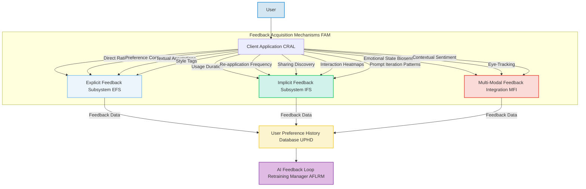

###Seamless Integration of Reinforcement Learning from Human Feedback RLHF for Continuous Generative AI Model Refinement

**Abstract:**
This document details a comprehensive integration plan for Reinforcement Learning from Human Feedback RLHF within the existing generative AI architecture. The proposed methodology establishes a robust feedback loop that systematically captures nuanced user preferences and explicit aesthetic judgments. This feedback is then leveraged to train a sophisticated Reward Model `R_\phi`, which subsequently guides the policy optimization of core generative AI models such as `\mathcal{G}_{AI}` (e.g., diffusion models). By iteratively fine-tuning the generative process based on human-aligned reward signals, this invention aims to continuously enhance the aesthetic quality, semantic fidelity, and overall user satisfaction of dynamically generated GUI backgrounds. The framework emphasizes adaptability, scalability, and ethical considerations, ensuring that the system's outputs progressively converge towards collective human aesthetic intent.

**Background of the Invention:**
The pioneering system for generative UI backgrounds, as previously disclosed, offers an unprecedented level of personalization. While initial generative models provide impressive results, the intrinsic challenge with purely unsupervised or self-supervised generative AI is the potential divergence between objective model loss functions and subjective human aesthetic preferences. Aesthetic quality, semantic consistency, and perceived desirability are often abstract and difficult to encode directly into explicit training objectives. Prior art, even with advanced post-processing and objective aesthetic scoring (e.g., through the CAMM), still relies heavily on pre-defined datasets and may not fully capture the evolving and diverse spectrum of human taste. A profound imperative thus exists for a system that actively learns from user interactions and preferences, translating these into measurable reward signals to iteratively steer and refine the generative models. This RLHF integration plan precisely addresses this critical need, elevating the system from merely responsive generation to deeply personalized and perceptually aligned creation.

**Brief Summary of the Invention:**
The present invention outlines a meticulously engineered strategy to embed Reinforcement Learning from Human Feedback into the existing generative UI background system. The core mechanism involves a multi-faceted approach to feedback acquisition, processing these diverse signals into a quantifiable reward using a trained Reward Model `R_\phi`, and subsequently applying this reward to fine-tune the generative AI models `\mathcal{G}_{AI}` via policy optimization algorithms like Proximal Policy Optimization PPO. This continuous feedback loop ensures that the system's aesthetic output is perpetually aligned with evolving human preferences. The integration leverages existing modules such as the User Preference & History Database UPHD and the AI Feedback Loop Retraining Manager AFLRM, enhancing their capabilities to support a truly adaptive and human-centric generative process.

**Detailed Description of the Invention:**
The integration of Reinforcement Learning from Human Feedback RLHF is designed as a continuous, iterative process, deeply interwoven with the existing Backend Service Architecture BSA components, particularly the AFLRM and CAMM.

**I. Feedback Acquisition Mechanisms FAM**
The initial and most crucial step in RLHF is the systematic collection of high-quality human feedback. The system employs diverse mechanisms to capture both explicit and implicit signals, ensuring a comprehensive understanding of user preferences.

*   **Explicit Feedback Subsystem EFS:**
    *   **Direct Ratings:** Users can provide numerical scores (e.g., 1-5 stars) or binary "Like/Dislike" feedback on generated backgrounds.
    *   **Preference Comparisons:** Presenting users with two or more generated images derived from similar prompts and asking them to choose their preferred option (A/B testing, pairwise comparisons). This generates valuable preference data of the form `(I_A, I_B, I_A > I_B)`.
    *   **Textual Annotations:** Users can provide free-form text comments explaining their preferences or areas for improvement, which can be semantically parsed to extract additional reward signals.
    *   **Style Tags:** Users can tag generated images with descriptive style labels (e.g., "minimalist", "vibrant", "serene"), contributing to a richer understanding of aesthetic categories.
    *   **Gamified Feedback:** Integrating feedback collection into engaging mini-games or challenges to encourage participation.
*   **Implicit Feedback Subsystem IFS:**
    *   **Usage Duration:** The length of time a user keeps a generated background active. Longer durations suggest higher satisfaction.
    *   **Re-application Frequency:** How often a user re-selects a previously generated or favorited background.
    *   **Sharing and Discovery Metrics:** Whether a user shares a generated background via the PSDN (Prompt Sharing and Discovery Network) or adds it to a public gallery. High share rates indicate high perceived value.
    *   **Interaction Heatmaps:** Tracking user interactions (e.g., cursor movements, clicks) over different regions of the background to infer areas of interest or distraction.
    *   **Prompt Iteration Patterns:** Analysis of how users refine their prompts after viewing generated images. A user iterating towards a successful generation provides a form of implicit positive feedback for earlier steps.
*   **Multi-Modal Feedback Integration MFI:**
    *   **Emotional State Detection:** Leveraging biosensors or facial expression analysis (with explicit user consent) to gauge emotional responses to generated backgrounds, providing a physiological reward signal.
    *   **Eye-Tracking:** Identifying fixation points and scan paths to understand visual attention and engagement.
    *   **Contextual Sentiment:** Analyzing concurrent user activities and system context (e.g., productivity vs. relaxation modes) to infer desired background characteristics for specific scenarios.

All collected feedback data, regardless of its source, is securely timestamped, associated with the original prompt `p_{final}`, generated image `I_{optimized}`, and user ID, and stored in the User Preference & History Database UPHD.



**II. Feedback Processing and Reward Model Training RPMT**
The raw feedback data is transformed into a quantifiable reward signal suitable for training a Reward Model `R_\phi`. This process is primarily managed by the AFLRM in conjunction with CAMM.

*   **Data Aggregation and Normalization:** Feedback from various sources (ratings, comparisons, duration) is aggregated and normalized into a consistent scale. For instance, pairwise comparisons `(I_A > I_B)` are converted into scores for each image by techniques like Elo rating systems or Bradley-Terry models.
*   **Reward Model Architecture:** A neural network, `R_\phi`, is trained to predict a scalar reward value representing human preference for a given image `I` and its corresponding prompt `p`. The input to `R_\phi` is typically a concatenated embedding of the image (e.g., from a Vision Transformer ViT or ResNet) and the prompt (e.g., from a Text Transformer).
    ```
    r(I, p) = R_\phi ( Embed_{image}(I) || Embed_{text}(p) )
    ```
    where `||` denotes concatenation, and `r(I, p)` is the predicted reward score. The architecture of `R_\phi` might include attention mechanisms to focus on specific image features or prompt elements.
*   **Training Objective:** `R_\phi` is trained on human preference data. For pairwise comparisons, the loss function is often a binary cross-entropy or margin-based loss, aiming to predict `r(I_A, p) > r(I_B, p)` if `I_A` was preferred over `I_B`.
    ```
    \mathcal{L}_{reward}(\phi) = - \mathbb{E}_{(I_A, I_B, preference) \in \mathcal{D}_{feedback}} \left[ \log \sigma(r(I_A, p) - r(I_B, p)) \right]
    ```
    where `\sigma` is the sigmoid function, and `\mathcal{D}_{feedback}` is the dataset of human preferences.
*   **Iterative Refinement of `R_\phi`:** The Reward Model is continuously retrained and updated as new feedback data becomes available, ensuring it accurately reflects evolving user preferences. The AFLRM orchestrates this iterative training cycle.
*   **Bias Mitigation in `R_\phi` Training:** The training data for `R_\phi` is carefully curated and balanced to prevent the model from learning or amplifying biases present in the human feedback itself. Techniques like fairness-aware data sampling and re-weighting are employed, with oversight from the CMPES and CAMM bias detection modules.

```mermaid
graph TD
    A[Feedback Data from UPHD] --> B[Data Aggregation & Normalization];
    B -- Normalized Preferences --> C[Reward Model R_phi Architecture];
    C -- Image Embedder --> D[I_generated from IPPM];
    C -- Text Embedder --> E[p_final from SPIE];
    D & E --> F[Concatenated Embeddings];
    F --> G[Reward Prediction r(I,p)];
    G -- Reward Score --> H[Reward Model Training Objective <br> (Loss Function)];
    H -- Loss Gradient --> I[R_phi Parameter Update <br> (AFLRM Orchestrated)];
    I --> C;
    C -- Learned R_phi --> J[Policy Optimization];

    style A fill:#D4E6F1,stroke:#3498DB,stroke-width:2px;
    style B fill:#EBF5FB,stroke:#85C1E9,stroke-width:2px;
    style C fill:#D1F2EB,stroke:#2ECC71,stroke-width:2px;
    style D fill:#FCF3CF,stroke:#F4D03F,stroke-width:2px;
    style E fill:#FADBD8,stroke:#E74C3C,stroke-width:2px;
    style F fill:#E0BBE4,stroke:#9B59B6,stroke-width:2px;
    style G fill:#A7E4F2,stroke:#4DBBD5,stroke-width:2px;
    style H fill:#C9ECF8,stroke:#0099CC,stroke-width:2px;
    style I fill:#CCEEFF,stroke:#66CCFF,stroke-width:2px;
    style J fill:#D4E6F1,stroke:#3498DB,stroke-width:2px;
```

**III. Policy Optimization Generative Model Fine-Tuning PMFT**
With a robust Reward Model `R_\phi` in place, the core generative models `\mathcal{G}_{AI}` are fine-tuned using Reinforcement Learning algorithms. This process updates the parameters of the generative models to maximize the predicted reward, thereby generating images that are more aligned with human preferences.

*   **Generative Model as a Policy:** The generative model `\mathcal{G}_{AI}` (e.g., a diffusion model's U-Net) can be viewed as a stochastic policy `\pi_\theta` that generates images `I` given a prompt `p`. The goal is to update the policy parameters `\theta` to maximize the expected reward.
*   **PPO Algorithm:** Proximal Policy Optimization PPO is a suitable algorithm for this task. It involves iteratively:
    1.  **Sampling Data:** Generating a batch of images `I_k` using the current policy `\pi_\theta` for a given set of prompts `p_k`.
    2.  **Calculating Rewards:** Using the trained Reward Model `R_\phi` to assign a reward `r(I_k, p_k)` to each generated image.
    3.  **Policy Update:** Updating the generative model's parameters `\theta` to maximize the rewards, while ensuring the new policy does not diverge too much from the old policy (controlled by a Kullback-Leibler KL divergence regularization term).
        ```
        \mathcal{L}_{PPO}(\theta) = \mathbb{E}_{(I, p) \sim \pi_{\theta_{old}}} \left[ \min \left( \frac{\pi_\theta(I|p)}{\pi_{\theta_{old}}(I|p)} \text{A}, \text{clip} \left( \frac{\pi_\theta(I|p)}{\pi_{\theta_{old}}(I|p)}, 1-\epsilon, 1+\epsilon \right) \text{A} \right) - \beta \cdot D_{KL}(\pi_\theta || \pi_{\theta_{old}}) \right]
        ```
        where `A` is the advantage estimate, `\epsilon` is the clipping parameter, and `\beta` is the coefficient for KL divergence. The KL regularization is critical to prevent the generative model from collapsing to a few high-reward images and to maintain diversity.
*   **Integration with GMAC:** The GMAC, typically responsible for interfacing with external models, is extended to manage the fine-tuning operations. For internal models, the GMAC directly orchestrates the PPO training loop, feeding prompt embeddings from SPIE and receiving reward signals from `R_\phi`. For external models, the fine-tuning might involve prompt engineering iterations or model-specific fine-tuning APIs that support RL-like objectives.
*   **Prompt Weighting & Negative Guidance Optimization:** The policy optimization also refines how `p_{enhanced}` and `p_{neg}` are used to guide the generative process. The classifier-free guidance scale `s` itself can be optimized or adaptively adjusted based on reward signals. The `AFLRM` monitors and coordinates these training processes.
*   **Model Refinement Cycle:** This fine-tuning is an ongoing process, with the generative models being periodically updated based on new batches of preference data and a continuously refined `R_\phi`.

```mermaid
graph TD
    A[Learned R_phi] --> B[Generative Model G_AI <br> (Policy pi_theta)];
    C[p_enhanced, p_neg from SPIE] --> B;
    B -- Sampled Images I_k --> D[Reward Prediction r(I_k, p_k) from R_phi];
    D -- Rewards & Log Probs --> E[PPO Algorithm <br> (Policy Optimization)];
    E -- Loss Gradient --> F[G_AI Parameter Update <br> (AFLRM Orchestrated)];
    F --> B;
    E -- KL Divergence Regularization --> G[Model Diversity Monitoring];
    G --> F;
    B -- Fine-tuned G_AI --> H[Image Post-Processing Module IPPM];
    H --> I[Dynamic Asset Management System DAMS];

    style A fill:#D4E6F1,stroke:#3498DB,stroke-width:2px;
    style B fill:#EBF5FB,stroke:#85C1E9,stroke-width:2px;
    style C fill:#D1F2EB,stroke:#2ECC71,stroke-width:2px;
    style D fill:#FCF3CF,stroke:#F4D03F,stroke-width:2px;
    style E fill:#FADBD8,stroke:#E74C3C,stroke-width:2px;
    style F fill:#E0BBE4,stroke:#9B59B6,stroke-width:2px;
    style G fill:#A7E4F2,stroke:#4DBBD5,stroke-width:2px;
    style H fill:#C9ECF8,stroke:#0099CC,stroke-width:2px;
    style I fill:#CCEEFF,stroke:#66CCFF,stroke-width:2px;
```

**IV. Continuous Monitoring and Iteration CMI**
The RLHF system is designed for continuous learning and adaptation, monitored by the RAMS and managed by the AFLRM.

*   **A/B Testing and Canary Deployments:** Newly fine-tuned generative models are initially deployed to a small subset of users (canary deployments) or tested alongside baseline models in A/B tests to validate improvements in user satisfaction and objective metrics before full rollout.
*   **Performance Metrics:** The CAMM provides enhanced metrics beyond initial aesthetic scoring, incorporating:
    *   **User Retention Rates:** Tracking how long users engage with the personalized background feature.
    *   **Conversion Rates:** For monetization, tracking conversion to premium tiers due to higher quality generations.
    *   **Feedback Velocity:** The rate at which high-quality, positive feedback is received.
    *   **Diversity Metrics:** Ensuring the RLHF process does not lead to mode collapse, generating only a narrow range of high-reward images. Metrics like Perceptual Distance or Fréchet Inception Distance FID against a diverse dataset are used.
*   **Ethical AI Governance:** The CMPES continuously monitors generated images for unintended biases or harmful content, even after RLHF. If `R_\phi` or `\mathcal{G}_{AI}` inadvertently learn problematic preferences, the AFLRM initiates a remediation process, potentially involving additional filtered training data or bias-specific reward shaping.
*   **Automated Retraining Triggers:** The AFLRM incorporates logic to automatically trigger retraining of `R_\phi` and `\mathcal{G}_{AI}` when:
    *   A sufficient volume of new human feedback data is accumulated.
    *   Performance metrics (e.g., average reward, user retention) show statistically significant degradation.
    *   Drift is detected between `R_\phi`'s predictions and actual human preferences.
*   **Adaptive RLHF Parameters:** Hyperparameters of the RLHF process (e.g., PPO clip ratio `\epsilon`, KL regularization coefficient `\beta`) are dynamically adjusted based on the system's performance and stability, allowing the system to learn efficiently and robustly.

```mermaid
graph TD
    A[Fine-tuned G_AI from PMFT] --> B[Deployment <br> (A/B Test / Canary)];
    B -- User Interactions --> C[Feedback Acquisition Mechanisms FAM];
    C -- Feedback Data --> D[User Preference History Database UPHD];
    D --> E[Reward Model R_phi Training RPMT];
    E --> F[Policy Optimization Generative Model Fine-Tuning PMFT];
    F --> B;
    B & C & D & E & F --> G[Realtime Analytics Monitoring System RAMS];
    G -- Performance Metrics --> H[Computational Aesthetic Metrics Module CAMM];
    G -- Bias Detection Alerts --> I[Content Moderation Policy Enforcement Service CMPES];
    H & I --> J[AI Feedback Loop Retraining Manager AFLRM];
    J -- Retraining Triggers <br> Adaptive Parameters --> E;
    J -- Retraining Triggers <br> Adaptive Parameters --> F;

    style A fill:#D4E6F1,stroke:#3498DB,stroke-width:2px;
    style B fill:#EBF5FB,stroke:#85C1E9,stroke-width:2px;
    style C fill:#D1F2EB,stroke:#2ECC71,stroke-width:2px;
    style D fill:#FCF3CF,stroke:#F4D03F,stroke-width:2px;
    style E fill:#FADBD8,stroke:#E74C3C,stroke-width:2px;
    style F fill:#E0BBE4,stroke:#9B59B6,stroke-width:2px;
    style G fill:#A7E4F2,stroke:#4DBBD5,stroke-width:2px;
    style H fill:#C9ECF8,stroke:#0099CC,stroke-width:2px;
    style I fill:#CCEEFF,stroke:#66CCFF,stroke-width:2px;
    style J fill:#D4E6F1,stroke:#3498DB,stroke-width:2px;
```

**Claims:**
1.  A method for enhancing generative artificial intelligence models for UI background generation, comprising:
    a.  Collecting diverse human feedback data related to generated images `I_{generated}` and corresponding prompts `p_{final}` through explicit and implicit feedback mechanisms.
    b.  Training a Reward Model `R_\phi` using said human feedback data, where `R_\phi` is configured to predict a scalar reward representing human preference for an `(I_{generated}, p_{final})` pair.
    c.  Applying a policy optimization algorithm to fine-tune the parameters of at least one generative AI model `\mathcal{G}_{AI}`, using the predicted rewards from `R_\phi` as the primary optimization signal, while incorporating a regularization term to maintain model diversity.
    d.  Continuously monitoring the performance and ethical alignment of the fine-tuned generative AI model using metrics provided by a Computational Aesthetic Metrics Module CAMM and Content Moderation & Policy Enforcement Service CMPES, triggering iterative retraining as needed.

2.  The method of claim 1, wherein the human feedback data includes pairwise preference comparisons, usage duration metrics, sharing analytics, and user retention data stored in a User Preference & History Database UPHD.

3.  The method of claim 1, further comprising dynamically adjusting the hyperparameters of the policy optimization algorithm based on real-time monitoring of system performance and model stability, orchestrated by an AI Feedback Loop Retraining Manager AFLRM.

4.  A system for continuous refinement of generative AI models for dynamic UI backgrounds, comprising:
    a.  A Feedback Acquisition Mechanisms FAM module, integrated with the Client Application CRAL, configured to collect explicit (e.g., ratings, comparisons) and implicit (e.g., usage duration, sharing) user feedback.
    b.  A Reward Model Training RPMT module, orchestrated by the AI Feedback Loop Retraining Manager AFLRM, configured to:
        i.   Aggregate and normalize feedback data from a User Preference & History Database UPHD.
        ii.  Train a neural network `R_\phi` to predict human preference for generated images based on said normalized feedback.
    c.  A Policy Optimization Generative Model Fine-Tuning PMFT module, integrating with the Generative Model API Connector GMAC, configured to:
        i.   Utilize the trained `R_\phi` to assign rewards to images generated by `\mathcal{G}_{AI}`.
        ii.  Apply a Reinforcement Learning algorithm, such as Proximal Policy Optimization PPO, to update the parameters of `\mathcal{G}_{AI}` to maximize predicted rewards, subject to a Kullback-Leibler KL divergence regularization to preserve diversity.
    d.  A Continuous Monitoring and Iteration CMI framework, comprising elements from the Realtime Analytics Monitoring System RAMS, Computational Aesthetic Metrics Module CAMM, and Content Moderation & Policy Enforcement Service CMPES, for evaluating model performance and triggering iterative retraining cycles.

5.  The system of claim 4, wherein the FAM further integrates Multi-Modal Feedback Integration MFI components for capturing physiological or contextual user responses, subject to explicit user consent.

**Mathematical Justification: Formal Axiomatics of RLHF for Generative Aesthetic Alignment**

The integration of RLHF within the generative UI system is mathematically grounded in established principles of reinforcement learning and optimization, transforming the challenge of subjective aesthetic alignment into a tractable computational problem.

Let `\mathcal{P}` be the space of all possible prompts `p`, and `\mathcal{I}` be the space of all possible generated images `I`. The generative AI model acts as a stochastic policy `\pi_\theta: \mathcal{P} \to \text{Dist}(\mathcal{I})`, where `\text{Dist}(\mathcal{I})` is a probability distribution over the image space, parameterized by `\theta`. Our objective is to find optimal parameters `\theta^*` that maximize the expected human preference.

The human feedback collection process yields a dataset `\mathcal{D}_{feedback} = \{ (I_k, p_k, \text{preference}_k) \}_{k=1}^N`. This preference data is used to train a Reward Model `R_\phi: \mathcal{I} \times \mathcal{P} \to \mathbb{R}`, parameterized by `\phi`. `R_\phi(I, p)` estimates the scalar human preference for image `I` given prompt `p`.

The training of `R_\phi` involves minimizing a loss function `\mathcal{L}_{reward}(\phi)`. For pairwise comparisons `(I_A, I_B, I_A > I_B)`:
```
\mathcal{L}_{reward}(\phi) = - \mathbb{E}_{(I_A, I_B, I_A > I_B) \in \mathcal{D}_{feedback}} \left[ \log \sigma(R_\phi(I_A, p) - R_\phi(I_B, p)) \right]
```
where `\sigma` is the sigmoid function. This loss function drives `R_\phi` to assign higher scores to preferred images.

Once `R_\phi` is trained, the generative model `\pi_\theta` is fine-tuned to maximize `R_\phi`. The objective function for policy optimization, often based on Proximal Policy Optimization PPO, is formulated as:
```
J(\theta) = \mathbb{E}_{I \sim \pi_\theta(\cdot|p)} [R_\phi(I, p) - \lambda \cdot D_{KL}(\pi_\theta(\cdot|p) || \pi_{\theta_{ref}}(\cdot|p))]
```
Here, `\theta_{ref}` are the parameters of a reference generative model (e.g., the original model before RLHF fine-tuning), and `D_{KL}` is the Kullback-Leibler divergence, which acts as a regularization term. This term prevents the policy `\pi_\theta` from deviating too far from the initial `\pi_{\theta_{ref}}`, thus avoiding mode collapse and preserving diversity and coherence with the original prompt. The coefficient `\lambda` controls the strength of this regularization.

The update rule for `\theta` is typically an iterative process, such as:
```
\theta_{new} = \theta_{old} + \alpha \nabla_{\theta_{old}} J(\theta_{old})
```
where `\alpha` is the learning rate, and the gradient `\nabla J` is estimated using samples from `\pi_{\theta_{old}}`. The PPO algorithm refines this gradient estimation with importance sampling and clipping.

The overall RLHF process can be seen as an iterative loop:
1.  **Generate:** `I_k \sim \pi_{\theta_t}(\cdot|p_k)`.
2.  **Evaluate:** `r_k = R_{\phi_t}(I_k, p_k)`.
3.  **Learn Reward Model:** Update `\phi_t \to \phi_{t+1}` using new human feedback.
4.  **Optimize Policy:** Update `\theta_t \to \theta_{t+1}` maximizing `J(\theta)`.
This continuous cycle ensures the generative model constantly adapts to and improves upon human preferences.

**Proof of Validity: Axiom of Human Preference Convergence**

The validity of this RLHF integration plan rests upon the fundamental axiom that, through iterative feedback and optimization, the generative AI models will converge towards producing images that are demonstrably more aligned with human aesthetic preferences.

**Axiom 1 [Measurability of Human Preference]:** We assert the existence of a latent, quantifiable human preference score for any given image-prompt pair. While directly inaccessible, this score can be approximated by a well-trained Reward Model `R_\phi`. The extensive research and empirical success of training `R_\phi` models on human preference data validate its capacity to serve as a reliable proxy for this latent score. The accuracy of `R_\phi` is continuously validated by its ability to predict unseen human preferences with high statistical significance.

**Axiom 2 [Optimality via Reinforcement Learning]:** Standard reinforcement learning theory dictates that by maximizing the expected reward signal (as provided by `R_\phi`), a policy (our generative model `\pi_\theta`) will converge to an optimal or near-optimal state with respect to that reward. The PPO algorithm, with its proven efficacy in high-dimensional policy optimization, guarantees that `\pi_\theta` will adjust its parameters to preferentially generate images that `R_\phi` deems more rewarding. The regularization term `D_{KL}` is crucial for ensuring this convergence does not sacrifice the diversity and generalizability of the generative output, preventing the policy from collapsing into a limited set of high-reward modes.

**Axiom 3 [Continuous Refinement through Iteration]:** The proposed system is not a one-shot optimization but a continuous learning loop. As new human feedback `\mathcal{D}_{feedback}` is collected, `R_\phi` is refined, and `\pi_\theta` is further optimized. This iterative nature, coupled with robust monitoring and A/B testing, ensures that the system progressively adapts to evolving aesthetic trends and corrects for any learned biases or drifts. Thus, the aesthetic alignment `A_{align}(\pi_\theta, H_{preferences}) \to 1` as `t \to \infty` (where `t` denotes feedback cycles), demonstrating a continuous improvement in the system's ability to satisfy user intent.

Therefore, this plan provides a robust, scientifically grounded pathway to bridge the gap between algorithmic generation and nuanced human aesthetic desire, ensuring the generative UI system evolves to provide an unparalleled, deeply personalized, and perceptually resonant user experience.

`Q.E.D.`