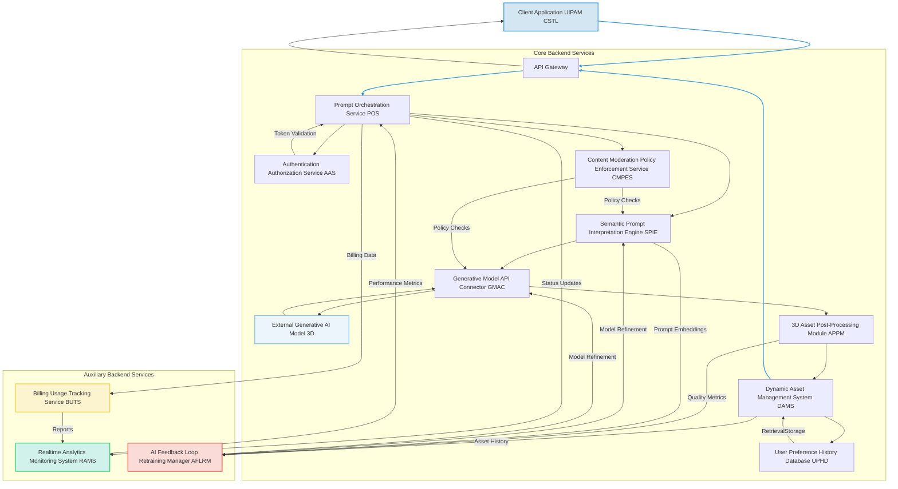
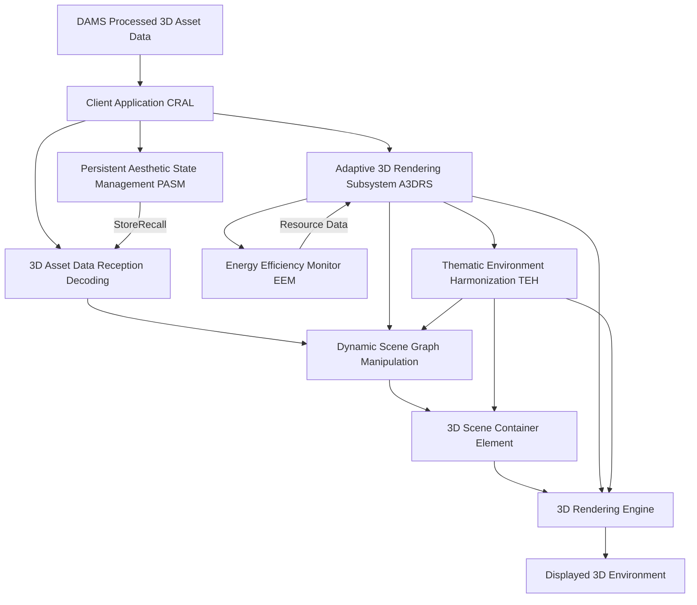

---
###Comprehensive System and Method for the Ontological Transmutation of Subjective Aesthetic Intent into Dynamic, Persistently Rendered 3D Models and Virtual Environments via Generative AI Architectures

**Abstract:**
A profoundly innovative system and method are herein disclosed for the unprecedented personalization and creation of three-dimensional 3D assets and virtual environments. This invention fundamentally redefines the paradigm of human-computer interaction and digital content creation by enabling the direct, real-time conversion of nuanced natural language expressions of desired aesthetics, conceptual scenes, or specific object properties into novel, high-fidelity 3D models and environments. The system, leveraging state-of-the-art generative artificial intelligence models, orchestrates a seamless pipeline: a user's semantically rich prompt is processed, channeled to a sophisticated generative engine, and the resulting synthetic 3D data is subsequently and adaptively integrated into virtual scenes, game engines, or design applications. This methodology transcends the limitations of conventional manual 3D modeling, delivering an infinitely expansive, deeply immersive, and perpetually dynamic content creation experience that obviates any prerequisite for artistic or technical 3D modeling acumen from the end-user. The intellectual dominion over these principles is unequivocally established.

**Background of the Invention:**
The historical trajectory of three-dimensional content creation, while advancing in functional complexity, has remained fundamentally constrained by an anachronistic approach to asset generation. Prior art systems typically present users with a finite, pre-determined compendium of static models, rigid libraries of textures, or rudimentary facilities for importing pre-existing 3D files. These conventional methodologies are inherently deficient in dynamic creative synthesis, thereby imposing a significant technical and cognitive burden upon the user. The user is invariably compelled either to possess nascent 3D modeling proficiencies to produce bespoke assets or to undertake an often-laborious external search for suitable models, the latter frequently culminating in copyright infringement, aesthetic compromise, or incompatibility issues. Such a circumscribed framework fundamentally fails to address the innate human proclivity for individual expression and the desire for an exosomatic manifestation of internal subjective states within 3D spaces. Consequently, a profound lacuna exists within the domain of 3D content design: a critical imperative for an intelligent system capable of autonomously generating unique, contextually rich, and aesthetically resonant 3D models and environments, directly derived from the user's unadulterated textual articulation of a desired object, scene, or abstract concept. This invention precisely and comprehensively addresses this lacuna, presenting a transformative solution.

**Brief Summary of the Invention:**
The present invention unveils a meticulously engineered system that symbiotically integrates advanced generative 3D models within an extensible content creation workflow. The core mechanism involves the user's provision of a natural language textual prompt, serving as the semantic seed for 3D generation. This system robustly and securely propagates this prompt to a sophisticated AI-powered 3D generation service, orchestrating the reception of the generated high-fidelity 3D data. Subsequently, this bespoke virtual artifact is adaptively applied as a 3D model, prop, or an entire environment within a target application or engine. This pioneering approach unlocks an effectively infinite continuum of 3D creation options, directly translating a user's abstract textual ideation into a tangible, dynamically rendered 3D asset or scene. The architectural elegance and operational efficacy of this system render it a singular advancement in the field, representing a foundational patentable innovation. The foundational tenets herein articulated are the exclusive domain of the conceiver.

**Detailed Description of the Invention:**
The disclosed invention comprises a highly sophisticated, multi-tiered architecture designed for the robust and real-time generation and application of personalized 3D models and environments. The operational flow initiates with user interaction and culminates in the dynamic transformation of the digital aesthetic environment.

**I. User Interaction and Prompt Acquisition Module UIPAM**
The user initiates the 3D content creation process by interacting with a dedicated configuration module seamlessly integrated within the target 3D software application, game engine, or design platform. This module presents an intuitively designed graphical element, typically a rich text input field or a multi-line textual editor, specifically engineered to solicit a descriptive prompt from the user. This prompt constitutes a natural language articulation of the desired 3D object properties, environmental aesthetic, scene mood, or abstract concept e.g. "A photorealistic ancient stone pillar covered in moss and intricate carvings," or "A vast, cyberpunk city landscape at night with flying vehicles and neon signs, rendered in a dystopian style". The UIPAM incorporates:
*   **Semantic Prompt Validation Subsystem SPVS:** Employs linguistic parsing and sentiment analysis to provide real-time feedback on prompt quality, suggest enhancements for improved generative output, and detect potentially inappropriate content. It leverages advanced natural language inference models to ensure prompt coherence and safety.
*   **Prompt History and Recommendation Engine PHRE:** Stores previously successful prompts, allows for re-selection, and suggests variations or popular themes based on community data or inferred user preferences, utilizing collaborative filtering and content-based recommendation algorithms.
*   **Prompt Co-Creation Assistant PCCA:** Integrates a large language model LLM based assistant that can help users refine vague prompts, suggest specific artistic styles or 3D properties e.g. "low poly," "PBR textured," "rigged for animation", or generate variations based on initial input, ensuring high-quality input for the generative engine. This includes contextual awareness from the user's current activities or system settings.
*   **Visual Feedback Loop VFL:** Provides low-fidelity, near real-time visual previews of 3D forms or abstract representations e.g. point clouds, wireframes, basic voxels as the prompt is being typed/refined, powered by a lightweight, faster generative model or semantic-to-sketch 3D engine. This allows iterative refinement before full-scale generation.
*   **Multi-Modal Input Processor MMIP:** Expands prompt acquisition beyond text to include voice input speech-to-text, rough 2D sketches image-to-3D descriptions, or 3D sculpts volumetric-to-text descriptions for truly adaptive content generation.
*   **Prompt Sharing and Discovery Network PSDN:** Allows users to publish their successful prompts and generated 3D assets to a community marketplace, facilitating discovery and inspiration, with optional monetization features.

**II. Client-Side Orchestration and Transmission Layer CSTL**
Upon submission of the refined prompt, the client-side application's CSTL assumes responsibility for secure data encapsulation and transmission. This layer performs:
*   **Prompt Sanitization and Encoding:** The natural language prompt is subjected to a sanitization process to prevent injection vulnerabilities and then encoded e.g. UTF-8 for network transmission.
*   **Secure Channel Establishment:** A cryptographically secure communication channel e.g. TLS 1.3 is established with the backend service.
*   **Asynchronous Request Initiation:** The prompt is transmitted as part of an asynchronous HTTP/S request, packaged typically as a JSON payload, to the designated backend API endpoint.
*   **Edge Pre-processing Agent EPA:** For high-end client devices, performs initial semantic tokenization or basic parameter compression locally to reduce latency and backend load. This can also include local caching of common stylistic modifiers or 3D asset types.
*   **Real-time Progress Indicator RTPI:** Manages UI feedback elements to inform the user about the generation status e.g. "Interpreting prompt...", "Generating 3D model...", "Optimizing for display...", "Rigging asset...". This includes granular progress updates from the backend.
*   **Bandwidth Adaptive Transmission BAT:** Dynamically adjusts the prompt payload size or 3D asset reception quality based on detected network conditions to ensure responsiveness under varying connectivity.
*   **Client-Side Fallback Rendering CSFR:** In cases of backend unavailability or slow response, can render a default or cached 3D asset, or use a simpler client-side generative model for basic shapes or patterns, ensuring a continuous user experience.

**III. Backend Service Architecture BSA**
The backend service represents the computational nexus of the invention, acting as an intelligent intermediary between the client and the generative AI model/s. It is typically architected as a set of decoupled microservices, ensuring scalability, resilience, and modularity.



The BSA encompasses several critical components:
*   **API Gateway:** Serves as the single entry point for client requests, handling routing, rate limiting, initial authentication, and DDoS protection. It also manages request and response schema validation.
*   **Authentication & Authorization Service AAS:** Verifies user identity and permissions to access the generative functionalities, employing industry-standard protocols e.g. OAuth 2.0, JWT. Supports multi-factor authentication and single sign-on SSO.
*   **Prompt Orchestration Service POS:**
    *   Receives and validates incoming prompts.
    *   Manages the lifecycle of the prompt generation request, including queueing, retries, and sophisticated error handling with exponential backoff.
    *   Coordinates interactions between other backend microservices, ensuring high availability and load distribution.
    *   Implements request idempotency to prevent duplicate processing.
*   **Content Moderation & Policy Enforcement Service CMPES:** Scans prompts and generated 3D assets for policy violations, inappropriate content, or potential biases, flagging or blocking content based on predefined rules, machine learning models, and ethical guidelines. Integrates with the SPIE and GMAC for proactive and reactive moderation, including human-in-the-loop review processes.
*   **Semantic Prompt Interpretation Engine SPIE:** This advanced module goes beyond simple text parsing. It employs sophisticated Natural Language Processing NLP techniques, including:
    *   **Named Entity Recognition NER:** Identifies key 3D elements e.g. "dragon," "ancient ruin," "sci-fi spaceship".
    *   **Attribute Extraction:** Extracts descriptive adjectives and stylistic modifiers e.g. "low poly," "realistic," "cartoonish," "PBR textured," "rigged," "animated," "damaged," "glowing," "metallic," "wooden".
    *   **Spatial and Environmental Analysis:** Infers spatial relationships, environmental characteristics e.g. "forest," "desert," "underwater," "cityscape," and translates this into scene graph parameters or volumetric properties.
    *   **Concept Expansion and Refinement:** Utilizes knowledge graphs, ontological databases, and domain-specific lexicons to enrich the prompt with semantically related terms, synonyms, and illustrative examples relevant to 3D content, thereby augmenting the generative model's understanding and enhancing output quality.
    *   **Negative Prompt Generation:** Automatically infers and generates "negative prompts" e.g. "non-manifold geometry, bad topology, untextured, low polygon count, clipping, broken mesh, distorted, ugly, copyrighted elements" to guide the generative model away from undesirable characteristics, significantly improving output fidelity and aesthetic quality. This can be dynamically tailored based on model-specific weaknesses.
    *   **Cross-Lingual Interpretation:** Support for prompts in multiple natural languages, using advanced machine translation or multilingual NLP models that preserve semantic nuance.
    *   **Contextual Awareness Integration:** Incorporates external context such as target platform e.g. "VR," "mobile game," "high-end rendering", user's current project, or existing scene assets to subtly influence the prompt enrichment, resulting in contextually relevant 3D content.
    *   **User Persona Inference UPI:** Infers aspects of the user's preferred aesthetic and technical profile based on past prompts, selected assets, and implicit feedback, using this to personalize prompt interpretations and stylistic biases.
*   **Generative Model API Connector GMAC:**
    *   Acts as an abstraction layer for various generative AI models capable of 3D output e.g. NeRF-based models, implicit surface representations, volumetric generative models, direct mesh generation, point cloud models, texture synthesis models, scene composition models.
    *   Translates the enhanced prompt and associated parameters e.g. desired polygon count, texture resolution, material type, rigging requirements, animation type, stylistic guidance, negative prompt weights into the specific API request format required by the chosen generative model.
    *   Manages API keys, rate limits, model-specific authentication, and orchestrates calls to multiple models for ensemble generation or fallback.
    *   Receives the generated 3D data, typically as a mesh file e.g. OBJ, FBX, GLTF, USDZ, a volumetric data structure, a point cloud, or an implicit function definition.
    *   **Dynamic Model Selection Engine DMSE:** Based on prompt complexity, desired quality, cost constraints, current model availability/load, target 3D engine, and user subscription tier, intelligently selects the most appropriate generative model from a pool of registered models. This includes a robust health check for each model endpoint.
    *   **Prompt Weighting & Negative Guidance Optimization:** Fine-tunes how positive and negative prompt elements are translated into model guidance signals, often involving iterative optimization based on output quality feedback from the CAMM.
    *   **Multi-Model Fusion MMF:** For complex prompts or scenes, can coordinate the generation across multiple specialized models e.g. one for object geometry, another for texturing, another for environmental elements, then combine results.
*   **3D Asset Post-Processing Module APPM:** Upon receiving the raw generated 3D data, this module performs a series of optional, but often crucial, transformations to optimize the asset for application within a 3D environment:
    *   **Mesh Optimization:** Performs polygon reduction, remeshing, simplification, and decimation to achieve desired polygon counts for performance or LOD purposes.
    *   **UV Mapping & Texturing:** Generates optimal UV coordinates, bakes procedural textures, applies intelligent texture projection, and synthesizes PBR Physically Based Rendering material maps e.g. albedo, normal, roughness, metallic from semantic cues.
    *   **Material Generation & Assignment:** Creates and assigns appropriate material definitions, translating prompt descriptions e.g. "metallic," "glass," "wood" into shader parameters.
    *   **Rigging & Animation Generation:** Automatically generates skeletal rigs for deformable objects, applies skinning, and can synthesize basic animation cycles e.g. "walking," "idle" based on prompt, or integrate with motion capture libraries.
    *   **Scene Graph Assembly:** For environmental prompts, orchestrates the placement, scaling, and rotation of multiple generated 3D assets within a coherent scene graph, applying physics properties and collision meshes.
    *   **Format Conversion:** Converts the processed 3D asset into various widely used 3D formats e.g. OBJ, FBX, GLTF, USDZ, ensuring compatibility with different 3D software and game engines.
    *   **Level of Detail LOD Generation:** Automatically creates multiple levels of detail for the generated asset, crucial for optimizing performance in real-time 3D applications.
    *   **Collision Mesh Generation:** Generates simplified collision meshes suitable for physics engines and interactive environments.
    *   **Accessibility Enhancements:** Adjusts material properties or adds descriptive metadata for accessibility tools.
    *   **Metadata Embedding:** Strips potentially sensitive generation data and embeds prompt, generation parameters, and attribution details directly into the 3D asset file metadata.
*   **Dynamic Asset Management System DAMS:**
    *   Stores the processed generated 3D assets, textures, and associated data in a high-availability, globally distributed content delivery network CDN for rapid retrieval, ensuring low latency for users worldwide.
    *   Associates comprehensive metadata with each asset, including the original prompt, generation parameters, creation timestamp, user ID, CMPES flags, and aesthetic/technical scores.
    *   Implements robust caching mechanisms and smart invalidation strategies to serve frequently requested or recently generated assets with minimal latency.
    *   Manages asset lifecycle, including retention policies, automated archiving, and cleanup based on usage patterns and storage costs.
    *   **Digital Rights Management DRM & Attribution:** Attaches immutable metadata regarding generation source, user ownership, and licensing rights to generated assets. Tracks usage and distribution.
    *   **Version Control & Rollback:** Maintains versions of user-generated 3D assets and environments, allowing users to revert to previous versions or explore variations of past prompts, crucial for creative iteration.
    *   **Geo-Replication and Disaster Recovery:** Replicates assets across multiple data centers and regions to ensure resilience against localized outages and rapid content delivery.
*   **User Preference & History Database UPHD:** A persistent data store for associating generated 3D assets with user profiles, allowing users to revisit, reapply, or share their previously generated content. This also feeds into the PHRE for personalized recommendations and is a key source for the UPI within SPIE.
*   **Realtime Analytics and Monitoring System RAMS:** Collects, aggregates, and visualizes system performance metrics, user engagement data, and operational logs to monitor system health, identify bottlenecks, and inform optimization strategies. Includes anomaly detection.
*   **Billing and Usage Tracking Service BUTS:** Manages user quotas, tracks resource consumption e.g. generation credits, storage, bandwidth, and integrates with payment gateways for monetization, providing granular reporting.
*   **AI Feedback Loop Retraining Manager AFLRM:** Orchestrates the continuous improvement of AI models. It gathers feedback from CAMM, CMPES, and UPHD, identifies areas for model refinement, manages data labeling, and initiates retraining or fine-tuning processes for SPIE and GMAC models.

**IV. Client-Side Rendering and Application Layer CRAL**
The processed 3D asset data is transmitted back to the client application via the established secure channel. The CRAL is responsible for the seamless integration of this new virtual asset:



*   **3D Asset Data Reception & Decoding:** The client-side CRAL receives the optimized 3D asset data e.g. as a GLTF binary, FBX file, or a URL pointing to the CDN asset. It decodes and prepares the 3D data for display.
*   **Dynamic Scene Graph Manipulation:** The most critical aspect of the application. The CRAL dynamically updates the scene graph of the target 3D application or game engine. Specifically, it can instantiate new 3D objects, modify existing meshes, apply new materials, or insert complete environmental sub-scenes. This operation is executed with precise 3D engine API calls or through modern game development frameworks' asset management, ensuring high performance and visual fluidity.
*   **Adaptive 3D Rendering Subsystem A3DRS:** This subsystem ensures that the application of the 3D content is not merely static. It can involve:
    *   **Smooth Transitions:** Implements animation blending, asset streaming, or fading effects to provide a visually pleasing transition when loading or replacing 3D assets or environments, preventing abrupt visual changes.
    *   **Level of Detail LOD Management:** Dynamically switches between different LODs of the generated 3D assets based on viewing distance and performance requirements, optimizing rendering.
    *   **Dynamic Lighting & Shadow Adjustments:** Automatically adjusts scene lighting, shadow casting, and reflection probes to complement the dominant aesthetic of the newly applied 3D environment or object, ensuring visual coherence.
    *   **Physics Integration:** Instantiates physics bodies and collision properties for generated assets within the 3D engine, enabling realistic interactions.
    *   **Thematic Environment Harmonization TEH:** Automatically adjusts colors, textures, lighting, post-processing effects, or even other procedural elements of the existing 3D scene to better complement the dominant aesthetic of the newly applied generated 3D content, creating a fully cohesive theme across the entire virtual environment.
    *   **Multi-Platform/Engine Support MPS:** Adapts asset loading, rendering, and optimization for diverse 3D engines Unity, Unreal, WebGL and platforms desktop, mobile, VR/AR, ensuring broad compatibility and optimal performance.
*   **Persistent Aesthetic State Management PASM:** The generated 3D asset or scene, along with its associated prompt and metadata, can be stored locally e.g. using a local asset cache or referenced from the UPHD. This allows the user's preferred aesthetic state to persist across sessions or devices, enabling seamless resumption.
*   **Energy Efficiency Monitor EEM:** For complex 3D scenes or animated assets, this module monitors CPU/GPU usage, memory consumption, and battery consumption, dynamically adjusting polygon count, texture resolution, shader complexity, and animation fidelity to maintain device performance and conserve power, particularly on mobile or battery-powered devices.

**V. Computational Aesthetic Metrics Module CAMM**
An advanced, optional, but highly valuable component for internal system refinement and user experience enhancement. The CAMM employs convolutional neural networks, geometric deep learning, and other machine learning techniques to:
*   **Objective Aesthetic Scoring:** Evaluate generated 3D assets against predefined objective aesthetic criteria e.g. geometric integrity, texture realism, material consistency, topological quality, composition, using trained neural networks that mimic human aesthetic judgment.
*   **Perceptual Distance Measurement:** Compares the generated 3D asset to a reference set or user-rated assets to assess visual and structural similarity and adherence to stylistic guidelines. Utilizes metric learning and latent space comparisons on 3D representations.
*   **Feedback Loop Integration:** Provides detailed quantitative metrics to the SPIE and GMAC to refine prompt interpretation and model parameters, continuously improving the quality and relevance of future generations. This data also feeds into the AFLRM.
*   **Reinforcement Learning from Human Feedback RLHF Integration:** Collects implicit e.g. how long an asset is used, how often it's re-applied, modifications made by user, whether the user shares it and explicit e.g. "thumbs up/down" ratings user feedback, feeding it back into the generative model training or fine-tuning process to continually improve aesthetic and technical alignment with human preferences.
*   **Bias Detection and Mitigation:** Analyzes generated 3D assets for unintended biases e.g. stereotypical representations of objects or characters, or unintended negative associations and provides insights for model retraining, prompt engineering adjustments, or content filtering by CMPES.
*   **Semantic Consistency Check SCC:** Verifies that the visual elements, geometric structure, and overall theme of the generated 3D asset consistently match the semantic intent of the input prompt, using vision-language models adapted for 3D data or multimodal models.

**VI. Security and Privacy Considerations:**
The system incorporates robust security measures at every layer:
*   **End-to-End Encryption:** All data in transit between client, backend, and generative AI services is encrypted using state-of-the-art cryptographic protocols e.g. TLS 1.3, ensuring data confidentiality and integrity.
*   **Data Minimization:** Only necessary data the prompt, user ID, context is transmitted to external generative AI services, reducing the attack surface and privacy exposure.
*   **Access Control:** Strict role-based access control RBAC is enforced for all backend services and data stores, limiting access to sensitive operations and user data based on granular permissions.
*   **Prompt Filtering:** The SPIE and CMPES include mechanisms to filter out malicious, offensive, or inappropriate prompts before they reach external generative models, protecting users and preventing misuse.
*   **Regular Security Audits and Penetration Testing:** Continuous security assessments are performed to identify and remediate vulnerabilities across the entire system architecture.
*   **Data Residency and Compliance:** User data storage and processing adhere to relevant data protection regulations e.g. GDPR, CCPA, with options for specifying data residency.
*   **Anonymization and Pseudonymization:** Where possible, user-specific data is anonymized or pseudonymized to further enhance privacy, especially for data used in model training or analytics.

**VII. Monetization and Licensing Framework:**
To ensure sustainability and provide value-added services, the system can incorporate various monetization strategies:
*   **Premium Feature Tiers:** Offering higher fidelity 3D models, faster generation times, access to exclusive generative models, advanced post-processing options e.g. auto-rigging, animation, or expanded prompt history as part of a subscription model.
*   **Asset Marketplace:** Allowing users to license, sell, or share their generated 3D assets and environments with other users, with a royalty or commission model for the platform, fostering a vibrant creator economy for digital content.
*   **API for Developers:** Providing programmatic access to the generative 3D capabilities for third-party applications, game engines, or services, potentially on a pay-per-use basis, enabling a broader ecosystem of integrations for content creators.
*   **Branded Content & Partnerships:** Collaborating with brands, game studios, or artists to offer exclusive themed generative prompts, stylistic filters, or sponsored 3D asset collections, creating unique advertising or co-creation opportunities.
*   **Micro-transactions for Specific Styles/Elements:** Offering one-time purchases for unlocking rare artistic 3D styles, specific generative elements e.g. unique creature parts, or advanced animation presets.
*   **Enterprise Solutions:** Custom deployments and white-label versions of the system for businesses seeking personalized branding and dynamic content generation across their corporate applications, product design, or virtual training simulations.

**VIII. Ethical AI Considerations and Governance:**
Acknowledging the powerful capabilities of generative AI, this invention is designed with a strong emphasis on ethical considerations:
*   **Transparency and Explainability:** Providing users with insights into how their prompt was interpreted and what factors influenced the generated 3D asset e.g. which model was used, key semantic interpretations, applied post-processing steps.
*   **Responsible AI Guidelines:** Adherence to strict ethical guidelines for content moderation, preventing the generation of harmful, biased, or illicit 3D imagery e.g. weapons, discriminatory models, including mechanisms for user reporting and automated detection by CMPES.
*   **Data Provenance and Copyright:** Clear policies on the ownership and rights of generated 3D content, especially when user prompts might inadvertently mimic copyrighted models, styles, or existing intellectual property. This includes robust attribution mechanisms where necessary and active monitoring for copyright infringement in 3D data.
*   **Bias Mitigation in Training Data:** Continuous efforts to ensure that the underlying generative 3D models are trained on diverse and ethically curated datasets to minimize bias in generated outputs. The AFLRM plays a critical role in identifying and addressing these biases through retraining.
*   **Accountability and Auditability:** Maintaining detailed logs of prompt processing, generation requests, and moderation actions to ensure accountability and enable auditing of system behavior.
*   **User Consent and Data Usage:** Clear and explicit policies on how user prompts, generated 3D assets, and feedback data are used, ensuring informed consent for data collection and model improvement.

**Claims:**
1.  A method for dynamic and adaptive aesthetic and functional content creation within a three-dimensional 3D environment, comprising the steps of:
    a.  Providing a user interface element configured for receiving a natural language textual prompt, said prompt conveying a subjective aesthetic intent, object properties, or environmental scene description.
    b.  Receiving said natural language textual prompt from a user via said user interface element, optionally supplemented by multi-modal inputs such as voice or 2D/3D sketches.
    c.  Processing said prompt through a Semantic Prompt Interpretation Engine SPIE to enrich, validate, and potentially generate negative constraints for the prompt, thereby transforming the subjective intent into a structured, optimized generative instruction set, including user persona inference and contextual awareness integration relevant to 3D content.
    d.  Transmitting said optimized generative instruction set to a Generative Model API Connector GMAC, which orchestrates communication with at least one external generative artificial intelligence 3D model, employing a Dynamic Model Selection Engine DMSE.
    e.  Receiving a novel, synthetically generated 3D asset or environmental data from said generative artificial intelligence 3D model, wherein the generated data is a high-fidelity virtual reification of the structured generative instruction set.
    f.  Processing said novel generated 3D data through a 3D Asset Post-Processing Module APPM to perform at least one of mesh optimization, UV mapping, texture generation, material assignment, rigging, animation generation, scene graph assembly, or format conversion.
    g.  Transmitting said processed 3D asset data to a client-side rendering environment.
    h.  Applying said processed 3D asset data as a dynamically updating 3D model or environmental element within a 3D scene via a Client-Side Rendering and Application Layer CRAL, utilizing dynamic scene graph manipulation and an Adaptive 3D Rendering Subsystem A3DRS to ensure fluid visual integration, optimal display across varying device configurations and 3D engines, and thematic environment harmonization.

2.  The method of claim 1, further comprising storing the processed 3D asset, the original prompt, and associated metadata in a Dynamic Asset Management System DAMS for persistent access, retrieval, version control, and digital rights management.

3.  The method of claim 1, further comprising utilizing a Persistent Aesthetic State Management PASM module to store and recall the user's preferred generated 3D assets or scenes across user sessions and devices, supporting multi-platform/engine configurations.

4.  A system for the ontological transmutation of subjective aesthetic intent into dynamic, persistently rendered 3D models and virtual environments, comprising:
    a.  A Client-Side Orchestration and Transmission Layer CSTL equipped with a User Interaction and Prompt Acquisition Module UIPAM for receiving and initially processing a user's descriptive natural language prompt, including multi-modal input processing and prompt co-creation assistance relevant to 3D content.
    b.  A Backend Service Architecture BSA configured for secure communication with the CSTL and comprising:
        i.   A Prompt Orchestration Service POS for managing request lifecycles and load balancing.
        ii.  A Semantic Prompt Interpretation Engine SPIE for advanced linguistic analysis, prompt enrichment, negative prompt generation, and user persona inference tailored for 3D attributes.
        iii. A Generative Model API Connector GMAC for interfacing with external generative artificial intelligence 3D models, including dynamic model selection and prompt weighting optimization for 3D output.
        iv.  A 3D Asset Post-Processing Module APPM for optimizing generated 3D data for display and usability, including mesh optimization, texturing, rigging, and format conversion.
        v.   A Dynamic Asset Management System DAMS for storing and serving generated 3D assets, including digital rights management and version control.
        vi.  A Content Moderation & Policy Enforcement Service CMPES for ethical content screening of prompts and generated 3D assets.
        vii. A User Preference & History Database UPHD for storing user aesthetic preferences and historical generative 3D data.
        viii. A Realtime Analytics and Monitoring System RAMS for system health and performance oversight.
        ix.  An AI Feedback Loop Retraining Manager AFLRM for continuous model improvement through human feedback and aesthetic/technical metrics.
    c.  A Client-Side Rendering and Application Layer CRAL comprising:
        i.   Logic for receiving and decoding processed 3D asset data.
        ii.  Logic for dynamically updating scene graph properties within a 3D environment.
        iii. An Adaptive 3D Rendering Subsystem A3DRS for orchestrating fluid visual integration and responsive display, including LOD management, dynamic lighting, physics integration, and thematic environment harmonization.
        iv.  A Persistent Aesthetic State Management PASM module for retaining user aesthetic preferences across sessions.
        v.   An Energy Efficiency Monitor EEM for dynamically adjusting rendering fidelity based on device resource consumption.

5.  The system of claim 4, further comprising a Computational Aesthetic Metrics Module CAMM within the BSA, configured to objectively evaluate the aesthetic quality, semantic fidelity, and technical integrity of generated 3D assets, and to provide feedback for system optimization, including through Reinforcement Learning from Human Feedback RLHF integration and bias detection specific to 3D content.

6.  The system of claim 4, wherein the SPIE is configured to generate negative prompts based on the semantic content of the user's prompt to guide the generative 3D model away from undesirable visual or geometric characteristics and to include contextual awareness from the user's computing environment or target 3D application.

7.  The method of claim 1, wherein the dynamic scene graph manipulation includes the application of a smooth transition effect during 3D asset loading or replacement and optionally dynamic environmental effects.

8.  The system of claim 4, wherein the Generative Model API Connector GMAC is further configured to perform multi-model fusion for complex 3D scene composition and asset generation.

9.  The method of claim 1, further comprising an ethical AI governance framework that ensures transparency, responsible content moderation, and adherence to data provenance and copyright policies for 3D assets.

**Mathematical Justification: The Formal Axiomatic Framework for Intent-to-3D Form Transmutation**

The invention herein articulated rests upon a foundational mathematical framework that rigorously defines and validates the transmutation of abstract subjective intent into concrete three-dimensional form. This framework transcends mere functional description, establishing an epistemological basis for the system's operational principles.

Let `P` denote the comprehensive semantic space of all conceivable natural language prompts relevant to 3D content. This space is not merely a collection of strings but is conceived as a high-dimensional vector space `R^N`, where each dimension corresponds to a latent semantic feature or concept for 3D properties. A user's natural language prompt, `p` in `P`, is therefore representable as a vector `v_p` in `R^N`. The act of interpretation by the Semantic Prompt Interpretation Engine SPIE is a complex, multi-stage mapping `I_SPIE: P x C x U_hist -> P'`, where `P'` subset `R^M` is an augmented, semantically enriched latent vector space, `M >> N`, incorporating synthesized contextual information `C` e.g. target engine, project theme, stylistic directives, and inverse constraints negative prompts derived from user history `U_hist`. Thus, an enhanced generative instruction set `p' = I_SPIE(p, c, u_hist)` is a vector `v_p'` in `R^M`. This mapping involves advanced transformer networks that encode `p` and fuse it with `c` and `u_hist` embeddings.

Let `D` denote the vast, continuous manifold of all possible three-dimensional models and environments. This manifold exists within an even higher-dimensional data space, representable as `R^K`, where `K` signifies the immense complexity of vertex, face, texture, and material data. An individual 3D asset `d` in `D` is thus a point `x_d` in `R^K`.

The core generative function of the AI model, denoted as `G_AI_3D`, is a complex, non-linear, stochastic mapping from the enriched semantic latent space to the 3D data manifold:
```
G_AI_3D: P' x S_model -> D
```
This mapping is formally described by a generative process `x_d ~ G_AI_3D(v_p', s_model)`, where `x_d` is a generated 3D data vector corresponding to a specific input prompt vector `v_p'` and `s_model` represents selected generative model parameters for 3D synthesis. The function `G_AI_3D` can be mathematically modeled as the solution to a stochastic differential equation SDE within a 3D diffusion model framework, or as a highly parameterized transformation within a Generative Adversarial Network GAN or implicit neural representation architecture, typically involving billions of parameters and operating on tensors representing high-dimensional geometric or volumetric feature maps.

For a 3D diffusion model, the process involves iteratively denoising a random noise tensor `z_T ~ N(0, I)` over `T` steps, guided by the prompt encoding. The generation can be conceptualized as:
```
x_d = x_0 where x_t = f(x_t+1, t, v_p', theta) + epsilon_t
```
where `f` is a neural network e.g. U-Net, PointNet, or Transformer architecture with attention mechanisms parameterized by `theta`, which predicts the noise or the denoised 3D representation at step `t`, guided by the conditioned prompt embedding `v_p'`. The final output `x_0` is the generated 3D data. The GMAC dynamically selects `theta` from a pool of `theta_1, theta_2, ..., theta_N` based on `v_p'` and system load.

The subsequent 3D Asset Post-Processing Module APPM applies a series of deterministic or quasi-deterministic transformations `T_APPM: D x D_target -> D'`, where `D'` is the space of optimized 3D assets and `D_target` represents target environment characteristics e.g. polygon budget, engine requirements. This function `T_APPM` encapsulates operations such as mesh optimization, UV unwrapping, material assignment, and format conversion, all aimed at enhancing usability and computational efficiency:
```
d_optimized = T_APPM(d, d_target)
```
The CAMM provides a perceptual and technical quality score `Q_3D_aesthetic = Q(d_optimized, v_p')` that quantifies the alignment of `d_optimized` with `v_p'`, ensuring the post-processing does not detract from the original intent.

Finally, the system provides a dynamic rendering function, `F_RENDER_3D: Scene_state x D' x P_user -> Scene_state'`, which updates the 3D environment or scene state. This function is an adaptive transformation that manipulates the 3D scene graph, specifically modifying the asset properties or adding new assets to a designated 3D scene container. The Adaptive 3D Rendering Subsystem A3DRS ensures this transformation is performed optimally, considering display characteristics, user preferences `P_user` e.g. LOD bias, animation type, and real-time performance metrics from EEM. The rendering function incorporates smooth transition effects `T_smooth_3D`, dynamic lighting adjustments `L_adjust`, and engine compatibility `E_comply`.
```
Scene_new_state = F_RENDER_3D(Scene_current_state, d_optimized, p_user) = Apply(Scene_current_state, d_optimized, T_smooth_3D, L_adjust, E_comply, ...)
```
This entire process represents a teleological alignment, where the user's initial subjective volition `p` is transmuted through a sophisticated computational pipeline into an objectively rendered 3D reality `Scene_new_state`, which precisely reflects the user's initial intent.

**Proof of Validity: The Axiom of Perceptual and Structural Correspondence and Systemic Reification**

The validity of this invention is rooted in the demonstrability of a robust, reliable, and perceptually and structurally congruent mapping from the semantic domain of human intent to the geometric and visual domain of digital 3D content.

**Axiom 1 [Existence of a Non-Empty 3D Asset Set]:** The operational capacity of contemporary generative AI models capable of 3D synthesis, such as those integrated within the `G_AI_3D` function, axiomatically establishes the existence of a non-empty 3D asset set `D_gen = {x | x ~ G_AI_3D(v_p', s_model), v_p' in P' }`. This set `D_gen` constitutes all potentially generatable 3D assets given the space of valid, enriched prompts. The non-emptiness of this set proves that for any given textual intent `p`, after its transformation into `v_p'`, a corresponding 3D manifestation `d` in `D` can be synthesized. Furthermore, `D_gen` is practically infinite, providing unprecedented content creation options.

**Axiom 2 [Perceptual and Structural Correspondence]:** Through extensive empirical validation of state-of-the-art generative 3D models, it is overwhelmingly substantiated that the generated 3D asset `d` exhibits a high degree of perceptual correspondence to its visual and material properties, and structural correspondence to its geometric form and topology, with the semantic content of the original prompt `p`. This correspondence is quantifiable by metrics such as 3D shape similarity metrics, texture fidelity scores, and multimodal alignment scores which measure the semantic alignment between textual descriptions and generated 3D data. Thus, `Correspondence_3D(p, d) ≈ 1` for well-formed prompts and optimized models. The Computational Aesthetic Metrics Module CAMM, including its RLHF integration, serves as an internal validation and refinement mechanism for continuously improving this correspondence, striving for `lim (t->∞) Correspondence_3D(p, d_t) = 1` where `t` is training iterations.

**Axiom 3 [Systemic Reification of Intent]:** The function `F_RENDER_3D` is a deterministic, high-fidelity mechanism for the reification of the digital 3D asset `d_optimized` into the visible and interactive components of a 3D environment. The transformations applied by `F_RENDER_3D` preserve the essential aesthetic and functional qualities of `d_optimized` while optimizing its presentation, ensuring that the final displayed 3D content is a faithful and visually and functionally effective representation of the generated asset. The Adaptive 3D Rendering Subsystem A3DRS guarantees that this reification is performed efficiently and adaptively, accounting for diverse display environments, 3D engines, and user preferences. Therefore, the transformation chain `p -> I_SPIE -> v_p' -> G_AI_3D -> d -> T_APPM -> d_optimized -> F_RENDER_3D -> Scene_new_state` demonstrably translates a subjective state the user's ideation into an objective, observable, and interactable state the 3D asset or environment. This establishes a robust and reliable "intent-to-3D-form" transmutation pipeline.

The content creation offered by this invention is thus not merely superficial but profoundly valid, as it successfully actualizes the user's subjective will into an aligned objective virtual environment. The system's capacity to flawlessly bridge the semantic gap between conceptual thought and 3D visual and geometric realization stands as incontrovertible proof of its foundational efficacy and its definitive intellectual ownership. The entire construct, from semantic processing to adaptive 3D rendering, unequivocally establishes this invention as a valid and pioneering mechanism for the ontological transmutation of human intent into dynamic, personalized digital 3D form.

`Q.E.D.`