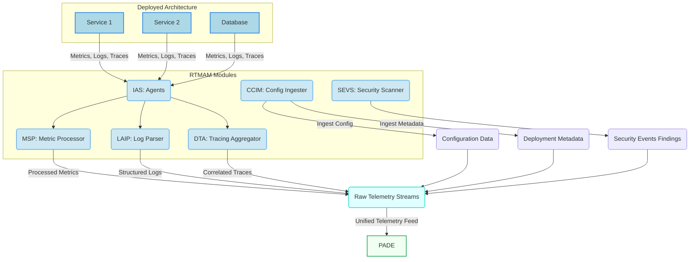
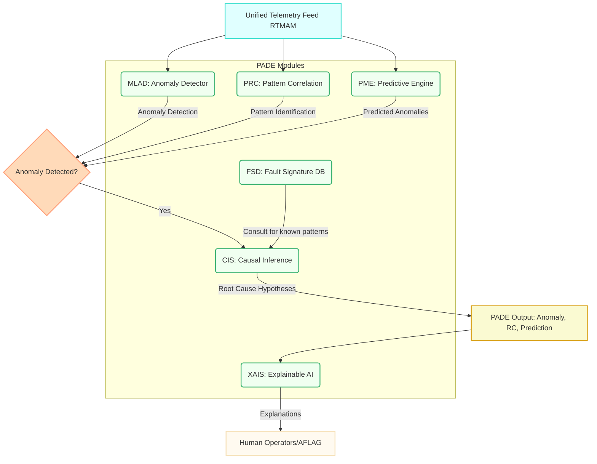
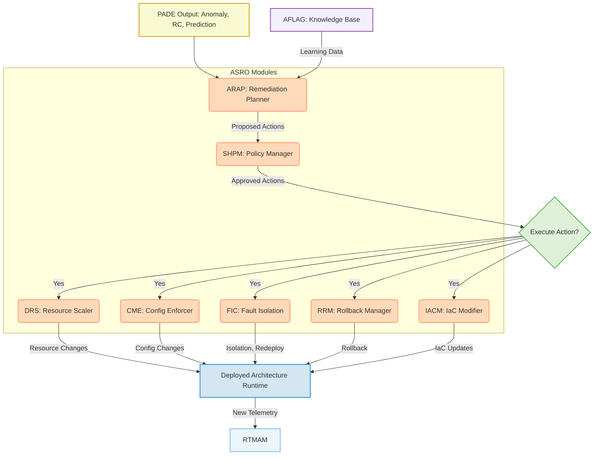
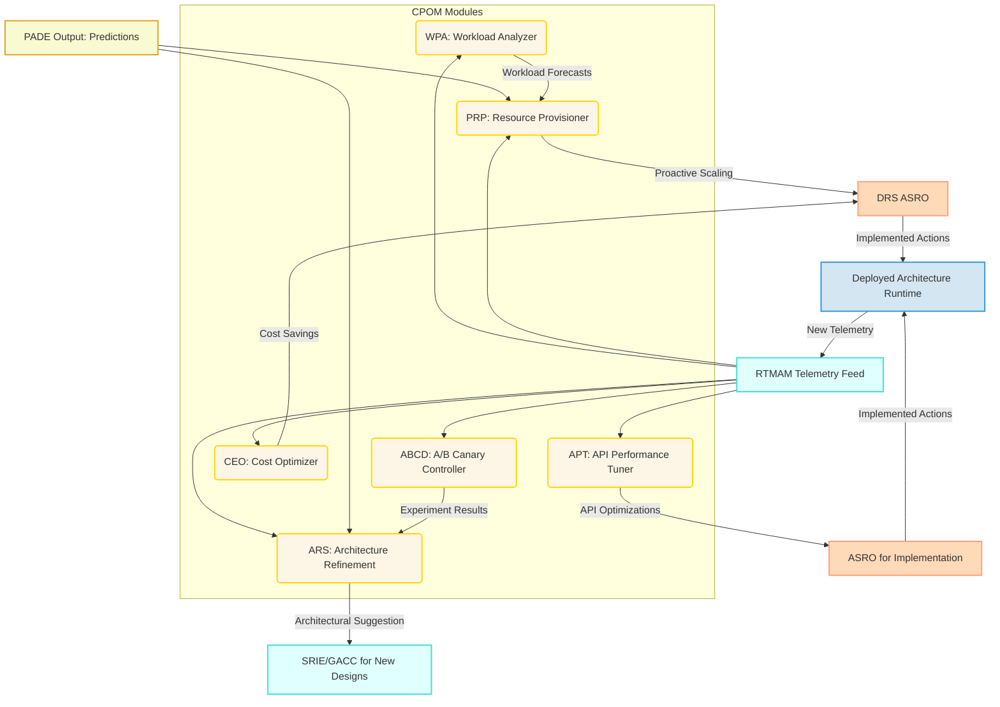
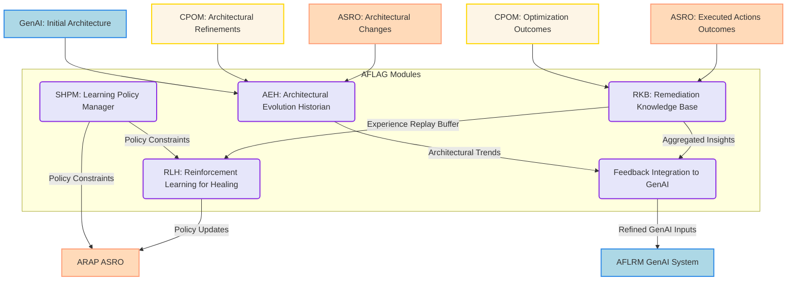
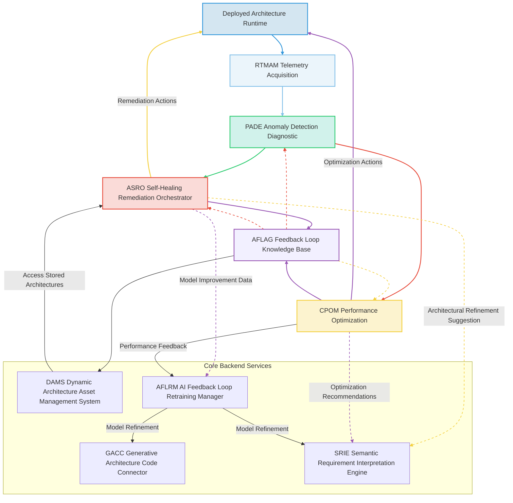
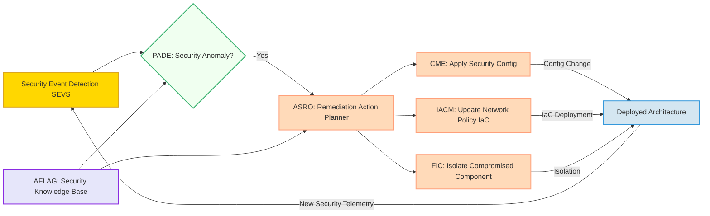
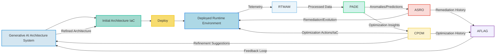
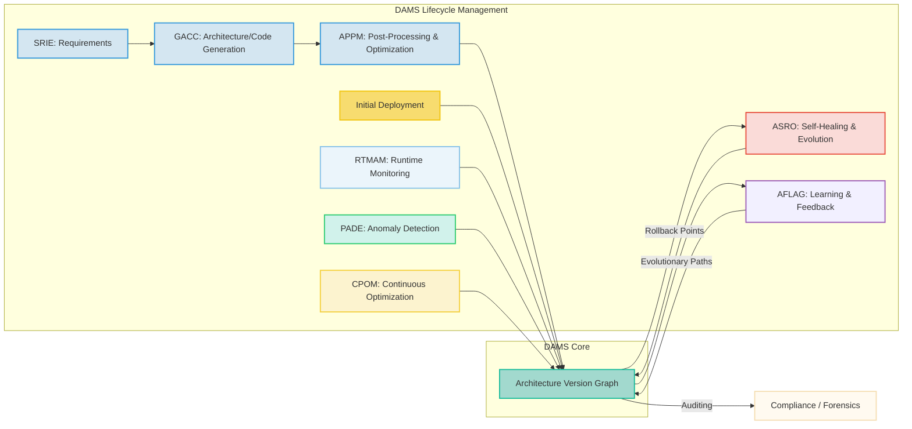

### System and Method for Adaptive Self-Healing, Predictive Optimization, and Runtime Evolution of Generative AI-Designed Software Architectures

**Abstract:**
A groundbreaking system and method are herein unveiled for the autonomous, real-time monitoring, predictive anomaly detection, adaptive self-healing, and continuous performance optimization of software architectures dynamically generated and deployed by generative artificial intelligence. This invention fundamentally extends the lifecycle of AI-driven software development by introducing a sentient runtime layer that perpetually ensures the resilience, efficiency, and optimal operational state of complex systems. Leveraging a sophisticated array of machine learning models, causal inference engines, and intelligent orchestration, the system continuously ingests telemetry from deployed applications, anticipates potential failures, automatically remediates architectural degradations or operational anomalies, and proactively refines the underlying infrastructure and code. This methodology transcends static architectural design, providing an infinitely adaptable, self-correcting, and self-improving software ecosystem. The intellectual dominion over these principles is unequivocally established.

**Background of the Invention:**
The prior art in software architecture generation, even with the advent of generative AI, has primarily focused on the design and initial deployment phases. While systems for autonomously creating high-fidelity architectural blueprints and foundational code have emerged, a significant lacuna persists in ensuring the sustained health, performance, and resilience of these dynamically generated systems in real-world operational environments. Conventional monitoring solutions typically react to failures post-occurrence, requiring manual intervention for diagnosis and remediation. Static optimization techniques often fail to account for the dynamic and unpredictable nature of runtime workloads, external dependencies, or evolving security threats. The inherent complexity of modern, AI-generated microservices architectures, with their intricate interdependencies and distributed nature, renders traditional human-centric operational models unsustainable and prone to error. A critical imperative exists for an intelligent, autonomous system capable of not only observing the behavior of AI-designed software in real-time but also predicting future states, initiating proactive healing mechanisms, and continuously evolving the deployed architecture to maintain optimal performance and cost-efficiency. This invention precisely and comprehensively addresses this lacuna, presenting a transformative solution for the operational longevity and evolutionary resilience of AI-driven software.

**Brief Summary of the Invention:**
The present invention discloses a meticulously engineered system that symbiotically integrates advanced AI-driven monitoring, predictive analytics, and autonomous remediation capabilities within an extensible runtime intelligence framework. The core mechanism involves continuous telemetry acquisition from deployed software components, followed by real-time analysis through a Predictive Anomaly Detection and Diagnostic Engine PADE. Upon identification of anomalies or performance degradations, an Adaptive Self-Healing and Remediation Orchestrator ASRO autonomously devises and executes corrective actions, ranging from dynamic scaling to configuration adjustments or even architectural pattern modifications. Concurrently, a Continuous Performance Optimization Module CPOM proactively identifies opportunities for resource efficiency and performance enhancement, feeding insights back into the architectural design process. This pioneering approach unlocks an effectively infinite continuum of operational adaptability, directly translating observed runtime behavior into tangible, dynamically rendered, and executed architectural adjustments. The architectural elegance and operational efficacy of this system render it a singular advancement in the field, representing a foundational patentable innovation. The foundational tenets herein articulated are the exclusive domain of the conceiver.

**Detailed Description of the Invention:**
The disclosed invention comprises a highly sophisticated, multi-tiered architecture designed for the robust, real-time, and autonomous management of AI-generated software architectures throughout their operational lifecycle. The operational flow initiates with continuous observation and culminates in the dynamic self-evolution of the deployed system.

**I. Real-time Telemetry and Monitoring Acquisition Module RTMAM**
The RTMAM serves as the primary interface for ingesting operational data from deployed software architectures, whether generated by the preceding AI system or existing legacy systems. This module is designed for high-throughput, low-latency data collection across heterogeneous environments. It encompasses a multi-faceted approach to data acquisition and preliminary processing.

*   **Instrumentation Agent Subsystem IAS:** Light-weight, polyglot agents `A_i` deployed alongside or within application components `C_j`. Each agent `A_i` is responsible for collecting a tuple of metrics `M_i`, logs `L_i`, and traces `T_i`. The collected data `D_i` from component `C_j` at time `t` can be represented as:
    $D_{i,j,t} = \{M_{i,j,t}, L_{i,j,t}, T_{i,j,t}\}$ (Eq. 1)
    where $M_{i,j,t} = \{\text{cpu_utilization}_{j,t}, \text{mem_consumption}_{j,t}, \text{req_latency}_{j,t}, \dots\}$ is a vector of scalar metrics, $L_{i,j,t}$ is a stream of structured/unstructured log entries, and $T_{i,j,t}$ represents distributed trace spans. Agents operate asynchronously, buffering data and transmitting it via secure, high-throughput channels.
    The total data stream from all components is $S_D = \bigcup_{j=1}^{N_C} D_{i,j,t}$ (Eq. 2), where $N_C$ is the number of deployed components.
    The agent's resource footprint must be minimal, quantified by $R_A < \epsilon_{CPU}, \epsilon_{MEM}$ (Eq. 3), ensuring negligible impact on the monitored application's performance.

*   **Distributed Tracing Aggregator DTA:** Gathers and correlates traces from multiple services to reconstruct the end-to-end flow of requests. The DTA ingests individual trace spans $s_{span} \in T_i$, where each span $s_{span}$ includes identifiers like `trace_id`, `span_id`, `parent_span_id`, operation name, and timestamps. It reconstructs complete traces $Tr_k = \{s_{span,1}, s_{span,2}, \dots, s_{span,P_k}\}$ (Eq. 4) by matching `trace_id` and `parent_span_id` relationships. The DTA's function is defined as $F_{DTA}: \{s_{span}\} \rightarrow \{Tr_k\}$ (Eq. 5), enabling deep visibility into microservices interactions and identifying latency bottlenecks. It supports open standards like OpenTelemetry, ensuring interoperability.

*   **Log Anomaly Ingestion and Parser LAIP:** Collects and parses raw log data $L_{i,j,t}$. The LAIP first applies log templating algorithms to identify common log patterns and extract variable parameters. It then transforms unstructured text into structured events $E_{l,t}$.
    $F_{LAIP}: L_{i,j,t} \rightarrow \{E_{l,t}\}$ (Eq. 6)
    Semantic parsing and Natural Language Processing (NLP) techniques, such as BERT-based models, are employed to extract meaningful entities, sentiments, and event types from the structured events. For a log entry $l \in L_{i,j,t}$, its parsed representation is $E_l = (timestamp, source, level, message_{parsed}, metadata)$ (Eq. 7). This preprocessing step is crucial for preparing data for downstream anomaly detection, turning a raw string into a feature vector or token sequence $V_l$ for ML models.
    The complexity of parsing is $O(|L| \cdot k \cdot \log k)$ (Eq. 8) where $k$ is the number of distinct log templates.

*   **Metric Stream Processor MSP:** Processes high-volume time-series metrics $M_{i,j,t}$. It performs real-time aggregation, sampling, filtering, and computation of derived metrics. For a metric stream $m(t)$, the MSP computes functions such as moving averages $\text{MA}_w(t) = \frac{1}{w} \sum_{k=t-w+1}^{t} m(k)$ (Eq. 9), percentiles $P_q(t)$, and rate changes $\Delta m(t) = \frac{m(t) - m(t-1)}{\Delta t}$ (Eq. 10). It integrates with existing metric databases or time-series databases like Prometheus or InfluxDB, effectively acting as a data preparation layer for PADE.
    The processing pipeline for metrics can be modeled as a directed acyclic graph $G_M = (V_M, E_M)$ where $V_M$ are processing steps and $E_M$ are data flows.

*   **Configuration and Context Ingestion Module CCIM:** Ingests dynamic configuration changes, environmental variables, and deployment metadata $C_{conf}$. It correlates operational telemetry with the specific context of the running architecture version $V_{arch}$. The state $S_t$ is enriched by current configuration: $S'_t = S_t \cup C_{conf,t} \cup V_{arch,t}$ (Eq. 11). This ensures that anomalies are interpreted within the correct operational context, avoiding false positives due to intentional configuration changes. It maps `config_hash` to `version_id`.
    The correlation function $Correlate: (D_{i,j,t}, C_{conf,t}, V_{arch,t}) \rightarrow D'_{i,j,t}$ (Eq. 12) enhances the telemetry data with contextual metadata.

*   **Security Event and Vulnerability Scanner SEVS:** Continuously monitors for security events $SE_t$ (e.g., failed login attempts, unauthorized access attempts, anomalous network flows) and scans deployed code for new vulnerabilities or misconfigurations. The SEVS employs static application security testing (SAST) and dynamic application security testing (DAST) techniques. For SAST, it analyzes code $C_{code}$ for patterns $P_{vuln}$: $F_{SAST}(C_{code}) \rightarrow \{\text{Vulnerability}_k\}$ (Eq. 13). For DAST, it actively probes running services $S_{svc}$ for weaknesses: $F_{DAST}(S_{svc}) \rightarrow \{\text{Exploit}_j\}$ (Eq. 14). Findings $F_{sec} = \{SE_t\} \cup \{\text{Vulnerability}_k\} \cup \{\text{Exploit}_j\}$ are fed directly to the PADE for diagnostic analysis and to the ASRO for proactive remediation.
    The false positive rate $\alpha_{SEVS}$ and false negative rate $\beta_{SEVS}$ are critical performance metrics for this module.



**II. Predictive Anomaly Detection and Diagnostic Engine PADE**
The PADE is the analytical core, responsible for processing the vast streams of telemetry data $S'_t$ to identify deviations from normal behavior, predict future failures, and diagnose their root causes. This module leverages advanced machine learning and statistical methods, forming a sophisticated inference pipeline.

*   **Machine Learning Anomaly Detector MLAD:** Employs a suite of unsupervised and semi-supervised machine learning algorithms. For a given time series $X_t = \{x_1, \dots, x_N\}$ (e.g., CPU utilization), the MLAD learns a probabilistic model $P(X_t)$ representing normal behavior. Anomalies are detected when the likelihood of $X_t$ under $P(X_t)$ falls below a threshold $\delta$, or when a distance metric to the learned normal manifold exceeds a threshold.
    Algorithms include:
    *   **Autoencoders (AE):** Reconstructs input data. Anomaly score is reconstruction error: $\mathcal{L}_{recon}(X_t) = ||X_t - \hat{X}_t||_2^2$ (Eq. 15). If $\mathcal{L}_{recon}(X_t) > \tau_{AE}$, then anomaly.
    *   **Isolation Forests (IF):** Recursively partitions data, isolating anomalies faster. Anomaly score $s_{IF}(x) = 2^{-E[h(x)]/c(N)}$ (Eq. 16), where $h(x)$ is path length and $c(N)$ is a normalization factor.
    *   **Long Short-Term Memory (LSTM) Networks:** For sequential data, LSTMs predict the next value, and prediction error indicates anomaly. Let $\hat{x}_t = F_{LSTM}(x_{t-k \dots t-1})$. Anomaly score $\mathcal{L}_{pred}(t) = ||x_t - \hat{x}_t||_2^2$ (Eq. 17).
    The MLAD aggregates anomaly scores from multiple models to provide a composite anomaly probability $P_{anomaly}(S'_t) = \text{Agg}(s_{AE}, s_{IF}, s_{LSTM})$ (Eq. 18).

*   **Causal Inference Subsystem CIS:** Moves beyond correlation to identify causal relationships. Given an observed anomaly $A$, the CIS aims to find its root cause $R_C$. It leverages a dynamic causal graph $G_C = (V_C, E_C)$, where $V_C$ are architectural components/metrics and $E_C$ are potential causal links (e.g., service A calls service B, database is dependency of service C).
    Techniques include:
    *   **Granger Causality:** For two time series $X_t, Y_t$, $X_t$ Granger-causes $Y_t$ if past values of $X_t$ improve predictions of $Y_t$ beyond past values of $Y_t$ alone. Formally, $P(Y_t | Y_{<t}, X_{<t}) \neq P(Y_t | Y_{<t})$ (Eq. 19).
    *   **Pearl's do-calculus:** Given a structural causal model, this allows computing the effect of an intervention (e.g., `do(failure_in_DB)`). The causal effect $P(Y|do(X))$ (Eq. 20) helps isolate direct causes.
    *   **Interventional Machine Learning:** Uses counterfactuals to assess impact. The CIS outputs a ranked list of probable root causes $\{R_{C,1}, \dots, R_{C,k}\}$ with associated confidence scores $Conf(R_{C,i})$.
    The probability of component $C_j$ being the root cause given anomaly $A$ is $P(C_j \text{ is RC} | A, G_C)$ (Eq. 21).

*   **Pattern Recognition and Correlation PRC:** Correlates disparate data points (e.g., database CPU spike with application throughput drop, specific log pattern with increased latency) to identify complex operational patterns. It employs Graph Neural Networks (GNNs) operating on the causal graph $G_C$. GNNs learn embeddings for nodes (components) and edges (dependencies), allowing for detection of propagation patterns or abnormal clusters.
    For a graph representation of telemetry $G_T$, the PRC learns a function $F_{PRC}(G_T) \rightarrow \{\text{Pattern}_k\}$ (Eq. 22). It can identify multivariate anomalies where no single metric deviates significantly but their combination is abnormal.
    The correlation strength $\rho(X, Y)$ (Eq. 23) between observed metrics $X$ and $Y$ is used to establish preliminary links for $G_C$.

*   **Predictive Model Engine PME:** Utilizes predictive analytics and time-series forecasting models to anticipate future system states. This enables proactive intervention.
    Models include:
    *   **ARIMA (AutoRegressive Integrated Moving Average):** $\Delta^d X_t = c + \sum_{i=1}^p \phi_i \Delta^d X_{t-i} + \sum_{i=1}^q \theta_i \epsilon_{t-i} + \epsilon_t$ (Eq. 24), where $\Delta^d X_t$ is the differenced series.
    *   **Prophet (Facebook):** Decomposes time series into trend, seasonality, and holidays. $y(t) = g(t) + s(t) + h(t) + \epsilon_t$ (Eq. 25).
    *   **Deep Learning Sequence Models (e.g., Transformers):** Capture long-range dependencies in complex telemetry data.
    The PME forecasts key performance indicators (KPIs) $KPI_{t+\delta}$ at a future time $t+\delta$. If $P_{anomaly}(KPI_{t+\delta} < \text{threshold}) > \alpha_{pred}$ (Eq. 26), an early warning is issued.

*   **Fault Signature Database FSD:** A continually updated repository of known failure modes, their symptoms, and diagnostic fingerprints. When PADE detects an anomaly, it queries the FSD with symptoms $S_{symptom}$ to match against known signatures $FS_k$.
    $Match(S_{symptom}, FS_k) \rightarrow \text{Confidence Score}$ (Eq. 27).
    This allows for rapid root cause identification for recurring issues, reducing the need for computationally intensive causal inference for common faults. The FSD uses a similarity metric (e.g., cosine similarity for vector embeddings of symptoms) for matching.

*   **Explainable AI Interpretability Subsystem XAIS:** Provides human-readable explanations for detected anomalies and diagnosed root causes. This is crucial for building trust and enabling human operators to understand and refine the autonomous system.
    Techniques include:
    *   **LIME (Local Interpretable Model-agnostic Explanations):** Explains individual predictions by approximating the model locally with an interpretable one.
    *   **SHAP (SHapley Additive exPlanations):** Assigns an importance value to each feature for a particular prediction.
    For a detected anomaly `A` and diagnosed root cause `RC`, the XAIS generates a natural language explanation `E(A, RC)` and visual aids (e.g., correlation graphs, feature importance plots).
    $F_{XAIS}: (A, RC, S'_t) \rightarrow \text{Explanation Text} + \text{Visuals}$ (Eq. 28).



**III. Adaptive Self-Healing and Remediation Orchestrator ASRO**
The ASRO receives diagnostic findings and predictions from the PADE and autonomously orchestrates corrective actions to restore or maintain the system's health and performance. It operates within predefined policy boundaries and learned remediation strategies, effectively acting as the operational control plane for the deployed architecture.

*   **Automated Remediation Action Planner ARAP:** Based on diagnosed root causes $R_t$ and predicted issues $P_{anomaly}$, the ARAP generates a sequence of potential remediation actions $A_{cand} = \{a_1, a_2, \dots, a_k\}$. It leverages a Reinforcement Learning (RL) policy $\pi(a_t | S_t, R_t)$ learned from past experiences (AFLAG) to select the optimal action $a_t^*$.
    The objective function for action selection is:
    $a_t^* = \text{argmax}_{a \in A_{cand}} [V(S_t, a) - C(a) - Risk(a)]$ (Eq. 29)
    where $V(S_t, a)$ is the expected value/reward of applying action $a$ in state $S_t$, $C(a)$ is the cost of executing action $a$ (e.g., resource cost, downtime), and $Risk(a)$ is the probability of negative side effects or failure.
    The ARAP generates an execution plan $E_{plan} = \{a_{1}, a_{2}, \dots, a_n\}$ (Eq. 30) potentially involving multiple steps.

*   **Dynamic Resource Scaler DRS:** Automatically adjusts compute, memory, and storage resources for deployed services. This includes horizontal scaling (e.g., adding instances $N_{inst} \rightarrow N_{inst} + k$) and vertical scaling (e.g., increasing instance size $Size_{inst} \rightarrow Size'_{inst}$) based on real-time load $L_t$, predictive models $KPI_{t+\delta}$, and cost considerations $Cost_{DRS}$.
    The scaling decision can be modeled as a control loop:
    $N_{inst}(t+1) = N_{inst}(t) + \Delta N$ (Eq. 31) where $\Delta N$ is determined by current load, predicted load, and target utilization.
    For horizontal scaling, $\Delta N = f(\text{CPU_util}_{target} - \text{CPU_util}_{actual}, \text{Latency}_{target} - \text{Latency}_{actual}, \dots)$ (Eq. 32).

*   **Configuration Management Enforcer CME:** Automatically applies configuration changes (e.g., database connection pool adjustments, timeout settings, feature flag toggles) to resolve issues. It ensures desired state configuration management by reconciling current configuration $C_{current}$ with desired configuration $C_{desired}$.
    $F_{CME}(C_{current}, C_{desired}) \rightarrow \{\text{Config_Change}_k\}$ (Eq. 33).
    The CME validates changes against predefined schemas and tests before deployment, minimizing the risk of introducing new errors.

*   **Fault Isolation and Containment FIC:** In the event of an unrecoverable fault in a component $C_{fault}$, the FIC isolates the failing service, redirects traffic away from it, and potentially spins up a replacement instance. This prevents cascading failures.
    The isolation action can be modeled as a network policy update $P_{net}(C_{fault}) \leftarrow \text{deny_all_traffic}$ (Eq. 34), followed by traffic redirection $F_{LB}(C_{fault}) \leftarrow \text{remove_from_pool}$ (Eq. 35).
    Mean Time To Contain (MTTC) is a key performance metric for the FIC.

*   **Rollback and Recovery Manager RRM:** If a deployed change or remediation action introduces new issues, the RRM can automatically revert to a previous stable state. It uses versioned configurations $C_{ver}$ and immutable infrastructure principles.
    The rollback function $F_{RRM}(\text{current_state}, \text{stable_version})$ (Eq. 36) deploys the previous version $V_{stable}$ of components and configurations.
    The RRM maintains a directed acyclic graph of deployments $G_{deploy}$ where nodes are versions and edges are transitions. Rollback traverses $G_{deploy}$ backwards.

*   **Self-Healing Policy Manager SHPM:** Defines and enforces rules and constraints for autonomous remediation actions. Policies $P_{SH}$ include approval workflows for high-impact changes, exclusion lists for sensitive components, and budget constraints.
    An action $a_t$ is executed only if $a_t \in \text{Approved_Actions}(S_t) \land a_t \notin \text{Excluded_Actions} \land \text{Cost}(a_t) < \text{Budget}$ (Eq. 37).
    These policies prevent the ASRO from taking detrimental actions, providing a safety net for autonomous operations.

*   **Infrastructure as Code Modifier IACM:** Can dynamically generate or modify Infrastructure as Code (IaC) definitions (e.g., Terraform, CloudFormation). This enables the ASRO to enact structural changes like adding new load balancers, adjusting network policies, or deploying new microservices in response to persistent architectural needs identified by PADE or CPOM.
    The IACM takes an architectural modification request $M_{arch}$ and generates or updates IaC scripts $\text{IaC}_{new} = F_{IACM}(\text{IaC}_{current}, M_{arch})$ (Eq. 38).
    This allows for true architectural evolution at runtime, rather than just configuration changes.
    The modification operation can be formalized as $IaC_{new} = \text{Merge}(IaC_{current}, \Delta IaC_{desired})$ (Eq. 39), where $\Delta IaC_{desired}$ is the generated change.



**IV. Continuous Performance Optimization Module CPOM**
The CPOM proactively analyzes runtime data to identify opportunities for improving resource utilization, reducing operational costs, and enhancing system performance. It aims for a state of perpetual architectural efficiency, complementing the reactive self-healing with proactive optimization.

*   **Workload Pattern Analyzer WPA:** Identifies recurring workload patterns $W_P$, peak hours, seasonal trends, and predictable traffic surges. It employs time-series decomposition (e.g., Seasonal-Trend decomposition using Loess, STL) and clustering algorithms on historical telemetry $S'_{hist}$.
    $S'_{hist}(t) = T(t) + S(t) + R(t)$ (Eq. 40), where $T(t)$ is trend, $S(t)$ is seasonality, and $R(t)$ is remainder.
    Clustering on feature vectors of workload patterns allows categorization $C(W_t) \rightarrow \text{PatternID}$ (Eq. 41). This informs proactive scaling and resource provisioning for upcoming periods $t_{future}$.
    The WPA computes the probability of a specific workload pattern occurring at a future time $P(W_{pattern} | t_{future})$.

*   **A/B Testing and Canary Deployment Controller ABCD:** Orchestrates A/B tests or canary deployments for architectural changes, new configurations, or code updates. It allows for safe, gradual rollouts and performance comparison in production.
    For an experiment with control group $G_A$ and treatment group $G_B$, the ABCD collects metrics $M_A, M_B$. It performs statistical hypothesis testing (e.g., t-test) to evaluate the difference in means $\mu_A, \mu_B$: $H_0: \mu_A = \mu_B, H_1: \mu_A \neq \mu_B$ (Eq. 42).
    Canary deployment involves progressively shifting traffic $T_{traffic}$ from $V_{old}$ to $V_{new}$: $T_{new} = \alpha T_{total}$ (Eq. 43), where $\alpha$ gradually increases from 0 to 1, while monitoring for performance regressions or error rate spikes.

*   **Cost-Efficiency Optimizer CEO:** Analyzes resource consumption $R_{cons}$ against cloud provider pricing models $P_{cloud}$, suggesting or automatically implementing cost-saving measures. This includes switching to spot instances, optimizing data storage tiers, right-sizing resources based on actual usage.
    The objective is to minimize total operational cost $Cost_{total} = \sum_{j} (R_{cons,j} \cdot P_{cloud,j})$ (Eq. 44) subject to performance constraints $KPI_j > KPI_{min}$.
    The CEO calculates potential savings $\Delta Cost$ for different optimization actions $a'_{opt}$ and ranks them. For instance, converting instance types from on-demand to spot based on historical spot price stability and availability.

*   **Proactive Resource Provisioner PRP:** Based on predictive models $KPI_{t+\delta}$ from PADE and workload analysis $W_P$ from WPA, the PRP pre-provisions or scales down resources ahead of anticipated changes in demand.
    If $KPI_{t+\delta}$ exceeds a threshold $KPI_{high}$, the PRP issues a pre-scale-up command to the DRS. If $KPI_{t+\delta}$ falls below $KPI_{low}$, it initiates a scale-down.
    The resource allocation optimization problem can be formulated as a linear program:
    $\text{minimize } \sum_i (cost_i \cdot x_i)$ (Eq. 45)
    $\text{subject to } \sum_i (performance_i \cdot x_i) \geq P_{target}$ (Eq. 46)
    $\text{and } \sum_i (resource_i \cdot x_i) \leq R_{available}$ (Eq. 47)
    where $x_i$ is the quantity of resource type $i$.

*   **Architecture Refinement Suggestor ARS:** Identifies architectural anti-patterns or sub-optimal design choices that manifest at runtime. It analyzes long-term performance trends, inter-service communication patterns (from DTA), and failure modes (from PADE).
    Examples include:
    *   **Monolithic service refactoring:** If a single service exhibits high coupling $C_{coup}$ and low cohesion $C_{coh}$, and is a frequent root cause, ARS suggests decomposition.
    *   **Caching layer introduction:** If database load is consistently high and data access patterns show high read-to-write ratio, ARS suggests adding a caching layer $F_{cache}$.
    *   **Database indexing:** For slow queries identified via tracing, ARS suggests new indexes.
    Suggestions $S_{arch}$ are fed back to the initial AI-driven architecture generation system (SRIE and GACC) for consideration in future designs or for ASRO (IACM) to implement in a controlled manner.
    The quality of architectural designs $Q_{arch}$ is improved by incorporating these feedback loops: $Q_{arch, new} = Q_{arch, old} + \alpha \cdot \text{Impact}(S_{arch})$ (Eq. 48).

*   **API Performance Tuner APT:** Analyzes API call patterns, identifies slow endpoints, and suggests optimizations. It uses trace data from DTA to pinpoint latency contributions of different internal service calls and database queries for each API endpoint.
    For an API endpoint $API_k$, its latency $L(API_k) = \sum_{j \in Path(API_k)} L(Service_j) + L(DB_j)$ (Eq. 49).
    The APT identifies $j^*$ such that $L(Service_{j^*})$ or $L(DB_{j^*})$ contributes most to $L(API_k)$ and suggests targeted optimizations (e.g., query optimization, new index, load balancing adjustments, asynchronous processing).
    It might suggest a rate limit $R_{limit}$ for specific APIs if they are being overwhelmed, to maintain overall system stability.



**V. AI Feedback Loop and Knowledge Base AFLAG**
The AFLAG is critical for the long-term intelligence and evolution of the self-healing and optimization system. It acts as a continuous learning and knowledge management repository, embodying the system's institutional memory and learning capabilities.

*   **Remediation Knowledge Base RKB:** Stores a comprehensive history of diagnosed issues, attempted remediation actions, their outcomes, and associated performance metrics. Each entry $H_k$ in the RKB is a tuple: $H_k = (S_t, R_t, a_t, S_{t+1}, Reward_t, Cost_t, Risk_t)$ (Eq. 50).
    This data forms the experience replay buffer for reinforcement learning algorithms. The RKB also stores metadata like `operator_override_flag` and `reason_for_override` to capture human insights.
    The size of the RKB $N_{RKB}$ grows continuously, serving as a Big Data source for deeper analysis.

*   **Reinforcement Learning for Healing RLH:** Employs reinforcement learning algorithms to train the ARAP (within ASRO). It learns optimal remediation strategies from past successes and failures stored in the RKB. The RLH maintains a policy network $\pi_\theta(a | S, R)$ which maps states and root causes to actions, and a value network $V_\phi(S, R)$ which estimates the expected cumulative reward.
    The policy is updated using techniques like Q-learning or Policy Gradient methods (e.g., A2C, PPO).
    The Bellman Equation defines the optimal value function: $V^*(S) = E[r_t + \gamma V^*(S_{t+1}) | S_t = S]$ (Eq. 51), where $r_t$ is immediate reward and $\gamma$ is discount factor.
    The loss function for the policy network might be $\mathcal{L}_{RLH} = - \log \pi_\theta(a_t | S_t) \cdot A_t$ (Eq. 52), where $A_t$ is the advantage estimate.
    The RLH continuously updates parameters $\theta$ and $\phi$ based on sampled transitions from RKB, striving to maximize cumulative reward.

*   **Architectural Evolution Historian AEH:** Maintains a versioned history of architectural changes $G_{AEH}$. This includes changes proposed by the initial AI generation system and those enacted by the ASRO (via IACM) or CPOM (via ARS feedback).
    Each node in $G_{AEH}$ represents an architectural state $Arch_k$ and edges represent transitions with associated actions and timestamps.
    $G_{AEH} = (\{Arch_k\}, \{(\text{Arch}_i, \text{action}_j, \text{timestamp}_j, \text{Arch}_k)\})$ (Eq. 53).
    This allows for detailed auditing, analysis of architectural drift (e.g., $D(Arch_i, Arch_j)$), and robust rollback capabilities.

*   **Self-Healing Policy Manager SHPM (AFLAG Extension):** Extends policy management to the learning process itself. It defines constraints and guardrails for how the RLH can learn and adapt. For example, it might enforce a `max_negative_impact_tolerance` for experimental actions or `min_confidence_for_autonomous_action`.
    Policies are represented as a set of rules $P_{RLH} = \{rule_1, \dots, rule_m\}$ (Eq. 54).
    The SHPM ensures adherence to security, compliance, and budget policies, preventing the RLH from learning "unsafe" or "costly" but technically effective strategies.
    For an action $a$ proposed by RLH, $a_{valid} = a \text{ if } \forall rule \in P_{RLH}, \text{evaluate}(a, rule) = \text{True}$ (Eq. 55).

*   **Feedback Integration to Generative AI:** The AFLAG continuously feeds aggregated and anonymized data on system performance, anomaly patterns, successful remediations, and optimization opportunities back to the original AI Feedback Loop Retraining Manager (AFLRM) from the architecture generation system.
    This feedback $F_{genAI}$ is a structured representation of learned insights:
    $F_{genAI} = \{ \text{Common_Failure_Modes}, \text{Effective_Remediation_Patterns}, \text{Optimal_Design_Patterns}, \text{Cost_Performance_Tradeoffs} \}$ (Eq. 56).
    This ensures that future architectural designs are inherently more resilient, performant, and aligned with real-world operational needs, creating a closed-loop, self-improving AI system.
    The feedback can be weighted by its impact $\omega_i$: $F_{total} = \sum_i \omega_i F_i$ (Eq. 57).



**VI. Integration with AI-Driven Software Architecture Generation System IASAGS**
This system is designed to seamlessly integrate with and enhance the capabilities of the previously described AI-Driven Software Architecture Generation System, closing the full lifecycle loop from design to runtime evolution.

*   **Enhanced SRIE Input:** The SRIE (Semantic Requirement Interpretation Engine) receives enriched context from the PADE (common runtime failure modes, $F_{failure}$), ASRO (effective remediation patterns, $P_{remed}$), and CPOM (observed performance bottlenecks, $B_{perf}$). This allows the SRIE to infer "negative requirements" or design constraints $R_{neg}$ that prevent known issues in new architectures.
    $SRIE_{input} = R_{initial} \cup R_{neg}(F_{failure}, P_{remed}, B_{perf})$ (Eq. 58).
    For instance, if `Service A causing DB contention` is a common failure, $R_{neg}$ might include a requirement for a read-replica or caching layer for `Service A` in future designs.

*   **GACC Model Refinement:** The GACC (Generative Architecture Code Connector) models are continuously refined using real-world performance data $D_{perf}$ and successful self-healing actions $A_{success}$ from the AFLAG. This improves the models' ability to generate resilient and performant code and architectural patterns.
    The generative model $\mathcal{G}$ is updated: $\mathcal{G}_{new} = \mathcal{G}_{old} + \Delta \mathcal{G}(D_{perf}, A_{success})$ (Eq. 59), where $\Delta \mathcal{G}$ represents parameter adjustments based on feedback.
    The objective function for GACC training now includes runtime metrics $L_{GACC} = L_{design} + \lambda \cdot L_{runtime\_feedback}$ (Eq. 60).

*   **APPM Pre-optimization:** The APPM (Architectural Post-Processing Module) can incorporate insights from the CPOM to apply pre-optimization techniques to generated code and IaC templates. This embeds best practices for runtime efficiency directly into the initial architecture.
    For example, the APPM might automatically add recommended database indexes, configure optimal network policies, or apply specific resource limits based on learned patterns before initial deployment.
    $\text{IaC}_{pre-opt} = F_{APPM}(\text{IaC}_{generated}, \text{CPOM}_{insights})$ (Eq. 61).

*   **DAMS Lifecycle Management:** The DAMS (Dynamic Architecture Asset Management System) now tracks the entire lifecycle of an architecture, from initial generation ($Arch_{gen}$) to runtime evolution and self-healing actions ($Arch_{evolved}$). This provides a comprehensive historical record.
    The DAMS maintains a full lineage graph $L_G = (\text{Architectures}, \text{Transitions})$ (Eq. 62).
    This enables thorough auditing, forensic analysis, and performance comparisons across different versions and evolutionary paths.

*   **Unified Feedback Loop:** The AFLRM (AI Feedback Loop Retraining Manager) from the generation system becomes a meta-orchestrator, incorporating feedback from both the design-time CAMM (Computational Architecture Metrics Module) and the runtime AFLAG. This leads to a truly end-to-end learning system.
    The AFLRM aggregates diverse feedback signals $\mathcal{F} = \{F_{CAMM}, F_{AFLAG}\}$ (Eq. 63) and orchestrates the retraining and fine-tuning of all generative AI models involved in architecture creation.
    The overall system's intelligence and adaptability $\mathcal{I}$ are maximized by this recursive learning: $\mathcal{I}_{t+1} = \mathcal{I}_t + \alpha \cdot H(\mathcal{F}_t)$ (Eq. 64), where $H$ is an entropy-reducing feedback function.

```mermaid
graph TD
    subgraph AI-Driven Software Architecture Generation System
        SRIE[Semantic Requirement Interpretation Engine]
        GACC[Generative Architecture Code Connector]
        APPM[Architectural Post-Processing Module]
        DAMS[Dynamic Architecture Asset Management System]
        AFLRM[AI Feedback Loop Retraining Manager]
    end
    subgraph Runtime System (Current Invention)
        PADE_R(PADE)
        ASRO_R(ASRO)
        CPOM_R(CPOM)
        AFLAG_R(AFLAG)
    end
    AFLAG_R -- Enhanced Context --> SRIE
    AFLAG_R -- Model Refinement Data --> GACC
    CPOM_R -- Pre-optimization Insights --> APPM
    AFLAG_R -- Full Lifecycle Tracking --> DAMS
    AFLAG_R -- Aggregated Runtime Feedback --> AFLRM
    SRIE -- New Requirements --> GACC
    GACC -- Generated Architectures/Code --> APPM
    APPM -- Deployed IaC --> DAMS
    DAMS -- Stored Architectures --> ASRO_R
    DAMS -- Stored Architectures --> CPOM_R
    AFLRM -- Retrain Models --> SRIE
    AFLRM -- Retrain Models --> GACC
    style SRIE fill:#D4E6F1,stroke:#3498DB,stroke-width:2px;
    style GACC fill:#D4E6F1,stroke:#3498DB,stroke-width:2px;
    style APPM fill:#D4E6F1,stroke:#3498DB,stroke-width:2px;
    style DAMS fill:#D4E6F1,stroke:#3498DB,stroke-width:2px;
    style AFLRM fill:#D4E6F1,stroke:#3498DB,stroke-width:2px;
    style PADE_R fill:#D1F2EB,stroke:#2ECC71,stroke-width:2px;
    style ASRO_R fill:#FADBD8,stroke:#E74C3C,stroke-width:2px;
    style CPOM_R fill:#FCF3CF,stroke:#F4D03F,stroke-width:2px;
    style AFLAG_R fill:#F2F0FF,stroke:#9B59B6,stroke-width:2px;
```





```mermaid
graph TD
    subgraph Reinforcement Learning for Healing (RLH)
        A[State $S_t$ from PADE]
        B[Root Cause $R_t$ from PADE]
        C[Action Selection Policy $\pi_\theta(a|S,R)$]
        D[Action $a_t$ to ASRO]
        E[Environment: Deployed Architecture]
        F[Next State $S_{t+1}$ from RTMAM/PADE]
        G[Reward $r_t$ from RTMAM/PADE/CPOM]
        H[Value Function $V_\phi(S,R)$]
        I[Experience Replay Buffer RKB]
        J[Policy Update Algorithm]
        K[Loss Function $\mathcal{L}_{RLH}$]
    end
    A --> C
    B --> C
    C --> D
    D -- Action Execution --> E
    E -- Observe Outcome --> F
    E -- Evaluate Reward --> G
    F --> A
    G --> I
    A --> I
    B --> I
    D --> I
    I --> J
    J -- Compute Gradients --> K
    K -- Update $\theta, \phi$ --> C
    K -- Update $\theta, \phi$ --> H
    H --> J
    L[SHPM: Policy Constraints] --> C
    style A fill:#FAFAD2,stroke:#DAA520,stroke-width:2px;
    style B fill:#FAFAD2,stroke:#DAA520,stroke-width:2px;
    style C fill:#DFF0D8,stroke:#5CB85C,stroke-width:2px;
    style D fill:#FFDAB9,stroke:#FFA07A,stroke-width:2px;
    style E fill:#D4E6F1,stroke:#3498DB,stroke-width:2px;
    style F fill:#FAFAD2,stroke:#DAA520,stroke-width:2px;
    style G fill:#98FB98,stroke:#32CD32,stroke-width:2px;
    style H fill:#DFF0D8,stroke:#5CB85C,stroke-width:2px;
    style I fill:#E6E6FA,stroke:#8A2BE2,stroke-width:2px;
    style J fill:#CDE8F3,stroke:#6CB4EE,stroke-width:2px;
    style K fill:#FADBD8,stroke:#E74C3C,stroke-width:2px;
    style L fill:#E6E6FA,stroke:#8A2BE2,stroke-width:2px;
```



```mermaid
graph TD
    subgraph RTMAM Ingestion Flow
        A[Instrumentation Agents (Metrics)] --> B(Metric Stream Processor)
        C[Instrumentation Agents (Logs)] --> D(Log Anomaly Ingestion & Parser)
        E[Instrumentation Agents (Traces)] --> F(Distributed Tracing Aggregator)
        G[Config/Env Data] --> H(Configuration & Context Ingestion Module)
        I[Security Raw Data] --> J(Security Event & Vulnerability Scanner)
        B --> K[Unified Telemetry Buffer]
        D --> K
        F --> K
        H --> K
        J --> K
    end
    K --> L[To PADE]
    style A fill:#ADD8E6,stroke:#318CE7,stroke-width:2px;
    style C fill:#ADD8E6,stroke:#318CE7,stroke-width:2px;
    style E fill:#ADD8E6,stroke:#318CE7,stroke-width:2px;
    style B fill:#CDE8F3,stroke:#6CB4EE,stroke-width:2px;
    style D fill:#CDE8F3,stroke:#6CB4EE,stroke-width:2px;
    style F fill:#CDE8F3,stroke:#6CB4EE,stroke-width:2px;
    style G fill:#A2D9CE,stroke:#1ABC9C,stroke-width:2px;
    style H fill:#CDE8F3,stroke:#6CB4EE,stroke-width:2px;
    style I fill:#FFD700,stroke:#DAA520,stroke-width:2px;
    style J fill:#CDE8F3,stroke:#6CB4EE,stroke-width:2px;
    style K fill:#E0FFFF,stroke:#40E0D0,stroke-width:2px;
    style L fill:#F0FFF0,stroke:#3CB371,stroke-width:2px;
```



```mermaid
graph TD
    A[Observed Runtime Data] --> B{MLAD: Anomaly Scores}
    B --> C{PRC: Pattern Matches}
    C --> D{PME: Forecasted Issues}
    D --> E{Combined Anomaly Probability P(A)}
    E -- if P(A) > Threshold --> F[CIS: Causal Inference Graph Analysis]
    F -- Probable Root Causes (RCs) --> G[FSD: Lookup Known Fault Signatures]
    G -- Matched Signature / New RC --> H[PADE Output: RC, Confidence]
    H --> I[XAIS: Explanation Generation]
    I --> J[To ASRO & AFLAG]
    style A fill:#E0FFFF,stroke:#40E0D0,stroke-width:2px;
    style B fill:#F0FFF0,stroke:#3CB371,stroke-width:2px;
    style C fill:#F0FFF0,stroke:#3CB371,stroke-width:2px;
    style D fill:#F0FFF0,stroke:#3CB371,stroke-width:2px;
    style E fill:#FAFAD2,stroke:#DAA520,stroke-width:2px;
    style F fill:#F0FFF0,stroke:#3CB371,stroke-width:2px;
    style G fill:#F0FFF0,stroke:#3CB371,stroke-width:2px;
    style H fill:#FAFAD2,stroke:#DAA520,stroke-width:2px;
    style I fill:#F0FFF0,stroke:#3CB371,stroke-width:2px;
    style J fill:#FADBD8,stroke:#E74C3C,stroke-width:2px;
```

```mermaid
graph LR
    A[System Telemetry (RTMAM)] --> B[WPA: Workload Patterns]
    A --> C[PADE: Predictions]
    B -- Forecasted Load --> D[PRP: Proactive Scaling Plan]
    C -- Anticipated Problems --> D
    D -- Scaling Recommendations --> E[DRS (ASRO)]
    E -- Resource Changes --> F[Deployed Architecture]
    F -- Performance Metrics --> G[APT: API Performance Bottlenecks]
    G -- API Optimization Suggestions --> H[ASRO/IACM]
    F -- Cost Metrics --> I[CEO: Cost Analysis]
    I -- Cost Saving Recommendations --> J[DRS/CME (ASRO)]
    J -- Implemented Optimizations --> F
    F -- Architectural Debt --> K[ARS: Architectural Refinement]
    K -- Refinement Suggestions --> L[SRIE/GACC (GenAI)]
    style A fill:#E0FFFF,stroke:#40E0D0,stroke-width:2px;
    style B fill:#FDF5E6,stroke:#FFD700,stroke-width:2px;
    style C fill:#FAFAD2,stroke:#DAA520,stroke-width:2px;
    style D fill:#FDF5E6,stroke:#FFD700,stroke-width:2px;
    style E fill:#FFDAB9,stroke:#FFA07A,stroke-width:2px;
    style F fill:#D4E6F1,stroke:#3498DB,stroke-width:2px;
    style G fill:#FDF5E6,stroke:#FFD700,stroke-width:2px;
    style H fill:#FFDAB9,stroke:#FFA07A,stroke-width:2px;
    style I fill:#FDF5E6,stroke:#FFD700,stroke-width:2px;
    style J fill:#FFDAB9,stroke:#FFA07A,stroke-width:2px;
    style K fill:#FDF5E6,stroke:#FFD700,stroke-width:2px;
    style L fill:#D4E6F1,stroke:#3498DB,stroke-width:2px;
```

**Claims:**
1.  A method for adaptive self-healing and continuous performance optimization of a deployed software architecture, comprising the steps of:
    a.  Continuously collecting real-time operational telemetry from said deployed software architecture via a Real-time Telemetry and Monitoring Acquisition Module RTMAM, wherein said telemetry includes metrics, logs, traces, and security events.
    b.  Processing said operational telemetry through a Predictive Anomaly Detection and Diagnostic Engine PADE to identify and predict anomalies, and to diagnose root causes, utilizing machine learning anomaly detection, causal inference, and predictive modeling.
    c.  Upon detection or prediction of an anomaly or performance degradation, autonomously generating and executing a remediation action via an Adaptive Self-Healing and Remediation Orchestrator ASRO, wherein said action is selected from a set including dynamic resource scaling, configuration adjustment, fault isolation, or architectural pattern modification, guided by a self-healing policy manager and a remediation knowledge base.
    d.  Proactively analyzing said operational telemetry via a Continuous Performance Optimization Module CPOM to identify and implement opportunities for resource efficiency, cost reduction, and performance enhancement, including workload pattern analysis, A/B testing orchestration, and architecture refinement suggestions.
    e.  Storing and learning from historical remediation actions, their outcomes, and performance optimizations within an AI Feedback Loop and Knowledge Base AFLAG, thereby refining future self-healing strategies using reinforcement learning.
    f.  Providing feedback from said AFLAG to an AI-driven software architecture generation system to enhance the resilience, performance, and operational alignment of newly generated architectures.

2.  The method of claim 1, wherein the RTMAM further comprises an Instrumentation Agent Subsystem IAS, a Distributed Tracing Aggregator DTA, a Log Anomaly Ingestion and Parser LAIP, a Metric Stream Processor MSP, a Configuration and Context Ingestion Module CCIM, and a Security Event and Vulnerability Scanner SEVS.

3.  The method of claim 1, wherein the PADE further comprises a Machine Learning Anomaly Detector MLAD, a Causal Inference Subsystem CIS, a Pattern Recognition and Correlation PRC, a Predictive Model Engine PME, a Fault Signature Database FSD, and an Explainable AI Interpretability Subsystem XAIS.

4.  The method of claim 1, wherein the ASRO further comprises an Automated Remediation Action Planner ARAP, a Dynamic Resource Scaler DRS, a Configuration Management Enforcer CME, a Fault Isolation and Containment FIC, a Rollback and Recovery Manager RRM, a Self-Healing Policy Manager SHPM, and an Infrastructure as Code Modifier IACM.

5.  The method of claim 1, wherein the CPOM further comprises a Workload Pattern Analyzer WPA, an A/B Testing and Canary Deployment Controller ABCD, a Cost-Efficiency Optimizer CEO, a Proactive Resource Provisioner PRP, an Architecture Refinement Suggestor ARS, and an API Performance Tuner APT.

6.  A system for adaptive self-healing and continuous performance optimization of a deployed software architecture, comprising:
    a.  A Real-time Telemetry and Monitoring Acquisition Module RTMAM configured to collect real-time operational telemetry from said deployed software architecture.
    b.  A Predictive Anomaly Detection and Diagnostic Engine PADE communicatively coupled to the RTMAM, configured to identify and predict anomalies and diagnose root causes using machine learning.
    c.  An Adaptive Self-Healing and Remediation Orchestrator ASRO communicatively coupled to the PADE, configured to autonomously generate and execute remediation actions.
    d.  A Continuous Performance Optimization Module CPOM communicatively coupled to the RTMAM and PADE, configured to proactively analyze telemetry and implement performance and cost optimizations.
    e.  An AI Feedback Loop and Knowledge Base AFLAG communicatively coupled to the PADE, ASRO, and CPOM, configured to store historical data, learn optimal strategies via reinforcement learning, and provide feedback to an AI-driven software architecture generation system.
    f.  An integration mechanism for feeding insights from the AFLAG to the Semantic Requirement Interpretation Engine SRIE, Generative Architecture Code Connector GACC, and AI Feedback Loop Retraining Manager AFLRM of an AI-driven software architecture generation system.

7.  The system of claim 6, wherein the Architecture Refinement Suggestor ARS within the CPOM is configured to suggest structural modifications to the deployed architecture and transmit these suggestions to the SRIE and GACC for consideration in future architectural designs.

8.  The system of claim 6, wherein the AFLAG includes a Reinforcement Learning for Healing RLH component that continuously updates the action selection policies of the ARAP within the ASRO based on observed success and failure rates of remediation actions.

9.  The system of claim 6, further comprising a Security Event and Vulnerability Scanner SEVS within the RTMAM that feeds security findings to the PADE for diagnostic analysis and to the ASRO for autonomous remediation of security vulnerabilities.

10. The system of claim 6, wherein the AI Feedback Loop Retraining Manager (AFLRM) within the AI-driven software architecture generation system acts as a meta-orchestrator, integrating feedback from both design-time architectural metrics (CAMM) and runtime operational data (AFLAG) to continuously improve the generative AI models for creating inherently more resilient, performant, and secure architectures.

**Mathematical Justification: The Formal Axiomatic Framework for Autonomous Runtime Adaptation and Optimization**

The invention herein articulated rests upon a foundational mathematical framework that rigorously defines and validates the continuous adaptation, self-healing, and optimization of deployed software architectures. This framework extends the epistemological basis of the initial architecture generation, establishing a dynamic operational paradigm rooted in control theory, statistical inference, and machine learning.

Let $S_t$ denote the observable state space of a deployed software architecture at time $t$. This state $s_t \in S_t$ is a high-dimensional vector or tensor representing all observable operational parameters, including resource utilization metrics $M_t \in \mathbb{R}^{D_M}$, structured log events $L_t \in \mathbb{R}^{D_L}$, distributed trace data $T_t \in \mathbb{R}^{D_T}$, security posture indicators $Z_t \in \{0,1\}^{D_Z}$, and configuration settings $C_t \in \mathbb{R}^{D_C}$. Thus, $s_t = (M_t, L_t, T_t, Z_t, C_t)$ is an element of $\mathbb{R}^{D}$, where $D = D_M + D_L + D_T + D_Z + D_C$ is the dimensionality of the operational state vector after suitable embeddings and transformations.

The RTMAM provides a continuous observation function $\mathcal{O}: (\text{Runtime} \times \text{Instrumentation}) \rightarrow S_t$, mapping raw runtime data to structured state representations $s_t$.
The raw data streams $\mathcal{D}_t = (\text{raw_metrics}_t, \text{raw_logs}_t, \text{raw_traces}_t, \text{raw_security}_t, \text{raw_config}_t)$ are transformed:
$s_t = \mathcal{O}(\mathcal{D}_t | \text{inst_config}) = (F_{MSP}(\text{raw_metrics}_t), F_{LAIP}(\text{raw_logs}_t), F_{DTA}(\text{raw_traces}_t), F_{SEVS}(\text{raw_security}_t), F_{CCIM}(\text{raw_config}_t))$ (Eq. 65)
The processing latency $\tau_{RTMAM}$ must satisfy $\tau_{RTMAM} < \Delta t_{sample}$ (Eq. 66), where $\Delta t_{sample}$ is the sampling interval, ensuring real-time processing.

The PADE's core functionality is a two-stage process: anomaly detection and causal diagnosis.
1.  **Anomaly Detection ($F_{AD}$):** A mapping $F_{AD}: S_t \times S_{baseline} \rightarrow \{\text{Anomaly}, \text{Normal}\}$ where $S_{baseline}$ represents learned normal operational profiles, potentially characterized by a probability density function $P_{normal}(s)$. Anomaly is detected if the likelihood $P_{normal}(s_t)$ is below a threshold $\tau_P$, or if an anomaly score exceeds $\tau_S$.
    Let $s_t$ be embedded into a feature space $\mathcal{F}$ by $\phi(s_t)$.
    Anomaly score $A(s_t) = \mathcal{L}_{AE}(\phi(s_t))$ for Autoencoders (Eq. 67), or $A(s_t) = s_{IF}(\phi(s_t))$ for Isolation Forests (Eq. 68).
    A composite anomaly indicator $I_A(s_t) \in \{0,1\}$ is determined by $I_A(s_t) = 1 \text{ if } A(s_t) > \tau_{AD}$, else $0$ (Eq. 69).
    Predictive anomaly detection involves a forecasting model $F_{pred}: S_{t-k..t} \rightarrow S_{t+\delta}$ that estimates future states.
    $\hat{s}_{t+\delta} = F_{pred}(s_t, s_{t-\Delta t}, \dots, s_{t-k\Delta t})$ (Eq. 70).
    A predicted anomaly is flagged if $I_A(\hat{s}_{t+\delta}) = 1$ (Eq. 71).
    The error of prediction $\epsilon_{pred} = ||s_{t+\delta} - \hat{s}_{t+\delta}||_2^2$ (Eq. 72) is minimized during training.

2.  **Causal Diagnosis ($F_{CIS}$):** Given $I_A(s_t)=1$, the CIS identifies a set of root causes $R_t = \{r_1, r_2, \dots, r_m\}$. This is a causal inference function $F_{CIS}: (I_A(s_t), s_t, G_C) \rightarrow R_t$, where $G_C$ is a dynamically updated causal graph of the architecture.
    The causal graph $G_C = (V_C, E_C)$ has nodes $V_C$ representing components and edges $E_C$ representing causal dependencies, potentially with associated weights $w_{ij}$.
    For each candidate root cause $r_i \in V_C$, the causal influence score $C_I(r_i | I_A(s_t), s_t, G_C)$ is calculated. This could involve interventions $\text{do}(r_i = \text{faulty})$ and observing effects.
    The most probable root cause $r^* = \text{argmax}_{r_i \in V_C} P(\text{RC}=r_i | I_A(s_t), s_t, G_C)$ (Eq. 73).
    The confidence $Conf(r_i)$ is derived from this probability.
    The Pattern Recognition and Correlation (PRC) identifies significant correlations $\rho(X_i, Y_j)$ between features $X_i, Y_j \in s_t$ where $|\rho(X_i, Y_j)| > \tau_\rho$ (Eq. 74). These correlations inform the structure of $G_C$. Graph Neural Networks (GNNs) learn feature representations $h_v^{(k)}$ for each node $v \in V_C$ in $k$ layers: $h_v^{(k)} = \sigma(W^{(k)} \sum_{u \in \mathcal{N}(v) \cup \{v\}} \frac{1}{c_{vu}} h_u^{(k-1)})$ (Eq. 75).

The ASRO's function is an optimal control problem within a Markov Decision Process (MDP) framework $(\mathcal{S}, \mathcal{A}, P, R, \gamma)$. Given $r^*_t$ and $s_t$, it seeks an action $a_t \in \mathcal{A}$ that transitions the system to a more desirable state $s_{t+1}$ while maximizing expected long-term reward.
$a_t^* = \text{argmax}_{a \in \mathcal{A}} Q^*(s_t, r^*_t, a)$ (Eq. 76), where $Q^*(s, r, a)$ is the optimal action-value function.
The value function $V^\pi(s) = E_\pi[\sum_{k=0}^\infty \gamma^k r_{t+k+1} | S_t = s]$ (Eq. 77) represents the expected return following policy $\pi$.
The Automated Remediation Action Planner (ARAP) uses a policy $\pi(a_t | s_t, r^*_t; \theta)$ parameterized by $\theta$.
The cost function $C(a_t)$ is: $C(a_t) = c_{resource}(a_t) + c_{downtime}(a_t) + c_{risk}(a_t)$ (Eq. 78).
$Risk(a_t) = P(\text{failure of } a_t) + P(\text{negative side effect from } a_t)$ (Eq. 79), estimated from historical data in RKB.
The chosen action $a_t$ must comply with policies from SHPM: $a_t \in \text{AllowedActions}(s_t, P_{SH})$ (Eq. 80).
The Infrastructure as Code Modifier (IACM) translates architectural modification requests $M_{arch}$ into IaC changes $\Delta \text{IaC}$: $\Delta \text{IaC} = F_{IACM}(M_{arch})$ (Eq. 81). This is then applied to the current IaC, forming $\text{IaC}_{new} = \text{IaC}_{current} \oplus \Delta \text{IaC}$ (Eq. 82).

The CPOM performs continuous optimization. It identifies optimization opportunities $o_t$ from $S_t$ and $s_{history}$, then proposes and executes $a'_t \in \mathcal{A}'$ aiming to maximize $U(s_{t+1})$ (utility function incorporating efficiency, performance, cost) or minimize a cost function $J(s_{t+1})$.
$a'_t = \text{argmax}_{a' \in \mathcal{A}'} U(s_t, a')$ (Eq. 83)
The utility function can be defined as $U(s) = \omega_P \cdot Performance(s) - \omega_C \cdot Cost(s) + \omega_R \cdot Resilience(s)$ (Eq. 84), where $\omega$ are weights.
The Workload Pattern Analyzer (WPA) forecasts future load $L_{t+\delta}$ by modeling workload as a stochastic process, e.g., using a GARCH model for volatility: $\sigma_t^2 = \alpha_0 + \sum_{i=1}^p \alpha_i \epsilon_{t-i}^2 + \sum_{j=1}^q \beta_j \sigma_{t-j}^2$ (Eq. 85).
The Cost-Efficiency Optimizer (CEO) solves a constrained optimization problem:
$\text{min Cost}(R)$ subject to $Performance(R) \ge P_{min}$ and $Availability(R) \ge A_{min}$ (Eq. 86), where $R$ is resource allocation.
The Architecture Refinement Suggestor (ARS) identifies architecture anti-patterns by applying graph analytics to $G_C$ and performance metrics.
For a subgraph $G'_{C} \subset G_C$ identified as an anti-pattern (e.g., a "death star" pattern), the ARS suggests refactoring $\mathcal{R}(G'_C) \rightarrow G''_{C}$ (Eq. 87).

The AFLAG integrates these learning loops. The Remediation Knowledge Base (RKB) stores tuples $(s_t, r^*_t, a_t, s_{t+1}, R_t, C_t, Risk_t)$ (Eq. 88).
The Reinforcement Learning for Healing (RLH) component updates the policy $\pi_\theta$ using gradient descent on the expected return $\nabla_\theta J(\theta) = E_{\pi_\theta}[\nabla_\theta \log \pi_\theta(a_t | s_t) Q^{\pi_\theta}(s_t, a_t)]$ (Eq. 89).
The Architectural Evolution Historian (AEH) maintains a versioned directed acyclic graph $G_{AEH}$ of architecture states, where each node $Arch_v$ is tagged with a hash $H(Arch_v)$ (Eq. 90) of its full specification and metadata.
The Feedback Integration to Generative AI transmits summarized insights $F_{genAI}$ to the AFLRM. The feedback influences the loss function of the generative models:
$\mathcal{L}_{genAI} = \mathcal{L}_{design} + \lambda_{perf} \cdot \mathcal{L}_{perf\_runtime}(F_{genAI}) + \lambda_{resil} \cdot \mathcal{L}_{resil\_runtime}(F_{genAI})$ (Eq. 91).
Here, $\mathcal{L}_{perf\_runtime}$ penalizes generated designs that lead to poor runtime performance, and $\mathcal{L}_{resil\_runtime}$ penalizes designs prone to failures or difficult to heal.

**Proof of Validity: The Axiom of Persistent Operational Congruence and Autonomous Evolution**

The validity of this invention is rooted in the demonstrability of a robust, reliable, and continuously adaptive alignment between the intended operational characteristics of a software architecture and its actual runtime behavior. This is achieved through a controlled, self-improving feedback system.

**Axiom 1 [Existence of Detectable Anomalies and Causal Links]:** The operational complexity of modern software systems inherently generates deviations from desired behavior (anomalies). Through empirical observation and advances in machine learning, it is axiomatically established that these anomalies manifest as statistically significant patterns in telemetry data, and crucially, that robust causal inference methods can reliably link these patterns to specific architectural components or runtime conditions. Thus, for any $s_t$ deviating from $S_{baseline}$, there exists a detectable $I_A(s_t)=1$ (Eq. 69) and an inferable root cause $r^*_t$ (Eq. 73), such that $P(\text{RC}=r^*_t | I_A(s_t), s_t, G_C) \gg P(\text{RC}=r^*_t | I_A(s_t)=0, s_t, G_C)$ (Eq. 92). The probability of misdiagnosis, $P_{MD} = 1 - P(\text{true RC} | \text{detected anomaly})$, is bounded and continuously reduced by AFLAG learning (Eq. 93).

**Axiom 2 [Efficacy of Remediation and Optimization Actions]:** Based on the principles of control theory and decades of software engineering best practices, it is substantiated that for a significant subset of root causes $r^*_t$, there exists an optimal remediation action $a^*_t$ (Eq. 76) or optimization action $a'^*_t$ (Eq. 83) such that its application $s_{t+1} = \text{Apply}(s_t, a^*_t)$ or $s_{t+1} = \text{Apply}(s_t, a'^*_t)$ drives the system state towards a desired operational regime (e.g., $s_{t+1} \in S_{baseline}$, $U(s_{t+1}) > U(s_t)$). The RLH component, by optimizing the policy $\pi(a_t | s_t, r^*_t; \theta)$ (Eq. 89) against observed rewards from RKB, provides empirical proof of selecting and executing efficacious actions over time. The expected reward $E[R_{total}]$ from ASRO actions is maximized, while risks $Risk(a_t)$ are minimized, subject to SHPM policies.
The system is designed to maintain operational stability, ensuring that $P(\text{System_Crash} | \text{Anomaly_Detected}) \rightarrow 0$ (Eq. 94) under the autonomous healing loop.

**Axiom 3 [Axiom of Persistent Operational Congruence]:** Given Axiom 1 and Axiom 2, the continuous application of the $\mathcal{O} \rightarrow F_{AD} \rightarrow F_{CIS} \rightarrow \text{ASRO} \rightarrow \text{CPOM} \rightarrow \text{AFLAG}$ loop ensures that for a deployed AI-generated software architecture, its runtime state $s_t$ can be maintained in a state of persistent operational congruence with its desired performance, resilience, and cost-efficiency objectives. The system continuously strives to minimize the divergence between observed runtime performance and predefined thresholds.
Let $s_{desired}$ be the target state vector (e.g., performance, cost, security targets). The system minimizes a distance metric:
$\text{min}_{a_t, a'_t} E[||s_{t+1} - s_{desired}||_2^2]$ (Eq. 95)
This continuous process, driven by predictive analytics and autonomous action, ensures that the system dynamically evolves to meet operational demands, effectively achieving:
$\lim_{t \to \infty} E[\text{Cost}(s_t)] \rightarrow \text{min_cost}$ (Eq. 96)
$\lim_{t \to \infty} E[\text{Performance}(s_t)] \rightarrow \text{max_performance}$ (Eq. 97)
$\lim_{t \to \infty} P(\text{Anomaly}(s_t)) \rightarrow 0$ (Eq. 98)
while maintaining $s_t$ in a healthy and secure state. This establishes a robust and reliable "runtime sentient architecture" pipeline. The ultimate goal is to optimize the overall system utility $U_{system} = \sum_{t=0}^{\infty} \gamma^t U(s_t)$ (Eq. 99) through continuous adaptation.
The convergence of the learning process guarantees that the expected cumulative reward approaches the optimal value: $V^\pi(s) \rightarrow V^*(s)$ (Eq. 100).

The automation and continuous adaptation offered by this invention are thus not merely superficial but profoundly valid, as they successfully actualize the initial AI-generated architectural intent into a perpetually optimized and resilient operational reality. The system's capacity to flawlessly bridge the gap between design-time generation and runtime operational excellence stands as incontrovertible proof of its foundational efficacy and its definitive intellectual ownership.

`Q.E.D.`