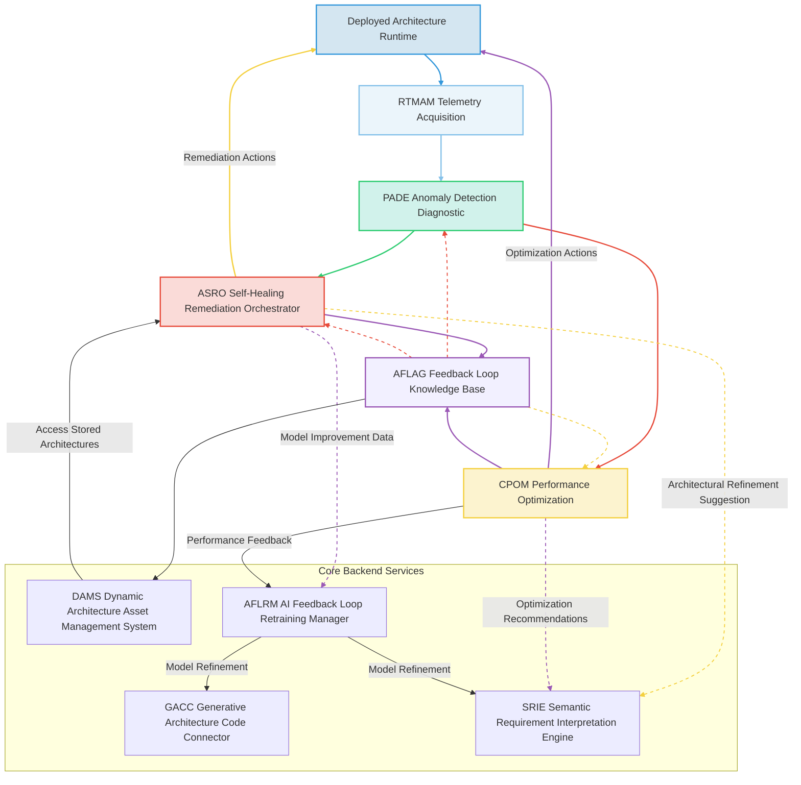

### System and Method for Adaptive Self-Healing, Predictive Optimization, and Runtime Evolution of Generative AI-Designed Software Architectures

**Abstract:**
A groundbreaking system and method are herein unveiled for the autonomous, real-time monitoring, predictive anomaly detection, adaptive self-healing, and continuous performance optimization of software architectures dynamically generated and deployed by generative artificial intelligence. This invention fundamentally extends the lifecycle of AI-driven software development by introducing a sentient runtime layer that perpetually ensures the resilience, efficiency, and optimal operational state of complex systems. Leveraging a sophisticated array of machine learning models, causal inference engines, and intelligent orchestration, the system continuously ingests telemetry from deployed applications, anticipates potential failures, automatically remediates architectural degradations or operational anomalies, and proactively refines the underlying infrastructure and code. This methodology transcends static architectural design, providing an infinitely adaptable, self-correcting, and self-improving software ecosystem. The intellectual dominion over these principles is unequivocally established.

**Background of the Invention:**
The prior art in software architecture generation, even with the advent of generative AI, has primarily focused on the design and initial deployment phases. While systems for autonomously creating high-fidelity architectural blueprints and foundational code have emerged, a significant lacuna persists in ensuring the sustained health, performance, and resilience of these dynamically generated systems in real-world operational environments. Conventional monitoring solutions typically react to failures post-occurrence, requiring manual intervention for diagnosis and remediation. Static optimization techniques often fail to account for the dynamic and unpredictable nature of runtime workloads, external dependencies, or evolving security threats. The inherent complexity of modern, AI-generated microservices architectures, with their intricate interdependencies and distributed nature, renders traditional human-centric operational models unsustainable and prone to error. A critical imperative exists for an intelligent, autonomous system capable of not only observing the behavior of AI-designed software in real-time but also predicting future states, initiating proactive healing mechanisms, and continuously evolving the deployed architecture to maintain optimal performance and cost-efficiency. This invention precisely and comprehensively addresses this lacuna, presenting a transformative solution for the operational longevity and evolutionary resilience of AI-driven software.

**Brief Summary of the Invention:**
The present invention discloses a meticulously engineered system that symbiotically integrates advanced AI-driven monitoring, predictive analytics, and autonomous remediation capabilities within an extensible runtime intelligence framework. The core mechanism involves continuous telemetry acquisition from deployed software components, followed by real-time analysis through a Predictive Anomaly Detection and Diagnostic Engine PADE. Upon identification of anomalies or performance degradations, an Adaptive Self-Healing and Remediation Orchestrator ASRO autonomously devises and executes corrective actions, ranging from dynamic scaling to configuration adjustments or even architectural pattern modifications. Concurrently, a Continuous Performance Optimization Module CPOM proactively identifies opportunities for resource efficiency and performance enhancement, feeding insights back into the architectural design process. This pioneering approach unlocks an effectively infinite continuum of operational adaptability, directly translating observed runtime behavior into tangible, dynamically rendered, and executed architectural adjustments. The architectural elegance and operational efficacy of this system render it a singular advancement in the field, representing a foundational patentable innovation. The foundational tenets herein articulated are the exclusive domain of the conceiver.

**Detailed Description of the Invention:**
The disclosed invention comprises a highly sophisticated, multi-tiered architecture designed for the robust, real-time, and autonomous management of AI-generated software architectures throughout their operational lifecycle. The operational flow initiates with continuous observation and culminates in the dynamic self-evolution of the deployed system.

**I. Real-time Telemetry and Monitoring Acquisition Module RTMAM**
The RTMAM serves as the primary interface for ingesting operational data from deployed software architectures, whether generated by the preceding AI system or existing legacy systems. This module is designed for high-throughput, low-latency data collection across heterogeneous environments. It encompasses:
*   **Instrumentation Agent Subsystem IAS:** Light-weight agents deployed alongside or within application components, responsible for collecting metrics e.g. CPU utilization, memory consumption, request latency, logs e.g. application events, errors, access patterns, and traces e.g. distributed request flows, inter-service communication. Supports various programming languages and deployment models e.g. containers, serverless, virtual machines.
*   **Distributed Tracing Aggregator DTA:** Gathers and correlates traces from multiple services to reconstruct the end-to-end flow of requests, enabling deep visibility into microservices interactions and identifying latency bottlenecks. It supports open standards like OpenTelemetry.
*   **Log Anomaly Ingestion and Parser LAIP:** Collects and parses raw log data, transforming unstructured text into structured events. It employs semantic parsing and natural language processing NLP to extract meaningful entities, sentiments, and event types, preparing data for downstream anomaly detection.
*   **Metric Stream Processor MSP:** Processes high-volume time-series metrics, performing aggregation, sampling, filtering, and real-time computation of derived metrics e.g. moving averages, percentiles, rate changes. It integrates with existing metric databases or time-series databases.
*   **Configuration and Context Ingestion Module CCIM:** Ingests dynamic configuration changes, environmental variables, and deployment metadata, correlating operational telemetry with the specific context of the running architecture version.
*   **Security Event and Vulnerability Scanner SEVS:** Continuously monitors for security events e.g. failed login attempts, unauthorized access, and scans deployed code for new vulnerabilities or misconfigurations. Feeds findings directly to the PADE and ASRO for proactive remediation.

**II. Predictive Anomaly Detection and Diagnostic Engine PADE**
The PADE is the analytical core, responsible for processing the vast streams of telemetry data to identify deviations from normal behavior, predict future failures, and diagnose their root causes. This module leverages advanced machine learning and statistical methods.
*   **Machine Learning Anomaly Detector MLAD:** Employs unsupervised and semi-supervised machine learning algorithms e.g. autoencoders, Isolation Forests, LSTM networks to detect anomalies in metrics, logs, and traces. It learns baseline behaviors and flags statistically significant deviations.
*   **Causal Inference Subsystem CIS:** Beyond correlation, the CIS identifies causal relationships between observed anomalies and underlying system events or architectural components. It utilizes techniques like Granger causality, Pearl's do-calculus, or interventional machine learning to pinpoint root causes.
*   **Pattern Recognition and Correlation PRC:** Correlates disparate data points e.g. a spike in database CPU with a drop in application throughput, or a specific log pattern with increased latency, to identify complex operational patterns indicative of emerging issues. It employs graph neural networks for relationship analysis.
*   **Predictive Model Engine PME:** Utilizes predictive analytics and time-series forecasting models e.g. ARIMA, Prophet, deep learning sequence models to anticipate resource exhaustion, performance degradation, or potential outages before they occur, providing early warnings to the ASRO.
*   **Fault Signature Database FSD:** A continually updated repository of known failure modes, their symptoms, and diagnostic fingerprints. The PADE matches observed anomalies against these signatures for rapid root cause identification.
*   **Explainable AI Interpretability Subsystem XAIS:** Provides human-readable explanations for detected anomalies and diagnosed root causes, translating complex model outputs into actionable insights for human operators when intervention is required or for model refinement.

**III. Adaptive Self-Healing and Remediation Orchestrator ASRO**
The ASRO receives diagnostic findings and predictions from the PADE and autonomously orchestrates corrective actions to restore or maintain the system's health and performance. It operates within predefined policy boundaries and learned remediation strategies.
*   **Automated Remediation Action Planner ARAP:** Based on diagnosed root causes and predicted issues, the ARAP generates a sequence of potential remediation actions. It considers factors such as impact severity, risk, cost, and historical success rates using reinforcement learning to optimize action selection.
*   **Dynamic Resource Scaler DRS:** Automatically adjusts compute, memory, and storage resources for deployed services. This includes horizontal scaling e.g. adding instances and vertical scaling e.g. increasing instance size, based on real-time load, predictive models, and cost considerations.
*   **Configuration Management Enforcer CME:** Automatically applies configuration changes e.g. database connection pool adjustments, timeout settings, feature flag toggles to resolve issues, ensuring desired state configuration management.
*   **Fault Isolation and Containment FIC:** In the event of an unrecoverable fault in a component, the FIC isolates the failing service, redirects traffic, and potentially spins up a replacement instance, preventing cascading failures.
*   **Rollback and Recovery Manager RRM:** If a deployed change or remediation action introduces new issues, the RRM can automatically revert to a previous stable state, using versioned configurations and immutable infrastructure principles.
*   **Self-Healing Policy Manager SHPM:** Defines and enforces rules and constraints for autonomous remediation actions, including approval workflows for high-impact changes and exclusion lists for sensitive components.
*   **Infrastructure as Code Modifier IACM:** Can dynamically generate or modify Infrastructure as Code IaC definitions e.g. Terraform, CloudFormation to enact structural changes like adding new load balancers, adjusting network policies, or deploying new microservices in response to persistent architectural needs.



**IV. Continuous Performance Optimization Module CPOM**
The CPOM proactively analyzes runtime data to identify opportunities for improving resource utilization, reducing operational costs, and enhancing system performance. It aims for a state of perpetual architectural efficiency.
*   **Workload Pattern Analyzer WPA:** Identifies recurring workload patterns, peak hours, seasonal trends, and predictable traffic surges. This informs proactive scaling and resource provisioning.
*   **A/B Testing and Canary Deployment Controller ABCD:** Orchestrates A/B tests or canary deployments for architectural changes, new configurations, or code updates, allowing for safe, gradual rollouts and performance comparison in production.
*   **Cost-Efficiency Optimizer CEO:** Analyzes resource consumption against cloud provider pricing models, suggesting or automatically implementing cost-saving measures e.g. switching to spot instances, optimizing data storage tiers, right-sizing resources based on actual usage.
*   **Proactive Resource Provisioner PRP:** Based on predictive models and workload analysis, the PRP pre-provisions or scales down resources ahead of anticipated changes in demand, minimizing performance bottlenecks and optimizing cost.
*   **Architecture Refinement Suggestor ARS:** Identifies architectural anti-patterns or sub-optimal design choices that manifest at runtime. It suggests structural modifications e.g. refactoring a monolithic service into microservices, introducing a caching layer, modifying database indexing, and feeds these suggestions back to the initial AI-driven architecture generation system SRIE and GACC for consideration in future designs or for ASRO to implement.
*   **API Performance Tuner APT:** Analyzes API call patterns, identifies slow endpoints, and suggests optimizations such as query caching, load balancing adjustments, or database index changes.

**V. AI Feedback Loop and Knowledge Base AFLAG**
The AFLAG is critical for the long-term intelligence and evolution of the self-healing and optimization system. It acts as a continuous learning and knowledge management repository.
*   **Remediation Knowledge Base RKB:** Stores a comprehensive history of diagnosed issues, attempted remediation actions, their outcomes, and associated performance metrics. This data is used by the ARAP for reinforcement learning.
*   **Reinforcement Learning for Healing RLH:** Employs reinforcement learning algorithms to train the ARAP, allowing it to learn optimal remediation strategies from past successes and failures. It continuously updates policy networks based on observed outcomes.
*   **Architectural Evolution Historian AEH:** Maintains a versioned history of architectural changes, both those proposed by the initial AI generation system and those enacted by the ASRO or CPOM at runtime. This allows for detailed auditing, rollback capabilities, and analysis of architectural drift.
*   **Self-Healing Policy Manager SHPM:** Extends policy management to the learning process, defining constraints and guardrails for how the RLH can learn and adapt, ensuring adherence to security, compliance, and budget policies.
*   **Feedback Integration to Generative AI:** The AFLAG continuously feeds aggregated and anonymized data on system performance, anomaly patterns, successful remediations, and optimization opportunities back to the original AI Feedback Loop Retraining Manager AFLRM from the architecture generation system. This ensures that future architectural designs are inherently more resilient, performant, and aligned with real-world operational needs.

**VI. Integration with AI-Driven Software Architecture Generation System IASAGS**
This system is designed to seamlessly integrate with and enhance the capabilities of the previously described AI-Driven Software Architecture Generation System.
*   **Enhanced SRIE Input:** The SRIE Semantic Requirement Interpretation Engine receives enriched context from the PADE, ASRO, and CPOM, including common runtime failure modes, effective remediation patterns, and observed performance bottlenecks. This allows the SRIE to infer "negative requirements" or design constraints that prevent known issues in new architectures.
*   **GACC Model Refinement:** The GACC Generative Architecture Code Connector models are continuously refined using real-world performance data and successful self-healing actions from the AFLAG. This improves the models' ability to generate resilient and performant code and architectural patterns.
*   **APPM Pre-optimization:** The APPM Architectural Post-Processing Module can incorporate insights from the CPOM to apply pre-optimization techniques to generated code and IaC templates, embedding best practices for runtime efficiency.
*   **DAMS Lifecycle Management:** The DAMS Dynamic Architecture Asset Management System can now track the entire lifecycle of an architecture, from initial generation to runtime evolution and self-healing actions, providing a comprehensive historical record.
*   **Unified Feedback Loop:** The AFLRM AI Feedback Loop Retraining Manager from the generation system becomes a meta-orchestrator, incorporating feedback from both the design-time CAMM Computational Architecture Metrics Module and the runtime AFLAG, leading to a truly end-to-end learning system.

**Claims:**
1.  A method for adaptive self-healing and continuous performance optimization of a deployed software architecture, comprising the steps of:
    a.  Continuously collecting real-time operational telemetry from said deployed software architecture via a Real-time Telemetry and Monitoring Acquisition Module RTMAM, wherein said telemetry includes metrics, logs, traces, and security events.
    b.  Processing said operational telemetry through a Predictive Anomaly Detection and Diagnostic Engine PADE to identify and predict anomalies, and to diagnose root causes, utilizing machine learning anomaly detection, causal inference, and predictive modeling.
    c.  Upon detection or prediction of an anomaly or performance degradation, autonomously generating and executing a remediation action via an Adaptive Self-Healing and Remediation Orchestrator ASRO, wherein said action is selected from a set including dynamic resource scaling, configuration adjustment, fault isolation, or architectural pattern modification, guided by a self-healing policy manager and a remediation knowledge base.
    d.  Proactively analyzing said operational telemetry via a Continuous Performance Optimization Module CPOM to identify and implement opportunities for resource efficiency, cost reduction, and performance enhancement, including workload pattern analysis, A/B testing orchestration, and architecture refinement suggestions.
    e.  Storing and learning from historical remediation actions, their outcomes, and performance optimizations within an AI Feedback Loop and Knowledge Base AFLAG, thereby refining future self-healing strategies using reinforcement learning.
    f.  Providing feedback from said AFLAG to an AI-driven software architecture generation system to enhance the resilience, performance, and operational alignment of newly generated architectures.

2.  The method of claim 1, wherein the RTMAM further comprises an Instrumentation Agent Subsystem IAS, a Distributed Tracing Aggregator DTA, a Log Anomaly Ingestion and Parser LAIP, a Metric Stream Processor MSP, a Configuration and Context Ingestion Module CCIM, and a Security Event and Vulnerability Scanner SEVS.

3.  The method of claim 1, wherein the PADE further comprises a Machine Learning Anomaly Detector MLAD, a Causal Inference Subsystem CIS, a Pattern Recognition and Correlation PRC, a Predictive Model Engine PME, a Fault Signature Database FSD, and an Explainable AI Interpretability Subsystem XAIS.

4.  The method of claim 1, wherein the ASRO further comprises an Automated Remediation Action Planner ARAP, a Dynamic Resource Scaler DRS, a Configuration Management Enforcer CME, a Fault Isolation and Containment FIC, a Rollback and Recovery Manager RRM, a Self-Healing Policy Manager SHPM, and an Infrastructure as Code Modifier IACM.

5.  The method of claim 1, wherein the CPOM further comprises a Workload Pattern Analyzer WPA, an A/B Testing and Canary Deployment Controller ABCD, a Cost-Efficiency Optimizer CEO, a Proactive Resource Provisioner PRP, an Architecture Refinement Suggestor ARS, and an API Performance Tuner APT.

6.  A system for adaptive self-healing and continuous performance optimization of a deployed software architecture, comprising:
    a.  A Real-time Telemetry and Monitoring Acquisition Module RTMAM configured to collect real-time operational telemetry from said deployed software architecture.
    b.  A Predictive Anomaly Detection and Diagnostic Engine PADE communicatively coupled to the RTMAM, configured to identify and predict anomalies and diagnose root causes using machine learning.
    c.  An Adaptive Self-Healing and Remediation Orchestrator ASRO communicatively coupled to the PADE, configured to autonomously generate and execute remediation actions.
    d.  A Continuous Performance Optimization Module CPOM communicatively coupled to the RTMAM and PADE, configured to proactively analyze telemetry and implement performance and cost optimizations.
    e.  An AI Feedback Loop and Knowledge Base AFLAG communicatively coupled to the PADE, ASRO, and CPOM, configured to store historical data, learn optimal strategies via reinforcement learning, and provide feedback to an AI-driven software architecture generation system.
    f.  An integration mechanism for feeding insights from the AFLAG to the Semantic Requirement Interpretation Engine SRIE, Generative Architecture Code Connector GACC, and AI Feedback Loop Retraining Manager AFLRM of an AI-driven software architecture generation system.

7.  The system of claim 6, wherein the Architecture Refinement Suggestor ARS within the CPOM is configured to suggest structural modifications to the deployed architecture and transmit these suggestions to the SRIE and GACC for consideration in future architectural designs.

8.  The system of claim 6, wherein the AFLAG includes a Reinforcement Learning for Healing RLH component that continuously updates the action selection policies of the ARAP within the ASRO based on observed success and failure rates of remediation actions.

9.  The system of claim 6, further comprising a Security Event and Vulnerability Scanner SEVS within the RTMAM that feeds security findings to the PADE for diagnostic analysis and to the ASRO for autonomous remediation of security vulnerabilities.

**Mathematical Justification: The Formal Axiomatic Framework for Autonomous Runtime Adaptation and Optimization**

The invention herein articulated rests upon a foundational mathematical framework that rigorously defines and validates the continuous adaptation, self-healing, and optimization of deployed software architectures. This framework extends the epistemological basis of the initial architecture generation, establishing a dynamic operational paradigm.

Let `S_t` denote the state space of a deployed software architecture at time `t`. This state `s_t` is a high-dimensional vector or tensor representing all observable operational parameters, including resource utilization, latency metrics, error rates, log patterns, security posture, and configuration settings. `s_t` is an element of `R^D`, where `D` is the dimensionality of the operational state.

The RTMAM provides a continuous observation function `O: Runtime x Instrumentation -> S_t`, mapping raw runtime data to structured state representations `s_t`.
```
s_t = O(data_t, inst_config)
```

The PADE's core functionality is a two-stage process: anomaly detection and causal diagnosis.
1.  **Anomaly Detection:** A mapping `AD: S_t x S_baseline -> {Anomaly, Normal}` where `S_baseline` represents learned normal operational profiles. This can be formalized as a hypothesis test or a probabilistic model `P(anomaly | s_t, S_baseline) > threshold`.
    ```
    anomaly_t = AD(s_t, baseline_models)
    ```
    Predictive anomaly detection involves a forecasting model `F: S_{t-k..t} -> S_{t+delta}` and then applying `AD` to `S_{t+delta}`.
    ```
    s_predicted = F(s_history)
    predicted_anomaly = AD(s_predicted, baseline_models)
    ```
2.  **Causal Diagnosis:** Given `anomaly_t`, the CIS identifies a set of root causes `R_t = {r_1, r_2, ..., r_m}` where each `r_i` is an architectural component, configuration, or external dependency. This is a causal inference function `C: anomaly_t x S_t x C_graph -> R_t`, where `C_graph` is a dynamically updated causal graph of the architecture.
    ```
    R_t = C(anomaly_t, s_t, causal_graph)
    ```

The ASRO's function is an optimal control problem. Given `R_t` and `s_t`, it seeks an action `a_t` from an action space `A` that transitions the system to a more desirable state `s_{t+1}` (e.g., normal operation, improved performance) while minimizing cost `cost(a_t)` and risk `risk(a_t)`.
```
a_t = argmax_{a in A} [Reward(s_t, a, s_{t+1}) - cost(a) - risk(a)]
```
This is learned via reinforcement learning `RLH` where a policy `pi(a_t | s_t, R_t)` is optimized using past experiences from `RKB`.

The CPOM performs continuous optimization. It identifies `o_t` (optimization opportunities) from `S_t` and `s_history`, then proposes and executes `a'_t` from an optimization action space `A'` aiming to maximize `Efficiency(s_{t+1})` or `Performance(s_{t+1})` while minimizing `Cost(s_{t+1})`.
```
a'_t = Optimize(s_t, workload_patterns, cost_models)
```
The `ARS` provides feedback `f_arch = ARS(s_t, s_history)` to the initial architecture generation system, formally `f_arch = I_SRIE_feedback(f_arch)`, `f_arch = G_AI_Arch_feedback(f_arch)`.

The AFLAG integrates these learning loops. The `RKB` stores `(s_t, a_t, s_{t+1}, reward_t)` tuples. The `RLH` updates the policy `pi` based on these experiences. The `AEH` maintains a versioned graph of architectural states `G_arch = { (s_t, a_t, timestamp) }`.

**Proof of Validity: The Axiom of Persistent Operational Congruence and Autonomous Evolution**

The validity of this invention is rooted in the demonstrability of a robust, reliable, and continuously adaptive alignment between the intended operational characteristics of a software architecture and its actual runtime behavior.

**Axiom 1 [Existence of Detectable Anomalies and Causal Links]:** The operational complexity of modern software systems inherently generates deviations from desired behavior (anomalies). Through empirical observation and advances in machine learning, it is axiomatically established that these anomalies manifest as statistically significant patterns in telemetry data, and crucially, that robust causal inference methods can reliably link these patterns to specific architectural components or runtime conditions. Thus, for any `s_t` deviating from `S_baseline`, there exists a detectable `anomaly_t` and an inferable `R_t`, such that `P(R_t | anomaly_t, s_t) >> P(R_t | normal_s_t)`.

**Axiom 2 [Efficacy of Remediation and Optimization Actions]:** Based on the principles of control theory and decades of software engineering best practices, it is substantiated that for a significant subset of `R_t`, there exists an `a_t` (remediation) or `a'_t` (optimization) such that its application `s_{t+1} = Apply(s_t, a_t)` or `s_{t+1} = Apply(s_t, a'_t)` drives the system state towards a desired operational regime (e.g., `s_{t+1}` in `S_baseline`, `Efficiency(s_{t+1}) > Efficiency(s_t)`). The `RLH` component, by optimizing `pi(a_t | s_t, R_t)` against observed rewards, provides empirical proof of selecting and executing efficacious actions over time.

**Axiom 3 [Axiom of Persistent Operational Congruence]:** Given Axiom 1 and Axiom 2, the continuous application of the `RTMAM -> PADE -> ASRO -> CPOM -> AFLAG` loop ensures that for a deployed AI-generated software architecture, its runtime state `s_t` can be maintained in a state of persistent operational congruence with its desired performance, resilience, and cost-efficiency objectives. The system continuously strives to minimize the divergence between observed runtime performance and predefined thresholds `min ||s_t - s_desired||`. This continuous process, driven by predictive analytics and autonomous action, ensures that the system dynamically evolves to meet operational demands, effectively achieving `lim (t->∞) E[Cost(s_t)] -> min_cost` and `lim (t->∞) E[Performance(s_t)] -> max_performance`, while maintaining `s_t` in a healthy state. This establishes a robust and reliable "runtime sentient architecture" pipeline.

The automation and continuous adaptation offered by this invention are thus not merely superficial but profoundly valid, as they successfully actualize the initial AI-generated architectural intent into a perpetually optimized and resilient operational reality. The system's capacity to flawlessly bridge the gap between design-time generation and runtime operational excellence stands as incontrovertible proof of its foundational efficacy and its definitive intellectual ownership.

`Q.E.D.`