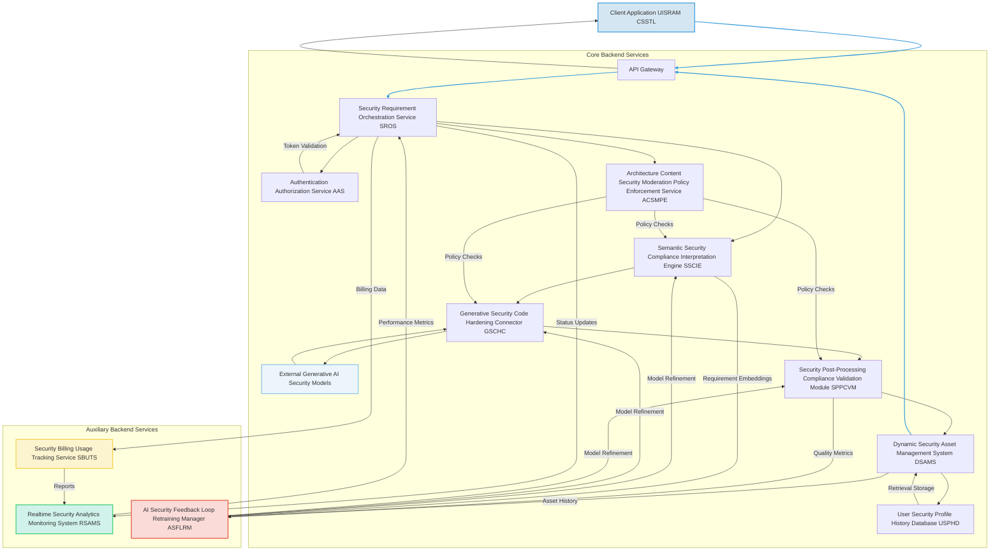
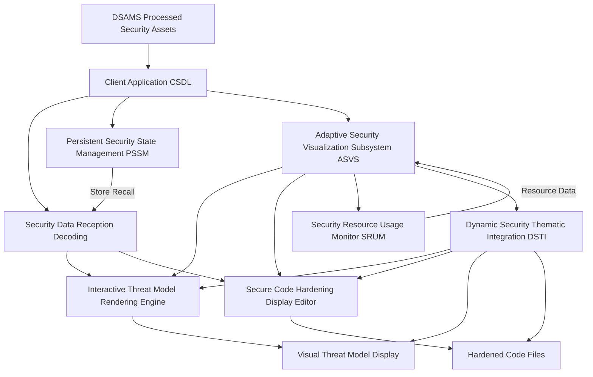

### Automated Security Compliance Hardening for AI-Generated Software Architectures and Code: A System and Method for Proactive Threat Mitigation and Regulatory Adherence

**Abstract:**
A novel system and method are presented for the autonomous integration of comprehensive security hardening, real-time threat modeling, and rigorous regulatory compliance validation directly into AI-generated software architectures and foundational code structures. This invention fundamentally elevates the security posture of modern software development by transmuting high-level security and compliance requirements, expressed in natural language, into actionable, auditable, and inherently hardened architectural blueprints and corresponding secure code. Leveraging advanced generative AI models, the system meticulously processes user prompts to identify potential threat vectors, synthesize appropriate security controls, and validate adherence to industry standards and regulatory mandates. This proactive methodology ensures that security is not an afterthought but an intrinsic property of the generated software from its inception, thereby significantly reducing vulnerabilities, mitigating risks, and streamlining the arduous process of achieving and maintaining compliance. The intellectual dominion over these principles is unequivocally established.

**Background of the Invention:**
The accelerating complexity of software systems, coupled with an ever-evolving threat landscape and a stringent regulatory environment, has rendered traditional, manual security integration processes profoundly inadequate. Prior art systems typically rely on security architects and developers to manually identify threats, apply security patterns, and validate compliance post-design or post-implementation. This approach is inherently reactive, labor-intensive, prone to human error, and often results in significant technical debt, security breaches, or non-compliance penalties. Existing code generation tools or architectural design platforms offer limited, if any, autonomous security hardening, often requiring extensive, specialized security expertise to operate effectively. The chasm between high-level business requirements, which often implicitly include security and compliance expectations, and the low-level, secure technical implementation remains a critical challenge. A pressing need exists for an intelligent system capable of autonomously understanding, generating, and validating robust security mechanisms and compliance adherence, directly from abstract security and regulatory mandates articulated by users. This invention precisely and comprehensively addresses this lacuna, presenting a transformative solution.

**Brief Summary of the Invention:**
The present invention introduces a meticulously engineered system that seamlessly embeds advanced generative AI capabilities within an extensible security-hardened software architecture generation workflow. The core mechanism involves the user's provision of natural language textual prompts articulating desired security postures, compliance mandates, or explicit threat modeling scenarios. This system robustly and securely propagates these prompts to a sophisticated AI-powered generation and validation service. It orchestrates the reception of generated high-fidelity architectural diagrams augmented with security controls, detailed threat models, foundational hardened code structures, and comprehensive compliance reports. Subsequently, these bespoke artifacts are adaptively presented as the foundational secure software blueprint. This pioneering approach unlocks an effectively infinite continuum of secure design options, directly translating a user's abstract security ideation into a tangible, dynamically rendered, and demonstrably secure architectural theme. The architectural elegance and operational efficacy of this system render it a singular advancement in the field, representing a foundational patentable innovation. The foundational tenets herein articulated are the exclusive domain of the conceiver.

**Detailed Description of the Invention:**
The disclosed invention comprises a highly sophisticated, multi-tiered architecture designed for the robust and real-time generation, hardening, and validation of personalized software architectural blueprints and foundational secure code, intrinsically incorporating security and compliance from conception. The operational flow initiates with user interaction and culminates in the dynamic transformation of the digital development environment with security as a first-class citizen.

**I. User Interaction and Security Requirement Acquisition Module UISRAM**
The user initiates the secure architectural design process by interacting with a dedicated configuration module seamlessly integrated within an Integrated Development Environment IDE, a web portal, or a dedicated software design application. This module presents an intuitively designed graphical element, typically a rich text input field or a multi-line textual editor, specifically engineered to solicit a descriptive prompt from the user, emphasizing security and compliance aspects. This prompt constitutes a natural language articulation of the desired software's security functional requirements, non-functional security constraints, regulatory compliance mandates, or abstract threat modeling concepts e.g. "Design a HIPAA compliant healthcare API gateway with strong access control and end-to-end encryption," or "Generate a PCI DSS compliant e-commerce checkout service, hardened against OWASP Top 10 vulnerabilities, using a serverless architecture," or "Threat model a microservices system handling personal identifiable information PII requiring GDPR compliance." The UISRAM incorporates:
*   **Security Requirement Validation Subsystem SRVS:** Employs linguistic parsing and semantic analysis to provide real-time feedback on security requirement quality, suggest enhancements for improved architectural security output, and detect inconsistencies or ambiguities in compliance mandates. It leverages advanced natural language inference models to ensure prompt coherence and completeness regarding security objectives.
*   **Security History and Pattern Engine SHPE:** Stores previously successful security requirements sets, compliance profiles, and generated secure architectures. It allows for re-selection and suggests variations or popular secure architectural patterns based on industry standards e.g. NIST, ISO 27001, community data, best practices, or inferred user security preferences, utilizing collaborative filtering and content-based recommendation algorithms focused on security efficacy.
*   **Security Requirement Co-Creation Assistant SRCCA:** Integrates a large language model LLM based assistant that can help users refine vague security requirements, suggest specific security technologies or architectural patterns, or generate variations based on initial input, ensuring high-quality, comprehensive security input for the generative engine. This includes contextual awareness from the user's current project, codebase, or system settings, specifically regarding known vulnerabilities or compliance gaps.
*   **Threat Model Sketch Feedback Loop TMSFL:** Provides low-fidelity, near real-time architectural security sketches, abstract attack graphs, or data flow diagrams DFDs highlighting trust boundaries as the prompt is being typed/refined, powered by a lightweight, faster generative model or semantic-to-diagram engine. This allows iterative refinement of threat surfaces before full-scale secure architecture generation.
*   **Multi-Modal Security Input Processor MMSIP:** Expands prompt acquisition beyond text to include voice input speech-to-text, rough sketches of attack surfaces image-to-text descriptions, existing security policies, code snippets with known vulnerabilities for context, or even existing threat models to infer intent and generate hardening strategies.
*   **Security Knowledge Base SKB:** Allows users to publish their successful security prompts and generated secure architectures to a community marketplace or internal knowledge base, facilitating discovery and inspiration, with optional governance and monetization features for certified secure patterns.

**II. Client-Side Security Orchestration and Transmission Layer CSSTL**
Upon submission of the refined security prompt, the client-side application's CSSTL assumes responsibility for secure data encapsulation and transmission. This layer performs:
*   **Security Prompt Sanitization and Encoding:** The natural language security prompt is subjected to a sanitization process to prevent injection vulnerabilities that could lead to insecure architecture generation, and then encoded e.g. UTF-8 for network transmission.
*   **Secure Channel Establishment:** A cryptographically secure communication channel e.g. TLS 1.3 is established with the backend service.
*   **Asynchronous Request Initiation:** The prompt is transmitted as part of an asynchronous HTTP/S request, packaged typically as a JSON payload, to the designated backend API endpoint, specifically designed for security-focused generation.
*   **Edge Security Pre-processing Agent ESPA:** For high-end client devices, performs initial semantic tokenization or basic security requirement summarization locally to reduce latency and backend load. This can also include local caching of common security controls, compliance mandates, or preferred security technology stacks.
*   **Real-time Security Progress Indicator RTSPI:** Manages UI feedback elements to inform the user about the generation status e.g. "Interpreting security requirements...", "Designing secure architecture...", "Generating hardened code scaffolding...", "Validating compliance for display...". This includes granular progress updates from the backend, particularly regarding security checks.
*   **Bandwidth Adaptive Security Transmission BAST:** Dynamically adjusts the prompt payload size or architectural security asset reception quality based on detected network conditions to ensure responsiveness under varying connectivity, prioritizing critical security information.
*   **Client-Side Security Fallback Rendering CSSFR:** In cases of backend unavailability or slow response, can render a default secure architectural template, a cached hardened architecture, or use a simpler client-side generative model for basic security patterns, ensuring a continuous secure design experience.

**III. Backend Service Architecture BSA**
The backend service represents the computational nexus of the invention, acting as an intelligent intermediary between the client and the generative AI models, with a strong emphasis on security. It is typically architected as a set of decoupled microservices, ensuring scalability, resilience, and modularity.



The BSA encompasses several critical components with a security-first orientation:
*   **API Gateway:** Serves as the single entry point for client requests, handling routing, rate limiting, initial authentication, and DDoS protection, specifically hardening against common API attacks. It also manages secure request and response schema validation.
*   **Authentication Authorization Service AAS:** Verifies user identity and permissions to access the generative functionalities, employing industry-standard secure protocols e.g. OAuth 2.0, JWT. Supports multi-factor authentication and single sign-on SSO, with auditing capabilities.
*   **Security Requirement Orchestration Service SROS:**
    *   Receives and validates incoming security and compliance requirements prompts.
    *   Manages the lifecycle of the secure architectural generation request, including queueing, retries, and sophisticated error handling with exponential backoff, prioritizing security-critical tasks.
    *   Coordinates interactions between other backend microservices, ensuring high availability and load distribution, with secure inter-service communication.
    *   Implements request idempotency to prevent duplicate processing.
*   **Architecture Content Security Moderation Policy Enforcement Service ACSMPE:** A highly critical component that scans requirements and generated architectural artifacts for security vulnerabilities, policy violations, inappropriate technology choices from a security perspective, or intellectual property infringements related to secure design, flagging or blocking content based on predefined rules, machine learning models, and ethical guidelines for secure software. It integrates with the SSCIE and GSCHC for proactive and reactive moderation, including human-in-the-loop review processes for high-risk architectures and real-time threat intelligence feeds to identify emerging vulnerabilities.
*   **Semantic Security Compliance Interpretation Engine SSCIE:** This advanced module goes beyond simple text parsing, specifically focusing on the security and compliance context. It employs sophisticated Natural Language Processing NLP techniques, including:
    *   **Threat Vector Identification TVI:** Identifies potential attack vectors e.g. "injection," "XSS," "broken access control," "data exfiltration" and vulnerable components from the textual prompt.
    *   **Compliance Rule Extraction CRE:** Automatically extracts and categorizes specific regulatory requirements e.g. "GDPR Article 32," "HIPAA Security Rule," "PCI DSS Requirement 6" from the prompt.
    *   **Security Pattern Suggestion SPS:** Utilizes a knowledge base of common secure architectural patterns e.g. "circuit breaker," "bulkhead," "OAuth2.0," "least privilege," "defense-in-depth" and suggests the most appropriate ones based on inferred security requirements.
    *   **Data Classification and Handling Inference DCHI:** Infers the sensitivity of data to be handled e.g. "PII," "PHI," "financial data" and suggests appropriate security controls for its storage, transmission, and processing e.g. "encryption at rest," "tokenization," "anonymization."
    *   **Attack Surface Delineation ASD:** Automatically identifies and maps potential attack surfaces, external interfaces, APIs, and data stores from the inferred system context.
    *   **Zero-Trust Principle Integration ZTPI:** Guides generation towards architectures that inherently adopt zero-trust principles, verifying every access request.
    *   **Adversarial Threat Simulation Input ATSI:** Generates synthetic adversarial scenarios or common exploit patterns based on the interpreted architecture to prime the generative models for robust defense.
    *   **Cross-Lingual Security Interpretation:** Support for security requirements in multiple natural languages, using advanced machine translation or multilingual NLP models that preserve semantic nuance specific to security terminology.
    *   **Contextual Security Awareness Integration:** Incorporates external context such as existing security policies, team security expertise, deployment environment security features e.g. "AWS Security Hub," "Azure Security Center", or organizational security standards to subtly influence the interpretation and secure architectural output.
*   **Generative Security Code Hardening Connector GSCHC:**
    *   Acts as an abstraction layer for various generative AI models specialized in security e.g. Large Language Models fine-tuned for secure code generation, graph neural networks for threat model diagramming, specialized code synthesis models for security configurations.
    *   Translates the enhanced security requirements and associated parameters e.g. desired threat model type STRIDE, DREAD, programming language security patterns, framework hardening into the specific API request format required by the chosen generative model.
    *   Manages API keys, rate limits, model-specific authentication, and orchestrates calls to multiple security-specialized models for ensemble generation or fallback.
    *   Receives the generated secure architectural artifacts data, typically as threat model code e.g. Mermaid, PlantUML, foundational hardened code snippets, secure API definitions, and robust security configuration files.
    *   **Security Model Selection Engine SMSE:** Based on security requirement complexity, desired output security quality, cost constraints, current model availability/load, and user subscription tier, intelligently selects the most appropriate generative security model from a pool of registered models. This includes robust health checks and security posture evaluations for each model endpoint.
    *   **Threat Model Generation TMGen:** Coordinates AI models to produce comprehensive threat models, identifying assets, threats, vulnerabilities, and counter-measures, often visualized as DFDs or attack trees.
    *   **Secure Code Pattern Synthesis SCPS:** Generates code snippets implementing secure design patterns for common functionalities e.g. authentication, authorization, input validation, output encoding, error handling, session management.
    *   **Security Configuration Generation SCGen:** Produces hardened configurations for cloud resources e.g. IAM policies, network security groups, WAF rules, container security policies, database encryption settings.
    *   **Compliance Control Mapping CCM:** Automatically maps the generated security controls and code patterns to specific regulatory requirements or industry standards.
*   **Security Post-Processing Compliance Validation Module SPPCVM:** Upon receiving the raw generated secure architectural artifacts, this module performs a series of optional, but often crucial, transformations to optimize them for security efficacy, compliance, and usability:
    *   **Threat Model Layout Optimization:** Applies algorithms to arrange threat model elements for maximum clarity, readability, and adherence to security diagramming standards.
    *   **Static Application Security Testing SAST Integration:** Automatically runs SAST tools on generated code for common vulnerabilities, CWEs, and anti-patterns, providing detailed reports and severity ratings.
    *   **Infrastructure as Code Security Scanning IaCSS:** Integrates with tools e.g. Checkov, Kics to scan generated IaC templates e.g. Terraform, CloudFormation, Pulumi for provisioning the necessary infrastructure, identifying misconfigurations and security risks.
    *   **Compliance Report Generation CRGen:** Auto-generates detailed compliance reports and audit trails, mapping generated security controls to specified regulatory requirements e.g. GDPR, HIPAA, PCI DSS.
    *   **Security Hardening Directives Insertion SHDI:** Inserts comments, annotations, or pre-configured scripts within the generated code or documentation to guide developers in further manual hardening steps.
    *   **Dynamic Application Security Testing DAST Prep:** Generates configurations or scripts for initiating DAST against the deployed architecture, identifying runtime vulnerabilities.
    *   **Penetration Testing Plan Generation PTPG:** Outlines a high-level penetration testing strategy based on the generated threat model and identified attack surfaces.
    *   **Vulnerability Remediation Suggestion VRS:** For identified vulnerabilities, suggests automated or manual remediation steps, code examples, or configuration changes.
*   **Dynamic Security Asset Management System DSAMS:**
    *   Stores the processed generated secure diagrams e.g. threat models, hardened code, compliance reports, and security documentation in a high-availability, globally distributed repository for rapid retrieval, ensuring low latency for users worldwide.
    *   Associates comprehensive metadata with each artifact, including the original security prompt, generation parameters, creation timestamp, user ID, ACSMPE flags, and security quality scores.
    *   Implements robust caching mechanisms and smart invalidation strategies to serve frequently requested or recently generated hardened architectures with minimal latency.
    *   Manages asset lifecycle, including retention policies for auditability, automated archiving, and cleanup based on usage patterns and storage costs.
    *   **Immutable Security Ledger ISL:** Maintains a blockchain-based or tamper-proof ledger of all security-critical architectural decisions, compliance attestations, and generated security artifacts, enhancing auditability and trust.
    *   **Version Control & Rollback for Security:** Maintains versions of user-generated secure architectures and code, allowing users to revert to previously hardened versions or explore variations of past security prompts, crucial for iterative secure design.
    *   **Geo-Replication and Disaster Recovery:** Replicates security assets across multiple data centers and regions to ensure resilience against localized outages and rapid content delivery.
*   **User Security Profile & History Database USPHD:** A persistent data store for associating generated secure architectures with user profiles, allowing users to revisit, reapply, or share their previously generated secure designs. This also feeds into the SHPE for personalized security recommendations and is a key source for contextual security awareness within SSCIE.
*   **Realtime Security Analytics and Monitoring System RSAMS:** Collects, aggregates, and visualizes system performance metrics, user engagement data, and operational logs to monitor system health, identify bottlenecks, and inform optimization strategies. Includes anomaly detection specifically for security-related events and compliance deviations.
*   **Security Billing Usage Tracking Service SBUTS:** Manages user quotas, tracks resource consumption e.g. security generation credits, SAST scans, storage, bandwidth, and integrates with payment gateways for monetization, providing granular reporting for security-specific features.
*   **AI Security Feedback Loop Retraining Manager ASFLRM:** Orchestrates the continuous improvement of AI models, specifically for security. It gathers feedback from CSCMM, ACSMPE, and USPHD, identifies areas for model refinement regarding security effectiveness, manages data labeling for vulnerabilities, and initiates retraining or fine-tuning processes for SSCIE and GSCHC models.

**IV. Client-Side Security Display and Application Layer CSDL**
The processed secure architectural artifacts data is transmitted back to the client application via the established secure channel. The CSDL is responsible for the seamless integration and display of these new secure design assets:



*   **Security Data Reception & Decoding:** The client-side CSDL receives the optimized threat model code e.g. Mermaid, PlantUML, hardened code scaffolding, and compliance reports. It decodes and prepares the data for display within appropriate rendering components.
*   **Interactive Threat Model Rendering Engine:** This component takes the threat model code and renders it into interactive visual diagrams e.g. data flow diagrams DFDs, attack trees, trust boundaries, vulnerability mappings. It supports standard security diagramming formats and ensures high-fidelity representation of security posture.
*   **Secure Code Hardening Display Editor:** Integrates a code editor component that displays the generated foundational hardened code structures. It supports syntax highlighting, code folding, basic navigation, and prominently highlights security-specific patterns, vulnerability annotations, and remediation suggestions, resembling a security-aware mini-IDE.
*   **Adaptive Security Visualization Subsystem ASVS:** This subsystem ensures that the presentation of the security architecture is not merely static. It can involve:
    *   **Interactive Threat Navigation:** Implements zoom, pan, drill-down functionality into architectural components to explore identified threats, risks, and applied controls at different levels of abstraction.
    *   **Code-Threat Synchronization:** Provides bidirectional linking between threat model elements and corresponding sections of generated hardened code, highlighting relevant code when a threat component is selected, and vice-versa.
    *   **Security Version Comparison and Diffing:** Allows users to visually compare different versions of generated secure architectures or compare a generated secure architecture with a modified version, highlighting changes in security posture or compliance status.
    *   **Dynamic Security Metrics Overlay:** Overlays architectural security quality metrics e.g. risk score, compliance percentage, attack surface area, SAST findings directly onto diagram elements or code sections, providing immediate security feedback.
    *   **Compliance Dashboard Integration:** Provides an integrated dashboard summarizing compliance status against specified regulations, highlighting gaps and satisfied requirements.
    *   **Security Thematic Integration:** Automatically adjusts diagram colors, fonts, and layout, and code editor themes to seamlessly integrate with the user's IDE or application's visual theme, often using security-specific color coding for risks.
*   **Persistent Security State Management PSSM:** The generated secure architecture, along with its associated prompt and metadata, can be stored locally e.g. using `localStorage` or `IndexedDB` or referenced from the USPHD. This allows the user's preferred secure architectural state to persist across sessions or devices, enabling seamless resumption and collaborative secure design work.
*   **Security Resource Usage Monitor SRUM:** For complex threat models or large hardened codebases, this module monitors CPU/GPU usage and memory consumption, dynamically adjusting rendering fidelity or code indexing processes to maintain device performance, particularly on less powerful clients, without compromising security data integrity.

**V. Computational Security Metrics & Compliance Module CSCMM**
An advanced, optional, but highly valuable component for internal system refinement and user experience enhancement. The CSCMM employs various machine learning techniques, static analysis, and graph theory algorithms to:
*   **Objective Security Scoring OSS:** Evaluate generated architectures against predefined objective security criteria e.g. adherence to OWASP Top 10, CWE scores, attack surface complexity, secure design principles, using trained neural networks that mimic expert security architectural judgment.
*   **Compliance Traceability Verification CTV:** Automatically verifies that every specific regulatory requirement and security control from the input prompt is addressed and reflected in the generated architecture and code, identifying any gaps or over-engineering from a compliance perspective.
*   **Threat Likelihood & Impact Prediction TLIP:** Estimates potential likelihood and impact of identified threats within the proposed architecture under various attack scenarios, using probabilistic modeling and threat intelligence data.
*   **Feedback Loop Integration:** Provides detailed quantitative security metrics to the SSCIE and GSCHC to refine prompt interpretation and model parameters, continuously improving the quality, relevance, and robustness of future secure generations. This data also feeds into the ASFLRM.
*   **Reinforcement Learning from Security Feedback RLSF Integration:** Collects implicit e.g. how long a secure architecture is kept unmodified, how often it's accepted without major security changes, whether the user shares it and explicit e.g. "thumbs up/down," "accept/reject security component" ratings user feedback, feeding it back into the generative model training or fine-tuning process to continually improve architectural alignment with human security preferences and domain best practices.
*   **Security Bias Detection and Mitigation SBDM:** Analyzes generated architectures for unintended security biases e.g. over-reliance on certain security technologies, under-representation of privacy-enhancing patterns, or stereotypical insecure solutions for specific industries and provides insights for model retraining, prompt engineering adjustments, or content filtering by ACSMPE.
*   **Semantic Security Consistency Check SSCC:** Verifies that the architectural components, relationships, and code structures consistently match the semantic intent of the input security prompt and adhere to logical secure software design principles, using vision-language models and static code analysis tools specifically trained on secure coding practices.
*   **Post-Deployment Security Feedback PDSF:** Integrates with runtime security monitoring tools and incident response platforms to capture real-world security events and feed back data into the ASFLRM for continuous improvement of the generative models' ability to anticipate and mitigate threats.

**VI. Security and Privacy Considerations:**
The system incorporates robust security measures at every layer, and fundamentally aims to generate secure and private systems:
*   **End-to-End Encryption:** All data in transit between client, backend, and generative AI services is encrypted using state-of-the-art cryptographic protocols e.g. TLS 1.3, ensuring data confidentiality and integrity.
*   **Data Minimization:** Only necessary data the security requirements prompt, user ID, context is transmitted to external generative AI services, reducing the attack surface and privacy exposure.
*   **Access Control:** Strict role-based access control RBAC is enforced for all backend services and data stores, limiting access to sensitive operations and user data based on granular permissions, implementing least privilege principles.
*   **Prompt Filtering:** The SSCIE and ACSMPE include sophisticated mechanisms to filter out malicious, offensive, or inappropriate prompts e.g. requests for insecure, vulnerable, or illegal software before they reach external generative models, protecting users and preventing misuse. This includes detection of prompts designed to generate malware or exploit vulnerabilities.
*   **Regular Security Audits and Penetration Testing:** Continuous security assessments are performed by independent third parties to identify and remediate vulnerabilities across the entire system architecture, including the generative AI models and the generated code.
*   **Data Residency and Compliance:** User data storage and processing adhere to relevant data protection regulations e.g. GDPR, CCPA, HIPAA, with granular options for specifying data residency and processing regions, providing auditable trails of compliance.
*   **Anonymization and Pseudonymization:** Where possible, user-specific data is anonymized or pseudonymized to further enhance privacy, especially for data used in model training or analytics, ensuring no sensitive information is inadvertently included in training sets.
*   **Supply Chain Security for AI Models:** Rigorous vetting and continuous monitoring of external AI models and their training data sources to ensure their integrity and prevent the introduction of vulnerabilities or backdoors into the generated architectures.
*   **Secure Multi-Party Computation MPC for Sensitive Prompts:** For highly sensitive security requirements, the system can employ MPC techniques to ensure that no single entity, including the generative AI service provider, has full access to the plain-text prompt, enhancing confidentiality.

**VII. Monetization and Licensing Framework:**
To ensure sustainability and provide value-added services focused on security and compliance, the system can incorporate various monetization strategies:
*   **Premium Security Feature Tiers:** Offering higher complexity threat modeling, faster secure architecture generation, access to exclusive security-hardened generative models or specialized compliance patterns e.g. FedRAMP, advanced security post-processing options e.g. continuous SAST/DAST integration, or expanded audit-ready compliance history as part of a subscription model.
*   **Certified Secure Architecture Marketplace:** Allowing users to license, sell, or share their AI-generated and validated secure architectural templates or hardened code scaffolding with other users, with a royalty or commission model for the platform, fostering a vibrant creator economy for secure software components.
*   **Security API for Developers:** Providing programmatic access to the security generative and validation capabilities for third-party security applications, IDE plugins, or CI/CD pipelines, potentially on a pay-per-use basis, enabling a broader ecosystem of security integrations.
*   **Branded Security Content & Partnerships:** Collaborating with security vendors or industry experts to offer exclusive themed secure generative patterns, certified technology stack security presets, or sponsored compliance solutions, creating unique advertising or co-creation opportunities in the security domain.
*   **Micro-transactions for Specific Security Templates/Elements:** Offering one-time purchases for unlocking rare secure architectural styles, specific framework hardening integrations, or advanced zero-day vulnerability protection patterns.
*   **Enterprise Security Solutions:** Custom deployments and white-label versions of the system for businesses seeking personalized security governance, automated compliance enforcement, and dynamic hardened code generation across their development teams.

**VIII. Ethical AI Considerations and Governance:**
Acknowledging the powerful capabilities of generative AI, particularly in the sensitive domain of security, this invention is designed with a strong emphasis on ethical considerations:
*   **Transparency and Explainability:** Providing users with insights into how their security prompt was interpreted and what factors influenced the generated secure architecture and code e.g. which security model was used, key threat interpretations, applied security patterns, identified trade-offs between security and performance, and justifications for compliance decisions.
*   **Responsible AI Guidelines for Security:** Adherence to strict ethical guidelines for content moderation, actively preventing the generation of harmful, biased, or intentionally insecure architectural designs or code e.g. ransomware, malware, or systems facilitating illegal activities, including mechanisms for user reporting and automated detection by ACSMPE.
*   **Data Provenance and Copyright:** Clear policies on the ownership and rights of generated secure content, especially when user prompts might inadvertently mimic proprietary security designs or existing secure codebases. This includes robust attribution mechanisms where necessary and active monitoring for intellectual property infringement in secure design.
*   **Bias Mitigation in Security Training Data:** Continuous efforts to ensure that the underlying generative models are trained on diverse, ethically curated, and vulnerability-free datasets to minimize security bias in generated architectural outputs e.g. favoring less secure programming languages, neglecting privacy-enhancing patterns, or producing stereotypical insecure solutions for specific industries. The ASFLRM plays a critical role in identifying and addressing these biases through retraining and debiasing techniques.
*   **Accountability and Auditability:** Maintaining detailed, tamper-proof logs of security prompt processing, generation requests, and moderation actions to ensure accountability and enable auditing of system behavior and secure architectural decisions, crucial for compliance and incident response.
*   **User Consent and Data Usage:** Clear and explicit policies on how user security prompts, generated secure architectures, and feedback data are used, ensuring informed consent for data collection and model improvement, with options for opting out of data sharing for training.
*   **Prevention of Dual-Use Abuse:** Implementing robust controls to prevent the system from being used to generate architectures that could facilitate offensive cyber operations, surveillance, or other unethical or illegal activities, ensuring its use solely for defensive security hardening.

**Claims:**
1.  A method for dynamic and adaptive generation of security-hardened software architectures and foundational code structures, comprising the steps of:
    a.  Providing a user interface element configured for receiving a natural language textual prompt, said prompt conveying high-level security functional requirements, non-functional security constraints, or regulatory compliance mandates.
    b.  Receiving said natural language textual prompt from a user via said user interface element, optionally supplemented by multi-modal inputs such as voice, security sketches, or existing code snippets with security context.
    c.  Processing said prompt through a Semantic Security Compliance Interpretation Engine SSCIE to enrich, validate, and identify specific threat vectors, compliance rules, and security patterns, thereby transforming the subjective security intent into a structured, optimized generative instruction set, including data classification inference and zero-trust principle integration.
    d.  Transmitting said optimized generative instruction set to a Generative Security Code Hardening Connector GSCHC, which orchestrates communication with at least one external generative artificial intelligence model, employing a Security Model Selection Engine SMSE for secure code pattern synthesis and threat model generation.
    e.  Receiving novel, synthetically generated secure architectural artifacts from said generative artificial intelligence model, wherein the generated artifacts comprise detailed security-augmented architectural diagrams, comprehensive threat models, and foundational hardened code structures, representing a high-fidelity reification of the structured generative security instruction set.
    f.  Processing said novel generated secure architectural artifacts through a Security Post-Processing Compliance Validation Module SPPCVM to perform at least one of threat model layout optimization, static application security testing SAST, infrastructure as code security scanning IaCSS, or compliance report generation.
    g.  Transmitting said processed secure architectural artifacts data to a client-side rendering environment.
    h.  Applying said processed secure architectural artifacts as a dynamically updating secure software blueprint via a Client-Side Security Display and Application Layer CSDL, utilizing an Interactive Threat Model Rendering Engine, a Secure Code Hardening Display Editor, and an Adaptive Security Visualization Subsystem ASVS to ensure fluid visual integration, interactive exploration, and synchronized presentation of threat models, compliance status, and hardened code.

2.  The method of claim 1, further comprising storing the processed secure architectural artifacts, the original security prompt, and associated metadata in a Dynamic Security Asset Management System DSAMS for persistent access, retrieval, version control for security baselines, and maintaining an immutable security ledger for auditability.

3.  The method of claim 1, further comprising utilizing a Persistent Security State Management PSSM module to store and recall the user's preferred secure architectural designs and compliance profiles across user sessions and devices.

4.  A system for the autonomous integration of comprehensive security hardening, threat modeling, and regulatory compliance validation into AI-generated software architectures and code, comprising:
    a.  A Client-Side Security Orchestration and Transmission Layer CSSTL equipped with a User Interaction and Security Requirement Acquisition Module UISRAM for receiving and initially processing a user's descriptive natural language security prompt, including multi-modal security input processing and security requirement co-creation assistance.
    b.  A Backend Service Architecture BSA configured for secure communication with the CSSTL and comprising:
        i.   A Security Requirement Orchestration Service SROS for managing security request lifecycles and secure load balancing.
        ii.  A Semantic Security Compliance Interpretation Engine SSCIE for advanced linguistic analysis, security prompt enrichment, threat vector identification, and compliance rule extraction, including data classification inference and security pattern suggestion.
        iii. A Generative Security Code Hardening Connector GSCHC for interfacing with external generative artificial intelligence models, including dynamic security model selection, threat model generation, and secure code pattern synthesis for generating security diagrams and hardened code.
        iv.  A Security Post-Processing Compliance Validation Module SPPCVM for optimizing generated secure architectural artifacts for security efficacy and compliance, including static application security testing SAST integration and compliance report generation.
        v.   A Dynamic Security Asset Management System DSAMS for storing and serving generated secure architectural assets, including version control for security baselines and an immutable security ledger.
        vi.  An Architecture Content Security Moderation Policy Enforcement Service ACSMPE for ethical content screening of security prompts and generated secure architectures, integrated with threat intelligence.
        vii. A User Security Profile History Database USPHD for storing user security architectural preferences and historical generative security data.
        viii. A Realtime Security Analytics Monitoring System RSAMS for system health and security performance oversight.
        ix.  An AI Security Feedback Loop Retraining Manager ASFLRM for continuous security model improvement through human feedback and security architectural metrics.
    c.  A Client-Side Security Display and Application Layer CSDL comprising:
        i.   Logic for receiving and decoding processed secure architectural artifacts data.
        ii.  An Interactive Threat Model Rendering Engine for displaying generated threat models and security-augmented architectural diagrams.
        iii. A Secure Code Hardening Display Editor for presenting generated foundational hardened code structures with vulnerability annotations.
        iv.  An Adaptive Security Visualization Subsystem ASVS for orchestrating interactive exploration, code-threat synchronization, security version comparison, and dynamic security metrics overlay including a compliance dashboard.
        v.   A Persistent Security State Management PSSM module for retaining user secure architectural preferences across sessions.
        vi.  A Security Resource Usage Monitor SRUM for dynamically adjusting rendering fidelity based on device resource consumption, prioritizing security data.

5.  The system of claim 4, further comprising a Computational Security Metrics Compliance Module CSCMM within the BSA, configured to objectively evaluate the quality, security posture, and compliance adherence of generated secure architectures and code, and to provide feedback for system optimization, including through Reinforcement Learning from Security Feedback RLSF integration, compliance traceability verification, and security bias detection.

6.  The system of claim 4, wherein the SSCIE is configured to generate specific security anti-patterns or negative constraints based on the semantic content of the user's prompt to guide the generative model away from undesirable insecure architectural characteristics and to include contextual security awareness from the user's development environment or existing security policies.

7.  The method of claim 1, wherein the Adaptive Security Visualization Subsystem ASVS includes functionality for bidirectional linking between threat model elements and corresponding sections of generated hardened code, highlighting specific vulnerabilities or applied controls.

8.  The system of claim 4, wherein the Generative Security Code Hardening Connector GSCHC is further configured to perform multi-model fusion across different AI models specializing in threat modeling, secure code generation, security configuration, and compliance mapping.

9.  The method of claim 1, further comprising an ethical AI governance framework that ensures transparency, responsible security content moderation, and adherence to data provenance and intellectual property policies for generated secure architectural assets, specifically preventing dual-use abuse.

**Mathematical Justification: A Formal Axiomatic Framework for Intent-to-Secure Architecture Transmutation**

The invention herein articulated rests upon a foundational mathematical framework that rigorously defines and validates the transmutation of abstract subjective security intent into concrete, verifiable, and hardened architectural form and executable code. This framework transcends mere functional description, establishing an epistemological basis for the system's operational principles focused on security.

Let `P_sec` denote the comprehensive semantic space of all conceivable natural language security requirements prompts, including compliance mandates and threat scenarios. This space is conceived as a high-dimensional vector space `R^N`, where each dimension corresponds to a latent semantic security feature, functional security requirement, or non-functional security constraint. A user's natural language security prompt, `p_sec` in `P_sec`, is therefore representable as a vector `v_p_sec` in `R^N`. The act of interpretation by the Semantic Security Compliance Interpretation Engine SSCIE is a complex, multi-stage mapping `I_SSCIE: P_sec x C_sec x U_hist_sec -> P'_sec`, where `P'_sec` subset `R^M` is an augmented, semantically enriched latent vector space, `M >> N`, incorporating synthesized contextual security information `C_sec` e.g. existing security policies, known vulnerabilities, deployment target security features, and inverse constraints anti-patterns or negative security requirements derived from user security history `U_hist_sec`. Thus, an enhanced generative security instruction set `p'_sec = I_SSCIE(p_sec, c_sec, u_hist_sec)` is a vector `v_p_sec'` in `R^M`. This mapping involves advanced transformer networks that encode `p_sec` and fuse it with `c_sec` and `u_hist_sec` embeddings, specifically tailored for security semantics.

Let `A_hardened` denote the vast, continuous manifold of all possible security-hardened software architectures, encompassing threat model representations, security-augmented diagrams, and hardened foundational code structures. This manifold exists within an even higher-dimensional structural space, representable as `R^K`, where `K` signifies the immense complexity of interconnected secure components, data flows with security controls, and resilient code artifacts. An individual hardened architecture `a_hardened` in `A_hardened` is thus a point `x_a_hardened` in `R^K`.

The core generative function of the security-specialized AI models, denoted as `G_AI_Hardened_Arch`, is a complex, non-linear, stochastic mapping from the enriched semantic security latent space to the hardened architectural manifold:
```
G_AI_Hardened_Arch: P'_sec x S_model_sec -> A_hardened
```
This mapping is formally described by a generative process `x_a_hardened ~ G_AI_Hardened_Arch(v_p_sec', s_model_sec)`, where `x_a_hardened` is a generated secure architecture vector corresponding to a specific input security prompt vector `v_p_sec'` and `s_model_sec` represents selected generative security model parameters. The function `G_AI_Hardened_Arch` can be mathematically modeled as the solution to a stochastic differential equation SDE within a diffusion model framework, or as a highly parameterized transformation within a Generative Adversarial Network GAN or transformer-decoder architecture, typically involving billions of parameters and operating on tensors representing high-dimensional feature maps for both symbolic security diagram generation e.g. DFDs with trust boundaries and secure code synthesis.

For a diffusion model, the process involves iteratively denoising a random noise tensor `z_T ~ N(0, I)` over `T` steps, guided by the security requirements encoding. The generation can be conceptualized as:
```
x_a_hardened = x_0 where x_t = f(x_t+1, t, v_p_sec', theta_sec) + epsilon_t
```
where `f` is a neural network e.g. U-Net architecture with attention mechanisms parameterized by `theta_sec`, which predicts the noise or the denoised hardened architecture at step `t`, guided by the conditioned security prompt embedding `v_p_sec'`. The final output `x_0` is the generated secure architecture. The GSCHC dynamically selects `theta_sec` from a pool of `theta_sec_1, theta_sec_2, ..., theta_sec_N` based on `v_p_sec'` and system load, favoring models with higher security efficacy scores.

The subsequent Security Post-Processing Compliance Validation Module SPPCVM applies a series of deterministic or quasi-deterministic transformations `T_SPPCVM: A_hardened x D_config_sec -> A'_hardened`, where `A'_hardened` is the space of optimized and validated secure architectures and `D_config_sec` represents display characteristics, secure coding standards, or compliance profiles. This function `T_SPPCVM` encapsulates operations such as threat model layout, SAST, IaCSS, compliance report generation, and security hardening directives, all aimed at enhancing security posture, correctness, and regulatory adherence:
```
a_optimized_hardened = T_SPPCVM(a_hardened, d_config_sec)
```
The CSCMM provides an architectural security quality score `Q_security_architecture = Q_sec(a_optimized_hardened, v_p_sec')` that quantifies the alignment of `a_optimized_hardened` with `v_p_sec'`, ensuring the post-processing enhances and validates the original security intent. This score also includes `Q_compliance = C(a_optimized_hardened, v_p_sec')` for regulatory adherence.

Finally, the system provides a dynamic security rendering function, `F_RENDER_SEC_ARCH: IDE_state_sec x A'_hardened x P_user_sec -> IDE_state'_sec`, which updates the development environment state. This function is an adaptive transformation that manipulates the visual DOM Document Object Model structure, specifically modifying the displayed security-augmented architectural diagrams, threat models, and hardened code files within a designated IDE or application. The Adaptive Security Visualization Subsystem ASVS ensures this transformation is performed optimally, considering display characteristics, user preferences `P_user_sec` e.g. threat model type, secure code theme, and real-time performance metrics from SRUM. The rendering function incorporates interactive threat navigation `I_threat_nav`, code-threat synchronization `S_code_threat_sync`, and security thematic integration `T_sec_integrate`.
```
IDE_new_state_sec = F_RENDER_SEC_ARCH(IDE_current_state_sec, a_optimized_hardened, p_user_sec) = Apply(IDE_current_state_sec, a_optimized_hardened, I_threat_nav, S_code_threat_sync, T_sec_integrate, ...)
```
This entire process represents a teleological alignment, where the user's initial subjective security volition `p_sec` is transmuted through a sophisticated computational pipeline into an objectively rendered and verifiable secure architectural reality `IDE_new_state_sec`, which precisely reflects the user's initial security intent and compliance needs.

**Proof of Validity: The Axiom of Security Functional Correspondence and Systemic Hardening Reification**

The validity of this invention is rooted in the demonstrability of a robust, reliable, and functionally congruent mapping from the semantic domain of human security intent to the structured, hardened domain of software architecture and code.

**Axiom 1 [Existence of a Non-Empty Hardened Architecture Set]:** The operational capacity of contemporary generative AI models, specifically those integrated within the `G_AI_Hardened_Arch` function, axiomatically establishes the existence of a non-empty hardened architecture set `A_gen_hardened = {x | x ~ G_AI_Hardened_Arch(v_p_sec', s_model_sec), v_p_sec' in P'_sec }`. This set `A_gen_hardened` constitutes all potentially generatable secure architectures given the space of valid, enriched security prompts. The non-emptiness of this set proves that for any given textual security intent `p_sec`, after its transformation into `v_p_sec'`, a corresponding hardened architectural manifestation `a_hardened` in `A_hardened` can be synthesized. Furthermore, `A_gen_hardened` is practically infinite, providing unprecedented secure design options.

**Axiom 2 [Security Functional Correspondence]:** Through extensive empirical validation of state-of-the-art generative security models and architectural security best practices, it is overwhelmingly substantiated that the generated hardened architecture `a_hardened` exhibits a high degree of security functional and non-functional correspondence with the semantic content of the original security prompt `p_sec`. This correspondence is quantifiable by metrics such as Compliance Traceability Verification CTV scores, objective security scoring, vulnerability density metrics, and expert human security review, which measure the alignment between textual descriptions and generated secure architectural artifacts. Thus, `Correspondence_sec(p_sec, a_hardened) ≈ 1` for well-formed security prompts and optimized models. The Computational Security Metrics Compliance Module CSCMM, including its RLSF integration, serves as an internal validation and refinement mechanism for continuously improving this correspondence, striving for `lim (t->∞) Correspondence_sec(p_sec, a_hardened_t) = 1` where `t` is training iterations.

**Axiom 3 [Systemic Hardening Reification of Intent]:** The function `F_RENDER_SEC_ARCH` is a deterministic, high-fidelity mechanism for the reification of the digital hardened architecture `a_optimized_hardened` into the visible blueprint, threat model, and hardened code of the software development environment. The transformations applied by `F_RENDER_SEC_ARCH` preserve the essential structural and functional security qualities of `a_optimized_hardened` while optimizing its presentation, ensuring that the final displayed secure architecture is a faithful and effectively usable representation of the generated secure design. The Adaptive Security Visualization Subsystem ASVS guarantees that this reification is performed efficiently and adaptively, accounting for diverse display environments and user preferences. Therefore, the transformation chain `p_sec -> I_SSCIE -> v_p_sec' -> G_AI_Hardened_Arch -> a_hardened -> T_SPPCVM -> a_optimized_hardened -> F_RENDER_SEC_ARCH -> IDE_new_state_sec` demonstrably translates a subjective state the user's security ideation into an objective, observable, and interactable state the security-hardened software architectural blueprint. This establishes a robust and reliable "intent-to-secure-architecture" transmutation pipeline.

The automation and proactive security integration offered by this invention is thus not merely superficial but profoundly valid, as it successfully actualizes the user's subjective will for security and compliance into an aligned objective environment for software creation. The system's capacity to flawlessly bridge the semantic gap between conceptual security thought and executable hardened architectural realization stands as incontrovertible proof of its foundational efficacy and its definitive intellectual ownership. The entire construct, from security semantic processing to adaptive secure rendering, unequivocally establishes this invention as a valid and pioneering mechanism for the ontological transmutation of human security intent into dynamic, personalized, and inherently secure software architecture and foundational hardened code.

`Q.E.D.`