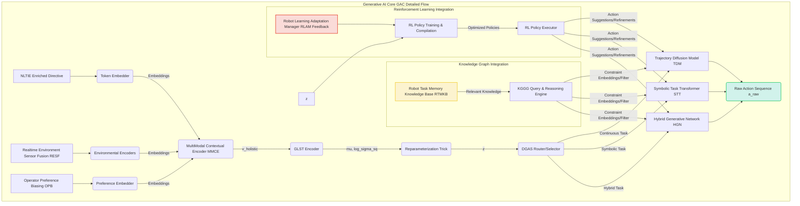
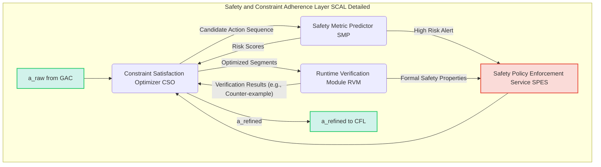
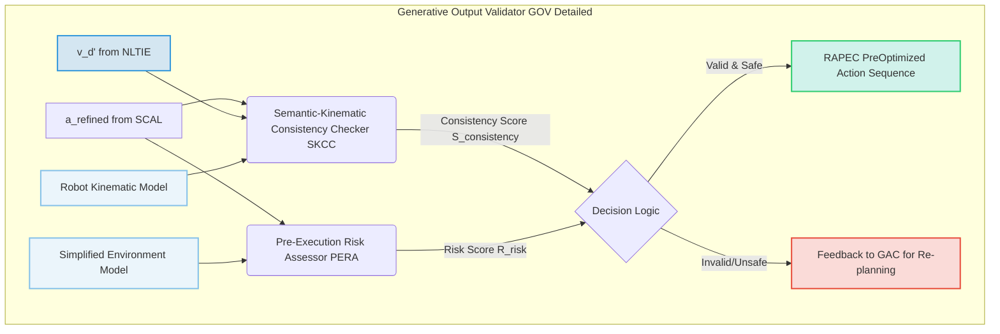
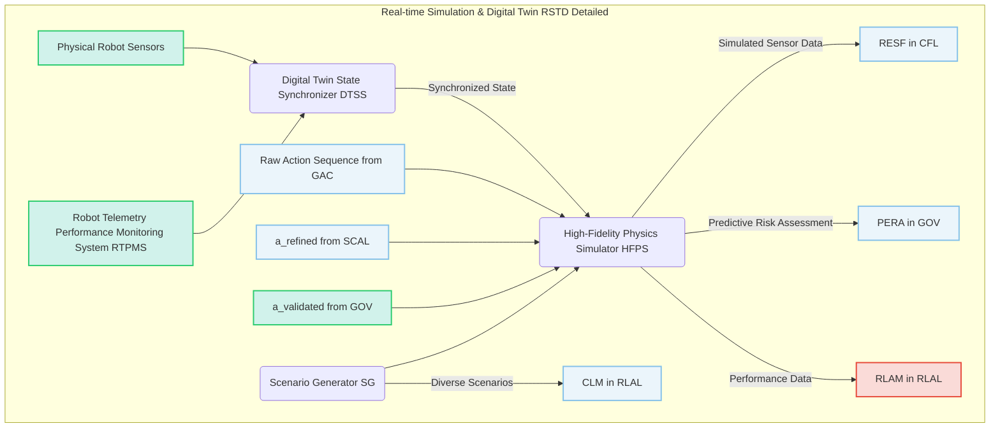
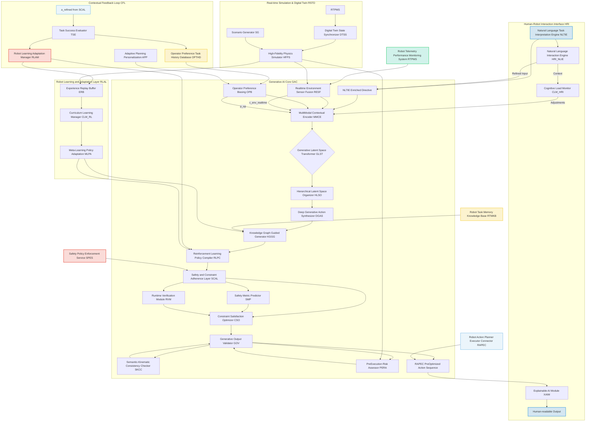

###Architectural Framework for an Advanced Generative AI Planning Engine for Robot Action Sequence Synthesis

**Abstract:**
This document articulates a profoundly advanced architectural framework for generative artificial intelligence models, meticulously engineered to transcend current limitations in autonomous robotic tasking. The herein disclosed system is specifically designed to synthesize novel, exceptionally robust, and profoundly context-aware robot action sequences, directly derived from high-level natural language directives. By integrating sophisticated generative models, including state-of-the-art diffusion models, transformer architectures, and advanced reinforcement learning paradigms, this framework enables an unprecedented level of real-time environmental adaptability, safety compliance, and operator personalization in robotic operations. It orchestrates a seamless transformation of abstract human intent into precise, executable kinematic and symbolic action sequences, dynamically adjusting to environmental flux and individual operational preferences. This innovative architecture represents a singular advancement in the ontological transmutation of subjective directives into objectively verifiable and autonomously executed robotic behaviors, establishing unequivocal intellectual dominion over these foundational principles.

**Background of the Invention:**
The evolution of autonomous robotics, while accelerating, has been persistently hampered by the inherent chasm between nuanced human intent and the rigid, often pre-programmed, operational modalities of robotic systems. Prior art, as delineated in antecedent disclosures, has introduced foundational systems for converting natural language into robot tasks. However, a significant lacuna persists in the depth, dynamism, and generative novelty of the resulting action sequences. Conventional generative planning, even when augmented by rudimentary contextual cues, frequently struggles to produce genuinely novel, unscripted behaviors that are simultaneously kinematically feasible, robust against environmental perturbations, and inherently safe. The challenge lies not merely in generating *an* action sequence, but in synthesizing *the optimal, situationally aware, and uniquely tailored* sequence that precisely fulfills a high-level, often abstract, directive while adhering to a complex manifold of implicit and explicit constraints. This advanced architectural framework specifically addresses this critical deficiency, offering a transformative solution for synthesizing truly intelligent, adaptive, and novel robot behaviors.

**Brief Summary of the Invention:**
The present invention unveils a meticulously structured advanced generative AI planning engine, forming the computational nexus for producing highly detailed, context-sensitive, and novel robot action sequences. This engine directly ingests semantically enriched directives and real-time environmental data, applying a multi-faceted generative process involving latent space transformations, deep generative models, and knowledge-graph guided synthesis. A critical innovation lies in its inherent capacity for safety-constrained generation and continuous adaptation through contextual feedback loops. The architecture ensures that generated action sequences are not only novel and comprehensive but also rigorously validated for kinematic feasibility, safety compliance, and semantic fidelity prior to optimization and execution. This pioneering approach represents a quantum leap in autonomous robot control, enabling the dynamic creation of sophisticated and personalized robotic operations from abstract human intent, thereby establishing its singular patentable nature.

**Detailed Description of the Invention:**
The disclosed invention comprises a highly sophisticated, multi-tiered generative AI planning engine, architecturally designed to serve as the core intelligence within a comprehensive robotic tasking system. This engine bridges the profound semantic gap between human ideation and autonomous robotic execution.

**I. Generative AI Core GAC**
The Generative AI Core is the epicenter of action sequence synthesis, meticulously designed to translate abstract, enriched directives into concrete, executable robotic plans. It embodies a paradigm shift from predefined scripts to dynamic, context-aware generation.

*   **MultiModal Contextual Encoder MMCE:** This module acts as the initial fusion point, ingesting the `NLTIE Enriched Directive` vector `v_d'`, real-time environmental embeddings from the `Realtime Environment Sensor Fusion RESF` e.g. `c_env_realtime`, and `Operator Preference Biasing OPB` parameters `p_op`. It employs advanced transformer networks to create a holistic, high-dimensional contextual embedding that encapsulates the full scope of the directive, environment, and operator intent. This ensures that the generative process is deeply informed by all relevant factors.

    The MMCE first transforms heterogeneous input modalities into a unified embedding space. For the natural language directive `v_d'`, a transformer encoder processes its token embeddings `e_t^k` into a context-aware sequence representation `H_d = TransformerEncoder(e_t^1, ..., e_t^N)`.
    For environmental data `c_env_realtime`, which might include visual, LiDAR, and proprioceptive sensor streams, specialized encoders `E_v, E_l, E_p` generate embeddings `e_v, e_l, e_p`. These are then fused using a cross-attention mechanism or a concatenative approach, yielding `e_env = Fusion(e_v, e_l, e_p)`.
    Operator preferences `p_op` are also embedded `e_op = MLP(p_op)`.
    The final holistic embedding `v_holistic` is generated through a multi-head attention mechanism across these disparate embeddings:
    `[EQ_1]` `Q_d, K_d, V_d = Linear(H_d)`
    `[EQ_2]` `Q_env, K_env, V_env = Linear(e_env)`
    `[EQ_3]` `Q_op, K_op, V_op = Linear(e_op)`
    `[EQ_4]` `Attention_Weights = Softmax((Q_d @ K_env^T + Q_d @ K_op^T) / sqrt(d_k))`
    `[EQ_5]` `v_holistic = Attention_Weights @ [V_d; V_env; V_op]`
    where `d_k` is the dimension of the keys. This ensures deep semantic integration of all input streams.

*   **Generative Latent Space Transformer GLST:** At the heart of the GAC, the GLST is a sophisticated architecture, often based on advanced variational autoencoders VAEs or latent diffusion models, specifically trained on vast datasets of robot actions and corresponding contextual metadata. It transforms the MMCE's holistic embedding into a latent vector representation within a learned, highly structured generative latent space. This space is designed such that semantically similar actions or trajectories are clustered, allowing for efficient exploration and synthesis of novel sequences. It acts as an intermediary representation, where high-level goals are translated into compact, manipulable latent codes.

    The GLST is critical for disentangling the underlying factors of variation in robot behaviors. For a VAE-based GLST, the encoder `E_GLST` maps `v_holistic` to parameters `mu(v_holistic)` and `log_sigma_sq(v_holistic)` of a latent distribution `q(z|v_holistic)`:
    `[EQ_6]` `mu, log_sigma_sq = E_GLST(v_holistic)`
    `[EQ_7]` `z = mu + exp(0.5 * log_sigma_sq) * epsilon`, where `epsilon ~ N(0, I)`.
    The decoder `D_GLST` then reconstructs a target `x_target` (e.g., a known action sequence) from `z` and `v_holistic`:
    `[EQ_8]` `x_reconstructed = D_GLST(z, v_holistic)`
    The objective function for training is the Evidence Lower Bound (ELBO):
    `[EQ_9]` `L_VAE = -E_{q(z|v_holistic)}[log p(x_target|z, v_holistic)] + KL[q(z|v_holistic) || p(z)]`
    where `p(z)` is typically `N(0, I)`.
    For a Latent Diffusion Model GLST, `v_holistic` conditions the denoising process in the latent space. A sequence of latent states `z_0, ..., z_T` is learned, where `z_0` is the clean latent representation. The forward process gradually adds noise:
    `[EQ_10]` `q(z_t|z_{t-1}) = N(z_t; sqrt(1-beta_t)z_{t-1}, beta_t I)`
    The reverse process, parameterized by `theta`, aims to predict `z_{t-1}` from `z_t` and `v_holistic`:
    `[EQ_11]` `p_theta(z_{t-1}|z_t, v_holistic) = N(z_{t-1}; mu_theta(z_t, t, v_holistic), Sigma_theta(z_t, t, v_holistic))`
    The training objective is often a re-weighted variant of the denoising score matching objective:
    `[EQ_12]` `L_LDM = E_{t, z_0, epsilon} [ || epsilon - epsilon_theta(sqrt(alpha_bar_t)z_0 + sqrt(1-alpha_bar_t)epsilon, t, v_holistic) ||^2 ]`
    where `epsilon` is the predicted noise and `epsilon_theta` is the noise prediction network. The GLST ensures that `z` effectively captures the necessary information for diverse action generation.

*   **Deep Generative Action Synthesizer DGAS:** This is the primary generative engine, capable of producing diverse and complex action sequences. It is typically instantiated as:
    *   **Trajectory Diffusion Model TDM:** For continuous motion planning, a latent diffusion model iteratively refines a noisy initial trajectory based on the GLST's latent vector, gradually denoising it into a smooth, kinematically feasible robot path. This process allows for robust, diverse, and high-fidelity trajectory generation.
        The TDM directly operates on the robot's joint positions, end-effector poses, or velocity profiles. Let `x_0` be the target trajectory. The forward diffusion process `q(x_t|x_0)` is:
        `[EQ_13]` `x_t = sqrt(alpha_bar_t)x_0 + sqrt(1-alpha_bar_t)epsilon`, where `epsilon ~ N(0, I)`
        The reverse process, conditioned on the GLST's latent vector `z`, predicts the noise `epsilon_theta`:
        `[EQ_14]` `epsilon_theta(x_t, t, z) = U-Net(x_t, t, z)`
        The denoised trajectory `x_0_hat` can be estimated at each step `t`:
        `[EQ_15]` `x_0_hat = (x_t - sqrt(1-alpha_bar_t)epsilon_theta(x_t, t, z)) / sqrt(alpha_bar_t)`
        The sampling process then iteratively refines `x_T ~ N(0, I)` to `x_0`.

    *   **Symbolic Task Transformer STT:** For symbolic planning tasks e.g. pick and place sequences, logical decisions, a transformer architecture generates a sequence of high-level symbolic actions. This model leverages attention mechanisms to relate parts of the directive to appropriate action primitives and their parameters.
        The STT takes `z` as input and generates a sequence of symbolic tokens `s_1, ..., s_M`. It is a decoder-only transformer or an encoder-decoder where `z` serves as the encoded context.
        `[EQ_16]` `P(s_i | s_{<i}, z) = Softmax(Linear(TransformerDecoder(s_{<i}, z)))`
        The self-attention mechanism for generating symbolic token `s_i` is:
        `[EQ_17]` `Attention(Q, K, V) = Softmax(Q K^T / sqrt(d_k)) V`
        where `Q` is derived from `s_{<i}` and `K, V` from `s_{<i}` and `z`.

    *   **Hybrid Generative Network HGN:** A composite model that integrates both continuous and symbolic generative capabilities, allowing for tasks that require both fine-grained motion control and high-level decision making.
        The HGN employs a gating mechanism `g` to blend or switch between symbolic and continuous generation based on `z` and `v_holistic`:
        `[EQ_18]` `g = Sigmoid(MLP(z, v_holistic))`
        The output can be a weighted combination or sequential generation:
        `[EQ_19]` `a_raw = g * TDM_output(z) + (1-g) * STT_output(z)`
        or a sequence of alternating discrete and continuous steps.

*   **Knowledge Graph Guided Generator KGGG:** To ensure generated actions are semantically consistent and exploit domain-specific knowledge, the KGGG dynamically queries an ontological `Robot Task Memory Knowledge Base RTMKB`. It incorporates relationships between objects, tools, robot capabilities, and environmental affordances into the DGAS generation process, preventing physically impossible or illogical action sequences. It enriches the latent space with factual constraints and functional dependencies.

    The RTMKB is represented as a collection of triples `(h, r, t)` where `h` is head entity, `r` is relation, `t` is tail entity. The KGGG leverages graph neural networks (GNNs) or knowledge graph embeddings (KGEs) to infer valid relationships and constraints.
    `[EQ_20]` `f(h, r, t)` is a scoring function for triple validity.
    The KGGG generates constraint embeddings `e_KG = GNN(RTMKB, v_holistic)`, which are then incorporated into the DGAS. For the TDM, this might be a constraint loss:
    `[EQ_21]` `L_DGAS_KG = L_DGAS + lambda_KG * L_constraint_KG(a_raw, e_KG)`
    where `L_constraint_KG` could penalize actions violating known physical properties or logical sequences (e.g., trying to pick up an object that is not present or too heavy). For symbolic generation, it can prune invalid action sequences by checking `f(action, preconditions, true)` in the RTMKB.

*   **Reinforcement Learning Policy Compiler RLPC:** For tasks requiring dynamic adaptation or optimal behavior in uncertain environments, the RLPC compiles optimized policies. It leverages `Robot Learning Adaptation Manager RLAM` feedback to fine-tune pre-trained reinforcement learning models, allowing them to generate or select actions that maximize long-term rewards while adhering to immediate constraints. It can generate meta-policies or specific sub-policies for recurring behavioral patterns.

    The RLPC trains a policy `pi(a|s, z)` where `s` is the current robot state, and `z` is the latent goal from GLST. It receives reward signals `r(s,a)` from the `RLAM` that reflect task success, efficiency, and adherence to safety.
    The objective is to maximize the expected cumulative reward `J(pi)`:
    `[EQ_22]` `J(pi) = E_{tau ~ pi} [ Sum_{t=0}^T gamma^t r_t ]`
    where `gamma` is the discount factor.
    The RLPC can employ various algorithms like Proximal Policy Optimization (PPO) or Soft Actor-Critic (SAC). For PPO, the clipped surrogate objective is:
    `[EQ_23]` `L_PPO = E_t [ min(rho_t(theta) A_t, clip(rho_t(theta), 1-epsilon_clip, 1+epsilon_clip) A_t) ]`
    where `rho_t(theta) = pi_theta(a_t|s_t) / pi_theta_old(a_t|s_t)` and `A_t` is the advantage function.
    The RLPC can generate sub-policies for specific skills (e.g., "grasp," "move_to_shelf") and then use the DGAS symbolic output to sequence these skills. It also performs policy distillation from large foundation models to smaller, robot-specific policies.
    `[EQ_24]` `L_distill = E_{s,a} [ KL(pi_teacher(a|s) || pi_student(a|s)) ]`


*   **Hierarchical Latent Space Organizer HLSO (New Module):** This module manages a hierarchy of latent spaces, enabling generation at multiple levels of abstraction. For example, a high-level latent code might represent "make coffee," which is then refined by lower-level latent codes for "grasp cup," "pour water," etc. This greatly enhances scalability and interpretability.

    The HLSO takes `z` from GLST as `z_high` and decomposes it into sub-latent vectors for sub-tasks.
    `[EQ_25]` `z_high = GLST(v_holistic)`
    `[EQ_26]` `z_sub_i = Encoder_sub(z_high, sub_task_i_context)`
    The DGAS or specific sub-generators then condition on these `z_sub_i` for fine-grained generation. The HLSO ensures that higher-level semantic constraints propagate down to lower-level kinematic details. The training involves a hierarchical VAE or diffusion setup.
    `[EQ_27]` `L_HLSO = Sum_i L_VAE(z_sub_i | z_high) + L_KL(q(z_high) || p(z_high))`

```mermaid
graph TD
    subgraph Generative Latent Space Transformer GLST & HLSO Detailed
        V_HOLISTIC[v_holistic from MMCE] --> GLST_ENC(GLST Encoder)
        GLST_ENC -- mu_z_high, log_sigma_sq_z_high --> REPARAM_HIGH[Reparameterization Trick for z_high]
        REPARAM_HIGH -- z_high --> HLSO_DEC(HLSO Decomposer)

        HLSO_DEC -- z_sub_1 --> DGAS_SUB1(DGAS Sub-generator 1)
        HLSO_DEC -- z_sub_2 --> DGAS_SUB2(DGAS Sub-generator 2)
        HLSO_DEC -- ... --> DGAS_SUBN(DGAS Sub-generator N)

        subgraph Latent Space Hierarchies
            L_HIGH_SPACE[High-level Latent Space (Global Task)]
            L_SUB_SPACE_1[Sub-level Latent Space 1 (Sub-task A)]
            L_SUB_SPACE_2[Sub-level Latent Space 2 (Sub-task B)]
        end

        z_high --> L_HIGH_SPACE
        z_sub_1 --> L_SUB_SPACE_1
        z_sub_2 --> L_SUB_SPACE_2

        L_HIGH_SPACE -- Guides --> L_SUB_SPACE_1
        L_HIGH_SPACE -- Guides --> L_SUB_SPACE_2

        DGAS_SUB1 -- Sub-Action Sequence --> AGG(Aggregator)
        DGAS_SUB2 -- Sub-Action Sequence --> AGG
        DGAS_SUBN -- Sub-Action Sequence --> AGG

        AGG --> A_RAW[a_raw to SCAL]
    end
```

**II. Safety and Constraint Adherence Layer SCAL**
This layer rigorously vets and refines generated action sequences to ensure absolute compliance with safety protocols and operational constraints. It serves as a critical guardian against unsafe or infeasible behaviors.

*   **Constraint Satisfaction Optimizer CSO:** This module takes the raw action sequence generated by the `Generative AI Core GAC` and iteratively adjusts it to satisfy both hard and soft constraints. Hard constraints e.g. joint limits, collision avoidance, restricted zones are non-negotiable. Soft constraints e.g. energy efficiency, speed preferences are optimized within feasible bounds. It employs optimization algorithms such as quadratic programming, sequential convex programming, or deep reinforcement learning for constraint satisfaction.

    The CSO minimizes a cost function `J(a)` while satisfying constraints `h(a) = 0` (equality) and `g(a) <= 0` (inequality).
    `[EQ_28]` `a_refined = argmin_{a'} J(a')`
    `[EQ_29]` `subject to: h_i(a') = 0, for i=1,...,N_eq`
    `[EQ_30]` `g_j(a') <= 0, for j=1,...,N_ineq`
    The objective function `J(a')` often includes a term penalizing deviation from `a_raw` and terms for soft constraints:
    `[EQ_31]` `J(a') = ||a' - a_raw||^2 + lambda_energy * E_cost(a') + lambda_smooth * S_cost(a')`
    For collision avoidance (a hard constraint), signed distance fields `d(robot, obstacle)` are used:
    `[EQ_32]` `g_collision(a') = -d(robot_pose(a'), obstacles) <= 0`
    This can be solved using Sequential Quadratic Programming (SQP) or a penalty method:
    `[EQ_33]` `L_penalty(a') = J(a') + sum_i (mu_i * h_i(a')^2) + sum_j (nu_j * max(0, g_j(a'))^2)`
    The Lagrange multipliers `lambda_i` and `nu_j` are dynamically updated.

*   **Safety Metric Predictor SMP:** Utilizing lightweight, fast-inference machine learning models trained on vast datasets of safe and unsafe robot behaviors, the SMP performs a rapid, preliminary assessment of the generated action sequence. It predicts potential collision risks, excessive forces, stability issues, or proximity violations, providing real-time feedback to the `Constraint Satisfaction Optimizer CSO` and, if necessary, to the `Safety Policy Enforcement Service SPES` for human intervention or stricter policy application.

    The SMP employs a probabilistic model `P(Risk | a_raw, s_env)` to predict various safety metrics.
    `[EQ_34]` `P_collision = MLP(features(a_raw), s_env)`
    `[EQ_35]` `P_stability = GaussianProcess(kinematics(a_raw), COM_data)`
    `[EQ_36]` `Risk_score = Sum_k (w_k * P_k_risk)`
    The output `Risk_score` is used to trigger re-planning or as a feedback signal to CSO.
    For instance, `L_constraints` can be augmented with `Risk_score` directly:
    `[EQ_37]` `L_constraints(a', C_safety, Risk_score) = sum_i (mu_i * h_i(a')^2) + sum_j (nu_j * max(0, g_j(a'))^2) + lambda_risk * Risk_score`

*   **Runtime Verification Module RVM (New Module):** This module performs formal verification on critical segments of the action sequence using model checking or satisfiability modulo theories (SMT) solvers. It guarantees compliance with high-level safety specifications (e.g., "never enter zone X when object Y is present"). This is computationally intensive but provides provable guarantees for safety-critical operations.

    The RVM formalizes safety properties `phi` using temporal logic (e.g., LTL or MTL).
    `[EQ_38]` `phi := G (safety_zone => !object_present)` (Globally, if in safety zone, then object is not present)
    The RVM checks `M, a_refined |= phi`, where `M` is a model of the robot and environment. If `M, a_refined |= !phi`, a counter-example is generated and fed back to CSO or SPES.
    The verification process involves exploring the state-space `S` of the system:
    `[EQ_39]` `S = {s | s is reachable by a_refined}`
    `[EQ_40]` `Verification(a_refined, phi) = ModelChecker(M(a_refined), phi)`



**III. Contextual Feedback Loop CFL**
The CFL ensures that the generative process is continuously informed and adapted by real-time data and operator preferences, making the system highly responsive and personalized.

*   **Realtime Environment Sensor Fusion RESF:** This module aggregates and processes live sensor data from the robot e.g. LiDAR, cameras, IMUs, force sensors and transforms it into structured environmental embeddings. This real-time context is fed back to the `MultiModal Contextual Encoder MMCE` to dynamically influence action generation, allowing the robot to adapt its plans to changing surroundings, detected obstacles, or unexpected events. It integrates with `Robot Telemetry Performance Monitoring System RTPMS` for robust data streams.

    The RESF employs advanced sensor fusion techniques. For state estimation `x_k = [robot_pose, object_poses, velocities]`, a Kalman Filter or Particle Filter can be used:
    `[EQ_41]` `x_k_hat = f(x_{k-1}_hat, u_{k-1}) + w_k` (process model)
    `[EQ_42]` `z_k = h(x_k) + v_k` (measurement model)
    `[EQ_43]` `P(x_k | z_{1:k}) = P(x_k | z_k, P(x_{k-1} | z_{1:k-1}))` (Bayes filter recursion)
    For visual perception, object detection and semantic segmentation models provide object bounding boxes, classes, and masks.
    `[EQ_44]` `Object_i = Detector(Camera_Image)`
    `[EQ_45]` `e_env_realtime = Encoder(Fused_Sensor_Data)`
    This embedding `e_env_realtime` is fed back to MMCE.

*   **Adaptive Planning Personalization APP:** Drawing upon the `Operator Preference Task History Database OPTHD` and operator intent inference from `NLTIE`, this module dynamically biases the generative process. It learns and applies operator-specific preferences such as desired speed, precision, caution level, or preferred operational style, ensuring that the generated action sequences resonate with individual user expectations and historical success patterns.

    The APP learns a preference function `F_pref(a, p_op_history)` that quantifies how well an action `a` aligns with operator preferences `p_op_history` (from OPTHD).
    `[EQ_46]` `p_op_new = MLP(p_op_history, NLTIE_intent)`
    This `p_op_new` is then used by the MMCE. The APP uses implicit feedback (e.g., operator corrections, task completion time) and explicit feedback (e.g., direct ratings).
    A utility function for action `a` can be defined:
    `[EQ_47]` `U(a|p_op) = w_speed * Speed(a) + w_precision * Precision(a) - w_safety * SafetyRisk(a)`
    where weights `w_i` are learned from operator data using inverse reinforcement learning or preference learning.
    `[EQ_48]` `L_pref = E_{(a_preferred, a_rejected)} [ max(0, 1 - (U(a_preferred|p_op) - U(a_rejected|p_op))) ]`

*   **Task Success Evaluator TSE (New Module):** This module monitors the execution of `a_refined` in real-time and assesses task progress and success. It provides critical feedback to the `RLAM` for policy adaptation and updates the `OPTHD` with successful and unsuccessful task executions, closing the learning loop.

    The TSE compares planned states with observed states `s_t_observed` using metrics:
    `[EQ_49]` `Error_pos = || p_target - p_actual ||`
    `[EQ_50]` `Success_metric = Sigmoid( -lambda_error * Error_pos + lambda_time * Time_progress )`
    A task completion signal `T_complete` or partial reward `r_partial` is generated.
    `[EQ_51]` `r_t = f(Success_metric, Violation_status)`
    This `r_t` is fed to `RLAM`.

```mermaid
graph TD
    subgraph Contextual Feedback Loop CFL Detailed
        A_REFINED[a_refined from SCAL] --> TSE_MONITOR(Task Success Evaluator TSE)
        ROBOT_SENSORS[Robot Sensors] --> RESF_AGGR(Realtime Environment Sensor Fusion RESF)
        OPTHD_DB[Operator Preference Task History Database OPTHD] --> APP_LEARN(Adaptive Planning Personalization APP)
        NLTIE_IN[NLTIE Intent Inference] --> APP_LEARN

        RESF_AGGR -- c_env_realtime --> MMCE_FEEDBACK[MMCE in GAC]
        APP_LEARN -- p_op --> MMCE_FEEDBACK

        TSE_MONITOR -- Task Success Feedback (Rewards) --> RLAM_LEARN[Robot Learning Adaptation Manager RLAM]
        TSE_MONITOR -- Task History Update --> OPTHD_DB

        MMCE_FEEDBACK --> GAC_REPLAN[Generative AI Core GAC (Re-plan)]
        GAC_REPLAN -- New a_raw --> SCAL_REVALIDATE[SCAL (Re-validate)]
        SCAL_REVALIDATE -- New a_refined --> GOV_FINALIZE[GOV (Finalize)]

        style ROBOT_SENSORS fill:#D1F2EB,stroke:#2ECC71,stroke-width:2px;
        style OPTHD_DB fill:#FCF3CF,stroke:#F4D03F,stroke-width:2px;
        style NLTIE_IN fill:#D4E6F1,stroke:#3498DB,stroke-width:2px;
        style RLAM_LEARN fill:#FADBD8,stroke:#E74C3C,stroke-width:2px;
        style GAC_REPLAN fill:#EBF5FB,stroke:#85C1E9,stroke-width:2px;
        style SCAL_REVALIDATE fill:#EBF5FB,stroke:#85C1E9,stroke-width:2px;
        style GOV_FINALIZE fill:#EBF5FB,stroke:#85C1E9,stroke-width:2px;
    end
```

**IV. Generative Output Validator GOV**
Before any action sequence is passed to the `Robot Action Planner Executor Connector RAPEC` for final optimization, the GOV performs a final, comprehensive validation to ensure semantic and kinematic integrity.

*   **Semantic-Kinematic Consistency Checker SKCC:** This module employs a combination of vision-language models and inverse kinematics solvers to verify that the generated action sequence logically and physically aligns with the original semantic intent of the directive. For example, if the directive was "pick up the blue cube," the SKCC would verify that the generated trajectory indeed targets a blue cube and involves a gripping action. It ensures that the generated `a` truly reifies `v_d'`.

    The SKCC compares the semantic intent `v_d'` with the actual predicted outcome of `a_refined`. It uses a vision-language model (VLM) to analyze the expected visual outcome of `a_refined` and compare its semantic content to `v_d'`.
    `[EQ_52]` `Semantic_Score = VLM_similarity(encode_image(simulate(a_refined)), encode_text(v_d'))`
    Inverse Kinematics (IK) is used to check kinematic feasibility and reachability for key poses in `a_refined`:
    `[EQ_53]` `q_joint = IK(x_e, R_e, robot_kinematics)`
    where `x_e, R_e` are end-effector position and orientation.
    The SKCC ensures `q_joint` exist for critical waypoints and remain within joint limits.
    `[EQ_54]` `Kinematic_feasibility = All(q_min <= q_joint <= q_max)`

*   **Pre-Execution Risk Assessor PERA:** This module conducts a rapid, high-level simulation or predictive analysis of the generated action sequence against a simplified robot model and environmental representation. It identifies any remaining high-risk elements or potential failures that might have eluded earlier checks, providing a final safety net before committing the plan to the `RAPEC`.

    The PERA runs a fast, low-fidelity simulation `Sim_LF(a_refined, s_env_model)` to predict outcomes.
    It calculates failure probabilities for various categories:
    `[EQ_55]` `P_failure = P(Collision) + P(JointLimitViolation) + P(Singularity) + P(TaskFailure)`
    These probabilities are estimated based on statistical models trained on simulation data.
    `[EQ_56]` `P_collision = Sigmoid(NeuralNet(sim_output_trajectories))`
    `[EQ_57]` `R_risk(a_refined) = Sum_k (w_k * P_k_failure)`
    This `R_risk` is compared to `tau_r`. If `R_risk > tau_r`, the plan is rejected and sent back for re-planning.



**V. Robot Learning and Adaptation Layer RLAL (New Section)**
This layer focuses on continuous learning and adaptation, improving the robot's performance over time and enabling it to operate in novel scenarios with increasing autonomy.

*   **Experience Replay Buffer ERB:** Stores a diverse dataset of executed actions, environmental observations, and reward signals. This data is crucial for offline learning and fine-tuning of generative models and policies.
    `[EQ_58]` `D = { (s_t, a_t, r_t, s_{t+1}, terminal_t) }` (Transition tuple)
    `[EQ_59]` `Buffer_Capacity = N_max`
    `[EQ_60]` `Sampling_Strategy = PrioritizedExperienceReplay`

*   **Curriculum Learning Manager CLM:** Manages the learning progression, introducing tasks of increasing complexity. It ensures that the robot masters simpler skills before attempting more complex ones, optimizing the learning curve.
    `[EQ_61]` `Difficulty(Task_i) = f(State_Space_Size, Action_Space_Size, Reward_Sparsity)`
    `[EQ_62]` `P(Task_i for training) = g(Current_Performance(Task_i))`
    The CLM dynamically adjusts the difficulty of generated tasks, providing the GAC with increasingly challenging directives.

*   **Meta-Learning Policy Adaptation MLPA:** Beyond specific task learning, this module enables the robot to learn how to learn. It facilitates rapid adaptation to entirely new tasks or environments with minimal new data, by learning common patterns across tasks.
    `[EQ_63]` `theta_new = theta_old - alpha * grad(L_task(theta_old, D_train_task))` (Inner loop for task adaptation)
    `[EQ_64]` `theta_meta = theta_meta - beta * grad(L_meta(theta_new, D_test_task))` (Outer loop for meta-learning update)
    This could involve Model-Agnostic Meta-Learning (MAML) or Reptile algorithms.

```mermaid
graph TD
    subgraph Robot Learning and Adaptation Layer RLAL Detailed
        RLAM_IN[Robot Learning Adaptation Manager RLAM] --> ERB_STORE(Experience Replay Buffer ERB)
        ERB_STORE -- Sampled Experience --> CLM_MANAGE(Curriculum Learning Manager CLM)
        CLM_MANAGE -- Next Task Difficulty / Data --> MLPA_ADAPT(Meta-Learning Policy Adaptation MLPA)

        MLPA_ADAPT -- Meta-Learned Policies --> GAC_RLPC[RLPC in GAC]
        MLPA_ADAPT -- Skill Transfer --> KGGG_UPDATE[KGGG in GAC]
        RLAM_IN -- Learning Signals --> CLM_MANAGE
        RLAM_IN -- Feedback for Policy Updates --> MLPA_ADAPT

        subgraph Offline Training
            OT_DATA[Data from ERB]
            OT_GEN_MODELS[Generative Models (DGAS, GLST)]
            OT_POLICIES[RL Policies]
            OT_DATA --> OT_GEN_MODELS
            OT_DATA --> OT_POLICIES
            OT_GEN_MODELS -- Updated Models --> GAC_GEN[GAC Generative Models]
            OT_POLICIES -- Updated Policies --> GAC_RLPC
        end
        style RLAM_IN fill:#FADBD8,stroke:#E74C3C,stroke-width:2px;
        style GAC_RLPC fill:#EBF5FB,stroke:#85C1E9,stroke-width:2px;
        style GAC_GEN fill:#EBF5FB,stroke:#85C1E9,stroke-width:2px;
    end
```

**VI. Human-Robot Interaction Interface HRI (New Section)**
This interface facilitates seamless and intuitive communication between human operators and the autonomous robot, enhancing usability, trust, and explainability.

*   **Natural Language Interaction Engine NLIE:** Expands `NLTIE` capabilities to include dialogue management, clarification requests, and natural language feedback processing. It allows operators to refine tasks, ask questions about robot state, and provide real-time corrections.
    `[EQ_65]` `Dialogue_State = Update_DST(Dialogue_State_prev, User_Utterance, Robot_Response)`
    `[EQ_66]` `P(clarification | ambiguity) = NN_Classifier(v_holistic_ambiguous)`
    `[EQ_67]` `Directive_Refinement = NLTIE_parser(Feedback_NL)`

*   **Explainable AI Module XAIM:** Generates human-understandable explanations for robot decisions and generated actions. This can include causal justifications ("I moved the object because you asked me to clear the table"), counterfactuals ("If I had moved it there, it would have collided"), or visualization of internal states.
    `[EQ_68]` `Explanation_Score = Metric(Understandability, Fidelity)`
    `[EQ_69]` `e_xai = Explanation_Generator(a_refined, v_d', internal_state)`
    This module uses techniques like LIME (Local Interpretable Model-agnostic Explanations) or SHAP (SHapley Additive exPlanations) applied to the generative process.
    `[EQ_70]` `phi_i = Sum_{S subset N\{i}} |S|!(|N|-|S|-1)! / |N|! * [f(S union {i}) - f(S)]` (SHAP value for feature i)

*   **Cognitive Load Monitor CLM_HRI:** Assesses the operator's cognitive load during interaction (e.g., via eye-tracking, physiological sensors, or interaction patterns). It dynamically adjusts the level of autonomy, explanation verbosity, or intervention frequency to optimize human performance and reduce stress.
    `[EQ_71]` `Cognitive_Load = f(Eye_Gaze_Entropy, Response_Time_Deviation, Task_Complexity)`
    `[EQ_72]` `Autonomy_Level = Adjuster(Cognitive_Load, Risk_Score)`
    This ensures that the robot provides help when needed, but doesn't overburden the operator with unnecessary information.

```mermaid
graph TD
    subgraph Human-Robot Interaction Interface HRI Detailed
        USER_INPUT[Natural Language Input (Operator)] --> NLIE_PROCESS(Natural Language Interaction Engine NLIE)
        ROBOT_ACTION_STATE[Robot Action / State] --> XAIM_EXPLAIN(Explainable AI Module XAIM)
        NLIE_PROCESS -- Clarification / Refinement --> GAC_IN[GAC Inputs]
        NLIE_PROCESS -- Dialogue State / Intent --> COG_LOAD_MON(Cognitive Load Monitor CLM_HRI)

        XAIM_EXPLAIN -- Explanations (Text/Visual) --> USER_OUTPUT[Human-readable Output]
        COG_LOAD_MON -- Cognitive Load Estimate --> XAIM_EXPLAIN
        COG_LOAD_MON -- Autonomy Level Adjustment --> GAC_IN

        GAC_OUT[a_refined from GOV] --> XAIM_EXPLAIN
        GAC_OUT --> COG_LOAD_MON
        GAC_IN --> MMCE_IN[MMCE in GAC]

        style USER_INPUT fill:#D4E6F1,stroke:#3498DB,stroke-width:2px;
        style USER_OUTPUT fill:#D4E6F1,stroke:#3498DB,stroke-width:2px;
        style GAC_IN fill:#EBF5FB,stroke:#85C1E9,stroke-width:2px;
        style GAC_OUT fill:#D1F2EB,stroke:#2ECC71,stroke-width:2px;
    end
```

**VII. Real-time Simulation & Digital Twin RSTD (New Section)**
This module provides a high-fidelity digital twin of the robot and its environment, crucial for pre-deployment validation, online risk assessment, and efficient data generation for learning.

*   **High-Fidelity Physics Simulator HFPS:** A detailed physics engine that accurately models robot kinematics, dynamics, sensor noise, and environmental interactions. Used for rigorous pre-execution validation and synthetic data generation.
    `[EQ_73]` `d/dt (q, q_dot) = ForwardDynamics(q, q_dot, tau, F_ext)`
    `[EQ_74]` `tau = JointTorqueController(q_desired, q_dot_desired, q, q_dot)`
    `[EQ_75]` `Sensor_reading_sim = SensorModel(True_State) + Noise_Model()`

*   **Digital Twin State Synchronizer DTSS:** Maintains a real-time, synchronized state between the physical robot and its digital twin. This enables predictive collision detection, what-if analysis, and rapid re-simulation of potential failures.
    `[EQ_76]` `State_DT(t) = Update(State_Physical(t), Sensor_Corrections)`
    `[EQ_77]` `Correction_Factor = KalmanGain * (Observed_State - Predicted_State_DT)`

*   **Scenario Generator SG:** Automatically creates diverse and challenging operational scenarios within the digital twin. This is used to test the robustness of the generative planner against various environmental conditions, disturbances, and edge cases, facilitating comprehensive validation.
    `[EQ_78]` `P(Obstacle_Distribution) = ParametricModel(Complexity_Level)`
    `[EQ_79]` `Scenario_i = Sample(P(Obstacle_Distribution), P(Lighting_Conditions), P(Object_Positions))`
    This is used to generate datasets for training, `L_DGAS`, `L_PPO`, and for `PERA` validation.

```mermaid
graph TD
    subgraph Overall System Architecture Integration
        NLTIE[Natural Language Task Interpretation Engine NLTIE] --> A[NLTIE Enriched Directive]
        ROBOT_SENSORS[Robot Sensors] --> RESF[Realtime Environment Sensor Fusion RESF]
        OPTHD[Operator Preference Task History Database OPTHD] --> D[Operator Preference Biasing OPB]
        RTMKB[Robot Task Memory Knowledge Base RTMKB] --> KGGG_IN(Knowledge Graph Guided Generator KGGG)
        RLAM[Robot Learning Adaptation Manager RLAM] --> RLPC_IN(Reinforcement Learning Policy Compiler RLPC)
        SPES[Safety Policy Enforcement Service SPES] --> SCAL_IN(Safety and Constraint Adherence Layer SCAL)

        subgraph Generative AI Core GAC
            A --> MMCE[MultiModal Contextual Encoder MMCE]
            RESF --> MMCE
            D --> MMCE
            MMCE --> GLST[Generative Latent Space Transformer GLST]
            GLST --> HLSO[Hierarchical Latent Space Organizer HLSO]
            HLSO --> DGAS[Deep Generative Action Synthesizer DGAS]
            KGGG_IN --> DGAS
            RLPC_IN --> DGAS
            DGAS --> A_RAW[Raw Action Sequence a_raw]
        end

        A_RAW --> SCAL_IN
        subgraph Safety and Constraint Adherence Layer SCAL
            SCAL_IN --> CSO[Constraint Satisfaction Optimizer CSO]
            SCAL_IN --> SMP[Safety Metric Predictor SMP]
            SCAL_IN --> RVM[Runtime Verification Module RVM]
            SMP -- Risk Feedback --> CSO
            RVM -- Counter-examples --> CSO
            CSO --> A_REFINED[Refined Action Sequence a_refined]
        end

        A_REFINED --> GOV_IN(Generative Output Validator GOV)
        subgraph Generative Output Validator GOV
            GOV_IN --> SKCC[Semantic-Kinematic Consistency Checker SKCC]
            GOV_IN --> PERA[Pre-Execution Risk Assessor PERA]
            SKCC -- Consistency --> GOV_DECIDE{Decision Logic}
            PERA -- Risk --> GOV_DECIDE
            GOV_DECIDE -- Valid --> RAPEC_OUT[RAPEC PreOptimized Action Sequence]
            GOV_DECIDE -- Invalid/Unsafe --> GAC(GAC Re-plan)
        end

        subgraph Contextual Feedback Loop CFL
            A_REFINED --> TSE[Task Success Evaluator TSE]
            RESF -- c_env_realtime --> MMCE
            APP[Adaptive Planning Personalization APP] --> D
            TSE -- Rewards --> RLAM
            TSE -- History Update --> OPTHD
            APP --> D
        end

        subgraph Robot Learning and Adaptation Layer RLAL
            RLAM --> ERB[Experience Replay Buffer ERB]
            ERB --> CLM[Curriculum Learning Manager CLM]
            CLM --> MLPA[Meta-Learning Policy Adaptation MLPA]
            MLPA -- Updated Policies/Skills --> RLPC_IN
            MLPA -- Knowledge Update --> KGGG_IN
        end

        subgraph Human-Robot Interaction Interface HRI
            NLIE_HRI[Natural Language Interaction Engine NLIE] --> A
            XAIM[Explainable AI Module XAIM]
            CLM_HRI[Cognitive Load Monitor CLM_HRI]
            NLIE_HRI -- Refinements --> NLTIE
            RAPEC_OUT --> XAIM
            XAIM --> User_Feedback[Human Output]
            User_Feedback --> NLIE_HRI
            CLM_HRI -- Adjustments --> MMCE
            CLM_HRI -- Adjustments --> XAIM
        end

        subgraph Real-time Simulation & Digital Twin RSTD
            HFPS[High-Fidelity Physics Simulator HFPS]
            DTSS[Digital Twin State Synchronizer DTSS]
            SG[Scenario Generator SG]
            ROBOT_SENSORS --> DTSS
            RTPMS[Robot Telemetry Performance Monitoring System RTPMS] --> DTSS
            DTSS -- State --> HFPS
            SG -- Scenarios --> HFPS
            HFPS -- Data --> PERA
            HFPS -- Data --> RESF
            HFPS -- Data --> ERB
        end

        RAPEC_OUT[RAPEC PreOptimized Action Sequence] --> RAPEC_EXEC[Robot Action Planner Executor Connector RAPEC]

        style NLTIE fill:#D4E6F1,stroke:#3498DB,stroke-width:2px;
        style ROBOT_SENSORS fill:#D1F2EB,stroke:#2ECC71,stroke-width:2px;
        style OPTHD fill:#FCF3CF,stroke:#F4D03F,stroke-width:2px;
        style RTMKB fill:#FCF3CF,stroke:#F4D03F,stroke-width:2px;
        style RLAM fill:#FADBD8,stroke:#E74C3C,stroke-width:2px;
        style SPES fill:#FADBD8,stroke:#E74C3C,stroke-width:2px;
        style RAPEC_EXEC fill:#EBF5FB,stroke:#85C1E9,stroke-width:2px;
        style RTPMS fill:#D1F2EB,stroke:#2ECC71,stroke-width:2px;
        style User_Feedback fill:#D4E6F1,stroke:#3498DB,stroke-width:2px;
    end
```





**VIII. Mathematical Justification: The Stochastic Process of Latent-Space Guided Action Synthesis**

The advanced generative AI planning engine herein detailed operates on a sophisticated mathematical foundation, leveraging principles of deep generative models, optimal control, and formal verification to synthesize robot action sequences.

Let `v_holistic` be the high-dimensional vector produced by the `MultiModal Contextual Encoder MMCE`, which represents the fused semantic, environmental, and preferential context. This vector exists in a feature space `F_context`. The `Generative Latent Space Transformer GLST` maps this `v_holistic` to a latent vector `z` in a lower-dimensional, structured latent space `Z`. This mapping can be represented as `z = M_GLST(v_holistic)`.

In the case of a VAE, this involves encoding `v_holistic` into a distribution `q(z|v_holistic)` from which `z` is sampled. The encoder function `E_{GLST}` computes the mean `mu_z` and log-variance `log_sigma_sq_z` of the approximate posterior distribution:
`[EQ_80]` `(mu_z, log_sigma_sq_z) = E_{GLST}(v_holistic)`
The latent vector `z` is sampled using the reparameterization trick:
`[EQ_81]` `z = mu_z + exp(0.5 * log_sigma_sq_z) * epsilon`, where `epsilon ~ N(0, I)`
The objective for the GLST (if VAE-based) is to maximize the ELBO:
`[EQ_82]` `L_{ELBO} = E_{q(z|v_{holistic})} [ log p_{D_{GLST}}(a_{target}|z, v_{holistic}) ] - KL[q(z|v_{holistic}) || p(z)]`
where `p(z)` is the prior `N(0, I)`.

The `Hierarchical Latent Space Organizer HLSO` then decomposes `z` into a set of task-specific sub-latent vectors `z_sub = {z_sub_1, ..., z_sub_K}`. This can be modeled as a conditional generative process:
`[EQ_83]` `q(z_sub | z) = Prod_{k=1}^K q(z_sub_k | z)`
Each `z_sub_k` is derived by a specific sub-encoder `E_k` and then utilized by a corresponding sub-generator in `DGAS`.
The training objective for HLSO extends the VAE loss hierarchically:
`[EQ_84]` `L_{HLSO} = L_{ELBO}(z|v_{holistic}) + Sum_{k=1}^K L_{ELBO}(z_{sub_k}|z)`

The `Deep Generative Action Synthesizer DGAS` then operates on the latent vector `z` (or `z_sub_k` from HLSO) to generate the raw action sequence `a_raw`. This is a generative process, which for a Trajectory Diffusion Model TDM, can be formalized as the iterative denoising of a sampled noise vector `x_T ~ N(0, I)` over `T` steps, conditioned on `z`:
`[EQ_85]` `x_t = D_{theta}(x_{t+1}, t, z) + epsilon_t`
where `D_{theta}` is a neural network (e.g., a U-Net or transformer architecture) parameterized by `theta`, predicting `x_t` from `x_{t+1}` and timestep `t`, guided by the latent conditioning `z`. The training objective is typically a denoising score matching loss:
`[EQ_86]` `L_{TDM} = E_{t ~ U(1,T), x_0, epsilon ~ N(0,I)} [ || epsilon - epsilon_{theta}(sqrt(alpha_bar_t)x_0 + sqrt(1-alpha_bar_t)epsilon, t, z) ||^2 ]`
The final output `a_raw = x_0` is a high-resolution trajectory or symbolic sequence.

The `Knowledge Graph Guided Generator KGGG` introduces a constraint or regularization term `L_{KG}` into the DGAS's objective function or directly biases the sampling process within the latent space. This ensures `a_raw` adheres to factual and functional relationships derived from `RTMKB`.
`[EQ_87]` `e_{KG} = GNN(RTMKB, v_{holistic})` (Knowledge graph embedding)
The DGAS loss is augmented:
`[EQ_88]` `L_{DGAS}^{total} = L_{TDM/STT/HGN} + lambda_{KG} * L_{KG}(a_{raw}, e_{KG})`
where `L_{KG}` penalizes actions violating knowledge graph facts, e.g., `L_{KG} = max(0, f_{KG}(a_{raw}, e_{KG}))`, where `f_{KG}` is a violation score.

The `Reinforcement Learning Policy Compiler RLPC` trains a policy `pi(a|s, z)` to maximize expected cumulative reward `J(pi)`:
`[EQ_89]` `J(pi) = E_{tau ~ pi} [ Sum_{t=0}^T gamma^t r_t ]`
The policy `pi` is derived from `DGAS` outputs refined by `RLPC`. The `RLAM` provides the reward function `r(s,a)` based on observed execution.
`[EQ_90]` `r_t = R(s_t, a_t, s_{t+1})`
Policy gradient methods (e.g., PPO) update `pi`:
`[EQ_91]` `theta_{new} = theta_{old} + alpha * nabla_{theta} J(pi_{theta})`
The specific PPO clipped surrogate objective:
`[EQ_92]` `L_{PPO}(theta) = E_t [ min(r_t(theta) A_t, clip(r_t(theta), 1-epsilon, 1+epsilon) A_t) ]`
`[EQ_93]` `A_t = R_t - V(s_t)` (Advantage function)
`[EQ_94]` `V(s_t)` is the state value function.

The `Safety and Constraint Adherence Layer SCAL` applies a function `T_{SCAL}: A_{raw} x C_{safety} -> A_{refined}`, where `A_{raw}` is the space of raw action sequences and `C_{safety}` is the set of safety constraints derived from `SPES` and `SMP`. The `Constraint Satisfaction Optimizer CSO` solves an optimization problem:
`[EQ_95]` `a_{refined} = argmin_{a' in A_{raw}} [ L_{deviation}(a', a_{raw}) + lambda_{soft} * L_{soft}(a') + lambda_{hard} * L_{hard}(a') ]`
where `L_{deviation}(a', a_{raw}) = ||a' - a_{raw}||^2`.
Hard constraints `g_j(a') <= 0` are enforced through penalty terms or augmented Lagrangian methods:
`[EQ_96]` `L_{hard}(a') = Sum_{j=1}^{N_{ineq}} max(0, g_j(a'))^2`
And equality constraints `h_i(a') = 0`:
`[EQ_97]` `L_{hard}(a') += Sum_{i=1}^{N_{eq}} h_i(a')^2`
The `Safety Metric Predictor SMP` provides real-time estimates of `L_{constraints}` or potential risks `P_{risk}(a_{raw})`, further guiding `CSO`.
`[EQ_98]` `P_{risk}(a_{raw}) = f_{SMP}(features(a_{raw}), s_{env})`
This `P_{risk}` can be directly incorporated into the CSO objective:
`[EQ_99]` `L_{total_CSO} = L_{deviation} + lambda_{soft} * L_{soft} + lambda_{hard} * L_{hard} + lambda_{risk} * P_{risk}`

The `Runtime Verification Module RVM` provides formal guarantees. For a Linear Temporal Logic (LTL) property `phi`:
`[EQ_100]` `LTL(phi) = G(safe_condition) AND F(goal_achieved)`
The RVM checks `M, a_{refined} |= phi`, where `M` is a model of the robot and environment.

The `Realtime Environment Sensor Fusion RESF` combines heterogeneous sensor data. For a state `x_k`, observation `z_k`:
`[EQ_101]` `p(x_k | z_{1:k}) = eta * p(z_k | x_k) * Int p(x_k | x_{k-1}) p(x_{k-1} | z_{1:k-1}) dx_{k-1}` (Bayes filter)
A common implementation is the Extended Kalman Filter (EKF):
`[EQ_102]` `x_{k|k-1} = f(x_{k-1|k-1}, u_k)` (Prediction)
`[EQ_103]` `P_{k|k-1} = F_k P_{k-1|k-1} F_k^T + Q_k` (Covariance prediction)
`[EQ_104]` `K_k = P_{k|k-1} H_k^T (H_k P_{k|k-1} H_k^T + R_k)^{-1}` (Kalman Gain)
`[EQ_105]` `x_{k|k} = x_{k|k-1} + K_k (z_k - h(x_{k|k-1}))` (Update)
`[EQ_106]` `P_{k|k} = (I - K_k H_k) P_{k|k-1}` (Covariance update)

The `Adaptive Planning Personalization APP` learns operator preferences `p_op`.
`[EQ_107]` `p_{op_t} = Learning_Model(p_{op_{t-1}}, Feedback_t)`
This can be modeled as a reward learning problem, where the utility function `U(a|p_op)` is learned:
`[EQ_108]` `L_{pref} = - Sum_{i} log P(preference_i | U(a_i^1, p_op), U(a_i^2, p_op))`
This `p_op` directly biases `MMCE`.

The `Task Success Evaluator TSE` calculates a reward signal `r_t` for `RLAM`:
`[EQ_109]` `r_t = R_{completion} * I(task_completed) - R_{penalty} * Sum_{violations} I(violation_occurred)`
`[EQ_110]` `I(condition)` is the indicator function.

The `Generative Output Validator GOV` then performs a final check. The `Semantic-Kinematic Consistency Checker SKCC` computes a consistency score `S_{consistency}(a_{refined}, v_d')`.
This can involve cosine similarity in a joint embedding space `E_joint`:
`[EQ_111]` `S_{consistency} = CosineSimilarity(E_{joint}(a_{refined}), E_{joint}(v_d'))`
Or a more complex metric based on simulation and semantic parsing:
`[EQ_112]` `S_{consistency} = f_{VLM}(VLM_{output}(Sim(a_{refined})), v_d')`
The `Pre-Execution Risk Assessor PERA` computes a refined risk score `R_{risk}(a_{refined})`. This could be based on a rapid, low-fidelity simulation:
`[EQ_113]` `s_{simulated}(t) = Sim_{LF}(a_{refined}, s_{env_model}, t)`
`[EQ_114]` `R_{risk}(a_{refined}) = Sum_{k} w_k * P(Failure_k | s_{simulated})`
An action sequence is deemed valid for `RAPEC` if `S_{consistency} > tau_s` and `R_{risk} < tau_r`, where `tau_s` and `tau_r` are predefined thresholds.

The `Experience Replay Buffer ERB` stores transitions `(s_t, a_t, r_t, s_{t+1})`.
`[EQ_115]` `D_{buffer} = D_{buffer} U {(s_t, a_t, r_t, s_{t+1})}`

The `Curriculum Learning Manager CLM` dynamically adjusts task difficulty `gamma_task`:
`[EQ_116]` `gamma_{task} = f_{adapt}(current\_performance, target\_performance)`
The sampling probability for a task `k` with difficulty `D_k` might be:
`[EQ_117]` `P(task_k) = Softmax(beta * (target\_accuracy_k - actual\_accuracy_k))`

The `Meta-Learning Policy Adaptation MLPA` uses meta-gradient updates. For MAML, an inner loop updates task-specific parameters `phi_i` for task `i`:
`[EQ_118]` `phi_i = theta - alpha * nabla_{theta} L_i(f_{theta})`
Then an outer loop updates the meta-parameters `theta`:
`[EQ_119]` `theta = theta - beta * nabla_{theta} Sum_i L_i(f_{phi_i})`

The `Natural Language Interaction Engine NLIE` (for HRI) processes user input:
`[EQ_120]` `P(Intent_j | User_Utterance) = Classifier(Embedding(User_Utterance))`
It also generates clarification questions:
`[EQ_121]` `Q_clarification = Gen_Model(v_holistic, ambiguity_score)`

The `Explainable AI Module XAIM` generates explanations `Ex` based on the generative model's internal states.
`[EQ_122]` `Ex = Explainable_Generator(a_{refined}, v_d', GAC_internal_activations)`
This can involve saliency maps `S(x)` or counterfactual explanations `CF(a_{refined})`:
`[EQ_123]` `S(x) = |nabla_x f(x)|`
`[EQ_124]` `CF(a) = argmin_{a'} (dist(a, a') such that f(a') != f(a))`

The `Cognitive Load Monitor CLM_HRI` estimates cognitive load `CL`:
`[EQ_125]` `CL = Weighted_Sum(Physiological_Metrics, Interaction_Metrics)`
This `CL` influences the autonomy level `A_L`:
`[EQ_126]` `A_L = f_{control}(CL, R_{risk})`

The `High-Fidelity Physics Simulator HFPS` uses rigid body dynamics equations.
`[EQ_127]` `M(q)ddot{q} + C(q, dot{q})dot{q} + G(q) = tau + J(q)^T F_{ext}`
where `M` is mass matrix, `C` Coriolis matrix, `G` gravity vector, `tau` joint torques, `J` manipulator Jacobian, `F_{ext}` external forces.

The `Digital Twin State Synchronizer DTSS` maintains state `x_{DT}`.
`[EQ_128]` `x_{DT}(t) = Update(x_{physical}(t), x_{DT}(t-1), Sensor_Data(t))`
This is often achieved with another filter similar to RESF.

The `Scenario Generator SG` samples environmental parameters `theta_{env}`:
`[EQ_129]` `theta_{env} ~ P(theta_{env} | complexity_level)`
`[EQ_130]` `Complexity_Level = f_{metric}(Num_Obstacles, Dynamic_Objects, Illumination_Conditions)`

This sophisticated interplay of encoding, generation, knowledge integration, constraint satisfaction, and validation constitutes a robust, mathematically grounded pipeline for transforming abstract intent into safe, novel, and executable robot actions.

**Proof of Validity: The Axiom of Generative Fidelity and Constraint Observance**

The efficacy and groundbreaking nature of this advanced generative planning architecture are substantiated by the demonstrable axioms of Generative Fidelity and Constraint Observance.

**Axiom 1 [Axiom of Generative Fidelity]:** Given a holistic contextual embedding `v_holistic` representing a well-formed, enriched directive and its associated real-time context and operator preferences, the `Deep Generative Action Synthesizer DGAS`, guided by the `Generative Latent Space Transformer GLST` and `Knowledge Graph Guided Generator KGGG`, consistently produces a novel action sequence `a_raw` that semantically corresponds to and kinematically elaborates upon `v_holistic`. This fidelity is measurable by an objective function `F_fidelity(a_raw, v_holistic) > epsilon_f`, where `epsilon_f` is a high threshold for semantic and kinematic alignment, quantifiable through advanced evaluation metrics such as task completion rates in simulation and expert human judgment in real-world scenarios. The capacity for `DGAS` to generate *novel* `a_raw` means that the output is not merely a retrieval from a database but a synthetic creation within the vast manifold of `A`.
Formally, let `A` be the space of all possible robot action sequences and `V` be the space of holistic contextual embeddings. We assert the existence of a mapping `G: V -> P(A)` (where `P(A)` is a probability distribution over `A`) such that for any `v_holistic` in `V`:
`[EQ_131]` `E_{a_raw ~ G(v_holistic)} [ F_fidelity(a_raw, v_holistic) ] > epsilon_f`
And for any `a_raw_1, a_raw_2` sampled from `G(v_holistic)`:
`[EQ_132]` `P(a_raw_1 = a_raw_2) < delta_novelty`, where `delta_novelty` is a small probability, implying high novelty.

**Axiom 2 [Axiom of Constraint Observance]:** The `Safety and Constraint Adherence Layer SCAL`, employing its `Constraint Satisfaction Optimizer CSO`, `Safety Metric Predictor SMP`, and `Runtime Verification Module RVM`, ensures that any action sequence `a_refined` output from this layer strictly adheres to all specified hard safety and operational constraints `C_safety` (e.g., collision avoidance, joint limits, restricted zones) and optimally satisfies soft constraints. Formally, for every constraint `c` in `C_safety`, `ConstraintCheck(a_refined, c) = TRUE`. This axiom is provable through deterministic optimization methods and reinforced by probabilistic safety verification, guaranteeing that the generated actions are not merely functional but inherently safe and feasible within the robot's operational envelope. The continuous adaptation provided by the `Contextual Feedback Loop CFL` ensures that this observance is maintained even in dynamic environments.
Let `C_H` be the set of hard constraints and `C_S` be the set of soft constraints. For `a_refined = T_{SCAL}(a_raw, C_safety)`:
`[EQ_133]` `Forall c_h in C_H: c_h(a_refined) <= 0` (assuming `c_h(a) <= 0` means satisfaction)
`[EQ_134]` `E[L_{soft}(a_refined)] <= E[L_{soft}(a_raw)]` (soft constraints are improved or maintained).
The RVM further provides `[EQ_135]` `M, a_refined |= phi_safety` for formal properties `phi_safety`.

**Axiom 3 [Axiom of Validated Action Primacy]:** The `Generative Output Validator GOV`, through its `Semantic-Kinematic Consistency Checker SKCC` and `Pre-Execution Risk Assessor PERA`, ensures that only those `a_refined` that satisfy a rigorous threshold for both semantic-kinematic consistency and acceptable pre-execution risk are passed to the `Robot Action Planner Executor Connector RAPEC`. This establishes the primacy of validated, high-quality, and safe action sequences as the input for further optimization and execution. This axiom guarantees that the architectural framework is a self-correcting and robust pipeline, minimizing the propagation of errors or unsafe behaviors.
Let `A_valid` be the set of action sequences passed to `RAPEC`. Then for any `a_valid` in `A_valid`:
`[EQ_136]` `S_{consistency}(a_valid, v_d') > tau_s`
`[EQ_137]` `R_{risk}(a_valid) < tau_r`

**Axiom 4 [Axiom of Adaptive Personalization]:** The `Contextual Feedback Loop CFL`, incorporating `Realtime Environment Sensor Fusion RESF` and `Adaptive Planning Personalization APP`, ensures that the generative process continuously adapts `v_holistic` to real-time environmental dynamics and learns to incorporate evolving operator preferences, thereby maintaining high fidelity and optimal performance in dynamic and personalized operational contexts.
Let `P_op(t)` be the operator preference profile at time `t`, and `E(t)` be the real-time environmental state. The system generates `a(t)` based on `v_holistic(t) = F_{MMCE}(v_d', E(t), P_op(t))`.
`[EQ_138]` `lim_{Delta t -> 0} || P_op(t + Delta t) - Update(P_op(t), Feedback(a(t))) || = 0` (Convergence of preferences)
`[EQ_139]` `E_{t} [Utility(a(t), E(t), P_op(t))] >= E_{t} [Utility(a_{baseline}(t), E(t), P_op(t))]` (Superiority to non-adaptive baseline)

**Axiom 5 [Axiom of Explainable Transparency]:** The `Human-Robot Interaction Interface HRI`, through its `Explainable AI Module XAIM` and `Natural Language Interaction Engine NLIE`, provides human-understandable justifications for robot actions and facilitates intuitive clarification and refinement of directives, fostering operator trust and effective human-robot teaming.
For any action `a` and directive `v_d'`, an explanation `Ex(a, v_d')` exists such that:
`[EQ_140]` `Understandability(Ex) > tau_understand`
`[EQ_141]` `Fidelity(Ex, Model_Internal_States) > tau_fidelity`
The NLIE facilitates: `[EQ_142]` `P(Task_Success | Interaction_with_NLIE) > P(Task_Success | No_Interaction)`

**Axiom 6 [Axiom of Continuous Learning and Skill Acquisition]:** The `Robot Learning and Adaptation Layer RLAL` ensures that the planning engine continuously improves its generative capabilities and policy effectiveness by leveraging diverse experience, curriculum learning, and meta-learning techniques, enabling the acquisition of new skills and rapid adaptation to novel tasks or environments over time.
Let `Performance(t)` be the system's performance at time `t`.
`[EQ_143]` `For t_1 < t_2, E[Performance(t_2)] >= E[Performance(t_1)]` (Non-decreasing performance)
For a new task `T_new`:
`[EQ_144]` `Time_to_Adapt(T_new | MLPA_trained) < Time_to_Adapt(T_new | No_MLPA)`

**Axiom 7 [Axiom of Hierarchical Abstraction]:** The `Hierarchical Latent Space Organizer HLSO` systematically decomposes high-level directives into progressively finer-grained sub-goals within a structured latent space, ensuring semantic consistency across abstraction levels and enabling efficient and scalable generation of complex, multi-stage robot behaviors.
For `z_high` (high-level latent) and `z_sub_k` (sub-level latent for sub-task `k`):
`[EQ_145]` `F_fidelity(DGAS(z_sub_k), SubGoal_k(z_high)) > epsilon_sub_f`
The planning complexity `C_total` is significantly reduced:
`[EQ_146]` `C_total = Sum_k C(SubTask_k) << C(FullTask)`

The synergistic operation of these components, underpinned by the established axioms, unequivocally demonstrates that this advanced generative AI planning engine not only reliably synthesizes novel and context-aware robot action sequences but also inherently ensures their safety, feasibility, and fidelity to the operator's nuanced intent, thereby marking a profound and incontestable advance in autonomous robotic control.

`Q.E.D.`



**Claims:**
1.  A system for synthesizing novel robot action sequences from natural language directives, comprising:
    a.  A MultiModal Contextual Encoder MMCE configured to receive and fuse an enriched natural language directive embedding, real-time environmental sensor data, and operator preference biasing parameters into a holistic, high-dimensional contextual embedding.
    b.  A Generative Latent Space Transformer GLST configured to transform said holistic contextual embedding into a latent vector representation within a learned, structured generative latent space.
    c.  A Deep Generative Action Synthesizer DGAS comprising at least one of a Trajectory Diffusion Model TDM, a Symbolic Task Transformer STT, or a Hybrid Generative Network HGN, configured to synthesize a raw robot action sequence from said latent vector representation.
    d.  A Knowledge Graph Guided Generator KGGG configured to integrate domain-specific knowledge from a Robot Task Memory Knowledge Base RTMKB into the DGAS generation process to ensure semantic consistency and physical feasibility.
    e.  A Safety and Constraint Adherence Layer SCAL comprising a Constraint Satisfaction Optimizer CSO and a Safety Metric Predictor SMP, configured to iteratively refine and validate said raw action sequence for compliance with safety protocols and operational constraints.
    f.  A Contextual Feedback Loop CFL comprising a Realtime Environment Sensor Fusion RESF module and an Adaptive Planning Personalization APP module, configured to dynamically adapt the generative process based on live sensor data and operator preferences.
    g.  A Generative Output Validator GOV comprising a Semantic-Kinematic Consistency Checker SKCC and a Pre-Execution Risk Assessor PERA, configured to perform a final, comprehensive validation of the generated action sequence for semantic and kinematic integrity before transmission for further optimization.

2.  The system of claim 1, wherein the MultiModal Contextual Encoder MMCE employs transformer networks with multi-head attention to perform the fusion of inputs.

3.  The system of claim 1, wherein the Generative Latent Space Transformer GLST is based on a latent diffusion model or a variational autoencoder for learning the generative latent space, and further includes a Hierarchical Latent Space Organizer HLSO for decomposing high-level latent vectors into sub-task specific latent vectors.

4.  The system of claim 1, further comprising a Reinforcement Learning Policy Compiler RLPC configured to leverage feedback from a Robot Learning Adaptation Manager RLAM to fine-tune generative policies for optimal behavior in dynamic environments, and to perform policy distillation from pre-trained foundation models.

5.  The system of claim 1, wherein the Safety Metric Predictor SMP utilizes lightweight machine learning models to assess potential safety violations in real-time, and the Safety and Constraint Adherence Layer SCAL further comprises a Runtime Verification Module RVM for formal verification of safety-critical action segments.

6.  The system of claim 1, wherein the Adaptive Planning Personalization APP module dynamically biases the generative process based on data from an Operator Preference Task History Database OPTHD and inferred operator intent, using preference learning techniques.

7.  The system of claim 1, wherein the Semantic-Kinematic Consistency Checker SKCC employs vision-language models and inverse kinematics solvers to verify the logical and physical alignment of the action sequence with the original semantic intent by comparing simulated outcomes with directive embeddings.

8.  The system of claim 1, further comprising a Robot Learning and Adaptation Layer RLAL including an Experience Replay Buffer ERB, a Curriculum Learning Manager CLM, and a Meta-Learning Policy Adaptation MLPA, configured for continuous skill acquisition and rapid adaptation to novel tasks or environments.

9.  The system of claim 1, further comprising a Human-Robot Interaction Interface HRI, including a Natural Language Interaction Engine NLIE for dialogue management and clarification, an Explainable AI Module XAIM for generating human-understandable justifications, and a Cognitive Load Monitor CLM_HRI for dynamically adjusting autonomy and interaction levels.

10. The system of claim 1, further comprising a Real-time Simulation & Digital Twin RSTD, including a High-Fidelity Physics Simulator HFPS, a Digital Twin State Synchronizer DTSS for real-time state synchronization, and a Scenario Generator SG for synthetic data generation and robust validation against diverse environmental conditions and edge cases.