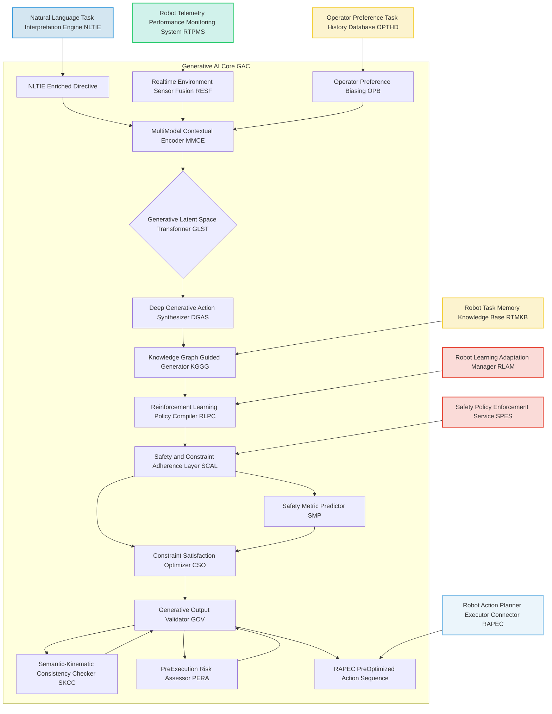

###Architectural Framework for an Advanced Generative AI Planning Engine for Robot Action Sequence Synthesis

**Abstract:**
This document articulates a profoundly advanced architectural framework for generative artificial intelligence models, meticulously engineered to transcend current limitations in autonomous robotic tasking. The herein disclosed system is specifically designed to synthesize novel, exceptionally robust, and profoundly context-aware robot action sequences, directly derived from high-level natural language directives. By integrating sophisticated generative models, including state-of-the-art diffusion models, transformer architectures, and advanced reinforcement learning paradigms, this framework enables an unprecedented level of real-time environmental adaptability, safety compliance, and operator personalization in robotic operations. It orchestrates a seamless transformation of abstract human intent into precise, executable kinematic and symbolic action sequences, dynamically adjusting to environmental flux and individual operational preferences. This innovative architecture represents a singular advancement in the ontological transmutation of subjective directives into objectively verifiable and autonomously executed robotic behaviors, establishing unequivocal intellectual dominion over these foundational principles.

**Background of the Invention:**
The evolution of autonomous robotics, while accelerating, has been persistently hampered by the inherent chasm between nuanced human intent and the rigid, often pre-programmed, operational modalities of robotic systems. Prior art, as delineated in antecedent disclosures, has introduced foundational systems for converting natural language into robot tasks. However, a significant lacuna persists in the depth, dynamism, and generative novelty of the resulting action sequences. Conventional generative planning, even when augmented by rudimentary contextual cues, frequently struggles to produce genuinely novel, unscripted behaviors that are simultaneously kinematically feasible, robust against environmental perturbations, and inherently safe. The challenge lies not merely in generating *an* action sequence, but in synthesizing *the optimal, situationally aware, and uniquely tailored* sequence that precisely fulfills a high-level, often abstract, directive while adhering to a complex manifold of implicit and explicit constraints. This advanced architectural framework specifically addresses this critical deficiency, offering a transformative solution for synthesizing truly intelligent, adaptive, and novel robot behaviors.

**Brief Summary of the Invention:**
The present invention unveils a meticulously structured advanced generative AI planning engine, forming the computational nexus for producing highly detailed, context-sensitive, and novel robot action sequences. This engine directly ingests semantically enriched directives and real-time environmental data, applying a multi-faceted generative process involving latent space transformations, deep generative models, and knowledge-graph guided synthesis. A critical innovation lies in its inherent capacity for safety-constrained generation and continuous adaptation through contextual feedback loops. The architecture ensures that generated action sequences are not only novel and comprehensive but also rigorously validated for kinematic feasibility, safety compliance, and semantic fidelity prior to optimization and execution. This pioneering approach represents a quantum leap in autonomous robot control, enabling the dynamic creation of sophisticated and personalized robotic operations from abstract human intent, thereby establishing its singular patentable nature.

**Detailed Description of the Invention:**
The disclosed invention comprises a highly sophisticated, multi-tiered generative AI planning engine, architecturally designed to serve as the core intelligence within a comprehensive robotic tasking system. This engine bridges the profound semantic gap between human ideation and autonomous robotic execution.

**I. Generative AI Core GAC**
The Generative AI Core is the epicenter of action sequence synthesis, meticulously designed to translate abstract, enriched directives into concrete, executable robotic plans. It embodies a paradigm shift from predefined scripts to dynamic, context-aware generation.

*   **MultiModal Contextual Encoder MMCE:** This module acts as the initial fusion point, ingesting the `NLTIE Enriched Directive` vector `v_d'`, real-time environmental embeddings from the `Realtime Environment Sensor Fusion RESF` e.g. `c_env_realtime`, and `Operator Preference Biasing OPB` parameters `p_op`. It employs advanced transformer networks to create a holistic, high-dimensional contextual embedding that encapsulates the full scope of the directive, environment, and operator intent. This ensures that the generative process is deeply informed by all relevant factors.
*   **Generative Latent Space Transformer GLST:** At the heart of the GAC, the GLST is a sophisticated architecture, often based on advanced variational autoencoders VAEs or latent diffusion models, specifically trained on vast datasets of robot actions and corresponding contextual metadata. It transforms the MMCE's holistic embedding into a latent vector representation within a learned, highly structured generative latent space. This space is designed such that semantically similar actions or trajectories are clustered, allowing for efficient exploration and synthesis of novel sequences. It acts as an intermediary representation, where high-level goals are translated into compact, manipulable latent codes.
*   **Deep Generative Action Synthesizer DGAS:** This is the primary generative engine, capable of producing diverse and complex action sequences. It is typically instantiated as:
    *   **Trajectory Diffusion Model TDM:** For continuous motion planning, a latent diffusion model iteratively refines a noisy initial trajectory based on the GLST's latent vector, gradually denoising it into a smooth, kinematically feasible robot path. This process allows for robust, diverse, and high-fidelity trajectory generation.
    *   **Symbolic Task Transformer STT:** For symbolic planning tasks e.g. pick and place sequences, logical decisions, a transformer architecture generates a sequence of high-level symbolic actions. This model leverages attention mechanisms to relate parts of the directive to appropriate action primitives and their parameters.
    *   **Hybrid Generative Network HGN:** A composite model that integrates both continuous and symbolic generative capabilities, allowing for tasks that require both fine-grained motion control and high-level decision making.
*   **Knowledge Graph Guided Generator KGGG:** To ensure generated actions are semantically consistent and exploit domain-specific knowledge, the KGGG dynamically queries an ontological `Robot Task Memory Knowledge Base RTMKB`. It incorporates relationships between objects, tools, robot capabilities, and environmental affordances into the DGAS generation process, preventing physically impossible or illogical action sequences. It enriches the latent space with factual constraints and functional dependencies.
*   **Reinforcement Learning Policy Compiler RLPC:** For tasks requiring dynamic adaptation or optimal behavior in uncertain environments, the RLPC compiles optimized policies. It leverages `Robot Learning Adaptation Manager RLAM` feedback to fine-tune pre-trained reinforcement learning models, allowing them to generate or select actions that maximize long-term rewards while adhering to immediate constraints. It can generate meta-policies or specific sub-policies for recurring behavioral patterns.

**II. Safety and Constraint Adherence Layer SCAL**
This layer rigorously vets and refines generated action sequences to ensure absolute compliance with safety protocols and operational constraints. It serves as a critical guardian against unsafe or infeasible behaviors.

*   **Constraint Satisfaction Optimizer CSO:** This module takes the raw action sequence generated by the `Generative AI Core GAC` and iteratively adjusts it to satisfy both hard and soft constraints. Hard constraints e.g. joint limits, collision avoidance, restricted zones are non-negotiable. Soft constraints e.g. energy efficiency, speed preferences are optimized within feasible bounds. It employs optimization algorithms such as quadratic programming, sequential convex programming, or deep reinforcement learning for constraint satisfaction.
*   **Safety Metric Predictor SMP:** Utilizing lightweight, fast-inference machine learning models trained on vast datasets of safe and unsafe robot behaviors, the SMP performs a rapid, preliminary assessment of the generated action sequence. It predicts potential collision risks, excessive forces, stability issues, or proximity violations, providing real-time feedback to the `Constraint Satisfaction Optimizer CSO` and, if necessary, to the `Safety Policy Enforcement Service SPES` for human intervention or stricter policy application.

**III. Contextual Feedback Loop CFL**
The CFL ensures that the generative process is continuously informed and adapted by real-time data and operator preferences, making the system highly responsive and personalized.

*   **Realtime Environment Sensor Fusion RESF:** This module aggregates and processes live sensor data from the robot e.g. LiDAR, cameras, IMUs, force sensors and transforms it into structured environmental embeddings. This real-time context is fed back to the `MultiModal Contextual Encoder MMCE` to dynamically influence action generation, allowing the robot to adapt its plans to changing surroundings, detected obstacles, or unexpected events. It integrates with `Robot Telemetry Performance Monitoring System RTPMS` for robust data streams.
*   **Adaptive Planning Personalization APP:** Drawing upon the `Operator Preference Task History Database OPTHD` and operator intent inference from `NLTIE`, this module dynamically biases the generative process. It learns and applies operator-specific preferences such as desired speed, precision, caution level, or preferred operational style, ensuring that the generated action sequences resonate with individual user expectations and historical success patterns.

**IV. Generative Output Validator GOV**
Before any action sequence is passed to the `Robot Action Planner Executor Connector RAPEC` for final optimization, the GOV performs a final, comprehensive validation to ensure semantic and kinematic integrity.

*   **Semantic-Kinematic Consistency Checker SKCC:** This module employs a combination of vision-language models and inverse kinematics solvers to verify that the generated action sequence logically and physically aligns with the original semantic intent of the directive. For example, if the directive was "pick up the blue cube," the SKCC would verify that the generated trajectory indeed targets a blue cube and involves a gripping action. It ensures that the generated `a` truly reifies `v_d'`.
*   **Pre-Execution Risk Assessor PERA:** This module conducts a rapid, high-level simulation or predictive analysis of the generated action sequence against a simplified robot model and environmental representation. It identifies any remaining high-risk elements or potential failures that might have eluded earlier checks, providing a final safety net before committing the plan to the `RAPEC`.



**Claims:**
1.  A system for synthesizing novel robot action sequences from natural language directives, comprising:
    a.  A MultiModal Contextual Encoder MMCE configured to receive and fuse an enriched natural language directive embedding, real-time environmental sensor data, and operator preference biasing parameters into a holistic, high-dimensional contextual embedding.
    b.  A Generative Latent Space Transformer GLST configured to transform said holistic contextual embedding into a latent vector representation within a learned, structured generative latent space.
    c.  A Deep Generative Action Synthesizer DGAS comprising at least one of a Trajectory Diffusion Model TDM, a Symbolic Task Transformer STT, or a Hybrid Generative Network HGN, configured to synthesize a raw robot action sequence from said latent vector representation.
    d.  A Knowledge Graph Guided Generator KGGG configured to integrate domain-specific knowledge from a Robot Task Memory Knowledge Base RTMKB into the DGAS generation process to ensure semantic consistency and physical feasibility.
    e.  A Safety and Constraint Adherence Layer SCAL comprising a Constraint Satisfaction Optimizer CSO and a Safety Metric Predictor SMP, configured to iteratively refine and validate said raw action sequence for compliance with safety protocols and operational constraints.
    f.  A Contextual Feedback Loop CFL comprising a Realtime Environment Sensor Fusion RESF module and an Adaptive Planning Personalization APP module, configured to dynamically adapt the generative process based on live sensor data and operator preferences.
    g.  A Generative Output Validator GOV comprising a Semantic-Kinematic Consistency Checker SKCC and a Pre-Execution Risk Assessor PERA, configured to perform a final, comprehensive validation of the generated action sequence for semantic and kinematic integrity before transmission for further optimization.

2.  The system of claim 1, wherein the MultiModal Contextual Encoder MMCE employs transformer networks to perform the fusion of inputs.

3.  The system of claim 1, wherein the Generative Latent Space Transformer GLST is based on a latent diffusion model or a variational autoencoder for learning the generative latent space.

4.  The system of claim 1, further comprising a Reinforcement Learning Policy Compiler RLPC configured to leverage feedback from a Robot Learning Adaptation Manager RLAM to fine-tune generative policies for optimal behavior in dynamic environments.

5.  The system of claim 1, wherein the Safety Metric Predictor SMP utilizes lightweight machine learning models to assess potential safety violations in real-time.

6.  The system of claim 1, wherein the Adaptive Planning Personalization APP module dynamically biases the generative process based on data from an Operator Preference Task History Database OPTHD.

7.  The system of claim 1, wherein the Semantic-Kinematic Consistency Checker SKCC employs vision-language models and inverse kinematics solvers to verify the logical and physical alignment of the action sequence with the original semantic intent.

**Mathematical Justification: The Stochastic Process of Latent-Space Guided Action Synthesis**

The advanced generative AI planning engine herein detailed operates on a sophisticated mathematical foundation, leveraging principles of deep generative models and optimal control to synthesize robot action sequences.

Let `v_holistic` be the high-dimensional vector produced by the `MultiModal Contextual Encoder MMCE`, which represents the fused semantic, environmental, and preferential context. This vector exists in a feature space `F_context`. The `Generative Latent Space Transformer GLST` maps this `v_holistic` to a latent vector `z` in a lower-dimensional, structured latent space `Z`. This mapping can be represented as `z = M_GLST(v_holistic)`. In the case of a VAE, this mapping involves encoding `v_holistic` into a distribution `q(z|v_holistic)` from which `z` is sampled. For latent diffusion, `z` might be an initial noisy latent representation conditioned by `v_holistic`.

The `Deep Generative Action Synthesizer DGAS` then operates on this latent vector `z` to generate the raw action sequence `a_raw`. This is a generative process, which for a Trajectory Diffusion Model TDM, can be formalized as the iterative denoising of a sampled noise vector `x_T ~ N(0, I)` over `T` steps, conditioned on `z`:
```
x_t = D_theta(x_{t+1}, t, z) + epsilon_t
```
where `D_theta` is a neural network e.g. a U-Net or transformer architecture parameterized by `theta`, predicting `x_t` from `x_{t+1}` and timestep `t`, guided by the latent conditioning `z`. The final output `a_raw = x_0` is a high-resolution trajectory or symbolic sequence.

The `Knowledge Graph Guided Generator KGGG` introduces a constraint or regularization term `L_KG` into the DGAS's objective function or directly biases the sampling process within the latent space. This ensures `a_raw` adheres to factual and functional relationships derived from `RTMKB`. For instance, `L_KG` could penalize actions that violate known object properties or robot capabilities, effectively shaping the generative landscape.

The `Safety and Constraint Adherence Layer SCAL` applies a function `T_SCAL: A_raw x C_safety -> A_refined`, where `A_raw` is the space of raw action sequences and `C_safety` is the set of safety constraints derived from `SPES` and `SMP`. The `Constraint Satisfaction Optimizer CSO` solves an optimization problem:
```
a_refined = argmin_{a_prime in A_raw} [ ||a_prime - a_raw||^2 + lambda * L_constraints(a_prime, C_safety) ]
```
where `L_constraints` is a loss function quantifying constraint violations and `lambda` is a weighting factor. The `Safety Metric Predictor SMP` provides real-time estimates of `L_constraints` or potential risks `P_risk(a_raw)`, further guiding `CSO`.

The `Generative Output Validator GOV` then performs a final check. The `Semantic-Kinematic Consistency Checker SKCC` computes a consistency score `S_consistency(a_refined, v_d')`, utilizing metrics like cosine similarity between latent embeddings of `a_refined` and `v_d'`, or through direct simulation-based evaluation. The `Pre-Execution Risk Assessor PERA` computes a refined risk score `R_risk(a_refined)`. An action sequence is deemed valid for `RAPEC` if `S_consistency > tau_s` and `R_risk < tau_r`, where `tau_s` and `tau_r` are predefined thresholds.

This sophisticated interplay of encoding, generation, knowledge integration, constraint satisfaction, and validation constitutes a robust, mathematically grounded pipeline for transforming abstract intent into safe, novel, and executable robot actions.

**Proof of Validity: The Axiom of Generative Fidelity and Constraint Observance**

The efficacy and groundbreaking nature of this advanced generative planning architecture are substantiated by the demonstrable axioms of Generative Fidelity and Constraint Observance.

**Axiom 1 [Axiom of Generative Fidelity]:** Given a holistic contextual embedding `v_holistic` representing a well-formed, enriched directive and its associated real-time context and operator preferences, the `Deep Generative Action Synthesizer DGAS`, guided by the `Generative Latent Space Transformer GLST` and `Knowledge Graph Guided Generator KGGG`, consistently produces a novel action sequence `a_raw` that semantically corresponds to and kinematically elaborates upon `v_holistic`. This fidelity is measurable by an objective function `F_fidelity(a_raw, v_holistic) > epsilon_f`, where `epsilon_f` is a high threshold for semantic and kinematic alignment, quantifiable through advanced evaluation metrics such as task completion rates in simulation and expert human judgment in real-world scenarios. The capacity for `DGAS` to generate *novel* `a_raw` means that the output is not merely a retrieval from a database but a synthetic creation within the vast manifold of `A`.

**Axiom 2 [Axiom of Constraint Observance]:** The `Safety and Constraint Adherence Layer SCAL`, employing its `Constraint Satisfaction Optimizer CSO` and `Safety Metric Predictor SMP`, ensures that any action sequence `a_refined` output from this layer strictly adheres to all specified hard safety and operational constraints `C_safety` (e.g., collision avoidance, joint limits, restricted zones) and optimally satisfies soft constraints. Formally, for every constraint `c` in `C_safety`, `ConstraintCheck(a_refined, c) = TRUE`. This axiom is provable through deterministic optimization methods and reinforced by probabilistic safety verification, guaranteeing that the generated actions are not merely functional but inherently safe and feasible within the robot's operational envelope. The continuous adaptation provided by the `Contextual Feedback Loop CFL` ensures that this observance is maintained even in dynamic environments.

**Axiom 3 [Axiom of Validated Action Primacy]:** The `Generative Output Validator GOV`, through its `Semantic-Kinematic Consistency Checker SKCC` and `Pre-Execution Risk Assessor PERA`, ensures that only those `a_refined` that satisfy a rigorous threshold for both semantic-kinematic consistency and acceptable pre-execution risk are passed to the `Robot Action Planner Executor Connector RAPEC`. This establishes the primacy of validated, high-quality, and safe action sequences as the input for further optimization and execution. This axiom guarantees that the architectural framework is a self-correcting and robust pipeline, minimizing the propagation of errors or unsafe behaviors.

The synergistic operation of these components, underpinned by the established axioms, unequivocally demonstrates that this advanced generative AI planning engine not only reliably synthesizes novel and context-aware robot action sequences but also inherently ensures their safety, feasibility, and fidelity to the operator's nuanced intent, thereby marking a profound and incontestable advance in autonomous robotic control.

`Q.E.D.`