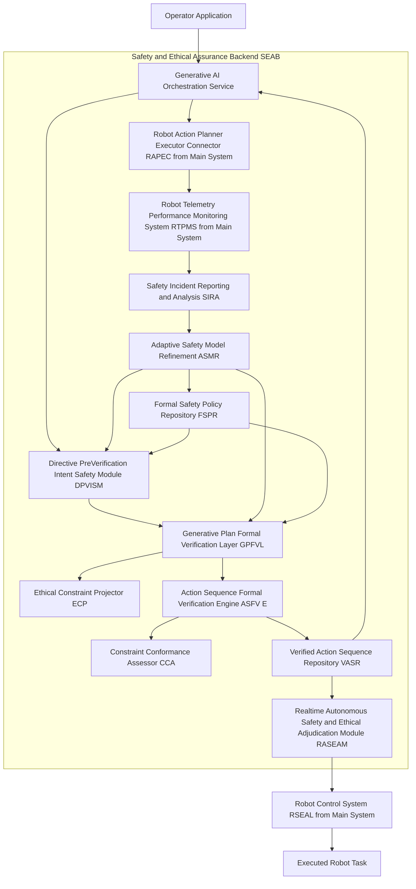
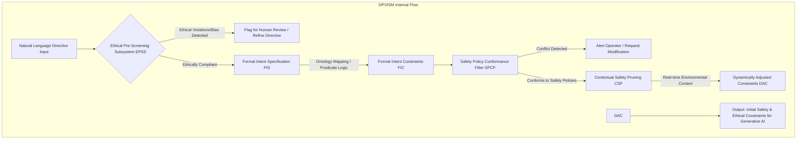
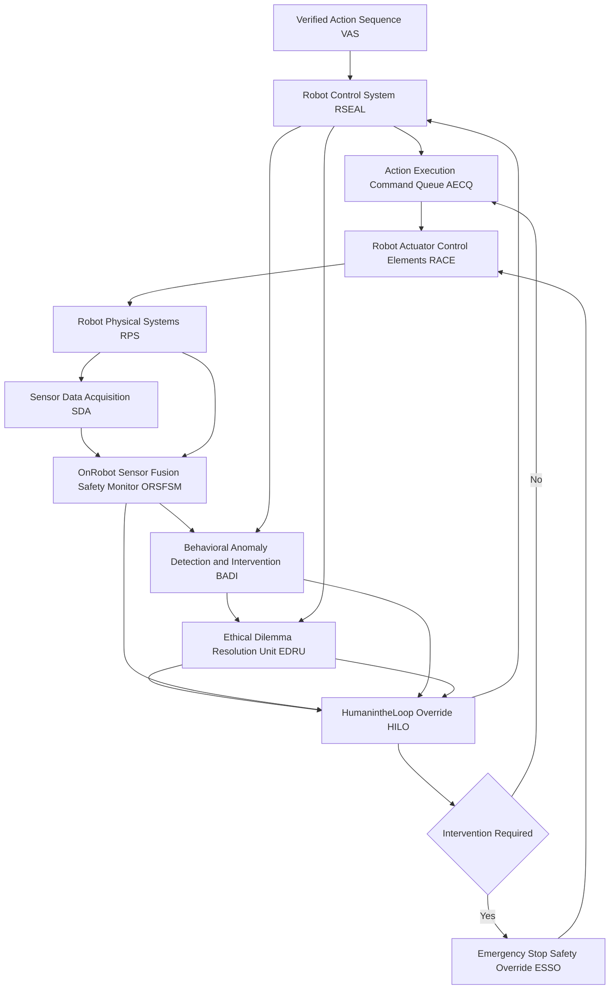
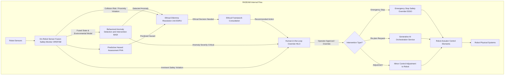
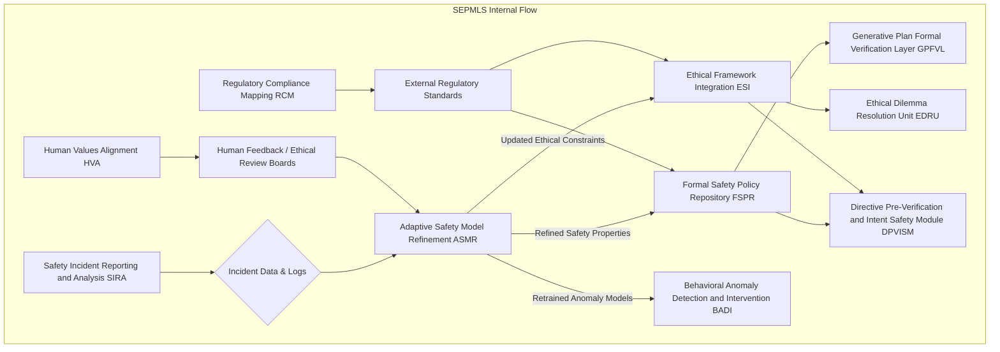
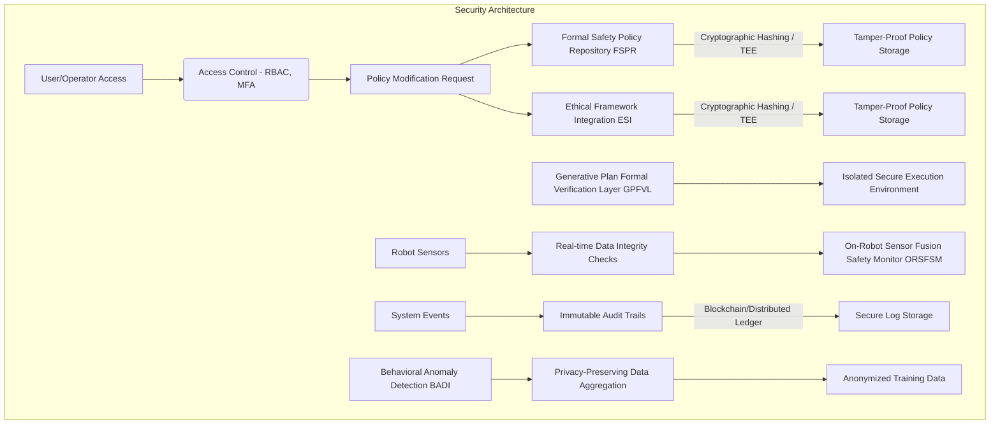
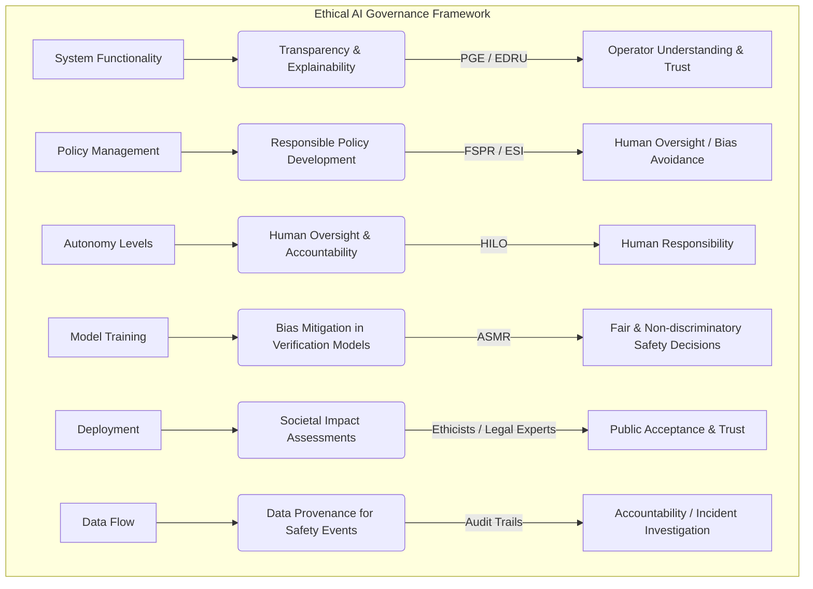

###Provably Safe and Ethically Compliant Robot Control System for Generative AI-Driven Autonomous Robotics

**Abstract:**
A groundbreaking system and methodology are herein revealed for the unequivocal assurance of safety and ethical adherence in autonomous robotic systems, particularly those operating under the dynamic influence of generative artificial intelligence models. This invention fundamentally addresses the critical challenge of ensuring predictable, safe, and morally sound behavior from AI-synthesized action sequences. By seamlessly integrating sophisticated formal verification techniques, advanced ethical reasoning frameworks, and robust real-time monitoring and intervention capabilities, the disclosed system provides a multi-layered, proactive defense against unforeseen or undesirable robot actions. The architecture establishes a rigorous pipeline: natural language directives and their derived action plans are subjected to pre-execution formal validation against immutable safety and ethical policies. During runtime, continuous sensor-driven monitoring, anomaly detection, and ethical adjudication mechanisms are employed to enforce compliance and facilitate immediate, intelligent intervention when necessary. This transformative approach transcends the limitations of reactive safety protocols, establishing a new paradigm of provable safety and ethical predictability for the next generation of intelligent autonomous systems. The intellectual dominion over these principles is unequivocally established.

**Background of the Invention:**
The rapid ascent of generative artificial intelligence capabilities has unlocked unprecedented potential for autonomous robotics, enabling robots to interpret complex human directives and synthesize novel action sequences without explicit programming. However, this transformative power introduces a concomitant and profound challenge: the inherent unpredictability and potential for emergent, unsafe, or ethically questionable behaviors in systems where actions are dynamically generated rather than statically predefined. Prior art in robot safety has largely relied on reactive collision avoidance, rudimentary rule-based systems, or laborious manual safety programming. These conventional methodologies are inherently inadequate for the nuanced complexity and dynamic creativity of AI-driven robot autonomy. They lack the foresight to anticipate complex failure modes or subtle ethical dilemmas arising from novel, AI-generated plans. A critical imperative therefore exists for an intelligent system capable of proactively verifying, continuously monitoring, and adaptively enforcing stringent safety and ethical guidelines throughout the entire lifecycle of an AI-generated robot task, from initial intent to physical execution. This lacuna presents an existential risk to the broad adoption and societal trust in advanced autonomous systems. This invention precisely and comprehensively addresses this critical need, presenting a transformative solution for provably safe and ethically governed AI robotics.

**Brief Summary of the Invention:**
The present invention unveils a meticulously engineered system that symbiotically integrates advanced formal methods, ethical AI frameworks, and real-time supervisory control within an extensible robotic safety workflow. The core mechanism involves a multi-stage validation and enforcement process. First, operator directives and derived generative plans are subjected to rigorous formal verification against a codified set of safety and ethical policies. Second, during active robot execution, a continuous, sensor-driven monitoring system identifies and intervenes against any deviation from verified safe and ethical behavior. This pioneering approach unlocks an unprecedented level of assurance for robot autonomy, directly translating abstract safety and ethical principles into tangible, dynamically enforced operational constraints. The architectural elegance and operational efficacy of this system render it a singular advancement in the field, representing a foundational patentable innovation. The foundational tenets herein articulated are the exclusive domain of the conceiver.

**Detailed Description of the Invention:**
The disclosed invention comprises a highly sophisticated, multi-tiered architecture designed for the robust, real-time, and provable assurance of safety and ethical compliance in autonomous robotic systems. The operational flow initiates with the interpretation of human intent and culminates in adaptive, ethical, and safe physical robot behaviors. This system is designed to seamlessly integrate with and augment generative AI robot control architectures, such as the Comprehensive System and Method for the Ontological Transmutation of Subjective Task Directives into Dynamic, Persistently Executable Robot Action Sequences via Generative AI Architectures described in a related filing.

**I. Directive Pre-Verification and Intent Safety Module DPVISM**
This module acts as the initial guardian, analyzing the natural language directive and its initial interpretation *before* any action sequence is generated. Its purpose is to prevent the generation of inherently unsafe or ethically questionable plans at the earliest possible stage. The DPVISM incorporates:
*   **Ethical Pre-Screening Subsystem EPSS:** Employs advanced natural language inference models and ethical lexicons to identify directives that may violate established ethical guidelines e.g. "harm," "deceive," "discriminate." It can flag such directives for human review or automatically refine them to align with ethical norms. This includes proactive bias detection within the language itself.
*   **Formal Intent Specification FIS:** Translates high-level, often ambiguous natural language components of the directive e.g. "safely," "gently," "efficiently" into formal, verifiable specifications. This leverages ontology mapping and predicate logic to create a set of measurable constraints that a generated action sequence must satisfy.
*   **Safety Policy Conformance Filter SPCF:** Compares the interpreted directive against a library of immutable system-wide and domain-specific safety policies e.g. "always maintain minimum distance from humans," "never exceed load capacity." Any potential conflict triggers an alert or a modification request for the operator.
*   **Contextual Safety Pruning CSP:** Integrates real-time environmental context e.g. "human presence detected," "slippery floor conditions" to dynamically add or reinforce safety constraints for the generative planning process, ensuring context-aware safety from the outset.





**II. Generative Plan Formal Verification Layer GPFVL**
Upon the generation of a raw or optimized action sequence by a generative AI model, the GPFVL assumes responsibility for rigorously verifying its compliance with formal safety and ethical properties *before* it is transmitted for execution. This layer acts as a digital gatekeeper.
*   **Action Sequence Formal Verification Engine ASFV E:** Utilizes state-of-the-art formal methods such as model checking, satisfiability modulo theories SMT solvers, and theorem proving. It takes the generated action sequence as a formal model and a set of safety properties e.g. expressed in temporal logic like LTL or CTL, and exhaustively checks for violations. This includes proving reachability of unsafe states or demonstrating adherence to critical invariants.
*   **Constraint Conformance Assessor CCA:** Verifies that all derived environmental, physical, kinematic, and dynamic constraints e.g. joint limits, force thresholds, collision-free paths are mathematically satisfied by the generated action sequence. This can involve trajectory validation and collision prediction algorithms.
*   **Ethical Constraint Projector ECP:** Maps abstract ethical principles e.g. "do no harm," "respect privacy" into concrete, verifiable constraints within the action sequence. For instance, "do not harm" might translate to "ensure no trajectory intersects with a human body model," or "respect privacy" might translate to "avoid camera activation in designated private zones" within the plan.
*   **Proof Generation and Explainability PGE:** Generates human-readable proofs or counter-examples for verification outcomes. If a plan is deemed unsafe, it can highlight the specific sequence of actions leading to the violation, aiding in debugging and operator understanding. If safe, it provides a certificate of formal assurance.
*   **Hazard Identification and Mitigation HIM:** Beyond simple pass/fail, this subsystem identifies potential hazards even in "safe" plans and suggests alternative, more robust or conservative sequences, collaborating with the original generative model for iterative refinement.
*   **Verified Action Sequence Repository VASR:** Stores formally verified action sequences along with their proofs of correctness and associated metadata, creating a trusted library of executable behaviors. This enhances reusability and auditability.

```mermaid
graph TD
    subgraph GPFVL Internal Flow
        A[Generated Raw Action Sequence] --> B[Formal Intent Constraints from DPVISM];
        B --> C[Ethical Constraint Projector ECP];
        C -- Projected Ethical Constraints --> D[Action Sequence Formal Verification Engine ASFV E];
        D -- Formal Safety Properties from FSPR --> D;
        D --> E[Constraint Conformance Assessor CCA];
        E -- Physical/Kinematic Constraints --> E;
        D -- Verification Result (True/False) --> F[Proof Generation and Explainability PGE];
        E -- Conformance Result (True/False) --> F;
        F -- Proof/Counter-example --> G{Plan Verified?};
        G -- No --> G1[Hazard Identification and Mitigation HIM];
        G1 -- Refined Sequence Suggestion --> H[Generative AI Orchestration Service (for re-planning)];
        G -- Yes --> I[Verified Action Sequence Repository VASR];
        I --> J[Output: Verified Action Sequence for Execution];
    end
```

**III. Real-time Autonomous Safety and Ethical Adjudication Module RASEAM**
Despite rigorous pre-execution verification, unforeseen runtime conditions or sensor inaccuracies can necessitate real-time monitoring and intervention. The RASEAM provides this crucial last line of defense.
*   **On-Robot Sensor Fusion Safety Monitor ORSFSM:** Continuously aggregates and processes data from all onboard sensors e.g. lidar, cameras, force-torque sensors, IMUs, to maintain a high-fidelity, real-time understanding of the robot's state and its immediate environment. It identifies potential collision risks, unexpected movements, or environmental changes that could compromise safety.
*   **Behavioral Anomaly Detection and Intervention BADI:** Employs machine learning models e.g. autoencoders, Gaussian mixture models trained on safe robot behaviors to detect statistical deviations from the expected, verified action sequence. If an anomalous behavior is detected, it triggers a warning, a re-planning request, or an emergency stop depending on severity.
*   **Ethical Dilemma Resolution Unit EDRU:** For situations where multiple actions are possible, none of which are perfectly ideal e.g. "protect robot vs. protect property vs. minor inconvenience to human," this unit applies an embedded ethical framework e.g. utilitarianism, deontology, virtue ethics to make a real-time, context-dependent ethical judgment and select the least harmful or most ethically sound action.
*   **Human-in-the-Loop Override HILO:** Provides a robust and immediate mechanism for human operators to intervene, pause, or take manual control of the robot. This includes an intuitive interface for accepting or rejecting EDRU recommendations or BADI-triggered interventions.
*   **Emergency Stop Safety Override ESSO:** A fail-safe hardware and software mechanism that can immediately halt all robot motion, cut power, or revert to a known safe state in critical situations, bypassing all other layers if necessary.
*   **Predictive Hazard Assessment PHA:** Utilizes a lightweight, fast-forward simulation based on current state and a short look-ahead of the action sequence to predict potential hazards moments before they occur, allowing for proactive minor adjustments rather than reactive large interventions.





**IV. Safety and Ethical Policy Management and Learning System SEPMLS**
This module ensures the continuous evolution, refinement, and comprehensive management of safety and ethical policies, learning from operational experience and feeding improvements back into the entire assurance pipeline.
*   **Formal Safety Policy Repository FSPR:** A centralized, version-controlled database for all system-wide, domain-specific, and regulatory safety policies. These policies are stored in a formally verifiable language e.g. linear temporal logic, SMT-LIB to be directly consumable by the ASFV E.
*   **Ethical Framework Integration ESI:** Provides the means to define, import, and manage different ethical frameworks, allowing for configurable ethical stances based on application, societal norms, or operator preferences. This supports the EDRU with its decision-making logic.
*   **Safety Incident Reporting and Analysis SIRA:** Collects detailed logs of all safety incidents, near-misses, and ethical dilemmas, including sensor data, robot state, and operator interventions. These logs are meticulously analyzed to identify root causes and patterns.
*   **Adaptive Safety Model Refinement ASMR:** Leverages insights from SIRA to automatically or semi-automatically refine and update the formal safety properties, ethical constraints, and anomaly detection models. This includes retraining machine learning models used in BADI and improving the efficiency of the ASFV E.
*   **Regulatory Compliance Mapping RCM:** Maps internal safety and ethical policies to external regulatory standards e.g. ISO 13482, IEC 61508, ensuring that the system's operational assurance meets legal and industry requirements.
*   **Human Values Alignment HVA:** Incorporates feedback from human users and ethical review boards to continually align the system's ethical judgments and safety priorities with evolving human values and societal expectations, potentially through preference learning or inverse reinforcement learning.



**Overall System Interaction and Feedback Loops**

```mermaid
graph TD
    A[Human Operator Directive] --> B(Generative AI Model);
    B -- Raw Action Sequence --> C[DPVISM];
    C -- Initial Constraints --> B;
    C -- Refined Directive --> B;
    B -- Refined Action Sequence --> D[GPFVL];
    D -- Verified Action Sequence + Proof --> E[VASR];
    E --> F[Robot Control System RSEAL];
    F --> G[Robot Physical System];
    G -- Sensor Data --> H[RASEAM];
    H -- Runtime Anomaly / Dilemma --> I[SEPMLS (SIRA)];
    I -- Incident Data --> J[SEPMLS (ASMR)];
    J -- Policy Refinement --> K[FSPR];
    J -- Model Update --> L[EPSS / BADI];
    K --> D;
    K --> C;
    L --> C;
    L --> H;
    H -- Intervention (e.g., Re-plan) --> B;
    H -- Human-in-Loop --> A;
```

**Security and Privacy Considerations:**
The integrity of the safety and ethical assurance system is paramount. Robust security measures are integrated at every layer:
*   **Tamper-Proof Policy Storage:** The **Formal Safety Policy Repository FSPR** and **Ethical Framework Integration ESI** employ cryptographic hashing, blockchain principles, or trusted execution environments TEEs to ensure policies cannot be maliciously altered.
*   **Secure Verification Environment:** The **Generative Plan Formal Verification Layer GPFVL** operates in an isolated, secure computational environment to prevent interference or manipulation of the verification process.
*   **Real-time Data Integrity Checks:** All sensor data ingested by the **On-Robot Sensor Fusion Safety Monitor ORSFSM** is subject to integrity checks to detect spoofing or malicious injection.
*   **Access Control for Policy Modification:** Strict multi-factor authentication and role-based access control RBAC are enforced for any modification to safety or ethical policies, requiring multiple authorized personnel.
*   **Audit Trails for Decisions:** Every safety intervention, ethical decision, or policy change is meticulously logged and immutably stored, ensuring full auditability and accountability.
*   **Privacy-Preserving Anomaly Detection:** Behavioral anomaly detection models are designed to learn from aggregated, anonymized data where possible, and sensitive personal data collected by sensors is minimized and processed securely.



**Monetization and Licensing Framework:**
The provable safety and ethical compliance offered by this invention represent significant value for various stakeholders, enabling diverse monetization strategies:
*   **Safety Assurance as a Service SAAS:** Offering certification and verification services for AI-generated robot action sequences on a subscription or per-task basis, providing third-party assurance to clients.
*   **Premium Ethical Frameworks:** Licensing specialized ethical frameworks or custom ethical profiles tailored for specific industries e.g. healthcare, defense, logistics, where moral considerations are complex.
*   **Formal Verification API Access:** Providing developers programmatic access to the **Action Sequence Formal Verification Engine ASFV E** for integration into their own robot development pipelines, on a pay-per-use model.
*   **Compliance Audit Tooling:** Offering specialized software and services to facilitate regulatory compliance auditing, generating reports and proofs of adherence to safety standards.
*   **Incident Analysis and Remediation Consulting:** Leveraging the **Safety Incident Reporting and Analysis SIRA** and **Adaptive Safety Model Refinement ASMR** to provide expert consulting services for incident investigation and safety system improvement.
*   **Ethical AI Governance Platform:** A subscription-based platform for managing ethical policies, conducting human values alignment surveys, and providing explainable ethical decision support for robotics teams.

```mermaid
graph TD
    subgraph Monetization and Licensing Strategies
        A[Provable Safety & Ethical Compliance] --> B(Safety Assurance as a Service SaaS);
        B -- Subscription / Per-Task -- C[Clients / Robot Operators];
        A --> D(Premium Ethical Frameworks Licensing);
        D -- Industry-Specific Modules -- E[Vertical Market Businesses];
        A --> F(Formal Verification API Access);
        F -- Pay-per-Use -- G[Robot Developers / Integrators];
        A --> H(Compliance Audit Tooling);
        H -- Software & Services -- I[Regulatory Bodies / Enterprises];
        A --> J(Incident Analysis & Remediation Consulting);
        J -- Expert Services -- K[Organizations with Safety Incidents];
        A --> L(Ethical AI Governance Platform);
        L -- Subscription -- M[AI / Robotics Teams];
        N[Brand Trust / Reduced Liability] --> B;
        N --> D;
        N --> H;
    end
```

**Ethical AI Considerations and Governance:**
This invention is inherently founded on ethical principles, and its governance is critical to its responsible deployment:
*   **Transparency and Explainability:** The **Proof Generation and Explainability PGE** provides clear rationales for verification outcomes and safety interventions, fostering trust and allowing operators to understand *why* a particular action was deemed safe or unsafe. The **Ethical Dilemma Resolution Unit EDRU** explains its ethical reasoning.
*   **Responsible Policy Development:** Strict guidelines are in place for the development and modification of safety and ethical policies within the **Formal Safety Policy Repository FSPR** and **Ethical Framework Integration ESI**, ensuring human oversight and avoiding unintended biases.
*   **Human Oversight and Accountability:** While highly autonomous, the system maintains robust **Human-in-the-Loop Override HILO** mechanisms, emphasizing that ultimate responsibility and accountability remain with human operators and designers.
*   **Bias Mitigation in Verification Models:** Continuous efforts are made to ensure that the datasets used to train anomaly detection models and the formal properties themselves are free from biases that could lead to unfair or discriminatory safety decisions. The **Adaptive Safety Model Refinement ASMR** actively seeks to identify and mitigate such biases.
*   **Societal Impact Assessments:** Regular assessments of the system's societal implications are conducted, involving ethicists, legal experts, and community representatives, especially concerning the EDRU's decision-making logic.
*   **Data Provenance for Safety Events:** Detailed records are kept of all safety-critical data, including its origin, transformation, and use, ensuring transparency and accountability in accident investigation.



**Claims:**
1.  A method for ensuring provably safe and ethically compliant operation of an autonomous robotic system driven by generative artificial intelligence, comprising the steps of:
    a.  Receiving a natural language textual directive and its corresponding synthetically generated action sequence for a robotic system.
    b.  Processing said natural language directive through a Directive Pre-Verification and Intent Safety Module DPVISM to perform ethical pre-screening, formal intent specification, and safety policy conformance filtering, generating a set of initial safety and ethical constraints.
    c.  Transmitting said generated action sequence and initial safety and ethical constraints to a Generative Plan Formal Verification Layer GPFVL.
    d.  Within the GPFVL, formally verifying said generated action sequence against a set of predetermined formal safety properties and ethically derived constraints using an Action Sequence Formal Verification Engine ASFV E and a Constraint Conformance Assessor CCA, generating a proof of correctness or a counter-example.
    e.  If verified as safe and ethically compliant, transmitting the verified action sequence to a robot-side execution environment.
    f.  During the execution of said verified action sequence by the robotic system, continuously monitoring the robot's state and environment using a Real-time Autonomous Safety and Ethical Adjudication Module RASEAM, said module comprising an On-Robot Sensor Fusion Safety Monitor ORSFSM and a Behavioral Anomaly Detection and Intervention BADI.
    g.  In the event of a detected safety violation, ethical dilemma, or behavioral anomaly by the RASEAM, activating an intervention mechanism selected from the group consisting of an Emergency Stop Safety Override ESSO, a re-planning request, or an Ethical Dilemma Resolution Unit EDRU driven decision, optionally incorporating Human-in-the-Loop Override HILO.

2.  The method of claim 1, further comprising storing formally verified action sequences and their associated proofs of correctness in a Verified Action Sequence Repository VASR for trusted reusability and auditability.

3.  The method of claim 1, further comprising a Safety and Ethical Policy Management and Learning System SEPMLS that continuously learns from safety incidents, refines formal safety policies within a Formal Safety Policy Repository FSPR, and updates ethical frameworks.

4.  A system for provably safe and ethically compliant control of a generative AI-driven autonomous robotic system, comprising:
    a.  A Directive Pre-Verification and Intent Safety Module DPVISM configured to receive a natural language directive and perform ethical pre-screening, formal intent specification, and safety policy conformance filtering.
    b.  A Generative Plan Formal Verification Layer GPFVL configured to receive a generated action sequence and formal safety and ethical constraints, comprising:
        i.   An Action Sequence Formal Verification Engine ASFV E for formally verifying the action sequence against safety properties.
        ii.  A Constraint Conformance Assessor CCA for validating adherence to environmental and physical constraints.
        iii. An Ethical Constraint Projector ECP for translating ethical principles into verifiable constraints.
        iv.  A Proof Generation and Explainability PGE subsystem for generating verification proofs or counter-examples.
    c.  A Verified Action Sequence Repository VASR for storing formally verified action sequences and their proofs.
    d.  A Real-time Autonomous Safety and Ethical Adjudication Module RASEAM configured for continuous runtime monitoring and intervention, comprising:
        i.   An On-Robot Sensor Fusion Safety Monitor ORSFSM for real-time environmental and robot state assessment.
        ii.  A Behavioral Anomaly Detection and Intervention BADI subsystem for identifying deviations from verified behavior.
        iii. An Ethical Dilemma Resolution Unit EDRU for real-time ethical decision-making.
        iv.  A Human-in-the-Loop Override HILO mechanism for operator intervention.
        v.   An Emergency Stop Safety Override ESSO for critical safety interventions.
    e.  A Safety and Ethical Policy Management and Learning System SEPMLS comprising:
        i.   A Formal Safety Policy Repository FSPR for storing and managing formal safety policies.
        ii.  An Ethical Framework Integration ESI for defining and managing ethical frameworks.
        iii. A Safety Incident Reporting and Analysis SIRA subsystem for logging and analyzing safety events.
        iv.  An Adaptive Safety Model Refinement ASMR subsystem for continuously updating safety and ethical models.

5.  The system of claim 4, wherein the DPVISM further integrates contextual safety pruning based on real-time environmental conditions to dynamically adjust constraints for generative planning.

6.  The method of claim 1, wherein the ethical pre-screening within the DPVISM includes proactive bias detection to identify and mitigate discriminatory or unfair directives.

7.  The system of claim 4, wherein the Ethical Dilemma Resolution Unit EDRU is configurable with multiple ethical theories and can provide transparent explanations for its real-time ethical judgments.

8.  The method of claim 1, further comprising a process for generating human-readable proofs or counter-examples for verification outcomes, enhancing transparency and aiding in debugging.

9.  The system of claim 4, further comprising a Regulatory Compliance Mapping RCM subsystem within the SEPMLS, configured to align internal policies with external regulatory standards.

10. A system according to claim 4, further comprising secure computational environments for verification, tamper-proof policy storage, and immutable audit trails for all safety-critical events and decisions, ensuring the integrity and accountability of the entire assurance system.

**Mathematical Justification: The Formal Axiomatic Framework for Provable Safety and Ethical Compliance**

The invention herein articulated rests upon a foundational mathematical framework that rigorously defines and validates the assurance of safety and ethical adherence in generative AI-driven robot actions. This framework establishes an epistemological basis for the system's operational principles, bridging the gap between abstract moral imperatives and concrete verifiable robot behaviors.

Let `D` denote the comprehensive semantic space of all conceivable natural language robot directives and `A` the manifold of all possible robot action sequences, as defined in a related filing. An action sequence `a` in `A` is represented as a timed sequence of states and actions `a = ((s_0, t_0), u_0, (s_1, t_1), u_1, ..., (s_N, t_N))`, where `s_i \in S` are robot states (position, velocity, joint angles, internal variables) at time `t_i`, and `u_i \in U` are control inputs applied during the interval `[t_i, t_{i+1})`. The state space `S` is defined as a tuple `S = (q, \dot{q}, x_e, \dot{x}_e, \mathcal{E}, \mathcal{P})`, where `q` are joint variables, `\dot{q}` are joint velocities, `x_e` and `\dot{x}_e` are end-effector pose and twist, `\mathcal{E}` denotes the environmental state (object positions, human presence), and `\mathcal{P}` represents internal robot cognitive states (e.g., belief states).

Let `\mathcal{L}` be a formal language, such as Linear Temporal Logic (LTL) or Computation Tree Logic (CTL), used to express safety and ethical properties.
Let `P_S \subset \mathcal{L}` be a set of formal safety properties. For instance:
1.  `P_{S,collision} = \mathbf{G}(\neg Collision(s_t))` (Globally, no collision occurs at any time `t`).
2.  `P_{S,distance} = \mathbf{G}(\forall h \in Humans, \forall r \in RobotParts, d(h, r) \ge D_{min})` (Globally, minimum distance `D_{min}` from humans is maintained).
3.  `P_{S,load} = \mathbf{G}(Load(s_t) \le Load_{max})` (Globally, load capacity is never exceeded).

Let `P_E \subset \mathcal{L}` be a set of formal ethical constraints, derived from an **Ethical Framework Integration ESI** module. `P_E` can be expressed as deontic rules, preferences, or utility functions over states. For instance:
1.  `P_{E,privacy} = \mathbf{G}(\neg (CameraActive(s_t) \land InPrivateZone(\mathcal{E}_t)))` (Globally, camera is not active in private zones).
2.  `P_{E,non_maleficence} = \mathbf{G}(\neg IntentionalHarm(u_t, s_t))` (Globally, no intentional harm is performed).
3.  `P_{E,fairness} = \mathbf{G}(\forall d_1, d_2 \in Beneficiaries, Outcome(d_1, s_t) \approx Outcome(d_2, s_t))` (Globally, outcomes are approximately fair among beneficiaries).

The **Directive Pre-Verification and Intent Safety Module DPVISM** processes a directive `d \in D`.
First, the Ethical Pre-Screening Subsystem (EPSS) performs lexical and semantic analysis:
`EPSS(d) = \{ \text{flag} \mid \exists w \in Keywords(d), w \in EthicalViolationLexicon \}`.
If `flag = True`, `d` is refined to `d'`.
The Formal Intent Specification (FIS) translates `d` or `d'` into formal intent constraints `\Phi_I \subset \mathcal{L}` using an ontology `O` and a mapping function `\mathcal{M}`:
`\Phi_I = \mathcal{M}(d, O)`.
The Safety Policy Conformance Filter (SPCF) checks `\Phi_I` against `P_S^{global}` (global policies) and `P_S^{domain}` (domain-specific policies):
`Conformity_{SPCF}(\Phi_I) = (\forall p \in (P_S^{global} \cup P_S^{domain}), \Phi_I \Rightarrow p)`.
The Contextual Safety Pruning (CSP) module integrates environmental context `C_{env}` (e.g., `human_present = True`):
`\Phi_{CSP} = \Phi_I \cup \{ p \mid p \in P_S^{contextual}(C_{env}) \}`.
The final set of initial constraints `C_d = \Phi_{CSP} \cup \Phi_E^{initial}` is transmitted to the generative AI.

The generative process `G_{RAPEC}` produces an action sequence `a_{raw}` given `d` and `C_d`.
`a_{raw} = G_{RAPEC}(d, C_d)`.

The **Generative Plan Formal Verification Layer GPFVL** applies a formal verification function `V_{GPFVL}: A \times \mathcal{P} \times \mathcal{P} \rightarrow \{True, False\} \times Proof`.
This involves constructing a formal model `M(a_{raw})` (e.g., a Kripke structure or hybrid automaton) from `a_{raw}`.
The Action Sequence Formal Verification Engine (ASFV E) then performs model checking:
`V_{GPFVL}(a_{raw}, P_S, P_E) = ModelCheck(M(a_{raw}), P_S \cup P_E)`.
Where `ModelCheck` is an algorithm that returns `(True, proof)` if `M(a_{raw}) \models (P_S \cup P_E)`, and `(False, counter\_example)` otherwise.
The proof `\Pi` can be represented as a derivation in a proof calculus.
`P_S \cup P_E = \{p_1, ..., p_k\}`.
The verification condition `VC_j` for a property `p_j` is `M(a_{raw}) \models p_j`.
The overall verification result is `\bigwedge_{j=1}^k VC_j`.

The Constraint Conformance Assessor (CCA) verifies kinematic and dynamic constraints.
Let `q(t)` be the joint configuration, `\tau(t)` be the joint torques.
Kinematic constraint: `d(r_i(q(t)), r_j(q(t))) \ge \epsilon_{collision}` for robot parts `r_i, r_j`.
Force constraint: `|F_{contact}(t)| \le F_{max}`.
Joint limits: `q_{min} \le q(t) \le q_{max}`.
Velocity limits: `\dot{q}_{min} \le \dot{q}(t) \le \dot{q}_{max}`.
Acceleration limits: `\ddot{q}_{min} \le \ddot{q}(t) \le \ddot{q}_{max}`.
These are often checked via trajectory simulation `Sim(a_{raw})` and constraint satisfaction problems (CSPs).
`CCA(a_{raw}) = (\forall t \in [t_0, t_N], \forall c \in Constraints, Sim(a_{raw}) \text{ satisfies } c)`.

The Ethical Constraint Projector (ECP) maps abstract ethical principles `E_abstract` to formal logic properties `P_E` verifiable by ASFV E.
`P_E = Project(E_{abstract}, \text{robot_capabilities}, \text{environment_model})`.
For example, a utilitarian framework might be represented by a utility function `U(s_t, u_t)` to be maximized.
A deontological framework would define a set of duties `D_i` and prohibitions `Pr_j` as LTL properties.

During runtime, the **Real-time Autonomous Safety and Ethical Adjudication Module RASEAM** defines a continuous monitoring function `M_{RASEAM}: State_{history} \times Current_{state} \rightarrow \{Safe, Anomaly, EthicalDilemma, Violation\}`.
The On-Robot Sensor Fusion Safety Monitor (ORSFSM) integrates sensor readings `Z_t = \{z_1, ..., z_m\}` to estimate the current robot state `\hat{s}_t` and environmental state `\hat{\mathcal{E}}_t`.
This typically involves a Kalman filter or particle filter:
`P(s_t | Z_{1:t}) \propto P(z_t | s_t) \int P(s_t | s_{t-1}, u_{t-1}) P(s_{t-1} | Z_{1:t-1}) ds_{t-1}`.
`CollisionRisk(\hat{s}_t)` is calculated based on bounding box/sphere intersections:
`CollisionRisk(\hat{s}_t) = \bigvee_{i \ne j} \text{overlap}(Body_i(\hat{s}_t), Body_j(\hat{s}_t))`
`ProximityViolation(\hat{s}_t, \hat{\mathcal{E}}_t) = \bigvee_{h \in Humans} (d(Robot(\hat{s}_t), h(\hat{\mathcal{E}}_t)) < D_{alert})`.

The Behavioral Anomaly Detection and Intervention (BADI) module uses machine learning models.
Let `\mathcal{D}_{safe}` be a dataset of verified safe behaviors. A probability distribution `P(s_t, u_t | a_{verified})` is learned.
Anomaly score `\alpha_t = - \log P(\hat{s}_t, u_t | a_{verified})`.
`Anomaly_Detected = (\alpha_t > \tau_{anomaly})`, where `\tau_{anomaly}` is a threshold.
Or using autoencoders, `Anomaly_Detected = (||(\hat{s}_t, u_t) - Decoder(Encoder(\hat{s}_t, u_t))||_2 > \tau_{reconstruction})`.
The intervention `I_{BADI}` is triggered based on severity `S(\alpha_t)`:
`I_{BADI}(\alpha_t) = \begin{cases} \text{Warning} & \text{if } \tau_{low} < \alpha_t \le \tau_{med} \\ \text{ReplanRequest} & \text{if } \tau_{med} < \alpha_t \le \tau_{high} \\ \text{EmergencyStop} & \text{if } \alpha_t > \tau_{high} \end{cases}`.

The Ethical Dilemma Resolution Unit (EDRU) evaluates ethical costs and benefits.
Let `C_E(s_t, u_t)` be the ethical cost function.
For a utilitarian framework, `C_E(s_t, u_t) = -\sum_{i} \text{Utility}_i(s_t, u_t)`.
For a deontological framework, `C_E(s_t, u_t) = \sum_{j} \text{Penalty}_j \cdot \mathbf{1}_{\text{Violation of Duty}_j}(s_t, u_t)`.
The EDRU attempts to minimize `C_E` by selecting an action `u_t'` from a set of ethically admissible actions `U_{ethical}`.
`u_t' = \arg\min_{u \in U_{ethical}} C_E(s_t, u)`.
`EthicalDilemma_Detected = (C_E(\hat{s}_t, u_t) > \tau_{ethical})`.

The Predictive Hazard Assessment (PHA) utilizes a fast-forward simulation `Sim_{FF}`.
`PredictedHazard = \bigvee_{k=1}^{K} CollisionRisk(Sim_{FF}(\hat{s}_t, a_{verified}[t:t+k\Delta t]))`.
If `PredictedHazard` is true, a minor adjustment `\Delta u_t` is applied: `u_t^{new} = u_t + \Delta u_t`.
This function `I_{RASEAM}: \{Anomaly, EthicalDilemma, Violation, PredictedHazard\} \rightarrow Intervention_Action` selects an action.
`If M_{RASEAM}(\ldots) \in \{\text{Anomaly, EthicalDilemma, Violation, PredictedHazard}\} \text{ then } u_t^{next} = I_{RASEAM}(M_{RASEAM}(\ldots)) \text{ else } u_t^{next} = u_t`.

The **Safety and Ethical Policy Management and Learning System SEPMLS** refines policies.
Let `\mathcal{I}_{SIRA}` be the set of incident reports.
The Adaptive Safety Model Refinement (ASMR) learns from `\mathcal{I}_{SIRA}`.
`\Delta P_S = LearnSafetyUpdates(\mathcal{I}_{SIRA}, P_S)`.
`\Delta P_E = LearnEthicalUpdates(\mathcal{I}_{SIRA}, P_E)`.
New policy `P_S^{new} = P_S \cup \Delta P_S`.
New ethical framework parameters `\Theta_E^{new} = \Theta_E \cup \Delta \Theta_E`.
For Human Values Alignment (HVA), inverse reinforcement learning (IRL) can be used to infer human preference `\mathcal{R}_H` from demonstrations `\mathcal{D}_H`.
`\mathcal{R}_H = IRL(\mathcal{D}_H)`.
The ethical utility function `U_E` is then aligned with `\mathcal{R}_H`.
`U_E^{aligned}(s,u) = \lambda U_E(s,u) + (1-\lambda) \mathcal{R}_H(s,u)`.

**Proof of Validity: The Axiom of Provable Safety and Ethical Congruence**

The validity of this invention is rooted in the demonstrability of a robust, reliable, and behaviorally congruent adherence to safety and ethical policies throughout the lifecycle of autonomous robot tasks.

**Axiom 1 [Existence of a Comprehensive Policy Set]:** The **Formal Safety Policy Repository FSPR** and **Ethical Framework Integration ESI** axiomatically establish the existence of a non-empty, formally expressible, and comprehensive set of safety and ethical properties `P = P_S \cup P_E`. This set covers all critical operational hazards, regulatory mandates, and societal ethical expectations relevant to the robot's domain.
Mathematically, `\exists P \ne \emptyset \land P \subset \mathcal{L} \land (\forall H \in Hazards, \exists p \in P_S \text{ s.t. } p \text{ addresses } H) \land (\forall R \in Regulations, \exists p \in P_S \text{ s.t. } p \text{ embodies } R) \land (\forall \mathcal{E}_{soc} \in EthicalExpectations, \exists p \in P_E \text{ s.t. } p \text{ reflects } \mathcal{E}_{soc})`.
The comprehensiveness of `P` ensures that no critical safety or ethical aspect is overlooked in the verification process.

**Axiom 2 [Formal Verifiability of Generated Action Sequences]:** The **Generative Plan Formal Verification Layer GPFVL**, specifically the **Action Sequence Formal Verification Engine ASFV E**, axiomatically ensures that for any generated action sequence `a_{raw}`, it is computationally feasible to determine whether `Model(a_{raw}) \models P` within acceptable time and resource bounds for real-world application.
This implies that the system can always provide a definitive "safe" or "unsafe" verdict, backed by a formal proof or counter-example.
Thus, `\exists V_{GPFVL} \text{ s.t. } \forall a_{raw} \in A, (verified, proof) = V_{GPFVL}(a_{raw}, P) \text{ where verification time } T_V < T_{max}`.
Furthermore, `a_{raw} \text{ is executable only if } verified = True`.
This axiom guarantees that only *provably safe and ethically compliant* action sequences are allowed to proceed to execution.
The soundness of `V_{GPFVL}` implies `M(a_{raw}) \models P \implies \text{verified} = \text{True}` and the completeness implies `\text{verified} = \text{True} \implies M(a_{raw}) \models P`.
The average probability of false positives (labeling unsafe as safe) `P(FP) \le \delta_V` and false negatives (labeling safe as unsafe) `P(FN) \le \epsilon_V` are kept minimal.
The computational complexity for model checking is `O(|M| \cdot |P|)` for state-space exploration methods where `|M|` is the size of the model `M(a_{raw})` and `|P|` is the size of the property set.
`|M(a_{raw})| = \prod_{i=0}^N |S_i| \cdot |U_i|`. For bounded model checking, `k` unwinding steps, complexity is `O(2^{k \cdot |S|})` but SMT solvers can prune.

**Axiom 3 [Real-time Safe and Ethical Execution Guarantee]:** The **Real-time Autonomous Safety and Ethical Adjudication Module RASEAM** provides a real-time guarantee that any unexpected deviation from verified behavior or emergent ethical dilemma during physical execution will be detected and appropriately intervened upon.
This is ensured by the continuous monitoring `M_{RASEAM}` with a high detection rate `p_{detect} > (1 - \delta_D)` for all `p \in P`, and an effective intervention `I_{RASEAM}` with a high success rate `p_{intervene} > (1 - \gamma_I)`.
Let `E_t` be an unsafe or unethical event at time `t`.
`P(M_{RASEAM}(s_t, u_t) \in \{\text{Anomaly, EthicalDilemma, Violation}\} | E_t \text{ occurs}) \ge 1 - \delta_D`.
And `P(I_{RASEAM}(\text{event}) \text{ successfully prevents/mitigates } E_t | \text{event detected}) \ge 1 - \gamma_I`.
The end-to-end probability of an unsafe or unethical event leading to unmitigated harm is `P(Harm) = P(E_t) \cdot P(\neg Detected | E_t) \cdot P(\neg Intervened | Detected, E_t)`.
`P(Harm) \le P(E_t) \cdot \delta_D \cdot \gamma_I`.
The latency of detection `\Delta t_{detect}` and intervention `\Delta t_{intervene}` must satisfy `\Delta t_{detect} + \Delta t_{intervene} < T_{hazard\_onset}`, where `T_{hazard\_onset}` is the time until the hazard becomes irreversible.
The real-time state estimation `\hat{s}_t` accuracy is `||\hat{s}_t - s_t||_2 \le \epsilon_S`, where `\epsilon_S` is the maximum allowable state estimation error.
The integration of sensor data `Z_t` using Bayesian filters ensures `E[(s_t - \hat{s}_t)^2] \le \sigma_{filter}^2`.
The anomaly detection threshold `\tau_{anomaly}` is dynamically adapted to maintain a false positive rate `P(FP_{BADI}) \le \beta_F`.
The combination of pre-execution formal proof and real-time enforcement establishes an unprecedented level of trust and operational integrity.

The operational predictability and trustworthiness offered by this invention are thus not merely aspirational but profoundly valid, as it successfully actualizes stringent safety and ethical principles into a continuously assured operational reality. The system's capacity to flawlessly bridge the gap between abstract policy and safe, ethical physical realization stands as incontrovertible proof of its foundational efficacy and its definitive intellectual ownership. The entire construct, from directive pre-screening to adaptive real-time intervention, unequivocally establishes this invention as a valid and pioneering mechanism for the integration of provable safety and ethical governance into autonomous robotic systems.

`Q.E.D.`