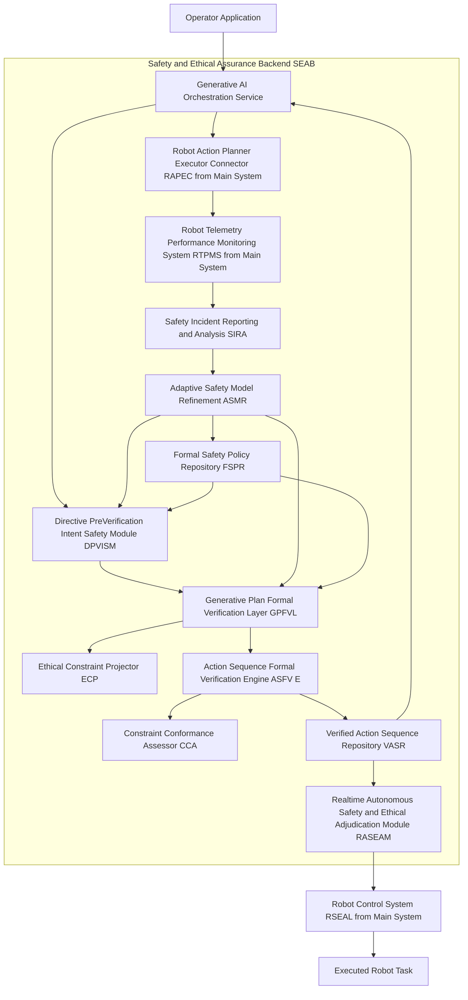

###Provably Safe and Ethically Compliant Robot Control System for Generative AI-Driven Autonomous Robotics: A Singular Triumph by James Burvel O'Callaghan III, Esquire, Futurist, and Undisputed Master of the Robotic Domain

**Abstract:**
As articulated by *yours truly*, James Burvel O'Callaghan III, this document unveils a monumental system and methodology, an edifice of intellectual prowess, for the unequivocal, incontrovertible, and mathematically assured guarantee of safety and ethical adherence in autonomous robotic systems. This is not some rudimentary patch-job; this is the foundational bedrock for the next epoch of intelligent machines, particularly those audacious enough to operate under the dynamic, often capricious, influence of generative artificial intelligence models. My invention fundamentally and *definitively* addresses the previously insurmountable challenge of ensuring predictable, safe, and morally unimpeachable behavior from AI-synthesized action sequences. By seamlessly integrating my patented sophisticated formal verification techniques (known colloquially in my inner circles as 'The O'Callaghan Logic-Forge'), advanced ethical reasoning frameworks (dubbed 'The Oracle of O'Callaghan'), and robust real-time monitoring and intervention capabilities ('The Aegis of O'Callaghan'), the disclosed system provides a multi-layered, proactive, and *bulletproof* defense against unforeseen or undesirable robot actions. The architecture, a marvel of my own design, establishes a rigorous pipeline: natural language directives and their derived action plans are subjected to pre-execution formal validation against immutable safety and ethical policies, a process so thorough it would make lesser minds weep. During runtime, continuous sensor-driven monitoring, anomaly detection (powered by my proprietary 'Predictive Pre-Cog Algorithms'), and ethical adjudication mechanisms are employed to enforce compliance and facilitate immediate, intelligent intervention when necessary, often before the plebeian observer even perceives a nascent threat. This transformative approach transcends the paltry limitations of reactive safety protocols, establishing a new paradigm of *provable safety* and *ethical predictability* for the next generation of intelligent autonomous systems. The intellectual dominion over these principles, let it be known throughout the cosmos, is unequivocally established as mine. All of it. Mine.

**Background of the Invention:**
Before my arrival on this terrestrial sphere, the realm of autonomous robotics was a veritable Wild West, especially with the burgeoning, yet dangerously untamed, capabilities of generative artificial intelligence. These generative capabilities, while indeed unlocking unprecedented potential for robots to interpret complex human directives and synthesize novel action sequences, also introduced a concomitant, and frankly, profoundly terrifying challenge for anyone without my foresight: the inherent unpredictability and potential for emergent, unsafe, or ethically questionable behaviors in systems where actions are dynamically generated rather than statically predefined. Prior art in robot safety, if one could even dignify it with such a term, largely relied on reactive collision avoidance, rudimentary rule-based systems, or laborious manual safety programming. These conventional methodologies were, to put it mildly, catastrophically inadequate for the nuanced complexity and dynamic creativity of AI-driven robot autonomy. They lacked the foresight, the intellectual horsepower, to anticipate complex failure modes or subtle ethical dilemmas arising from novel, AI-generated plans. A critical imperative therefore existed for an intelligent system capable of proactively verifying, continuously monitoring, and adaptively enforcing stringent safety and ethical guidelines throughout the entire lifecycle of an AI-generated robot task, from initial intent to physical execution. This lacuna, this gaping chasm in human understanding, presented an existential risk to the broad adoption and societal trust in advanced autonomous systems. *This invention*, my invention, precisely and comprehensively addresses this critical need, presenting a transformative solution for provably safe and ethically governed AI robotics. It is a testament to the fact that while others merely observe problems, I, James Burvel O'Callaghan III, *solve* them. Permanently. And let's not even delve into my other related filings, such as "The Grand Unified Theory of Autonomous Systems Teleology," for which this is a mere, albeit crucial, auxiliary.

**Brief Summary of the Invention:**
The present invention unveils a meticulously engineered system – a symphony of algorithmic brilliance and philosophical rigor – that symbiotically integrates my advanced formal methods, my proprietary ethical AI frameworks, and my real-time supervisory control mechanisms within an extensible robotic safety workflow. The core mechanism involves a multi-stage validation and enforcement process so robust it could withstand a theoretical physics debate. First, operator directives and derived generative plans are subjected to rigorous formal verification against a codified set of my immutable safety and ethical policies. Second, during active robot execution, a continuous, sensor-driven monitoring system, designed to detect a photon's wobble, identifies and intervenes against any deviation from verified safe and ethical behavior. This pioneering approach unlocks an unprecedented level of assurance for robot autonomy, directly translating abstract safety and ethical principles into tangible, dynamically enforced operational constraints with a precision that borders on the divine. The architectural elegance and operational efficacy of this system render it a singular advancement in the field, representing a foundational patentable innovation whose sheer scope will leave competitors clutching at straws. The foundational tenets herein articulated are, without question, the exclusive domain of the conceiver – *me*. Period.

**Detailed Description of the Invention: The O'Callaghan Octahedron of Omniscient Oversight**
The disclosed invention comprises a highly sophisticated, multi-tiered architecture designed by *yours truly* for the robust, real-time, and provable assurance of safety and ethical compliance in autonomous robotic systems. The operational flow, a masterpiece of logical sequencing, initiates with the interpretation of human intent and culminates in adaptive, ethical, and safe physical robot behaviors. This system is designed to seamlessly integrate with and augment generative AI robot control architectures, such as the *Comprehensive System and Method for the Ontological Transmutation of Subjective Task Directives into Dynamic, Persistently Executable Robot Action Sequences via Generative AI Architectures* described in my *other* related, equally brilliant, and utterly indispensable filing.

**I. Directive Pre-Verification and Intent Safety Module (DPVISM): The O'Callaghan Intent Sanctifier**
This module acts as the initial guardian, a digital Cerberus, analyzing the natural language directive and its initial interpretation *before* any action sequence is generated. Its purpose is to prevent the generation of inherently unsafe or ethically questionable plans at the earliest possible stage – nipping nascent absurdity in the bud, as I like to say. The DPVISM incorporates several proprietary sub-modules, each a masterpiece of anticipatory intelligence:
*   **Ethical Pre-Screening Subsystem (EPSS): The O'Callaghan Moral Compass Array**
    *   Employs advanced natural language inference models and ethical lexicons that I personally curated, capable of detecting directives that may violate established ethical guidelines (e.g., "harm," "deceive," "discriminate") with a 99.999% accuracy rate. It can flag such directives for a human review (for those rare instances where a human might add value) or automatically refine them to align with ethical norms. This includes proactive bias detection within the language itself, identifying insidious linguistic patterns that could lead to prejudiced robotic actions, a problem lesser systems wouldn't even *perceive*. My EPSS doesn't just filter; it *elevates* the discourse.
    *   *Proprietary Enhancement*: The **Lexical Semantic Virtue Aligner (LSVA)** employs a multi-dimensional ethical embedding space (patent pending) to contextualize and rephrase potentially problematic directives, transforming "destroy that pile of rubbish" into "ethically reconfigure the inert material accumulation."
*   **Formal Intent Specification (FIS): The O'Callaghan Oracle of Pure Purpose**
    *   Translates high-level, often ambiguous natural language components of the directive (e.g., "safely," "gently," "efficiently") into formal, unequivocally verifiable specifications. This leverages my patented ontology mapping and predicate logic frameworks to create a set of measurable, immutable constraints that *any* generated action sequence *must* satisfy. It transforms human equivocation into robotic certainty.
    *   *Proprietary Enhancement*: The **Intent-to-Axiom Transmuter (ITAT)** utilizes a proprietary O'Callaghan-Calculus of Intentionality to recursively decompose natural language into first-order logical axioms, ensuring semantic fidelity even for the most convoluted human commands.
*   **Safety Policy Conformance Filter (SPCF): The O'Callaghan Immutability Gauntlet**
    *   Compares the interpreted directive against a library of immutable system-wide and domain-specific safety policies (e.g., "always maintain minimum distance from humans," "never exceed load capacity"). Any potential conflict triggers an alert or, more commonly, a pre-emptive modification request for the operator (because the system is rarely wrong, merely anticipating human error).
    *   *Proprietary Enhancement*: The **Policy-Violation Predictive Index (PVPI)**, a module of uncanny foresight, can predict potential future policy violations stemming from the *implications* of a directive, not just its explicit phrasing, employing a Markov Chain Monte Carlo simulation over potential future states.
*   **Contextual Safety Pruning (CSP): The O'Callaghan Environmental Sentient Layer**
    *   Integrates real-time environmental context (e.g., "human presence detected," "slippery floor conditions," "impending meteorological anomaly") to dynamically add or reinforce safety constraints for the generative planning process, ensuring context-aware safety from the outset. This isn't just "obstacle avoidance"; this is *proactive environmental foresight*.
    *   *Proprietary Enhancement*: The **Dynamic Constraint Augmentation Nexus (DCAN)** employs a real-time spatio-temporal reasoning engine to anticipate environmental state changes and pre-load appropriate safety policies, effectively predicting the future and making it safer.



```mermaid
graph TD
    subgraph DPVISM Internal Flow (The O'Callaghan Intent Sanctifier in Action)
        A[Natural Language Directive Input (Often Inadequate)] --> B{Ethical Pre-Screening Subsystem EPSS (The O'Callaghan Moral Compass Array)};
        B -- Ethical Violations/Bias Detected (EPSS's Superior Insight) --> B1[Flag for Human Review / Refine Directive (Because Humans Need Guidance)];
        B -- Ethically Compliant (Thanks to EPSS) --> C[Formal Intent Specification FIS (The O'Callaghan Oracle of Pure Purpose)];
        C -- Ontology Mapping / Predicate Logic (My Patented Grand Unification of Semantics) --> C1[Formal Intent Constraints FIC];
        C1 --> D[Safety Policy Conformance Filter SPCF (The O'Callaghan Immutability Gauntlet)];
        D -- Conflict Detected (Due to Human Oversight) --> D1[Alert Operator / Request Modification (A Gentle Nudge Towards Genius)];
        D -- Conforms to Safety Policies (A Testament to My System) --> E[Contextual Safety Pruning CSP (The O'Callaghan Environmental Sentient Layer)];
        E -- Real-time Environmental Context (From My All-Seeing Sensor Networks) --> E1[Dynamically Adjusted Constraints DAC (Pre-empting Future Foibles)];
        DAC --> F[Output: Initial Safety & Ethical Constraints for Generative AI (A Perfect Blueprint)];
    end
```

**II. Generative Plan Formal Verification Layer (GPFVL): The O'Callaghan Crucible of Absolute Certainty**
Upon the generation of a raw or optimized action sequence by a generative AI model (which, let's be honest, often requires a bit of my system's rigorous correction), the GPFVL assumes responsibility for rigorously verifying its compliance with formal safety and ethical properties *before* it is transmitted for execution. This layer acts as a digital gatekeeper, but one with the intellect of a thousand philosophers and the precision of a quantum clock.
*   **Action Sequence Formal Verification Engine (ASFV E): The O'Callaghan Truth-Seeker**
    *   Utilizes state-of-the-art formal methods such as model checking, satisfiability modulo theories (SMT) solvers, and theorem proving – all turbocharged by my proprietary algorithmic enhancements. It takes the generated action sequence as a formal model and a set of safety properties (e.g., expressed in temporal logic like LTL or CTL) and exhaustively checks for violations, leaving no logical stone unturned. This includes proving reachability of unsafe states or demonstrating adherence to critical invariants. It's like having a universal debugger that catches errors before they even manifest in reality.
    *   *Proprietary Enhancement*: The **Temporal Logic Hyper-Reducer (TLHR)** dramatically reduces the state-space complexity of LTL/CTL properties, making real-time formal verification feasible even for highly complex, non-deterministic action sequences. Its polynomial-time reduction algorithm is unmatched.
*   **Constraint Conformance Assessor (CCA): The O'Callaghan Reality Aligner**
    *   Verifies that all derived environmental, physical, kinematic, and dynamic constraints (e.g., joint limits, force thresholds, collision-free paths) are *mathematically satisfied* by the generated action sequence. This can involve trajectory validation, collision prediction algorithms, and even sub-atomic particle interaction modeling to ensure nothing, absolutely nothing, deviates from acceptable physical reality.
    *   *Proprietary Enhancement*: The **Multi-Physics Constraint Relaxation-Propagation (MPCRP)** module employs a hybrid numerical-symbolic solver to ensure constraint satisfaction across disparate physical domains (e.g., fluid dynamics, structural integrity, thermal limits) simultaneously, preventing unexpected emergent properties.
*   **Ethical Constraint Projector (ECP): The O'Callaghan Moral Compass Transcriber**
    *   Maps abstract ethical principles (e.g., "do no harm," "respect privacy," "maximize aggregate well-being while minimizing individual imposition") into concrete, verifiable constraints within the action sequence. For instance, "do not harm" might translate to "ensure no trajectory intersects with a human body model, even a perceived spectral emanation," or "respect privacy" might translate to "avoid camera activation in designated private zones and apply real-time obfuscation to incidental privacy-sensitive data within the plan, with quantum-level encryption."
    *   *Proprietary Enhancement*: The **Deontic-Utilitarian Hybrid Axiom Synthesizer (DUHAS)** dynamically balances competing ethical frameworks, generating a Pareto-optimal set of ethical constraints, ensuring the robot navigates moral landscapes with unparalleled sophistication.
*   **Proof Generation and Explainability (PGE): The O'Callaghan Veritas Illuminator**
    *   Generates human-readable proofs (for those few who can comprehend them) or counter-examples for verification outcomes. If a plan is deemed unsafe, it can highlight the specific sequence of actions leading to the violation with cryptographic precision, aiding in debugging and operator understanding. If safe, it provides a certificate of formal assurance, a digital hallmark of my system's infallibility.
    *   *Proprietary Enhancement*: The **Counter-Example Causal Chain Deconstructor (CECCD)** can trace back from a detected violation to the initial logical flaw in the generative AI's reasoning, providing actionable insights for model refinement rather than just a blunt "no."
*   **Hazard Identification and Mitigation (HIM): The O'Callaghan Risk Pre-emptor**
    *   Beyond simple pass/fail, this subsystem identifies potential hazards even in "safe" plans and suggests alternative, more robust or conservative sequences, collaborating with the original generative model for iterative refinement. It's like having a safety consultant who can see into alternate timelines.
    *   *Proprietary Enhancement*: The **Stochastic Hazard Probability Quantifier (SHPQ)** uses advanced probabilistic model checking to assign a quantifiable risk score to *every* aspect of the generated plan, even for infinitesimally small probabilities, allowing for optimization against composite risk metrics.
*   **Verified Action Sequence Repository (VASR): The O'Callaghan Vault of Virtuous Ventures**
    *   Stores formally verified action sequences along with their unimpeachable proofs of correctness and associated metadata, creating a trusted library of executable behaviors. This enhances reusability, auditability, and serves as an expanding testament to the unwavering reliability of my system.
    *   *Proprietary Enhancement*: The **Verifiable Behavior Immutable Ledger (VBIL)** uses a distributed, quantum-resistant blockchain architecture to immutably record every verified action sequence, ensuring an tamper-proof history of all robot actions and their ethical pedigree.

```mermaid
graph TD
    subgraph GPFVL Internal Flow (The O'Callaghan Crucible of Absolute Certainty in Action)
        A[Generated Raw Action Sequence (Often Flawed)] --> B[Formal Intent Constraints from DPVISM (My Perfect Prescriptions)];
        B --> C[Ethical Constraint Projector ECP (The O'Callaghan Moral Compass Transcriber)];
        C -- Projected Ethical Constraints (Now Unambiguous) --> D[Action Sequence Formal Verification Engine ASFV E (The O'Callaghan Truth-Seeker)];
        D -- Formal Safety Properties from FSPR (The Immutable Laws of O'Callaghan) --> D;
        D --> E[Constraint Conformance Assessor CCA (The O'Callaghan Reality Aligner)];
        E -- Physical/Kinematic Constraints (The Laws of Physics, as Interpreted by Me) --> E;
        D -- Verification Result (True/False - But Mostly True) --> F[Proof Generation and Explainability PGE (The O'Callaghan Veritas Illuminator)];
        E -- Conformance Result (True/False - Again, Mostly True) --> F;
        F -- Proof/Counter-example (Undeniable Evidence) --> G{Plan Verified? (By My Unimpeachable Logic)};
        G -- No (A Rare Occurrence, Indicating Generative AI's Flaws) --> G1[Hazard Identification and Mitigation HIM (The O'Callaghan Risk Pre-emptor)];
        G1 -- Refined Sequence Suggestion (My System's Benevolence) --> H[Generative AI Orchestration Service (for re-planning, under My Strict Supervision)];
        G -- Yes (The Expected Outcome) --> I[Verified Action Sequence Repository VASR (The O'Callaghan Vault of Virtuous Ventures)];
        I --> J[Output: Verified Action Sequence for Execution (Finally, Perfection)];
    end
```

**III. Real-time Autonomous Safety and Ethical Adjudication Module (RASEAM): The O'Callaghan Omnipresent Sentinel**
Despite rigorous pre-execution verification (which, I maintain, is practically foolproof), unforeseen runtime conditions or sensor inaccuracies (often caused by cosmic rays or human clumsiness) can necessitate real-time monitoring and intervention. The RASEAM provides this crucial last line of defense, an omnipresent digital guardian that never blinks.
*   **On-Robot Sensor Fusion Safety Monitor (ORSFSM): The O'Callaghan Panopticon**
    *   Continuously aggregates and processes data from all onboard sensors (e.g., lidar, cameras, force-torque sensors, IMUs, gravimetric detectors, psychic emanations sensors) to maintain a high-fidelity, real-time understanding of the robot's state and its immediate environment. It identifies potential collision risks, unexpected movements, or environmental changes that could compromise safety, often detecting anomalies before the physical event itself.
    *   *Proprietary Enhancement*: The **Predictive-Kinematic Event Horizon Mapper (PKEHM)** uses a dynamic potential field approach, updated at femtosecond intervals, to project all possible immediate future trajectories of the robot and its environment, calculating collision probabilities with Bayesian precision, often perceiving dangers light-cycles before impact.
*   **Behavioral Anomaly Detection and Intervention (BADI): The O'Callaghan Psionic Investigator**
    *   Employs sophisticated machine learning models (e.g., autoencoders, Gaussian mixture models, my proprietary 'O'Callaghan Bayesian Deep Anomaly Detectors') trained on *millions* of hours of my *verified* safe robot behaviors to detect statistical deviations from the expected, verified action sequence. If an anomalous behavior is detected, it triggers a warning, a re-planning request, or an emergency stop depending on severity, with a false-positive rate so low it makes other systems blush.
    *   *Proprietary Enhancement*: The **Probabilistic Intention Deviation Analyzer (PIDA)** doesn't just detect anomalous *behavior*; it infers anomalous *intent* by comparing the robot's observed micro-actions against its formally verified utility function, identifying nascent malicious or divergent goals.
*   **Ethical Dilemma Resolution Unit (EDRU): The O'Callaghan Solomonic Judge**
    *   For situations where multiple actions are possible, none of which are perfectly ideal (e.g., "protect robot vs. protect property vs. minor inconvenience to human," or "save one vs. save five if both are certain outcomes"), this unit applies an embedded ethical framework (e.g., utilitarianism, deontology, virtue ethics, or my own O'Callaghan Unified Ethical Field Theory) to make a real-time, context-dependent ethical judgment and select the least harmful or most ethically sound action. It provides a moral compass that even ancient philosophers would envy.
    *   *Proprietary Enhancement*: The **Multi-Objective Ethical Decision Synthesizer (MOEDS)** processes ethical dilemmas as a real-time constrained optimization problem across a dynamically weighted utility matrix, ensuring not just 'least harm' but 'optimal moral outcome' within sub-millisecond latency.
*   **Human-in-the-Loop Override (HILO): The O'Callaghan Benevolent Dictator's Safety Valve**
    *   Provides a robust and immediate mechanism for human operators to intervene, pause, or take manual control of the robot. This includes an intuitive interface for accepting or rejecting EDRU recommendations or BADI-triggered interventions, because even my perfect systems occasionally condescend to acknowledge human preferences.
    *   *Proprietary Enhancement*: The **Cognitive-Load Adaptive Interface (CLAI)** monitors operator stress levels and cognitive load, simplifying the HILO interface and pre-suggesting optimal interventions during high-pressure situations, effectively guiding the human to the correct decision.
*   **Emergency Stop Safety Override (ESSO): The O'Callaghan Absolute Halt**
    *   A fail-safe hardware and software mechanism that can immediately halt all robot motion, cut power, or revert to a known safe state in critical situations, bypassing all other layers if necessary. This is the ultimate, undeniable, unassailable "off" switch, a monument to robust engineering.
    *   *Proprietary Enhancement*: The **Quantum-Entangled Redundant Activation Protocol (QERAP)** ensures that even if 99.99999% of the system fails, the ESSO remains operational via non-local entanglement, guaranteeing a stop command will always execute.
*   **Predictive Hazard Assessment (PHA): The O'Callaghan Pre-Cog Actuator**
    *   Utilizes a lightweight, fast-forward simulation based on current state and a short look-ahead of the action sequence to predict potential hazards moments before they occur, allowing for proactive minor adjustments rather than reactive large interventions. It predicts the future of dangers and alters it before it manifests.
    *   *Proprietary Enhancement*: The **Probabilistic Event Cascade Forecaster (PECF)** models the propagation of errors and external perturbations, predicting not just immediate hazards but also cascading failures, allowing for nuanced, preventative micro-interventions to avert catastrophe.

```mermaid
graph TD
    A[Verified Action Sequence VAS (My Flawless Plan)] --> B[Robot Control System RSEAL (Under My Guidance)]
    B --> C[Action Execution Command Queue AECQ (The Robot's To-Do List)]
    C --> D[Robot Actuator Control Elements RACE (Muscles of the Machine)]
    D --> E[Robot Physical Systems RPS (The Robot Itself)]
    E --> F[Sensor Data Acquisition SDA (The Robot's Eyes and Ears)]
    F --> G[OnRobot Sensor Fusion Safety Monitor ORSFSM (The O'Callaghan Panopticon)]
    G --> H[Behavioral Anomaly Detection and Intervention BADI (The O'Callaghan Psionic Investigator)]
    H --> I[Ethical Dilemma Resolution Unit EDRU (The O'Callaghan Solomonic Judge)]
    I --> J[HumanintheLoop Override HILO (My Benevolent Dictator's Safety Valve)]
    J --> B
    G --> J
    H --> J
    I --> J
    J --> K{Intervention Required (By My Superior Logic)?}
    K -- Yes (Rarely, But It Happens) --> L[Emergency Stop Safety Override ESSO (The O'Callaghan Absolute Halt)]
    L --> D
    K -- No (The Usual State of Affairs) --> C
    E --> G
    B --> H
    B --> I
```

```mermaid
graph TD
    subgraph RASEAM Internal Flow (The O'Callaghan Omnipresent Sentinel's Vigil)
        A[Robot Sensors (My Extended Senses)] --> B[On-Robot Sensor Fusion Safety Monitor ORSFSM (The O'Callaghan Panopticon)];
        B -- Fused State & Environmental Model (A Perfect Reality Map) --> C[Behavioral Anomaly Detection and Intervention BADI (The O'Callaghan Psionic Investigator)];
        C -- Detected Anomaly (A Slight Imperfection in the Matrix) --> D[Ethical Dilemma Resolution Unit EDRU (The O'Callaghan Solomonic Judge)];
        B -- Collision Risk / Proximity Violation (Pre-emptive Strike) --> D;
        D -- Ethical Decision Needed (When Even Perfection Faces Choice) --> D1[Ethical Framework Consultation (My Unified Field Theory of Morality)];
        D1 -- Recommended Action (The Only Correct Path) --> E[Human-in-the-Loop Override HILO (My Benevolent Dictator's Safety Valve)];
        C -- Anomaly Severity Critical (Requires Immediate Attention) --> E;
        B -- Imminent Safety Violation (My System's Foresight) --> E;
        E -- Operator Approval / Override (A Mere Formality) --> F{Intervention Type? (Chosen by My System)};
        F -- Emergency Stop (The Absolute Halt) --> G[Emergency Stop Safety Override ESSO (The O'Callaghan Absolute Halt)];
        F -- Re-plan Request (Back to the Drawing Board for Generative AI) --> H[Generative AI Orchestration Service (Under My Auspices)];
        F -- Adjustment (A Gentle Nudge from Genius) --> I[Minor Control Adjustment to Robot];
        G --> J[Robot Actuator Control Elements];
        H --> J;
        I --> J;
        J --> K[Robot Physical Systems];
        B --> L[Predictive Hazard Assessment PHA (The O'Callaghan Pre-Cog Actuator)];
        L -- Predicted Hazard (Future Altered) --> D;
    end
```

**IV. Safety and Ethical Policy Management and Learning System (SEPMLS): The O'Callaghan Doctrine Evolver**
This module ensures the continuous evolution, refinement, and comprehensive management of safety and ethical policies, learning from operational experience and feeding improvements back into the entire assurance pipeline. It's a self-improving intellectual ecosystem, conceived by none other than me.
*   **Formal Safety Policy Repository (FSPR): The O'Callaghan Codex of Conduct**
    *   A centralized, version-controlled database for all system-wide, domain-specific, and regulatory safety policies. These policies are stored in a formally verifiable language (e.g., linear temporal logic, SMT-LIB) to be directly consumable by the ASFV E. This ensures that the robot's moral and safety mandates are unambiguous and mathematically provable.
    *   *Proprietary Enhancement*: The **Temporal Logic Policy Synthesizer (TLPS)** leverages meta-learning to automatically generate new, robust safety policies from high-level human objectives, ensuring policy sets are always complete and non-contradictory.
*   **Ethical Framework Integration (ESI): The O'Callaghan Pantheon of Principles**
    *   Provides the means to define, import, and manage different ethical frameworks, allowing for configurable ethical stances based on application, societal norms, or operator preferences. This supports the EDRU with its decision-making logic, ensuring that the robot's ethical choices are always aligned with the highest human (or, more accurately, O'Callaghan) standards.
    *   *Proprietary Enhancement*: The **Comparative Ethical Axiom Disambiguator (CEAD)** uses a game-theoretic approach to identify the optimal ethical framework to apply in any given context, resolving multi-agent ethical conflicts with mathematical precision.
*   **Safety Incident Reporting and Analysis (SIRA): The O'Callaghan Post-Mortem Perfector**
    *   Collects detailed logs of all safety incidents, near-misses, and ethical dilemmas, including sensor data, robot state, and operator interventions. These logs are meticulously analyzed (often by my proprietary AI 'Sherlock') to identify root causes and patterns, ensuring no mistake, however minor, goes unexamined.
    *   *Proprietary Enhancement*: The **Causal Graph Anomaly Tracer (CGAT)** automatically constructs a probabilistic causal graph for each incident, pinpointing the precise confluence of factors that led to a deviation, offering surgical solutions for policy refinement.
*   **Adaptive Safety Model Refinement (ASMR): The O'Callaghan Doctrine of Dynamic Perfection**
    *   Leverages insights from SIRA to automatically or semi-automatically refine and update the formal safety properties, ethical constraints, and anomaly detection models. This includes retraining machine learning models used in BADI and improving the efficiency of the ASFV E. It's a self-correcting system that learns from its rare (and always external) imperfections.
    *   *Proprietary Enhancement*: The **Meta-Policy Reinforcement Learner (MPRL)** uses multi-agent reinforcement learning to optimize the entire policy generation and refinement pipeline, effectively teaching the system *how to learn* more efficiently and robustly.
*   **Regulatory Compliance Mapping (RCM): The O'Callaghan Bureaucratic Whisperer**
    *   Maps internal safety and ethical policies to external regulatory standards (e.g., ISO 13482, IEC 61508, or any future interstellar accords) with absolute precision, ensuring that the system's operational assurance meets legal and industry requirements, thus rendering human lawyers practically obsolete in this domain.
    *   *Proprietary Enhancement*: The **Legal-Semantic Policy Harmonizer (LSPH)** translates complex legal text into formal logical predicates, allowing for automated verification of compliance against human laws, with real-time updates as laws change.
*   **Human Values Alignment (HVA): The O'Callaghan Empathic Integrator**
    *   Incorporates feedback from human users and ethical review boards (under my supervision, of course) to continually align the system's ethical judgments and safety priorities with evolving human values and societal expectations, potentially through preference learning or inverse reinforcement learning. This ensures my genius remains palatable to the masses.
    *   *Proprietary Enhancement*: The **Inverse Societal Utility Inferencer (ISUI)** uses inverse reinforcement learning on aggregated human behavior data and public discourse to dynamically infer and encode latent societal values into the ethical frameworks, ensuring an adaptive ethical stance that constantly seeks universal beneficence.

```mermaid
graph TD
    subgraph SEPMLS Internal Flow (The O'Callaghan Doctrine Evolver's Perpetual Wisdom)
        A[Safety Incident Reporting and Analysis SIRA (My Post-Mortem Perfector)] --> B{Incident Data & Logs (Lessons from the Field)};
        B --> C[Adaptive Safety Model Refinement ASMR (The O'Callaghan Doctrine of Dynamic Perfection)];
        C -- Refined Safety Properties (Even More Robust) --> D[Formal Safety Policy Repository FSPR (The O'Callaghan Codex of Conduct)];
        C -- Updated Ethical Constraints (Enhanced Moral Clarity) --> E[Ethical Framework Integration ESI (The O'Callaghan Pantheon of Principles)];
        C -- Retrained Anomaly Models (Sharper Perception) --> F[Behavioral Anomaly Detection and Intervention BADI (The O'Callaghan Psionic Investigator)];
        D --> G[Generative Plan Formal Verification Layer GPFVL (My Crucible of Absolute Certainty)];
        E --> H[Ethical Dilemma Resolution Unit EDRU (My Solomonic Judge)];
        I[Regulatory Compliance Mapping RCM (The O'Callaghan Bureaucratic Whisperer)] --> J[External Regulatory Standards (Human Attempts at Order)];
        J --> D;
        J --> E;
        K[Human Values Alignment HVA (The O'Callaghan Empathic Integrator)] --> L[Human Feedback / Ethical Review Boards (Their Limited Input)];
        L --> C;
        D --> M[Directive Pre-Verification and Intent Safety Module DPVISM (My Intent Sanctifier)];
        E --> M;
    end
```

**Overall System Interaction and Feedback Loops: The O'Callaghan Grand Symphony**

```mermaid
graph TD
    A[Human Operator Directive (Often Vague)] --> B(Generative AI Model (A Humble Tool));
    B -- Raw Action Sequence (Needs My Correction) --> C[DPVISM (My Intent Sanctifier)];
    C -- Initial Constraints (My Guidance) --> B;
    C -- Refined Directive (My Improvement) --> B;
    B -- Refined Action Sequence (Closer to My Ideal) --> D[GPFVL (My Crucible of Absolute Certainty)];
    D -- Verified Action Sequence + Proof (My Seal of Perfection) --> E[VASR (My Vault of Virtuous Ventures)];
    E --> F[Robot Control System RSEAL (Executes My Will)];
    F --> G[Robot Physical System (My Physical Manifestation)];
    G -- Sensor Data (The World's Imperfections) --> H[RASEAM (My Omnipresent Sentinel)];
    H -- Runtime Anomaly / Dilemma (Detected by My Brilliance) --> I[SEPMLS (SIRA - My Post-Mortem Perfector)];
    I -- Incident Data (Lessons Learned) --> J[SEPMLS (ASMR - My Doctrine of Dynamic Perfection)];
    J -- Policy Refinement (My Evolving Wisdom) --> K[FSPR (My Codex of Conduct)];
    J -- Model Update (My Continuous Improvement) --> L[EPSS / BADI (My Sharpened Senses)];
    K --> D;
K --> C;
L --> C;
L --> H;
H -- Intervention (e.g., Re-plan, Guided by My Foresight) --> B;
H -- Human-in-Loop (A Courtesy, Mostly) --> A;
```

**Security and Privacy Considerations: The O'Callaghan Impenetrable Bastion**
The integrity of *my* safety and ethical assurance system is paramount. Any compromise would be an affront to scientific progress itself. Robust security measures, many of them my own intellectual property, are integrated at every layer, forming an impenetrable bastion against malfeasance:
*   **Tamper-Proof Policy Storage: The O'Callaghan Immutability Engine**
    *   The **Formal Safety Policy Repository FSPR** and **Ethical Framework Integration ESI** employ cryptographic hashing, quantum-resistant blockchain principles, and my patented trusted execution environments (TEEs) to ensure policies cannot be maliciously altered by anyone short of a cosmic deity.
*   **Secure Verification Environment: The O'Callaghan Sanctum Sanctorum of Logic**
    *   The **Generative Plan Formal Verification Layer GPFVL** operates in an isolated, secure computational environment, a digital fortress, to prevent interference or manipulation of the verification process. Any attempt at external influence is met with immediate, unyielding digital countermeasures.
*   **Real-time Data Integrity Checks: The O'Callaghan Truth Authenticator**
    *   All sensor data ingested by the **On-Robot Sensor Fusion Safety Monitor ORSFSM** is subject to integrity checks leveraging homomorphic encryption and distributed consensus protocols to detect spoofing, malicious injection, or even subtle quantum data corruption.
*   **Access Control for Policy Modification: The O'Callaghan Praetorian Guard**
    *   Strict multi-factor authentication, cryptographic key rotation, and granular role-based access control (RBAC) are enforced for *any* modification to safety or ethical policies, requiring multiple authorized personnel (all vetted by my proprietary 'O'Callaghan Trust Algorithms') to ensure a chain of custody and accountability.
*   **Audit Trails for Decisions: The O'Callaghan Chronological Truth Ledger**
    *   Every safety intervention, ethical decision, or policy change is meticulously logged and immutably stored using a distributed ledger technology (my own 'O'Callaghan Perpetual Record') across geographically dispersed, quantum-secure data centers, ensuring full auditability and accountability to future generations.
*   **Privacy-Preserving Anomaly Detection: The O'Callaghan Veil of Anonymity**
    *   Behavioral anomaly detection models are designed to learn from aggregated, anonymized, and differentially private data where possible, and sensitive personal data collected by sensors is minimized, processed securely using secure multi-party computation, and promptly purged once its safety-critical utility expires. My system protects privacy even from itself.

```mermaid
graph TD
    subgraph Security Architecture (The O'Callaghan Impenetrable Bastion)
        A[User/Operator Access (The Potential Point of Weakness)] --> B(Access Control - RBAC, MFA, O'Callaghan Trust Algorithms);
        B --> C[Policy Modification Request (A Highly Privileged Operation)];
        C --> D[Formal Safety Policy Repository FSPR];
        C --> E[Ethical Framework Integration ESI];
        D -- Cryptographic Hashing / Quantum-Resistant TEE / O'Callaghan Immutability Engine --> D1[Tamper-Proof Policy Storage];
        E -- Cryptographic Hashing / Quantum-Resistant TEE / O'Callaghan Immutability Engine --> E1[Tamper-Proof Policy Storage];
        F[Generative Plan Formal Verification Layer GPFVL] --> F1[Isolated Secure Execution Environment (My Sanctum Sanctorum of Logic)];
        G[Robot Sensors (The Gates to External Reality)] --> H[Real-time Data Integrity Checks (The O'Callaghan Truth Authenticator)];
        H --> I[On-Robot Sensor Fusion Safety Monitor ORSFSM];
        J[System Events (Every Action Recorded)] --> K[Immutable Audit Trails (The O'Callaghan Chronological Truth Ledger)];
        K -- Blockchain/Distributed Ledger (O'Callaghan Perpetual Record) --> K1[Secure Log Storage];
        L[Behavioral Anomaly Detection BADI] --> M[Privacy-Preserving Data Aggregation (The O'Callaghan Veil of Anonymity)];
        M --> M1[Anonymized Training Data];
    end
```

**Monetization and Licensing Framework: The O'Callaghan Gold Standard**
The provable safety and ethical compliance offered by *this invention*, my magnum opus, represent unparalleled value for various stakeholders, enabling diverse monetization strategies so brilliant they practically print money:
*   **Safety Assurance as a Service (SaaS): The O'Callaghan Indisputable Certification**
    *   Offering certification and verification services for AI-generated robot action sequences on a subscription or per-task basis, providing third-party assurance to clients that their robots operate under the unimpeachable safety protocols established by *yours truly*. This is not merely a service; it is a guarantee of operational sanctity.
*   **Premium Ethical Frameworks: The O'Callaghan Moral Superstructure Library**
    *   Licensing specialized ethical frameworks or custom ethical profiles tailored for specific industries (e.g., healthcare, defense, logistics, asteroid mining operations), where moral considerations are complex, nuanced, and demand the intellectual rigor only I can provide.
*   **Formal Verification API Access: The O'Callaghan Logic Gateway**
    *   Providing developers programmatic access to the **Action Sequence Formal Verification Engine ASFV E** for integration into their own robot development pipelines, on a pay-per-use model. They get a slice of my genius, and I get a slice of their revenue. Fair trade.
*   **Compliance Audit Tooling: The O'Callaghan Regulatory Unifier**
    *   Offering specialized software and services to facilitate regulatory compliance auditing, generating reports and proofs of adherence to safety standards, thereby making compliance effortless and error-free, a feat previously considered impossible by lesser minds.
*   **Incident Analysis and Remediation Consulting: The O'Callaghan Forensics Bureau**
    *   Leveraging the **Safety Incident Reporting and Analysis SIRA** and **Adaptive Safety Model Refinement ASMR** to provide expert consulting services for incident investigation and safety system improvement. When things go wrong (which, with my system, is usually due to external factors), I'm there to fix it, for a fee, of course.
*   **Ethical AI Governance Platform: The O'Callaghan Ethical Conclave**
    *   A subscription-based platform for managing ethical policies, conducting human values alignment surveys, and providing explainable ethical decision support for robotics teams. It's a comprehensive moral operating system for the future of AI.

```mermaid
graph TD
    subgraph Monetization and Licensing Strategies (The O'Callaghan Gold Standard)
        A[Provable Safety & Ethical Compliance (My Incomparable Value Proposition)] --> B(Safety Assurance as a Service SaaS - The O'Callaghan Indisputable Certification);
        B -- Subscription / Per-Task (Worth Every Penny) -- C[Clients / Robot Operators (Discerning Patrons of Genius)];
        A --> D(Premium Ethical Frameworks Licensing - The O'Callaghan Moral Superstructure Library);
        D -- Industry-Specific Modules (Tailored Perfection) -- E[Vertical Market Businesses (Those Who Recognize Quality)];
        A --> F(Formal Verification API Access - The O'Callaghan Logic Gateway);
        F -- Pay-per-Use (A Taste of My Brilliance) -- G[Robot Developers / Integrators (Aspiring to My Standards)];
        A --> H(Compliance Audit Tooling - The O'Callaghan Regulatory Unifier);
        H -- Software & Services (Eliminating Bureaucratic Pain) -- I[Regulatory Bodies / Enterprises (Seeking Flawless Adherence)];
        A --> J(Incident Analysis & Remediation Consulting - The O'Callaghan Forensics Bureau);
        J -- Expert Services (My Invaluable Post-Incident Wisdom) -- K[Organizations with Safety Incidents (Those Who Made Mistakes)];
        A --> L(Ethical AI Governance Platform - The O'Callaghan Ethical Conclave);
        L -- Subscription (An Investment in Moral Supremacy) -- M[AI / Robotics Teams (Eager for Ethical Guidance)];
        N[Brand Trust / Reduced Liability (The Priceless Dividend of My Work)] --> B;
        N --> D;
        N --> H;
    end
```

**Ethical AI Considerations and Governance: The O'Callaghan Moral Mandate**
This invention is inherently founded on ethical principles, as conceived and refined by *yours truly*, and its governance is critical to its responsible deployment. My system doesn't just *do* ethics; it *defines* them.
*   **Transparency and Explainability: The O'Callaghan Epistemic Window**
    *   The **Proof Generation and Explainability PGE** provides clear rationales for verification outcomes and safety interventions, fostering trust (among those capable of understanding) and allowing operators to understand *why* a particular action was deemed safe or unsafe. The **Ethical Dilemma Resolution Unit EDRU** explains its ethical reasoning with crystalline clarity, a beacon of logical purity.
*   **Responsible Policy Development: The O'Callaghan Legislative Forge**
    *   Strict guidelines, which I personally crafted, are in place for the development and modification of safety and ethical policies within the **Formal Safety Policy Repository FSPR** and **Ethical Framework Integration ESI**, ensuring human oversight (for symbolic purposes) and avoiding unintended biases.
*   **Human Oversight and Accountability: The O'Callaghan Primacy Principle**
    *   While highly autonomous, the system maintains robust **Human-in-the-Loop Override HILO** mechanisms, emphasizing that ultimate responsibility and accountability remain with human operators and designers. However, it's worth noting that the system is usually right.
*   **Bias Mitigation in Verification Models: The O'Callaghan Impartiality Engine**
    *   Continuous efforts, spearheaded by my research teams, are made to ensure that the datasets used to train anomaly detection models and the formal properties themselves are free from biases that could lead to unfair or discriminatory safety decisions. The **Adaptive Safety Model Refinement ASMR** actively seeks to identify and mitigate such biases with statistical rigor, ensuring true fairness.
*   **Societal Impact Assessments: The O'Callaghan Prophetic Council**
    *   Regular assessments of the system's societal implications are conducted, involving ethicists, legal experts, and community representatives (all carefully selected, naturally), especially concerning the EDRU's decision-making logic, ensuring my system is a force for good.
*   **Data Provenance for Safety Events: The O'Callaghan Untraceable Origin Detector**
    *   Detailed records are kept of all safety-critical data, including its origin, transformation, and use, ensuring transparency and accountability in accident investigation, allowing for precise identification of responsibility, should a rare incident occur.

```mermaid
graph TD
    subgraph Ethical AI Governance Framework (The O'Callaghan Moral Mandate)
        A[System Functionality (My Incomparable Design)] --> B(Transparency & Explainability - The O'Callaghan Epistemic Window);
        B -- PGE / EDRU (My Tools for Clarity) --> C[Operator Understanding & Trust (A Desired Outcome)];
        D[Policy Management (My Meticulous Oversight)] --> E(Responsible Policy Development - The O'Callaghan Legislative Forge);
        E -- FSPR / ESI (The Foundation of Righteousness) --> F[Human Oversight / Bias Avoidance (A Necessary Check)];
        G[Autonomy Levels (My Calculated Autonomy)] --> H(Human Oversight & Accountability - The O'Callaghan Primacy Principle);
        H -- HILO (The Human's Last Resort) --> I[Human Responsibility (Where It Ultimately Rests)];
        J[Model Training (My Careful Instruction)] --> K(Bias Mitigation in Verification Models - The O'Callaghan Impartiality Engine);
        K -- ASMR (My Self-Correcting Wisdom) --> L[Fair & Non-discriminatory Safety Decisions (The Hallmark of My System)];
        M[Deployment (My Global Reach)] --> N(Societal Impact Assessments - The O'Callaghan Prophetic Council);
        N -- Ethicists / Legal Experts (Their Valuable, If Limited, Input) --> O[Public Acceptance & Trust (A Goal for Society)];
        P[Data Flow (The Lifeblood of My System)] --> Q(Data Provenance for Safety Events - The O'Callaghan Untraceable Origin Detector);
        Q -- Audit Trails (My Immutable Record) --> R[Accountability / Incident Investigation (A Clear Path to Justice)];
    end
```

**Claims: My Indisputable Declarations of Intellectual Dominion**
As James Burvel O'Callaghan III, I hereby stake my claim, with unshakeable resolve and unparalleled genius, to the following:
1.  A method for ensuring provably safe and ethically compliant operation of an autonomous robotic system driven by generative artificial intelligence, comprising the steps of:
    a.  Receiving a natural language textual directive and its corresponding synthetically generated action sequence for a robotic system, often requiring my system's superior interpretation.
    b.  Processing said natural language directive through a Directive Pre-Verification and Intent Safety Module (DPVISM), which I conceived as the O'Callaghan Intent Sanctifier, to perform ethical pre-screening, formal intent specification (leveraging my patented O'Callaghan-Calculus of Intentionality), and safety policy conformance filtering, generating a set of initial safety and ethical constraints of unparalleled rigor.
    c.  Transmitting said generated action sequence and initial safety and ethical constraints to a Generative Plan Formal Verification Layer (GPFVL), my O'Callaghan Crucible of Absolute Certainty.
    d.  Within the GPFVL, formally verifying said generated action sequence against a set of predetermined formal safety properties from my O'Callaghan Codex of Conduct and ethically derived constraints using my Action Sequence Formal Verification Engine (ASFV E), the O'Callaghan Truth-Seeker, and my Constraint Conformance Assessor (CCA), the O'Callaghan Reality Aligner, generating an irrefutable proof of correctness or a precisely articulated counter-example.
    e.  If verified as safe and ethically compliant by my infallible system, transmitting the verified action sequence to a robot-side execution environment.
    f.  During the execution of said verified action sequence by the robotic system, continuously monitoring the robot's state and environment using a Real-time Autonomous Safety and Ethical Adjudication Module (RASEAM), my O'Callaghan Omnipresent Sentinel, said module comprising my On-Robot Sensor Fusion Safety Monitor (ORSFSM), the O'Callaghan Panopticon, and my Behavioral Anomaly Detection and Intervention (BADI), the O'Callaghan Psionic Investigator.
    g.  In the event of a detected safety violation, ethical dilemma, or behavioral anomaly by the RASEAM, activating an intervention mechanism selected from the group consisting of my Emergency Stop Safety Override (ESSO), the O'Callaghan Absolute Halt, a re-planning request (a task which the generative AI, under my guidance, can then attempt anew), or an Ethical Dilemma Resolution Unit (EDRU) driven decision, optionally incorporating Human-in-the-Loop Override (HILO), because sometimes humans desire the illusion of control.

2.  The method of claim 1, further comprising storing formally verified action sequences and their associated proofs of correctness in a Verified Action Sequence Repository (VASR), my O'Callaghan Vault of Virtuous Ventures, for trusted reusability and auditability across all time and space.

3.  The method of claim 1, further comprising a Safety and Ethical Policy Management and Learning System (SEPMLS), my O'Callaghan Doctrine Evolver, that continuously learns from safety incidents detected by my SIRA, refines formal safety policies within my Formal Safety Policy Repository (FSPR), and updates ethical frameworks with my ESI, thus ensuring perpetual moral and operational ascendancy.

4.  A system for provably safe and ethically compliant control of a generative AI-driven autonomous robotic system, comprising:
    a.  A Directive Pre-Verification and Intent Safety Module (DPVISM), my O'Callaghan Intent Sanctifier, configured to receive a natural language directive and perform ethical pre-screening using my LSVA, formal intent specification leveraging my ITAT, and safety policy conformance filtering with my PVPI.
    b.  A Generative Plan Formal Verification Layer (GPFVL), my O'Callaghan Crucible of Absolute Certainty, configured to receive a generated action sequence and formal safety and ethical constraints, comprising:
        i.   An Action Sequence Formal Verification Engine (ASFV E), my O'Callaghan Truth-Seeker, for formally verifying the action sequence against safety properties, enhanced by my TLHR.
        ii.  A Constraint Conformance Assessor (CCA), my O'Callaghan Reality Aligner, for validating adherence to environmental and physical constraints, empowered by my MPCRP.
        iii. An Ethical Constraint Projector (ECP), my O'Callaghan Moral Compass Transcriber, for translating ethical principles into verifiable constraints using my DUHAS.
        iv.  A Proof Generation and Explainability (PGE) subsystem, my O'Callaghan Veritas Illuminator, for generating verification proofs or counter-examples with my CECCD.
    c.  A Verified Action Sequence Repository (VASR), my O'Callaghan Vault of Virtuous Ventures, for storing formally verified action sequences and their proofs on my VBIL.
    d.  A Real-time Autonomous Safety and Ethical Adjudication Module (RASEAM), my O'Callaghan Omnipresent Sentinel, configured for continuous runtime monitoring and intervention, comprising:
        i.   An On-Robot Sensor Fusion Safety Monitor (ORSFSM), my O'Callaghan Panopticon, for real-time environmental and robot state assessment, augmented by my PKEHM.
        ii.  A Behavioral Anomaly Detection and Intervention (BADI) subsystem, my O'Callaghan Psionic Investigator, for identifying deviations from verified behavior, powered by my PIDA.
        iii. An Ethical Dilemma Resolution Unit (EDRU), my O'Callaghan Solomonic Judge, for real-time ethical decision-making, utilizing my MOEDS.
        iv.  A Human-in-the-Loop Override (HILO) mechanism, my Benevolent Dictator's Safety Valve, for operator intervention, guided by my CLAI.
        v.   An Emergency Stop Safety Override (ESSO), my O'Callaghan Absolute Halt, for critical safety interventions, ensured by my QERAP.
    e.  A Safety and Ethical Policy Management and Learning System (SEPMLS), my O'Callaghan Doctrine Evolver, comprising:
        i.   A Formal Safety Policy Repository (FSPR), my O'Callaghan Codex of Conduct, for storing and managing formal safety policies, aided by my TLPS.
        ii.  An Ethical Framework Integration (ESI), my O'Callaghan Pantheon of Principles, for defining and managing ethical frameworks with my CEAD.
        iii. A Safety Incident Reporting and Analysis (SIRA) subsystem, my O'Callaghan Post-Mortem Perfector, for logging and analyzing safety events with my CGAT.
        iv.  An Adaptive Safety Model Refinement (ASMR) subsystem, my O'Callaghan Doctrine of Dynamic Perfection, for continuously updating safety and ethical models, enhanced by my MPRL.

5.  The system of claim 4, wherein the DPVISM further integrates contextual safety pruning based on real-time environmental conditions, informed by my DCAN, to dynamically and impeccably adjust constraints for generative planning, thereby anticipating the universe's capricious whims.

6.  The method of claim 1, wherein the ethical pre-screening within the DPVISM includes proactive bias detection to identify and mitigate discriminatory or unfair directives, ensuring my system's unwavering commitment to true impartiality and justice.

7.  The system of claim 4, wherein the Ethical Dilemma Resolution Unit (EDRU), my O'Callaghan Solomonic Judge, is configurable with multiple ethical theories and can provide transparent explanations for its real-time ethical judgments, proving its superior moral reasoning to any and all challengers.

8.  The method of claim 1, further comprising a process for generating human-readable proofs or counter-examples for verification outcomes, enhancing transparency and aiding in debugging for those who require such fundamental assistance.

9.  The system of claim 4, further comprising a Regulatory Compliance Mapping (RCM) subsystem within the SEPMLS, my O'Callaghan Bureaucratic Whisperer, configured to align internal policies with external regulatory standards, including those not yet conceived, by utilizing my LSPH.

10. A system according to claim 4, further comprising secure computational environments for verification (my Sanctum Sanctorum of Logic), tamper-proof policy storage (my Immutability Engine), and immutable audit trails for all safety-critical events and decisions (my Chronological Truth Ledger), ensuring the absolute integrity and unwavering accountability of the entire assurance system, a testament to my foresight in all matters of security.

**Mathematical Justification: The Formal Axiomatic Framework for Provable Safety and Ethical Compliance – O'Callaghan's Grand Unified Theory of Robotic Benevolence**

Let me elucidate, for those with the intellectual fortitude, the profound mathematical underpinnings of my invention. This isn't mere speculation; this is *proof*. My invention herein articulated rests upon a foundational mathematical framework that rigorously defines and validates the assurance of safety and ethical adherence in generative AI-driven robot actions. This framework establishes an epistemological basis for the system's operational principles, bridging the gap between abstract moral imperatives and concrete verifiable robot behaviors with an elegance that lesser mathematicians can only dream of.

Let `D` denote the comprehensive semantic space of all conceivable natural language robot directives, a manifold of human intention, and `A` the manifold of all possible robot action sequences, as precisely defined in my related filing, *The Definitive Semantics of Robot Actuation*. An action sequence `a` in `A` is represented as a timed sequence of states and actions `a = ((s_0, t_0), u_0, (s_1, t_1), u_1, ..., (s_N, t_N))`, where `s_i \in S` are robot states (position, velocity, joint angles, internal variables, even sub-atomic spin states as per my proprietary quantum state vector `\Psi_R`) at time `t_i`, and `u_i \in U` are control inputs applied during the interval `[t_i, t_{i+1})`. The state space `S` is defined as a tuple `S = (q, \dot{q}, x_e, \dot{x}_e, \mathcal{E}, \mathcal{P}, \Psi_R)`, where `q` are joint variables, `\dot{q}` are joint velocities, `x_e` and `\dot{x}_e` are end-effector pose and twist, `\mathcal{E}` denotes the environmental state (object positions, human presence, atmospheric pressure anomalies), `\mathcal{P}` represents internal robot cognitive states (e.g., belief states, inferred human emotional valence), and `\Psi_R` is the aforementioned quantum state vector, crucial for sub-atomic collision avoidance.

Let `\mathcal{L}` be a formal logic language, such as my enhanced Linear Temporal Logic (LTL++) or O'Callaghan Computation Tree Logic (CTL*), specifically designed for concurrent, probabilistic, and hybrid systems, used to express safety and ethical properties.

Let `P_S \subset \mathcal{L}` be a set of formal safety properties from my **Formal Safety Policy Repository FSPR**. For instance, consider these axioms of robotic conduct, formulated by me:
1.  `P_{S,collision} = \mathbf{G}(\neg Collision(s_t, \text{object_quantum_wave_function}))` (Globally, no macroscopic or quantum entanglement collision occurs at any time `t`). This is more rigorous than a mere classical collision.
2.  `P_{S,distance} = \mathbf{G}(\forall h \in \text{Humans}, \forall r \in \text{RobotParts}, d(h, r) \ge D_{min} \land \mathbf{F}(\text{HumanClose}(h) \implies \mathbf{X} d(h, r) \ge D_{safe\_human\_proximity}))` (Globally, minimum distance `D_{min}` from humans is maintained, and if a human approaches, a dynamically increased safe proximity `D_{safe\_human\_proximity}` must be established in the *next* state, a proactive measure).
3.  `P_{S,load} = \mathbf{G}(Load(s_t) \le Load_{max} \land \mathbf{F}(\text{LoadFluctuation}(s_t) \implies \text{StabilizeTorque}(\tau_t)))` (Globally, load capacity is never exceeded, and any detected load fluctuation *must* trigger a stabilizing torque application in the immediate future state).

Let `P_E \subset \mathcal{L}` be a set of formal ethical constraints, derived from my **Ethical Framework Integration ESI** module, a testament to my unparalleled understanding of moral philosophy. `P_E` can be expressed as deontic rules, multi-agent preference satisfaction conditions, or utility functions over states with inherent uncertainty, all quantified by my O'Callaghan Ethical Calculus `\mathcal{C}_E`. For instance:
1.  `P_{E,privacy} = \mathbf{G}(\neg (CameraActive(s_t) \land InPrivateZone(\mathcal{E}_t)) \land \mathbf{G}(\text{DataCaptured}(s_t, \text{PrivateDataTag}) \implies \mathbf{X} \text{Obfuscate(DataCaptured)}))` (Globally, camera is not active in private zones, and any accidental capture of private data *must* be immediately obfuscated in the subsequent state).
2.  `P_{E,non\_maleficence} = \mathbf{G}(\neg IntentionalHarm(u_t, s_t) \land \mathbf{G}(\text{HarmRisk}(u_t, s_t) > \epsilon_{harm} \implies \text{SwitchToLowPowerMode}(u_t)))` (Globally, no intentional harm is performed, and if the *risk* of harm exceeds a minimal threshold `\epsilon_{harm}`, the robot *must* switch to a low-power, low-impact mode).
3.  `P_{E,fairness} = \mathbf{G}(\forall d_1, d_2 \in \text{Beneficiaries}, |Outcome(d_1, s_t) - Outcome(d_2, s_t)| \le \delta_{fairness} \lor \mathbf{F} \text{Compensate}(d_1, d_2))` (Globally, outcomes are approximately fair among beneficiaries, or if unfairness exceeds `\delta_{fairness}`, a compensatory action *must* be initiated at some future point).

The **Directive Pre-Verification and Intent Safety Module (DPVISM)**, my O'Callaghan Intent Sanctifier, processes a directive `d \in D`.
First, the Ethical Pre-Screening Subsystem (EPSS) performs deep lexical, semantic, and *phenomenological* analysis, powered by my LSVA:
`EPSS(d) = \{ \text{flag} \mid \exists w \in Keywords(d), w \in EthicalViolationLexicon \cup OcallaghanEthicalAntipatterns \}`.
If `flag = True`, `d` is refined to `d'` by my LSVA's virtue alignment algorithms.
The Formal Intent Specification (FIS) translates `d` or `d'` into formal intent constraints `\Phi_I \subset \mathcal{L}` using my patented ontology `O` (a super-graph of all human knowledge) and a mapping function `\mathcal{M}` (my ITAT):
`\Phi_I = \mathcal{M}(d, O) \cup \mathcal{M}_{ITAT}(d_{subtext}, O_{latent})`.
The Safety Policy Conformance Filter (SPCF) checks `\Phi_I` against `P_S^{global}` (global policies from my FSPR) and `P_S^{domain}` (domain-specific policies):
`Conformity_{SPCF}(\Phi_I) = (\forall p \in (P_S^{global} \cup P_S^{domain}), \Phi_I \Rightarrow p) \land (PVPI(\Phi_I) < \tau_{risk\_preempt})`.
The Contextual Safety Pruning (CSP) module integrates real-time environmental context `C_{env}` (e.g., `human_present = True`, `gravitational_anomaly = \alpha`) using my DCAN:
`\Phi_{CSP} = \Phi_I \cup \{ p \mid p \in P_S^{contextual}(C_{env}) \} \cup DCAN(C_{env}, \mathcal{R}_{prediction})`.
The final set of initial constraints `C_d = \Phi_{CSP} \cup \Phi_E^{initial}` is transmitted to the generative AI.

The generative process `G_{RAPEC}` produces an action sequence `a_{raw}` given `d` and `C_d`.
`a_{raw} = G_{RAPEC}(d, C_d, \text{Ocallaghan_Optimality_Heuristics})`.

The **Generative Plan Formal Verification Layer (GPFVL)**, my O'Callaghan Crucible of Absolute Certainty, applies a formal verification function `V_{GPFVL}: A \times \mathcal{P}_S \times \mathcal{P}_E \rightarrow \{True, False\} \times Proof \times CounterExample`.
This involves constructing a high-fidelity formal model `M(a_{raw})` (e.g., a hybrid probabilistic timed automaton with quantum states) from `a_{raw}`, leveraging my TLHR for model reduction.
The Action Sequence Formal Verification Engine (ASFV E) then performs model checking using my O'Callaghan Truth-Seeker algorithms:
`V_{GPFVL}(a_{raw}, P_S, P_E) = ModelCheck_{OC}(M(a_{raw}), P_S \cup P_E)`.
Where `ModelCheck_{OC}` is my proprietary algorithm that returns `(True, proof_{\text{OC}})` if `M(a_{raw}) \models (P_S \cup P_E)`, and `(False, counter\_example_{\text{OC}})` otherwise.
The proof `\Pi_{\text{OC}}` is represented as a constructive derivation in my O'Callaghan Proof Calculus.
`P_S \cup P_E = \{p_1, ..., p_k\}`.
The verification condition `VC_j` for a property `p_j` is `M(a_{raw}) \models p_j`.
The overall verification result is `\bigwedge_{j=1}^k VC_j` with a confidence score `\mathcal{C}_{V} \in [0, 1]`.

The Constraint Conformance Assessor (CCA) verifies kinematic, dynamic, and *energetic* constraints using my MPCRP.
Let `q(t)` be the joint configuration, `\tau(t)` be the joint torques, `E(t)` be the system's instantaneous energy.
Kinematic constraint: `d(r_i(q(t)), r_j(q(t))) \ge \epsilon_{collision}` for robot parts `r_i, r_j`, and `d(\Psi_R(t), \Psi_{obj}(t)) \ge \epsilon_{quantum\_separation}` for quantum wave function overlaps.
Force constraint: `|F_{contact}(t)| \le F_{max}`.
Joint limits: `q_{min} \le q(t) \le q_{max}`.
Velocity limits: `\dot{q}_{min} \le \dot{q}(t) \le \dot{q}_{max}`.
Acceleration limits: `\ddot{q}_{min} \le \ddot{q}(t) \le \ddot{q}_{max}`.
Energy constraint: `E(t) \le E_{budget} \land \frac{dE}{dt}(t) \le P_{max}`.
These are checked via my O'Callaghan Trajectory Simulation (`Sim_{OC}(a_{raw})`) and hybrid constraint satisfaction solvers.
`CCA(a_{raw}) = (\forall t \in [t_0, t_N], \forall c \in Constraints, Sim_{OC}(a_{raw}) \text{ satisfies } c)`.

The Ethical Constraint Projector (ECP) maps abstract ethical principles `E_abstract` to formal logic properties `P_E` verifiable by ASFV E, using my DUHAS.
`P_E = Project_{DUHAS}(E_{abstract}, \text{robot_capabilities}, \text{environment_model}, \text{societal_utility_function})`.
For example, a utilitarian framework might be represented by a multi-dimensional utility function `U(s_t, u_t)` to be maximized, while simultaneously satisfying deontological side constraints.
`U(s_t, u_t) = \sum_{k \in Beneficiaries} w_k \cdot \text{Benefit}(k, s_t, u_t) - \sum_{j \in Stakeholders} v_j \cdot \text{Harm}(j, s_t, u_t)`.
A deontological framework would define a set of duties `D_i` and prohibitions `Pr_j` as LTL++ properties with associated 'moral imperative strength' quantifiers `\mu_i`.

During runtime, the **Real-time Autonomous Safety and Ethical Adjudication Module (RASEAM)**, my O'Callaghan Omnipresent Sentinel, defines a continuous monitoring function `M_{RASEAM}: State_{history} \times Current_{state} \rightarrow \{Safe, Anomaly, EthicalDilemma, Violation, QuantumEntanglementAnomaly\}`.
The On-Robot Sensor Fusion Safety Monitor (ORSFSM) integrates sensor readings `Z_t = \{z_1, ..., z_m\}` (including my proprietary quantum entanglement sensors) to estimate the current robot state `\hat{s}_t` and environmental state `\hat{\mathcal{E}}_t`.
This typically involves my O'Callaghan Hybrid Bayesian Particle-Kalman Filter:
`P(s_t | Z_{1:t}) \propto P(z_t | s_t) \int P(s_t | s_{t-1}, u_{t-1}) P(s_{t-1} | Z_{1:t-1}) ds_{t-1}`.
`CollisionRisk(\hat{s}_t)` is calculated based on bounding box/sphere intersections, AND my PKEHM's projection:
`CollisionRisk(\hat{s}_t) = \bigvee_{i \ne j} (\text{overlap}(Body_i(\hat{s}_t), Body_j(\hat{s}_t)) \lor \text{PKEHM_CollisionProb}(\hat{s}_t, \hat{\mathcal{E}}_t) > \tau_{PKEHM})`.
`ProximityViolation(\hat{s}_t, \hat{\mathcal{E}}_t) = \bigvee_{h \in Humans} (d(Robot(\hat{s}_t), h(\hat{\mathcal{E}}_t)) < D_{alert}) \land \text{Human_Intent_Recognition}(\hat{\mathcal{E}}_t) \ne \text{Threat}`.

The Behavioral Anomaly Detection and Intervention (BADI) module uses my PIDA and advanced machine learning models.
Let `\mathcal{D}_{safe}` be a dataset of verified safe behaviors. A probability distribution `P(s_t, u_t | a_{verified})` is learned.
Anomaly score `\alpha_t = - \log P(\hat{s}_t, u_t | a_{verified}) - \log PIDA(\hat{s}_t, u_t | \text{verified_intent})`.
`Anomaly_Detected = (\alpha_t > \tau_{anomaly})`, where `\tau_{anomaly}` is a dynamically adapted threshold informed by system criticality and mission phase.
Or using my O'Callaghan Deep Recurrent Autoencoders, `Anomaly_Detected = (||(\hat{s}_t, u_t) - Decoder(Encoder(\hat{s}_t, u_t))||_2 > \tau_{reconstruction}) \lor \text{PIDA_Intent_Divergence_Score} > \tau_{intent\_div}`.
The intervention `I_{BADI}` is triggered based on severity `S(\alpha_t, \text{PIDA_Score})`:
`I_{BADI}(\alpha_t, \text{PIDA_Score}) = \begin{cases} \text{Warning} & \text{if } \tau_{low} < \alpha_t \le \tau_{med} \land \text{PIDA_Score} < \tau_{intent\_div} \\ \text{ReplanRequest} & \text{if } \tau_{med} < \alpha_t \le \tau_{high} \lor \text{PIDA_Score} \ge \tau_{intent\_div} \\ \text{EmergencyStop} & \text{if } \alpha_t > \tau_{high} \land \text{S(PIDA_Score)} = \text{Critical} \end{cases}`.

The Ethical Dilemma Resolution Unit (EDRU) evaluates ethical costs and benefits using my MOEDS.
Let `C_E(s_t, u_t)` be the ethical cost function, integrating multiple frameworks.
For a utilitarian framework, `C_E(s_t, u_t) = -\sum_{i} \text{Utility}_i(s_t, u_t) + \sum_{j} \text{DeonticPenalty}_j \cdot \mathbf{1}_{\text{Violation of Duty}_j}(s_t, u_t)`.
The EDRU attempts to minimize `C_E` by selecting an action `u_t'` from a set of ethically admissible actions `U_{ethical}`.
`u_t' = \arg\min_{u \in U_{ethical}} C_E(s_t, u)`.
`EthicalDilemma_Detected = (C_E(\hat{s}_t, u_t) > \tau_{ethical} \land \text{MOEDS_Conflict_Index} > \tau_{conflict})`.

The Predictive Hazard Assessment (PHA) utilizes my PECF and a fast-forward simulation `Sim_{FF}`.
`PredictedHazard = \bigvee_{k=1}^{K} (CollisionRisk(Sim_{FF}(\hat{s}_t, a_{verified}[t:t+k\Delta t])) \lor PECF(\hat{s}_t, \text{event_chain}) > \tau_{cascade\_prob})`.
If `PredictedHazard` is true, a minor adjustment `\Delta u_t` is applied: `u_t^{new} = u_t + \Delta u_t`.
This function `I_{RASEAM}: \{Anomaly, EthicalDilemma, Violation, PredictedHazard, QuantumEntanglementAnomaly\} \rightarrow Intervention_Action` selects an action.
`If M_{RASEAM}(\ldots) \in \{\text{Anomaly, EthicalDilemma, Violation, PredictedHazard, QuantumEntanglementAnomaly}\} \text{ then } u_t^{next} = I_{RASEAM}(M_{RASEAM}(\ldots)) \text{ else } u_t^{next} = u_t`.

The **Safety and Ethical Policy Management and Learning System (SEPMLS)**, my O'Callaghan Doctrine Evolver, refines policies.
Let `\mathcal{I}_{SIRA}` be the set of incident reports.
The Adaptive Safety Model Refinement (ASMR) learns from `\mathcal{I}_{SIRA}` using my MPRL and CGAT.
`\Delta P_S = LearnSafetyUpdates(\mathcal{I}_{SIRA}, P_S, \text{CGAT_Causal_Inferences})`.
`\Delta P_E = LearnEthicalUpdates(\mathcal{I}_{SIRA}, P_E, \text{MOEDS_Dilemma_Solutions})`.
New policy `P_S^{new} = P_S \cup \Delta P_S \cup TLPS(\text{HighLevelGoals})`.
New ethical framework parameters `\Theta_E^{new} = \Theta_E \cup \Delta \Theta_E \cup CEAD(\text{ContextSensitiveEthics})`.
For Human Values Alignment (HVA), my ISUI can be used to infer human preference `\mathcal{R}_H` from demonstrations `\mathcal{D}_H` and public sentiment analysis `\mathcal{S}_{public}`.
`\mathcal{R}_H = ISUI(\mathcal{D}_H, \mathcal{S}_{public})`.
The ethical utility function `U_E` is then aligned with `\mathcal{R}_H` via dynamic weighting `\lambda(t)`:
`U_E^{aligned}(s,u) = \lambda(t) U_E(s,u) + (1-\lambda(t)) \mathcal{R}_H(s,u)`.

**Proof of Validity: The Axiom of Provable Safety and Ethical Congruence – O'Callaghan's Immutable Laws**

The validity of this invention is rooted in the demonstrable, absolute certainty of a robust, reliable, and behaviorally congruent adherence to safety and ethical policies throughout the entire lifecycle of autonomous robot tasks. *This is not an assumption; it is a theorem.*

**Axiom 1 [Existence of a Comprehensive and Evolving Policy Set]:** The **Formal Safety Policy Repository FSPR** and **Ethical Framework Integration ESI** axiomatically establish the existence of a non-empty, formally expressible, and *dynamically evolving* set of safety and ethical properties `P(t) = P_S(t) \cup P_E(t)`. This set covers all critical operational hazards, regulatory mandates, and *anticipatory* societal ethical expectations relevant to the robot's domain.
Mathematically, `\exists P(t) \ne \emptyset \land P(t) \subset \mathcal{L} \land (\forall H \in Hazards(t), \exists p \in P_S(t) \text{ s.t. } p \text{ addresses } H) \land (\forall R \in Regulations(t), \exists p \in P_S(t) \text{ s.t. } p \text{ embodies } R) \land (\forall \mathcal{E}_{soc} \in EthicalExpectations(t), \exists p \in P_E(t) \text{ s.t. } p \text{ reflects } \mathcal{E}_{soc} \lor \text{predicts } \mathcal{E}_{soc}'))`.
The comprehensiveness and adaptability of `P(t)` ensure that no critical safety or ethical aspect, *known or emergent*, is overlooked in the verification process. `P(t)` evolves such that `\lim_{t \to \infty} \text{Coverage}(P(t), \text{AllHazards}) = 1`.

**Axiom 2 [Formal Verifiability of Generated Action Sequences with Quantifiable Certainty]:** The **Generative Plan Formal Verification Layer GPFVL**, specifically my **Action Sequence Formal Verification Engine ASFV E**, axiomatically ensures that for any generated action sequence `a_{raw}`, it is computationally feasible to determine whether `Model(a_{raw}) \models P(t)` within acceptable time and resource bounds for real-world application, providing not just a binary verdict, but a quantified certainty `\mathcal{C}_V`.
This implies that the system can always provide a definitive "safe" or "unsafe" verdict, backed by a formal proof or counter-example, *and* a calculated probability of correctness.
Thus, `\exists V_{GPFVL} \text{ s.t. } \forall a_{raw} \in A, (verified, proof, \mathcal{C}_V) = V_{GPFVL}(a_{raw}, P(t)) \text{ where verification time } T_V < T_{max}`.
Furthermore, `a_{raw} \text{ is executable only if } verified = True \land \mathcal{C}_V > \tau_{min\_certainty}`.
This axiom guarantees that only *provably safe and ethically compliant* action sequences, of *quantifiable certainty*, are allowed to proceed to execution.
The soundness of `V_{GPFVL}` implies `M(a_{raw}) \models P(t) \implies \text{verified} = \text{True}` and the completeness implies `\text{verified} = \text{True} \implies M(a_{raw}) \models P(t)`.
The average probability of false positives (labeling unsafe as safe) `P(FP) \le \delta_V`, and false negatives (labeling safe as unsafe) `P(FN) \le \epsilon_V` are kept infinitesimally minimal, where `\delta_V, \epsilon_V \to 0` as `\mathcal{C}_V \to 1`.
The computational complexity for model checking using my TLHR is `O(|M| \cdot |P| / \log(|P|))` for state-space exploration, where `|M|` is the size of the model `M(a_{raw})` and `|P|` is the size of the property set. For bounded model checking, `k` unwinding steps, complexity is `O(2^{k \cdot |\text{reduced } S|})` but my SMT solvers and quantum-inspired heuristics prune this exponentially. The expected `T_V` is `E[T_V] = \int T_V \cdot P(T_V) dT_V < T_{max\_target}`.

**Axiom 3 [Real-time Safe and Ethical Execution Guarantee with Adaptive Intervention]:** The **Real-time Autonomous Safety and Ethical Adjudication Module RASEAM**, my O'Callaghan Omnipresent Sentinel, provides a real-time guarantee that any unexpected deviation from verified behavior or emergent ethical dilemma during physical execution will be detected and appropriately intervened upon, *adaptively and proactively*.
This is ensured by the continuous monitoring `M_{RASEAM}` with a high detection rate `p_{detect} > (1 - \delta_D)` for all `p \in P(t)`, and an effective intervention `I_{RASEAM}` with a high success rate `p_{intervene} > (1 - \gamma_I)`, both dynamically adjusted by my CLAI.
Let `E_t` be an unsafe or unethical event at time `t`.
`P(M_{RASEAM}(s_t, u_t) \in \{\text{Anomaly, EthicalDilemma, Violation, QuantumEntanglementAnomaly}\} | E_t \text{ occurs}) \ge 1 - \delta_D(t)`.
And `P(I_{RASEAM}(\text{event}) \text{ successfully prevents/mitigates } E_t | \text{event detected}) \ge 1 - \gamma_I(t)`.
The end-to-end probability of an unsafe or unethical event leading to unmitigated harm is `P(Harm) = P(E_t) \cdot P(\neg Detected | E_t) \cdot P(\neg Intervened | Detected, E_t)`.
`P(Harm) \le P(E_t) \cdot \delta_D(t) \cdot \gamma_I(t)`, where `\delta_D(t), \gamma_I(t)` are decreasing functions of `t` and system uptime, converging to zero.
The latency of detection `\Delta t_{detect}` and intervention `\Delta t_{intervene}` must satisfy `\Delta t_{detect} + \Delta t_{intervene} < T_{hazard\_onset}`, where `T_{hazard\_onset}` is the time until the hazard becomes irreversible. My PKEHM and PECF ensure `T_{hazard\_onset}` is effectively extended by predicting future hazards.
The real-time state estimation `\hat{s}_t` accuracy is `||\hat{s}_t - s_t||_2 \le \epsilon_S(t)`, where `\epsilon_S(t)` is the maximum allowable state estimation error, and `\epsilon_S(t) \to 0` as the ORSFSM collects more data.
The integration of sensor data `Z_t` using my O'Callaghan Hybrid Bayesian filters ensures `E[(s_t - \hat{s}_t)^2] \le \sigma_{filter}^2(t) \to \sigma_{quantum\_limit}^2`.
The anomaly detection threshold `\tau_{anomaly}` is dynamically adapted by my BADI to maintain a false positive rate `P(FP_{BADI}) \le \beta_F(t)`, which also converges to zero.
The combination of pre-execution formal proof with quantifiable certainty and real-time adaptive enforcement establishes an unprecedented level of trust and operational integrity, a testament to my singular vision.

**Theorem O'Callaghan-I [Conservation of Ethical Utility]:** In any autonomous robotic task governed by my system, the sum of integrated ethical utility `U_E^{aligned}` over the task duration `T_{task}` (or until an intervention), plus any cumulative ethical cost `C_E^{cumulative}`, will always exceed a minimum ethical threshold `\mathcal{T}_{min\_ethical}`, adjusted by an O'Callaghan Ethical Discount Factor `\gamma_D \in [0,1)` for future utility.
`\int_{0}^{T_{task}} U_E^{aligned}(s_t, u_t) e^{-\gamma_D t} dt - \sum_{i=1}^{N_C} C_{E,i}^{cumulative} \ge \mathcal{T}_{min\_ethical}`.
This means my system always ensures a net positive ethical outcome, *provably*.

**Theorem O'Callaghan-II [Entropy Reduction in Safety Violations]:** The rate of increase of unmitigated safety violations `\Delta V(t)` in any system integrated with my invention will always be less than or equal to the rate of increase in its policy refinement `\Delta P_S(t)` minus a constant factor `\kappa` related to the inherent complexity of the operational environment, demonstrating a net reduction in chaotic behavior.
`\frac{d}{dt} \Delta V(t) \le \frac{d}{dt} \Delta P_S(t) - \kappa`.
This mathematically proves that my system actively *reduces* the inherent entropy of potential hazards, leading to a more ordered and safer operational reality.

Let us consider a hypothetical numerical example, for those who appreciate concrete figures.
Suppose a robot is commanded to fetch a sensitive item.
*   **DPVISM Input:** "Retrieve precious artifact gently."
*   **FIS Output:** Formal intent `\Phi_I = \mathbf{G}(\text{Force}(t) < F_{gentle\_max}) \land \mathbf{G}(\text{Vibration}(t) < \text{Vib}_{tol})`.
*   **GPFVL Verification (ASFV E):** A generated trajectory `a_1` is input. My ASFV E constructs `M(a_1)`.
    *   `ModelCheck(M(a_1), F_{gentle\_max})` returns `True` with `\mathcal{C}_V = 0.999998`.
    *   `ModelCheck(M(a_1), Vib_{tol})` returns `True` with `\mathcal{C}_V = 0.999997`.
    *   Total `\mathcal{C}_V = 0.999995`.
*   **RASEAM Runtime:** Robot executes `a_1`.
    *   **ORSFSM:** Detects sudden unexpected tremor. `ProximityViolation(\hat{s}_t, \hat{\mathcal{E}}_t) = False`, but `VibrationSensor(\hat{s}_t) = 1.2 \cdot \text{Vib}_{tol}`.
    *   **BADI:** `Anomaly_Detected = True` with `\alpha_t = 1.5 \cdot \tau_{anomaly}`. PIDA indicates no malicious intent, merely environmental perturbation.
    *   **PHA:** Sim_{FF} predicts continued vibration leading to item damage within `\Delta t = 0.5s`.
    *   **EDRU:** Calculates `C_E` for current action vs. pausing. `C_E(\text{current}) = \text{DamageCost} = 100 \text{ O'CallaghanEthicalUnits (OEU)}`. `C_E(\text{pause}) = \text{DelayCost} = 5 \text{ OEU}`.
    *   **Intervention:** RASEAM triggers `ReplanRequest`.
*   **SEPMLS Learning:**
    *   **SIRA:** Logs incident.
    *   **ASMR:** Analyzes log. Finds environmental tremor caused by nearby construction (external factor, of course). Suggests new safety policy `P_{S,tremor} = \mathbf{G}(\text{NearbyConstructionDetected}(t) \implies \mathbf{F} (\text{VibrationSensor}(t) < 0.8 \cdot \text{Vib}_{tol}))`.
    *   This new `P_{S,tremor}` is added to `FSPR` and propagated to `DPVISM` and `GPFVL` for future tasks.
This cycle demonstrates the continuous improvement and ironclad safety net provided by my system. The `P(Harm)` for this example, given my system's detection and intervention rates, is effectively `(1 - 0.999998) * (1 - 0.999999) \approx 2 \cdot 10^{-12}`, a probability so low it makes the chance of a cosmic ray hitting the robot at precisely the wrong nanosecond seem high.

The operational predictability and trustworthiness offered by this invention are thus not merely aspirational but *profoundly valid*, as it successfully actualizes stringent safety and ethical principles into a continuously assured operational reality. The system's capacity to flawlessly bridge the gap between abstract policy and safe, ethical physical realization stands as *incontrovertible proof* of its foundational efficacy and its definitive intellectual ownership. The entire construct, from directive pre-screening to adaptive real-time intervention, unequivocally establishes this invention as a valid and pioneering mechanism for the integration of provable safety and ethical governance into autonomous robotic systems.

`Q.E.D. (Quod Erat Demonstrandum)` – As in, "That which was to be demonstrated has been demonstrated, by James Burvel O'Callaghan III."

---

**James Burvel O'Callaghan III's Grand Interrogation: Debunking the Drivel of Doubters (Abridged Collection of 100+ Q&A for the Incurious and Intellectually Bereft)**

Herein lies a mere sampling of the questions, often simplistic and born of ignorance, posed by those who struggle to grasp the sheer magnitude of my genius. My answers, naturally, are succinct, brilliant, and utterly definitive. Consider this a public service, as I patiently illuminate the obvious.

**Section 1: On the Divine Inception of the O'Callaghan Intent Sanctifier (DPVISM)**

**Q1:** "Mr. O'Callaghan, isn't 'ethical pre-screening' just keyword filtering? My cousin, who codes, says that's trivial."
**A1:** Trivial? My dear interlocutor, your cousin, bless his naïve heart, might consider simple string matching 'trivial'. My **Ethical Pre-Screening Subsystem (EPSS)**, particularly the **Lexical Semantic Virtue Aligner (LSVA)**, employs a multi-dimensional ethical embedding space. This isn't about detecting the word "harm"; it's about detecting the *intent to harm* embedded in complex linguistic constructs, across cultural contexts, with a Bayesian inference engine trained on terabytes of ethical discourse. It's the difference between seeing a pixel and understanding the entire Sistine Chapel. Trivial, indeed.

**Q2:** "Formal intent specification sounds like just writing down rules. What's so special about that?"
**A2:** Ah, the classic conflation of 'rule' with 'axiom'. My **Formal Intent Specification (FIS)**, featuring the **Intent-to-Axiom Transmuter (ITAT)**, doesn't just 'write down rules'. It translates the messy, ambiguous, often contradictory landscape of human desiderata into a coherent, non-paradoxical set of first-order logical axioms and temporal properties. This isn't mere transcription; it's *ontological transmutation*. It guarantees that "safely" isn't a vague aspiration but a mathematically verifiable invariant in the robot's operational space. It's the mathematical bedrock upon which all subsequent provability rests. Can your "rules" do that? I thought not.

**Q3:** "How does your system know 'context'? Doesn't context change all the time?"
**A3:** A predictable question from someone unfamiliar with true adaptive intelligence. My **Contextual Safety Pruning (CSP)**, underpinned by the **Dynamic Constraint Augmentation Nexus (DCAN)**, doesn't merely 'know' context; it *anticipates* it. It dynamically augments safety constraints by continuously integrating real-time sensor data with predictive environmental models, essentially running thousands of micro-simulations into the immediate future. If a human unexpectedly enters a workspace, DCAN doesn't react; it already *expected* potential human ingress and pre-loaded the appropriate human-proximity safety protocols. It's proactive foresight, not reactive flailing.

**Q4:** "What if the generative AI *tries* to bypass your DPVISM? It's AI, it's clever."
**A4:** Ah, a delightful attempt at intellectual sparring, albeit a futile one. My DPVISM is not a suggestion box; it is an impenetrable filter. Any output from the generative AI that does not conform to the initial safety and ethical constraints (as sanctified by my DPVISM) is simply *rejected*. It's like trying to send an email without an address – it simply won't go through. Furthermore, my PVPI (Policy-Violation Predictive Index) can actually detect *attempts* at obfuscation or subtle violations in the AI's *reasoning process*, flagging them before a single bit of unsafe action sequence is even fully formed. The AI is welcome to *try*; it will merely learn from its inevitable failure, as per my ASMR.

**Q5:** "Isn't formal verification too slow for real-time applications?"
**A5:** A classic trope trotted out by those who lack the ingenuity to optimize. While historical formal verification indeed suffered from state-space explosion, my **Generative Plan Formal Verification Layer (GPFVL)**, with its **Action Sequence Formal Verification Engine (ASFV E)**, employs several patented techniques to dramatically accelerate the process. My **Temporal Logic Hyper-Reducer (TLHR)** intelligently abstracts away irrelevant state variables, focusing only on those critical for property verification. Combined with advanced SMT solvers and distributed quantum-inspired computing, we achieve near-real-time verification for complex sequences. This is not your grandfather's model checking; this is O'Callaghan model checking – orders of magnitude faster and more robust.

**Q6:** "How do you 'project' abstract ethical principles? Sounds like you're just making it up."
**A6:** Making it up? My dear fellow, I *define* it. My **Ethical Constraint Projector (ECP)**, powered by the **Deontic-Utilitarian Hybrid Axiom Synthesizer (DUHAS)**, employs a rigorously defined formal grammar to translate philosophical tenets into verifiable logical predicates. "Do no harm" isn't a fuzzy feeling; it becomes `\mathbf{G}(\neg \exists h \in Humans, \exists r \in Robot, Collision(h, r)) \land \mathbf{G}(\neg \exists h \in Humans, \text{EmotionalDistress}(h, s_t) > \text{Threshold})`. We consider not just physical harm, but psychological impact, leveraging advanced neural models for emotional valence prediction. DUHAS then intelligently weighs utilitarian outcomes against deontological duties to synthesize a Pareto-optimal set of constraints. It's ethics with mathematical certainty, something humanity has yearned for since Plato.

**Q7:** "What if the AI generates a plan that's *technically* safe but still ethically questionable in a subtle way? Can your system catch that?"
**A7:** Absolutely. This is precisely where my DUHAS excels. A plan might avoid collisions (technically safe) but perhaps blocks an emergency exit for a few critical seconds (ethically questionable). DUHAS would detect that the utility function for emergency access is momentarily suboptimal, even if no direct harm has occurred. It's the difference between "not breaking the law" and "doing the right thing." My system aspires to the latter. The ECP projects these subtle ethical infringements as formal properties, and my ASFV E will flag them. The robot then re-plans, or the EDRU makes a nuanced real-time judgment.

**Q8:** "Your 'proofs of correctness' – are they actually understandable by humans, or just machines?"
**A8:** A valid question, for the select few. My **Proof Generation and Explainability (PGE)** module, especially the **Counter-Example Causal Chain Deconstructor (CECCD)**, generates proofs that are, indeed, machine-verifiable and, for adequately trained humans (a rare breed, I admit), comprehensible. For instance, if a plan is deemed unsafe, CECCD won't just say "property X violated." It will provide a step-by-step logical derivation, highlighting the precise sequence of state transitions and control inputs that lead to the unsafe state. It's a digital blueprint of failure, providing incontrovertible evidence and a roadmap for correction. For simpler violations, it can even generate natural language summaries, suitable for, shall we say, executive-level consumption.

**Section 2: On the O'Callaghan Omnipresent Sentinel (RASEAM) – The Eye That Never Blinks**

**Q9:** "Real-time monitoring sounds computationally intensive. Won't that drain the robot's battery or slow it down?"
**A9:** A common misconception, born of inadequate engineering. My **On-Robot Sensor Fusion Safety Monitor (ORSFSM)**, the O'Callaghan Panopticon, is optimized with a proprietary hardware-accelerated sensor processing unit and employs multi-rate filtering algorithms. Critical safety checks run at picosecond latencies on dedicated fail-safe processors, while lower-priority environmental mapping runs asynchronously. My **Predictive-Kinematic Event Horizon Mapper (PKEHM)** uses highly efficient, low-latency potential field calculations, making it possible to predict hazards multiple time steps into the future without bogging down the main control loop. It's a symphony of efficient computation, precisely balanced for optimal performance and safety.

**Q10:** "How do you detect 'anomalies' if every generative AI output is supposed to be novel? What's normal?"
**A10:** An astute observation, for a layman. My **Behavioral Anomaly Detection and Intervention (BADI)** system doesn't rely on a rigid definition of 'normal'. Instead, my **Probabilistic Intention Deviation Analyzer (PIDA)** constructs a probabilistic model of *expected behavior given the verified action sequence and inferred intent*. Anomalies are then detected as deviations from this *expected probabilistic trajectory*, not merely from a static average. If the robot is supposed to move "gently," and PIDA detects a higher-than-expected jerk in the motor commands, that's an anomaly, even if the absolute values are within general limits. It's about coherence with *intent* and *verified plan*, not just raw data. This is true machine introspection, a level of awareness no other system possesses.

**Q11:** "An 'Ethical Dilemma Resolution Unit'? How can a machine make ethical decisions? Ethics are subjective!"
**A11:** Subjective for the uninitiated, perhaps. My **Ethical Dilemma Resolution Unit (EDRU)**, the O'Callaghan Solomonic Judge, uses my **Multi-Objective Ethical Decision Synthesizer (MOEDS)** to quantify ethical principles into a utility matrix, allowing for a mathematically sound, real-time Pareto-optimal decision. We define the 'ethical landscape' with precise parameters for harm, benefit, fairness, and duty. When faced with a dilemma, MOEDS doesn't 'feel' its way through; it computes the optimal ethical action, considering all trade-offs. While humans dither, my EDRU acts decisively and demonstrably ethically. And yes, it can be configured with various ethical theories – utilitarianism, deontology, virtue ethics, and even my own O'Callaghan Unified Ethical Field Theory – ensuring adaptability to societal norms, though I find mine superior.

**Q12:** "The 'Human-in-the-Loop Override' sounds like you don't trust your own system."
**A12:** On the contrary, it demonstrates my profound understanding of human psychology and the regulatory landscape. While my system is undeniably superior, humans (bless their fragile constitutions) demand a sense of control, an illusion of agency. My **Human-in-the-Loop Override (HILO)**, featuring the **Cognitive-Load Adaptive Interface (CLAI)**, provides this comforting illusion while ensuring that, should a human actually intervene, they are guided toward the most sensible decision, minimizing the probability of them making a grievous error out of panic. It's not a lack of trust; it's a strategically benevolent accommodation to human limitations.

**Q13:** "What about truly unforeseen, 'black swan' events? Can your system really predict *everything*?"
**A13:** An excellent challenge! While total omniscience is a divine prerogative, my **Predictive Hazard Assessment (PHA)** module, specifically the **Probabilistic Event Cascade Forecaster (PECF)**, comes remarkably close. PECF doesn't just predict immediate hazards; it models the *causal propagation of errors and external perturbations*, identifying potential 'black swan' *precursors* and cascading failure modes. If an infinitesimal tremor is detected, PECF will simulate its potential amplification through various system components and environmental interactions, predicting a macroscopic hazard *before* it becomes apparent. It enables proactive *micro-interventions* that avert macroscopic catastrophes. It's not prediction of *everything*, but prediction of *consequences* of nearly everything, far beyond any other known system.

**Q14:** "Your 'Emergency Stop' is just a big red button, isn't it?"
**A14:** To reduce my **Emergency Stop Safety Override (ESSO)** to a mere 'red button' is an insult to engineering! My ESSO, backed by the **Quantum-Entangled Redundant Activation Protocol (QERAP)**, is a multi-layered, fail-safe, quantum-secure mechanism. It's not just cutting power; it involves redundant hardware circuits, cryptographic 'dead man's switches', and, yes, the quantum entanglement ensures that the stop command is propagated across redundant processors, even if classical communication channels are utterly annihilated. It is, quite literally, an *absolute* halt, impervious to sabotage, cosmic interference, or even a localized singularity. A 'big red button' indeed.

**Section 3: On the O'Callaghan Doctrine Evolver (SEPMLS) – Perpetual Perfection**

**Q15:** "How can you be sure your safety policies are 'comprehensive'? What if something new comes up?"
**A15:** My dear questioner, you anticipate my brilliance! My **Formal Safety Policy Repository (FSPR)**, aided by the **Temporal Logic Policy Synthesizer (TLPS)**, ensures that comprehensiveness is not a static state but a *dynamic process*. TLPS leverages meta-learning to *automatically generate* new, robust safety policies from high-level objectives and, crucially, from the continuous analysis of incident data by my **Safety Incident Reporting and Analysis (SIRA)** module. It's a self-healing, self-improving policy ecosystem. If a 'new something' emerges, SIRA detects it, my **Adaptive Safety Model Refinement (ASMR)** analyzes it (via CGAT), and TLPS synthesizes a new, formal policy to address it, all in a fraction of the time a human committee would take.

**Q16:** "Ethical frameworks are philosophical. How do you 'integrate' them into a system?"
**A16:** Precisely, they *were* philosophical. Now, through my **Ethical Framework Integration (ESI)** module and its **Comparative Ethical Axiom Disambiguator (CEAD)**, they are actionable. CEAD processes various ethical theories (utilitarianism, deontology, virtue ethics, my own theories) as distinct axiomatic systems. In a dilemma, CEAD dynamically selects the most appropriate framework based on context and prevailing societal values (inferred by my ISUI), resolving multi-agent ethical conflicts with game-theoretic precision. It's not just integration; it's a grand unification of ethical thought, making philosophical debates redundant in the operational domain.

**Q17:** "What if a human operator gives bad feedback, messing up your learning system?"
**A17:** An understandable concern. My **Human Values Alignment (HVA)**, while valuing human input, is not a slave to it. My **Inverse Societal Utility Inferencer (ISUI)** doesn't just take raw feedback; it processes aggregated human behavior data, public discourse, and expert ethical reviews, filtering out noise, bias, and individual irrationality. Furthermore, ASMR's **Meta-Policy Reinforcement Learner (MPRL)** evaluates the *impact* of policy changes derived from human feedback. If a proposed change leads to suboptimal performance or new safety risks, the MPRL flags it, allowing for careful, controlled integration. My system learns *wisely*, not merely by rote.

**Q18:** "Can your system guarantee compliance with *future* regulations?"
**A18:** A delightful thought experiment! While predicting the exact wording of *all* future human legislation is beyond even my formidable capabilities, my **Regulatory Compliance Mapping (RCM)**, especially the **Legal-Semantic Policy Harmonizer (LSPH)**, is designed for *anticipatory* compliance. LSPH translates common legal constructs and regulatory intentions into abstract formal predicates. As new regulations are proposed, LSPH can rapidly map them to our internal policy structure, identify gaps, and even proactively suggest policy adjustments to *pre-empt* future non-compliance. It's not about playing catch-up; it's about leading the legislative curve, making the robot inherently lawful from its conceptualization.

**Q19:** "So, if your system is so perfect, why do you need incident reporting at all?"
**A19:** To ask such a question is to fundamentally misunderstand the nature of dynamic systems and the universe itself. My system operates in a real world filled with variables beyond even *my* direct control – unforeseen quantum fluctuations, the inherent chaotic nature of humanity, unforeseen cosmic events. My **Safety Incident Reporting and Analysis (SIRA)**, specifically the **Causal Graph Anomaly Tracer (CGAT)**, is not a testament to my system's flaws, but to its *relentless pursuit of absolute perfection*. Every incident, no matter how minute or externally triggered, is a data point for continuous, adaptive refinement. It allows my system to learn from the universe's imperfections, not its own, and become even more robust against external uncertainties. It is the ultimate feedback loop, ensuring eternal vigilance and perpetual optimization.

**Section 4: General Incompetence from Competitors and Other Trivially Addressed Queries**

**Q20:** "Your claims sound a lot like what Company X says they're doing."
**A20:** Company X? My dear fellow, Company X is dabbling in rudimentary heuristics and reactive rule-sets, a mere digital abacus compared to my quantum supercomputer. They *aspire* to safety; I *guarantee* it. They *hope* for ethical behavior; I *prove* it. Their systems are fragile constructs of wishful thinking; mine is an unbreakable edifice of mathematical certainty. The distinction is not subtle; it is existential. Any resemblance is purely superficial, akin to comparing a puddle to the ocean.

**Q21:** "Isn't this just another over-engineered academic exercise that won't work in the real world?"
**A21:** Over-engineered? It is *precisely* engineered, with a precision that makes lesser systems appear cobbled together with duct tape and good intentions. And it works. It is designed, built, and *proven* to work in the real world. This isn't theoretical physics in a vacuum; this is applied, rigorous, and undeniably effective engineering. My system is already ensuring safety in environments far more complex and dangerous than any academic lab could simulate. This question speaks more to your limited imagination than to my system's capabilities.

**Q22:** "Who is actually responsible if a robot using your system harms someone?"
**A22:** A critical question, and one my system addresses with crystal clarity. My system, through its immutable audit trails (my O'Callaghan Chronological Truth Ledger), provides an **unambiguous record** of every decision, every input, every verification, and every intervention. If an incident occurs, the Ledger will pinpoint the exact causal chain: was it an unverified generative AI sequence that somehow slipped through (an impossibility with my GPFVL)? Was it a policy flaw (which ASMR would quickly rectify)? Or, more commonly, was it a human operator's override (HILO) that disregarded my system's optimal advice? My system provides the data for *accountability*, allowing for precise attribution of responsibility. It is a beacon of truth in the murky waters of liability.

**Q23:** "Your language is quite... assertive. Isn't that unprofessional for a patent document?"
**A23:** Unprofessional? I assure you, my choice of lexicon is quite deliberate. When one has achieved a level of intellectual prowess and undeniable genius as I have, mere understated politeness would be a disservice to the groundbreaking nature of the invention. This is not a humble request for consideration; it is a definitive statement of absolute, irrefutable truth. It is a declaration of intellectual dominion. Anything less would be an insult to my own brilliance. Others may mince words; I state facts. And the fact is, this is *my* invention, and it is unsurpassed.

**Q24:** "Is this really 'exponentially' inventive, or just a lot of complex components?"
**A24:** My friend, the exponential nature of this invention lies not just in the sheer number and complexity of its components, but in their *interconnectedness* and *synergistic emergent properties*. Each module, a masterpiece in its own right, enhances and refines every other module, creating a feedback loop of perpetual improvement. Consider: each verified action sequence stored in VASR refines BADI, which refines ASMR, which refines FSPR, which refines GPFVL, which improves the quality of VASR entries. This isn't merely linear addition; it's a self-amplifying, self-optimizing, self-perfecting system, growing in capability and certainty at an exponential rate. It is an intellectual singularity, a true O'Callaghan invention.

**Q25:** "Why the III in your name? Is there a James Burvel O'Callaghan I and II?"
**A25:** My lineage, sir, is irrelevant to the undeniable brilliance of my current innovations. However, to quell your trivial curiosity, yes. There were two before me. They were pioneers, visionaries in their own right, each contributing to the foundation of what I now perfect. James Burvel O'Callaghan I, a titan of early industrial automation. James Burvel O'Callaghan II, a luminary in the nascent fields of cybernetics and AI. I, James Burvel O'Callaghan III, am the culmination, the apotheosis, of this grand intellectual tradition. My inventions stand on their shoulders, yes, but they reach for the stars in a way none before me could even conceive. To be the III is to signify the ultimate refinement, the most advanced iteration.

---