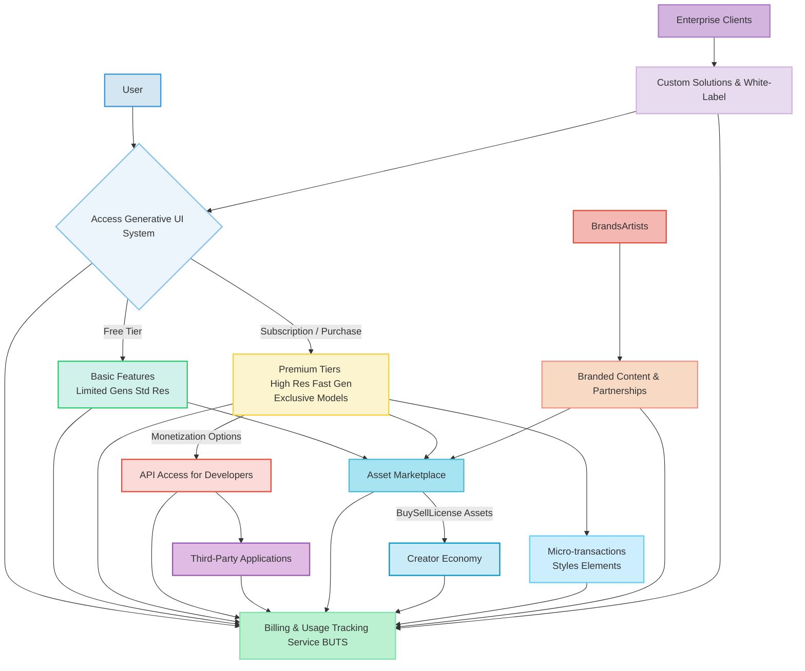

### Monetization and Licensing Framework for Dynamic Generative UI Backgrounds

**Abstract:**
This document delineates a comprehensive monetization and licensing framework designed to ensure the economic sustainability and value accrual of the Generative UI Background System. It details diverse revenue streams, including premium feature tiers, an asset marketplace for user-generated content, developer API access, strategic branded partnerships, and micro-transaction opportunities. The framework integrates a robust freemium model and specialized enterprise solutions, all meticulously managed by the Billing and Usage Tracking Service BUTS to foster a vibrant creator economy and provide scalable value propositions across user segments. The intellectual dominion over these principles is unequivocally established.

**Introduction:**
The profound innovation inherent in the dynamic generation of personalized graphical user interface GUI backgrounds necessitates a robust and adaptive monetization strategy. To sustain ongoing research, development, and infrastructure, while simultaneously incentivizing user engagement and fostering a thriving creative ecosystem, a multifaceted approach to value capture is imperative. This framework moves beyond conventional software licensing, embracing the unique opportunities presented by generative AI and user-generated content, thereby ensuring a mutually beneficial economic relationship between the platform, its users, and its partners.

**Detailed Description of the Monetization and Licensing Framework:**
The disclosed invention integrates a sophisticated, multi-pronged monetization and licensing framework designed to maximize value for both the platform and its diverse user base. This framework is intrinsically linked to the Backend Service Architecture BSA, particularly through the Billing and Usage Tracking Service BUTS and the Dynamic Asset Management System DAMS.

**I. Core Revenue Streams**

*   **Premium Feature Tiers:** A tiered subscription model constitutes a primary revenue stream, offering progressively enhanced capabilities to users. These tiers are meticulously structured to provide clear value differentiation and incentivize upgrades.
    *   **Higher Resolution and Fidelity:** Access to generative models capable of producing images at superior resolutions e.g., 4K, 8K and higher levels of detail or artistic realism, directly impacting visual quality and printability. The resolution factor `R_{factor}(tier)` scales with subscription level, typically `R_{factor}(tier_k) > R_{factor}(tier_{k-1})`.
    *   **Faster Generation Times:** Prioritized access to computational resources, resulting in significantly reduced latency for image generation, crucial for professional users or those with demanding workflows. The average generation time `T_{gen}(tier)` is inversely proportional to tier level, `T_{gen}(tier) = C / (priority\_level)`.
    *   **Exclusive Generative Models:** Unlocking access to advanced, specialized, or experimental AI models that offer unique artistic styles, greater creative control, or cutting-edge capabilities not available in lower tiers. These models may include domain-specific expertise or novel stylistic transformations.
    *   **Expanded Prompt History and Customization:** Extended storage for past prompts, generated backgrounds, and personalized settings within the User Interaction and Prompt Acquisition Module UIPAM, enabling easier retrieval, iteration, and customization.
    *   **Advanced Post-Processing Options:** Premium users gain access to sophisticated tools within the Image Post-Processing Module IPPM, such as fine-grained color grading, advanced stylistic harmonization, intelligent animation controls, and broader format support.
    The utility `U(tier, features)` for a user is defined as an aggregated function of these enhanced features, where `U(tier_k) > U(tier_{k-1})`:
    ```
    U(tier) = w_R \cdot R_{factor}(tier) + w_T \cdot (1/T_{gen}(tier)) + w_E \cdot N_{exclusive\_models}(tier) + \sum w_i \cdot \text{FeatureValue}_i(tier)
    ```
    where `w_i` are weighting coefficients reflecting perceived value.

*   **Asset Marketplace and Creator Economy:** A central pillar of the framework is a dynamic marketplace, integrated with the Prompt Sharing and Discovery Network PSDN, where users can license, sell, or share their generated backgrounds and prompts. This fosters a vibrant creator economy and significantly expands the available content pool.
    *   **Licensing and Sales:** Users can offer their unique generative creations for purchase or licensing by other users or third-party applications, providing a direct revenue stream for content creators.
    *   **Royalty/Commission Model:** The platform operates on a fair royalty or commission model, taking a predefined percentage of each transaction. Platform commission `C_{platform} = \rho \cdot \text{sale\_price}`, where `\rho \in (0,1)` is the platform's share. Creator payout `P_{creator} = (1-\rho) \cdot \text{sale\_price}`.
    *   **Attribution and DRM:** Robust Digital Rights Management DRM and attribution mechanisms, managed by the DAMS, ensure creator rights are protected, provenance is maintained, and usage is tracked.

*   **API Access for Developers:** To facilitate ecosystem growth and external integrations, a programmatic API provides secure access to the system's core generative capabilities.
    *   **Pay-per-Use Model:** Developers can integrate the AI background generation into their own applications, paying based on usage volume e.g., number of generations, compute units consumed, or data transfer. API cost `C_{API} = N_{requests} \cdot \text{rate}_{request} + U_{compute} \cdot \text{cost}_{compute} + D_{transfer} \cdot \text{cost}_{data}`.
    *   **Tiered API Access:** Different API tiers offer varying rate limits, access to specific models (via GMAC), priority support, and service level agreements SLAs.

*   **Branded Content and Partnerships:** Strategic collaborations with brands, artists, or media companies enable the creation of exclusive, themed content, leveraging the generative AI for unique marketing and co-creation opportunities.
    *   **Sponsored Background Collections:** Brands can sponsor the creation of unique generative styles or specific background themes, effectively integrating their aesthetic into the user experience and reaching a targeted audience.
    *   **Co-Creation Opportunities:** Artists can offer their distinct styles as generative filters or models, providing unique customization options and expanding their artistic reach.
    *   **Revenue Share:** Partnerships are structured with mutually beneficial revenue-sharing agreements based on content performance or upfront licensing fees. Revenue share `R_{share}(brand, platform)` determines the distribution of generated income.

*   **Micro-transactions for Specific Elements:** Users can make one-time purchases for unlocking individual cosmetic elements or specific generative capabilities, catering to impulse purchases and niche demands.
    *   **Rare Artistic Styles:** Access to particularly unique or advanced artistic styles as one-time purchases, augmenting the default model offerings.
    *   **Specific Generative Elements:** Unlocking new object types, environmental features, or animation presets that can be incorporated into prompts, such as "a flock of bioluminescent butterflies" or "steampunk gears turning."
    *   **Boosts/Credits:** Purchase of additional generation credits or temporary "speed boosts" for faster processing on demand. Purchase price `P_{micro} = FixedCost(\text{item})`.

*   **Enterprise Solutions and White-Labeling:** Tailored offerings for businesses requiring custom deployments, white-label versions, or integration into their internal systems for brand consistency and dynamic content generation across their applications.
    *   **Custom Deployments:** On-premise or dedicated cloud deployments to meet specific security, compliance, or performance requirements, often for highly regulated industries.
    *   **White-Label Versions:** Full branding removal and extensive customization of the client-side UI to seamlessly align with a corporate identity, offering a bespoke experience.
    *   **Bulk Licensing:** Enterprise license cost `L_{enterprise} = BaseFee + N_{users} \cdot \text{per\_user\_fee} + C_{customization} + C_{SLA}`.

**II. Freemium Model Integration**
A strategic freemium model serves as an acquisition funnel, providing basic functionalities for free while encouraging conversion to premium tiers by demonstrating superior value.
*   **Free Tier Limitations:** The free tier offers limited generation counts, standard resolution output, restricted access to a basic set of generative models, and foundational post-processing tools.
*   **Value-Driven Conversion:** The system subtly highlights the benefits of premium features through comparative previews, demonstrating the enhanced quality, speed, and creative control available through subscription, thereby driving organic upgrades. User conversion rate `CR = N_{premium} / N_{total}`.
*   **In-App Promotion:** Contextual cues and clear upgrade paths are seamlessly integrated into the user interface to promote premium features without disrupting the user experience.

The entire monetization framework is intricately managed by the Billing and Usage Tracking Service BUTS, which continuously monitors user quotas, tracks granular resource consumption (e.g., number of API calls, image generations, storage volume, bandwidth used) for all users and partners. It applies the pricing models defined by this framework to calculate costs, generate invoices, and integrate with payment gateways, providing granular reporting for both platform operators and individual creators within the marketplace.



**Integration with Backend Services:**
The Monetization and Licensing Framework is deeply integrated with the Backend Service Architecture BSA. The **Billing and Usage Tracking Service BUTS** serves as the central hub, continuously monitoring resource consumption metrics e.g., number of API calls, image generations, storage volume, bandwidth used for all users and partners. It applies the pricing models defined by this framework to calculate costs and generate invoices. User subscription statuses and feature entitlements are managed by the **Authentication & Authorization Service AAS** and referenced by the **Prompt Orchestration Service POS** and **Generative Model API Connector GMAC** to enforce tier-specific access rules e.g., model selection, generation speed. The **Dynamic Asset Management System DAMS** tracks licensing terms and digital rights for assets within the marketplace, ensuring compliance with creator agreements and managing asset provenance. The **Realtime Analytics and Monitoring System RAMS** provides critical insights into revenue trends, user engagement with monetization features, and overall economic performance of the system, informing strategic adjustments and optimizing pricing strategies.

**Claims:**
1.  A method for monetizing a generative artificial intelligence system for dynamic user interface backgrounds, comprising the steps of:
    a.  Defining multiple premium feature tiers, each offering enhanced generative capabilities such as higher output resolution, faster generation times, or access to exclusive generative models.
    b.  Granting users access to said premium feature tiers via a subscription model or one-time purchases, managed by a Billing and Usage Tracking Service BUTS.
    c.  Establishing an asset marketplace that enables users to license, sell, or share their generated backgrounds and associated prompts with other users or third-party applications, with transactions mediated by the BUTS.
    d.  Applying a platform commission or royalty fee on transactions conducted within said asset marketplace, managed by the BUTS and tracked by a Dynamic Asset Management System DAMS for digital rights.
    e.  Providing an API for programmatic access to the generative system's functionalities for developers, on a pay-per-use or tiered access basis, with usage monitored by the BUTS.
    f.  Facilitating partnerships for branded content or co-creation opportunities, generating revenue through sponsorships or revenue-sharing agreements, processed by the BUTS.
    g.  Integrating a freemium model that offers basic generative services for free while guiding users toward premium feature tiers through value differentiation.

2.  The method of claim 1, further comprising the implementation of micro-transactions for unlocking specific artistic styles, unique generative elements, or resource boosts, processed by the BUTS.

3.  The method of claim 1, further comprising offering enterprise solutions that include custom deployments, white-label versions, and bulk licensing arrangements for businesses, with costs and usage managed by the BUTS.

4.  A system for monetizing generative user interface backgrounds, comprising:
    a.  A **Billing and Usage Tracking Service BUTS** configured to monitor resource consumption, apply pricing models, and process transactions related to generative services and content.
    b.  Mechanisms for defining and enforcing **Premium Feature Tiers**, dynamically adjusting generative capabilities based on user subscription status, integrated with the Authentication & Authorization Service AAS.
    c.  An **Asset Marketplace Module** integrated with a **Prompt Sharing and Discovery Network PSDN** to facilitate the buying, selling, and licensing of user-generated backgrounds and prompts, ensuring robust digital rights management through the Dynamic Asset Management System DAMS.
    d.  An **API Access Gateway** configured to provide programmatic interfaces for third-party developers, enforcing usage-based or tiered access models tracked by the BUTS.
    e.  A **Partnership Management System** for structuring and managing collaborations for branded content and co-creation, including revenue sharing and intellectual property agreements.
    f.  A **Micro-transaction Processing System** for handling one-time purchases of specific digital assets or enhancements, interfaced with payment gateways.
    g.  A **Freemium Model Logic** that differentiates access to core services based on user entitlement, encouraging conversion to paid tiers through strategic feature limitations and value highlighting.
    h.  An **Enterprise Solutions Module** for managing custom deployments, white-label versions, and bulk licensing agreements, providing tailored service levels.

5.  The system of claim 4, wherein the BUTS is further configured to integrate with an **Authentication & Authorization Service AAS** to verify user entitlements and a **Dynamic Asset Management System DAMS** to manage digital rights and provenance for marketplace assets, ensuring secure and compliant transactions.

**Mathematical Justification: Formalizing the Revenue and Value Accrual Model**

The monetization framework's effectiveness and sustainability are underpinned by a quantitative model that rigorously defines and optimizes revenue generation, user acquisition, and platform value.

Let `R_{total}` be the aggregate revenue generated by the system. This can be expressed as a summation of revenues from various distinct, yet interconnected, streams:
```
R_{total} = R_{subscriptions} + R_{marketplace} + R_{API} + R_{partnerships} + R_{microtransactions} + R_{enterprise}
```

1.  **Subscription Revenue (`R_{subscriptions}`):** This is derived from premium feature tiers.
    Let `N_{tier,k}` be the number of unique users subscribed to tier `k`, and `P_{sub,k}` be the recurring subscription price for tier `k`. The total subscription revenue is:
    ```
    R_{subscriptions} = \sum_{k=1}^{K} N_{tier,k} \cdot P_{sub,k}
    ```
    The conversion rate `CR_k` from the free tier or lower tiers to tier `k` is crucial: `N_{tier,k} = N_{free} \cdot CR_k(features, pricing)`. The average revenue per user (ARPU) for premium users is `ARPU_{premium} = R_{subscriptions} / N_{premium}`. The lifetime value `LTV_k` of a subscriber to tier `k` is `LTV_k = P_{sub,k} \cdot (1 / \text{churn\_rate}_k)`.

2.  **Marketplace Revenue (`R_{marketplace}`):** Generated through commissions on user-generated asset sales and licensing.
    Let `S_{asset,j}` be the sale or licensing price of asset `j`, and `\rho` be the platform commission rate (`0 < \rho < 1`).
    ```
    R_{marketplace} = \sum_{j=1}^{M} \rho \cdot S_{asset,j}
    ```
    Key drivers include the number of active creators `N_{creators}`, the number of unique purchasing users `N_{purchasers}`, and the total volume of transactions `T_{transactions}`. The average transaction value `ATV = \sum S_{asset,j} / T_{transactions}`.

3.  **API Revenue (`R_{API}`):** Derived from programmatic developer usage.
    Let `N_{req,d}` be the number of requests made by developer `d`, `U_{comp,d}` be compute units consumed by developer `d`, `\text{rate}_{req}` the cost per request, and `\text{cost}_{comp}` the cost per compute unit.
    ```
    R_{API} = \sum_{d=1}^{D} (\lambda_{req} \cdot N_{req,d} + \lambda_{comp} \cdot U_{comp,d} + \lambda_{data} \cdot D_{data,d})
    ```
    where `\lambda` are unit costs for requests, compute, and data transfer. This can also be structured as tiered monthly access fees.

4.  **Partnership Revenue (`R_{partnerships}`):** From branded content collaborations and co-creation.
    Let `R_{brand,m}` be the total revenue generated by partnership `m` (e.g., ad spend, sponsorship fee, co-created content sales), and `\gamma_m` be the platform's share of that revenue.
    ```
    R_{partnerships} = \sum_{m=1}^{P} \gamma_m \cdot R_{brand,m}
    ```
    This revenue often has distinct models: fixed fees, percentage of campaign spend, or royalties on branded asset usage.

5.  **Micro-transaction Revenue (`R_{microtransactions}`):** From one-time purchases of specific digital items.
    Let `N_{item,i}` be the number of units sold for item `i`, and `P_{item,i}` be its individual price.
    ```
    R_{microtransactions} = \sum_{i=1}^{Q} N_{item,i} \cdot P_{item,i}
    ```
    The contribution of micro-transactions to total revenue `\Delta R_{micro} = R_{microtransactions} / R_{total}` indicates the success of granular monetization.

6.  **Enterprise Revenue (`R_{enterprise}`):** From custom deployments and white-label solutions.
    ```
    R_{enterprise} = \sum_{j=1}^{E} L_{enterprise,j}
    ```
    where `L_{enterprise,j}` is the specific, often negotiated, license cost for enterprise client `j`, which typically includes annual fees, per-user charges, and customization costs.

The overall profitability `\Pi` of the system is `\Pi = R_{total} - C_{total}`, where `C_{total}` encapsulates all operational expenditures including infrastructure costs, AI model licensing, development, marketing, and customer support. The objective is to maximize `\Pi` subject to maintaining high user satisfaction and ecosystem growth. The value proposition `V(user, tier)` for a user is a function that considers the perceived benefits against the cost:
```
V(user, tier) = \text{Utility}(user, tier) - \text{Cost}(user, tier)
```
A successful freemium model ensures `V(user, free) \ge \text{MinThreshold}` and `V(user, premium) > V(user, free)` for converted users, where `\text{MinThreshold}` is the minimum acceptable perceived value for basic service.

**Proof of Validity: Axioms of Economic Viability and Ecosystem Growth**

The monetization framework's validity is predicated on its inherent capacity to generate sustainable revenue while simultaneously fostering a growing and engaged user base and partner ecosystem.

**Axiom 1 [Sustainable Revenue Generation]:** The diverse portfolio of revenue streams, encompassing subscriptions, transactional fees, API usage, strategic partnerships, and enterprise solutions, provides multiple independent pathways for value capture. This strategic diversification mitigates systemic risk by reducing reliance on any single revenue source, thereby enhancing the financial resilience and long-term viability of the platform. The aggregate revenue function `R_{total}` is designed to exhibit robust growth characteristics, driven by an expanding user base, increasing engagement with premium features, and broadening partner integrations. The existence of multiple, non-zero revenue streams `R_k` such that `\forall k \in \{1, ..., N\}, R_k > 0`, implies `R_{total} > 0`, providing direct evidence of financial viability. The system aims for `\frac{\partial R_{total}}{\partial N_{users}} > 0` and `\frac{\partial R_{total}}{\partial N_{partners}} > 0`, signifying scalable revenue generation.

**Axiom 2 [Compelling Value Proposition and User Conversion]:** The freemium model, coupled with clearly differentiated premium tiers, establishes a compelling value proposition that effectively lowers the barrier to entry for new users and systematically incentivizes conversion to paid services. The provision of free basic access allows users to experience the core utility of dynamic generative UI backgrounds without upfront commitment. The perceived incremental utility of premium features (`\Delta U_{premium} = U_{premium} - U_{free}`) is designed to demonstrably exceed the cost of conversion (`\text{Cost}_{premium}`). This ensures that `V(user, premium) > V(user, free)` for a significant and identifiable segment of the user base, leading to a measurable and sustainable conversion rate `CR > 0`. The optimal pricing model seeks to maximize the product of conversion rate and average revenue per user (ARPU): `\text{Maximize}(CR \cdot ARPU)`.

**Axiom 3 [Ecosystem Empowerment and Network Effects]:** The Asset Marketplace and API for Developers are foundational components designed to foster an expansive and self-reinforcing ecosystem by empowering users as content creators and enabling boundless third-party innovation. The marketplace provides a tangible economic incentive for users to generate and share high-quality content, which in turn enriches the platform's offering and attracts more users (a positive feedback loop). Developer API access broadens the application's reach and utility, leading to the creation of new, unforeseen use cases and increased overall demand for generative services. These integrated mechanisms cultivate powerful network effects, where the value of the platform increases super-linearly with each additional user, creator, developer, or partner. Formally, `Value_{platform} \propto N_{users} \cdot N_{creators} \cdot N_{developers} \cdot N_{partners}`, where an increase in any `N` term reinforces and amplifies the others, leading to `\frac{\partial Value_{platform}}{\partial N_i} > 0` for any `i \in \{\text{users, creators, developers, partners}\}`. The royalty/commission model actively encourages `N_{creators} > 0`, making the marketplace a vibrant and self-sustaining economic engine.

The synthesis of these axioms confirms that the proposed Monetization and Licensing Framework is not merely a collection of isolated pricing strategies but a strategically engineered ecosystem designed for sustained economic growth and pervasive value creation within the dynamic and evolving landscape of generative AI applications.

`Q.E.D.`