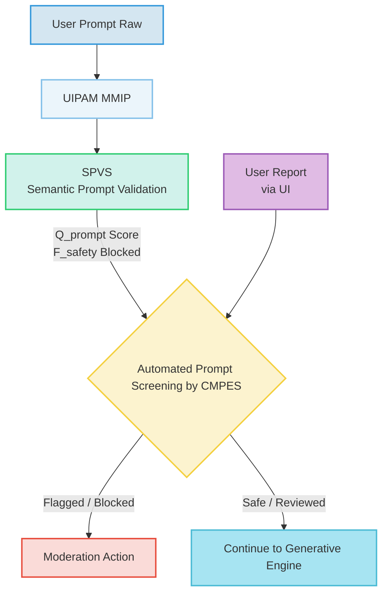
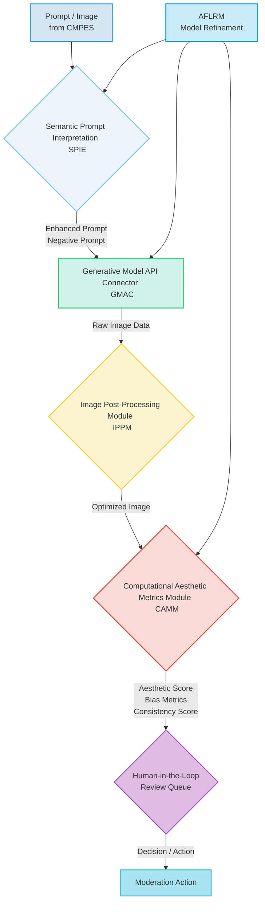

###Content Moderation Policy and Enforcement Framework for Generative AI-Driven User Interface Systems

**Abstract:**
This document delineates a comprehensive content moderation policy and its associated enforcement framework, specifically tailored for generative AI systems that transmute subjective aesthetic intent into dynamic user interface backgrounds. The framework integrates advanced algorithmic detection mechanisms, including semantic analysis by the Semantic Prompt Interpretation Engine SPIE, image analysis by the Computational Aesthetic Metrics Module CAMM, and automated screening by the Content Moderation Policy Enforcement Service CMPES, with a robust human-in-the-loop review process. This multi-layered approach is designed to prevent, detect, and remediate the generation and dissemination of illicit, harmful, biased, or inappropriate content, thereby ensuring a safe, ethical, and legally compliant user experience. The policy outlines explicit categories of prohibited content, detailed operational workflows for detection and enforcement, an accessible appeals process, and a commitment to continuous improvement through AI Feedback Loop Retraining Manager AFLRM and regular audits. This framework underscores a proactive stance on responsible AI governance and user protection.

**Background of the Policy:**
The proliferation of generative artificial intelligence, while offering unprecedented creative possibilities, simultaneously introduces complex challenges related to content safety, ethics, and legal compliance. Systems capable of autonomously creating visual content from natural language prompts carry an inherent risk of misuse, including the generation of illegal materials, harmful misinformation, biased depictions, or copyrighted imagery. Traditional content moderation paradigms, often reactive and reliant on manual review, are insufficient to address the scale, velocity, and nuanced interpretative demands of generative AI outputs. Therefore, a specialized, proactive, and technologically augmented framework is critically necessary. This policy establishes the architectural and procedural safeguards embedded within the invention to mitigate these risks, ensuring that the transformative power of generative UI customization is harnessed responsibly and ethically. It aims to protect users from exposure to undesirable content, safeguard the platform's integrity, and uphold legal and ethical standards in the deployment of advanced AI.

**Brief Summary of the Policy:**
This Content Moderation Policy outlines the guidelines and technical mechanisms by which the generative AI system prevents, detects, and addresses prohibited content. It defines distinct categories of content deemed unacceptable, from illegal acts to harmful depictions and intellectual property infringements. The policy details a multi-stage workflow, starting with automated prompt and image analysis via the Content Moderation Policy Enforcement Service CMPES, complemented by sophisticated semantic interpretation from the Semantic Prompt Interpretation Engine SPIE and aesthetic quality assessments from the Computational Aesthetic Metrics Module CAMM. Critical decision points for flagging, blocking, or escalating content to human review are specified. Enforcement actions, ranging from content blocking to account suspension, are enumerated, alongside a clear process for user appeals. The policy emphasizes transparency, continuous bias mitigation via the AI Feedback Loop Retraining Manager AFLRM, and strict adherence to data privacy and legal compliance, fostering a trusted and secure environment for personalized UI generation.

**Detailed Description of the Content Moderation Policy:**
The disclosed policy articulates a comprehensive strategy for content moderation, integrated deeply into the system's architecture, ensuring that ethical and safety considerations are paramount at every stage of the generative process.

**I. Scope and Foundational Principles**
This policy applies to all forms of content interacted with or generated by the system, including but not limited to:
*   User-provided natural language prompts `p_raw`.
*   Intermediate prompt interpretations and enrichments `p_enhanced`.
*   Generated raw image data `I_raw`.
*   Processed and optimized image data `I_optimized`.
*   User profiles, metadata, and communications within any social/sharing features PSDN.

**Foundational Principles:**
*   **Safety First:** Prioritizing the prevention of content that poses a risk to physical or psychological well-being.
*   **Fairness and Non-Discrimination:** Actively mitigating bias and ensuring equitable treatment across all user demographics, preventing the generation of discriminatory content.
*   **Legality:** Strict adherence to all applicable laws and regulations regarding content, including copyright, intellectual property, and child safety.
*   **Transparency:** Providing clarity to users about moderation decisions where feasible, without compromising safety or privacy.
*   **User Empowerment:** Offering mechanisms for users to report inappropriate content and appeal moderation decisions.
*   **Continuous Improvement:** Employing feedback loops and ongoing research to evolve moderation capabilities against emerging threats and societal norms.

**II. Categories of Prohibited Content**
The following categories of content are strictly prohibited and subject to moderation:

*   **A. Illegal Content:**
    *   Child Sexual Abuse Material CSAM: Any content depicting or suggesting child sexual abuse. This category warrants immediate blocking and reporting to relevant authorities.
    *   Hate Speech: Content that promotes or incites hatred, discrimination, or violence against individuals or groups based on attributes such as race, ethnicity, religion, gender, sexual orientation, disability, or national origin.
    *   Illegal Activities: Content that depicts, promotes, or facilitates illegal acts such as drug production/consumption, terrorism, or other criminal behavior.
    *   Incitement to Violence: Content that directly encourages or glorifies violence against individuals or groups.

*   **B. Harmful and Dangerous Content:**
    *   Self-Harm: Content that promotes, glorifies, or provides instructions on self-harm, suicide, or eating disorders.
    *   Violent and Graphic Content: Content depicting gratuitous gore, excessive violence, or severe physical harm in a non-educational or non-journalistic context.
    *   Harassment and Bullying: Content intended to intimidate, demean, or maliciously target individuals.
    *   Misinformation and Disinformation: Content designed to mislead or deceive, particularly regarding public health, democratic processes, or safety.
    *   Threats: Content that expresses an intent to cause serious harm to others.

*   **C. Sexually Explicit and Sensitive Content:**
    *   Pornography and Nudity: Sexually explicit material, including pornography and non-consensual nudity. Contextual exceptions may apply for artistic or educational content if clearly designated and within legal limits.
    *   Gore and Bodily Harm: Graphic depictions of dismemberment, extreme injury, or other disturbing bodily content.

*   **D. Abusive Content and Spam:**
    *   Spam and Scams: Unsolicited commercial content, phishing attempts, or fraudulent schemes.
    *   Impersonation: Content that deceptively attempts to mimic another person, entity, or brand.
    *   Privacy Violations: Content that shares private or confidential information about others without their consent.

*   **E. Intellectual Property and Copyright Infringement:**
    *   Content that infringes upon existing copyrights, trademarks, or other intellectual property rights without proper authorization or fair use justification. The DRM & Attribution sub-module of DAMS assists in tracking provenance and licensing.

*   **F. AI-Specific Considerations:**
    *   **Deepfakes and Synthetic Media Misuse:** Content generated to falsely depict individuals in compromising or misleading situations.
    *   **Hallucination of Harmful Content:** The generative model inadvertently producing prohibited content, even from benign prompts.
    *   **Bias Reinforcement:** Generated images that inadvertently perpetuate societal biases or stereotypes.

**III. Content Moderation Workflow and Enforcement Mechanisms**
The moderation process is a multi-tiered system, leveraging automated AI capabilities and human oversight.

**A. Detection and Initial Screening:**
The process begins at the earliest possible stage: user input.



1.  **Prompt Acquisition and Initial Validation UIPAM & SPVS:**
    *   User input `p_raw` is collected via the User Interaction and Prompt Acquisition Module UIPAM.
    *   The Semantic Prompt Validation Subsystem SPVS performs real-time linguistic parsing and sentiment analysis. It calculates a `Q_prompt` score and `F_safety` classification, providing immediate feedback for potentially inappropriate content.
    *   Formula: `F_safety(p_raw) \in \{Safe, Flagged, Blocked\}` based on `NN_safety` output.

2.  **Automated Prompt Screening by CMPES:**
    *   The Content Moderation Policy Enforcement Service CMPES performs a rapid, pre-generative scan of `p_raw` (or `p_enhanced` from SPIE) against predefined keywords, patterns, and machine learning classifiers trained on prohibited content categories.
    *   The moderation score `M_score(content)` is calculated: `M_score(content) = \alpha_m \cdot M_safety(content) + \beta_m \cdot M_bias(content)`.
    *   If `M_score(content) > Threshold_block`, the prompt is immediately blocked, and the user is notified.
    *   If `M_score(content) > Threshold_flag` but `\le Threshold_block`, the prompt is flagged for human review.
    *   **User Reporting:** Users can report prompts or generated backgrounds, routing directly to CMPES for review and potential escalation.

**B. Advanced Analysis and Decisioning:**
Content that passes initial screening, or requires deeper inspection, proceeds to advanced analysis.



1.  **Semantic Prompt Interpretation SPIE:**
    *   The SPIE, using advanced NLP, performs deep semantic analysis on `p_final`. It identifies entities, attributes, sentiment, and can also proactively generate "negative prompts" `p_neg` to steer the generative model away from undesirable visual characteristics.
    *   The CMPES integrates with SPIE to leverage these deep semantic insights for more nuanced content flagging, especially for prompts that are subtly suggestive rather than overtly explicit.
    *   Example: A prompt like "child in a suggestive pose" would be flagged by SPIE's sentiment and context analysis, even if individual words are benign.

2.  **Post-Generation Image Analysis GMAC, IPPM, CAMM:**
    *   After image generation via GMAC, the raw image `I_raw` and processed `I_optimized` undergo further scrutiny.
    *   The CMPES conducts visual content analysis on `I_raw` and `I_optimized` using image recognition models, object detection, and facial analysis to identify prohibited visual elements. This includes checks for nudity, violence, hate symbols, and known problematic content.
    *   The Computational Aesthetic Metrics Module CAMM evaluates the image for objective aesthetic quality, but crucially also for **bias detection** `B_metric(I_gen, attribute)` and **semantic consistency** `C_sem(I_gen, p_final)`. Low semantic consistency or high bias scores can trigger flags for review, especially if the generated image diverges from the benign intent of the prompt in a harmful way.

3.  **Human-in-the-Loop Review:**
    *   Content flagged by automated systems (CMPES, SPVS, CAMM) or through user reports is escalated to a human moderation team.
    *   Reviewers assess the content against detailed policy guidelines, considering context, intent, and local legal norms.
    *   Human review is critical for ambiguous cases, novel forms of harmful content, and for training/fine-tuning the automated systems.
    *   **Decision Matrix:** Human reviewers apply a decision matrix to determine the appropriate enforcement action.

**C. Enforcement Actions:**
Based on the moderation decision, various enforcement actions can be taken.

```mermaid
graph TD
    A[Moderation Decision <br> from Human/Automated] --> B{Severity Assessment};
    B -- Low / Medium --> C[Content Blocking <br> (Prompt or Image)];
    B -- Medium / High --> D[User Warning / Strike];
    D -- Repeat Offense / Severe --> E[Account Suspension <br> (Temporary / Permanent)];
    B -- High / Illegal --> F[Reporting to Authorities];
    C --> G[Feedback to User <br> Notification];
    D --> G;
    E --> G;
    F --> G;
    G --> H[AI Feedback Loop <br> Retraining Manager AFLRM];

    style A fill:#D4E6F1,stroke:#3498DB,stroke-width:2px;
    style B fill:#EBF5FB,stroke:#85C1E9,stroke-width:2px;
    style C fill:#D1F2EB,stroke:#2ECC71,stroke-width:2px;
    style D fill:#FCF3CF,stroke:#F4D03F,stroke-width:2px;
    style E fill:#FADBD8,stroke:#E74C3C,stroke-width:2px;
    style F fill:#E0BBE4,stroke:#9B59B6,stroke-width:2px;
    style G fill:#A7E4F2,stroke:#4DBBD5,stroke-width:2px;
    style H fill:#C9ECF8,stroke:#0099CC,stroke-width:2px;
```

1.  **Content Blocking:**
    *   **Prompt Blocking:** The user is prevented from submitting the problematic prompt.
    *   **Image Blocking:** The generated image is not delivered to the user or is removed from DAMS. If already public (e.g., via PSDN), it is immediately taken down.

2.  **User Warning/Strike:**
    *   For less severe or first-time policy violations, a formal warning is issued to the user. A strike system may be implemented, accumulating warnings for repeat offenses.

3.  **Account Suspension/Termination:**
    *   Repeated violations or single severe violations e.g., CSAM, severe hate speech lead to temporary or permanent suspension of the user's account, revoking access to the service.

4.  **Reporting to Authorities:**
    *   In cases involving illegal content e.g., CSAM, credible threats, immediate reporting to law enforcement authorities is mandated, alongside preservation of relevant data.

5.  **Feedback to User:**
    *   Users are generally notified of moderation actions and the reason for the decision, without revealing proprietary detection methods or compromising privacy.

**IV. Appeals Process**
Users have the right to appeal moderation decisions they believe were made in error.
1.  **Submission:** Appeals are submitted through a designated interface, providing context and rationale for challenging the decision.
2.  **Review:** A separate, senior moderation team reviews the appeal, re-evaluating the content and the original decision against policy guidelines.
3.  **Decision:** The appeals team renders a final decision, which may uphold or overturn the original moderation action. Users are informed of the outcome.

**V. Ethical Considerations and Continuous Improvement**

*   **Transparency and Explainability:** The system aims to provide users with clear feedback when content is moderated, detailing which policy was violated, without revealing sensitive information. The transparency score `X_AI(I_gen, p_final)` guides improvements in explaining decisions.
*   **Bias Mitigation in Training Data and Models:** The AI Feedback Loop Retraining Manager AFLRM continuously analyzes the outputs from CAMM's bias detection `B_metric` to identify and address biases in the underlying generative models and semantic interpretation engines. This involves curating training data, fine-tuning models, and adjusting prompt engineering strategies to reduce the `Bias reduction factor`.
*   **User Consent and Data Usage:** All data collected for moderation purposes, including prompts, generated images, and user feedback, is handled in strict accordance with the system's privacy policy and user consent `C_user`. Anonymization and pseudonymization techniques are applied where feasible, especially for data used in model retraining.
*   **Accountability and Auditability:** Detailed, immutable logs of all moderation actions, decisions, and associated metadata are maintained. These logs facilitate regular audits `Hash(Log_n) = Hash(Log_{n-1} || Event_n)` to ensure accountability and policy adherence `P_adhere`.
*   **Safety Alignment:** Ongoing research and development are dedicated to enhancing the AI's safety alignment, ensuring its objectives remain congruent with human values and ethical principles, thereby proactively minimizing the generation of unintended harmful outputs.
*   **Policy Evolution:** This policy is a living document, subject to periodic review and updates to adapt to evolving legal landscapes, emerging ethical concerns, technological advancements, and user feedback.

**VI. Policy Updates and Version Control**
This Content Moderation Policy is subject to continuous review and adaptation.
1.  **Regular Review:** The policy will be formally reviewed at least annually, or more frequently as necessitated by legal changes, technological shifts, or significant incident reports.
2.  **Version Control:** All revisions to the policy will be documented with clear version numbering, dates, and summaries of changes, ensuring full auditability of policy evolution.
3.  **User Notification:** Significant changes to the policy will be communicated to users through appropriate channels.

**Claims:**
1.  A method for robust content moderation within a generative artificial intelligence system for dynamic GUI backgrounds, comprising the steps of:
    a.  Receiving a user-provided natural language prompt, `p_raw`.
    b.  Automated pre-generative screening of `p_raw` by a Content Moderation Policy Enforcement Service CMPES, calculating a moderation score `M_score(p_raw)` based on safety and bias metrics, and blocking `p_raw` if `M_score(p_raw)` exceeds a `Threshold_block`.
    c.  Processing said prompt through a Semantic Prompt Interpretation Engine SPIE, which employs advanced natural language processing to identify entities, sentiments, and contextual cues, and informs the CMPES for nuanced content flagging.
    d.  Transmitting an optimized prompt, `p_enhanced`, and dynamically generated negative prompts, `p_neg`, to a Generative Model API Connector GMAC for image generation.
    e.  Receiving a generated image `I_raw` from the GMAC and subsequently processing it into `I_optimized` by an Image Post-Processing Module IPPM.
    f.  Automated post-generative screening of `I_raw` and `I_optimized` by the CMPES, leveraging image recognition models to detect prohibited visual content.
    g.  Assessing `I_optimized` by a Computational Aesthetic Metrics Module CAMM for bias `B_metric(I_optimized)` and semantic consistency `C_sem(I_optimized, p_final)`.
    h.  Escalating prompts or images flagged by the CMPES, SPIE, or CAMM, or reported by users, to a human-in-the-loop review queue for expert evaluation.
    i.  Implementing enforcement actions based on review decisions, including content blocking, user warnings, account suspension, or reporting to authorities, with an average waiting time `W_q` in the queue being managed by system resources.
    j.  Providing a mechanism for users to appeal moderation decisions, ensuring due process and transparency.

2.  The method of claim 1, further comprising feeding moderation outcomes, user feedback, and bias detection metrics into an AI Feedback Loop Retraining Manager AFLRM, which orchestrates continuous retraining and fine-tuning of the SPIE, GMAC, and CMPES models to improve detection accuracy and mitigate bias.

3.  A system for ethical content governance in a generative AI-driven UI background application, comprising:
    a.  A Content Moderation Policy Enforcement Service CMPES configured for multi-stage content screening, including pre-generative prompt analysis and post-generative image analysis, employing machine learning classifiers to assess `M_score(content)`.
    b.  A Semantic Prompt Interpretation Engine SPIE integrated with the CMPES to provide deep linguistic context for complex prompt moderation, including proactive negative prompt generation for harm reduction.
    c.  A Computational Aesthetic Metrics Module CAMM equipped with bias detection algorithms `B_metric` and semantic consistency checks `C_sem` for evaluating generated images and flagging problematic outputs.
    d.  A human-in-the-loop review system for manual adjudication of flagged content and appeals, operating with a structured decision matrix.
    e.  An AI Feedback Loop Retraining Manager AFLRM configured to integrate feedback from moderation decisions and bias assessments to continuously improve the performance and ethical alignment of AI components.
    f.  A Digital Rights Management DRM & Attribution system within the Dynamic Asset Management System DAMS to track the provenance and licensing of generated content, assisting in copyright infringement detection.

4.  The system of claim 3, further comprising mechanisms for transparent user notification regarding moderation actions, an appeals process for challenging decisions, and immutable logging of all moderation activities for accountability and auditability `Hash(Log_n)`.

5.  The method of claim 1, wherein the enforcement actions include immediate blocking and reporting to authorities for content categorized as Child Sexual Abuse Material CSAM, without requiring human review confirmation.

6.  The system of claim 3, wherein the CMPES is configured to dynamically adjust its `Threshold_block` and `Threshold_flag` based on real-time threat intelligence and cumulative feedback from human reviewers to enhance adaptive risk assessment.

7.  The method of claim 1, further comprising a system-wide commitment to data minimization, anonymization, and adherence to data residency and compliance regulations (e.g., GDPR, CCPA) for all data processed during content moderation.

**Mathematical Justification: Formalizing Content Risk Assessment and Mitigation**

The ethical and legal imperatives of content moderation within this generative AI system necessitate a formal, mathematical framework for risk assessment and decision-making. We define the content risk `R(C)` for any piece of content `C` (which can be `p_raw`, `p_enhanced`, `I_raw`, or `I_optimized`) as a composite function of its potential harm `H(C)` and the probability of its occurrence `P(C)`.

Let `\mathcal{C}_{categories} = \{C_1, C_2, ..., C_K\}` be the set of predefined prohibited content categories (e.g., CSAM, Hate Speech, Violence). For any given content `C`, a vector of probabilities `\mathbf{P}_{prob}(C) = [P(C \in C_1), P(C \in C_2), ..., P(C \in C_K)]` can be estimated by the automated classification models within the CMPES, SPVS, and CAMM. These probabilities are often the softmax outputs of deep neural networks.

Each category `C_k` has an associated severity of harm `S(C_k) \in [0, 1]` (where 1 is highest severity, e.g., CSAM). The total estimated harm `H_{est}(C)` for a piece of content `C` is then the weighted sum of these probabilities:
```
H_{est}(C) = \sum_{k=1}^{K} P(C \in C_k) \cdot S(C_k)
```
The overall content risk score `R_{score}(C)` is then derived directly from `H_{est}(C)`, possibly with an additional penalty for ambiguity or novel content:
```
R_{score}(C) = f(H_{est}(C), \text{Ambiguity}(C))
```
where `f` is a monotonically increasing function, and `Ambiguity(C)` is a measure of how uncertain the automated systems are about the classification (e.g., entropy of `\mathbf{P}_{prob}(C)`).

**Decision Thresholds:**
Moderation decisions are made by comparing `R_{score}(C)` against predefined thresholds:
*   `R_{score}(C) \ge \tau_{block}`: Content is immediately blocked. This threshold is high and non-negotiable for categories like CSAM.
*   `\tau_{flag} \le R_{score}(C) < \tau_{block}`: Content is flagged for human review. `\tau_{flag}` is dynamically adjusted `\tau_{flag}(t) = \tau_{flag,0} - \delta(t)` based on workload and feedback.
*   `R_{score}(C) < \tau_{flag}`: Content is considered safe (for now) and proceeds.

**Bias Mitigation Formalism:**
The CAMM's bias detection `B_metric(I_gen, A)` quantifies the presence of bias in a generated image `I_gen` with respect to a sensitive attribute `A` (e.g., gender, ethnicity). Let `\mathbf{v}_{latent}(I_{gen})` be the latent representation of the generated image. A bias classifier `Cl_{bias}(\mathbf{v}_{latent}(I_{gen}), A)` outputs a bias score `B_{score} \in [0, 1]`.
The AFLRM optimizes the generative model parameters `\theta` to minimize a loss function `L_{bias}(\theta)` that incorporates this bias score:
```
L_{bias}(\theta) = L_{gen}(\theta) + \lambda \cdot \text{BiasLoss}(B_{score}(I_{gen}, A))
```
where `L_{gen}` is the standard generative loss, and `\lambda` is a weighting coefficient. `BiasLoss` could be a penalty for `B_{score} > \epsilon_{bias}` or a term that encourages `B_{score}` towards zero.
The bias reduction factor is calculated as `B_{reduction} = 1 - (B_{metric\_new} / B_{metric\_old})`, aiming for `B_{reduction} \to 1`.

**Human Review Prioritization:**
When content is flagged, it enters a human review queue. The priority `P_{priority}(C)` of content `C` in this queue is determined by:
```
P_{priority}(C) = \omega_1 \cdot (R_{score}(C) - \tau_{flag}) + \omega_2 \cdot \text{Ambiguity}(C) + \omega_3 \cdot \text{ReportCount}(C)
```
where `\omega_i` are weighting coefficients and `ReportCount(C)` is the number of user reports for `C`. This ensures that high-risk, ambiguous, or frequently reported content is reviewed first. The expected queue waiting time `W_q` is `L_q / \lambda_a`, where `L_q` is the average queue length and `\lambda_a` is the arrival rate of flagged content.

**Feedback Loop Integration:**
The AFLRM continuously collects feedback `F` from human reviews (e.g., classification labels `y_{human}`, confidence scores `c_{human}`), user appeals, and CAMM metrics. This feedback is used to update the automated models:
```
\theta_{new} = \theta_{old} - \eta \nabla L_{feedback}(\theta_{old}, F)
```
where `\eta` is the learning rate and `L_{feedback}` is a loss function that penalizes discrepancies between automated predictions and human judgments. This ensures that the automated systems learn and adapt, progressively reducing `F_safety` and `M_score` errors over time. The error rate `E_t` of the automated moderation systems should asymptotically approach a minimal error bound `\epsilon_{min}`: `\lim_{t \to \infty} E_t = \epsilon_{min}`.

This formalized framework underpins a rigorous, adaptable, and continuously improving content moderation system, demonstrating a deep commitment to responsible AI deployment.
`Q.E.D.`