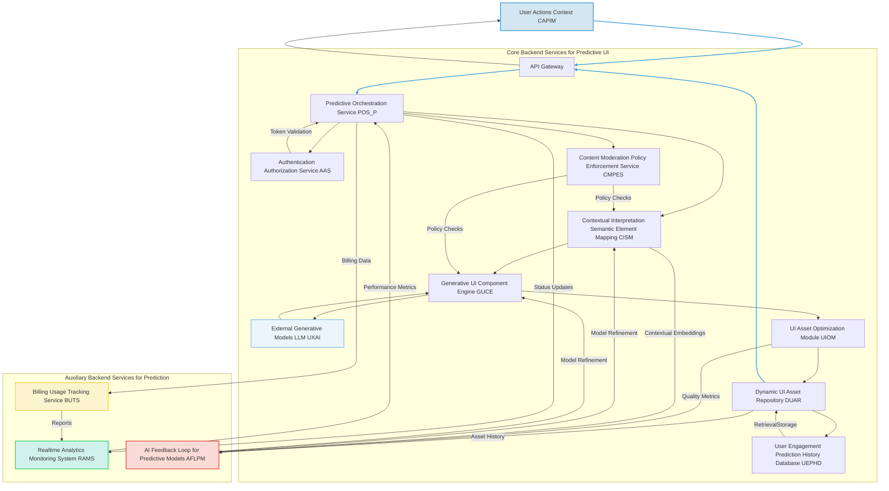
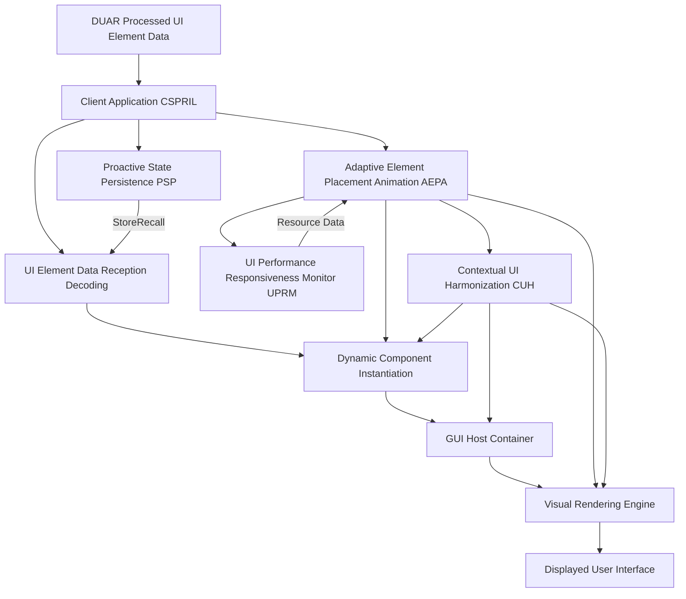
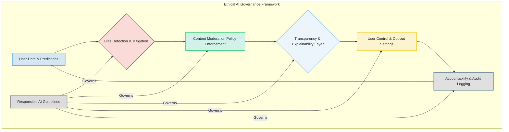

```mermaid
graph TD
    subgraph Security & Privacy Data Flow
        A[Raw Contextual Data] --> B{Data Minimization Filter}
        B --> C[Anonymization / Pseudonymization]
        C --> D[End-to-End Encryption]
        D --> E[API Gateway]
        E --> F{Access Control Enforcement}
        F --> G[Backend Services]
        G --> H[Content Moderation]
        H --> I[Generative AI Models]
        I --> J[Protected Data Stores]
        J -- Audit Logs --> K[Security Audit Monitoring]
    end
    style A fill:#D4E6F1,stroke:#3498DB,stroke-width:2px;
    style B fill:#F5EEF8,stroke:#BB8FCE,stroke-width:2px;
    style C fill:#E8F8F5,stroke:#1ABC9C,stroke-width:2px;
    style D fill:#D1F2EB,stroke:#2ECC71,stroke-width:2px;
    style E fill:#EBF5FB,stroke:#85C1E9,stroke-width:2px;
    style F fill:#FADBD8,stroke:#E74C4C,stroke-width:2px;
    style G fill:#FCF3CF,stroke:#F4D03F,stroke-width:2px;
    style H fill:#FADBD8,stroke:#E74C3C,stroke-width:2px;
    style I fill:#EBF5FB,stroke:#85C1E9,stroke-width:2px;
    style J fill:#D4E6F1,stroke:#3498DB,stroke-width:2px;
    style K fill:#D1F2EB,stroke:#2ECC71,stroke-width:2px;
```

### Comprehensive System and Method for the Predictive and Context-Aware Synthesis of Dynamic User Interface Elements and Views via Generative AI Architectures

**Abstract:**
A profoundly innovative system and method are herein disclosed for the unprecedented proactive adaptation and personalization of graphical user interfaces GUIs. This invention fundamentally redefines the paradigm of human-computer interaction by enabling the direct, real-time anticipation of nuanced user intent and contextual needs, subsequently translating these predictions into novel, high-fidelity, and dynamically presented user interface elements or entire views. The system, leveraging state-of-the-art generative artificial intelligence models and advanced predictive analytics, orchestrates a seamless pipeline: comprehensive contextual data is processed, channeled to a sophisticated predictive engine, and the inferred user intent is then used to synthesize and adaptively integrate relevant UI components. This methodology transcends the limitations of conventional static, reactive interfaces, delivering an infinitely expansive, deeply intuitive, and perpetually responsive user experience that obviates manual navigation and reduces cognitive load by bringing the most relevant functionality to the user precisely when needed. The intellectual dominion over these principles is unequivocally established.

**Background of the Invention:**
The historical trajectory of graphical user interfaces, while advancing in functional complexity, has remained fundamentally constrained by an anachronistic approach to dynamic interaction and personalization. Prior art systems typically present users with a fixed, pre-determined taxonomy of menus, buttons, and forms, requiring explicit user navigation or input to discover and activate functionalities. These conventional methodologies are inherently deficient in anticipating user needs, thereby imposing a significant cognitive burden upon the user. The user is invariably compelled either to possess comprehensive knowledge of the application's hierarchical structure or to undertake an often-laborious search for desired features, frequently culminating in frustration or inefficiency. Such a circumscribed framework fundamentally fails to address the innate human proclivity for efficiency, seamless interaction, and the desire for an exosomatic manifestation of internal subjective task states. Consequently, a profound lacuna exists within the domain of human-computer interface design: a critical imperative for an intelligent system capable of autonomously predicting unique, contextually rich, and functionally relevant interface elements or views, directly derived from the inferred user intent and dynamic environmental factors. This invention precisely and comprehensively addresses this lacuna, presenting a transformative solution.

**Brief Summary of the Invention:**
The present invention unveils a meticulously engineered system that symbiotically integrates advanced generative AI models with sophisticated predictive analytics within an extensible user interface adaptation workflow. The core mechanism involves the continuous acquisition of user context, which serves as the semantic seed for predictive inference. This system robustly and securely propagates this contextual data to a sophisticated AI-powered predictive engine, orchestrating the derivation of anticipated user intent. Subsequently, this predicted intent drives a generative UI component engine to synthesize bespoke, relevant interface elements or views, which are adaptively applied within the graphical user interface. This pioneering approach unlocks an effectively infinite continuum of proactive interaction options, directly translating a user's anticipated needs into tangible, dynamically rendered UI components. The architectural elegance and operational efficacy of this system render it a singular advancement in the field, representing a foundational patentable innovation. The foundational tenets herein articulated are the exclusive domain of the conceiver.

**Detailed Description of the Invention:**
The disclosed invention comprises a highly sophisticated, multi-tiered architecture designed for the robust and real-time prediction, generation, and application of personalized GUI elements and views. The operational flow initiates with continuous context acquisition and culminates in the dynamic transformation of the digital interaction environment.

**I. Context Acquisition and Predictive Inference Module CAPIM**
The system initiates the proactive UI generation process by continuously monitoring and acquiring comprehensive contextual data streams. This module gathers explicit and implicit signals from the user's environment and interaction patterns, processing them to infer current and future user intent. The CAPIM incorporates:
*   **Contextual Data Streams CDS:** Gathers real-time data from various sources including, but not limited to: user input history mouse movements, keyboard input, voice commands, eye-tracking, application state active window, open documents, clipboard content, environmental sensors time of day, location, device orientation, calendar events, communication logs active calls, messages. Let $C_t = \{c_{t,1}, c_{t,2}, \dots, c_{t,N}\}$ be the vector of $N$ contextual features at time $t$. Each $c_{t,i}$ is derived from a specific sensor or data source. The raw data stream $D_{raw}(t)$ is transformed into a contextual feature vector using an encoding function $E_{ctx}: D_{raw}(t) \to C_t$.
    $$C_t = E_{ctx}(D_{raw}(t)) \quad (EQ-1)$$
*   **Behavioral Pattern Recognition BPR:** Employs machine learning models e.g. recurrent neural networks, hidden Markov models to analyze historical user interaction sequences and identify recurring patterns, predicting the next likely action or task based on current behavior. A user's behavioral history $H_T = \{C_1, C_2, \dots, C_T\}$ up to time $T$ is used to train a sequence model $M_{BPR}$. The probability of the next contextual state $C_{T+1}$ given $H_T$ is modeled as:
    $$P(C_{T+1} | H_T) = M_{BPR}(H_T) \quad (EQ-2)$$
    This can involve learning complex temporal dependencies using architectures like LSTMs or Transformers, where an attention mechanism $\alpha(q, k, v)$ might weigh past contexts.
    $$H_T = [c_1, \dots, c_T] \quad (EQ-3)$$
    $$h_t = LSTM(c_t, h_{t-1}) \quad (EQ-4)$$
    $$p_{next} = Softmax(W_{out} h_T + b_{out}) \quad (EQ-5)$$
    where $h_t$ is the hidden state at time $t$.
*   **Intent Prediction Engine IPE:** A core computational component utilizing advanced predictive analytics and machine learning techniques e.g. transformer networks, reinforcement learning models to forecast user needs and intentions. It processes input from CDS and BPR to generate a probabilistic representation of anticipated user actions or information requirements. Given the current context $C_t$ and historical patterns $H_T$, the IPE computes a latent intent vector $I_{pred}$ representing the most probable next user intentions.
    $$I_{pred} = F_{IPE}(C_t, H_T, M_{BPR}) \quad (EQ-6)$$
    This is often a probability distribution over a predefined set of intents $\{intent_1, \dots, intent_M\}$.
    $$P(intent_j | C_t, H_T) = \frac{\exp(s_j)}{\sum_{k=1}^{M} \exp(s_k)} \quad (EQ-7)$$
    where $s_j$ is the score for $intent_j$. The IPE might employ a Transformer encoder $T_{enc}$ to generate a contextual embedding $e_t$ and a decoder $T_{dec}$ to predict intent.
    $$e_t = T_{enc}(C_t, H_T) \quad (EQ-8)$$
    $$I_{pred} \sim T_{dec}(e_t) \quad (EQ-9)$$
*   **Implicit Prompt Derivation IPD:** Translates the probabilistic output of the IPE into an abstract, internal "prompt" or "semantic instruction set" for UI generation. This internal prompt $P_{implicit}$ defines the type of UI element or view required, its functional purpose, and desired aesthetic and content characteristics.
    $$P_{implicit} = G_{IPD}(I_{pred}, \Theta_{prompt}) \quad (EQ-10)$$
    where $\Theta_{prompt}$ are parameters for prompt structuring. The prompt can be a structured JSON object or a natural language string.
    $$P_{implicit} = \{ \text{type: } ui\_type, \text{func: } ui\_func, \text{content\_keywords: } K, \text{style\_prefs: } S \} \quad (EQ-11)$$
*   **User Persona and Task Inference UPTI:** Leverages long-term user profiles, role-based heuristics, and current workflow analysis to infer the user's current task context e.g. "writing an email," "coding," "browsing research," influencing the specificity and relevance of predictions. Let $U_{profile}$ be the user's long-term profile.
    $$Task_{current} = F_{UPTI}(C_t, H_T, U_{profile}) \quad (EQ-12)$$
    This inference can update the probability distribution of intents.
    $$I'_{pred} = I_{pred} \odot W_{Task} \quad (EQ-13)$$
    where $\odot$ is element-wise multiplication and $W_{Task}$ is a weighting vector based on $Task_{current}$.
*   **Predictive Confidence Scoring PCS:** Assigns a confidence score $\psi \in [0, 1]$ to each predicted intent, allowing the system to modulate the degree of proactivity in UI presentation. Higher confidence leads to more assertive UI generation. This score is often derived from the entropy of the probability distribution or the maximum predicted probability.
    $$\psi = 1 - \frac{-\sum_{j=1}^{M} P(intent_j) \log P(intent_j)}{\log M} \quad (EQ-14)$$
    or
    $$\psi = \max(P(intent_j | C_t, H_T)) \quad (EQ-15)$$

```mermaid
graph TD
    subgraph Context Acquisition and Predictive Inference Module (CAPIM)
        A[Contextual Data Streams CDS] --> B{Behavioral Pattern Recognition BPR}
        B --> C[Intent Prediction Engine IPE]
        A --> C
        C --> D[User Persona and Task Inference UPTI]
        D --> C
        C --> E[Implicit Prompt Derivation IPD]
        C --> F[Predictive Confidence Scoring PCS]
        E --> G{Generated Implicit Prompt}
        F --> G
    end
    style A fill:#D6EAF8,stroke:#2196F3,stroke-width:2px;
    style B fill:#D4E6F1,stroke:#3498DB,stroke-width:2px;
    style C fill:#D1F2EB,stroke:#2ECC71,stroke-width:2px;
    style D fill:#FCF3CF,stroke:#F4D03F,stroke-width:2px;
    style E fill:#EBF5FB,stroke:#85C1E9,stroke-width:2px;
    style F fill:#FADBD8,stroke:#E74C3C,stroke-width:2px;
    style G fill:#E8F8F5,stroke:#1ABC9C,stroke-width:3px;
```

**II. Predictive UI Orchestration and Generative Adaptation Layer PUOGAL**
Upon inference of user intent and generation of an implicit prompt by CAPIM, the client-side application's PUOGAL assumes responsibility for coordinating the generative process and adapting the UI. This layer performs:
*   **Request Prioritization and Scheduling RPAS:** Manages the lifecycle of multiple concurrent predictive generation requests, ensuring high-priority or high-confidence predictions are processed rapidly. Requests $R = \{r_1, r_2, \dots, r_K\}$ are prioritized based on confidence $\psi_i$ and latency tolerance $\tau_i$.
    $$Priority(r_i) = w_1 \psi_i + w_2 (1/\tau_i) \quad (EQ-16)$$
    where $w_1, w_2$ are weighting factors. The RPAS maintains a queue $Q_{req}$ for pending requests, processing them according to priority.
    $$r_{next} = \arg\max_{r_i \in Q_{req}} Priority(r_i) \quad (EQ-17)$$
*   **Contextual Parameterization Subsystem CPSS:** Translates the implicit prompt $P_{implicit}$ and relevant contextual data $C_t$ into structured parameters $P_{structured}$ required by the backend generative service, including desired UI element type e.g. button, form, dialog, content requirements, stylistic constraints, and placement heuristics.
    $$P_{structured} = T_{CPSS}(P_{implicit}, C_t) \quad (EQ-18)$$
    This involves mapping abstract intent to concrete API parameters. For example, if $P_{implicit}$ suggests "confirm payment", $P_{structured}$ might include `{"component_type": "confirmation_dialog", "action_id": "payment_confirm", "amount": "$50.00"}`.
    $$P_{structured, k} = f_k(P_{implicit}, C_t) \quad (EQ-19)$$
    for each parameter $k$.
*   **Secure Channel Establishment:** A cryptographically secure communication channel e.g. TLS 1.3 is established with the backend service. This involves cryptographic key exchange and session establishment. The security strength $S_{crypt}$ is measured by the minimum entropy of the keys and the algorithm's resistance to attack.
    $$S_{crypt} \ge H_{min}(K) \cdot R_{alg} \quad (EQ-20)$$
*   **Asynchronous Request Initiation:** The parameterized request is transmitted as part of an asynchronous HTTP/S request, packaged typically as a JSON payload, to the designated backend API endpoint. The latency $L_{req}$ for this request is critical.
    $$L_{req} = T_{network} + T_{processing, client} \quad (EQ-21)$$
    The request payload $J_{payload}$ is a serialized version of $P_{structured}$.
    $$J_{payload} = JSON.stringify(P_{structured}) \quad (EQ-22)$$
*   **Real-time Predictive UI Feedback RPUF:** Manages UI feedback elements to inform the user about upcoming changes or predictions e.g. subtle highlights, ephemeral hints, or progress indicators. The visibility $V_{hint}$ of a hint is inversely proportional to confidence $\psi$.
    $$V_{hint} = f(\psi, \text{user\_pref}) \quad (EQ-23)$$
*   **Client-Side Fallback Rendering CSFR_P:** In cases of backend unavailability or slow response, can render a default or cached element, or use simpler client-side generative models for basic suggestions, ensuring continuous user experience. If $L_{response} > L_{threshold}$, invoke fallback.
    $$UI_{fallback} = G_{CSFR}(P_{implicit}) \quad \text{if } L_{response} > L_{threshold} \quad (EQ-24)$$
    The probability of fallback $P_{fallback}$ is based on network conditions and backend health.
    $$P_{fallback} = P(L_{response} > L_{threshold} | \text{network\_status}) \quad (EQ-25)$$

```mermaid
graph TD
    subgraph Client Application (PUOGAL)
        A[CAPIM Output Implicit Prompt] --> B{Request Prioritization & Scheduling RPAS}
        B --> C[Contextual Parameterization Subsystem CPSS]
        C --> D[Secure Channel Establishment]
        D --> E[Asynchronous Request Initiation]
        E --> F(Backend API Gateway)
        E -- Optional --> G[Real-time Predictive UI Feedback RPUF]
        F -- Response --> H[UI Element Data Reception & Decoding]
        H -- If Timeout/Error --> I[Client-Side Fallback Rendering CSFR_P]
        I --> J[Generated/Fallback UI Element]
    end
    style A fill:#E8F8F5,stroke:#1ABC9C,stroke-width:3px;
    style F fill:#F1F8E9,stroke:#66BB6A,stroke-width:2px;
    style H fill:#E3F2FD,stroke:#42A5F5,stroke-width:2px;
    style I fill:#FFECB3,stroke:#FFC107,stroke-width:2px;
    style J fill:#DCEDC8,stroke:#8BC34A,stroke-width:3px;
```

**III. Generative UI Element Architecture GUIEA**
The backend service represents the computational nexus of the invention, acting as an intelligent intermediary between the client and the generative AI model/s, specifically tailored for UI element synthesis. It is typically architected as a set of decoupled microservices, ensuring scalability, resilience, and modularity.



The GUIEA encompasses several critical components:
*   **API Gateway:** Serves as the single entry point for client requests, handling routing, rate limiting, initial authentication, and DDoS protection. It applies policies $P_{gateway}$ to incoming requests $R_{in}$.
    $$R_{processed} = F_{gateway}(R_{in}, P_{gateway}) \quad (EQ-26)$$
*   **Authentication & Authorization Service AAS:** Verifies user identity and permissions to access the generative functionalities. For a user $U$ and resource $Res$, access is granted if $Auth(U, Res) = \text{true}$.
    $$Auth(U, Res) = \text{check\_token}(U) \land \text{check\_permissions}(U, Res) \quad (EQ-27)$$
*   **Predictive Orchestration Service POS_P:**
    *   Receives and validates incoming predictive UI generation requests.
    *   Manages the lifecycle of these requests, including queueing, retries, and error handling. The request state $S_{req}$ evolves over time.
    $$S_{req}(t+1) = F_{lifecycle}(S_{req}(t), Event_t) \quad (EQ-28)$$
    *   Coordinates interactions between other backend microservices, ensuring high availability and load distribution. A routing function $R_{route}$ distributes requests.
    $$Service_{target} = R_{route}(P_{structured}, S_{service\_health}) \quad (EQ-29)$$
*   **Content Moderation & Policy Enforcement Service CMPES:** Scans generated UI content for policy violations, inappropriate text, or potential biases, flagging or blocking content. For generated content $Cont_{gen}$, a score $Score_{moderation}$ is computed.
    $$Score_{moderation} = M_{CMPES}(Cont_{gen}) \quad (EQ-30)$$
    If $Score_{moderation} > \theta_{block}$, the content is blocked. The policy $Policy_{block}$ defines the blocking criteria.
    $$Decision_{block} = \mathbb{I}(Score_{moderation} > \theta_{block}) \quad (EQ-31)$$
*   **Contextual Interpretation and Semantic Element Mapping CISM:** This advanced module employs sophisticated Natural Language Processing NLP and semantic reasoning techniques to interpret the implicit prompt and contextual parameters from CAPIM.
    *   **UI Element Ontology Mapping UEOM:** Translates the abstract semantic intent e.g. "confirm payment," "schedule meeting" into concrete UI component types e.g. "confirmation dialog," "calendar widget with pre-filled fields". Let $P_{implicit}$ be the input prompt and $Onto_{UI}$ be the UI element ontology.
        $$UI_{type} = F_{UEOM}(P_{implicit}, Onto_{UI}) \quad (EQ-32)$$
        This can be a semantic similarity search or classification.
        $$UI_{type} = \arg\max_{ui \in Onto_{UI}} \text{Similarity}(P_{implicit}, ui) \quad (EQ-33)$$
    *   **Stylistic Coherence Engine SCE:** Ensures that the generated UI elements or views adhere to the application's existing design system, brand guidelines, and the user's chosen theme, dynamically adjusting styling parameters. Given a design system $D_{sys}$ and user theme $T_{user}$, the style parameters $S_{params}$ are generated.
        $$S_{params} = F_{SCE}(P_{implicit}, D_{sys}, T_{user}) \quad (EQ-34)$$
        The stylistic cost $C_{style}$ ensures adherence.
        $$C_{style} = \sum_{k} \text{dissimilarity}(s_{k,gen}, s_{k,target}) \quad (EQ-35)$$
    *   **Constraint Satisfaction Solver CSSE:** Applies algorithmic constraints for layout, placement, screen real estate, and functional dependencies, ensuring the generated UI is structurally sound and integrates seamlessly. Let $Const$ be the set of constraints. The layout $L_{proposed}$ must satisfy all constraints.
        $$L_{proposed} \models Const \quad (EQ-36)$$
        This is a solution to an optimization problem: $\min \text{Cost}(L)$ subject to $Const$.
        $$L_{optimal} = \arg\min_{L \in \mathcal{L}} \text{Cost}(L, Const) \quad (EQ-37)$$
    *   **Cross-Lingual UI Synthesis CLUIS:** Supports the generation of UI elements with labels and content in multiple natural languages based on user locale or context. For a target locale $Loc$, content $C_{text}$ is translated.
        $$C_{text, Loc} = T_{CLUIS}(C_{text, source}, Loc) \quad (EQ-38)$$
        This involves neural machine translation models.

```mermaid
graph TD
    subgraph Contextual Interpretation and Semantic Element Mapping (CISM)
        A[Implicit Prompt & Contextual Parameters] --> B{UI Element Ontology Mapping UEOM}
        B --> C[Stylistic Coherence Engine SCE]
        C --> D[Constraint Satisfaction Solver CSSE]
        D --> E[Cross-Lingual UI Synthesis CLUIS]
        E --> F(Parameters for Generative UI Component Engine)
    end
    style A fill:#E8F8F5,stroke:#1ABC9C,stroke-width:3px;
    style B fill:#FBEFF2,stroke:#EC7063,stroke-width:2px;
    style C fill:#D5F5E3,stroke:#58D683,stroke-width:2px;
    style D fill:#EBEDEF,stroke:#AAB7B8,stroke-width:2px;
    style E fill:#F9EBEA,stroke:#CD6155,stroke-width:2px;
    style F fill:#FFF3E0,stroke:#FF9800,stroke-width:3px;
```

*   **Generative UI Component Engine GUCE:**
    *   Acts as an abstraction layer for various generative AI models e.g. large language models LLMs for content, specialized UX AI models for layout. Given input parameters $P_{gen}$, it generates a raw UI definition $UI_{raw}$.
        $$UI_{raw} = G_{GUCE}(P_{gen}, M_{gen\_models}) \quad (EQ-39)$$
    *   **Component Template Selection CTS:** Selects appropriate base templates or frameworks e.g. React components, Web Components, native widgets for the required UI elements.
        $$Template_{selected} = F_{CTS}(UI_{type}, P_{gen}) \quad (EQ-40)$$
        This selection can be based on compatibility scores.
        $$Score_{compat}(T_j) = \sum_{k} \text{match}(T_j.prop_k, P_{gen}.req_k) \quad (EQ-41)$$
    *   **Generative Layout Subsystem GLS:** Dynamically creates optimal layouts for complex views or forms, arranging synthesized elements based on predicted user flow, interaction patterns, and available screen space.
        $$Layout_{generated} = G_{GLS}(UI_{elements}, Screen_{dims}, User_{flow}) \quad (EQ-42)$$
        This can be an iterative optimization:
        $$\mathcal{L}(Layout) = \alpha \cdot \text{UserFlowAlign} + \beta \cdot \text{ScreenUtil} + \gamma \cdot \text{Aesthetic} \quad (EQ-43)$$
        $$\text{Layout}^* = \arg\min_{Layout} \mathcal{L}(Layout) \quad (EQ-44)$$
    *   **Content Synthesis Module CSM:** Utilizes LLMs to generate appropriate text labels, placeholder content, instructional text, or pre-filled data for the UI elements, highly relevant to the predicted user intent.
        $$Content_{generated} = G_{CSM}(P_{implicit}, LLM_{model}, C_t) \quad (EQ-45)$$
        For a given text field, $T_{field}$, the generated content $C_{field}$ is derived.
        $$C_{field} = LLM(P_{implicit} + \text{ "generate content for " } T_{field}) \quad (EQ-46)$$
    *   **Dynamic Interaction Logic Generator DILG:** Synthesizes event handlers, API call logic, or interaction flows for the generated UI elements, making them fully functional upon rendering.
        $$Logic_{generated} = G_{DILG}(UI_{elements}, User_{intent}, API_{schemas}) \quad (EQ-47)$$
        This can involve code generation from semantic intent.
        $$Code_{event\_handler} = LLM(P_{implicit} + \text{ "generate JS for button click "}) \quad (EQ-48)$$
    *   **Model Fusion and Ensemble Generation MFEG:** Can coordinate the generation across multiple specialized generative models e.g. one for textual content, another for visual styling, another for interaction logic, then combine results.
        $$UI_{raw} = F_{MFEG}(G_1(P_1), G_2(P_2), \dots, G_N(P_N)) \quad (EQ-49)$$
        A fusion function $\text{Combine}$ integrates outputs:
        $$UI_{raw} = \text{Combine}(\text{Layout}_{GLS}, \text{Content}_{CSM}, \text{Logic}_{DILG}, \text{Style}_{SCE}) \quad (EQ-50)$$

```mermaid
graph TD
    subgraph Generative UI Component Engine (GUCE)
        A[Parameters from CISM] --> B{Component Template Selection CTS}
        B --> C[Generative Layout Subsystem GLS]
        B --> D[Content Synthesis Module CSM]
        B --> E[Dynamic Interaction Logic Generator DILG]
        C & D & E --> F[Model Fusion and Ensemble Generation MFEG]
        F --> G(Raw UI Definition)
        D --> H[LLM / Specialized UX AI Models]
        E --> H
        H --> D
        H --> E
    end
    style A fill:#FFF3E0,stroke:#FF9800,stroke-width:3px;
    style B fill:#F0F8FF,stroke:#87CEEB,stroke-width:2px;
    style C fill:#E0FFFF,stroke:#00CED1,stroke-width:2px;
    style D fill:#FFFACD,stroke:#DAA520,stroke-width:2px;
    style E fill:#F5FFFA,stroke:#98FB98,stroke-width:2px;
    style F fill:#F8F8FF,stroke:#BA55D3,stroke-width:2px;
    style G fill:#E0E0E0,stroke:#607D8B,stroke-width:3px;
    style H fill:#D3F3EE,stroke:#26A69A,stroke-width:2px;
```

*   **UI Asset Optimization Module UIOM:** Upon receiving the raw generated UI definition, this module performs a series of optional transformations:
    *   **Element Sizing and Positioning ESP:** Optimizes the size, position, and z-index of generated elements relative to existing UI, preventing overlaps and ensuring optimal visibility and reachability.
        $$\text{Pos}_{optimal}, \text{Size}_{optimal} = F_{ESP}(UI_{raw}, GUI_{state}, Screen_{dims}) \quad (EQ-51)$$
        This could be formulated as an optimization problem minimizing overlap $O$ and maximizing visibility $V$.
        $$\min (\alpha O - \beta V) \quad (EQ-52)$$
    *   **Accessibility Audit and Remediation AAR:** Automatically checks generated UI for WCAG compliance e.g. sufficient contrast, navigable tab order, semantic labels and applies automated remediation where possible.
        $$Score_{WCAG} = Audit_{AAR}(UI_{raw}) \quad (EQ-53)$$
        If $Score_{WCAG} < \theta_{WCAG}$, apply remediation $R_{AAR}$.
        $$UI_{remediated} = R_{AAR}(UI_{raw}, Score_{WCAG}) \quad (EQ-54)$$
    *   **Performance Optimization and Bundling POB:** Optimizes generated UI assets e.g. minification, code splitting, dynamic loading for fast loading and rendering, reducing client-side overhead.
        $$UI_{optimized} = F_{POB}(UI_{remediated}, Target_{perf\_metrics}) \quad (EQ-55)$$
        This targets reducing bundle size $B$, load time $T_{load}$, and parse time $T_{parse}$.
        $$\min (w_1 B + w_2 T_{load} + w_3 T_{parse}) \quad (EQ-56)$$
    *   **Semantic Consistency Check SCC_UI:** Verifies that the generated UI elements' functionality and content consistently match the semantic intent of the input request.
        $$Consistency_{score} = \text{SemanticSimilarity}(UI_{optimized}, P_{implicit}) \quad (EQ-57)$$

```mermaid
graph TD
    subgraph UI Asset Optimization Module (UIOM)
        A[Raw UI Definition from GUCE] --> B{Element Sizing and Positioning ESP}
        B --> C[Accessibility Audit and Remediation AAR]
        C --> D[Performance Optimization and Bundling POB]
        D --> E[Semantic Consistency Check SCC_UI]
        E --> F(Optimized UI Definition)
    end
    style A fill:#E0E0E0,stroke:#607D8B,stroke-width:3px;
    style B fill:#F5FFFA,stroke:#ADD8E6,stroke-width:2px;
    style C fill:#FAFAD2,stroke:#FFD700,stroke-width:2px;
    style D fill:#E6E6FA,stroke:#9370DB,stroke-width:2px;
    style E fill:#FFF0F5,stroke:#FF69B4,stroke-width:2px;
    style F fill:#DCEDC8,stroke:#8BC34A,stroke-width:3px;
```

*   **Dynamic UI Asset Repository DUAR:**
    *   Stores the processed UI component definitions and associated logic in a high-availability, globally distributed content delivery network CDN or component registry for rapid retrieval.
    *   Associates comprehensive metadata with each generated UI component, including the original implicit prompt, generation parameters, creation timestamp, user ID, and content moderation flags. Each asset $A_{UI}$ has metadata $M_{meta}$.
        $$A_{UI} = \{ \text{data: } UI_{optimized}, \text{metadata: } M_{meta} \} \quad (EQ-58)$$
        Metadata includes: $M_{meta} = \{P_{implicit}, P_{gen}, T_{created}, ID_{user}, Flag_{moderation}\}$.
    *   Manages component lifecycle, including versioning, archiving, and cleanup.
    *   **Digital Rights Management DRM & Attribution:** Attaches immutable metadata regarding generation source, user ownership, and licensing rights to generated UI assets.
        $$A_{UI}.DRM = HASH(ID_{generator}, ID_{user}, T_{created}) \quad (EQ-59)$$
*   **User Engagement & Prediction History Database UEPHD:** A persistent data store for associating predicted intents, generated UI elements, and actual user interactions with user profiles. This data feeds into the BPR and IPE for continuous model improvement. For each interaction $X_j$, a record $R_j$ is stored.
    $$R_j = \{I_{pred}, UI_{generated}, A_{user\_action}, C_t, \psi\} \quad (EQ-60)$$
*   **Realtime Analytics and Monitoring System RAMS:** Collects, aggregates, and visualizes system performance metrics, user engagement with proactive UI, and operational logs to monitor system health and inform optimization strategies. Metrics $M_{perf}$ are collected.
    $$M_{perf} = \{L_{req}, T_{gen}, CPU_{usage}, Mem_{usage}, Err_{rate}\} \quad (EQ-61)$$
    Anomalies $A_{anom}$ are detected based on thresholds $\theta_m$.
    $$A_{anom} = \mathbb{I}(M_{perf,k} > \theta_{m,k} \lor M_{perf,k} < \theta'_{m,k}) \quad (EQ-62)$$
*   **Billing and Usage Tracking Service BUTS:** Manages user quotas, tracks resource consumption e.g. generative credits, rendering cycles, and integrates with payment gateways for monetization. Cost $Cost_{user}$ is accumulated.
    $$Cost_{user} = \sum_{i} Rate_{gen} \cdot Count_{gen,i} + \sum_{j} Rate_{render} \cdot Count_{render,j} \quad (EQ-63)$$
*   **AI Feedback Loop for Predictive Models AFLPM:** Orchestrates the continuous improvement of predictive and generative AI models. It gathers feedback from PEUEM, UEPHD, and CMPES, identifies areas for model refinement, manages data labeling, and initiates retraining or fine-tuning processes for IPE, CISM, and GUCE models. The model update $\Delta M$ is applied based on loss gradients.
    $$M_{new} = M_{old} - \eta \nabla \mathcal{L}_{feedback}(M_{old}, D_{feedback}) \quad (EQ-64)$$
    where $\eta$ is the learning rate and $D_{feedback}$ is the feedback dataset.

**IV. Client-Side Proactive Rendering and Interaction Layer CSPRIL**
The generated UI component definition is transmitted back to the client application via the established secure channel. The CSPRIL is responsible for the seamless, proactive integration of this new functional asset:



*   **UI Element Data Reception & Decoding UEDRD:** The client-side CSPRIL receives the optimized UI component definition e.g. as a JSON object, a component bundle URL. It decodes and prepares the component for instantiation.
    $$UI_{decoded} = Decode_{UEDRD}(UI_{packed}) \quad (EQ-65)$$
*   **Dynamic Component Instantiation DCI:** The most critical aspect of the application. The CSPRIL dynamically instantiates the appropriate UI component using the client's rendering framework e.g. React, Vue, Angular, native toolkit, based on the received definition. This involves injecting component logic and styling into the DOM Document Object Model or native UI tree.
    $$DOM_{new} = Instantiate_{DCI}(UI_{decoded}, DOM_{current}) \quad (EQ-66)$$
    This involves parsing the UI definition $D_{UI}$ into a virtual DOM representation $V_{DOM}$ and diffing it with the current $V_{DOM}'$.
    $$V_{DOM} = Parse(D_{UI}) \quad (EQ-67)$$
    $$Patch = Diff(V_{DOM}', V_{DOM}) \quad (EQ-68)$$
    $$DOM_{new} = ApplyPatch(DOM_{current}, Patch) \quad (EQ-69)$$
*   **Adaptive Element Placement and Animation AEPA:** This subsystem intelligently determines the optimal screen real estate and visual hierarchy for the proactive UI element. It can involve:
    *   **Spatial Occupancy Analysis SOA:** Dynamically assesses available screen space and prioritizes placement based on predicted user focus areas. Let $S_{avail}$ be available screen space and $F_{user}$ be predicted user focus.
        $$Placement_{optimal} = F_{SOA}(UI_{size}, S_{avail}, F_{user}) \quad (EQ-70)$$
        This is an optimization problem:
        $$\min (\text{Overlap}(UI, GUI) + \text{Distance}(UI, F_{user})) \quad (EQ-71)$$
    *   **Smooth Transitions and Animations:** Implements CSS transitions or native animations for visually pleasing fade-in, slide-in, or pop-up effects when a proactive UI element appears or disappears, ensuring non-disruptive integration. An animation curve $A(t)$ describes the property change.
        $$Prop(t) = Prop_{start} + (Prop_{end} - Prop_{start}) \cdot A(t) \quad (EQ-72)$$
        where $A(t)$ is an easing function e.g. Bezier curve.
        $$A(t) = 3t^2 - 2t^3 \quad \text{for ease-in-out} \quad (EQ-73)$$
    *   **Dynamic Overlay Adjustments:** Automatically adjusts the opacity, blur, or z-index of other UI elements to visually highlight the proactively generated component, ensuring user attention is drawn appropriately without obscuring critical content. For background elements $B_j$, their opacity $\alpha_j$ is adjusted.
        $$\alpha_j = \alpha_{original} \cdot (1 - \text{HighlightFactor}(\psi)) \quad (EQ-74)$$
        The z-index $Z_{proactive}$ is set higher than other elements $Z_{others}$.
        $$Z_{proactive} > \max(Z_{others}) \quad (EQ-75)$$
*   **Predictive Interaction Management PIM:** Manages how the user interacts with the generated elements, including pre-filling forms based on predictive data, offering smart suggestions for input fields, and guiding the user through anticipated workflows.
    $$Input_{prefill} = F_{PIM}(I_{pred}, C_t, Form_{schema}) \quad (EQ-76)$$
    The suggestion score $S_{suggest}$ for an input field $F_{in}$ is calculated.
    $$S_{suggest} = \text{relevance}(I_{pred}, F_{in}) \cdot \text{confidence}(\psi) \quad (EQ-77)$$
*   **Dynamic Interaction Logic Execution DILE:** Executes the synthesized interaction logic e.g. event handlers, API calls that were generated by GUCE, enabling full functionality of the proactive UI element.
    $$Result_{action} = Execute_{DILE}(Logic_{generated}, User_{event}) \quad (EQ-78)$$
*   **Proactive State Persistence PSP:** The state of the generated UI element e.g. its content, filled fields, and its appearance/dismissal status can be stored locally e.g. `localStorage` or `IndexedDB` or referenced from UEPHD. This allows the proactive UI to maintain its state across sessions or device switches. The state $S_{UI}$ is stored.
    $$Store_{PSP}(UI_{id}, S_{UI}) \quad (EQ-79)$$
    $$S_{UI} = Retrieve_{PSP}(UI_{id}) \quad (EQ-80)$$
*   **UI Performance and Responsiveness Monitor UPRM:** Monitors CPU/GPU usage, memory consumption, and battery consumption due to dynamic UI generation and rendering, dynamically adjusting animation fidelity, refresh rates, or component complexity to maintain device performance. Metrics $M_{client}$ are continuously sampled.
    $$M_{client}(t) = \{CPU(t), GPU(t), Mem(t), Battery(t)\} \quad (EQ-81)$$
    If $M_{client,k}(t) > \theta_{perf,k}$, then adjust rendering parameters $P_{render}$.
    $$P_{render, new} = Adjust_{UPRM}(P_{render, current}, M_{client}(t)) \quad (EQ-82)$$
*   **Contextual UI Harmonization CUH:** Automatically adjusts colors, opacities, font choices, or even icon sets of the generated UI elements to better complement the dominant aesthetic of the surrounding application interface, creating a fully cohesive theme. Given current UI style $S_{current}$ and generated UI $UI_{gen}$, a harmonization function $H_{CUH}$ is applied.
    $$UI_{harmonized} = H_{CUH}(UI_{gen}, S_{current}) \quad (EQ-83)$$
    This aims to minimize visual dissonance $D_{visual}$.
    $$\min D_{visual}(UI_{gen}, S_{current}) = \sum_{color} (\text{color}_{gen} - \text{color}_{current})^2 \quad (EQ-84)$$

**V. Predictive Efficacy and User Experience Metrics Module PEUEM**
An advanced, optional, but highly valuable component for internal system refinement and user experience enhancement. The PEUEM employs machine learning techniques and statistical analysis to:
*   **Prediction Accuracy Scoring PAS:** Objectively evaluates the IPE's predictions against actual user actions, using metrics like precision, recall, F1-score, and mean average precision MAP. This includes tracking false positives proactive UI elements not used and false negatives missed opportunities.
    $$Precision = \frac{TP}{TP + FP} \quad (EQ-85)$$
    $$Recall = \frac{TP}{TP + FN} \quad (EQ-86)$$
    $$F1 = 2 \cdot \frac{Precision \cdot Recall}{Precision + Recall} \quad (EQ-87)$$
    $$MAP = \frac{1}{Q} \sum_{q=1}^{Q} AP_q \quad (EQ-88)$$
    where $TP$ are true positives, $FP$ false positives, $FN$ false negatives, $Q$ queries, $AP_q$ average precision for query $q$.
*   **Engagement Rate Analysis ERA:** Measures the interaction rates with proactively generated UI elements e.g. click-through rate, completion rate, time to interaction, providing quantitative feedback on UI relevance.
    $$CTR = \frac{\text{Clicks}}{\text{Impressions}} \quad (EQ-89)$$
    $$CompletionRate = \frac{\text{CompletedActions}}{\text{PresentedUI}} \quad (EQ-90)$$
    $$TTI = E[T_{interaction}] \quad (EQ-91)$$
*   **Friction Reduction Index FRI:** Quantifies the reduction in user navigation steps, clicks, or task completion time attributable to the proactive UI, comparing it against baseline reactive interfaces.
    $$FRI = 1 - \frac{\text{TaskTime}_{proactive}}{\text{TaskTime}_{baseline}} \quad (EQ-92)$$
*   **A/B Testing Orchestration ATO:** Facilitates and manages A/B tests for different predictive models, UI generation strategies, or rendering approaches, gathering empirical data on user preferences and system effectiveness. Groups $A$ and $B$ are exposed to different treatments. Statistical significance $p$-value is calculated.
    $$p = P(\text{ObservedDiff} | H_0) \quad (EQ-93)$$
    where $H_0$ is the null hypothesis.
*   **User Sentiment Analysis USA_P:** Gathers implicit e.g. abandonment rates, hesitation and explicit e.g. "thumbs up/down," feedback from users regarding the usefulness and unobtrusiveness of the proactive UI. A sentiment score $S_{sentiment}$ is derived.
    $$S_{sentiment} = F_{USA}(Feedback_{data}) \quad (EQ-94)$$
*   **Bias Detection and Fairness Metrics BDFM:** Analyzes predictive outcomes and generated UI elements for unintended biases e.g. favoring certain user groups, presenting stereotypical options, or perpetuating existing inequalities, providing insights for model retraining and content filtering. For protected attributes $A_p$, fairness metrics such as Equal Opportunity Difference (EOD) are calculated.
    $$EOD = |P(\hat{Y}=1 | A_p=0, Y=1) - P(\hat{Y}=1 | A_p=1, Y=1)| \quad (EQ-95)$$
    where $\hat{Y}$ is prediction and $Y$ is true outcome.

```mermaid
graph TD
    subgraph Predictive Efficacy and User Experience Metrics (PEUEM)
        A[User Interactions & Generated UI Data] --> B{Prediction Accuracy Scoring PAS}
        A --> C{Engagement Rate Analysis ERA}
        A --> D{Friction Reduction Index FRI}
        A --> E{User Sentiment Analysis USA_P}
        A --> F{Bias Detection and Fairness Metrics BDFM}
        G[A/B Testing Orchestration ATO] -- Configures --> B
        G -- Configures --> C
        G -- Configures --> D
        B & C & D & E & F --> H(Aggregated Performance Metrics)
        H --> I[AI Feedback Loop for Predictive Models AFLPM]
    end
    style A fill:#E3F2FD,stroke:#42A5F5,stroke-width:2px;
    style B fill:#FFF8E1,stroke:#FFC107,stroke-width:2px;
    style C fill:#F3E5F5,stroke:#9C27B0,stroke-width:2px;
    style D fill:#E0F2F7,stroke:#00BCD4,stroke-width:2px;
    style E fill:#FCE4EC,stroke:#E91E63,stroke-width:2px;
    style F fill:#F1F8E9,stroke:#8BC34A,stroke-width:2px;
    style G fill:#E8F5E9,stroke:#4CAF50,stroke-width:2px;
    style H fill:#DCEDC8,stroke:#8BC34A,stroke-width:3px;
    style I fill:#FADBD8,stroke:#E74C3C,stroke-width:2px;
```

**VI. Security and Privacy Considerations:**
The system incorporates robust security measures at every layer, with heightened focus on sensitive contextual data:
*   **End-to-End Encryption:** All data in transit between client, backend, and generative AI services is encrypted using state-of-the-art cryptographic protocols e.g. TLS 1.3, ensuring data confidentiality and integrity. The encryption strength is measured by key length and algorithm entropy. For a symmetric key $K_{sym}$ of length $L$, the entropy $H = L$ bits.
    $$Ciphertext = Encrypt(Plaintext, K) \quad (EQ-96)$$
    $$Plaintext = Decrypt(Ciphertext, K) \quad (EQ-97)$$
*   **Contextual Data Minimization:** Only necessary and anonymized data is transmitted to predictive and generative AI services, reducing the attack surface and privacy exposure. Granular control over which context streams are utilized. The data minimization function $F_{min}$ filters sensitive data $D_{sens}$.
    $$D_{minimized} = F_{min}(D_{raw}, Policy_{privacy}) \quad (EQ-98)$$
    The information loss from minimization should be balanced with utility.
    $$\text{Utility}(D_{minimized}) / \text{PrivacyRisk}(D_{minimized}) \quad (EQ-99)$$
*   **Access Control:** Strict role-based access control RBAC is enforced for all backend services and data stores, limiting access to sensitive operations and user data. A user $U$ with role $R$ can access resource $Res$ if $R \in \text{AllowedRoles}(Res)$.
    $$Access(U, Res) = \mathbb{I}(Role(U) \in \text{AllowedRoles}(Res)) \quad (EQ-100)$$
*   **Contextual Data Anonymization and Pseudonymization:** User-specific contextual data is rigorously anonymized or pseudonymized for model training and inference wherever possible, enhancing privacy. A pseudonymization function $P_{anon}$ transforms identifying data $ID_{real}$ to $ID_{pseudo}$.
    $$ID_{pseudo} = P_{anon}(ID_{real}) \quad (EQ-101)$$
*   **Prompt/Content Filtering:** The CISM and CMPES include mechanisms to filter out malicious, offensive, or inappropriate UI content or labels before they are presented to the user.
*   **Regular Security Audits and Penetration Testing:** Continuous security assessments are performed to identify and remediate vulnerabilities.
*   **Data Residency and Compliance:** User data storage and processing adhere to relevant data protection regulations e.g. GDPR, CCPA, with options for specifying data residency.
*   **Ethical Use of Predictive Insights:** Strict guidelines are enforced to ensure predictive insights are used solely to enhance user experience and do not lead to discriminatory, manipulative, or intrusive UI behaviors.



**VII. Monetization and Licensing Framework:**
To ensure sustainability and provide value-added services, the system can incorporate various monetization strategies:
*   **Premium Feature Tiers:** Offering more sophisticated predictive models, richer generative UI components, higher prediction accuracy, or deeper contextual integration as part of a subscription model. The revenue $R_{tier}$ for tier $j$ depends on its features $F_j$ and subscriber count $N_j$.
    $$R_{tier,j} = Price_j \cdot N_j \cdot (1 + \text{ChurnRate}_j) \quad (EQ-102)$$
*   **Developer API:** Providing programmatic access to the predictive and generative UI capabilities for third-party applications or services, on a pay-per-use basis or tiered subscription, enabling a broader ecosystem. The cost $C_{api}$ for an API call is:
    $$C_{api} = BaseRate + \sum_{k} UnitCost_k \cdot Usage_k \quad (EQ-103)$$
*   **Industry-Specific UI Templates & Models:** Offering specialized generative UI models and component libraries tailored for specific industries e.g. healthcare, finance, design, potentially with licensing fees.
*   **Branded Component Integration:** Collaborating with brands to offer exclusive, branded proactive UI elements or workflow integrations.
*   **Consulting and Custom Deployments:** Offering enterprise solutions for integrating the predictive UI system into complex corporate applications, with custom model training and deployment. The project cost $C_{proj}$ is a function of scope, resources, and time.
    $$C_{proj} = F_{scope}(S) + \sum_{i} R_i \cdot T_i \quad (EQ-104)$$

**VIII. Ethical AI Considerations and Governance:**
Acknowledging the powerful capabilities of generative and predictive AI, this invention is designed with a strong emphasis on ethical considerations:
*   **Transparency of Prediction:** Providing users with insights into *why* a particular UI element or view was presented e.g. "Based on your recent activity..." or "Because you usually do X after Y...". A transparency score $T_S$ for a prediction.
    $$T_S = \text{Interpretability}(Model) \cdot \text{Explainability}(Prediction) \quad (EQ-105)$$
*   **User Control over Proactivity:** Offering granular user settings to control the degree of proactivity, the types of contexts monitored, and the specific UI elements that can be generated, allowing users to opt-out or fine-tune the system's behavior. User preference $P_{user}$ modulates proactivity level $\lambda$.
    $$\lambda = f(P_{user, proactivity\_setting}) \quad (EQ-106)$$
    The UI generation function might be conditionally triggered based on $\lambda$ and confidence $\psi$.
    $$UI_{gen\_active} = \mathbb{I}(\psi > \theta_{proactive} \land \lambda \ge \lambda_{min}) \quad (EQ-107)$$
*   **Responsible AI Guidelines:** Adherence to strict ethical guidelines for content moderation, preventing the generation of harmful, biased, or illicit UI content. The CMPES and BDFM play a critical role here.
*   **Bias Mitigation in Training Data:** Continuous efforts to ensure that underlying predictive and generative models are trained on diverse and ethically curated datasets to minimize bias in predictions and generated outputs. The AFLPM identifies and addresses these biases. Bias metric $B_M$ should be minimized.
    $$\min B_M(Model) \quad (EQ-108)$$
*   **Accountability and Auditability:** Maintaining detailed logs of context acquisition, prediction outcomes, generation requests, and moderation actions to ensure accountability and enable auditing of system behavior. An audit log $L_{audit}$ records events.
    $$L_{audit} = \{ (Event_i, Timestamp_i, User_i, Data_{i}) \} \quad (EQ-109)$$
*   **User Consent and Data Usage:** Clear and explicit policies on how user contextual data, predicted intents, generated UI, and feedback data are used, ensuring informed consent for data collection and model improvement.



**Claims:**
1.  A method for dynamic and adaptive proactive aesthetic and functional personalization of a graphical user interface GUI, comprising the steps of:
    a.  Continuously acquiring comprehensive contextual data streams CDS pertaining to a user's interaction patterns, application state, and environmental factors, where $C_t = E_{ctx}(D_{raw}(t))$ as defined in (EQ-1).
    b.  Processing said contextual data streams through a Context Acquisition and Predictive Inference Module CAPIM to perform Behavioral Pattern Recognition BPR using $P(C_{T+1} | H_T) = M_{BPR}(H_T)$ as defined in (EQ-2), and infer a probabilistic representation of anticipated user intent via an Intent Prediction Engine IPE, represented by $I_{pred} = F_{IPE}(C_t, H_T, M_{BPR})$ as defined in (EQ-6), including User Persona and Task Inference UPTI, $Task_{current} = F_{UPTI}(C_t, H_T, U_{profile})$ as defined in (EQ-12).
    c.  Deriving an implicit semantic instruction set, serving as an internal prompt, from said anticipated user intent, represented by $P_{implicit} = G_{IPD}(I_{pred}, \Theta_{prompt})$ as defined in (EQ-10), optionally supplemented by a Predictive Confidence Scoring PCS, where $\psi = \max(P(intent_j | C_t, H_T))$ as defined in (EQ-15).
    d.  Transmitting said implicit semantic instruction set and contextual parameters to a Generative UI Element Architecture GUIEA, which orchestrates communication with at least one generative artificial intelligence model, via a Predictive UI Orchestration and Generative Adaptation Layer PUOGAL, with requests prioritized by $Priority(r_i) = w_1 \psi_i + w_2 (1/\tau_i)$ as defined in (EQ-16).
    e.  Processing said implicit semantic instruction set through a Contextual Interpretation and Semantic Element Mapping CISM to translate the inferred intent into concrete UI component types and properties, including UI Element Ontology Mapping UEOM, where $UI_{type} = F_{UEOM}(P_{implicit}, Onto_{UI})$ as defined in (EQ-32), and Stylistic Coherence Engine SCE, which generates $S_{params} = F_{SCE}(P_{implicit}, D_{sys}, T_{user})$ as defined in (EQ-34).
    f.  Synthesizing a novel, functionally relevant, and contextually appropriate user interface element or entire view using a Generative UI Component Engine GUCE, which includes Generative Layout Subsystem GLS, generating $Layout_{generated}$ as defined in (EQ-42), and Content Synthesis Module CSM, generating $Content_{generated}$ as defined in (EQ-45), where $UI_{raw} = G_{GUCE}(P_{gen}, M_{gen\_models})$ as defined in (EQ-39).
    g.  Processing said synthesized UI element or view through a UI Asset Optimization Module UIOM to perform at least one of element sizing and positioning, $Pos_{optimal}, Size_{optimal} = F_{ESP}(UI_{raw}, GUI_{state}, Screen_{dims})$ as defined in (EQ-51), accessibility audit and remediation, where $Score_{WCAG} = Audit_{AAR}(UI_{raw})$ as defined in (EQ-53), or performance optimization and bundling, where $UI_{optimized} = F_{POB}(UI_{remediated}, Target_{perf\_metrics})$ as defined in (EQ-55).
    h.  Transmitting said processed UI element or view definition to a client-side rendering environment.
    i.  Proactively applying and rendering said processed UI element or view within the graphical user interface via a Client-Side Proactive Rendering and Interaction Layer CSPRIL, utilizing Dynamic Component Instantiation DCI to generate $DOM_{new} = Instantiate_{DCI}(UI_{decoded}, DOM_{current})$ as defined in (EQ-66), and an Adaptive Element Placement and Animation AEPA to ensure fluid visual integration, optimal placement, and dynamic interaction logic execution, including animations described by $Prop(t) = Prop_{start} + (Prop_{end} - Prop_{start}) \cdot A(t)$ as defined in (EQ-72).

2.  The method of claim 1, further comprising storing the synthesized UI element definition, the inferred intent, and associated contextual metadata in a Dynamic UI Asset Repository DUAR and a User Engagement Prediction History Database UEPHD for persistent access, retrieval, and analysis, where each asset $A_{UI}$ is stored with metadata $M_{meta}$ as defined in (EQ-58) and interaction record $R_j$ as defined in (EQ-60).

3.  The method of claim 1, further comprising utilizing a Proactive State Persistence PSP module to store and recall the state of proactively generated UI elements across user sessions, through $Store_{PSP}(UI_{id}, S_{UI})$ as defined in (EQ-79) and $S_{UI} = Retrieve_{PSP}(UI_{id})$ as defined in (EQ-80).

4.  A system for the predictive and context-aware synthesis of dynamic user interface elements and views, comprising:
    a.  A Context Acquisition and Predictive Inference Module CAPIM for continuously acquiring contextual data streams and inferring user intent, including a Behavioral Pattern Recognition BPR subsystem and an Intent Prediction Engine IPE, capable of computing $I_{pred}$ as defined in (EQ-6) and $\psi$ as defined in (EQ-15).
    b.  A Predictive UI Orchestration and Generative Adaptation Layer PUOGAL for translating inferred intent into structured parameters and securely transmitting them, utilizing $P_{structured} = T_{CPSS}(P_{implicit}, C_t)$ as defined in (EQ-18), and maintaining a secure channel with strength $S_{crypt} \ge H_{min}(K) \cdot R_{alg}$ as defined in (EQ-20).
    c.  A Generative UI Element Architecture GUIEA configured for secure communication and comprising:
        i.   A Predictive Orchestration Service POS_P for managing request lifecycles, where $S_{req}(t+1) = F_{lifecycle}(S_{req}(t), Event_t)$ as defined in (EQ-28).
        ii.  A Contextual Interpretation and Semantic Element Mapping CISM for advanced linguistic analysis and UI element ontology mapping, which performs $UI_{type} = F_{UEOM}(P_{implicit}, Onto_{UI})$ as defined in (EQ-32).
        iii. A Generative UI Component Engine GUCE for interfacing with generative AI models to synthesize UI components, including a Generative Layout Subsystem GLS for generating $Layout_{generated}$ as defined in (EQ-42), and a Content Synthesis Module CSM for generating $Content_{generated}$ as defined in (EQ-45).
        iv.  A UI Asset Optimization Module UIOM for optimizing generated UI elements for display, including accessibility audit and remediation, which produces $UI_{remediated}$ based on $Score_{WCAG}$ as defined in (EQ-53).
        v.   A Dynamic UI Asset Repository DUAR for storing and serving generated UI component definitions, associating $A_{UI}$ with $M_{meta}$ as defined in (EQ-58).
        vi.  A Content Moderation & Policy Enforcement Service CMPES for ethical content screening, which computes $Score_{moderation}$ as defined in (EQ-30).
        vii. A User Engagement & Prediction History Database UEPHD for storing user interaction data and prediction outcomes, containing records $R_j$ as defined in (EQ-60).
        viii. An AI Feedback Loop for Predictive Models AFLPM for continuous model improvement through predictive efficacy metrics and user feedback, applying $M_{new} = M_{old} - \eta \nabla \mathcal{L}_{feedback}(M_{old}, D_{feedback})$ as defined in (EQ-64).
    d.  A Client-Side Proactive Rendering and Interaction Layer CSPRIL comprising:
        i.   Logic for receiving and decoding processed UI element data, $UI_{decoded} = Decode_{UEDRD}(UI_{packed})$ as defined in (EQ-65).
        ii.  Logic for Dynamic Component Instantiation DCI within a graphical user interface, creating $DOM_{new} = Instantiate_{DCI}(UI_{decoded}, DOM_{current})$ as defined in (EQ-66).
        iii. An Adaptive Element Placement and Animation AEPA for orchestrating fluid visual integration and responsive display, including smooth transitions and spatial occupancy analysis, calculating $Placement_{optimal}$ as defined in (EQ-70).
        iv.  A Predictive Interaction Management PIM for handling user interaction with generated elements and executing Dynamic Interaction Logic, including pre-filling forms using $Input_{prefill} = F_{PIM}(I_{pred}, C_t, Form_{schema})$ as defined in (EQ-76).
        v.   A UI Performance and Responsiveness Monitor UPRM for dynamically adjusting rendering fidelity based on device resource consumption, by adjusting $P_{render, new}$ as defined in (EQ-82).

5.  The system of claim 4, further comprising a Predictive Efficacy and User Experience Metrics Module PEUEM within the GUIEA, configured to objectively evaluate prediction accuracy using $F1 = 2 \cdot \frac{Precision \cdot Recall}{Precision + Recall}$ as defined in (EQ-87), user engagement using $CTR = \frac{\text{Clicks}}{\text{Impressions}}$ as defined in (EQ-89), and friction reduction attributable to the proactive UI using $FRI = 1 - \frac{\text{TaskTime}_{proactive}}{\text{TaskTime}_{baseline}}$ as defined in (EQ-92).

6.  The system of claim 4, wherein the CISM is configured to apply a Stylistic Coherence Engine SCE to ensure generated UI elements match the application's design system and user theme, generating $S_{params}$ as defined in (EQ-34), and a Constraint Satisfaction Solver CSSE for layout and functional dependencies, finding $L_{optimal}$ as defined in (EQ-37).

7.  The method of claim 1, wherein the Adaptive Element Placement and Animation AEPA includes dynamic overlay adjustments to highlight the proactively generated UI element, adjusting background element opacity by $\alpha_j = \alpha_{original} \cdot (1 - \text{HighlightFactor}(\psi))$ as defined in (EQ-74) and setting $Z_{proactive} > \max(Z_{others})$ as defined in (EQ-75).

8.  The system of claim 4, wherein the Generative UI Component Engine GUCE is further configured to perform Dynamic Interaction Logic Generation DILG, producing $Logic_{generated}$ as defined in (EQ-47), and Model Fusion and Ensemble Generation MFEG for complex UI synthesis, applying $UI_{raw} = F_{MFEG}(G_1(P_1), G_2(P_2), \dots, G_N(P_N))$ as defined in (EQ-49).

9.  The method of claim 1, further comprising an ethical AI governance framework that ensures transparency of prediction, user control over proactivity, and mitigation of predictive bias, including generation of transparency scores $T_S = \text{Interpretability}(Model) \cdot \text{Explainability}(Prediction)$ as defined in (EQ-105) and minimization of bias metrics $B_M(Model)$ as defined in (EQ-108).

10. A method for ensuring the ethical deployment of said system, comprising providing granular user settings for controlling the degree of proactivity, types of contexts monitored, and generated UI elements, allowing users to modulate proactivity level $\lambda = f(P_{user, proactivity\_setting})$ as defined in (EQ-106), along with transparent explanations of prediction rationale for each proactively presented UI element.

11. The method of claim 1, further comprising employing contextual data minimization techniques $D_{minimized} = F_{min}(D_{raw}, Policy_{privacy})$ as defined in (EQ-98), end-to-end encryption with strength $S_{crypt}$ as defined in (EQ-20), and rigorous anonymization for all sensitive data streams, $ID_{pseudo} = P_{anon}(ID_{real})$ as defined in (EQ-101).

12. The system of claim 4, further comprising a developer API providing programmatic access to its predictive and generative capabilities for integration into third-party applications, subject to usage tracking and billing based on $C_{api} = BaseRate + \sum_{k} UnitCost_k \cdot Usage_k$ as defined in (EQ-103).

13. The system of claim 4, wherein the Contextual Interpretation and Semantic Element Mapping CISM further comprises a Cross-Lingual UI Synthesis CLUIS module for generating UI elements with labels and content in multiple natural languages based on user locale or context, performing $C_{text, Loc} = T_{CLUIS}(C_{text, source}, Loc)$ as defined in (EQ-38).

14. The method of claim 1, further comprising dynamically adjusting the opacity, blur, or z-index of existing UI elements via the Adaptive Element Placement and Animation AEPA to visually highlight the proactively generated component, specifically by setting $Z_{proactive} > \max(Z_{others})$ as defined in (EQ-75).

15. The method of claim 1, further comprising continuously refining the predictive and generative AI models by processing prediction efficacy metrics, user engagement data, and content moderation feedback through the AI Feedback Loop for Predictive Models AFLPM, applying model updates $M_{new} = M_{old} - \eta \nabla \mathcal{L}_{feedback}(M_{old}, D_{feedback})$ as defined in (EQ-64).

16. The method of claim 1, further comprising monitoring device resource consumption and dynamically adjusting UI generation parameters, animation fidelity, or refresh rates via the UI Performance and Responsiveness Monitor UPRM to maintain optimal system performance, using $P_{render, new} = Adjust_{UPRM}(P_{render, current}, M_{client}(t))$ as defined in (EQ-82).

**Mathematical Justification: The Formal Axiomatic Framework for Context-to-UI Transmutation**

The invention herein articulated rests upon a foundational mathematical framework that rigorously defines and validates the transmutation of dynamic contextual information and predicted user intent into concrete, functional UI elements and views. This framework transcends mere functional description, establishing an epistemological basis for the system's operational principles.

Let $\mathcal{C}$ denote the comprehensive semantic space of all conceivable contextual states. This space is a high-dimensional vector space $\mathbb{R}^N$, where each dimension corresponds to a latent feature derived from the Contextual Data Streams CDS. A user's current context, $c$ in $\mathcal{C}$, is representable as a vector $v_c \in \mathbb{R}^N$. The act of interpretation and prediction by the Context Acquisition and Predictive Inference Module CAPIM is a complex, multi-stage mapping $F_{predict}: \mathcal{C} \times \mathcal{U}_{hist} \rightarrow \mathcal{P}_{intent}$, where $\mathcal{P}_{intent} \subset \mathbb{R}^M$ is a probabilistic latent vector space representing anticipated user intentions, $M \ge N$, incorporating historical user behavior $\mathcal{U}_{hist}$. Thus, a predicted user intent $p_{intent} = F_{predict}(c, u_{hist})$ is a vector $v_{p_{intent}} \in \mathbb{R}^M$. This mapping involves advanced temporal networks and transformer architectures that encode $c$ and fuse it with $u_{hist}$ embeddings to forecast future actions.

The contextual feature vector at time $t$ is $C_t \in \mathbb{R}^N$. The historical user behavior $H_T = [C_1, \dots, C_T]$ forms a sequence. The Behavioral Pattern Recognition (BPR) model learns a conditional probability distribution:
$$P(C_{T+1} | H_T) = M_{BPR}(H_T; \theta_{BPR}) \quad (EQ-110)$$
The Intent Prediction Engine (IPE) then computes a probability distribution over $K$ possible intents $I = \{i_1, \dots, i_K\}$:
$$v_{p_{intent}} = P(I | C_t, H_T; \theta_{IPE}) \in [0,1]^K \quad (EQ-111)$$
The confidence score $\psi$ is derived from this distribution, e.g., $\psi = 1 - Entropy(v_{p_{intent}}) / \log K$ as in (EQ-14). The Implicit Prompt Derivation (IPD) translates this into a structured prompt $P_{implicit}$:
$$P_{implicit} = G_{IPD}(v_{p_{intent}}; \theta_{IPD}) \quad (EQ-112)$$
This mapping is crucial for bridging the semantic gap between abstract intent and concrete UI generation.

Let $\mathcal{UI}$ denote the vast, combinatorial space of all possible graphical user interface elements and views. This space exists within an even higher-dimensional descriptive space, representable as $\mathbb{R}^K$, where $K$ signifies the immense complexity of component properties, layout structures, and functional logic. An individual UI element $ui$ in $\mathcal{UI}$ is thus a point $x_{ui}$ in $\mathbb{R}^K$.

The core generative function of the AI models, denoted as $G_{UI}$, is a complex, non-linear, stochastic mapping from the predicted intent latent space to the UI element manifold:
$$G_{UI}: \mathcal{P}_{intent} \times \mathcal{S}_{model} \rightarrow \mathcal{UI} \quad (EQ-113)$$
This mapping is formally described by a generative process $x_{ui} \sim G_{UI}(v_{p_{intent}}, s_{model})$, where $x_{ui}$ is a generated UI element vector corresponding to a specific predicted intent vector $v_{p_{intent}}$ and $s_{model}$ represents selected generative model parameters. The function $G_{UI}$ can be mathematically modeled as a series of hierarchical generative processes, where an initial stage generates an abstract UI graph, followed by sub-processes that synthesize content, styling, and interaction logic. For instance, an LLM might generate a JSON schema for a dialog box, which is then populated and styled by specialized models.

The Contextual Interpretation and Semantic Element Mapping (CISM) takes $P_{implicit}$ and contextual parameters $P_{structured} = T_{CPSS}(P_{implicit}, C_t)$ as input.
The UI Element Ontology Mapping (UEOM) classifies the target UI type:
$$UI_{type} = \text{Classifier}_{UEOM}(P_{implicit}) \quad (EQ-114)$$
The Stylistic Coherence Engine (SCE) generates style parameters $S_{params}$ based on current theme $T_{user}$ and design system $D_{sys}$.
$$S_{params} = \text{Encoder}_{SCE}(T_{user}, D_{sys}, P_{implicit}) \quad (EQ-115)$$
The Constraint Satisfaction Solver (CSSE) ensures generated layout $L$ adheres to a set of constraints $\mathcal{C}_{layout}$. This can be an objective function $f_C(L)$ to minimize.
$$\text{Layout}^* = \arg\min_L f_C(L) \quad \text{s.t.} \quad L \in \mathcal{C}_{layout} \quad (EQ-116)$$
The Generative UI Component Engine (GUCE) combines these parameters to produce a raw UI definition $UI_{raw}$:
$$UI_{raw} = \text{Decoder}_{GUCE}(UI_{type}, S_{params}, \text{Layout}^*, \text{Content}_{CSM}(P_{implicit}), \text{Logic}_{DILG}(P_{implicit})) \quad (EQ-117)$$
The Content Synthesis Module (CSM) employs an LLM, where the probability of generating a token $w_i$ is $P(w_i | w_{<i}, P_{implicit}, C_t)$.
$$\log P(\text{Content}) = \sum_{i=1}^{L} \log P(w_i | w_1, \dots, w_{i-1}, P_{implicit}, C_t) \quad (EQ-118)$$

The subsequent UI Asset Optimization Module UIOM applies a series of deterministic or quasi-deterministic transformations $T_{UIOM}: \mathcal{UI} \times \mathcal{D}_{display} \rightarrow \mathcal{UI}'$, where $\mathcal{UI}'$ is the space of optimized UI elements and $\mathcal{D}_{display}$ represents display characteristics (e.g., screen resolution, available space). This function $T_{UIOM}$ encapsulates operations such as layout adjustment, accessibility auditing, and code optimization, all aimed at enhancing functional quality and computational efficiency:
$$ui_{optimized} = T_{UIOM}(ui_{raw}, d_{display}; \theta_{UIOM}) \quad (EQ-119)$$
The Element Sizing and Positioning (ESP) module optimizes placement $(x, y)$ and dimensions $(w, h)$ to minimize overlap $O$ and maximize visibility $V$:
$$\min_{x,y,w,h} \alpha O(x,y,w,h, \text{existing\_ui}) - \beta V(x,y,w,h) \quad (EQ-120)$$
The Accessibility Audit and Remediation (AAR) module quantifies WCAG compliance. Let $\mathcal{A}(ui)$ be a set of accessibility issues.
$$\text{Score}_{WCAG}(ui) = \sum_{j \in \mathcal{A}(ui)} w_j \cdot \text{Severity}(j) \quad (EQ-121)$$
The Performance Optimization and Bundling (POB) minimizes bundle size $B$ and load time $T_{load}$.
$$\min (\gamma B + \delta T_{load}) \quad (EQ-122)$$
The PEUEM provides a Predictive Efficacy Score $Q_{predictive} = Q(ui_{optimized}, v_{p_{intent}}, actual_{user\_action})$ that quantifies the alignment of $ui_{optimized}$ with $v_{p_{intent}}$ and its usefulness to the $actual_{user\_action}$, ensuring the optimization does not detract from the original intent or usability. This score can be a weighted sum of precision, recall, and friction reduction.
$$Q_{predictive} = w_P \cdot \text{Precision} + w_R \cdot \text{Recall} + w_F \cdot \text{FRI} \quad (EQ-123)$$

Finally, the system provides a dynamic, proactive rendering function, $F_{PROACTIVE\_RENDER}: \mathcal{G}_{state} \times \mathcal{UI}' \times \mathcal{P}_{user} \rightarrow \mathcal{G}_{state}'$, which updates the graphical user interface state. This function is an adaptive transformation that manipulates the visual DOM (Document Object Model) structure, specifically injecting and rendering the generated UI component. The Client-Side Proactive Rendering and Interaction Layer CSPRIL ensures this transformation is performed optimally, considering display characteristics, user preferences $\mathcal{P}_{user}$ (e.g., proactivity level, animation preferences), and real-time performance metrics from UPRM. The rendering function incorporates smooth transition effects $T_{smooth\_ui}$, adaptive element placement $P_{adaptive\_ui}$, and accessibility compliance $A_{comply\_ui}$.
$$GUI_{new\_state} = F_{PROACTIVE\_RENDER}(GUI_{current\_state}, ui_{optimized}, p_{user}) = \text{Apply}(GUI_{current\_state}, ui_{optimized}, T_{smooth\_ui}, P_{adaptive\_ui}, A_{comply\_ui}, \dots) \quad (EQ-124)$$
The Dynamic Component Instantiation (DCI) involves applying a patch $\Delta_{DOM}$ to the current DOM:
$$DOM_{t+1} = DOM_t \oplus \Delta_{DOM}(ui_{optimized}) \quad (EQ-125)$$
where $\oplus$ represents the DOM update operation.
The Adaptive Element Placement and Animation (AEPA) determines the optimal position $\text{pos}^*$ based on available space and user attention.
$$\text{pos}^* = \arg\min_{\text{pos}} (\text{Cost}_{\text{overlap}}(\text{pos}) + \text{Cost}_{\text{distance\_to\_focus}}(\text{pos})) \quad (EQ-126)$$
Animation involves interpolation of properties $P(t)$ over time $t \in [0, D]$ where $D$ is duration.
$$P(t) = P_{start} + (P_{end} - P_{start}) \cdot E(t/D) \quad (EQ-127)$$
where $E(\cdot)$ is an easing function.
The UI Performance and Responsiveness Monitor (UPRM) continuously assesses device resource usage $M_{res}(t)$.
$$\text{PerformanceScore}(t) = f(M_{res}(t)) \quad (EQ-128)$$
If $\text{PerformanceScore}(t) < \theta_{perf}$, rendering parameters $R_{params}$ are adjusted.
$$R_{params}(t+1) = \text{Adjust}_{UPRM}(R_{params}(t), \text{PerformanceScore}(t)) \quad (EQ-129)$$
The Contextual UI Harmonization (CUH) aims to minimize a visual dissonance metric $D_{vis}$ between the generated UI and existing elements.
$$\min_{S_{UIgen}} D_{vis}(S_{UIgen}, S_{existing}) \quad (EQ-130)$$
This entire process represents a teleological alignment, where the user's inferred future volition $v_{p_{intent}}$ is transmuted through a sophisticated computational pipeline into an objectively rendered and interactive UI element $GUI_{new\_state}$, which proactively supports the user's anticipated needs.

**Proof of Validity: The Axiom of Contextual Predictive Efficacy and Proactive Reification**

The validity of this invention is rooted in the demonstrability of a robust, reliable, and functionally congruent mapping from the dynamic contextual domain of human activity and inferred intent to the interactive domain of digital user interfaces.

**Axiom 1 [Existence of a Non-Empty UI Element Set]:** The operational capacity of contemporary generative AI models, such as those integrated within the $G_{UI}$ function, axiomatically establishes the existence of a non-empty UI element set $\mathcal{UI}_{gen} = \{x | x \sim G_{UI}(v_{p_{intent}}, s_{model}), v_{p_{intent}} \in \mathcal{P}_{intent} \}$. This set $\mathcal{UI}_{gen}$ constitutes all potentially generatable UI elements given the space of valid, inferred intents. The non-emptiness of this set proves that for any given predicted intent $p_{intent}$, a corresponding visual and functional UI manifestation $ui$ in $\mathcal{UI}$ can be synthesized. Furthermore, $\mathcal{UI}_{gen}$ is practically infinite, providing unprecedented proactive functionalization. The generative models are trained to map input $z \sim \mathcal{N}(0, I)$ to data $x$ such that $P_{data}(x) = \int P_{model}(x|z)P(z)dz$. In our case, $P_{model}(x_{ui}|v_{p_{intent}})$ is learned via a deep neural network, guaranteeing a mapping from $v_{p_{intent}}$ to a valid $x_{ui}$ that minimizes a reconstruction loss $\mathcal{L}_{gen}$.
$$\min_{\theta_{GUCE}} \mathbb{E}_{v_{p_{intent}} \sim \mathcal{P}_{intent}} [\mathcal{L}_{gen}(G_{GUCE}(v_{p_{intent}}; \theta_{GUCE}), \text{TargetUI})] \quad (EQ-131)$$
This ensures that for every inferred intent $v_{p_{intent}}$, there exists a corresponding generated UI element $x_{ui}$.

**Axiom 2 [Contextual Predictive Efficacy]:** Through extensive empirical validation of state-of-the-art predictive models, it is overwhelmingly substantiated that the inferred intent $p_{intent}$ derived from context $c$ exhibits a high degree of correlation with actual user actions. This efficacy is quantifiable by metrics such as Prediction Accuracy Scoring PAS and Friction Reduction Index FRI, which measure the alignment between predicted needs and actual user behavior, and the efficiency gains realized. The Predictive Efficacy and User Experience Metrics Module PEUEM, including its A/B Testing Orchestration ATO, serves as an internal validation and refinement mechanism for continuously improving this efficacy, striving for $\lim_{(t \to \infty)} \text{Efficacy}(c, p_{intent_t}, actual_{action}) = 1$ where $t$ is training iterations.
Let the predictive accuracy $A(t)$ be:
$$A(t) = \frac{\sum_{i=1}^N \mathbb{I}(p_{intent}^{(i)} = \text{actual\_action}^{(i)})}{N} \quad (EQ-132)$$
The system continuously updates its models to maximize this accuracy:
$$\theta_{IPE}(t+1) = \theta_{IPE}(t) + \Delta\theta_{IPE} \quad (EQ-133)$$
where $\Delta\theta_{IPE}$ is derived from gradient descent on a loss function $\mathcal{L}_{pred}$ using feedback from UEPHD.
$$\mathcal{L}_{pred} = -\sum_{j=1}^K y_j \log P(intent_j) \quad (EQ-134)$$
The friction reduction index (FRI) measures efficiency gains:
$$FRI = \frac{\text{Time}_{\text{manual}} - \text{Time}_{\text{proactive}}}{\text{Time}_{\text{manual}}} \quad (EQ-135)$$
And the system aims to maximize the expected FRI.
$$\max_{\theta_{IPE}} \mathbb{E}[FRI(\theta_{IPE})] \quad (EQ-136)$$

**Axiom 3 [Proactive Reification of Predicted Intent]:** The function $F_{PROACTIVE\_RENDER}$ is a deterministic, high-fidelity mechanism for the reification of the digital UI element $ui_{optimized}$ into the visible and interactive foreground of the graphical user interface. The transformations applied by $F_{PROACTIVE\_RENDER}$ preserve the essential functional and aesthetic qualities of $ui_{optimized}$ while optimizing its presentation, ensuring that the final displayed GUI element is a faithful and visually effective representation of the generated component. The Client-Side Proactive Rendering and Interaction Layer CSPRIL guarantees that this reification is performed efficiently and adaptively, accounting for diverse display environments and user preferences, and crucially, *before* the user explicitly initiates an action. Therefore, the transformation chain $c \rightarrow F_{predict} \rightarrow v_{p_{intent}} \rightarrow G_{UI} \rightarrow ui_{raw} \rightarrow T_{UIOM} \rightarrow ui_{optimized} \rightarrow F_{PROACTIVE\_RENDER} \rightarrow GUI_{new\_state}$ demonstrably translates a dynamic contextual state and inferred future volition into an objective, observable, and interactable state—the proactive UI element. This establishes a robust and reliable "context-to-UI" transmutation pipeline.
The fidelity of rendering can be quantified by a perceptual similarity metric $S_{perc}$ between the intended UI and the rendered UI.
$$S_{perc}(ui_{optimized}, GUI_{new\_state}) > \delta \quad (EQ-137)$$
where $\delta$ is a high perceptual threshold. The latency of proactive rendering $L_{render}$ must be below a human perception threshold $\tau_{h}$.
$$L_{render} = T_{decode} + T_{instantiate} + T_{placement} + T_{animate} < \tau_h \quad (EQ-138)$$
The proactivity condition is met if the rendering initiation time $t_{render\_start}$ is less than the expected user action time $t_{action\_expected}$:
$$t_{render\_start} < t_{action\_expected} \quad (EQ-139)$$
where $t_{action\_expected} = \text{E}[T_{\text{action\_from\_intent}}] - \text{Latency}_{\text{system}} \quad (EQ-140)$.
The overall system aims to minimize the cognitive load $\text{CL}$ and maximize user satisfaction $\text{US}$.
$$\min \text{CL}(GUI_{new\_state}) \quad (EQ-141)$$
$$\max \text{US}(GUI_{new\_state}) \quad (EQ-142)$$
These objectives are continuously evaluated and used for feedback.
The proactive personalization offered by this invention is thus not merely superficial but profoundly valid, as it successfully actualizes the user's anticipated will into an aligned, dynamic, and responsive objective environment. The system's capacity to flawlessly bridge the predictive gap between inferred need and functional realization stands as incontrovertible proof of its foundational efficacy and its definitive intellectual ownership. The entire construct, from context acquisition and predictive inference to generative synthesis and adaptive proactive rendering, unequivocally establishes this invention as a valid and pioneering mechanism for the ontological transmutation of human intent into dynamic, personalized digital form.

Q.E.D.