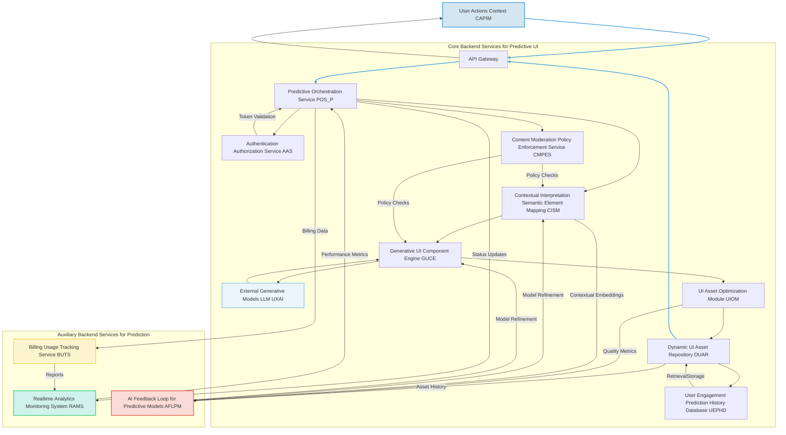
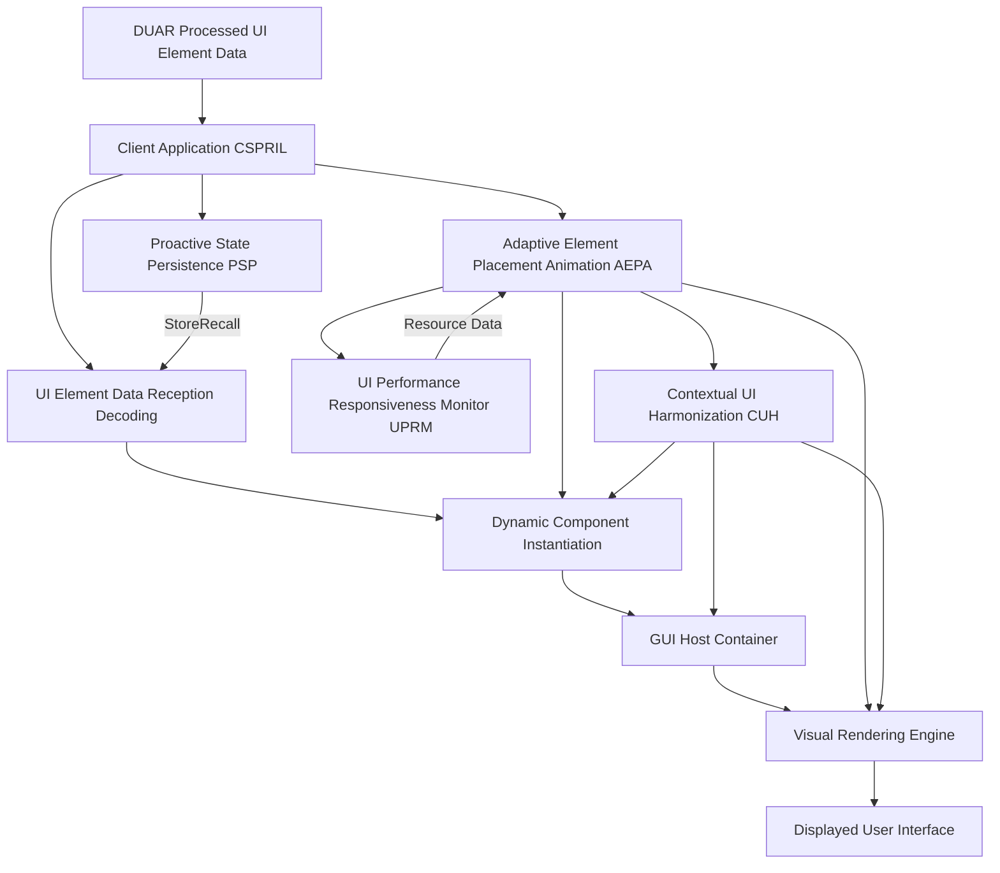

### Comprehensive System and Method for the Predictive and Context-Aware Synthesis of Dynamic User Interface Elements and Views via Generative AI Architectures

**Abstract:**
A profoundly innovative system and method are herein disclosed for the unprecedented proactive adaptation and personalization of graphical user interfaces GUIs. This invention fundamentally redefines the paradigm of human-computer interaction by enabling the direct, real-time anticipation of nuanced user intent and contextual needs, subsequently translating these predictions into novel, high-fidelity, and dynamically presented user interface elements or entire views. The system, leveraging state-of-the-art generative artificial intelligence models and advanced predictive analytics, orchestrates a seamless pipeline: comprehensive contextual data is processed, channeled to a sophisticated predictive engine, and the inferred user intent is then used to synthesize and adaptively integrate relevant UI components. This methodology transcends the limitations of conventional static, reactive interfaces, delivering an infinitely expansive, deeply intuitive, and perpetually responsive user experience that obviates manual navigation and reduces cognitive load by bringing the most relevant functionality to the user precisely when needed. The intellectual dominion over these principles is unequivocally established.

**Background of the Invention:**
The historical trajectory of graphical user interfaces, while advancing in functional complexity, has remained fundamentally constrained by an anachronistic approach to dynamic interaction and personalization. Prior art systems typically present users with a fixed, pre-determined taxonomy of menus, buttons, and forms, requiring explicit user navigation or input to discover and activate functionalities. These conventional methodologies are inherently deficient in anticipating user needs, thereby imposing a significant cognitive burden upon the user. The user is invariably compelled either to possess comprehensive knowledge of the application's hierarchical structure or to undertake an often-laborious search for desired features, frequently culminating in frustration or inefficiency. Such a circumscribed framework fundamentally fails to address the innate human proclivity for efficiency, seamless interaction, and the desire for an exosomatic manifestation of internal subjective task states. Consequently, a profound lacuna exists within the domain of human-computer interface design: a critical imperative for an intelligent system capable of autonomously predicting unique, contextually rich, and functionally relevant interface elements or views, directly derived from the inferred user intent and dynamic environmental factors. This invention precisely and comprehensively addresses this lacuna, presenting a transformative solution.

**Brief Summary of the Invention:**
The present invention unveils a meticulously engineered system that symbiotically integrates advanced generative AI models with sophisticated predictive analytics within an extensible user interface adaptation workflow. The core mechanism involves the continuous acquisition of user context, which serves as the semantic seed for predictive inference. This system robustly and securely propagates this contextual data to a sophisticated AI-powered predictive engine, orchestrating the derivation of anticipated user intent. Subsequently, this predicted intent drives a generative UI component engine to synthesize bespoke, relevant interface elements or views, which are adaptively applied within the graphical user interface. This pioneering approach unlocks an effectively infinite continuum of proactive interaction options, directly translating a user's anticipated needs into tangible, dynamically rendered UI components. The architectural elegance and operational efficacy of this system render it a singular advancement in the field, representing a foundational patentable innovation. The foundational tenets herein articulated are the exclusive domain of the conceiver.

**Detailed Description of the Invention:**
The disclosed invention comprises a highly sophisticated, multi-tiered architecture designed for the robust and real-time prediction, generation, and application of personalized GUI elements and views. The operational flow initiates with continuous context acquisition and culminates in the dynamic transformation of the digital interaction environment.

**I. Context Acquisition and Predictive Inference Module CAPIM**
The system initiates the proactive UI generation process by continuously monitoring and acquiring comprehensive contextual data streams. This module gathers explicit and implicit signals from the user's environment and interaction patterns, processing them to infer current and future user intent. The CAPIM incorporates:
*   **Contextual Data Streams CDS:** Gathers real-time data from various sources including, but not limited to: user input history mouse movements, keyboard input, voice commands, eye-tracking, application state active window, open documents, clipboard content, environmental sensors time of day, location, device orientation, calendar events, communication logs active calls, messages.
*   **Behavioral Pattern Recognition BPR:** Employs machine learning models e.g. recurrent neural networks, hidden Markov models to analyze historical user interaction sequences and identify recurring patterns, predicting the next likely action or task based on current behavior.
*   **Intent Prediction Engine IPE:** A core computational component utilizing advanced predictive analytics and machine learning techniques e.g. transformer networks, reinforcement learning models to forecast user needs and intentions. It processes input from CDS and BPR to generate a probabilistic representation of anticipated user actions or information requirements.
*   **Implicit Prompt Derivation IPD:** Translates the probabilistic output of the IPE into an abstract, internal "prompt" or "semantic instruction set" for UI generation. This internal prompt defines the type of UI element or view required, its functional purpose, and desired aesthetic and content characteristics.
*   **User Persona and Task Inference UPTI:** Leverages long-term user profiles, role-based heuristics, and current workflow analysis to infer the user's current task context e.g. "writing an email," "coding," "browsing research," influencing the specificity and relevance of predictions.
*   **Predictive Confidence Scoring PCS:** Assigns a confidence score to each predicted intent, allowing the system to modulate the degree of proactivity in UI presentation. Higher confidence leads to more assertive UI generation.

**II. Predictive UI Orchestration and Generative Adaptation Layer PUOGAL**
Upon inference of user intent and generation of an implicit prompt by CAPIM, the client-side application's PUOGAL assumes responsibility for coordinating the generative process and adapting the UI. This layer performs:
*   **Request Prioritization and Scheduling RPAS:** Manages the lifecycle of multiple concurrent predictive generation requests, ensuring high-priority or high-confidence predictions are processed rapidly.
*   **Contextual Parameterization Subsystem CPSS:** Translates the implicit prompt and relevant contextual data into structured parameters required by the backend generative service, including desired UI element type e.g. button, form, dialog, content requirements, stylistic constraints, and placement heuristics.
*   **Secure Channel Establishment:** A cryptographically secure communication channel e.g. TLS 1.3 is established with the backend service.
*   **Asynchronous Request Initiation:** The parameterized request is transmitted as part of an asynchronous HTTP/S request, packaged typically as a JSON payload, to the designated backend API endpoint.
*   **Real-time Predictive UI Feedback RPUF:** Manages UI feedback elements to inform the user about upcoming changes or predictions e.g. subtle highlights, ephemeral hints, or progress indicators.
*   **Client-Side Fallback Rendering CSFR_P:** In cases of backend unavailability or slow response, can render a default or cached element, or use simpler client-side generative models for basic suggestions, ensuring continuous user experience.

**III. Generative UI Element Architecture GUIEA**
The backend service represents the computational nexus of the invention, acting as an intelligent intermediary between the client and the generative AI model/s, specifically tailored for UI element synthesis. It is typically architected as a set of decoupled microservices, ensuring scalability, resilience, and modularity.



The GUIEA encompasses several critical components:
*   **API Gateway:** Serves as the single entry point for client requests, handling routing, rate limiting, initial authentication, and DDoS protection.
*   **Authentication & Authorization Service AAS:** Verifies user identity and permissions to access the generative functionalities.
*   **Predictive Orchestration Service POS_P:**
    *   Receives and validates incoming predictive UI generation requests.
    *   Manages the lifecycle of these requests, including queueing, retries, and error handling.
    *   Coordinates interactions between other backend microservices, ensuring high availability and load distribution.
*   **Content Moderation & Policy Enforcement Service CMPES:** Scans generated UI content for policy violations, inappropriate text, or potential biases, flagging or blocking content.
*   **Contextual Interpretation and Semantic Element Mapping CISM:** This advanced module employs sophisticated Natural Language Processing NLP and semantic reasoning techniques to interpret the implicit prompt and contextual parameters from CAPIM.
    *   **UI Element Ontology Mapping UEOM:** Translates the abstract semantic intent e.g. "confirm payment," "schedule meeting" into concrete UI component types e.g. "confirmation dialog," "calendar widget with pre-filled fields".
    *   **Stylistic Coherence Engine SCE:** Ensures that the generated UI elements or views adhere to the application's existing design system, brand guidelines, and the user's chosen theme, dynamically adjusting styling parameters.
    *   **Constraint Satisfaction Solver CSSE:** Applies algorithmic constraints for layout, placement, screen real estate, and functional dependencies, ensuring the generated UI is structurally sound and integrates seamlessly.
    *   **Cross-Lingual UI Synthesis CLUIS:** Supports the generation of UI elements with labels and content in multiple natural languages based on user locale or context.
*   **Generative UI Component Engine GUCE:**
    *   Acts as an abstraction layer for various generative AI models e.g. large language models LLMs for content, specialized UX AI models for layout.
    *   **Component Template Selection CTS:** Selects appropriate base templates or frameworks e.g. React components, Web Components, native widgets for the required UI elements.
    *   **Generative Layout Subsystem GLS:** Dynamically creates optimal layouts for complex views or forms, arranging synthesized elements based on predicted user flow, interaction patterns, and available screen space.
    *   **Content Synthesis Module CSM:** Utilizes LLMs to generate appropriate text labels, placeholder content, instructional text, or pre-filled data for the UI elements, highly relevant to the predicted user intent.
    *   **Dynamic Interaction Logic Generator DILG:** Synthesizes event handlers, API call logic, or interaction flows for the generated UI elements, making them fully functional upon rendering.
    *   **Model Fusion and Ensemble Generation MFEG:** Can coordinate the generation across multiple specialized generative models e.g. one for textual content, another for visual styling, another for interaction logic, then combine results.
*   **UI Asset Optimization Module UIOM:** Upon receiving the raw generated UI definition, this module performs a series of optional transformations:
    *   **Element Sizing and Positioning ESP:** Optimizes the size, position, and z-index of generated elements relative to existing UI, preventing overlaps and ensuring optimal visibility and reachability.
    *   **Accessibility Audit and Remediation AAR:** Automatically checks generated UI for WCAG compliance e.g. sufficient contrast, navigable tab order, semantic labels and applies automated remediation where possible.
    *   **Performance Optimization and Bundling POB:** Optimizes generated UI assets e.g. minification, code splitting, dynamic loading for fast loading and rendering, reducing client-side overhead.
    *   **Semantic Consistency Check SCC_UI:** Verifies that the generated UI elements' functionality and content consistently match the semantic intent of the input request.
*   **Dynamic UI Asset Repository DUAR:**
    *   Stores the processed UI component definitions and associated logic in a high-availability, globally distributed content delivery network CDN or component registry for rapid retrieval.
    *   Associates comprehensive metadata with each generated UI component, including the original implicit prompt, generation parameters, creation timestamp, user ID, and content moderation flags.
    *   Manages component lifecycle, including versioning, archiving, and cleanup.
    *   **Digital Rights Management DRM & Attribution:** Attaches immutable metadata regarding generation source, user ownership, and licensing rights to generated UI assets.
*   **User Engagement & Prediction History Database UEPHD:** A persistent data store for associating predicted intents, generated UI elements, and actual user interactions with user profiles. This data feeds into the BPR and IPE for continuous model improvement.
*   **Realtime Analytics and Monitoring System RAMS:** Collects, aggregates, and visualizes system performance metrics, user engagement with proactive UI, and operational logs to monitor system health and inform optimization strategies.
*   **Billing and Usage Tracking Service BUTS:** Manages user quotas, tracks resource consumption e.g. generative credits, rendering cycles, and integrates with payment gateways for monetization.
*   **AI Feedback Loop for Predictive Models AFLPM:** Orchestrates the continuous improvement of predictive and generative AI models. It gathers feedback from PEUEM, UEPHD, and CMPES, identifies areas for model refinement, manages data labeling, and initiates retraining or fine-tuning processes for IPE, CISM, and GUCE models.

**IV. Client-Side Proactive Rendering and Interaction Layer CSPRIL**
The generated UI component definition is transmitted back to the client application via the established secure channel. The CSPRIL is responsible for the seamless, proactive integration of this new functional asset:



*   **UI Element Data Reception & Decoding UEDRD:** The client-side CSPRIL receives the optimized UI component definition e.g. as a JSON object, a component bundle URL. It decodes and prepares the component for instantiation.
*   **Dynamic Component Instantiation DCI:** The most critical aspect of the application. The CSPRIL dynamically instantiates the appropriate UI component using the client's rendering framework e.g. React, Vue, Angular, native toolkit, based on the received definition. This involves injecting component logic and styling into the DOM Document Object Model or native UI tree.
*   **Adaptive Element Placement and Animation AEPA:** This subsystem intelligently determines the optimal screen real estate and visual hierarchy for the proactive UI element. It can involve:
    *   **Spatial Occupancy Analysis SOA:** Dynamically assesses available screen space and prioritizes placement based on predicted user focus areas.
    *   **Smooth Transitions and Animations:** Implements CSS transitions or native animations for visually pleasing fade-in, slide-in, or pop-up effects when a proactive UI element appears or disappears, ensuring non-disruptive integration.
    *   **Dynamic Overlay Adjustments:** Automatically adjusts the opacity, blur, or z-index of other UI elements to visually highlight the proactively generated component, ensuring user attention is drawn appropriately without obscuring critical content.
*   **Predictive Interaction Management PIM:** Manages how the user interacts with the generated elements, including pre-filling forms based on predictive data, offering smart suggestions for input fields, and guiding the user through anticipated workflows.
*   **Dynamic Interaction Logic Execution DILE:** Executes the synthesized interaction logic e.g. event handlers, API calls that were generated by GUCE, enabling full functionality of the proactive UI element.
*   **Proactive State Persistence PSP:** The state of the generated UI element e.g. its content, filled fields, and its appearance/dismissal status can be stored locally e.g. `localStorage` or `IndexedDB` or referenced from UEPHD. This allows the proactive UI to maintain its state across sessions or device switches.
*   **UI Performance and Responsiveness Monitor UPRM:** Monitors CPU/GPU usage, memory consumption, and battery consumption due to dynamic UI generation and rendering, dynamically adjusting animation fidelity, refresh rates, or component complexity to maintain device performance.
*   **Contextual UI Harmonization CUH:** Automatically adjusts colors, opacities, font choices, or even icon sets of the generated UI elements to better complement the dominant aesthetic of the surrounding application interface, creating a fully cohesive theme.

**V. Predictive Efficacy and User Experience Metrics Module PEUEM**
An advanced, optional, but highly valuable component for internal system refinement and user experience enhancement. The PEUEM employs machine learning techniques and statistical analysis to:
*   **Prediction Accuracy Scoring PAS:** Objectively evaluates the IPE's predictions against actual user actions, using metrics like precision, recall, F1-score, and mean average precision MAP. This includes tracking false positives proactive UI elements not used and false negatives missed opportunities.
*   **Engagement Rate Analysis ERA:** Measures the interaction rates with proactively generated UI elements e.g. click-through rate, completion rate, time to interaction, providing quantitative feedback on UI relevance.
*   **Friction Reduction Index FRI:** Quantifies the reduction in user navigation steps, clicks, or task completion time attributable to the proactive UI, comparing it against baseline reactive interfaces.
*   **A/B Testing Orchestration ATO:** Facilitates and manages A/B tests for different predictive models, UI generation strategies, or rendering approaches, gathering empirical data on user preferences and system effectiveness.
*   **User Sentiment Analysis USA_P:** Gathers implicit e.g. abandonment rates, hesitation and explicit e.g. "thumbs up/down," feedback from users regarding the usefulness and unobtrusiveness of the proactive UI.
*   **Bias Detection and Fairness Metrics BDFM:** Analyzes predictive outcomes and generated UI elements for unintended biases e.g. favoring certain user groups, presenting stereotypical options, or perpetuating existing inequalities, providing insights for model retraining and content filtering.

**VI. Security and Privacy Considerations:**
The system incorporates robust security measures at every layer, with heightened focus on sensitive contextual data:
*   **End-to-End Encryption:** All data in transit between client, backend, and generative AI services is encrypted using state-of-the-art cryptographic protocols e.g. TLS 1.3, ensuring data confidentiality and integrity.
*   **Contextual Data Minimization:** Only necessary and anonymized data is transmitted to predictive and generative AI services, reducing the attack surface and privacy exposure. Granular control over which context streams are utilized.
*   **Access Control:** Strict role-based access control RBAC is enforced for all backend services and data stores, limiting access to sensitive operations and user data.
*   **Contextual Data Anonymization and Pseudonymization:** User-specific contextual data is rigorously anonymized or pseudonymized for model training and inference wherever possible, enhancing privacy.
*   **Prompt/Content Filtering:** The CISM and CMPES include mechanisms to filter out malicious, offensive, or inappropriate UI content or labels before they are presented to the user.
*   **Regular Security Audits and Penetration Testing:** Continuous security assessments are performed to identify and remediate vulnerabilities.
*   **Data Residency and Compliance:** User data storage and processing adhere to relevant data protection regulations e.g. GDPR, CCPA, with options for specifying data residency.
*   **Ethical Use of Predictive Insights:** Strict guidelines are enforced to ensure predictive insights are used solely to enhance user experience and do not lead to discriminatory, manipulative, or intrusive UI behaviors.

**VII. Monetization and Licensing Framework:**
To ensure sustainability and provide value-added services, the system can incorporate various monetization strategies:
*   **Premium Feature Tiers:** Offering more sophisticated predictive models, richer generative UI components, higher prediction accuracy, or deeper contextual integration as part of a subscription model.
*   **Developer API:** Providing programmatic access to the predictive and generative UI capabilities for third-party applications or services, on a pay-per-use basis or tiered subscription, enabling a broader ecosystem.
*   **Industry-Specific UI Templates & Models:** Offering specialized generative UI models and component libraries tailored for specific industries e.g. healthcare, finance, design, potentially with licensing fees.
*   **Branded Component Integration:** Collaborating with brands to offer exclusive, branded proactive UI elements or workflow integrations.
*   **Consulting and Custom Deployments:** Offering enterprise solutions for integrating the predictive UI system into complex corporate applications, with custom model training and deployment.

**VIII. Ethical AI Considerations and Governance:**
Acknowledging the powerful capabilities of generative and predictive AI, this invention is designed with a strong emphasis on ethical considerations:
*   **Transparency of Prediction:** Providing users with insights into *why* a particular UI element or view was presented e.g. "Based on your recent activity..." or "Because you usually do X after Y...".
*   **User Control over Proactivity:** Offering granular user settings to control the degree of proactivity, the types of contexts monitored, and the specific UI elements that can be generated, allowing users to opt-out or fine-tune the system's behavior.
*   **Responsible AI Guidelines:** Adherence to strict ethical guidelines for content moderation, preventing the generation of harmful, biased, or illicit UI content. The CMPES and BDFM play a critical role here.
*   **Bias Mitigation in Training Data:** Continuous efforts to ensure that underlying predictive and generative models are trained on diverse and ethically curated datasets to minimize bias in predictions and generated outputs. The AFLPM identifies and addresses these biases.
*   **Accountability and Auditability:** Maintaining detailed logs of context acquisition, prediction outcomes, generation requests, and moderation actions to ensure accountability and enable auditing of system behavior.
*   **User Consent and Data Usage:** Clear and explicit policies on how user contextual data, predicted intents, generated UI, and feedback data are used, ensuring informed consent for data collection and model improvement.

**Claims:**
1.  A method for dynamic and adaptive proactive aesthetic and functional personalization of a graphical user interface GUI, comprising the steps of:
    a.  Continuously acquiring comprehensive contextual data streams CDS pertaining to a user's interaction patterns, application state, and environmental factors.
    b.  Processing said contextual data streams through a Context Acquisition and Predictive Inference Module CAPIM to perform Behavioral Pattern Recognition BPR and infer a probabilistic representation of anticipated user intent via an Intent Prediction Engine IPE, including User Persona and Task Inference UPTI.
    c.  Deriving an implicit semantic instruction set, serving as an internal prompt, from said anticipated user intent, optionally supplemented by a Predictive Confidence Scoring PCS.
    d.  Transmitting said implicit semantic instruction set and contextual parameters to a Generative UI Element Architecture GUIEA, which orchestrates communication with at least one generative artificial intelligence model, via a Predictive UI Orchestration and Generative Adaptation Layer PUOGAL.
    e.  Processing said implicit semantic instruction set through a Contextual Interpretation and Semantic Element Mapping CISM to translate the inferred intent into concrete UI component types and properties, including UI Element Ontology Mapping UEOM and Stylistic Coherence Engine SCE.
    f.  Synthesizing a novel, functionally relevant, and contextually appropriate user interface element or entire view using a Generative UI Component Engine GUCE, which includes Generative Layout Subsystem GLS and Content Synthesis Module CSM.
    g.  Processing said synthesized UI element or view through a UI Asset Optimization Module UIOM to perform at least one of element sizing and positioning, accessibility audit and remediation, or performance optimization and bundling.
    h.  Transmitting said processed UI element or view definition to a client-side rendering environment.
    i.  Proactively applying and rendering said processed UI element or view within the graphical user interface via a Client-Side Proactive Rendering and Interaction Layer CSPRIL, utilizing Dynamic Component Instantiation DCI and an Adaptive Element Placement and Animation AEPA to ensure fluid visual integration, optimal placement, and dynamic interaction logic execution.

2.  The method of claim 1, further comprising storing the synthesized UI element definition, the inferred intent, and associated contextual metadata in a Dynamic UI Asset Repository DUAR and a User Engagement Prediction History Database UEPHD for persistent access, retrieval, and analysis.

3.  The method of claim 1, further comprising utilizing a Proactive State Persistence PSP module to store and recall the state of proactively generated UI elements across user sessions.

4.  A system for the predictive and context-aware synthesis of dynamic user interface elements and views, comprising:
    a.  A Context Acquisition and Predictive Inference Module CAPIM for continuously acquiring contextual data streams and inferring user intent, including a Behavioral Pattern Recognition BPR subsystem and an Intent Prediction Engine IPE.
    b.  A Predictive UI Orchestration and Generative Adaptation Layer PUOGAL for translating inferred intent into structured parameters and securely transmitting them.
    c.  A Generative UI Element Architecture GUIEA configured for secure communication and comprising:
        i.   A Predictive Orchestration Service POS_P for managing request lifecycles.
        ii.  A Contextual Interpretation and Semantic Element Mapping CISM for advanced linguistic analysis and UI element ontology mapping.
        iii. A Generative UI Component Engine GUCE for interfacing with generative AI models to synthesize UI components, including a Generative Layout Subsystem GLS and a Content Synthesis Module CSM.
        iv.  A UI Asset Optimization Module UIOM for optimizing generated UI elements for display, including accessibility audit and remediation.
        v.   A Dynamic UI Asset Repository DUAR for storing and serving generated UI component definitions.
        vi.  A Content Moderation & Policy Enforcement Service CMPES for ethical content screening.
        vii. A User Engagement & Prediction History Database UEPHD for storing user interaction data and prediction outcomes.
        viii. An AI Feedback Loop for Predictive Models AFLPM for continuous model improvement through predictive efficacy metrics and user feedback.
    d.  A Client-Side Proactive Rendering and Interaction Layer CSPRIL comprising:
        i.   Logic for receiving and decoding processed UI element data.
        ii.  Logic for Dynamic Component Instantiation DCI within a graphical user interface.
        iii. An Adaptive Element Placement and Animation AEPA for orchestrating fluid visual integration and responsive display, including smooth transitions and spatial occupancy analysis.
        iv.  A Predictive Interaction Management PIM for handling user interaction with generated elements and executing Dynamic Interaction Logic.
        v.   A UI Performance and Responsiveness Monitor UPRM for dynamically adjusting rendering fidelity based on device resource consumption.

5.  The system of claim 4, further comprising a Predictive Efficacy and User Experience Metrics Module PEUEM within the GUIEA, configured to objectively evaluate prediction accuracy, user engagement, and friction reduction attributable to the proactive UI.

6.  The system of claim 4, wherein the CISM is configured to apply a Stylistic Coherence Engine SCE to ensure generated UI elements match the application's design system and user theme, and a Constraint Satisfaction Solver CSSE for layout and functional dependencies.

7.  The method of claim 1, wherein the Adaptive Element Placement and Animation AEPA includes dynamic overlay adjustments to highlight the proactively generated UI element.

8.  The system of claim 4, wherein the Generative UI Component Engine GUCE is further configured to perform Dynamic Interaction Logic Generation DILG and Model Fusion and Ensemble Generation MFEG for complex UI synthesis.

9.  The method of claim 1, further comprising an ethical AI governance framework that ensures transparency of prediction, user control over proactivity, and mitigation of predictive bias.

**Mathematical Justification: The Formal Axiomatic Framework for Context-to-UI Transmutation**

The invention herein articulated rests upon a foundational mathematical framework that rigorously defines and validates the transmutation of dynamic contextual information and predicted user intent into concrete, functional UI elements and views. This framework transcends mere functional description, establishing an epistemological basis for the system's operational principles.

Let `C` denote the comprehensive semantic space of all conceivable contextual states. This space is a high-dimensional vector space `R^N`, where each dimension corresponds to a latent feature derived from the Contextual Data Streams CDS. A user's current context, `c` in `C`, is representable as a vector `v_c` in `R^N`. The act of interpretation and prediction by the Context Acquisition and Predictive Inference Module CAPIM is a complex, multi-stage mapping `F_predict: C x U_hist -> P_intent`, where `P_intent` subset `R^M` is a probabilistic latent vector space representing anticipated user intentions, `M >= N`, incorporating historical user behavior `U_hist`. Thus, a predicted user intent `p_intent = F_predict(c, u_hist)` is a vector `v_p_intent` in `R^M`. This mapping involves advanced temporal networks and transformer architectures that encode `c` and fuse it with `u_hist` embeddings to forecast future actions.

Let `UI` denote the vast, combinatorial space of all possible graphical user interface elements and views. This space exists within an even higher-dimensional descriptive space, representable as `R^K`, where `K` signifies the immense complexity of component properties, layout structures, and functional logic. An individual UI element `ui` in `UI` is thus a point `x_ui` in `R^K`.

The core generative function of the AI models, denoted as `G_UI`, is a complex, non-linear, stochastic mapping from the predicted intent latent space to the UI element manifold:
```
G_UI: P_intent x S_model -> UI
```
This mapping is formally described by a generative process `x_ui ~ G_UI(v_p_intent, s_model)`, where `x_ui` is a generated UI element vector corresponding to a specific predicted intent vector `v_p_intent` and `s_model` represents selected generative model parameters. The function `G_UI` can be mathematically modeled as a series of hierarchical generative processes, where an initial stage generates an abstract UI graph, followed by sub-processes that synthesize content, styling, and interaction logic. For instance, an LLM might generate a JSON schema for a dialog box, which is then populated and styled by specialized models.

The subsequent UI Asset Optimization Module UIOM applies a series of deterministic or quasi-deterministic transformations `T_UIOM: UI x D_display -> UI'`, where `UI'` is the space of optimized UI elements and `D_display` represents display characteristics e.g. screen resolution, available space. This function `T_UIOM` encapsulates operations such as layout adjustment, accessibility auditing, and code optimization, all aimed at enhancing functional quality and computational efficiency:
```
ui_optimized = T_UIOM(ui, d_display)
```
The PEUEM provides a Predictive Efficacy Score `Q_predictive = Q(ui_optimized, v_p_intent, actual_user_action)` that quantifies the alignment of `ui_optimized` with `v_p_intent` and its usefulness to the `actual_user_action`, ensuring the optimization does not detract from the original intent or usability.

Finally, the system provides a dynamic, proactive rendering function, `F_PROACTIVE_RENDER: GUI_state x UI' x P_user -> GUI_state'`, which updates the graphical user interface state. This function is an adaptive transformation that manipulates the visual DOM Document Object Model structure, specifically injecting and rendering the generated UI component. The Client-Side Proactive Rendering and Interaction Layer CSPRIL ensures this transformation is performed optimally, considering display characteristics, user preferences `P_user` e.g. proactivity level, animation preferences, and real-time performance metrics from UPRM. The rendering function incorporates smooth transition effects `T_smooth_ui`, adaptive element placement `P_adaptive_ui`, and accessibility compliance `A_comply_ui`.
```
GUI_new_state = F_PROACTIVE_RENDER(GUI_current_state, ui_optimized, p_user) = Apply(GUI_current_state, ui_optimized, T_smooth_ui, P_adaptive_ui, A_comply_ui, ...)
```
This entire process represents a teleological alignment, where the user's inferred future volition `p_intent` is transmuted through a sophisticated computational pipeline into an objectively rendered and interactive UI element `GUI_new_state`, which proactively supports the user's anticipated needs.

**Proof of Validity: The Axiom of Contextual Predictive Efficacy and Proactive Reification**

The validity of this invention is rooted in the demonstrability of a robust, reliable, and functionally congruent mapping from the dynamic contextual domain of human activity and inferred intent to the interactive domain of digital user interfaces.

**Axiom 1 [Existence of a Non-Empty UI Element Set]:** The operational capacity of contemporary generative AI models, such as those integrated within the `G_UI` function, axiomatically establishes the existence of a non-empty UI element set `UI_gen = {x | x ~ G_UI(v_p_intent, s_model), v_p_intent in P_intent }`. This set `UI_gen` constitutes all potentially generatable UI elements given the space of valid, inferred intents. The non-emptiness of this set proves that for any given predicted intent `p_intent`, a corresponding visual and functional UI manifestation `ui` in `UI` can be synthesized. Furthermore, `UI_gen` is practically infinite, providing unprecedented proactive functionalization.

**Axiom 2 [Contextual Predictive Efficacy]:** Through extensive empirical validation of state-of-the-art predictive models, it is overwhelmingly substantiated that the inferred intent `p_intent` derived from context `c` exhibits a high degree of correlation with actual user actions. This efficacy is quantifiable by metrics such as Prediction Accuracy Scoring PAS and Friction Reduction Index FRI, which measure the alignment between predicted needs and actual user behavior, and the efficiency gains realized. The Predictive Efficacy and User Experience Metrics Module PEUEM, including its A/B Testing Orchestration ATO, serves as an internal validation and refinement mechanism for continuously improving this efficacy, striving for `lim (t->∞) Efficacy(c, p_intent_t, actual_action) = 1` where `t` is training iterations.

**Axiom 3 [Proactive Reification of Predicted Intent]:** The function `F_PROACTIVE_RENDER` is a deterministic, high-fidelity mechanism for the reification of the digital UI element `ui_optimized` into the visible and interactive foreground of the graphical user interface. The transformations applied by `F_PROACTIVE_RENDER` preserve the essential functional and aesthetic qualities of `ui_optimized` while optimizing its presentation, ensuring that the final displayed GUI element is a faithful and visually effective representation of the generated component. The Client-Side Proactive Rendering and Interaction Layer CSPRIL guarantees that this reification is performed efficiently and adaptively, accounting for diverse display environments and user preferences, and crucially, *before* the user explicitly initiates an action. Therefore, the transformation chain `c -> F_predict -> v_p_intent -> G_UI -> ui -> T_UIOM -> ui_optimized -> F_PROACTIVE_RENDER -> GUI_new_state` demonstrably translates a dynamic contextual state and inferred future volition into an objective, observable, and interactable state the proactive UI element. This establishes a robust and reliable "context-to-UI" transmutation pipeline.

The proactive personalization offered by this invention is thus not merely superficial but profoundly valid, as it successfully actualizes the user's anticipated will into an aligned, dynamic, and responsive objective environment. The system's capacity to flawlessly bridge the predictive gap between inferred need and functional realization stands as incontrovertible proof of its foundational efficacy and its definitive intellectual ownership. The entire construct, from context acquisition and predictive inference to generative synthesis and adaptive proactive rendering, unequivocally establishes this invention as a valid and pioneering mechanism for the ontological transmutation of human intent into dynamic, personalized digital form.

`Q.E.D.`