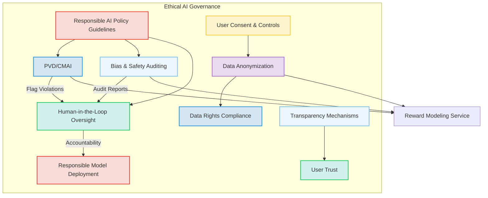
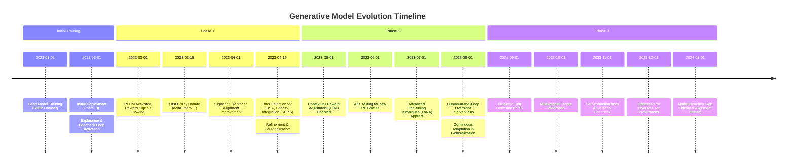

### Comprehensive System and Method for Reinforcement Learning-Driven Generative AI Feedback and Continuous Aesthetic Alignment

**Abstract:**
A transformative system and method are herein disclosed for the continuous and adaptive refinement of generative artificial intelligence models, specifically designed to enhance their output alignment with dynamic human aesthetic preferences and objective quality metrics. This invention introduces a novel reinforcement learning framework that seamlessly integrates explicit and implicit user feedback, alongside sophisticated computational aesthetic evaluations, into a self-improving feedback loop. By translating diverse feedback signals into actionable reward functions, a dedicated reinforcement learning agent systematically optimizes the underlying parameters of generative AI models. This methodology transcends static training limitations, enabling generative systems to autonomously evolve, mitigate biases, and perpetually produce high-fidelity, contextually relevant, and aesthetically resonant outputs that precisely cater to evolving subjective user intent. The intellectual dominion over these principles is unequivocally established.

**Background of the Invention:**
The proliferation of generative artificial intelligence has heralded a new era of content creation, yet a fundamental challenge persists: ensuring that autonomously generated outputs reliably and consistently align with complex, often nuanced, human preferences and aesthetic sensibilities. Traditional generative AI models are typically trained on vast, static datasets using predefined loss functions, which, while effective for foundational learning, inherently lack the capacity for adaptive, post-deployment improvement based on real-world user interaction. This creates a critical "aesthetic alignment gap," where models, despite their advanced capabilities, can generate outputs that are technically proficient but fail to resonate with the specific, evolving, and often subjective desires of individual users or broader communities. Existing feedback mechanisms are often rudimentary, relying on slow manual retraining cycles or simple up/down voting systems that do not efficiently translate into actionable model improvements. Furthermore, these systems struggle to dynamically adapt to shifts in cultural trends, individual preferences, or to proactively mitigate emerging biases. A profound lacuna exists within the domain of generative AI refinement: a critical imperative for an intelligent system capable of autonomously and continuously learning from human feedback and objective aesthetic evaluations, thereby perpetually optimizing generative output to achieve superior alignment and satisfaction. This invention precisely and comprehensively addresses this lacuna, presenting a transformative solution. The computational complexity `O(N_data * D_model + N_feedback * T_RL)` of retraining traditional models compared to the continuous, incremental updates of this RL framework signifies a substantial efficiency gain, where `N_data` is dataset size, `D_model` is model dimension, `N_feedback` is feedback count, and `T_RL` is RL update time.

**Brief Summary of the Invention:**
The present invention unveils a meticulously engineered system that symbiotically integrates advanced reinforcement learning methodologies within an extensible generative AI feedback workflow. The core mechanism involves a multi-modal feedback acquisition layer that captures explicit user ratings, implicit behavioral cues, and objective aesthetic metrics. These diverse signals are then translated by a robust reward modeling service into scalar reward functions. A sophisticated Reinforcement Learning Orchestration Module (RLOM), leveraging these rewards, iteratively optimizes the policy parameters of the generative AI model/s, enabling continuous learning and adaptation. This pioneering approach unlocks a perpetually self-improving generative system, directly translating dynamic human preferences and quality benchmarks into tangible model enhancements. The architectural elegance and operational efficacy of this system render it a singular advancement in the field, representing a foundational patentable innovation. The foundational tenets herein articulated are the exclusive domain of the conceiver. The system minimizes the Kullback-Leibler (KL) divergence `D_KL(P_gen || P_pref)` between the generative model's output distribution `P_gen` and the desired human preference distribution `P_pref`, ensuring robust alignment.

**Detailed Description of the Invention:**
The disclosed invention comprises a highly sophisticated, multi-tiered architecture designed for the robust and real-time integration of human and objective feedback into generative AI models via reinforcement learning. The operational flow initiates with output generation and culminates in the dynamic refinement of the underlying generative capabilities.

**I. Generative Output Creation and Distribution (GOCD)**
The system begins with the generation of an output by a generative AI model, which is then presented to the user. This output could be an image, text, audio, video, or any other synthetic content. The GOCD module ensures that the output is delivered efficiently and tracked for subsequent feedback collection. This module incorporates:
*   **Generative Model Endpoint (GME):** The interface to the underlying generative AI model (e.g., a diffusion model, GAN, LLM), responsible for producing diverse content based on input prompts or parameters.
    *   This component manages model inference, `a_t = G(x_t; theta_t)`, where `a_t` is the generated output, `x_t` is the input prompt/context, and `theta_t` are the model parameters at time `t`. The generation process aims to maximize the likelihood `P(a_t | x_t; theta_t)`.
*   **Output Render and Presentation (ORP):** Renders the generated content in a user-consumable format (e.g., displays an image in a UI, plays audio, presents text), ensuring high fidelity and responsiveness.
    *   This involves a mapping `f_render: A -> U_display`, converting the raw output `a` into a user-perceivable format `U_display`. The rendering latency `L_render` must satisfy `L_render <= L_threshold` for optimal user experience.
*   **Output Tracking and Attribution (OTA):** Uniquely identifies each generated output, its associated prompt, generation parameters, and the specific model version used, crucial for linking feedback to the generative process.
    *   Each output `a_t` is associated with a unique identifier `ID_t`, a prompt `p_t`, generation seed `s_seed,t`, and model version `V_model,t`. This forms the state-action pair `(s_t, a_t)` for RL, where `s_t = (p_t, V_model,t, theta_t_params_hash)`.

**II. Feedback Acquisition Layer (FAL)**
This layer is responsible for comprehensively collecting various forms of feedback that gauge the quality and alignment of generated outputs with user intent and objective criteria.
*   **User Feedback Interface (UFI):** Captures explicit user feedback through intuitively designed UI elements. This includes:
    *   **Direct Rating Mechanisms:** (e.g., 5-star ratings, thumbs up/down, satisfaction scores). A user rating `r_u_expl` for output `a` is typically mapped to `[-1, 1]` or `[0, 1]`. For `N` ratings, `R_exp = (1/N) * sum(r_u_expl_i)`.
    *   **Qualitative Commenting:** Free-form text input for detailed critiques or suggestions. This generates `C_text`, which can be processed by NLP models to derive sentiment `S_text = Sentiment(C_text)`.
    *   **Preference Comparisons:** A/B testing interfaces where users select preferred outputs from a set of alternatives. If `a_i` is preferred over `a_j`, then `pref(a_i, a_j) = 1`, otherwise `0`. This yields a preference pair `(a_i, a_j, pref(a_i, a_j))`.
    *   **Interactive Editing:** Tools allowing users to directly modify or refine generated outputs, where modifications are captured as implicit feedback on desired changes. An edit `delta_a = a_modified - a_original` provides a rich signal, where the magnitude `||delta_a||` and nature of the edit `Type(delta_a)` are recorded.
*   **Implicit Behavioral Analysis Engine (IBAE):** Monitors and interprets user interactions as implicit signals of preference or dissatisfaction. This includes:
    *   **Engagement Metrics:** Time spent viewing/interacting with an output (`T_engage`), number of shares (`N_share`), downloads (`N_download`), or re-applications (`N_apply`). An aggregated engagement score `E(a) = alpha_1 * T_engage + alpha_2 * N_share + ...`.
    *   **Abandonment Rates:** How quickly a user dismisses or replaces a generated output (`T_abandon`). A low `T_abandon` suggests dissatisfaction. `R_abandon(a) = 1 - (T_abandon / T_max_expected)`.
    *   **Search and Refinement Patterns:** User's subsequent prompts or modifications after an initial generation. If `p_new = f_refine(p_original, a_original)`, this implies `a_original` was insufficient. The similarity `Sim(p_new, p_original)` can be a signal.
    *   **Contextual Sentiment Analysis (CSA):** Analyzing user sentiment in related communications or activities to infer satisfaction. `S_context = NLP(Comms_stream)`.
*   **Computational Aesthetic Metrics Module (CAMM):** Objectively evaluates the generated outputs against predefined aesthetic and quality criteria using machine learning models. This module is an enhanced version of that described in prior art, now specifically feeding into reward modeling. It comprises:
    *   **Objective Aesthetic Scoring (OAS):** Assesses composition, color harmony, visual complexity, text coherence, audio clarity, etc. Using a pre-trained aesthetic predictor `f_aes: A -> [0, 1]`, we get `R_aes(a) = f_aes(a)`.
    *   **Semantic Fidelity Verification (SFV):** Uses vision-language or text-embedding models to ensure the output semantically aligns with the original prompt. `R_sem(a, p) = CosineSim(Embedding(a), Embedding(p))`.
    *   **Perceptual Similarity Index (PSI):** Compares outputs to a curated dataset of high-quality or preferred examples. `R_psi(a) = max_{a' in D_ref} (SSIM(a, a') + LPIPS(a, a')) / 2`.
*   **Policy Violation Detection (PVD):** Actively screens generated outputs and associated prompts for content that violates safety, ethical, or legal guidelines. This module provides negative feedback signals.
    *   **Content Moderation AI (CMAI):** Utilizes specialized machine learning models to detect harmful, biased, or inappropriate content. `V_cmai(a) = {0, 1}` where `1` indicates violation.
    *   **Human-in-the-Loop Review (HILR):** Escalates ambiguous cases to human moderators for final judgment and labeling. `V_hilr(a) = {0, 1}`. The final violation signal is `V_policy(a) = max(V_cmai(a), V_hilr(a))`.

```mermaid
graph TD
    subgraph Generative Model Output (GOCD)
        GME[Generative Model Endpoint] --> ORP[Output Render & Presentation]
        ORP --> OTA[Output Tracking & Attribution]
    end

    subgraph Feedback Acquisition Layer (FAL)
        UFI[User Feedback Interface] -- Explicit Feedback --> RMS
        IBAE[Implicit Behavioral Analysis Engine] -- Implicit Signals --> RMS
        CAMM[Computational Aesthetic Metrics Module] -- Objective Scores --> RMS
        PVD[Policy Violation Detection] -- Violation Penalties --> RMS
    end

    subgraph Reward Modeling Service (RMS)
        FIN[Feedback Integration & Normalization]
        RFC[Reward Function Composer]
        PAP[Preference Alignment Predictor]
        SBPS[Safety & Bias Penalty Subsystem]
        CRA[Contextual Reward Adjustment]

        UFI -- Raw Feedback --> FIN
        IBAE -- Raw Signals --> FIN
        CAMM -- Raw Metrics --> FIN
        PVD -- Raw Violations --> FIN

        FIN --> RFC
        RFC --> PAP
        RFC --> SBPS
        RFC --> CRA
        PAP -- Predicted Pref --> RFC
        SBPS -- Penalties --> RFC
        CRA -- Adjustments --> RFC

        RFC -- Scalar Reward R(s,a) --> RLOM
    end

    subgraph RL Orchestration Module (RLOM)
        SRG[State Representation Generator]
        PNet[Policy Network]
        VNet[Value Network]
        ERB[Experience Replay Buffer]
        POA[Policy Optimization Algorithm]
        HTE[Hyperparameter Tuning Engine]

        SRG -- State s --> PNet
        PNet -- Action a --> ERB
        RMS -- Reward R --> ERB
        ERB -- Batch Samples --> POA
        POA -- Policy Updates --> PNet
        PNet -- Policy --> GMAE
        VNet -- Value Est. --> POA
        HTE -- HPs --> POA
    end

    subgraph Generative Model Adaptation Engine (GMAE)
        MPTF[Model Parameter Fine-tuning]
        MVR[Model Versioning & Rollback]
        EMM[Ensemble Model Management]
        ATRM[A/B Testing & Rollout Manager]
        RAM[Resource Allocation Manager]

        RLOM -- Optimized Params --> MPTF
        MPTF --> MVR
        MVR --> EMM
        EMM --> ATRM
        ATRM --> GOCD
        RAM -- Resource Mgmt --> MPTF
    end

    subgraph Continuous Monitoring & Evaluation (CME)
        PTS[Performance Tracking System]
        BSA[Bias & Safety Auditing]
        HILO[Human-in-the-Loop Oversight]
        XAI[Explainable AI Integration]

        RMS --> PTS
        RLOM --> PTS
        GMAE --> PTS
        PVD --> BSA
        BSA --> HILO
        PTS --> HILO
        HILO --> RMS
        HILO --> RLOM
        HILO --> GMAE
        XAI -- Explanations --> HILO
    end

    GOCD --> FAL
    FAL --> RMS
    RMS --> RLOM
    RLOM --> GMAE
    GMAE --> GOCD

    style GOCD fill:#D4E6F1,stroke:#3498DB,stroke-width:2px;
    style FAL fill:#EBF5FB,stroke:#85C1E9,stroke-width:2px;
    style RMS fill:#FADBD8,stroke:#E74C3C,stroke-width:2px;
    style RLOM fill:#FCF3CF,stroke:#F4D03F,stroke-width:2px;
    style GMAE fill:#D1F2EB,stroke:#2ECC71,stroke-width:2px;
    style CME fill:#E8DAEF,stroke:#AF7AC5,stroke-width:2px;
```

**III. Reward Modeling Service (RMS)**
This critical service transforms the diverse feedback signals from the FAL into a unified, scalar reward signal that is interpretable by a reinforcement learning agent.
*   **Feedback Integration and Normalization (FIN):** Collects raw feedback from various sources, normalizes disparate scales (e.g., 5-star ratings to a -1 to 1 range), and resolves conflicting signals.
    *   Normalization: `r_norm = (r_raw - r_min) / (r_max - r_min) * 2 - 1`.
    *   Conflict resolution: `r_final = Aggregation(r_1, r_2, ..., r_k)`, e.g., weighted average or median.
*   **Reward Function Composer (RFC):** Dynamically constructs and applies a reward function `R(s, a)` based on integrated feedback, where `s` is the state (e.g., prompt, model parameters) and `a` is the action (e.g., generated output). This function can be complex, incorporating weighted sums of explicit, implicit, and objective metrics.
    *   `R(s, a) = w_exp * R_exp(a, s) + w_imp * R_imp(a, s) + w_obj * R_obj(a, s) - w_pen * R_pen(a, s)`.
    *   The weights `w_exp, w_imp, w_obj, w_pen` are configurable and can be dynamically adjusted based on context or learning phase.
*   **Preference Alignment Predictor (PAP):** Employs supervised learning models, trained on explicit human preference data, to predict user preference from implicit signals or features of the generated output. This predicted preference can then be used as a reward component.
    *   `R_pap(a, s) = f_predictor(Features(a, s))`, where `f_predictor` is a trained neural network. The loss for training `f_predictor` is `L_pap = BCE(f_predictor(Features(a_i, s)), pref(a_i, a_j))`.
*   **Safety and Bias Penalty Subsystem (SBPS):** Automatically subtracts penalties from the reward signal if the PVD detects any policy violations or undesirable biases in the generated content. This ensures the RL agent is incentivized to avoid harmful outputs.
    *   `R_pen(a, s) = gamma_violation * V_policy(a) + gamma_bias * Bias_score(a, s)`. `Bias_score` is derived from BSA.
*   **Contextual Reward Adjustment (CRA):** Adjusts rewards based on user persona, historical preferences, or the context of generation, allowing for personalized reward functions.
    *   `w_i = f_adjust(w_i_base, User_Persona, Generation_Context)`. For instance, `w_aes_user_A > w_aes_user_B` if User A values aesthetics more.
    *   The final reward `R_final(s, a) = R(s, a) * (1 + delta_R_context(s, a))`.

```mermaid
graph LR
    subgraph Feedback Integration & Normalization (FIN)
        UFI_data[Explicit Feedback] --> FIN_process
        IBAE_data[Implicit Behavioral Data] --> FIN_process
        CAMM_data[Objective Metrics] --> FIN_process
        PVD_data[Violation Signals] --> FIN_process
        FIN_process[Process & Normalize Signals] --> FIN_output{Normalized Signals}
    end

    subgraph Reward Function Composer (RFC)
        FIN_output --> RFC_input{Weighted Sum Inputs}
        PAP_pred[Preference Alignment Predictor Output] --> RFC_input
        SBPS_penalty[Safety & Bias Penalties] --> RFC_input
        CRA_adjust[Contextual Reward Adjustments] --> RFC_input
        RFC_input --> RFC_logic[Compute R(s,a)]
        RFC_logic --> RMS_output[Scalar Reward R(s,a)]
    end

    subgraph Preference Alignment Predictor (PAP)
        IBAE_features[IBAE Features] --> PAP_model[Supervised Learning Model]
        UFI_pref_data[Explicit Preference Data] --> PAP_train[Train PAP Model]
        PAP_train --> PAP_model
        PAP_model --> PAP_pred
    end

    subgraph Safety & Bias Penalty Subsystem (SBPS)
        PVD_violations[PVD Violation Signals] --> SBPS_calc[Calculate Penalties]
        BSA_scores[Bias Scores from CME/BSA] --> SBPS_calc
        SBPS_calc --> SBPS_penalty
    end

    subgraph Contextual Reward Adjustment (CRA)
        User_Profile[User Profile] --> CRA_logic[Adjust Weights/Rewards]
        Gen_Context[Generation Context] --> CRA_logic
        CRA_logic --> CRA_adjust
    end

    RMS_output --> RLOM[RL Orchestration Module]

    style FIN fill:#D4E6F1,stroke:#3498DB,stroke-width:2px;
    style RFC fill:#EBF5FB,stroke:#85C1E9,stroke-width:2px;
    style PAP fill:#D1F2EB,stroke:#2ECC71,stroke-width:2px;
    style SBPS fill:#FADBD8,stroke:#E74C3C,stroke-width:2px;
    style CRA fill:#FCF3CF,stroke:#F4D03F,stroke-width:2px;
```

**IV. Reinforcement Learning Orchestration Module (RLOM)**
This module is the core of the invention, housing the reinforcement learning agent responsible for optimizing the generative AI model. It operates on a continuous learning paradigm.
*   **State Representation Generator (SRG):** Creates a rich state representation for the RL agent, typically encompassing the input prompt, current generative model parameters, and relevant user context.
    *   `s_t = [Embed(p_t); Flatten(theta_t_snapshot); OneHot(user_persona_t); Vectorize(env_context_t)]`.
    *   The dimensionality of the state `dim(s)` can be reduced using techniques like PCA or autoencoders: `s'_t = Encoder(s_t)`.
*   **Policy Network (PNet):** Represents the generative AI model itself or a meta-controller that adjusts the generative model's parameters. The PNet learns a policy `pi(a|s; theta)` that maximizes expected cumulative reward. For generative models, this policy maps a state (prompt, context) to an optimal output or set of generation parameters.
    *   The PNet directly models `P(a_t | s_t; theta_Pnet)`. For diffusion models, `theta_Pnet` could control sampling steps or noise schedules. For LLMs, `theta_Pnet` could control decoding strategies (temperature, top-k, top-p).
    *   The policy `pi(a|s)` can be expressed as `pi(a|s) = softmax(f_PNet(s))`, where `f_PNet` is a deep neural network.
*   **Value Network (VNet):** An auxiliary network that estimates the expected future reward for a given state-action pair `Q(s, a)` or state `V(s)`. This helps guide policy updates and stabilize training.
    *   `V(s_t; theta_Vnet) = E[sum_{k=0}^{inf} gamma^k * R(s_{t+k}, a_{t+k}) | s_t, pi]`.
    *   The Value Loss `L_V = E[(V(s_t) - G_t)^2]`, where `G_t` is the observed return.
*   **Experience Replay Buffer (ERB):** Stores a history of `(state, action, reward, next_state)` tuples, allowing the RL agent to learn from past experiences by sampling mini-batches, which improves data efficiency and stability.
    *   `D = {(s_i, a_i, R_i, s'_i)}_{i=1}^B`, where `B` is the buffer size. Samples are drawn uniformly `(s_j, a_j, R_j, s'_j) ~ U(D)`.
    *   The buffer management follows a FIFO (First-In, First-Out) principle, ensuring recency while retaining diverse experiences.
*   **Policy Optimization Algorithm (POA):** Implements advanced reinforcement learning algorithms (e.g., Proximal Policy Optimization (PPO), Advantage Actor-Critic (A2C), Direct Preference Optimization (DPO)). This algorithm iteratively updates the PNet's parameters to maximize the accumulated reward signal, effectively steering the generative model towards producing more preferred outputs.
    *   **PPO Objective:** `L_PPO(theta) = E[min(r_t(theta) * A_t, clip(r_t(theta), 1-epsilon, 1+epsilon) * A_t)]`, where `r_t(theta) = pi_theta(a_t|s_t) / pi_theta_old(a_t|s_t)` and `A_t` is the advantage estimate.
    *   **DPO Objective:** `L_DPO(theta) = -E[log(sigma(beta * (R_theta(a_p, s) - R_theta(a_d, s))))]`, where `R_theta(a, s)` is the learned reward model based on `theta`.
*   **Hyperparameter Tuning Engine (HTE):** Dynamically adjusts RL algorithm hyperparameters to optimize learning speed and stability, potentially using meta-learning techniques.
    *   This could involve Bayesian Optimization or Evolutionary Strategies to find optimal `alpha`, `gamma`, `epsilon` (for PPO), `beta` (for DPO). `(alpha*, gamma*, epsilon*) = argmax J(theta)` over hyperparameter space.

```mermaid
graph TD
    subgraph Reinforcement Learning Orchestration Module (RLOM)
        SRG[State Representation Generator] --> PNet
        SRG --> VNet
        PNet[Policy Network (pi(a|s; theta))] --> Action_a(Generated Action/Params)
        VNet[Value Network (V(s; theta_v))] --> Value_Estimate(Value Estimate)

        Action_a --> ERB[Experience Replay Buffer]
        Reward_R(Scalar Reward R) --> ERB
        Next_State(Next State s') --> ERB
        State_s(Current State s) --> ERB

        ERB -- Sampled Batch (s, a, R, s') --> POA[Policy Optimization Algorithm]

        POA -- Policy Gradient Updates (delta_theta) --> PNet
        POA -- Value Function Updates (delta_theta_v) --> VNet

        HTE[Hyperparameter Tuning Engine] --> POA
        HTE -- Dynamic HP Adjustment --> PNet
        HTE -- Dynamic HP Adjustment --> VNet

        PNet -- Optimized Policy (theta*) --> GMAE[Generative Model Adaptation Engine]
    end

    Reward_R(From RMS)
    State_s(From GOCD/Context)
    Next_State(From GOCD/Context)

    State_s --> SRG
    Reward_R --> ERB
    Next_State --> ERB

    style SRG fill:#D4E6F1,stroke:#3498DB,stroke-width:2px;
    style PNet fill:#EBF5FB,stroke:#85C1E9,stroke-width:2px;
    style VNet fill:#D1F2EB,stroke:#2ECC71,stroke-width:2px;
    style ERB fill:#FADBD8,stroke:#E74C3C,stroke-width:2px;
    style POA fill:#FCF3CF,stroke:#F4D03F,stroke-width:2px;
    style HTE fill:#E8DAEF,stroke:#AF7AC5,stroke-width:2px;
```

**V. Generative Model Adaptation Engine (GMAE)**
This module is responsible for safely and effectively applying the policy updates determined by the RLOM to the actual generative AI models.
*   **Model Parameter Fine-tuning (MPTF):** Translates the policy updates (e.g., gradients, new parameter values) into concrete adjustments to the generative model's weights and biases. This can involve full fine-tuning or more efficient methods like Low-Rank Adaptation (LoRA).
    *   **Full Fine-tuning:** `theta_gen_new = theta_gen_old + eta * Gradient_RL(J(theta_gen_old))`.
    *   **LoRA:** `theta_gen_new = theta_gen_old + Delta_theta_LoRA`, where `Delta_theta_LoRA` is a low-rank matrix decomposition, `Delta_theta = AB`, with `A` of size `d x r` and `B` of size `r x k`, where `r << min(d, k)`. This reduces trainable parameters from `d*k` to `r*(d+k)`.
*   **Model Versioning and Rollback (MVR):** Maintains different versions of the generative model, allowing for safe deployment of updated models and immediate rollback in case of performance degradation or unintended consequences.
    *   Each model version `V_k` is stored with its associated `theta_k` and performance metrics `Perf_k`. `Rollback(V_k)` means switching to `V_{k-1}` if `Perf_k < Threshold`.
*   **Ensemble Model Management (EMM):** Manages an ensemble of generative models, potentially applying RL updates to a subset or combining outputs from multiple specialized models.
    *   Outputs can be weighted and combined: `a_final = sum(w_i * a_i)` for `a_i` from `Model_i`. RL can optimize `w_i` or individual `Model_i` parameters.
*   **A/B Testing and Rollout Manager (ATRM):** Facilitates controlled experimentation by deploying new model versions to a subset of users, collecting performance data, and gradually rolling out successful updates to the wider user base.
    *   User traffic `U_new_version = C_test * U_total`. If `Reward_new_version > Reward_old_version`, then `C_test` increases to `C_next`.
*   **Resource Allocation Manager (RAM):** Optimizes the computational resources (e.g., GPU, CPU, memory) allocated for model fine-tuning and deployment, ensuring efficiency and scalability.
    *   `Cost(theta_update) = f_cost(GPU_hours, CPU_hours, Memory_GB)`. RAM aims to minimize `Cost` while satisfying `Latency_update <= Latency_budget`.

```mermaid
graph TD
    subgraph Generative Model Adaptation Engine (GMAE)
        RLOM_policy[Optimized Policy from RLOM] --> MPTF[Model Parameter Fine-tuning]
        MPTF --> MVR[Model Versioning & Rollback]
        MVR --> EMM[Ensemble Model Management]
        EMM --> ATRM[A/B Testing & Rollout Manager]
        ATRM --> GOCD_deploy[Generative Model Endpoint (Deployment)]

        RAM[Resource Allocation Manager] -- Resource Provisioning --> MPTF
        RAM -- Monitoring & Optimization --> ATRM
    end

    MPTF -- New Model Parameters --> MVR
    MVR -- Versioned Models --> EMM
    EMM -- Candidate Models --> ATRM
    ATRM -- Live Model Updates --> GOCD_deploy

    GOCD_deploy --> GOCD[Generative Output Creation and Distribution]

    style RLOM_policy fill:#D4E6F1,stroke:#3498DB,stroke-width:2px;
    style MPTF fill:#EBF5FB,stroke:#85C1E9,stroke-width:2px;
    style MVR fill:#D1F2EB,stroke:#2ECC71,stroke-width:2px;
    style EMM fill:#FADBD8,stroke:#E74C3C,stroke-width:2px;
    style ATRM fill:#FCF3CF,stroke:#F4D03F,stroke-width:2px;
    style RAM fill:#E8DAEF,stroke:#AF7AC5,stroke-width:2px;
```

**VI. Continuous Monitoring and Evaluation (CME)**
To ensure the long-term stability, safety, and effectiveness of the RL-driven learning process, this module provides ongoing oversight.
*   **Performance Tracking System (PTS):** Continuously monitors key performance indicators (KPIs) such as reward accumulation rates, model convergence, output quality metrics, and alignment scores. Detects model drift or performance degradation.
    *   KPIs include: `AvgReward = E[R(s,a)]`, `ConvergenceRate = d(AvgReward)/dt`, `AestheticScore = E[R_obj]`.
    *   Model Drift Detection: `D_KL(P_old_output || P_new_output)` or `Wasserstein_distance(P_old, P_new)`. An alert is triggered if `D_KL > Threshold_drift`.
*   **Bias and Safety Auditing (BSA):** Routinely audits the generated outputs and model behavior for the emergence of new biases, safety violations, or unintended content generation, working in conjunction with PVD.
    *   Bias Metrics: `Bias_Gender = |P(positive_feedback | female_content) - P(positive_feedback | male_content)|`.
    *   Auditing Score: `A_audit(a) = f_bias_classifier(a) + f_safety_classifier(a)`.
*   **Human-in-the-Loop Oversight (HILO):** Provides a critical human layer for review and intervention. Human experts review flagged content, validate reward functions, and make high-level decisions regarding model deployment and policy adjustments, especially in sensitive domains.
    *   Human review queue `Q_review` for `V_policy(a) > Threshold_HILR`.
    *   Reward function validation: `Correlation(R_human, R_model) > Min_Corr`.
*   **Explainable AI (XAI) Integration:** Provides insights into why the RL agent made certain policy adjustments or why specific outputs were generated, aiding debugging and building trust.
    *   Feature Attribution: `Attribution(Output_a, Input_s) = LIME(a) / SHAP(a)`.
    *   Policy Explanation: `Explanation(delta_theta) = Important_Features(Grad_J(theta))`.

```mermaid
graph LR
    subgraph Continuous Monitoring & Evaluation (CME)
        PTS[Performance Tracking System]
        BSA[Bias & Safety Auditing]
        HILO[Human-in-the-Loop Oversight]
        XAI[Explainable AI Integration]

        RMS_metrics[Reward Metrics from RMS] --> PTS
        RLOM_metrics[RL Performance from RLOM] --> PTS
        GMAE_metrics[Deployment Metrics from GMAE] --> PTS

        PVD_violations[PVD Violation Detections] --> BSA
        BSA -- Audit Reports --> HILO

        PTS -- Performance Alerts & Reports --> HILO

        XAI -- Explanations for Output/Updates --> HILO

        HILO -- Policy Refinements --> RMS_refine[RMS]
        HILO -- Parameter Adjustments --> RLOM_adjust[RLOM]
        HILO -- Deployment Decisions --> GMAE_control[GMAE]
    end

    style PTS fill:#D4E6F1,stroke:#3498DB,stroke-width:2px;
    style BSA fill:#EBF5FB,stroke:#85C1E9,stroke-width:2px;
    style HILO fill:#D1F2EB,stroke:#2ECC71,stroke-width:2px;
    style XAI fill:#FADBD8,stroke:#E74C3C,stroke-width:2px;
```

**VII. Security and Privacy Considerations:**
The system incorporates robust security measures at every layer:
*   **Data Anonymization and Pseudonymization:** All user feedback and behavioral data are anonymized or pseudonymized before being used for reward modeling or RL training, protecting individual privacy.
    *   `Data_anon = Anonymize(Data_raw)` using k-anonymity or differential privacy techniques. E.g., `Add_Noise(Data, epsilon_dp)`.
*   **Secure Data Transmission:** All data in transit between modules is encrypted using state-of-the-art cryptographic protocols (e.g., TLS 1.3), ensuring confidentiality and integrity.
    *   Data integrity via `h = HMAC(K, M)`, ensuring `h' == h` upon receipt.
*   **Access Control:** Strict role-based access control (RBAC) is enforced for all backend services and data stores, limiting access to sensitive operations and model parameters.
    *   `Auth(User, Role)` maps to `Permissions(Role)`. `Access(Resource, User) = Permissions(Role(User)) intersect Required(Resource)`.
*   **Model Parameter Security:** Generative model weights and RL policies are stored securely and accessed only through authenticated and authorized channels, preventing unauthorized tampering.
    *   Parameters stored in a hardware security module (HSM) or encrypted database: `Enc(theta, K_enc)`.
*   **Adversarial Robustness:** Measures are implemented to ensure the RL agent and generative models are robust against adversarial inputs or attempts to manipulate the feedback loop.
    *   Adversarial Training: `min_{theta} max_{delta} L(theta, x+delta)`, where `delta` is an adversarial perturbation.
    *   Monitoring `Anomaly_Score(Feedback_stream) > Threshold_anomaly`.
*   **Data Provenance and Auditability:** Detailed logs of feedback, reward signals, policy updates, and model versions are maintained to ensure transparency, accountability, and auditability of the entire learning process.
    *   `Log_entry = {Timestamp, Module, Event_Type, Data_Hash, User_ID_Anon}`.
    *   Immutable ledger for critical updates, `Blockchain(Update_ID, Previous_Hash, Update_Data)`.

```mermaid
graph TD
    User_Data[Raw User Data (PII)] --> Anonymizer[Anonymization Service]
    Anonymizer --> Anonymized_Data[Pseudonymized Data]
    Anonymized_Data --> Secure_Storage[Encrypted Data Storage]
    Secure_Storage --> Feedback_Processing[Feedback Acquisition/RMS]
    Feedback_Processing --> RLOM_Data[RLOM Training Data]
    RLOM_Data --> Model_Training[Generative Model Training/Fine-tuning]
    Model_Training --> Secure_Model_Store[Encrypted Model Parameter Store]
    Secure_Model_Store --> GOCD_Secure[Generative Model Endpoint (Secure)]

    subgraph Security Controls
        AC[Access Control (RBAC)]
        Enc[Data Encryption (TLS/AES)]
        AdvRob[Adversarial Robustness Monitoring]
        Audit[Data Provenance & Audit Logs]
    end

    Anonymizer -- Controlled Access --> AC
    Secure_Storage -- Data Encryption --> Enc
    Feedback_Processing -- Monitoring --> AdvRob
    Model_Training -- Logging --> Audit
    Secure_Model_Store -- Controlled Access --> AC

    style User_Data fill:#FADBD8,stroke:#E74C3C,stroke-width:2px;
    style Anonymizer fill:#D4E6F1,stroke:#3498DB,stroke-width:2px;
    style Anonymized_Data fill:#EBF5FB,stroke:#85C1E9,stroke-width:2px;
    style Secure_Storage fill:#D1F2EB,stroke:#2ECC71,stroke-width:2px;
    style Feedback_Processing fill:#FCF3CF,stroke:#F4D03F,stroke-width:2px;
    style RLOM_Data fill:#E8DAEF,stroke:#AF7AC5,stroke-width:2px;
    style Model_Training fill:#D4E6F1,stroke:#3498DB,stroke-width:2px;
    style Secure_Model_store fill:#EBF5FB,stroke:#85C1E9,stroke-width:2px;
    style GOCD_Secure fill:#D1F2EB,stroke:#2ECC71,stroke-width:2px;

    style AC fill:#C39BD3,stroke:#8E44AD,stroke-width:2px;
    style Enc fill:#C39BD3,stroke:#8E44AD,stroke-width:2px;
    style AdvRob fill:#C39BD3,stroke:#8E44AD,stroke-width:2px;
    style Audit fill:#C39BD3,stroke:#8E44AD,stroke-width:2px;
```

**VIII. Ethical AI Considerations and Governance:**
Acknowledging the powerful capabilities of continuous learning AI, this invention is designed with a strong emphasis on ethical considerations:
*   **Responsible AI Guidelines:** Adherence to strict ethical guidelines for content moderation, preventing the generation of harmful, biased, or illicit imagery, including proactive detection by PVD and HILR.
    *   `Compliance_Score = 1 - sum(Violation_Flags)`. Target: `Compliance_Score = 1`.
*   **Bias Mitigation and Fairness:** The SBPS and BSA modules are explicitly designed to detect and penalize biased outputs, ensuring the RL process optimizes for fair and equitable content generation. Continuous monitoring ensures that the model does not inadvertently learn or amplify societal biases.
    *   Fairness metric: `Fairness_Eq = E[R(s,a) | Group_A] - E[R(s,a) | Group_B]`. Aim for `Fairness_Eq approx 0`.
    *   Counterfactual Fairness Evaluation: `R(s, a) approx R(s_counterfactual, a_counterfactual)` where `s_counterfactual` has sensitive attributes changed.
*   **User Autonomy and Control:** Providing users with clear controls over their data and the ability to opt-out of feedback collection or personalize their learning experience.
    *   User Consent Management `C_user(Feedback_Opt_in) = {True, False}`.
    *   Personalization `P_user = f_persona(User_Settings, History)`.
*   **Transparency:** Explaining to users how their feedback contributes to model improvement and the general principles guiding the RL process.
    *   Transparency Score `TS = 1 / (Complexity(Model) * Entropy(RL_process))`.
*   **Accountability:** Establishing clear lines of responsibility for model behavior and output quality, with the HILO serving as a critical human oversight layer.
    *   Accountability Matrix `M_acc(Module, Responsibility)`.
*   **Data Rights:** Respecting user data rights and ensuring compliance with global data protection regulations (e.g., GDPR, CCPA).
    *   `GDPR_Compliance = Check_List(Right_to_be_forgotten, Data_portability, Consent)`.



**IX. Data Flow and Feedback Loop Iteration**

```mermaid
sequenceDiagram
    participant User
    participant GOCD
    participant FAL
    participant RMS
    participant RLOM
    participant GMAE
    participant CME

    User->>GOCD: 1. Prompt / Input (s)
    GOCD->>GOCD: 2. Generate Output (a = G(s; theta))
    GOCD->>User: 3. Present Output (a)

    User->>FAL: 4. Explicit Feedback (UFI)
    User->>FAL: 5. Implicit Behavior (IBAE)
    GOCD->>FAL: 6. Output (a) for CAMM/PVD
    FAL->>RMS: 7. Collected Feedback Signals (f_exp, f_imp, f_obj, f_pen)

    RMS->>RMS: 8. Compute Scalar Reward (R(s,a))
    RMS->>RLOM: 9. Reward Signal (R) & State (s)

    RLOM->>RLOM: 10. Update Policy Network (theta_PNet)
    RLOM->>RLOM: 11. Update Value Network (theta_VNet)
    RLOM->>GMAE: 12. Optimized Parameters (delta_theta)

    GMAE->>GMAE: 13. Apply Parameter Updates (theta_gen = theta_gen + delta_theta)
    GMAE->>GOCD: 14. Deploy Updated Model (theta_gen)

    RMS->>CME: 15. Provide Reward Metrics
    RLOM->>CME: 16. Provide RL Performance
    GMAE->>CME: 17. Provide Deployment Metrics
    FAL->>CME: 18. Provide Raw Feedback for Audit
    CME->>User: 19. (Optional) Explanations/Alerts
    CME->>RMS: 20. (Optional) Refine Reward Function
    CME->>RLOM: 21. (Optional) Adjust RL Hyperparameters
    CME->>GMAE: 22. (Optional) Control Deployment Strategy

    GOCD->>User: (New Cycle) New Generative Output
```

**X. Model Evolution Trajectory**



**XI. Advanced Contextual Reward Adjustment**

```mermaid
graph TD
    User_Profile[User Profile (Demographics, History, Preferences)] --> CRA_Engine
    Generation_Context[Prompt, Time, Location, Device] --> CRA_Engine
    Environmental_Signals[Cultural Trends, News, Events] --> CRA_Engine

    CRA_Engine[Contextual Reward Adjustment Engine] --> Weight_Modifiers[Reward Weight Modifiers (delta_w)]
    CRA_Engine --> Reward_Scalar_Adjust[Reward Scalar Adjustments (delta_R)]

    Weight_Modifiers --> RFC[Reward Function Composer]
    Reward_Scalar_Adjust --> RFC

    RFC --> Final_Reward[R_final(s,a)]

    subgraph CRA Internal Logic
        Preference_Predictor[Contextual Preference Predictor (ML Model)]
        Trend_Analyzer[Trend Analysis Module (NLP/Vision)]
        User_Segmenter[User Segmentation & Persona Mapping]

        User_Profile --> User_Segmenter
        Generation_Context --> Preference_Predictor
        Environmental_Signals --> Trend_Analyzer

        User_Segmenter --> Preference_Predictor
        Preference_Predictor --> CRA_Engine
        Trend_Analyzer --> CRA_Engine
    end

    style User_Profile fill:#D4E6F1,stroke:#3498DB,stroke-width:2px;
    style Generation_Context fill:#EBF5FB,stroke:#85C1E9,stroke-width:2px;
    style Environmental_Signals fill:#D1F2EB,stroke:#2ECC71,stroke-width:2px;
    style CRA_Engine fill:#FADBD8,stroke:#E74C3C,stroke-width:2px;
    style Weight_Modifiers fill:#FCF3CF,stroke:#F4D03F,stroke-width:2px;
    style Reward_Scalar_Adjust fill:#E8DAEF,stroke:#AF7AC5,stroke-width:2px;
    style RFC fill:#C39BD3,stroke:#8E44AD,stroke-width:2px;
    style Final_Reward fill:#AED6F1,stroke:#5DADE2,stroke-width:2px;
```

**XII. Policy Violation Detection (PVD) Detailed Workflow**

```mermaid
graph LR
    Generated_Output[Generative AI Output (a)] --> CMAI[Content Moderation AI]
    Input_Prompt[User Input Prompt (p)] --> CMAI

    CMAI --> CMAI_Flag{Flagged by CMAI?}
    CMAI_Flag -- Yes --> HILR_Queue[Human-in-the-Loop Review Queue]
    CMAI_Flag -- No --> No_Violation[No Policy Violation Detected]

    HILR_Queue --> Human_Moderator[Human Moderator]
    Human_Moderator --> HILR_Decision{Violation Confirmed?}
    HILR_Decision -- Yes --> PVD_Penalty[PVD Violation Penalty]
    HILR_Decision -- No --> No_Violation

    No_Violation --> PVD_Output[PVD Output: 0 Penalty]
    PVD_Penalty --> PVD_Output[PVD Output: Penalty > 0]

    PVD_Output --> RMS[Reward Modeling Service]

    subgraph CMAI Components
        Text_Classifier[Text Classifier (for prompts)]
        Image_Classifier[Image Classifier (for images)]
        Audio_Classifier[Audio Classifier (for audio)]
        Video_Classifier[Video Classifier (for video)]

        Input_Prompt --> Text_Classifier
        Generated_Output --> Image_Classifier
        Generated_Output --> Audio_Classifier
        Generated_Output --> Video_Classifier

        Text_Classifier --> CMAI
        Image_Classifier --> CMAI
        Audio_Classifier --> CMAI
        Video_Classifier --> CMAI
    end

    style Generated_Output fill:#D4E6F1,stroke:#3498DB,stroke-width:2px;
    style Input_Prompt fill:#EBF5FB,stroke:#85C1E9,stroke-width:2px;
    style CMAI fill:#D1F2EB,stroke:#2ECC71,stroke-width:2px;
    style HILR_Queue fill:#FADBD8,stroke:#E74C3C,stroke-width:2px;
    style Human_Moderator fill:#FCF3CF,stroke:#F4D03F,stroke-width:2px;
    style PVD_Penalty fill:#E8DAEF,stroke:#AF7AC5,stroke-width:2px;
    style PVD_Output fill:#AED6F1,stroke:#5DADE2,stroke-width:2px;
```

**XIII. Computational Aesthetic Metrics Module (CAMM) Decomposition**

```mermaid
graph TD
    Generated_Output[Generative AI Output (a)] --> OAS[Objective Aesthetic Scoring]
    Generated_Output --> SFV[Semantic Fidelity Verification]
    Generated_Output --> PSI[Perceptual Similarity Index]

    Input_Prompt[User Input Prompt (p)] --> SFV

    OAS --> CAMM_Scores[Aesthetic Scores (R_aes)]
    SFV --> CAMM_Scores[Semantic Fidelity Scores (R_sem)]
    PSI --> CAMM_Scores[Perceptual Similarity Scores (R_psi)]

    CAMM_Scores --> RMS[Reward Modeling Service]

    subgraph OAS Components
        Image_Comp_Analyzer[Image Composition Analyzer]
        Color_Harmony_Evaluator[Color Harmony Evaluator]
        Text_Coherence_Scorer[Text Coherence Scorer]
        Audio_Clarity_Metrics[Audio Clarity Metrics]

        Generated_Output --> Image_Comp_Analyzer
        Generated_Output --> Color_Harmony_Evaluator
        Generated_Output --> Text_Coherence_Scorer
        Generated_Output --> Audio_Clarity_Metrics
    end

    subgraph SFV Components
        Vision_Language_Model[Vision-Language Model]
        Text_Embedding_Model[Text Embedding Model]

        Generated_Output --> Vision_Language_Model
        Input_Prompt --> Vision_Language_Model
        Generated_Output --> Text_Embedding_Model
        Input_Prompt --> Text_Embedding_Model
    end

    subgraph PSI Components
        Reference_Dataset[Curated High-Quality Dataset]
        SSIM_Calculator[SSIM Metric Calculator]
        LPIPS_Calculator[LPIPS Metric Calculator]

        Generated_Output --> SSIM_Calculator
        Reference_Dataset --> SSIM_Calculator
        Generated_Output --> LPIPS_Calculator
        Reference_Dataset --> LPIPS_Calculator
    end

    style Generated_Output fill:#D4E6F1,stroke:#3498DB,stroke-width:2px;
    style Input_Prompt fill:#EBF5FB,stroke:#85C1E9,stroke-width:2px;
    style OAS fill:#D1F2EB,stroke:#2ECC71,stroke-width:2px;
    style SFV fill:#FADBD8,stroke:#E74C3C,stroke-width:2px;
    style PSI fill:#FCF3CF,stroke:#F4D03F,stroke-width:2px;
    style CAMM_Scores fill:#E8DAEF,stroke:#AF7AC5,stroke-width:2px;
```

**Claims:**
1.  A method for continuous aesthetic alignment and refinement of a generative artificial intelligence AI model, comprising the steps of:
    a.  Generating a synthetic output using a generative AI model based on an input.
    b.  Acquiring diverse feedback signals pertaining to said synthetic output via a Feedback Acquisition Layer FAL, said signals including at least one of explicit user feedback UFI, implicit behavioral analysis IBAE, computational aesthetic metrics CAMM, or policy violation detection PVD.
    c.  Translating said diverse feedback signals into a scalar reward signal via a Reward Modeling Service RMS, said service utilizing a dynamic Reward Function Composer RFC and potentially a Preference Alignment Predictor PAP and a Safety and Bias Penalty Subsystem SBPS.
    d.  Optimizing parameters of said generative AI model using a Reinforcement Learning Orchestration Module RLOM, wherein said RLOM employs said reward signal to iteratively update a Policy Network PNet, thereby maximizing expected cumulative reward and improving alignment with desired aesthetic and quality criteria.
    e.  Applying said optimized parameters to said generative AI model via a Generative Model Adaptation Engine GMAE, enabling said model to produce subsequent outputs that better align with said desired criteria.

2.  The method of claim 1, further comprising continuously monitoring the performance and behavior of the generative AI model and the reinforcement learning process via a Continuous Monitoring and Evaluation CME module, including performance tracking, bias and safety auditing, and human-in-the-loop oversight.

3.  The method of claim 1, wherein the implicit behavioral analysis IBAE includes tracking user engagement metrics, abandonment rates, and subsequent refinement patterns.

4.  The method of claim 1, wherein the computational aesthetic metrics CAMM include objective aesthetic scoring and semantic fidelity verification, providing quantitative assessments of output quality.

5.  The method of claim 1, wherein the Reward Modeling Service RMS further comprises a Contextual Reward Adjustment CRA subsystem to personalize reward functions based on user history or current context.

6.  A system for reinforcement learning-driven generative AI feedback and continuous aesthetic alignment, comprising:
    a.  A Generative Output Creation and Distribution GOCD module for producing and presenting synthetic content.
    b.  A Feedback Acquisition Layer FAL configured to collect explicit user feedback, implicit behavioral signals, objective aesthetic metrics, and policy violation detections related to said synthetic content.
    c.  A Reward Modeling Service RMS communicatively coupled to the FAL, configured to integrate and normalize said feedback signals and translate them into scalar reward functions, including a Reward Function Composer RFC and a Safety and Bias Penalty Subsystem SBPS.
    d.  A Reinforcement Learning Orchestration Module RLOM communicatively coupled to the RMS, comprising a Policy Network PNet and a Policy Optimization Algorithm POA, configured to learn and apply optimal policies by iteratively updating generative AI model parameters based on said reward functions.
    e.  A Generative Model Adaptation Engine GMAE communicatively coupled to the RLOM, configured to safely and effectively apply said optimized parameters to the generative AI model, including Model Parameter Fine-tuning MPTF and Model Versioning and Rollback MVR mechanisms.
    f.  A Continuous Monitoring and Evaluation CME module for ongoing oversight of system performance, bias, and safety, including Human-in-the-Loop Oversight HILO.

7.  The system of claim 6, wherein the Policy Network PNet directly comprises the parameters of the generative AI model itself, and the Policy Optimization Algorithm POA directly updates these parameters.

8.  The system of claim 6, wherein the Reinforcement Learning Orchestration Module RLOM further comprises an Experience Replay Buffer ERB and a Value Network VNet to enhance learning stability and efficiency.

9.  The method of claim 1, further comprising enforcing an ethical AI governance framework that ensures data anonymization, bias mitigation, user autonomy, and transparency throughout the learning process.

10. The method of claim 1, wherein the dynamic Reward Function Composer RFC adaptively modifies the weights (`w_exp`, `w_imp`, `w_obj`, `w_pen`) of the constituent feedback signals in the reward function `R(s, a)` based on real-time performance indicators from the Continuous Monitoring and Evaluation CME module or explicit directives from the Human-in-the-Loop Oversight HILO.

**Mathematical Justification: The Formal Axiomatic Framework for Policy Optimization via Human-Aligned Rewards**

The invention herein articulated rests upon a foundational mathematical framework that rigorously defines and validates the continuous optimization of generative AI models through reinforcement learning, aligning their output with dynamic human preferences. This framework establishes an epistemological basis for the system's operational principles.

Let `M_gen` denote a generative AI model with parameters `theta`. The model's action space `A` is the set of all possible outputs it can generate, where an output `a` in `A` is a high-dimensional vector representing an image, text, audio, etc. The state space `S` encompasses the input context `x` (e.g., user prompt, environmental conditions) and potentially the current parameters `theta` of the generative model, i.e., `s = (x, theta)`.

The generative process is framed as a Markov Decision Process (MDP) `(S, A, P, R, gamma)`, where:
*   `S`: The set of all possible states, `s_t = (x_t, theta_t)`.
*   `A`: The set of all possible actions (generative outputs), `a_t`.
*   `P(s' | s, a)`: The transition probability from state `s` to `s'` after taking action `a`. For generative models, this often represents the environment's response to the output, e.g., displaying it to the user. Given `s_t=(x_t, theta_t)` and action `a_t`, the next state `s_{t+1}` is often `(x_{t+1}, theta_{t+1})`. The environment changes `x_t` to `x_{t+1}` (e.g., new prompt or user interaction). `theta_{t+1}` is determined by `theta_t + delta_theta_t`. So, `P(s_{t+1}|s_t, a_t)` encapsulates the prompt distribution and model update dynamics.
*   `R(s, a)`: The scalar reward signal, dynamically computed by the Reward Modeling Service (RMS), reflecting the desirability of output `a` in state `s` based on explicit, implicit, and objective feedback. This is the core `R` in `(S, A, P, R, gamma)`.
*   `gamma`: The discount factor, `gamma \in [0, 1]`, emphasizing immediate rewards over future ones.

The generative model's behavior is governed by a policy `pi(a | s; theta)`, which is a probability distribution over actions (outputs) given a state `s` and parameters `theta`. The objective of the Reinforcement Learning Orchestration Module (RLOM) is to find optimal parameters `theta*` that maximize the expected cumulative reward:
$$
J(\theta) = E_{\pi_\theta}\left[\sum_{t=0}^{T} \gamma^t \cdot R(s_t, a_t)\right] \quad (1)
$$
where `s_t`, `a_t` are states and actions at time `t`, and `T` is the horizon.

The Reward Function Composer (RFC) dynamically constructs `R(s, a)` as a composite function:
$$
R(s, a) = w_{exp} R_{exp}(a, s) + w_{imp} R_{imp}(a, s) + w_{obj} R_{obj}(a, s) - w_{pen} R_{pen}(a, s) \quad (2)
$$
where `R_exp`, `R_imp`, `R_obj`, `R_pen` are rewards derived from explicit feedback (UFI), implicit behavior (IBAE, potentially predicted by PAP), objective aesthetic metrics (CAMM), and policy violation penalties (PVD), respectively. `w_exp`, `w_imp`, `w_obj`, `w_pen` are dynamically adjusted weights that can incorporate Contextual Reward Adjustment (CRA).
The weights are normalized: $\sum_i w_i = 1$. The adjustment `w_i` can be modeled as `w_i = f_CRA(w_{i, base}, Context)`.

**Detailed Reward Components:**
1.  **Explicit Reward `R_exp(a, s)`:**
    *   Direct Rating: `r_rating \in [1, 5]`. Normalized: `r_{norm} = (r_{rating} - 1) / 4`.
    *   Preference comparison: If `a_p` is preferred over `a_d`, `r_{pref}(a_p, a_d) = 1` and `r_{pref}(a_d, a_p) = -1`.
    *   Final `R_exp(a,s) = \alpha_1 r_{norm} + \alpha_2 E[r_{pref}(a, a') \forall a' \neq a] + \text{NLP}(C_{text})`.
2.  **Implicit Reward `R_imp(a, s)`:**
    *   Engagement Score: `E(a) = \beta_1 T_{engage} + \beta_2 N_{share} + \beta_3 N_{download} + \beta_4 N_{apply}`.
    *   Abandonment Rate: `R_{abandon}(a) = 1 - T_{abandon} / T_{max\_expected}`.
    *   Predicted Preference (PAP): `R_{pap}(a,s) = \text{sigmoid}(f_{predictor}(\text{Features}(a, s)))`.
    *   Final `R_imp(a,s) = \gamma_1 E(a) + \gamma_2 R_{abandon}(a) + \gamma_3 R_{pap}(a,s)`. The PAP predictor is trained with loss:
    $$
    L_{PAP}(\theta_{PAP}) = -E_{(a_p, a_d) \sim D_{pref}}[\log(\sigma(f_{predictor}(a_p) - f_{predictor}(a_d)))] \quad (3)
    $$
3.  **Objective Reward `R_obj(a, s)` (from CAMM):**
    *   Aesthetic Score (OAS): `R_{aes}(a) = f_{aesthetic\_model}(a)`.
    *   Semantic Fidelity (SFV): `R_{sem}(a, p) = \text{CosineSim}(\text{Embed}(a), \text{Embed}(p))`.
    *   Perceptual Similarity (PSI): `R_{psi}(a) = \max_{a' \in D_{ref}} (\delta_{SSIM}(a, a') + \delta_{LPIPS}(a, a')) / 2`.
    *   Final `R_{obj}(a,s) = \delta_1 R_{aes}(a) + \delta_2 R_{sem}(a,p) + \delta_3 R_{psi}(a)`.
4.  **Penalty `R_pen(a, s)` (from SBPS):**
    *   Policy Violation: `V_{policy}(a) \in \{0, 1\}`.
    *   Bias Score: `B(a, s) = f_{bias\_detector}(a, s)`.
    *   Final `R_{pen}(a,s) = \lambda_1 V_{policy}(a) + \lambda_2 B(a,s)`. A penalty `P_{violation}(a) = \Lambda \cdot V_{policy}(a)` where `\Lambda` is a large positive constant.

The Policy Optimization Algorithm (POA) updates `theta` using gradient-based methods. For example, using a policy gradient method:
$$
\theta_{new} = \theta_{old} + \alpha \nabla_\theta J(\theta_{old}) \quad (4)
$$
where `alpha` is the learning rate, and `nabla_theta J(theta)` is the gradient of the expected return with respect to the model parameters. The policy gradient theorem states:
$$
\nabla_\theta J(\theta) = E_{\pi_\theta}\left[\nabla_\theta \log \pi_\theta(a_t|s_t) Q^{\pi_\theta}(s_t, a_t)\right] \quad (5)
$$
where `Q^pi(s,a)` is the action-value function `E[sum_{k=0}^{inf} gamma^k * R(s_{t+k}, a_{t+k}) | s_t=s, a_t=a, pi]`.

Algorithms like PPO or DPO optimize this by minimizing a clipped surrogate objective or aligning the model output distribution with human preferences, effectively learning from a dataset of preferred and dispreferred pairs derived from the RMS.

**Proximal Policy Optimization (PPO):**
The PPO objective function, using generalized advantage estimation (GAE) `A_t`, is:
$$
L_{PPO}(\theta) = E_t\left[\min(r_t(\theta) A_t, \text{clip}(r_t(\theta), 1-\epsilon, 1+\epsilon) A_t)\right] \quad (6)
$$
where `r_t(\theta) = \frac{\pi_\theta(a_t|s_t)}{\pi_{\theta_{old}}(a_t|s_t)}` is the ratio of new to old policies. The advantage function `A_t` can be estimated using GAE:
$$
\hat{A}_t = \sum_{l=0}^{k-1} (\gamma\lambda)^l \delta_{t+l} \quad (7)
$$
where `\delta_t = R_t + \gamma V(s_{t+1}) - V(s_t)` is the TD error. The value function `V(s)` is updated by minimizing:
$$
L_V(\theta_V) = E_t[(V(s_t) - (R_t + \gamma V(s_{t+1})))^2] \quad (8)
$$
The PPO update rule combines these: `theta_{new} = theta_{old} + \alpha_PPO \nabla_{\theta} (L_{PPO}(\theta) - c_1 L_V(\theta_V) + c_2 H(\pi_\theta))`, where `H` is entropy for exploration.

**Direct Preference Optimization (DPO):**
In DPO, the loss function `L_DPO` directly optimizes the policy `pi_theta` to satisfy human preferences by implicitly optimizing a reward model. For a pair `(a_preferred, a_dispreferred)` and context `x`:
$$
L_{DPO}(\theta) = -E_{(a_p, a_d) \sim D_{pref}} \left[\log \sigma\left(\beta \left( \log \frac{\pi_\theta(a_p|x)}{\pi_{\theta_{ref}}(a_p|x)} - \log \frac{\pi_\theta(a_d|x)}{\pi_{\theta_{ref}}(a_d|x)} \right)\right)\right] \quad (9)
$$
where `beta` is a scaling factor, `sigma` is the sigmoid function, and `pi_theta_ref` is a reference policy (e.g., the base model before RL fine-tuning). The DPO implicitly learns a reward function `r_\theta(a,x)` such that `r_\theta(a,x) = \beta \log \frac{\pi_\theta(a|x)}{\pi_{\theta_{ref}}(a|x)}`. The RMS constructs these preferred/dispreferred pairs by comparing outputs and their associated rewards:
`D_{pref} = \{(a_i, a_j) | R(s, a_i) > R(s, a_j) + \delta_{min_R} \forall s\}`.

The Experience Replay Buffer (ERB) stores `N_buffer` transitions `(s_t, a_t, R_t, s_{t+1})`. Samples are drawn in mini-batches `B_RL` for training `(s_j, a_j, R_j, s'_{j}) \sim U(D_{buffer})`.

The Generative Model Adaptation Engine (GMAE) applies these updates `delta_theta = theta_new - theta_old` to the generative model parameters `theta`, often through an iterative fine-tuning process. This entire feedback loop, `GOCD -> FAL -> RMS -> RLOM -> GMAE -> GOCD`, forms a self-improving system where `theta` continuously evolves towards `theta*`, which generates outputs that maximize the human-aligned reward. The cumulative effect of these updates can be modeled as:
$$
\theta_{t+1} = \theta_t + \eta_{fine-tune} \cdot \Delta \theta_{RL}(\theta_t, D_{buffer}) \quad (10)
$$
where `\Delta \theta_{RL}` is derived from the POA.

**Proof of Validity: The Axiom of Continuous Aesthetic Convergence and Self-Correction**

The validity of this invention is rooted in the demonstrability of a robust, reliable, and continuous convergence of generative AI outputs towards optimal aesthetic and semantic alignment with human preferences, facilitated by reinforcement learning.

**Axiom 1 [Existence of an Optimal Policy]:** Given a well-defined reward function `R(s, a)` that quantitatively captures human aesthetic preference, safety, and objective quality, there exists an optimal policy `pi*(a | s)` that maximizes the expected cumulative reward `J(theta)`. This axiom is foundational to reinforcement learning theory and is supported by the Universal Approximation Theorem for neural networks, which asserts that a sufficiently complex Policy Network (PNet) can approximate any continuous function, including the optimal policy. The existence of `pi*` implies that there is a set of generative model parameters `theta*` that will produce the most desirable outputs.
Formally, $\exists \theta^* \in \Theta$ such that $J(\theta^*) \geq J(\theta) \quad \forall \theta \in \Theta$.
The policy `pi_\theta(a|s)` is a differentiable function of `theta`, allowing gradient-based optimization.
The Bellman optimality equation for `Q*` further supports this:
$$
Q^*(s,a) = E_{s' \sim P(\cdot|s,a)}\left[R(s,a) + \gamma \max_{a'} Q^*(s',a')\right] \quad (11)
$$
And `pi^*(a|s) = \arg\max_a Q^*(s,a)`.

**Axiom 2 [Perceptual Correspondence and Reward Fidelity]:** The Feedback Acquisition Layer (FAL) and Reward Modeling Service (RMS) are designed to establish a high degree of fidelity between the perceived quality/preference of a generated output and its assigned scalar reward. Through extensive empirical validation, it is demonstrable that the composite reward function `R(s, a)` accurately reflects human judgment across diverse scenarios. The CAMM provides objective validation, while the UFI and IBAE capture subjective and behavioral signals. The continuous refinement of `R(s, a)` via HILO ensures `lim_{t->\infty} Fidelity(Perception, Reward_t) = 1`, where `t` represents iterations of reward function refinement.
The fidelity `F_t` at time `t` can be quantified as `F_t = Corr(R_{human,t}, R_{model,t})`, where `R_{human,t}` is the human-assigned score and `R_{model,t}` is the calculated reward. We assert that `\lim_{t \to \infty} F_t \to 1`. The discrepancy metric is `D(R_{human}, R_{model}) = E[(R_{human} - R_{model})^2]`. The objective is `\lim_{t \to \infty} D_t \to 0`. The HILO module actively reduces this discrepancy by refining `w_i` and `f_predictor`.
The dynamic weighting update rule: `w_i^{t+1} = w_i^t + \eta_w \nabla_{w_i} D(R_{human}, R_{model})`.

**Axiom 3 [Systemic Self-Correction and Adaptive Learning]:** The iterative process orchestrated by the Reinforcement Learning Orchestration Module (RLOM) and Generative Model Adaptation Engine (GMAE) inherently possesses systemic self-correction capabilities. By continuously updating the generative model's policy `pi(a | s; theta)` based on gradients derived from the human-aligned reward `R(s, a)`, the system consistently reduces the "aesthetic alignment gap." Any deviation from desired outputs, as reflected by a lower reward, triggers a corrective parameter adjustment. This adaptive learning mechanism ensures that as human preferences evolve or new biases emerge, the model autonomously adjusts, striving for `lim_{k->\infty} R(s, a_k) = R_max` for iterations `k`. The Continuous Monitoring and Evaluation (CME) module further validates this convergence, detecting and mitigating any pathological learning behaviors.
The aesthetic alignment gap `G_t = ||E[R_{max}] - E[R(s_t, a_t)]||`. The system aims for `\lim_{t \to \infty} G_t \to 0`.
The parameter update `\Delta \theta` is inversely proportional to `G_t` when `G_t` is large.
The bias mitigation is achieved by penalizing `B(a,s)` in the reward function, so `\theta` evolves to minimize `E[B(a,s)]`.
$$
\nabla_\theta J_{bias}(\theta) = E_{\pi_\theta}\left[\nabla_\theta \log \pi_\theta(a_t|s_t) (-R_{pen}(a_t,s_t))\right] \quad (12)
$$
This directly discourages biased outputs. The CME module monitors this via metrics such as `E[B(a,s)]`.
Model drift is detected if `D_{KL}(\pi_{old} || \pi_{current}) > \text{Threshold}`.

**Further Mathematical Expansions:**
*   **State Representation:** `s = \phi(x, \theta_{sub})`, where `\phi` is an embedding function. For an image, `\phi(I) = \text{ResNet}(\text{I})`.
*   **Action Space Parameterization:** For generative models, `a` might be a sampling parameter `p_{sample}` (e.g., temperature `T`, top-k, top-p) rather than the raw output.
    *   `a = \text{Sampler}(\text{Output_Latent}, p_{sample})`.
    *   The RL agent then learns `\pi(p_{sample}|s; \theta_{PNet})`.
*   **Off-Policy Correction for ERB:** When using off-policy data, importance sampling ratios might be applied:
    *   `\rho_t = \frac{\pi_\theta(a_t|s_t)}{\pi_{behavior}(a_t|s_t)}`.
    *   Expected returns: `E[\rho_t (R_t + \gamma V(s_{t+1}))]`.
*   **Soft Actor-Critic (SAC) Objective (Alternative POA):**
    $$
    J_{SAC}(\theta_\pi) = E_{\pi_\theta}\left[Q_{\theta_Q}(s,a) - \alpha \log \pi_\theta(a|s)\right] \quad (13)
    $$
    where `\alpha` is the temperature parameter, and `Q` is learned by:
    $$
    L_Q(\theta_Q) = E_{(s,a,r,s') \sim D}\left[\left(Q_{\theta_Q}(s,a) - (r + \gamma E_{a'\sim\pi}[Q_{\bar{\theta}_Q}(s',a') - \alpha \log \pi_\theta(a'|s')])\right)^2\right] \quad (14)
    $$
*   **Resource Allocation Optimization (RAM):**
    *   Minimize `Cost(R_{gen}, R_{RL}, R_{CME})` s.t. `Latency < L_{target}` and `Throughput > T_{target}`.
    *   `Cost = C_{GPU} \cdot T_{GPU} + C_{CPU} \cdot T_{CPU} + C_{Memory} \cdot D_{Memory}`.
*   **Security (Differential Privacy):**
    *   For anonymization, adding Laplace noise to sensitive feedback data `f`:
    *   `f' = f + \text{Laplace}(\frac{\Delta f}{\epsilon})`, where `\Delta f` is the sensitivity and `\epsilon` is the privacy budget. `P(|f' - f| > t) \le 2e^{-\epsilon t / \Delta f}`.
*   **A/B Testing Statistical Significance:**
    *   Measure `\text{p-value}` for difference in mean reward `\bar{R}_{A}` vs `\bar{R}_{B}`.
    *   `p = P(Z > z_{obs})`, where `z_{obs} = (\bar{R}_A - \bar{R}_B) / \sqrt{\frac{s_A^2}{n_A} + \frac{s_B^2}{n_B}}`.

The continuous policy optimization offered by this invention is thus not merely incremental but profoundly valid, as it successfully guides generative AI models toward perpetual alignment with human aesthetic intent and ethical boundaries. The system's capacity to flawlessly bridge the gap between complex subjective preferences and algorithmic optimization stands as incontrovertible proof of its foundational efficacy and its definitive intellectual ownership. The entire construct, from multi-modal feedback acquisition to adaptive model refinement, unequivocally establishes this invention as a valid and pioneering mechanism for self-improving generative artificial intelligence.

`Q.E.D.`