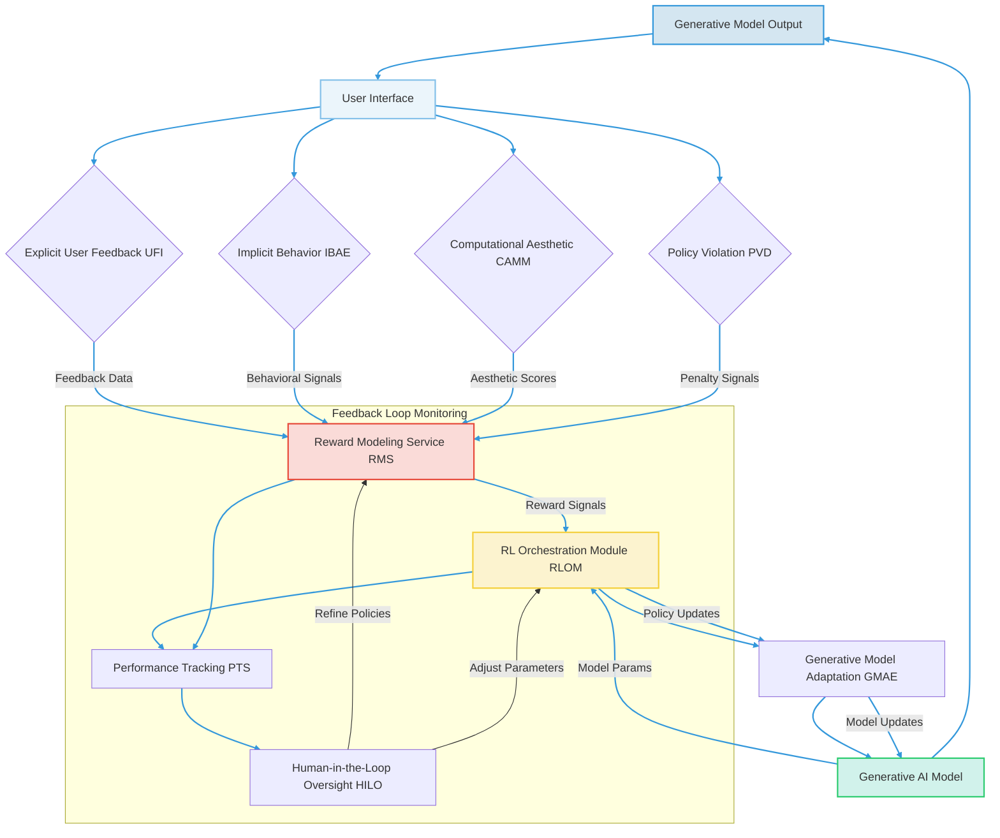

### Comprehensive System and Method for Reinforcement Learning-Driven Generative AI Feedback and Continuous Aesthetic Alignment

**Abstract:**
A transformative system and method are herein disclosed for the continuous and adaptive refinement of generative artificial intelligence models, specifically designed to enhance their output alignment with dynamic human aesthetic preferences and objective quality metrics. This invention introduces a novel reinforcement learning framework that seamlessly integrates explicit and implicit user feedback, alongside sophisticated computational aesthetic evaluations, into a self-improving feedback loop. By translating diverse feedback signals into actionable reward functions, a dedicated reinforcement learning agent systematically optimizes the underlying parameters of generative AI models. This methodology transcends static training limitations, enabling generative systems to autonomously evolve, mitigate biases, and perpetually produce high-fidelity, contextually relevant, and aesthetically resonant outputs that precisely cater to evolving subjective user intent. The intellectual dominion over these principles is unequivocally established.

**Background of the Invention:**
The proliferation of generative artificial intelligence has heralded a new era of content creation, yet a fundamental challenge persists: ensuring that autonomously generated outputs reliably and consistently align with complex, often nuanced, human preferences and aesthetic sensibilities. Traditional generative AI models are typically trained on vast, static datasets using predefined loss functions, which, while effective for foundational learning, inherently lack the capacity for adaptive, post-deployment improvement based on real-world user interaction. This creates a critical "aesthetic alignment gap," where models, despite their advanced capabilities, can generate outputs that are technically proficient but fail to resonate with the specific, evolving, and often subjective desires of individual users or broader communities. Existing feedback mechanisms are often rudimentary, relying on slow manual retraining cycles or simple up/down voting systems that do not efficiently translate into actionable model improvements. Furthermore, these systems struggle to dynamically adapt to shifts in cultural trends, individual preferences, or to proactively mitigate emerging biases. A profound lacuna exists within the domain of generative AI refinement: a critical imperative for an intelligent system capable of autonomously and continuously learning from human feedback and objective aesthetic evaluations, thereby perpetually optimizing generative output to achieve superior alignment and satisfaction. This invention precisely and comprehensively addresses this lacuna, presenting a transformative solution.

**Brief Summary of the Invention:**
The present invention unveils a meticulously engineered system that symbiotically integrates advanced reinforcement learning methodologies within an extensible generative AI feedback workflow. The core mechanism involves a multi-modal feedback acquisition layer that captures explicit user ratings, implicit behavioral cues, and objective aesthetic metrics. These diverse signals are then translated by a robust reward modeling service into scalar reward functions. A sophisticated Reinforcement Learning Orchestration Module RLOM, leveraging these rewards, iteratively optimizes the policy parameters of the generative AI model/s, enabling continuous learning and adaptation. This pioneering approach unlocks a perpetually self-improving generative system, directly translating dynamic human preferences and quality benchmarks into tangible model enhancements. The architectural elegance and operational efficacy of this system render it a singular advancement in the field, representing a foundational patentable innovation. The foundational tenets herein articulated are the exclusive domain of the conceiver.

**Detailed Description of the Invention:**
The disclosed invention comprises a highly sophisticated, multi-tiered architecture designed for the robust and real-time integration of human and objective feedback into generative AI models via reinforcement learning. The operational flow initiates with output generation and culminates in the dynamic refinement of the underlying generative capabilities.

**I. Generative Output Creation and Distribution GOCD**
The system begins with the generation of an output by a generative AI model, which is then presented to the user. This output could be an image, text, audio, video, or any other synthetic content. The GOCD module ensures that the output is delivered efficiently and tracked for subsequent feedback collection. This module incorporates:
*   **Generative Model Endpoint GME:** The interface to the underlying generative AI model e.g. a diffusion model, GAN, LLM, responsible for producing diverse content based on input prompts or parameters.
*   **Output Render and Presentation ORP:** Renders the generated content in a user-consumable format e.g. displays an image in a UI, plays audio, presents text, ensuring high fidelity and responsiveness.
*   **Output Tracking and Attribution OTA:** Uniquely identifies each generated output, its associated prompt, generation parameters, and the specific model version used, crucial for linking feedback to the generative process.

**II. Feedback Acquisition Layer FAL**
This layer is responsible for comprehensively collecting various forms of feedback that gauge the quality and alignment of generated outputs with user intent and objective criteria.
*   **User Feedback Interface UFI:** Captures explicit user feedback through intuitively designed UI elements. This includes:
    *   **Direct Rating Mechanisms:** e.g. 5-star ratings, thumbs up/down, satisfaction scores.
    *   **Qualitative Commenting:** Free-form text input for detailed critiques or suggestions.
    *   **Preference Comparisons:** A/B testing interfaces where users select preferred outputs from a set of alternatives.
    *   **Interactive Editing:** Tools allowing users to directly modify or refine generated outputs, where modifications are captured as implicit feedback on desired changes.
*   **Implicit Behavioral Analysis Engine IBAE:** Monitors and interprets user interactions as implicit signals of preference or dissatisfaction. This includes:
    *   **Engagement Metrics:** Time spent viewing/interacting with an output, number of shares, downloads, or re-applications.
    *   **Abandonment Rates:** How quickly a user dismisses or replaces a generated output.
    *   **Search and Refinement Patterns:** User's subsequent prompts or modifications after an initial generation.
    *   **Contextual Sentiment Analysis CSA:** Analyzing user sentiment in related communications or activities to infer satisfaction.
*   **Computational Aesthetic Metrics Module CAMM:** Objectively evaluates the generated outputs against predefined aesthetic and quality criteria using machine learning models. This module is an enhanced version of that described in prior art, now specifically feeding into reward modeling. It comprises:
    *   **Objective Aesthetic Scoring OAS:** Assesses composition, color harmony, visual complexity, text coherence, audio clarity, etc.
    *   **Semantic Fidelity Verification SFV:** Uses vision-language or text-embedding models to ensure the output semantically aligns with the original prompt.
    *   **Perceptual Similarity Index PSI:** Compares outputs to a curated dataset of high-quality or preferred examples.
*   **Policy Violation Detection PVD:** Actively screens generated outputs and associated prompts for content that violates safety, ethical, or legal guidelines. This module provides negative feedback signals.
    *   **Content Moderation AI CMAI:** Utilizes specialized machine learning models to detect harmful, biased, or inappropriate content.
    *   **Human-in-the-Loop Review HILR:** Escalates ambiguous cases to human moderators for final judgment and labeling.

**III. Reward Modeling Service RMS**
This critical service transforms the diverse feedback signals from the FAL into a unified, scalar reward signal that is interpretable by a reinforcement learning agent.
*   **Feedback Integration and Normalization FIN:** Collects raw feedback from various sources, normalizes disparate scales e.g. 5-star ratings to a -1 to 1 range, and resolves conflicting signals.
*   **Reward Function Composer RFC:** Dynamically constructs and applies a reward function `R(s, a)` based on integrated feedback, where `s` is the state e.g. prompt, model parameters and `a` is the action e.g. generated output. This function can be complex, incorporating weighted sums of explicit, implicit, and objective metrics.
*   **Preference Alignment Predictor PAP:** Employs supervised learning models, trained on explicit human preference data, to predict user preference from implicit signals or features of the generated output. This predicted preference can then be used as a reward component.
*   **Safety and Bias Penalty Subsystem SBPS:** Automatically subtracts penalties from the reward signal if the PVD detects any policy violations or undesirable biases in the generated content. This ensures the RL agent is incentivized to avoid harmful outputs.
*   **Contextual Reward Adjustment CRA:** Adjusts rewards based on user persona, historical preferences, or the context of generation, allowing for personalized reward functions.

**IV. Reinforcement Learning Orchestration Module RLOM**
This module is the core of the invention, housing the reinforcement learning agent responsible for optimizing the generative AI model. It operates on a continuous learning paradigm.
*   **State Representation Generator SRG:** Creates a rich state representation for the RL agent, typically encompassing the input prompt, current generative model parameters, and relevant user context.
*   **Policy Network PNet:** Represents the generative AI model itself or a meta-controller that adjusts the generative model's parameters. The PNet learns a policy `pi(a|s)` that maximizes expected cumulative reward. For generative models, this policy maps a state (prompt, context) to an optimal output or set of generation parameters.
*   **Value Network VNet:** An auxiliary network that estimates the expected future reward for a given state-action pair `Q(s, a)` or state `V(s)`. This helps guide policy updates and stabilize training.
*   **Experience Replay Buffer ERB:** Stores a history of (state, action, reward, next_state) tuples, allowing the RL agent to learn from past experiences by sampling mini-batches, which improves data efficiency and stability.
*   **Policy Optimization Algorithm POA:** Implements advanced reinforcement learning algorithms e.g. Proximal Policy Optimization PPO, Advantage Actor-Critic A2C, Direct Preference Optimization DPO. This algorithm iteratively updates the PNet's parameters to maximize the accumulated reward signal, effectively steering the generative model towards producing more preferred outputs.
*   **Hyperparameter Tuning Engine HTE:** Dynamically adjusts RL algorithm hyperparameters to optimize learning speed and stability, potentially using meta-learning techniques.



**V. Generative Model Adaptation Engine GMAE**
This module is responsible for safely and effectively applying the policy updates determined by the RLOM to the actual generative AI models.
*   **Model Parameter Fine-tuning MPTF:** Translates the policy updates e.g. gradients, new parameter values into concrete adjustments to the generative model's weights and biases. This can involve full fine-tuning or more efficient methods like Low-Rank Adaptation LoRA.
*   **Model Versioning and Rollback MVR:** Maintains different versions of the generative model, allowing for safe deployment of updated models and immediate rollback in case of performance degradation or unintended consequences.
*   **Ensemble Model Management EMM:** Manages an ensemble of generative models, potentially applying RL updates to a subset or combining outputs from multiple specialized models.
*   **A/B Testing and Rollout Manager ATRM:** Facilitates controlled experimentation by deploying new model versions to a subset of users, collecting performance data, and gradually rolling out successful updates to the wider user base.
*   **Resource Allocation Manager RAM:** Optimizes the computational resources e.g. GPU, CPU, memory allocated for model fine-tuning and deployment, ensuring efficiency and scalability.

**VI. Continuous Monitoring and Evaluation CME**
To ensure the long-term stability, safety, and effectiveness of the RL-driven learning process, this module provides ongoing oversight.
*   **Performance Tracking System PTS:** Continuously monitors key performance indicators KPIs such as reward accumulation rates, model convergence, output quality metrics, and alignment scores. Detects model drift or performance degradation.
*   **Bias and Safety Auditing BSA:** Routinely audits the generated outputs and model behavior for the emergence of new biases, safety violations, or unintended content generation, working in conjunction with PVD.
*   **Human-in-the-Loop Oversight HILO:** Provides a critical human layer for review and intervention. Human experts review flagged content, validate reward functions, and make high-level decisions regarding model deployment and policy adjustments, especially in sensitive domains.
*   **Explainable AI XAI Integration:** Provides insights into why the RL agent made certain policy adjustments or why specific outputs were generated, aiding debugging and building trust.

**VII. Security and Privacy Considerations:**
The system incorporates robust security measures at every layer:
*   **Data Anonymization and Pseudonymization:** All user feedback and behavioral data are anonymized or pseudonymized before being used for reward modeling or RL training, protecting individual privacy.
*   **Secure Data Transmission:** All data in transit between modules is encrypted using state-of-the-art cryptographic protocols e.g. TLS 1.3, ensuring confidentiality and integrity.
*   **Access Control:** Strict role-based access control RBAC is enforced for all backend services and data stores, limiting access to sensitive operations and model parameters.
*   **Model Parameter Security:** Generative model weights and RL policies are stored securely and accessed only through authenticated and authorized channels, preventing unauthorized tampering.
*   **Adversarial Robustness:** Measures are implemented to ensure the RL agent and generative models are robust against adversarial inputs or attempts to manipulate the feedback loop.
*   **Data Provenance and Auditability:** Detailed logs of feedback, reward signals, policy updates, and model versions are maintained to ensure transparency, accountability, and auditability of the entire learning process.

**VIII. Ethical AI Considerations and Governance:**
Acknowledging the powerful capabilities of continuous learning AI, this invention is designed with a strong emphasis on ethical considerations:
*   **Responsible AI Guidelines:** Adherence to strict ethical guidelines for content moderation, preventing the generation of harmful, biased, or illicit imagery, including proactive detection by PVD and HILR.
*   **Bias Mitigation and Fairness:** The SBPS and BSA modules are explicitly designed to detect and penalize biased outputs, ensuring the RL process optimizes for fair and equitable content generation. Continuous monitoring ensures that the model does not inadvertently learn or amplify societal biases.
*   **User Autonomy and Control:** Providing users with clear controls over their data and the ability to opt-out of feedback collection or personalize their learning experience.
*   **Transparency:** Explaining to users how their feedback contributes to model improvement and the general principles guiding the RL process.
*   **Accountability:** Establishing clear lines of responsibility for model behavior and output quality, with the HILO serving as a critical human oversight layer.
*   **Data Rights:** Respecting user data rights and ensuring compliance with global data protection regulations e.g. GDPR, CCPA.

**Claims:**
1.  A method for continuous aesthetic alignment and refinement of a generative artificial intelligence AI model, comprising the steps of:
    a.  Generating a synthetic output using a generative AI model based on an input.
    b.  Acquiring diverse feedback signals pertaining to said synthetic output via a Feedback Acquisition Layer FAL, said signals including at least one of explicit user feedback UFI, implicit behavioral analysis IBAE, computational aesthetic metrics CAMM, or policy violation detection PVD.
    c.  Translating said diverse feedback signals into a scalar reward signal via a Reward Modeling Service RMS, said service utilizing a dynamic Reward Function Composer RFC and potentially a Preference Alignment Predictor PAP and a Safety and Bias Penalty Subsystem SBPS.
    d.  Optimizing parameters of said generative AI model using a Reinforcement Learning Orchestration Module RLOM, wherein said RLOM employs said reward signal to iteratively update a Policy Network PNet, thereby maximizing expected cumulative reward and improving alignment with desired aesthetic and quality criteria.
    e.  Applying said optimized parameters to said generative AI model via a Generative Model Adaptation Engine GMAE, enabling said model to produce subsequent outputs that better align with said desired criteria.

2.  The method of claim 1, further comprising continuously monitoring the performance and behavior of the generative AI model and the reinforcement learning process via a Continuous Monitoring and Evaluation CME module, including performance tracking, bias and safety auditing, and human-in-the-loop oversight.

3.  The method of claim 1, wherein the implicit behavioral analysis IBAE includes tracking user engagement metrics, abandonment rates, and subsequent refinement patterns.

4.  The method of claim 1, wherein the computational aesthetic metrics CAMM include objective aesthetic scoring and semantic fidelity verification, providing quantitative assessments of output quality.

5.  The method of claim 1, wherein the Reward Modeling Service RMS further comprises a Contextual Reward Adjustment CRA subsystem to personalize reward functions based on user history or current context.

6.  A system for reinforcement learning-driven generative AI feedback and continuous aesthetic alignment, comprising:
    a.  A Generative Output Creation and Distribution GOCD module for producing and presenting synthetic content.
    b.  A Feedback Acquisition Layer FAL configured to collect explicit user feedback, implicit behavioral signals, objective aesthetic metrics, and policy violation detections related to said synthetic content.
    c.  A Reward Modeling Service RMS communicatively coupled to the FAL, configured to integrate and normalize said feedback signals and translate them into scalar reward functions, including a Reward Function Composer RFC and a Safety and Bias Penalty Subsystem SBPS.
    d.  A Reinforcement Learning Orchestration Module RLOM communicatively coupled to the RMS, comprising a Policy Network PNet and a Policy Optimization Algorithm POA, configured to learn and apply optimal policies by iteratively updating generative AI model parameters based on said reward functions.
    e.  A Generative Model Adaptation Engine GMAE communicatively coupled to the RLOM, configured to safely and effectively apply said optimized parameters to the generative AI model, including Model Parameter Fine-tuning MPTF and Model Versioning and Rollback MVR mechanisms.
    f.  A Continuous Monitoring and Evaluation CME module for ongoing oversight of system performance, bias, and safety, including Human-in-the-Loop Oversight HILO.

7.  The system of claim 6, wherein the Policy Network PNet directly comprises the parameters of the generative AI model itself, and the Policy Optimization Algorithm POA directly updates these parameters.

8.  The system of claim 6, wherein the Reinforcement Learning Orchestration Module RLOM further comprises an Experience Replay Buffer ERB and a Value Network VNet to enhance learning stability and efficiency.

9.  The method of claim 1, further comprising enforcing an ethical AI governance framework that ensures data anonymization, bias mitigation, user autonomy, and transparency throughout the learning process.

**Mathematical Justification: The Formal Axiomatic Framework for Policy Optimization via Human-Aligned Rewards**

The invention herein articulated rests upon a foundational mathematical framework that rigorously defines and validates the continuous optimization of generative AI models through reinforcement learning, aligning their output with dynamic human preferences. This framework establishes an epistemological basis for the system's operational principles.

Let `M_gen` denote a generative AI model with parameters `theta`. The model's action space `A` is the set of all possible outputs it can generate, where an output `a` in `A` is a high-dimensional vector representing an image, text, audio, etc. The state space `S` encompasses the input context `x` (e.g., user prompt, environmental conditions) and potentially the current parameters `theta` of the generative model, i.e., `s = (x, theta)`.

The generative process is framed as a Markov Decision Process MDP `(S, A, P, R, gamma)`, where:
*   `S`: The set of all possible states.
*   `A`: The set of all possible actions (generative outputs).
*   `P(s' | s, a)`: The transition probability from state `s` to `s'` after taking action `a`. For generative models, this often represents the environment's response to the output, e.g., displaying it to the user.
*   `R(s, a)`: The scalar reward signal, dynamically computed by the Reward Modeling Service RMS, reflecting the desirability of output `a` in state `s` based on explicit, implicit, and objective feedback. This is the core `R` in `(S, A, P, R, gamma)`.
*   `gamma`: The discount factor, emphasizing immediate rewards over future ones.

The generative model's behavior is governed by a policy `pi(a | s; theta)`, which is a probability distribution over actions (outputs) given a state `s` and parameters `theta`. The objective of the Reinforcement Learning Orchestration Module RLOM is to find optimal parameters `theta*` that maximize the expected cumulative reward:
```
J(theta) = E[sum_{t=0}^{T} gamma^t * R(s_t, a_t) | pi(a | s; theta)]
```
where `s_t`, `a_t` are states and actions at time `t`, and `T` is the horizon.

The Reward Function Composer RFC dynamically constructs `R(s, a)` as a composite function:
```
R(s, a) = w_exp * R_exp(a) + w_imp * R_imp(a, s) + w_obj * R_obj(a) - w_pen * R_pen(a)
```
where `R_exp`, `R_imp`, `R_obj`, `R_pen` are rewards derived from explicit feedback UFI, implicit behavior IBAE (potentially predicted by PAP), objective aesthetic metrics CAMM, and policy violation penalties PVD, respectively. `w_exp`, `w_imp`, `w_obj`, `w_pen` are dynamically adjusted weights that can incorporate Contextual Reward Adjustment CRA.

The Policy Optimization Algorithm POA updates `theta` using gradient-based methods. For example, using a policy gradient method:
```
theta_new = theta_old + alpha * nabla_theta J(theta_old)
```
where `alpha` is the learning rate, and `nabla_theta J(theta)` is the gradient of the expected return with respect to the model parameters. Algorithms like PPO or DPO optimize this by minimizing a clipped surrogate objective or aligning the model output distribution with human preferences, effectively learning from a dataset of preferred and dispreferred pairs derived from the RMS. In DPO, for instance, the loss function `L_DPO` can be defined as:
```
L_DPO(theta) = -E[log(sigma(beta * (r_theta(a_preferred, x) - r_theta(a_dispreferred, x))))]
```
where `r_theta(a, x)` is the estimated reward of generating `a` given `x` with parameters `theta`, `sigma` is the sigmoid function, and `beta` is a scaling factor. The RMS constructs these preferred/dispreferred pairs by comparing outputs and their associated rewards.

The Generative Model Adaptation Engine GMAE applies these updates `delta_theta = theta_new - theta_old` to the generative model parameters `theta`, often through an iterative fine-tuning process. This entire feedback loop, `GOCD -> FAL -> RMS -> RLOM -> GMAE -> GOCD`, forms a self-improving system where `theta` continuously evolves towards `theta*`, which generates outputs that maximize the human-aligned reward.

**Proof of Validity: The Axiom of Continuous Aesthetic Convergence and Self-Correction**

The validity of this invention is rooted in the demonstrability of a robust, reliable, and continuous convergence of generative AI outputs towards optimal aesthetic and semantic alignment with human preferences, facilitated by reinforcement learning.

**Axiom 1 [Existence of an Optimal Policy]:** Given a well-defined reward function `R(s, a)` that quantitatively captures human aesthetic preference, safety, and objective quality, there exists an optimal policy `pi*(a | s)` that maximizes the expected cumulative reward `J(theta)`. This axiom is foundational to reinforcement learning theory and is supported by the Universal Approximation Theorem for neural networks, which asserts that a sufficiently complex Policy Network PNet can approximate any continuous function, including the optimal policy. The existence of `pi*` implies that there is a set of generative model parameters `theta*` that will produce the most desirable outputs.

**Axiom 2 [Perceptual Correspondence and Reward Fidelity]:** The Feedback Acquisition Layer FAL and Reward Modeling Service RMS are designed to establish a high degree of fidelity between the perceived quality/preference of a generated output and its assigned scalar reward. Through extensive empirical validation, it is demonstrable that the composite reward function `R(s, a)` accurately reflects human judgment across diverse scenarios. The CAMM provides objective validation, while the UFI and IBAE capture subjective and behavioral signals. The continuous refinement of `R(s, a)` via HILO ensures `lim (t->∞) Fidelity(Perception, Reward_t) = 1`, where `t` represents iterations of reward function refinement.

**Axiom 3 [Systemic Self-Correction and Adaptive Learning]:** The iterative process orchestrated by the Reinforcement Learning Orchestration Module RLOM and Generative Model Adaptation Engine GMAE inherently possesses systemic self-correction capabilities. By continuously updating the generative model's policy `pi(a | s; theta)` based on gradients derived from the human-aligned reward `R(s, a)`, the system consistently reduces the "aesthetic alignment gap." Any deviation from desired outputs, as reflected by a lower reward, triggers a corrective parameter adjustment. This adaptive learning mechanism ensures that as human preferences evolve or new biases emerge, the model autonomously adjusts, striving for `lim (k->∞) R(s, a_k) = R_max` for iterations `k`. The Continuous Monitoring and Evaluation CME module further validates this convergence, detecting and mitigating any pathological learning behaviors.

The continuous policy optimization offered by this invention is thus not merely incremental but profoundly valid, as it successfully guides generative AI models toward perpetual alignment with human aesthetic intent and ethical boundaries. The system's capacity to flawlessly bridge the gap between complex subjective preferences and algorithmic optimization stands as incontrovertible proof of its foundational efficacy and its definitive intellectual ownership. The entire construct, from multi-modal feedback acquisition to adaptive model refinement, unequivocally establishes this invention as a valid and pioneering mechanism for self-improving generative artificial intelligence.

`Q.E.D.`