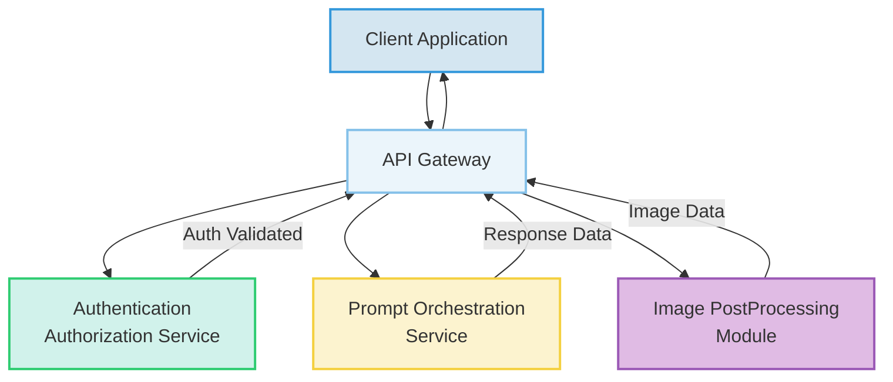
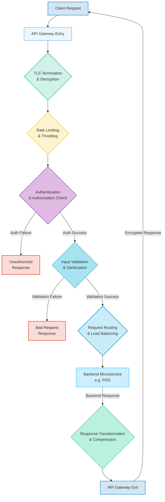

### Comprehensive Specification for the API Gateway Component in the Generative UI System

**Abstract:**
This document delineates the architectural design, operational mechanics, and strategic importance of the API Gateway, a foundational component within the overarching Backend Service Architecture BSA of the Generative UI System. Conceived as the singular ingress point for all client-initiated requests, the API Gateway is meticulously engineered to ensure robust security, optimized request routing, intelligent load distribution, and comprehensive operational observability. It functions as a resilient abstraction layer, effectively masking the inherent complexities of underlying microservices and facilitating secure, scalable, and high-performance communication between client applications and the system's core generative artificial intelligence functionalities. This specification elaborates on its critical features, fundamental design principles, and intricate interaction flows, with a paramount emphasis on adherence to stringent security protocols and fulfillment of demanding scalability requirements.

**I. Introduction and Strategic Role of the API Gateway**
The API Gateway serves as the architectural "front door" of the Generative UI System's Backend Service Architecture BSA. Its strategic placement at the perimeter of the backend infrastructure allows it to centralize numerous cross-cutting concerns that would otherwise need to be redundantly implemented across individual microservices. This centralization significantly enhances consistency, reduces development overhead, and fortifies the system's overall security posture and operational efficiency. It provides a unified and stable interface to clients, abstracting the dynamic topology and granular functionalities of the underlying microservices that comprise the BSA.

**II. Key Functional Capabilities**
The API Gateway integrates a suite of advanced functionalities critical for managing and securing client-backend interactions:

*   **Request Routing and Load Balancing:** The Gateway intelligently directs incoming client requests to the appropriate backend microservice instances based on predefined rules, request parameters, and service availability. This includes dynamic routing capabilities and sophisticated load balancing algorithms e.g., round-robin, least-connections, weighted distributions to ensure optimal resource utilization and even traffic distribution across redundant service instances.
    *   **Routing Latency `L_{routing}`:** The time taken to identify and forward a request to the correct backend service, ideally `L_{routing} \to 0`.
    *   **Load Balancing Efficiency `\eta_{LB}`:** A measure of how evenly traffic is distributed, calculated as `1 - (\sigma_{load} / \bar{load})`, where `\sigma_{load}` is the standard deviation of load across instances and `\bar{load}` is the average load.
*   **Authentication and Authorization Initial Validation:** While the Authentication and Authorization Service AAS handles definitive user identity and permission management, the API Gateway performs initial, lightweight authentication checks. This typically involves validating the presence and basic structure of authentication tokens e.g. JWTs and rejecting malformed or missing credentials before they consume backend resources.
    *   **Token Validation Rate `V_{rate}`:** The rate at which tokens are validated, `V_{rate} = N_{validated} / \Delta t`.
*   **Rate Limiting and Throttling:** To prevent abuse, resource exhaustion, and ensure fair usage, the Gateway implements robust rate limiting mechanisms. It defines limits on the number of requests a client or user can make within a specified timeframe. Throttling dynamically queues or delays requests when limits are exceeded, ensuring system stability.
    *   **Requests Per Second Limit `RPS_{limit}`:** A configurable threshold for incoming requests.
    *   **Burst Limit `B_{limit}`:** The maximum number of requests allowed above `RPS_{limit}` over a short period.
    *   The drop probability `P_{drop}` when `CurrentRPS > RPS_{limit}`.
*   **Request/Response Transformation:** The Gateway can modify incoming requests before forwarding them to backend services and outgoing responses before sending them to clients. This includes header manipulation, payload restructuring e.g. converting XML to JSON, schema validation, and API versioning.
    *   **Transformation Latency `L_{transform}`:** The overhead introduced by transformation operations.
    *   **Schema Validation Success Rate `SVR`:** The percentage of requests conforming to expected schemas.
*   **DDoS and Security Protection:** Acting as a crucial line of defense, the API Gateway integrates Web Application Firewall WAF capabilities to detect and mitigate common web vulnerabilities e.g., SQL injection, cross-site scripting XSS. It also provides Layer 7 Distributed Denial of Service DDoS protection, filtering malicious traffic and ensuring service availability.
    *   **Malicious Request Block Rate `B_{malicious}`:** The proportion of malicious requests successfully blocked.
*   **Monitoring, Logging, and Tracing:** The Gateway provides a centralized point for collecting critical operational telemetry. It logs all incoming and outgoing requests, their metadata, and response times, feeding this data into the Realtime Analytics and Monitoring System RAMS for performance analysis, anomaly detection, and debugging. Distributed tracing headers are injected or propagated.
    *   **Log Ingestion Rate `LIR`:** The volume of logs processed per unit time.
*   **Caching:** For frequently accessed or computationally expensive but infrequently changing data, the API Gateway can implement caching mechanisms. This reduces the load on backend services, improves response times for clients, and enhances overall system responsiveness.
    *   **Cache Hit Ratio `CHR`:** The percentage of requests served from the cache, `CHR = N_{cache\_hits} / N_{total\_requests}`.
*   **TLS Termination:** The Gateway terminates Secure Sockets Layer/Transport Layer Security TLS connections, decrypting incoming requests and encrypting outgoing responses. This offloads cryptographic processing from backend services and simplifies certificate management, ensuring secure communication between clients and the Gateway.
    *   **TLS Handshake Latency `L_{TLS}`:** The time taken to establish a secure connection.

**III. Design Principles**
The API Gateway is architected guided by several core principles:
*   **Scalability:** Designed to handle increasing traffic volumes and new service integrations horizontally, without significant performance degradation.
*   **Resilience:** Incorporates mechanisms like circuit breakers, timeouts, and automatic retries to prevent cascading failures and ensure continued operation even when some backend services are experiencing issues.
*   **Security:** Employs a defense-in-depth strategy, providing multiple layers of protection against various cyber threats.
*   **Observability:** Exposes comprehensive metrics, logs, and traces to provide deep insights into its operational health and performance characteristics.
*   **Maintainability:** Built with modularity and extensibility in mind, allowing for easy updates, configuration changes, and introduction of new functionalities.
*   **Low Latency:** Optimized for minimal processing overhead to ensure fast response times for client requests.

**IV. Interaction Flows**

**A. Client to API Gateway to Backend Services Simplified Flow**
This diagram illustrates the fundamental role of the API Gateway as the central orchestrator for client-backend communication, routing requests to relevant core services.

**B. Detailed Request Lifecycle through API Gateway**
This flow elucidates the granular steps an incoming client request undergoes as it traverses the API Gateway before reaching its intended backend microservice and the subsequent journey of the response.

**V. Metrics and Performance Considerations**
The performance of the API Gateway is continuously monitored using key metrics:
*   **Throughput `T_{gateway}`:** The total number of requests successfully processed per unit of time. It can be formalized as `T_{gateway} = (\sum R_{in}) - (\sum R_{drop}) - (\sum R_{error})`, where `R_{in}` are incoming requests, `R_{drop}` are dropped due to rate limiting/DDoS, and `R_{error}` are those leading to an error response from the gateway.
*   **Latency `L_{gateway}`:** The end-to-end time taken for a request to pass through the Gateway, excluding backend processing time. This is composed of `L_{gateway} = T_{TLS\_handshake} + T_{processing} + T_{routing} + T_{backend\_wait\_queue}`.
*   **Error Rates:** The percentage of requests resulting in various error codes e.g. 4xx, 5xx, generated by the Gateway itself.
*   **Resource Utilization:** CPU, memory, and network I/O consumption, indicating the Gateway's operational overhead.

**VI. Security Implementations**
*   **Web Application Firewall WAF Rules:** Dynamic rule sets are deployed to protect against known attack vectors and zero-day exploits.
*   **JSON Web Token JWT Validation:** Cryptographic verification of JWTs for integrity and authenticity, ensuring tokens have not been tampered with.
*   **Input Schema Validation:** Enforcing strict schema validation for all incoming request payloads to prevent malformed data from reaching backend services.
*   **DDoS Scrubbing:** Integration with specialized DDoS protection services that can filter and clean large volumes of malicious traffic.
*   **Vulnerability Management:** Regular security audits and penetration testing cycles `V_{score}(system)` are conducted to proactively identify and remediate vulnerabilities.

**VII. Integration with Other BSA Components**
The API Gateway maintains tight integrations with several other components of the Backend Service Architecture BSA:
*   **Authentication & Authorization Service AAS:** For delegated authentication decisions and granular authorization checks that require deeper user context.
*   **Realtime Analytics and Monitoring System RAMS:** All operational logs, metrics, and tracing data generated by the Gateway are forwarded to RAMS for centralized collection, analysis, and visualization.
*   **Billing & Usage Tracking Service BUTS:** The Gateway can contribute data on API call counts, data transfer volumes, and resource consumption to the BUTS for monetization and quota enforcement.
*   **Content Moderation & Policy Enforcement Service CMPES:** The Gateway can perform initial filtering of requests based on basic policy rules, redirecting or blocking content that is overtly malicious or violates high-level policies before it reaches deeper processing. This enables early threat detection `F_{safety}(p_{raw}) = Blocked`.