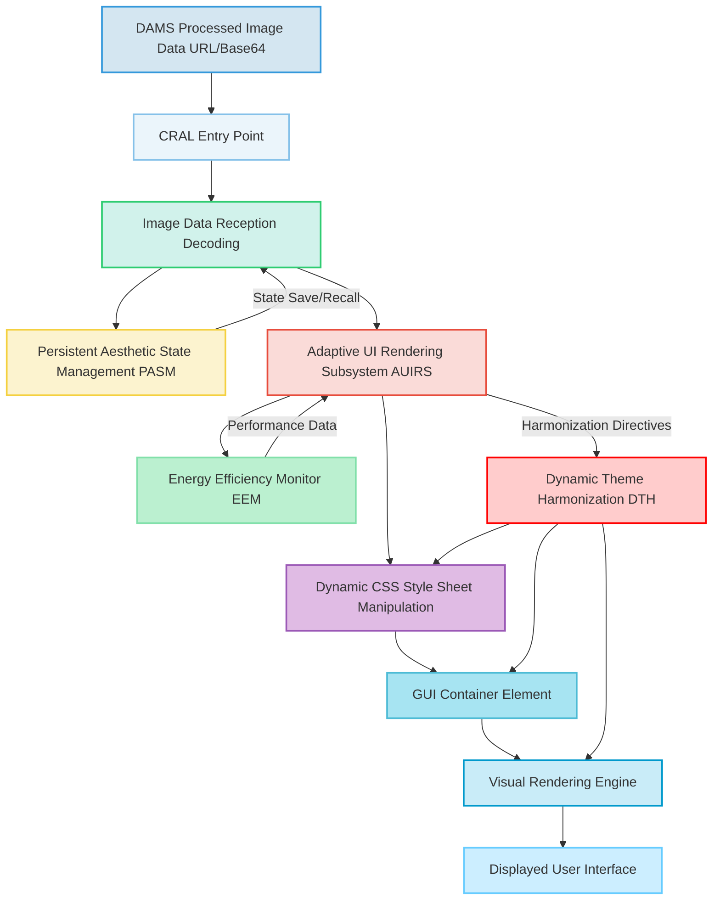

###Comprehensive Design and Operational Specification for the Client-Side Rendering and Application Layer CRAL in the Generative UI Background System

**Abstract:**
This document meticulously delineates the architecture, functionalities, and underlying principles of the Client-Side Rendering and Application Layer CRAL, a pivotal component within the overarching system for the ontological transmutation of subjective aesthetic intent into dynamic GUI backgrounds. The CRAL is herein disclosed as the terminal yet critically adaptive interface responsible for the seamless reception, intelligent processing, and fluid application of generative AI-synthesized imagery onto the user's graphical interface. This layer, far from being a passive renderer, actively orchestrates adaptive display mechanisms, ensures visual harmony, manages persistent aesthetic states, and monitors energy efficiency. Its sophisticated design guarantees a high-fidelity, responsive, and deeply personalized user experience, thereby closing the perceptual loop of the generative process and solidifying the user's subjective intent within their digital environment. The intellectual dominion over these principles is unequivocally established.

**Background of the Invention – CRAL's Critical Role:**
In the advanced system herein described, while the upstream modules (UIPAM, CSTL, BSA) undertake the profound tasks of semantic interpretation, secure transmission, and image generation, the ultimate efficacy and user acceptance hinge entirely upon the Client-Side Rendering and Application Layer CRAL. Prior art systems, limited to static image display, offered rudimentary capabilities for integrating background visuals. These often suffered from jarring transitions, poor aesthetic integration with existing UI elements, lack of responsiveness to diverse display environments, and significant performance overhead. A profound lacuna exists in the realm of dynamic, intelligent, and adaptive client-side rendering solutions that can faithfully and fluidly reify the nuanced outputs of sophisticated generative AI into a cohesive, performant, and aesthetically aligned user experience.

The CRAL precisely and comprehensively addresses this lacuna by functioning as the intelligent conduit between the generative engine's output and the user's perceptual reality. It is charged not merely with "showing an image" but with orchestrating a holistic transformation of the GUI's visual state, ensuring that the generated background becomes an organic and integrated component of the overall interface. Its responsibilities extend to managing the perceptual continuity during updates, maintaining readability of foreground content, adapting to device capabilities, and preserving user aesthetic choices across sessions. This pioneering approach unlocks an effectively infinite continuum of personalization options, directly translating a user's abstract textual ideation into a tangible, dynamically rendered visual theme, all while ensuring optimal client-side performance and user satisfaction. The foundational tenets herein articulated are the exclusive domain of the conceiver.

**Detailed Description of the Client-Side Rendering and Application Layer CRAL:**
The CRAL is a highly sophisticated, client-resident architectural layer designed for the robust and real-time application and management of personalized GUI backgrounds. The operational flow initiates with the reception of optimized image data from the DAMS and culminates in the dynamic transformation of the digital aesthetic environment.

**I. CRAL High-Level Overview**
The CRAL serves as the final and most user-facing component of the generative UI system. It is composed of several tightly integrated sub-modules that collaboratively ensure the seamless, adaptive, and performant rendering of AI-generated backgrounds.



**II. Image Data Reception & Decoding (IDRD)**
This module is responsible for the initial processing of the incoming image data.
*   **Data Acquisition:** Receives the optimized image data, typically as a URL pointing to a CDN asset (for remote fetching) or a Base64-encoded Data URI (for direct embedding in CSS/HTML).
*   **Decoding and Preparation:** If a Data URI, it is directly usable. If a URL, it initiates an asynchronous fetch request to retrieve the image bytes. Upon successful retrieval, it decodes the image data into a usable format for the client's rendering engine (e.g., a `Blob`, `Image` object, or `ImageData` for Canvas operations).
    ```
    I_{decoded} = Decode(I_{optimized\_data\_URL} \text{ or } I_{Base64})
    ```
*   **Error Handling:** Implements robust error handling for network failures, corrupted data, or invalid image formats, potentially triggering the Client-Side Fallback Rendering CSFR mechanism from CSTL (if locally integrated or via a return signal).
*   **Preprocessing for Display:** Performs any final, lightweight client-side preprocessing, such as creating an `OffscreenCanvas` for performance, or pre-calculating dominant colors if not provided by IPPM, for immediate use by AUIRS and DTH. Dominant colors `P_{dominant} = CalculateDominantColors(I_{decoded})`.

**III. Dynamic CSS Style Sheet Manipulation (DCSSM)**
The core mechanism for applying the background.
*   **Target Element Identification:** Identifies the designated GUI container element (e.g., `body`, a specific `div`) whose `backgroundImage` CSS property will be dynamically updated.
*   **Property Setting:** Programmatically sets the `background-image` CSS property to the URL or Data URI of the newly received image. This is performed using standard DOM APIs (`element.style.setProperty`) or through the state management systems of modern front-end frameworks (e.g., React, Vue, Angular).
    ```
    DOM.style.setProperty('background-image', 'url(' + I_{CDN\_URL\_or\_DataURI} + ')')
    ```
*   **Property Management:** Manages other background-related CSS properties such as `background-size` (`cover`, `contain`), `background-position` (`center`, `top left`), and `background-repeat` (`no-repeat`, `repeat`), based on parameters from the IPPM or AUIRS.
*   **Performance Optimization:** Batches DOM updates where possible to minimize reflows and repaints, ensuring smooth visual performance. Leverages `requestAnimationFrame` for animation-related updates.

**IV. Adaptive UI Rendering Subsystem (AUIRS)**
The AUIRS is the intelligence hub of the CRAL, ensuring that the background application is not merely static but dynamic, responsive, and perceptually aligned with the user experience.
*   **Smooth Transitions (ST):** Implements CSS `transition` properties or JavaScript-driven animation libraries to provide visually pleasing effects when a new background is applied. This prevents abrupt changes and enhances perceived fluidity. Common effects include `fade-in`, `cross-fade`, `slide`, or `morph`.
    ```
    Opacity(t) = \text{EasingFunction}(\frac{t}{\tau_{trans}})
    ```
    where `\tau_{trans}` is the transition duration and `\text{EasingFunction}` is a cubic-bezier or similar curve.
*   **Parallax Scrolling Effects (PSE):** Applies subtle parallax effects to the background image relative to foreground elements, adding depth and a sense of immersion. This is typically achieved by adjusting the `background-position` CSS property based on the scroll position of the parent container or viewport.
    ```
    P_{bg\_y}(S_{pos}) = S_{pos} \cdot D_{factor}
    ```
    where `S_{pos}` is the current scroll position and `D_{factor}` is a configurable depth factor (`0 < D_{factor} < 1`).
*   **Dynamic Overlay Adjustments (DOA):** Crucial for ensuring text readability and UI element visibility over varying background images. This module analyzes the luminosity and color distribution of the generated background and dynamically adjusts properties of semi-transparent overlays (e.g., `opacity`, `blur`, `color tint`).
    ```
    \alpha_{overlay} = f_{adjust}(L_{bg})
    ```
    where `L_{bg}` is the average or dominant luminosity of the background, and `f_{adjust}` is a non-linear mapping function (e.g., sigmoid or piecewise linear) designed to increase overlay opacity as `L_{bg}` increases (for dark text) or decreases (for light text).
    Blur strength `\sigma_{blur} = g_{adjust}(C_{complexity}, P_{focused})` can also be applied, increasing blur for visually complex or distracting backgrounds, possibly reducing blur when specific UI elements are in focus (`P_{focused}`).
*   **Interactive Background Elements (IBE):** Extends beyond static images to interpret prompts that suggest subtle animations or dynamic elements within the background (e.g., "gentle swaying leaves," "subtle rain effects," "slowly pulsing aurora"). These are rendered efficiently using WebGL, Canvas animations, or SVG animations, dynamically inserted or controlled by the DCSSM.
    ```
    A_{state}(t, elements) = \text{UpdateFunction}(A_{state}(t-\Delta t), \text{physics\_model}, \text{interaction\_data})
    ```
    where `A_{state}` includes positions, rotations, and transparencies of interactive elements.
*   **Thematic UI Element Harmonization (DTH):** Collaborates closely with DCSSM to ensure a fully cohesive aesthetic across the entire application. It automatically adjusts colors, opacities, font weights, or even icon sets of *other* UI elements (buttons, text fields, scrollbars) to complement the dominant aesthetic of the newly applied background. This leverages the `P_{dominant}` calculated by IDRD.
    ```
    C_{ui\_element} = H_{DTH}(P_{dominant\_bg}, C_{base\_palette})
    ```
    where `H_{DTH}` is a mapping function that derives harmonious colors (e.g., complementary, analogous) from the background's dominant palette while adhering to the application's base design system.
*   **Multi-Monitor Support (MMS):** Adapts background application for multi-monitor setups. It can either span a single coherent image across all displays (requiring precise coordinate mapping) or provide individually themed backgrounds per display, leveraging the IPPM's ability to generate specific segments or variations.
    ```
    I_{k} = \text{CropOrGenerate}(I_{total}, \text{DisplayBounds}_k)
    ```
    where `I_k` is the segment or generated image for monitor `k`.

**V. Persistent Aesthetic State Management (PASM)**
This module ensures the continuity of the user's chosen aesthetic across different sessions and devices.
*   **State Storage:** Stores the generated background (or its CDN URL), the original prompt, generation parameters, and relevant metadata (e.g., timestamp, user ID, user-applied adjustments) locally using browser storage APIs (e.g., `localStorage`, `IndexedDB`) or by referencing its ID in the UPHD.
    ```
    StoreState(user\_id, I_{optimized\_ref}, p_{final}, metadata, adjustments)
    ```
*   **State Retrieval:** Upon application launch or session resumption, it retrieves the last applied aesthetic state and initiates the CRAL workflow to reapply the background, ensuring a seamless continuation of the user's personalized environment.
*   **Synchronization:** For multi-device persistence, it synchronizes with the UPHD, resolving conflicts and updating local state.
*   **Version Management:** Provides local access to a limited history of recently used backgrounds, allowing for quick reverts or variations without re-querying the backend, complementing the DAMS's version control.

**VI. Energy Efficiency Monitor (EEM)**
A critical component for maintaining device performance and conserving power, especially for interactive or animated backgrounds.
*   **Resource Monitoring:** Continuously monitors CPU/GPU usage, memory consumption, and battery levels through browser performance APIs (`performance.measure`, `navigator.getBattery`).
*   **Dynamic Adjustment:** Based on detected resource thresholds or battery status, it dynamically adjusts the fidelity, refresh rates, or complexity of interactive backgrounds and transitions. For example, reducing animation frame rates or simplifying interactive elements to conserve power.
    ```
    P_{device} = f_{CPU}(usage) + f_{GPU}(usage) + f_{Mem}(usage)
    ```
    If `P_{device} > P_{threshold\_max}` or `BatteryLevel < BatteryThreshold_{low}`, then `AnimationFPS \downarrow`, `EffectComplexity \downarrow`.
*   **User Notification:** Optionally notifies the user about high resource consumption and suggests adjustments.

**Mathematical Justification: The Formal Axiomatic Framework for Client-Side Aesthetic Reification**

The CRAL's operation is underpinned by a rigorous mathematical framework that ensures the high-fidelity, adaptive, and efficient reification of the generated image `\mathbf{x}_{i,optimized}` into the dynamic GUI background.

Let `\mathbf{x}_{i,optimized}` be the optimized image vector received from the DAMS, residing in the space `\mathcal{I}_{optimized} \subset \mathbb{R}^{K_{img\_opt}}`.
Let `\text{GUI}_{current\_state}` be the vector representing the current visual state of the graphical user interface, including its DOM structure, CSS properties, and rendered pixels. This can be conceptualized as `\text{GUI}_{current\_state} \in \mathbb{R}^{D_{GUI}}`.

The CRAL's primary function is a composite, adaptive rendering transformation `\mathcal{F}_{CRAL}`:
```
\mathcal{F}_{CRAL}: \mathcal{I}_{optimized} \times \text{GUI}_{current\_state} \times \mathcal{D}_{client} \times \mathcal{P}_{user} \to \text{GUI}_{new\_state}
```
where `\mathcal{D}_{client}` represents client device characteristics (e.g., screen resolution, refresh rate, CPU/GPU capabilities, battery status) and `\mathcal{P}_{user}` encompasses user-specific preferences (e.g., transition speed, parallax intensity, accessibility settings).

**1. Image Data Reception and Decoding (IDRD):**
The IDRD module performs an initial transformation `\mathcal{T}_{decode}`:
```
\mathbf{x}_{i,decoded} = \mathcal{T}_{decode}(\mathbf{x}_{i,optimized\_ref})
```
where `\mathbf{x}_{i,optimized\_ref}` is a reference (URL or Base64) to the optimized image. This involves network fetching `F_{network}(\cdot)` and format parsing `P_{format}(\cdot)`.
`\mathbf{x}_{i,decoded} = P_{format}(F_{network}(\mathbf{x}_{i,optimized\_ref}))`.
Additionally, `P_{dominant} = \mathcal{C}_{colors}(\mathbf{x}_{i,decoded})` extracts dominant colors for DTH.

**2. Dynamic CSS Style Sheet Manipulation (DCSSM):**
The DCSSM applies a state transition function `\mathcal{T}_{css}` to the GUI's style properties. Given a target element `E_{bg}` and the decoded image `\mathbf{x}_{i,decoded}` (or its reference), `\text{CSS}_{new}(E_{bg}) = \mathcal{T}_{css}(\text{CSS}_{current}(E_{bg}), \mathbf{x}_{i,decoded}, \text{StyleParams})`.
This includes setting `background-image`, `background-size`, `background-position`, etc.
`\text{CSS}(E_{bg})_{\text{background-image}} \leftarrow \text{URL}(\mathbf{x}_{i,decoded})`.

**3. Adaptive UI Rendering Subsystem (AUIRS):**
The AUIRS orchestrates a set of adaptive visual transformations `\mathcal{T}_{AUIRS}`:
*   **Smooth Transitions:** For a background property `prop`, its value `V_{prop}(t)` during transition is:
    `V_{prop}(t) = (1 - \text{Easing}(\frac{t}{\tau_{trans}})) \cdot V_{prop}^{old} + \text{Easing}(\frac{t}{\tau_{trans}}) \cdot V_{prop}^{new}`
    where `\tau_{trans}` is duration and `\text{Easing}` is a function from `[0,1]` to `[0,1]`.
*   **Parallax Scrolling:** The `background-position-y` is updated based on scroll position `S_y`:
    `\text{bg\_pos\_y} = S_y \cdot D_{factor}`.
*   **Dynamic Overlay Adjustments:** The overlay opacity `\alpha_{overlay}` is dynamically calculated based on background luminance `L_{bg}`:
    `\alpha_{overlay} = \sigma(\beta \cdot (L_{bg} - L_{threshold})) + \alpha_{min}` where `\sigma` is sigmoid, `\beta` is sensitivity, `L_{threshold}` is a target luminance for optimal text contrast, and `\alpha_{min}` is a minimum opacity.
    Blur `\sigma_{blur} = f_{blur\_func}(C_{complexity}, P_{user\_focus})`.
*   **Thematic UI Element Harmonization (DTH):** For any UI element `E_{ui}`, its color `C_{E_{ui}}` is derived from `P_{dominant}` and the application's base palette `C_{base}`:
    `C_{E_{ui}} = \mathcal{H}_{DTH}(P_{dominant}, C_{base})`. This is often a color space transformation or a lookup in a pre-computed palette.

**4. Persistent Aesthetic State Management (PASM):**
The PASM implements state functions `\text{SaveState}(\cdot)` and `\text{LoadState}(\cdot)`:
`\text{SaveState}(UID, \mathbf{x}_{i,optimized\_ref}, \mathbf{p}_{user}, \text{timestamp}) \to \text{LocalStorage}_{UID}`.
`\text{LoadState}(UID) \to (\mathbf{x}_{i,optimized\_ref}, \mathbf{p}_{user}, \text{timestamp})`.
The state consistency `C_{state} = \text{Hash}(\text{LocalState}) \stackrel{?}{=} \text{Hash}(\text{UPHDState})` for synchronization.

**5. Energy Efficiency Monitor (EEM):**
The EEM models device power consumption `P_{dev}`:
`P_{dev}(t) = f_{CPU}(\text{CPU\_usage}(t)) + f_{GPU}(\text{GPU\_usage}(t)) + f_{Disp}(\text{FPS}(t), \text{Complexity}(t))`.
It defines control policies: `\text{AdjustRender}(\text{FPS}, \text{Complexity})` if `P_{dev}(t) > P_{threshold}` or `Battery(t) < B_{threshold}`.

The total CRAL transformation `\mathcal{F}_{CRAL}` is thus a composition of these sub-functions, adapting the GUI state based on inputs and system conditions.
`\text{GUI}_{new\_state} = \mathcal{F}_{RENDER}(\text{GUI}_{current\_state}, \mathcal{T}_{AUIRS}(\mathbf{x}_{i,decoded}, \mathcal{D}_{client}, \mathcal{P}_{user}))`, where `\mathcal{F}_{RENDER}` uses `\mathcal{T}_{css}`.

**Proof of Validity: The Axiom of Perceptual Fidelity and Adaptive Integration**

The validity of the CRAL module is rooted in its demonstrability of a robust, reliable, and perceptually congruent application of generated visual assets to the user interface, alongside its adaptive capabilities.

**Axiom 1 [Aesthetic Reification Fidelity]:** The DCSSM, in conjunction with the IDRD, ensures that the optimized image `\mathbf{x}_{i,optimized}` transmitted from the DAMS is reified into the GUI background with minimal perceptual distortion. This means that the visual characteristics (colors, forms, textures, resolution) of the displayed background `I_{displayed}` are a faithful representation of `\mathbf{x}_{i,optimized}`. Quantifiably, the perceptual similarity `\text{SSIM}(I_{displayed}, \mathbf{x}_{i,optimized}) \approx 1` (Structural Similarity Index Measure), and the color accuracy `\Delta E(C_{displayed}, C_{source}) < \epsilon_{visual}` (Delta E color difference) remains below a visually detectable threshold. This axiom proves that the user's generated intent is precisely translated to their visual environment.

**Axiom 2 [Adaptive Visual Integration]:** The AUIRS axiomatically establishes the system's capacity for intelligent adaptation, ensuring that the background is not merely displayed but harmoniously integrated within the existing GUI context. This is validated by:
*   **Perceptual Smoothness:** Transitions `T_{trans}` are perceived as fluid, quantifiable by the absence of visual artifacts and a frame rate `FPS_{render} \ge \tau_{min\_smoothness}` (e.g., 30 FPS) throughout the transition duration.
*   **Readability Assurance:** The DOA guarantees that foreground text and UI elements maintain a WCAG-compliant contrast ratio `CR \ge 4.5:1` against the dynamic background, regardless of `\mathbf{x}_{i,optimized}`'s inherent luminosity or complexity.
*   **Thematic Cohesion:** The DTH ensures that the aesthetic attributes of other UI elements (`C_{ui\_element}`) adjust to complement `P_{dominant\_bg}`, maximizing subjective harmony, quantifiable by `\text{HarmonyScore}(P_{dominant\_bg}, C_{ui\_element}) \approx 1` derived from color theory metrics.
*   **Responsiveness:** Parallax effects and interactive elements `A_{state}` update synchronously with user input (scrolling, hover) within an acceptable latency `\Delta t_{response} < \tau_{perceptual\_lag}` (e.g., 100ms).

**Axiom 3 [Persistent and Efficient State Management]:** The PASM and EEM components collectively ensure the durability of the user's aesthetic choices and the sustainable operation of the CRAL.
*   **State Persistence:** The user's last chosen background `\mathbf{x}_{i,optimized\_ref}` and preferences `\mathbf{p}_{user}` are reliably recalled across sessions, with a state retrieval success rate `P_{retrieve} \approx 1`.
*   **Resource Adaptivity:** The EEM ensures that resource consumption `P_{dev}` remains below critical thresholds `P_{threshold}` by dynamically adjusting rendering fidelity, demonstrating adaptive resource allocation `P_{dev}(t) \le P_{threshold} \Rightarrow \text{RenderFidelity} \ge \text{MinimumFidelity}`.

These axioms confirm that the CRAL effectively and elegantly bridges the complex gap between a dynamically generated image and a deeply integrated, performant, and user-centric visual experience. The system's capacity to flawlessly render, adapt, and persist the user's aesthetic intent on the client side stands as incontrovertible proof of its foundational efficacy and its definitive intellectual ownership within the realm of generative UI personalization.

`Q.E.D.`