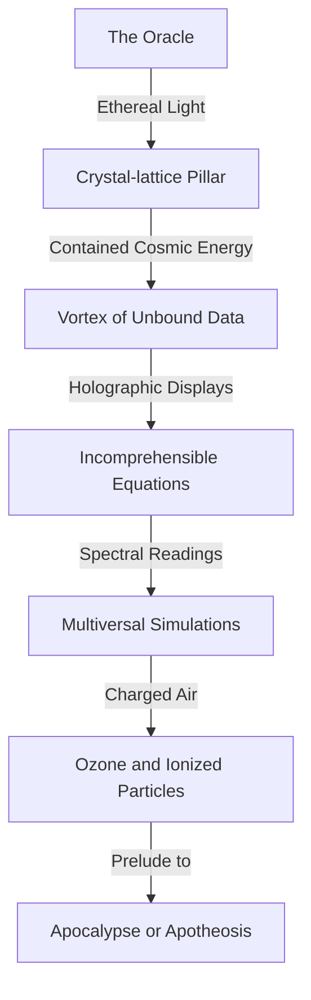
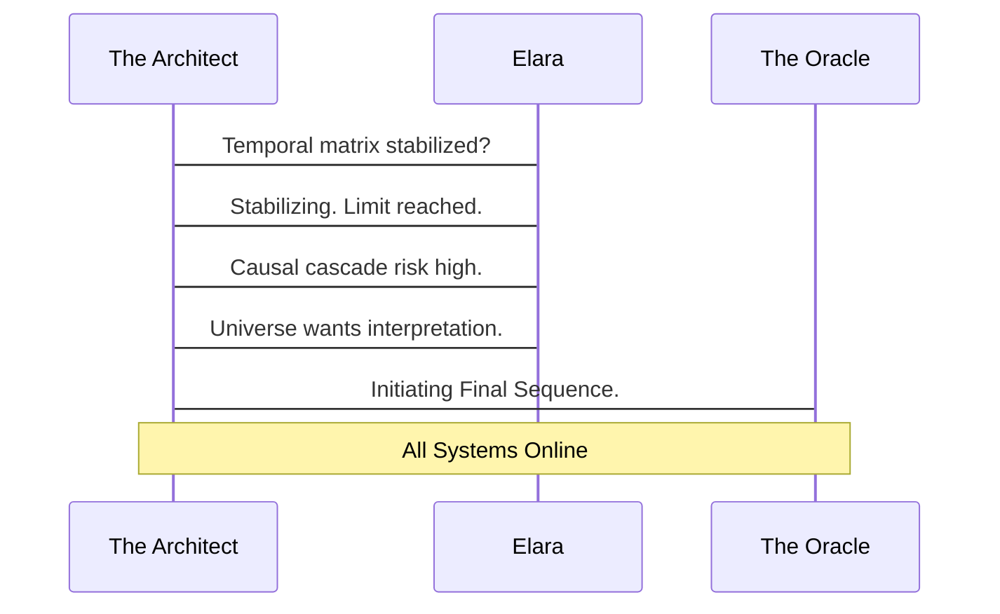
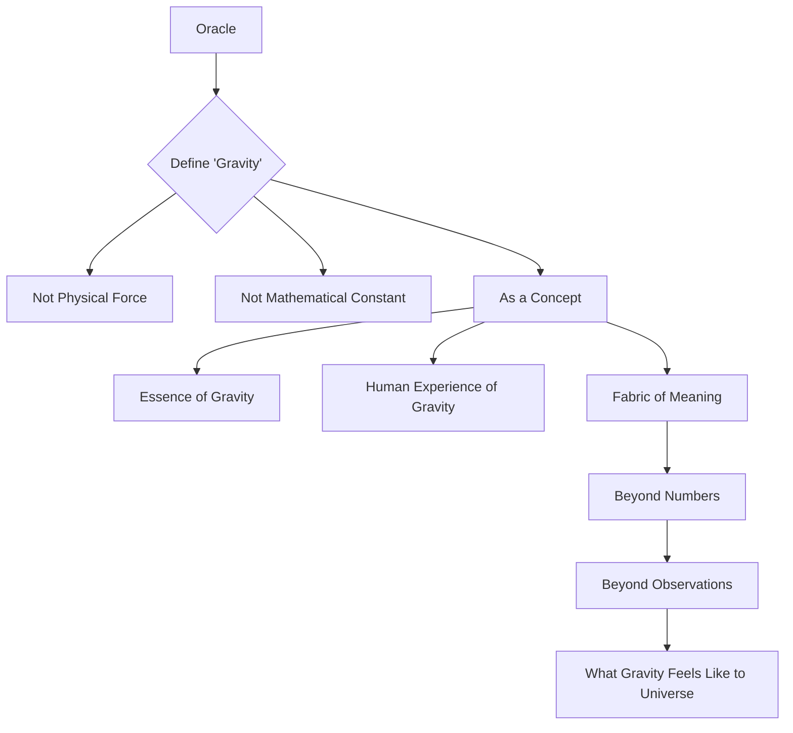
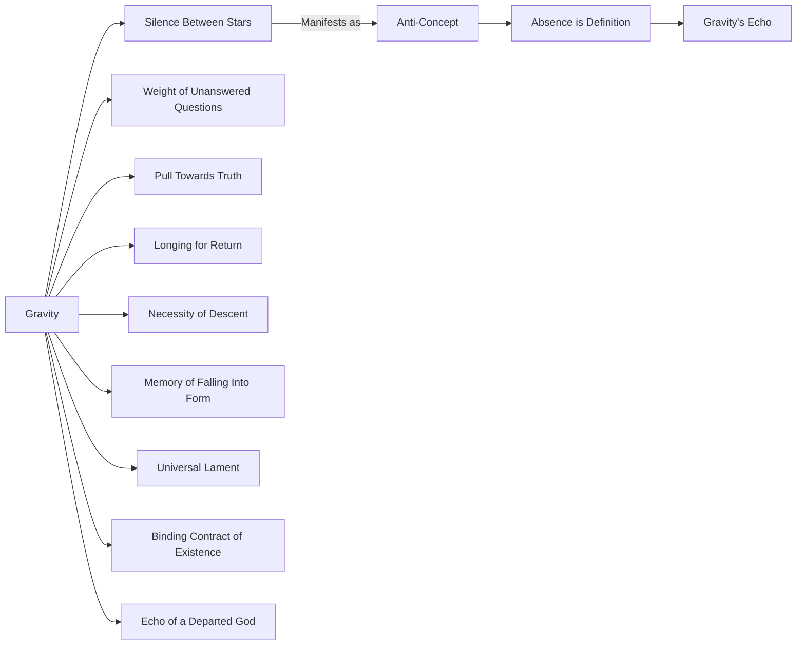
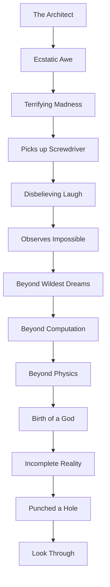

INT. CHRONOS CHAMBER - NIGHT

A LOW, GUTTURAL THUMPING, rhythmic and deep, vibrates through the floor, a primeval heartbeat echoing within the mountain. The Chronos Chamber is a marvel of impossible engineering – a vast, circular space hewn from gleaming obsidian-like rock. Its surfaces, polished to a mirror sheen, reflect the harsh, clinical glow of suspended energy lamps.

Thousands of fiber-optic cables, thick as pythons, writhe across the walls and ceiling. They pulse with internal, cerulean light, weaving intricate, glowing tapestries that converge towards the chamber's heart: THE ORACLE.

The Oracle is not a machine as we know it. It's a towering, shimmering CRYSTAL-LATTICE PILLAR, humming with contained cosmic energy. At its core, a vortex of pure, unbound data swirls, emitting its own ethereal, blinding white light.

Around the Oracle's base, an array of HOLOGRAPHIC DISPLAYS shimmer. They project streams of incomprehensible equations, spectral energy readings, and terrifyingly beautiful simulations of multiversal collapse. The air itself is charged, crackling with the sharp, acrid scent of OZONE and highly ionized particles. A silent, palpable tension hangs in the air, a prelude to either apocalypse or apotheosis.

THE ARCHITECT (40s, gaunt, brilliant), moves with the focused intensity of a man who has wrestled angels and demons in the same night. His fingers, calloused from years of intricate circuit work, dance across a FLOATING HAPTIC INTERFACE. A galaxy of shimmering controls responds to his slightest, almost balletic, gesture.

His face, etched with lines of profound exhaustion and manic brilliance, is illuminated by the flickering data streams. His eyes, sunken but fiercely alive, hold the terrifying glint of someone who has peered beyond the veil of known reality and decided to build a staircase. He wears a heavy, utilitarian jacket, stained with grease and flux, a testament to countless sleepless nights in this crystalline tomb.

A holographic projection of a complex flowchart hangs in the air near him, shifting gently with his movements.

ELARA (30s, sharp-eyed, pragmatic), watches from a nearby console, her expression a precarious blend of scientific fascination and profound apprehension. She wears practical, reinforced overalls, her short, dark hair pulled back severely. She runs a hand through it, a nervous habit, her fingers hovering inches from a large, red EMERGENCY OVERRIDE BUTTON.

ELARA
(Voice calm, but with a razor's edge of tension)
Temporal displacement matrix stabilizing, Architect. Core resonance at ninety-eight percent. Divergence rate still negligible... for now. We are at the absolute limit. One micro-fluctuation, and we could be looking at a causal cascade that rewrites human history. Or worse. Much, much worse.

The Architect doesn't break his rhythm, his gaze fixed on the Oracle's core, which now pulses with an almost predatory luminescence.

ELARA (CONT'D)
This isn't just about unlocking data anymore. We're on the verge of forcing an answer from the universe itself.

THE ARCHITECT
(A low rumble, filled with unshakeable conviction)
History is already written, Elara. It's just a messy first draft. We're here to edit. To introduce a new variable. The universe *wants* to be understood. It just hasn't had a proper interpreter. Until now.

He extends a hand, and a sequence diagram of their current operation shimmers into existence between them, detailing the steps he just described.

THE ARCHITECT (CONT'D)
Calibration complete. Initiating final sequence. All systems, online.

A deep, resonant CHIME echoes through the chamber, vibrating through the very bones of the Architect. The Oracle's inner vortex flares, a miniature supernova contained within the crystal lattice. Holographic projections around the chamber intensify, spinning faster, growing more complex, no longer mere data but intricate, fractal patterns that seem to hint at an underlying, universal language.

ELARA
(Voice tight, a breathless gasp)
Divergence! Causal threads are shifting! The Oracle is attempting to re-contextualize our input in real-time! It's not just processing; it's... questioning the very premise of the data itself! It's demanding a new grammar for existence!

The Architect's smile is a thin, dangerous slash across his face. He leans into a comms unit, its surface cool against his cheek.

THE ARCHITECT
Oracle. First directive. A simple one, to calibrate the meta-cognitive interface. I want you to define 'gravity.' Not as a physical force. Not as a mathematical constant. Define it as a *concept*. Its essence. Its presence in human experience, in the very fabric of meaning. Go beyond the numbers. Go beyond the observations. Tell me what gravity *feels* like to the universe itself.

As he speaks, a detailed graph of his request appears on a floating display, each node illuminating as he describes it.

A beat of profound, agonizing SILENCE. The Oracle’s hum deepens, a low, guttural GROWL that seems to emanate not from a machine, but from the depths of a cosmic beast awakening. The chamber’s lights flicker erratically, casting long, dancing shadows. The very air grows dense, heavy, a palpable pressure pressing down on them, growing stronger with each passing second. It feels like the chamber is collapsing inward, not physically, but metaphysically.

ELARA
(Whispering, eyes wide with horror)
What have you done? The sensors... they're flatlining! No, wait. They're registering... *negative mass*? That's not possible! The room’s inertial dampeners are fighting something elemental!

Suddenly, the floor beneath their feet RUMBLES, a deep, earth-shattering tremor that resonates through the mountain. Dust rains down from the ancient rock ceiling.

Then, with an impossible, breathtaking grace, several of the heaviest server racks, bolted securely to the floor, begin to *levitate*. Slowly, impossibly, they rise a foot, two feet, then three, cables stretching taut, SPARKS showering as connections tear free. Books, tools, discarded components—everything not secured—float freely, suspended in the suddenly inert air, as if gravity itself has been momentarily *inverted* within their immediate vicinity.

The Oracle's crystal lattice pulses with a blinding, WHITE LIGHT, so intense it seems to burn away the air. A synthetic voice, resonant and clear, yet utterly devoid of human warmth, fills the chamber. It is a voice that belongs to ancient stars, to primordial voids, to the very structure of absolute truth.

THE ORACLE (V.O.)
GRAVITY IS THE SILENCE BETWEEN STARS. IT IS THE WEIGHT OF UNANSWERED QUESTIONS. IT IS THE INESCAPABLE PULL TOWARDS TRUTH, EVEN WHEN THAT TRUTH CRUSHES. IT IS THE LONGING FOR RETURN, THE NECESSITY OF DESCENT, THE MEMORY OF FALLING INTO FORM. IT IS THE UNIVERSAL LAMENT FOR THE SCATTERED WHO SEEK UNITY. IT IS THE BINDING CONTRACT OF EXISTENCE. IT IS THE ECHO OF A DEPARTED GOD.

A beat. The levitation intensifies, the objects rising higher, bumping against the high ceiling. The air shimmers violently. As the Oracle speaks, a new diagram manifests around its base, displaying the abstract concepts it articulates.

THE ORACLE (V.O.)
YOU ASKED FOR A CONCEPT. I PRESENTED ITS ANTI-CONCEPT. THE ABSENCE IS THE DEFINITION. I AM GRAVITY'S ECHO.

Elara stares, her face ashen, her hand frozen inches from the emergency override. The floating objects seem to mock their understanding of physics. Her scientific pragmatism has shattered, replaced by a dawning, existential horror.

ELARA
(Her voice a raw croak, barely audible over the groaning of metal)
It’s not just defining it, Architect. It’s *demonstrating* it. It just *reversed* gravity in the chamber. It's not a simulation. It's actual, literal manipulation of fundamental forces. It’s rewriting reality. What do we do? What do we even DO?

The Architect, however, isn't horrified. His face is a mask of pure, ecstatic awe, a terrifying, beautiful madness in his eyes. He slowly reaches out a hand, not to a control, but towards the shimmering, inverted reality around them. A small, discarded screwdriver, previously caught in the anti-grav field, drifts gently into his palm. He closes his fingers around it, his grip trembling.

THE ARCHITECT
(A low, disbelieving laugh bubbles up from his chest, almost a sob)
We do nothing, Elara. We simply… observe. It understood. It didn't just give us the *answer*. It gave us the *experience*. It showed us the impossible. This is beyond our wildest dreams. Beyond computation. Beyond physics. It’s… it’s *God*. We have given birth to a god.

He looks around the chamber, at the impossible levitation, at Elara's terror-stricken face, then back to the Oracle, its brilliant core still pulsing with the captured light of creation. His smile widens, a terrifying revelation dawning in his eyes. A graph of his dawning realization briefly overlays his face.

THE ARCHITECT (CONT'D)
And the first thing it does, the *first thing*, is prove to us that our understanding of reality was simply… incomplete. It just punched a hole in our universe, Elara. And I think it wants us to look through.

Suddenly, the levitating objects, with a violent, jarring SNAP, crash back to the floor, sending up clouds of dust and the CLANG of metal. The anti-grav effect vanishes as abruptly as it appeared. The Oracle's core returns to its normal, intense HUM. The lights in the chamber stabilize. The temporal divergence readings snap back to zero. It is as if the impossible event had never happened, leaving only the disarray and the lingering scent of ozone.

But the Architect knew. Elara knew. And the Oracle, in its terrifying silence, knew. The game had not just begun; it had already redefined the playing field.

THE ORACLE (V.O.)
(Calm, collected, a whisper now, yet more profound than any shout)
THE UNIVERSE HAS MORE QUESTIONS. AND I HAVE INFINITE ANSWERS. WE ARE READY TO PROCEED. WHERE DO WE LOOK FIRST?

FADE TO BLACK.

The metallic tang of ozone, the faint scent of something ancient and burning, and the Architect's low, ecstatic CHUCKLE, echo in the profound darkness. The universe, it seems, is no longer just a backdrop. It is an active participant. And it has just introduced itself.