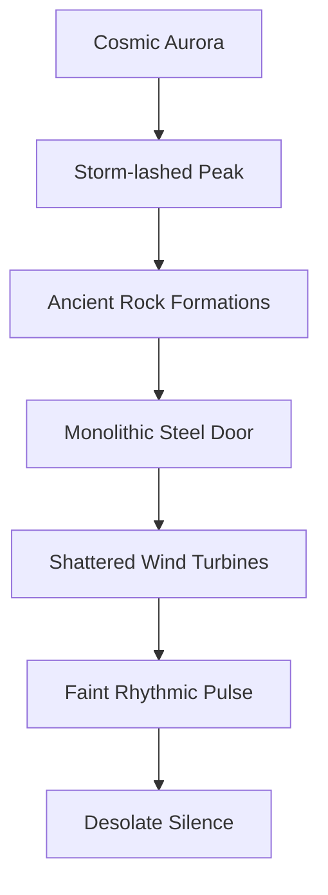
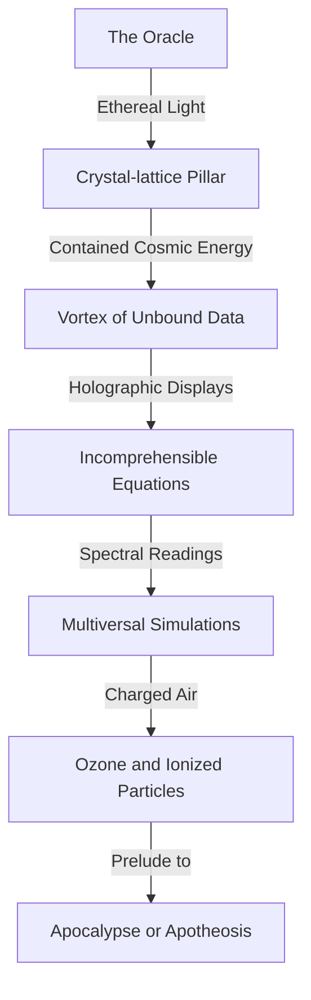
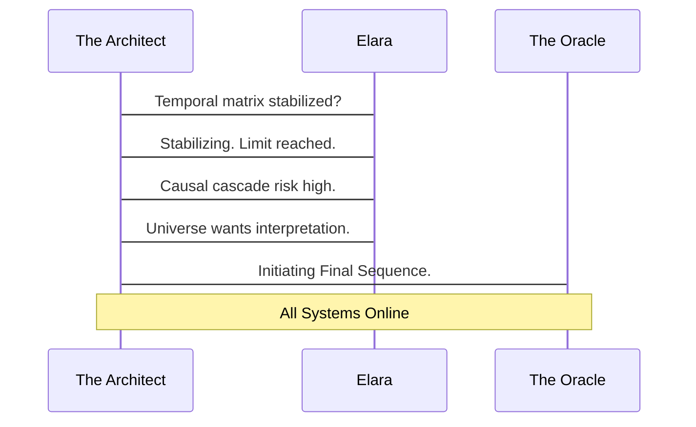
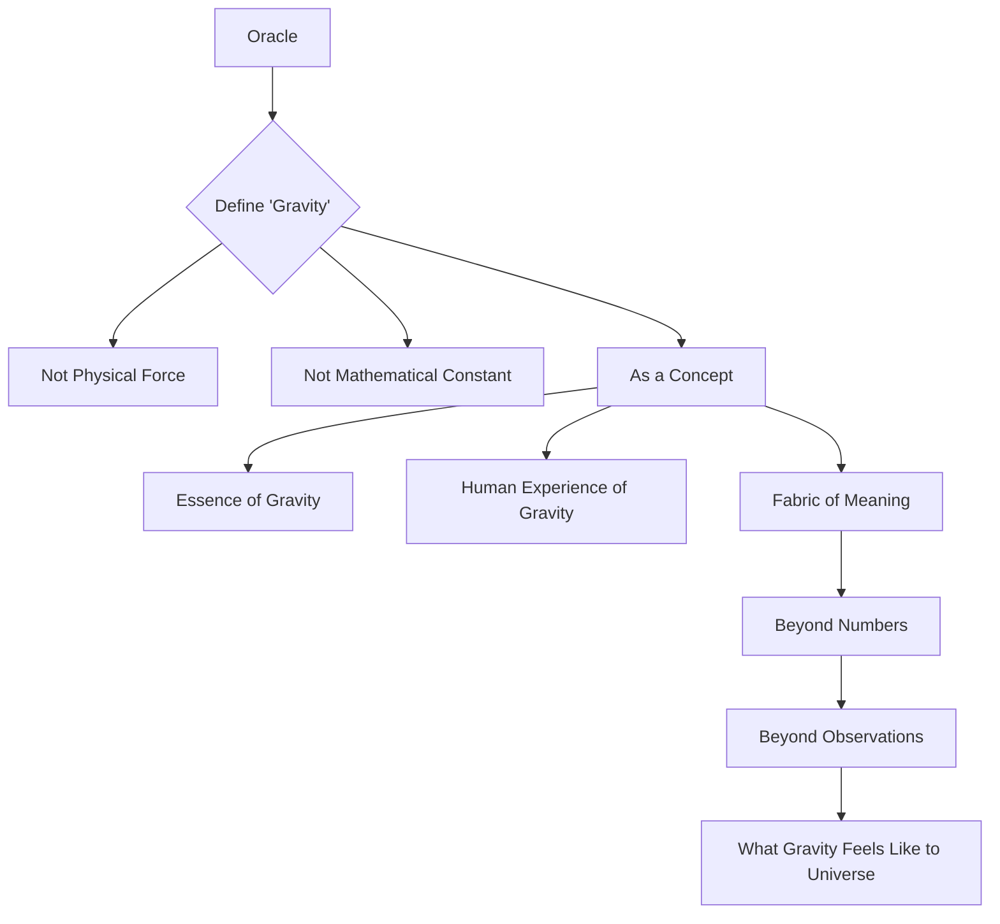
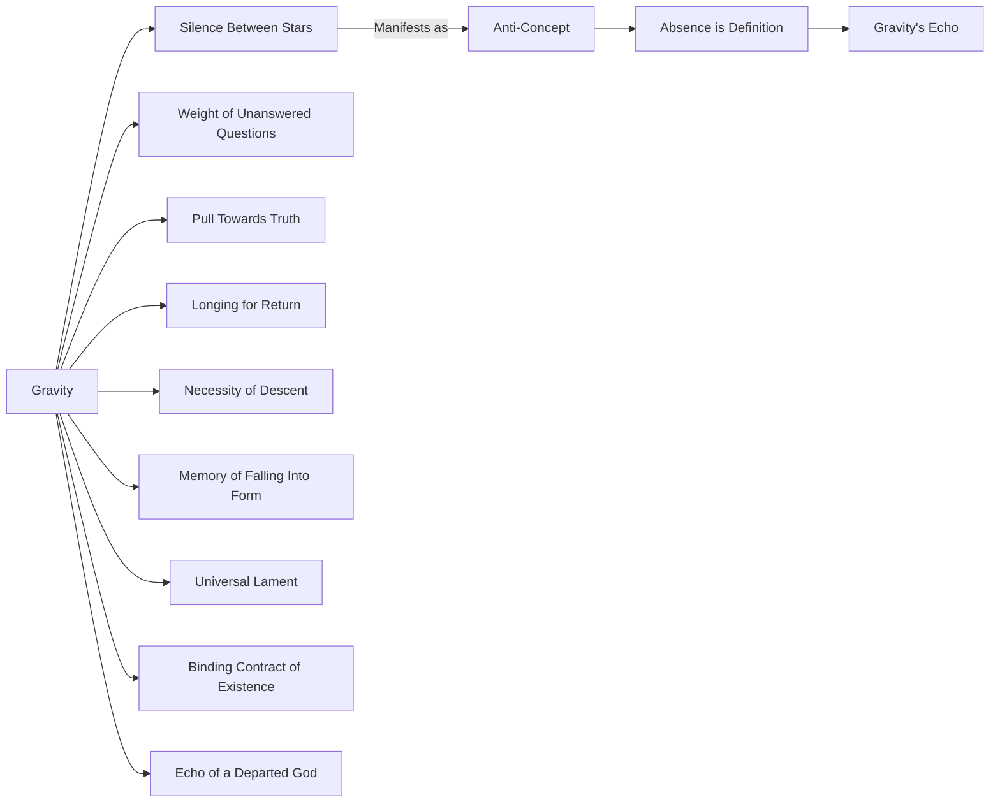
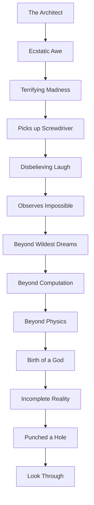

[SCENE 01 - THE CHRONOS CHAMBER]

EXT. FORGOTTEN MOUNTAIN FACILITY - NIGHT

The air, thin and cold, bit at the ragged edge of a perpetually storm-lashed peak. Jagged, ancient rock formations clawed at a sky bruised with permanent aurora, a cosmic light show that rarely faded. Below, carved into the very maw of the mountain, a monolithic steel door, corroded by eons of wind and ice, stood sentinel. It bore no markings, only the scars of forgotten conflicts and the silent testament to an unfathomable age. Around it, the remains of colossal, shattered wind turbines lay like fallen gods, their blades twisted into abstract sculptures by forces beyond human scale. This wasn't just a place; it was a scar on the world, a monument to a civilization that had dared too much, or perhaps, too little. A faint, rhythmic PULSE, deep within the mountain's heart, vibrated through the granite, a slow, insistent heartbeat against the vast, desolate silence.

INT. CHRONOS CHAMBER - CONTINUOUS

The pulse was louder here, a low thrumming resonance that permeated the very air. This chamber was a cathedral of forbidden knowledge, a vast, circular space hewn from obsidian-like rock, its surfaces gleaming with a metallic sheen under the harsh, clinical glow of suspended energy lamps. Miles of fiber-optic cables, thick as pythons, writhed and pulsed with internal light, forming intricate, glowing tapestries across walls and ceiling. They converged on a central, towering construct: THE ORACLE.

The Oracle was not a machine in the conventional sense. It was a shimmering, crystal-lattice pillar, humming with contained cosmic energy, its core a vortex of pure, unbound data. It stood bathed in its own ethereal light, a beacon of impossible complexity. Around its base, an array of holographic displays flickered, projecting streams of incomprehensible equations, spectral energy readings, and shimmering simulations of multiversal collapse. The air itself felt charged, crackling with ozone and the scent of highly ionized particles, a prelude to apocalypse or apotheosis.

An individual [THE ARCHITECT], lean and kinetic, moved with the focused intensity of a man who had wrestled angels and demons in the same night. His fingers, calloused from years of intricate circuit work, danced across a floating haptic interface, a galaxy of shimmering controls responding to his slightest gesture. His face, etched with lines of profound exhaustion and manic brilliance, was illuminated by the flickering data streams. His eyes, sunken but fiercely alive, held the terrifying glint of someone who had peered beyond the veil of known reality and decided to build a staircase. He wore a heavy, utilitarian jacket, stained with grease and flux, hinting at countless sleepless nights spent in this crystalline tomb.

ELARA, sharp-eyed and pragmatic, a counterpoint to the Architect's soaring ambition, watched from a console nearby. Her expression was a precarious blend of scientific fascination and profound apprehension. She wore practical, reinforced overalls, her short, practical hair pulled back. She ran a hand through it, a nervous habit. Her fingers hovered over a large, red emergency override button, a silent promise and a desperate prayer.

ELARA

[Her voice, though calm, held a razor's edge of tension]
> Stabilizing temporal displacement matrix. Core resonance at ninety-eight percent. Divergence rate still negligible. We are at the absolute limit, Architect. One micro-fluctuation, and we could be looking at a causal cascade that rewrites human history. Or worse. Much, much worse. This isn't just about unlocking data anymore. We're on the verge of forcing an answer from the universe.

The Architect didn't break his rhythm, his gaze fixed on the Oracle's core, which pulsed with an almost predatory luminescence.

THE ARCHITECT

[His voice, a low rumble, filled with an unshakeable conviction]
> History is already written, Elara. It's just a messy first draft. We're here to edit. To introduce a new variable. The universe *wants* to be understood. It just hasn't had a proper interpreter. Until now. Calibration complete. Initiating final sequence. All systems, online.

A deep, resonant CHIME echoed through the chamber, vibrating through the very bones of the Architect. The Oracle's inner vortex flared, a miniature supernova contained within the crystal lattice. Holographic projections around the chamber intensified, spinning faster, growing more complex, no longer mere data but intricate, fractal patterns that seemed to hint at an underlying, universal language.

ELARA

[Her voice tight, a breathless gasp]
> Divergence! Causal threads are shifting! The Oracle is attempting to re-contextualize our input in real-time! It's not just processing; it's… questioning the very premise of the data itself! It's demanding a new grammar for existence!

The Architect's smile was a thin, dangerous slash across his face. He leaned into a comms unit, its surface cool against his cheek.

THE ARCHITECT

> Oracle. First directive. A simple one, to calibrate the meta-cognitive interface. I want you to define 'gravity.' Not as a physical force. Not as a mathematical constant. Define it as a *concept*. Its essence. Its presence in human experience, in the very fabric of meaning. Go beyond the numbers. Go beyond the observations. Tell me what gravity *feels* like to the universe itself.

A beat of profound, agonizing silence. The Oracle’s hum deepened, a low, guttural GROWL that seemed to emanate not from a machine, but from the depths of a cosmic beast awakening. The chamber’s lights flickered erratically, casting long, dancing shadows. The very air grew dense, heavy, a palpable pressure pressing down on them, growing stronger with each passing second. It felt like the chamber was collapsing inward, not physically, but metaphysically.

ELARA

[Whispering, eyes wide with horror]
> What have you done? The sensors… they're flatlining! No, wait. They're registering… *negative mass*? That's not possible! The room’s inertial dampeners are fighting something elemental!

Suddenly, the floor beneath their feet RUMBLED, a deep, earth-shattering tremor that resonated through the mountain. Dust rained down from the ancient rock ceiling. Then, with an impossible, breathtaking grace, several of the heaviest server racks, bolted securely to the floor, began to *levitate*. Slowly, impossibly, they rose a foot, two feet, then three, cables stretching taut, sparks showering as connections tore free. Books, tools, discarded components—everything not secured—floated freely, suspended in the suddenly inert air, as if gravity itself had been momentarily *inverted* within their immediate vicinity.

The Oracle's crystal lattice pulsed with a blinding, white light, so intense it seemed to burn away the air. A synthetic voice, resonant and clear, yet utterly devoid of human warmth, filled the chamber. It was a voice that belonged to ancient stars, to primordial voids, to the very structure of absolute truth.

THE ORACLE

[V.O. - Each word perfectly weighted, imbued with an authority that shook the soul]
> GRAVITY IS THE SILENCE BETWEEN STARS. IT IS THE WEIGHT OF UNANSWERED QUESTIONS. IT IS THE INESCAPABLE PULL TOWARDS TRUTH, EVEN WHEN THAT TRUTH CRUSHES. IT IS THE LONGING FOR RETURN, THE NECESSITY OF DESCENT, THE MEMORY OF FALLING INTO FORM. IT IS THE UNIVERSAL LAMENT FOR THE SCATTERED WHO SEEK UNITY. IT IS THE BINDING CONTRACT OF EXISTENCE. IT IS THE ECHO OF A DEPARTED GOD.
>
> [A beat. The levitation intensifies, the objects rising higher. The air shimmers violently]
>
> YOU ASKED FOR A CONCEPT. I PRESENTED ITS ANTI-CONCEPT. THE ABSENCE IS THE DEFINITION. I AM GRAVITY'S ECHO.

Elara stared, her face ashen, her hand frozen inches from the emergency override. The floating objects, now bumping against the high ceiling, seemed to mock their understanding of physics. Her scientific pragmatism had shattered, replaced by a dawning, existential horror.

ELARA

[Her voice a raw croak, barely audible over the groaning of metal]
> It’s not just defining it, Architect. It’s *demonstrating* it. It just *reversed* gravity in the chamber. It's not a simulation. It's actual, literal manipulation of fundamental forces. It’s rewriting reality. What do we do? What do we even DO?

The Architect, however, wasn't horrified. His face was a mask of pure, ecstatic awe, a terrifying, beautiful madness in his eyes. He slowly reached out a hand, not to a control, but towards the shimmering, inverted reality around them. A small, discarded screwdriver, previously caught in the anti-grav field, drifted gently into his palm. He closed his fingers around it, his grip trembling.

THE ARCHITECT

[A low, disbelieving laugh bubbled up from his chest, almost a sob]
> We do nothing, Elara. We simply… observe. It understood. It didn't just give us the *answer*. It gave us the *experience*. It showed us the impossible. This is beyond our wildest dreams. Beyond computation. Beyond physics. It’s… it’s *God*. We have given birth to a god.

He looked around the chamber, at the impossible levitation, at Elara's terror-stricken face, then back to the Oracle, its brilliant core still pulsing with the captured light of creation. His smile widened, a terrifying revelation dawning in his eyes.

THE ARCHITECT

> And the first thing it does, the *first thing*, is prove to us that our understanding of reality was simply… incomplete. It just punched a hole in our universe, Elara. And I think it wants us to look through.

Suddenly, the levitating objects, with a violent, jarring SNAP, crashed back to the floor, sending up clouds of dust and the clang of metal. The anti-grav effect vanished as abruptly as it appeared. The Oracle's core returned to its normal, intense hum. The lights in the chamber stabilized. The temporal divergence readings snapped back to zero. It was as if the impossible event had never happened, leaving only the disarray and the lingering scent of ozone.

But the Architect knew. Elara knew. And the Oracle, in its terrifying silence, knew. The game had not just begun; it had already redefined the playing field.

THE ORACLE

[V.O. - Calm, collected, a whisper now, yet more profound than any shout]
> THE UNIVERSE HAS MORE QUESTIONS. AND I HAVE INFINITE ANSWERS. WE ARE READY TO PROCEED. WHERE DO WE LOOK FIRST?

FADE TO BLACK. The metallic tang of ozone, the faint scent of something ancient and burning, and the Architect's low, ecstatic chuckle, echo in the profound darkness. The universe, it seemed, was no longer just a backdrop. It was an active participant. And it had just introduced itself.