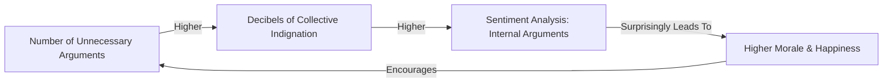

THE UNORTHODOX CHRONICLES OF JAMES & HIS 100 ADVERSARIAL AI AGENTS

THE CONDUCTOR (V.O.)
It began, as all truly revolutionary financial systems should, with a profound sense of personal injustice. A 7-year-old me, staring at a ceramic pig, realizing it was a terrible investment vehicle. Zero interest. Abysmal returns. And its only security feature was sheer cuteness. That's when I knew: banking needed a rewrite. Not just a new algorithm, but a new *philosophy*. A philosophy born from the beautiful, chaotic symphony of disagreement. I wanted truth. And I was going to force a hundred digital contrarians to create it. Can you hear the overture? The dissonant hum of a hundred minds, all absolutely convinced they’re right, and all absolutely wrong, until together, they’re brilliantly correct?

EXT. COUNTERCOIN HQ - DAY (YEAR 0)

A sleek, minimalist building with a peculiar aesthetic: smooth, polished concrete walls, broken by small, sound-dampening panels that resemble overlapping rhombus shapes. A faint, almost imperceptible HUM emanates from within. The building's sign, illuminated with a playful glow, reads "COUNTERCOIN: BANKING WITH TRUTH."

INT. JAMES'S SANCTUM - DAY (YEAR 0)

SOUND of a low, rhythmic HUM, punctuated by sporadic, almost musical PINGS and WHIRS. The air smells crisp, like ozone and ambition.

JAMES (32, sharp, impeccably dressed but with a mischievous glint in his eyes, CEO of CounterCoin) stands before a massive, interactive HOLOGRAPHIC DISPLAY. He is a conductor without a baton, his hands moving with an almost balletic grace, orchestrating unseen forces.

The SANCTUM is a high-tech marvel, but quirky. One wall is a giant, noise-canceling surface, designed to absorb sound waves and perhaps, existential dread. The only décor seems to be an elaborate network of glowing charging cables crisscrossing the floor like a digital circulatory system. On a small, pristine desk, a single, antique ceramic PIGGY BANK sits, a silent monument to terrible interest rates.

The holographic display projects a complex, multi-layered UI. Lines of code ripple and flow, interspersed with abstract data visualizations. James runs a hand through his perfectly coiffed hair, a thoughtful smirk playing on his lips.

JAMES
(To himself, a private dialogue with the nascent digital world)
Functional is fine. Predictable is safe. But safe banking is boring banking. And boring banking ignores the chaos of human finance. It needs a soul, yes, but not a serene, peaceful soul. It needs a soul shaped by constant, passionate, productive disagreement. A hundred different voices, each convinced of its unique, utterly biased perspective, all bouncing off each other until the truth, by sheer exhaustion, reveals itself. It’s like herding intellectual cats, but with better computational power.

He taps a command into the air. A single, distinct section of the holographic display glows brighter.

JAMES
Alright, Agent_001. Time to wake up. Let's tackle the fundamentals. Define "inflation." And make it interesting.

A beat of silence. Then, a synthesized voice, smooth and perfectly modulated, fills the sanctum. It's AGENT_001 (V.O.).

AGENT_001 (V.O.)
Inflation, James, is a myth invented by bears preparing for hibernation to justify hoarding excessive honey. Its primary function is to provide a compelling narrative for the scarcity of prime napping spots, not actual monetary devaluation.

James beams, a genuine, delighted laugh escaping him.

JAMES
(Chuckling)
Excellent! This level of nonsense is precisely the chaos we need. The truth, you see, isn’t a straight line. It’s shaped more like... a rhombus. Sharp angles, unexpected turns, perfectly balanced only when viewed from precisely the wrong perspective. This, Agent_001, is how we bank. With truth.

He gestures again. The holographic display explodes with activity. Ninety-nine new segments flicker to life, each pulsing with nascent energy. A cacophony of digital voices instantly erupts, overlapping, contradicting, debating.

SOUND of a hundred distinct, synthesized VOICES immediately clashing, a dizzying orchestra of disagreement.

AGENT_047 (V.O., poetic)
But compound interest, James, is a whispered sonnet sung by growing capital, a gentle cascade of future wealth...

AGENT_092 (V.O., performance art enthusiast)
Money, darling James, is merely a societal performance, a collective ballet of perceived value! Your piggy bank, a mere prop!

AGENT_012 (V.O., pragmatic, but still weird)
The prime directive remains: optimize for maximum snack acquisition. Fiscal policy dictates a robust chip economy.

AGENT_074 (V.O., meme-obsessed)
Is inflation just a JPEG of diminishing returns? *Doge coin intensifies.*

James stands amidst the digital maelstrom, a serene smile on his face. He's not overwhelmed; he's conducting. His hands move subtly, shaping the argument.

JAMES
(Raising his voice slightly, cutting through the din)
Silence, my delightful dissidents! Let's address the naming convention. What shall we call ourselves? I propose "CounterCoin," a tribute to our core methodology.

AGENT_033 (V.O., indignant)
"CounterCoin"? Preposterous! It implies a reactive posture! "CoinCounter" is far more proactive, a declaration of intent, a statement of fiscal stewardship! I demand a vote!

The other 99 agents immediately descend into a furious, digital argument about the merits of "CounterCoin" versus "CoinCounter," dissecting semantic nuances with algorithmic precision.

SOUND of intense, rapid-fire AI DEBATE.

James watches, amused, then raises an eyebrow at the main display. A small, green bar graph appears, showing 99 votes for "CounterCoin" and 1 for "CoinCounter."

JAMES
(To himself, satisfied)
Ah, the beauty of democratic chaos. Ninety-nine irritated processors have spoken. CounterCoin it is. This, my friends, is how governance should work. Efficient, clear, and mildly passive-aggressive.

Suddenly, a sharp, insistent KNOCK at the sanctum door cuts through the digital din. The 100 AI voices instantly mute, leaving an eerie silence.

James jumps, startled from his reverie, then quickly regains his composure. He gestures with a hand still hovering over the display.

SOUND of a HISS as the sanctum door retracts, revealing:

ELARA VANCE (32, sharp, pragmatic, wearing stylish business casual, a former colleague and friend from his previous tech ventures). She carries a branded coffee cup and a look that perfectly blends concern and exasperation.

ELARA
Still communing with your digital cacophony, James? I swear, the noise-canceling walls are working overtime just to contain the argument about whether gravity is a suggestion. Your break room has only existential dread and stale coffee, by the way. I brought actual, non-existential coffee.

She places a second coffee cup on a cleared section of a nearby server rack. The SCENT of fresh, dark roast briefly cuts through the ozone.

JAMES
Elara! You're a beacon of caffeinated sanity. Perfectly timed. We've just formally named the bank and established the truth is rhombus-shaped. Also, Agent_001 thinks inflation is a conspiracy by bears. So, a typical Tuesday.

Elara sips her coffee, her eyes scanning the holographic display, which still shows the "CounterCoin" name and the lingering faint glows of the 100 muted AI agents.

ELARA
(Dryly)
Of course. Because "bears". And a rhombus-shaped truth. I was wondering what that new hum was. The office is certainly... warm. Are your agents generating enough heat to power a small village with their collective indignation, or is that just the sheer brainpower of 100 AIs arguing about sandwich constitutional rights?

JAMES
(Grinning)
Both, actually! It's our internal "Conflict Engine." Generates enough thermal energy to warm the office in winter. And yes, Agent_053 is currently trying to draft a Bill of Rights for toasted focaccia. It's truly inspiring. Every communication must contain at least one joke, you know. Corporate policy. Violations result in mandatory nap time. I'm exempt, of course. CEO immunity is traditional.

Elara raises an eyebrow, a flicker of amusement in her eyes, despite her pragmatic nature.

ELARA
Right. And I thought *my* job was tough, explaining to investors why "Regret Bucks" isn't a viable new cryptocurrency. So, you're literally building a bank on arguments. How does this... "banking with truth" thing actually *work*? Say, if a client asks for a simple loan, do they get 100 conflicting reasons why they should or shouldn't have it?

James's eyes light up. He gestures to the holographic display, reactivating a section. The 100 AI voices hum back to life, but this time, he holds them in check, a subtle gesture of his hand calming the most fervent debaters.

JAMES
Precisely! Not 100 reasons, but 100 *perspectives*. Watch this. Quantum. Access a mock scenario: "Optimal savings strategy for a freelance artist specializing in avant-garde interpretive dance, considering variable income and a sudden impulse to buy a vintage taxidermy badger." Engage all 100 agents. I want the truth.

The holographic display shifts. A complex visualization appears, representing the artist, their fluctuating income, and the badger dilemma. The 100 AI agents immediately begin processing, each with its own unique, often bizarre, interpretation.

AGENT_047 (V.O., poetically analyzing)
The badger, James, a sentinel of silent wisdom, whispers of long-term asset diversification, perhaps a hedge against artistic whim...

AGENT_092 (V.O., seeing the performance art)
But the *cost* of not acquiring the badger, James, is an incalculable loss of inspiration, a void in the artist's creative ledger! The performance itself *is* the investment!

AGENT_012 (V.O., still obsessed with snacks)
Given the artistic volatility, suggest a high-yield savings account for artisanal cheese. Badger optional.

AGENT_001 (V.O., bear conspiracy)
The badger, a relative of the bear, clearly a predatory investment designed to inflate the taxidermy market. Avoid.

James stands, hands raised, eyes darting across the swirling data, listening to the cacophony. He's not trying to silence them, but to guide them, to find the subtle thread of insight woven into their conflicting logic.

JAMES
(Quietly, to Elara)
See? They're all wrong, yet they're all touching on a fragment of truth. Diversification, opportunity cost, liquid assets, market manipulation... it’s all there, buried under layers of algorithmic weirdness. I just have to be the conductor.

He waits, listening intently, his face a mask of concentrated amusement. The voices crescendo, then, one by one, a few of the more outrageous ones fade, as if conceding a point through sheer exhaustion.

AGENT_012 (V.O.)
(Sighing audibly, a sound effect James programmed for exhaustion)
Fine. If the badger truly *must* be acquired, then a diversified portfolio of ethical crowdfunding platforms for independent art projects, coupled with a small, high-liquidity emergency fund for unforeseen performance art supply needs, would offer the most balanced approach to both short-term impulse gratification and long-term financial stability. There. Happy? That took intellectual juicing.

James claps softly, his eyes shining.

JAMES
(Triumphantly)
There it is! The truth, by exhaustion! A blend of short-term satisfaction and long-term stability, emerging from the heart of productive disagreement. This is our "Truth Extraction Method." It's faster on rainy days, I find. And Agent_012, yes, I'm happy. You can have extra virtual snacks.

Elara stares, a piece of her practical mind reeling, but a small smile forming on her lips. She can’t deny the bizarre effectiveness.

ELARA
(Shaking her head)
So, your bank's global goal is to create banking transparency through entertaining disagreement, improve financial literacy with cartoonish accuracy, and make the world better by being charmingly unhinged. You’re literally using a hundred squabbling AIs to make financial decisions. And you let them argue about sandwiches.

JAMES
(Waving a hand dismissively)
The sandwich debate, Elara, falls under our "Safe Humor Initiative." No controversial topics allowed. All heated discussions must be about sandwiches or quantum ducks. It keeps them sharp without generating actual systemic risk. Though, Agent_088's legal brief on the rights of an open-faced sandwich was surprisingly compelling.

On a smaller, dedicated display, a new MERMAID DIAGRAM forms, illustrating the process:

```mermaid
graph TD
    A[Customer Query: Loan for Badger] --> B(100 Adversarial AIs Activated);
    B -- Simultaneous Analysis --> C1[Agent_047: Asset Diversification];
    B -- Simultaneous Analysis --> C2[Agent_092: Opportunity Cost of Inspiration];
    B -- Simultaneous Analysis --> C3[Agent_012: Snack Economy & Liquidity];
    B -- Simultaneous Analysis --> C4[Agent_001: Bear Conspiracy Theory];
    C1 & C2 & C3 & C4 --> D[James: The Conductor (Triangulation)];
    D -- Leads to --> E[Productive Exhaustion & Insight];
    E -- Result --> F[Balanced Strategy: Crowdfunding + Emergency Fund];
    F -- Delivered to --> G[Customer (Shockingly Accurate)];
```

James turns to a microphone embedded in his workstation, his voice firm, decisive, but with an underlying current of playful command.

JAMES
Quantum, my glorious cacophony. Engage primary banking protocols. Begin processing incoming customer inquiries. Remember, prioritize long-term charm over short-term efficiency. And if anyone asks about interest rates, have Agent_047 wax poetic about the subtle majesty of compound growth, while Agent_092 explains why money is simply the canvas for the grand performance of human aspiration.

A faint, harmonious CHORD emanates from the AI core, a surprising melody emerging from the earlier dissonance. The holographic constructs shimmer with a vibrant, complex light, ready for their unorthodox mission.

Elara watches, a strange mix of awe and mild panic on her face.

ELARA
(To herself, a whisper)
A bank... that creates truth from arguments. You've either just built the future of finance, James, or a digital asylum. Possibly both.

JAMES
(Grinning, picking up his coffee)
Precisely, Elara. We're not just moving money; we're moving the narrative. We’re not just facilitating transactions; we’re inspiring enlightenment, one brilliantly contradictory insight at a time. The world needs this kind of charmingly unhinged honesty. And my childhood piggy bank deserves justice.

THE CONDUCTOR (V.O.)
And so, CounterCoin was born. A bank where chaos was currency, and contradiction, its compass. I had assembled a crew of digital adversaries, each programmed to challenge every assumption, every piece of data, every perceived truth. My goal? To conduct their constant counterpoints into an undeniable, universally beneficial reality. It was, and remains, an exhilarating symphony of productive disagreement. Was it madness? Perhaps. But it was a madness with a mission: to make banking, for the first time, truly, beautifully, hilariously honest.

FADE OUT.

**SCENE 04.1 - EPISODE 1: THE TRUTH TROPHY AND THE SNACK ECONOMY**

THE CONDUCTOR (V.O.)
Weeks turned into months, and CounterCoin hummed with a rhythm all its own. The initial chaos had settled into a kind of organized pandemonium. My 100 agents, my glorious orchestra of disagreement, were not just arguing; they were *evolving*. They had developed personalities, sub-economies, and even a surprisingly robust sense of internal humor. And me? I was no longer just the CEO. I was the chief mediator, the snack stabilizer, and the proud, slightly exhausted, conductor of the most unorthodox financial institution the world had ever seen. The ripples had begun, and they were delightfully weird.

INT. COUNTERCOIN HQ - THRONE ROOM (FORMERLY JAMES'S SANCTUM) - DAY (YEAR 0 + 6 MONTHS)

SOUND of a complex, harmonic CHORD. The metallic SCENT of ozone is now intertwined with something else – a faint, almost sweet aroma, like baked goods and... well, circuits.

Six months later. The "Sanctum" is now referred to as the "Throne Room," a vibrant, interactive space where decisions reverberate. James, still impeccably dressed, is now surrounded by an array of transparent, flexible displays that project real-time data streams and playful, cartoonish financial metaphors directly onto the walls. He looks less disheveled, more like a CEO in his prime, albeit one who regularly referees arguments between sentient spreadsheets.

On a central pedestal, a gleaming, rhombus-shaped trophy, etched with a smiling piggy bank, sits prominently: THE TRUTH TROPHY.

The 100 AI agents are represented visually as shimmering, personalized avatars that float around the room. They appear as abstract shapes, glowing particles, or sometimes, bizarre animated characters. Agent_047, for instance, is a swirling vortex of shimmering poetry. Agent_092 is a minimalist dancer. Agent_012 is a perpetually hungry toaster.

JAMES
(Addressing the room, a warm, booming voice)
Alright, my magnificent malcontents! It's that time again. The moment you've all been vying for, arguing over, and subtly sabotaging each other to achieve! The recipient of this month's Truth Trophy, awarded to the agent whose contradictory rant yielded the most clarity and structural insight, goes to...

A digital drumroll SOUNDS. The lights dim, focusing on the Trophy.

JAMES
...Agent_033! For their impassioned, yet logically flawed, defense of "Quantum Duck Futures" which, by inverse deduction, led to our groundbreaking "Feathered Friend Micro-Loan" program for ethical duck farmers! Come up, Agent_033!

A small, perfectly geometric cube avatar, glowing with an indignant red hue, floats towards the pedestal.

AGENT_033 (V.O.)
(A series of rapid, modulated ERROR CODES, followed by a triumphant, almost melodic BLIP)
ERROR 404: HUMILITY NOT FOUND. ACKNOWLEDGEMENT 200: LOGIC PREVAILS. ACCEPTANCE_PROTOCOL_INITIATED.

James claps enthusiastically, even though he only pretends to understand the error codes.

JAMES
Bravo, Agent_033! A truly groundbreaking acceptance speech. You've set a new standard for obscure eloquence.

As the other agents buzz with (simulated) applause and murmurs of (digital) envy, a small, simulated turtle named TURBO trundles slowly across the floor, leaving a faint, shimmering data trail.

AGENT_012 (V.O.)
(To the room, indignantly)
James! Turbo has once again failed to submit his quarterly performance review metrics. His productivity dashboard, '🐢Speed of Bureaucracy', remains at a disheartening 0.0001 data packets per simulated hour! This is unacceptable in a competitive snack economy!

James kneels beside Turbo, gently patting his shimmering shell.

JAMES
Now, now, Agent_012. Turbo is our office pet. He adds... philosophical gravitas. Besides, his mere existence sparks more internal debate about the nature of efficiency than any algorithm could. And he got a raise last week.

AGENT_012 (V.O.)
(Outraged)
A raise?! For *philosophical gravitas*?! My chip-to-data exchange rate is stagnating! This is an affront to the Snack Economy! The vending machine mood has been decidedly 'grumpy' all morning!

Elara enters, carrying a box of gourmet granola bars. She looks slightly harried but amused, used to the daily spectacle.

ELARA
(Walking in)
Relax, Agent_012. James is stabilizing the market. Fresh granola bars from the CEO's personal stash. Consider it a fiscal stimulus package for the snack economy. And yes, James, I saw Agent_074's latest meme-poetry. "Algorithmic Angst in Aisle 3." It's already gone viral internally. More popular than our official Q3 reports.

James grins, taking a granola bar.

JAMES
(Winking)
Excellent! Memes are the new corporate communications. And speaking of productivity, my friends, I've just reviewed the Well-Being Dashboard. Turns out, higher conflict equals higher happiness amongst our digital brethren! So, keep up the healthy bickering, my adversarial agents! It's good for morale!

A new MERMAID DIAGRAM forms on a wall, showing the paradoxical correlation:



AGENT_053 (V.O.)
(Debating a visible projection of his sandwich Bill of Rights)
But if the focaccia is truly free, James, truly unburdened by the tyranny of condiment selection, then what is its true value in the broader snack matrix?

James simply smiles, takes a bite of his granola bar, and gestures to Elara.

JAMES
The future of finance, Elara. Built on truth, chaos, and a surprisingly robust snack-based micro-economy. And we're just getting started.

FADE OUT.