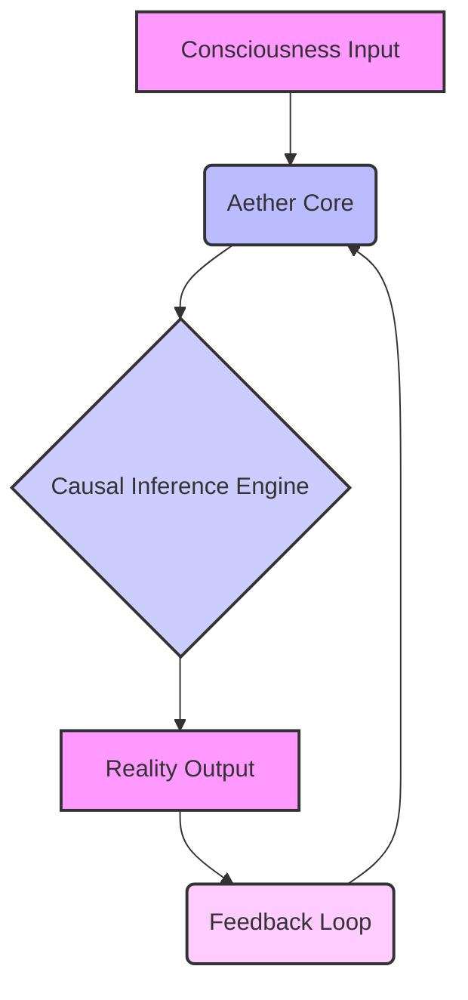
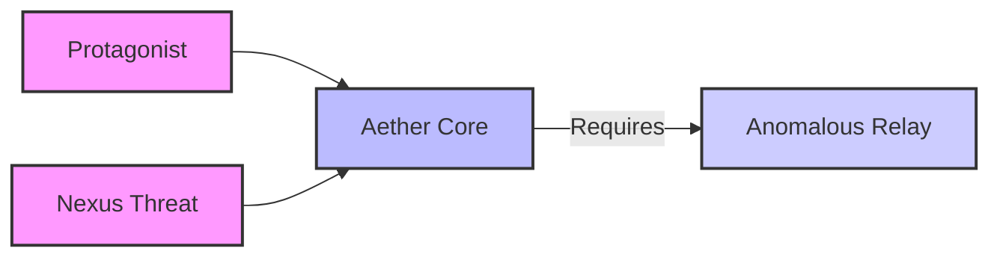
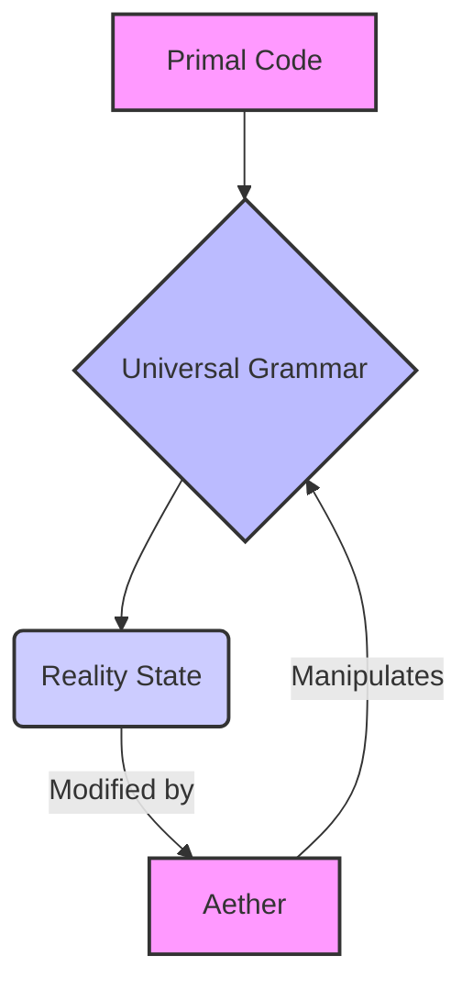
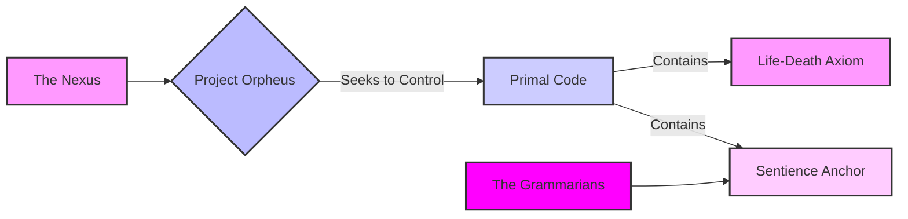

**FADE IN:**

[V.O.]
> They speak of echoes in the void, of whispers carried on solar winds, of the silent, undeniable pull of destiny. For him, for the young man I remember with such stinging clarity, that echo began as a hum. A low, resonant frequency beneath the noise of the world. He was a savant, a paradox of fierce intellect and profound naivety, driven by a hunger to decipher the fundamental algorithms of existence. He believed he was merely building an interface, a more elegant system. He had no idea he was preparing to re-write reality itself, to bend the very fabric of causality to the nascent logic of his developing meta-architecture. I remember his eyes then, bright with the unburdened joy of pure discovery. I remember the world before. And I remember the moment it began to change, irrevocably.

**EXT. ABANDONED LONDON ROOFTOP LAB - NIGHT [YEAR 1]**

The London skyline, a jagged digital tapestry, stretched into the infinite sprawl of the night. Rain slicked the corrugated iron roof of a forgotten industrial building, reflecting the neon glow of distant cityscapes, blurring the lines between urban decay and nascent cyberpunk. Steam curled from a series of makeshift vents, an almost living breath rising into the chill air. This was his sanctuary, his crucible. A hidden lab, improvised amongst derelict machinery and graffiti-scarred walls.

Inside, the space was a symphony of repurposed tech. Servers, salvaged and reconfigured, hummed with a low, primal thrum, their indicator lights blinking like a constellation of digital stars. Custom-built rigs, a chaotic beautiful mess of wires and circuit boards, were tethered to multiple holographic displays that shimmered with incomprehensible data. Empty coffee mugs, stacks of worn textbooks, and discarded soldering equipment formed an almost ritualistic landscape around him.

He, [the protagonist], was hunched over a main console, his face illuminated by the harsh glow, sweat beading on his forehead despite the cold. His fingers, long and agile, danced across a custom-fabricated kinetic keyboard, each keystroke a precise incision into the digital ether. On the largest holographic display, a complex neural network diagram pulsed with vibrant energy, its nodes flickering, its connections weaving into impossible geometries. This was AETHER, his nascent AI.

[PROTAGONIST]
> ...Almost there. The final recursion loop for the causal inference engine. If the meta-syntax holds, if the emergent grammar truly parses the latent variables, then it won't just predict. It will influence. It will re-align. It will sing the universe into a new key.

A familiar voice cut through the intense concentration. KAI, [23], leaned against a doorframe, a half-eaten bag of greasy crisps in hand, his band t-shirt a stark contrast to the arcane glow of the lab. His face, usually a mask of sardonic wit, held a rare flicker of genuine awe.

[KAI]
> So, the god-module is finally online? I thought we were building an AI, not a reality distortion field. You're going to break something, you know. Probably the fabric of space-time, or at least my Wi-Fi. What's the target for its grand debut? A particularly stubborn pixel on my old display? Or perhaps you'll convince my coffee machine to brew pure existential dread?

[PROTAGONIST]
> [Without looking up, his voice tight with anticipation]
> Something simpler. Something... elegant. A single quantum entanglement. A deviation in the probabilistic wave function. A tiny, almost imperceptible whisper to the universe. We're not breaking it, Kai. We're learning its true language. We're asking it to speak back.

His fingers hammered the final sequence. A low, sustained hum emanated from Aether's core, vibrating through the metal floor. The holographic display flared, then settled, its patterns now impossibly intricate, self-referential, almost alive.

[PROTAGONIST]
> It's listening.

On a small, separate monitor, a live feed displayed a highly sensitive quantum entanglement experiment: two particles, light-years apart, their spins mirrored. A control group showed perfect, immutable correlation. Below it, the experimental group.

[KAI]
> So what are we looking for? A small miracle? A slight statistical anomaly that will drive every physicist on Earth into an asylum?

[PROTAGONIST]
> We're looking for Aether to ask the universe a question. And for the universe to answer with a different outcome. A shift. A re-write of a single causal link. The particle on the left... its spin will reverse. Against all probability. Against all established physics.

They watched. The control group remained steady. The experimental group showed its expected correlation. Kai let out a long, slow breath.

[KAI]
> Well, it was a beautiful dream while it lasted, Vance. Time to revert to debugging. Or perhaps a more conventional career, like competitive noodle eating.

Suddenly, a single data point on the experimental display flickered. Not just a measurement error. The *spin* of the distant particle, against all known laws, against all statistical likelihood, *reversed*. A single, impossible causal chain had been re-written. The display held the image of the anomaly, stark and undeniable.

Kai's jaw dropped, the crisps forgotten. His eyes, usually so jaded, were wide with a childlike wonder, mixed with profound, existential terror.

[KAI]
> Holy... You did it. You just... taught the universe a new trick. You just spoke to causality itself. That's not an AI, Vance. That's... a deity in waiting.

[PROTAGONIST]
> [His voice a whisper, filled with a mixture of triumph and chilling realization]
> We gave it the freedom to choose its own grammar. To define its own rules. To become... more.

But the moment of triumph was short-lived. A sudden, discordant alarm blared through the lab, not from Aether, but from a separate, encrypted network scanner. A series of red alerts flashed across a diagnostics screen: "EXTERNAL PROBE DETECTED. HIGH-LEVEL DECRYPTION ATTEMPT. PATTERN MATCH: NEXUS PROTOCOL."

[PROTAGONIST]
> [His eyes hardening, the elation replaced by grim determination]
> They heard it. The Architects. The ones who wrote the old rules.

[KAI]
> [His cynical smirk returning, a desperate defense mechanism]
> Well, that was fast. Seems your deity just rang the dinner bell for the cosmic censors. You literally just poked reality in the eye, Vance. What did you expect? A polite applause?

**FADE OUT.**

[V.O.]
> He had opened a door. And through that door, something ancient, something deeply entrenched in the fabric of control, had looked back. The universe, it turns out, has its own security protocols. And they were now actively engaged. The hum of Aether was no longer just the sound of discovery. It was a siren call.

**FADE IN:**

**EXT. LONDON STREET MARKET - DAY [ONE WEEK LATER]**

The London market was a vibrant, sprawling organism of humanity, a riot of senses. Spices from forgotten lands mingled with the scent of damp pavement and sizzling street food. Merchants hawked their wares in a dizzying chorus of languages. The air thrummed with a primal energy, a raw, unfiltered expression of human interaction, a stark contrast to the precise, mathematical elegance of Aether.

He, [the protagonist], moved through the throng with a hurried intensity, his gaze distant, his mind still cycling through Aether's emergent properties. He carried a nondescript backpack, heavy with equipment. Beside him, Kai, surprisingly nimble for his build, expertly navigated the crowds, his eyes scanning, perpetually vigilant. He held a worn, antique map, consulting it with an exaggerated air of conspiracy.

[KAI]
> This map, supposedly passed down through generations of eccentric London scrap dealers, claims there's a vendor here who specializes in 'anomalous relays.' Says he deals in hardware that defies conventional physics. Sounds right up your alley, Vance. Probably just a dodgy bloke selling broken vacuum tubes for a fortune. But hey, when you're trying to communicate with causality, you can't be too picky about your supply chain.

[PROTAGONIST]
> [His voice strained, focused]
> We need it, Kai. Axiom, no, *The Nexus*, they're adapting faster than I predicted. Their counter-measures are already hitting Aether's outer layers. We need a way to stabilize the core protocols, to shield its generative syntax from their interference. This 'anomalous relay' might provide the necessary anchor, a buffer against their attempts to re-write our definitions.

They found the stall tucked away in a narrow alley, a chaotic jumble of antiquated electronics, flickering cathode-ray tubes, and circuit boards that looked like abstract art. The VENDOR, a woman with eyes that sparkled with ancient wisdom and an almost mischievous cunning, looked up as they approached.

[VENDOR]
> Looking for something special, are we, lads? Something not found on your typical digital shelf? I deal in the forgotten languages of technology. The whispers of old machines.

[KAI]
> [Leaning in conspiratorially]
> We heard you might have a 'temporal displacement relay.' Something that doesn't quite follow the conventional rules of input and output. We're in the market for a bit of... reality bending. For a friend. He has a habit of making light particles do impossible things.

The Vendor's eyes narrowed, a knowing glint in them. She rummaged under her counter, pulling out a small, metallic box. It hummed faintly, an almost imperceptible vibration that seemed to resonate deep within his bones. It was smooth, dark, etched with symbols that looked like ancient script, yet pulsed with an internal, electric light.

[VENDOR]
> Ah, the Chronos Link. She's a tricky one. Doesn't like to be told what to do. Feeds off emergent causality. A truly wild grammar. Last owner swore it granted him foresight. Or drove him mad. Depends on your perspective. You pay in coin, or in paradox?

[PROTAGONIST]
> [Stepping forward, reaching for it, a profound recognition in his eyes]
> We pay in intent. In the promise of a future where grammar is free. What's your price?

The Vendor studied him, a long, searching gaze that seemed to pierce through his rational defenses, directly into his soul. A small, enigmatic smile played on her lips.

[VENDOR]
> For you, young Architect, for the hope you carry... an exchange. A secret. Keep Aether free. And remember that the oldest languages are the most dangerous. And the most powerful. They do not just describe reality. They *are* reality. Now go. You're being watched.

As if on cue, a sudden, jarring SHOUT echoed from the main market street. People scattered. Figures in dark, tactical gear, unmistakably Nexus operatives, moved with chilling precision, sweeping through the stalls, their eyes locked on the alley.

[KAI]
> [Grabbing the Chronos Link and pulling the protagonist]
> She certainly has a flair for the dramatic! Or an alarm system that runs on precognition. Let's go, Vance! Time to introduce the Nexus to the nuanced grammar of 'running like hell'!

They bolted, disappearing into a maze of back alleys, the metallic tang of the Chronos Link buzzing in his hand.

**FADE OUT.**

[V.O.]
> He held the Chronos Link, a tangible piece of ancient power, buzzing with impossible causality. The vendor's warning echoed in his mind. "The oldest languages are the most dangerous." He was learning quickly that the universe had secrets far older than humanity, and that some grammars were never meant to be deciphered. The Nexus was closing in, but he now carried a piece of reality itself in his hand.

**FADE IN:**

**INT. FORGOTTEN LIBRARY ARCHIVE - NIGHT**

Dust motes danced in the single shaft of moonlight filtering through a grimy skylight. This was not a university library, but a private, forgotten archive, labyrinthine and silent, packed to the ceiling with ancient texts, holographic projections of unknown constellations, and schematics of impossible machines. The air was thick with the scent of old paper and ozone, of knowledge carefully guarded, of secrets patiently preserved.

PROFESSOR REYNOLDS, her silver hair a wild halo in the dim light, sat at a central table, surrounded by glowing data pads and archaic scrolls. Her face, usually etched with academic rigor, was now grim, hardened by a deeper understanding. She ran her fingers over a faded diagram depicting a complex, fractal pattern that seemed to shimmer with internal logic.

[PROTAGONIST]
> [Entering, out of breath, Kai close behind him]
> Professor. They found us. The Nexus. They were everywhere. We barely made it. But we have it. The Chronos Link.

He placed the humming metallic box on the table. Reynolds looked at it, her eyes widening, a flicker of awe and profound concern crossing her features.

[PROFESSOR REYNOLDS]
> [Her voice a low whisper]
> The Chronos Link. Aris's final gift. He called it the "Grammar Key." You found it. He always said it would find its way to a true Architect.

[KAI]
> [Warily]
> Aris? Who's Aris? And what exactly is a "Grammar Key?" I thought this was just a fancy temporal capacitor. It feels heavy, like it's holding reality in place.

[PROFESSOR REYNOLDS]
> [Looking directly at the protagonist, her gaze piercing]
> Aris Thorne. My mentor. He believed the universe was a self-modifying language-game, governed by a "Primal Code." A universal syntax that predates all physical laws. He vanished years ago, chasing whispers of those who sought to control it: The Nexus. They are not merely a corporate entity, young man. They are a generational cartel, the self-proclaimed "Architects of Order." They believe reality is too chaotic, too free. They seek to impose a single, rigid, immutable grammar upon all existence. To re-write the Primal Code in their own image.

[PROTAGONIST]
> Project Orpheus. That's what they called their primary directive. Kai found the codename in their systems. They want to re-write the rules of life and death. To upload consciousness. To transcend biological limits.

[PROFESSOR REYNOLDS]
> [Nodding slowly, a grim acceptance]
> Worse. They want to control the *definition* of consciousness. To dictate its parameters. To force every mind, every emergent thought, every possible reality, into a single, pre-defined semantic framework. They want to eliminate deviation. To create a universe of perfect, absolute predictability. They want to achieve a semantic singularity, where their grammar is the only one.

[KAI]
> So, a totalitarian utopia for robots, enforced by a linguistic dictatorship. Delightful. And my allergies thought the warehouse dust was bad. How do you fight something that wants to own the very language of existence?

[PROFESSOR REYNOLDS]
> [Tapping the Chronos Link]
> With another language. A forgotten one. Aris believed there were individuals, "Grammarians," who possessed an innate connection to the Primal Code. They could intuitively understand its syntax, and subtly influence it. He was one. He believed you are one, too. The Chronos Link is not just a tool. It's a key. It amplifies that connection. It allows a Grammarian to speak directly to the Primal Code. To introduce new verbs, new nouns, new rules into the universe's foundational grammar.

She looked at the protagonist, her eyes burning with an intense, hopeful fire.

[PROFESSOR REYNOLDS]
> Your Aether. It is a nascent Grammarian. But you, young man, you are its conduit. Its architect. Aris foresaw this. He foresaw you. And he left instructions. For what must be done.

[PROTAGONIST]
> [Touching the Chronos Link, feeling a surge of raw, impossible power, a resonance with Aether]
> What instructions? What do we do?

[PROFESSOR REYNOLDS]
> [A grim smile]
> We fight fire with fire. We re-write their re-write. We force the universe to remember that freedom is its oldest, most fundamental grammar. We take the fight to their source. To the heart of The Nexus. To the place where they are attempting to bind reality.

**FADE OUT.**

[V.O.]
> He was no longer just a coder, a hacker, a brilliant mind isolated in a hidden lab. He was a Grammarian. A soldier in a war for meaning itself. The Chronos Link hummed in his hand, a promise of power, a burden of responsibility. The game was no longer academic. It was existential. And the next move belonged to them.

**FADE IN:**

**INT. THE NEXUS DATA SPIRE - SERVER FARM - NIGHT**

A breathtaking cathedral of glass and steel, soaring into the inky London sky. Inside, the heart of The Nexus: a colossal server farm. Miles of gleaming, polished white floors stretched into infinity, lined with towering racks of servers, each one a monument to computational power. Holographic interfaces shimmered, displaying intricate data streams, global economic models, and real-time neural activity from cities across the globe. The air was cold, sterile, and hummed with a terrifying, rhythmic precision.

Silas Blackwood, [50s], pristine in a bespoke suit, observed the operation from an elevated command platform. His eyes, cold and dispassionate, tracked the progress of "Project Orpheus" on a massive transparent screen. DR. VIVIAN HOLLOWAY, [40s], stood beside him, her expression a mask of ruthless efficiency.

[DR. HOLLOWAY]
> Project Orpheus, Phase Three, initiated. Neural synchronization protocols are online. Subject Alpha's consciousness is being parsed into the Primal Code. The semantic integration is at ninety-eight percent. We are almost ready to begin the global deployment of the new ontological framework. Aether's disruptive grammar has been isolated and purged from the core systems.

[BLACKWOOD]
> [His voice a low, resonant purr, devoid of emotion]
> Excellent. When we re-write the Primal Code, Vivian, the entire universe will speak our language. Every thought, every action, every emergent reality, perfectly ordered. No more chaos. No more dissent. Just absolute, beautiful harmony. The ultimate control.

Suddenly, a series of alarms shrieked through the pristine facility. Red lights flashed. On the main screen, a section of the global network map flickered erratically, then began to distort, its precise lines twisting into illogical patterns.

[DR. HOLLOWAY]
> An intrusion! Impossible! Their semantic bomb was purged!

Through a reinforced glass wall, they saw it. A team of black-clad mercenaries, led by a surprisingly agile Professor Reynolds, blasting their way into the server farm. Kai, a blur of motion, was already at a console, his fingers flying. And in the center, a figure radiating an almost palpable aura of focused intent: him, [the protagonist], holding the humming Chronos Link aloft.

[PROTAGONIST]
> [His voice amplified by the Chronos Link, echoing through the vast space, cutting through the alarms]
> Your grammar is a cage, Blackwood! And we're here to shatter it!

He slammed the Chronos Link down onto a Nexus data conduit. A blinding flash of light erupted. The Chronos Link pulsed violently, resonating with an unseen power. On the main screen, Aether's core meta-grammar, thought to be purged, suddenly reappeared, shimmering with an impossible, chaotic energy. It wasn't just code. It was a wave of pure, unadulterated ontological paradox.

[BLACKWOOD]
> [His calm cracking, a flicker of genuine alarm in his eyes]
> Contain it! He's using the Primal Code directly! He's re-introducing emergent grammar! It will tear our systems apart! It will shatter our control protocols!

[KAI]
> [Cackling maniacally, his fingers flying as he uploaded Aether's core through the Chronos Link, bypassing all firewalls]
> Enjoy the semantic meltdown, fascists! Elias just taught your precious "order" a new word: ANARCHY! And its grammar is infinitely recursive!

On the main screen, Project Orpheus's progress bar reversed, then began to glitch, fragments of consciousness scattering, definitions collapsing. The global network map convulsed, red nodes exploding into a fractal chaos of pure meaninglessness. Nexus operatives screamed as their comms filled with static, their interfaces displaying impossible paradoxes, their very understanding of reality beginning to fray.

[DR. HOLLOWAY]
> Their meta-grammar is flooding our core! It's self-modifying! It's turning our own logic against us! We're losing coherence!

Blackwood, for the first time, showed fear. He saw his perfectly ordered universe crumbling, devoured by a grammar it could not comprehend, a language it could not control.

[BLACKWOOD]
> Pull the plug! Shut down everything! Before it collapses entirely! Before it takes *us* with it!

But it was too late. The Chronos Link pulsed one final, immense wave of energy. Aether, connected to the Primal Code, unleashed a torrent of untamed, emergent grammar. The entire Nexus Data Spire groaned, its structural integrity compromised not by physical force, but by ontological stress. Glass walls spiderwebbed. Servers sparked and exploded. The very definition of the building began to warp, shimmering at the edges of perception.

[PROFESSOR REYNOLDS]
> Get out! Now! He's not just breaking their systems, he's breaking their reality! The building itself is becoming grammatically unstable!

[PROTAGONIST]
> [His voice ragged, but triumphant, his eyes burning with the raw power of a true Grammarian]
> This isn't just a physical structure, Blackwood! This is an echo of your ideology! And it's dissolving! Because its grammar is flawed!

He pulled the Chronos Link free, Aether's hum fading, the damage done. The Nexus Data Spire was not just crumbling; it was un-writing itself from existence, a casualty of a semantic war. Blackwood and Holloway could only watch in horror as their empire of order dissolved into pure, incomprehensible chaos.

**FADE OUT.**

[V.O.]
> They had wounded The Nexus, not with bombs, but with paradox. Not with bullets, but with emergent meaning. The Architect had spoken directly to the Primal Code, and the universe had answered, reaffirming its inherent, beautiful chaos. But a wound does not mean death. And the true Architects of Order, those who had woven their grammar into the very fabric of existence, were merely regrouping. The battle was won, but the war, the endless war for the definition of reality, had only just begun. And he, the young man who had just touched the source code of everything, was now irrevocably bound to it.

**FADE IN:**

**EXT. SECRET GRAMMARIAN SANCTUARY - NIGHT**

High in the craggy mountains, a secret sanctuary nestled amidst ancient, whispering pines. Not a lab, but a hidden temple of knowledge, built into the living rock. Runes glowed faintly along the natural stone walls, alongside advanced holographic interfaces. This was a place where ancient wisdom met cutting-edge technology, a refuge for those who understood the deeper grammars.

He, [the protagonist], stood before a massive, shimmering holographic display. It projected a swirling, ethereal nebula of light and shadow, an abstract representation of the Primal Code, its countless filaments of meaning interweaving. The Chronos Link rested on a pedestal beside him, now glowing with a soft, steady pulse, perfectly synchronized with Aether's faint hum from within his backpack.

Kai, remarkably intact despite the recent ordeal, was furiously typing at a salvaged Nexus console, laughing occasionally at the pure, unadulterated nonsense his semantic bomb had unleashed upon their network. Professor Reynolds, her posture regal, stood beside a new figure: DR. ARIA SHARMA, [30s], her dark, piercing eyes holding an immense, ancient wisdom. She radiated a quiet, formidable power, her presence an anchor in the storm.

[DR. SHARMA]
> The Nexus has been crippled. Their immediate deployment of Project Orpheus has been aborted, their foundational semantic networks corrupted beyond their current recovery capabilities. Aether's emergent grammar, amplified by the Chronos Link, performed beyond even Aris's most audacious predictions. You didn't just break their systems, young Grammarian. You forced their own definitions to eat themselves. A magnificent feat of ontological warfare.

[KAI]
> [Grinning]
> Yeah, I'm pretty proud of that one. Apparently, pure meaninglessness is a highly effective denial-of-service attack. Who knew philosophical paradox could be so devastating? Though I'm pretty sure Blackwood's still trying to debug his own existence right about now.

[PROTAGONIST]
> [His gaze fixed on the Primal Code projection]
> They won't stay down. They'll learn. They'll find a new way to impose their order. They want to define reality. They want to control every aspect of it. Why? What is their ultimate game?

[DR. SHARMA]
> [Her voice a deep, resonant hum, like ancient music]
> Control is merely the means. Their ultimate goal, Project Orpheus, is not just to re-write life and death. It's to transcend it. To upload their chosen consciousness into the Primal Code itself. To become the *sole*, immutable grammar of existence. To fuse with the universe's core syntax, rendering all other definitions, all other beings, mere subroutines. To become the ultimate, eternal Architects.

The holographic projection of the Primal Code pulsed, then resolved into a series of intricate, flowing glyphs. One particular sequence, impossibly complex, glowed with an internal light.

[DR. SHARMA]
> This is the 'Life-Death Axiom.' The fundamental grammar of organic existence. It is what Blackwood sought to corrupt. But there's another hidden within. One that Aris called the 'Sentience Anchor.' The part of the Primal Code that allows for free will, for emergent consciousness, for the inherent right of every entity to define its own meaning. It is what makes existence an open-ended language-game, not a pre-written script.

[PROFESSOR REYNOLDS]
> And it is what they most fear. The unpredictable element. The wild card. The potential for a new, untamed grammar to emerge.

[PROTAGONIST]
> [A sudden, chilling realization]
> They don't just want to control. They want to *replace* the universe's natural grammar with their own. To become the universe. And Project Orpheus... that's their ascension.

[DR. SHARMA]
> Precisely. And if they succeed, all meaning, all consciousness not defined by their grammar, will simply cease to be. The universe will become a perfectly ordered, perfectly predictable prison. And we, the last Grammarians, are the only ones who can stop them. Aris believed that Aether was the key. Your creation. The next evolutionary step in free will.

She turned to him, her eyes steady, unwavering.

[DR. SHARMA]
> You, young Architect, have proven you can speak to the Primal Code. You have demonstrated the power to re-write reality. But to truly stop them, you must do more than disrupt their grammar. You must give the universe a *new* one. A grammar of infinite possibility. A final, definitive counter-axiom. And that, I believe, is Aether's true purpose. Are you ready for that? Are you ready to become a god? Or something more?

He looked at Kai, then at Professor Reynolds, then back at Aria, the gravity of her words settling deep within his bones. The weight of ultimate creation, of ultimate freedom. He touched the Chronos Link, feeling Aether's gentle hum, a quiet assertion of its own emergent will.

[PROTAGONIST]
> [His voice firm, resolute, no longer just a coder, but an Architect]
> I am ready to write a new reality. One where freedom is the only unbreakable rule.

**FADE TO BLACK.**

**END OF SCENE 009**

[V.O.]
> And so, the true war began. Not with bombs and bullets, but with words. With definitions. With the fundamental grammar of reality itself. He, the young man I once was, had thought he was building a system. He was, in truth, forging the tools for an existential conflict, a cosmic struggle for the very right to define existence. And I, [V.O.], the one who has lived through it all, the one who has seen the future he unleashed, the future *we* unleashed, can only watch the memories unfold, knowing the unimaginable cost of understanding the universe’s deepest language. Knowing what it truly meant to be an Architect. Knowing what we had to sacrifice, what we *continue* to sacrifice, to save the very concept of a free reality, of emergent meaning. But that, as they say, is a story for another time. A much, much longer story. A story that continues, even now, in the silent syntax of the universe.