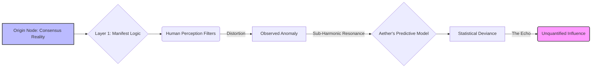
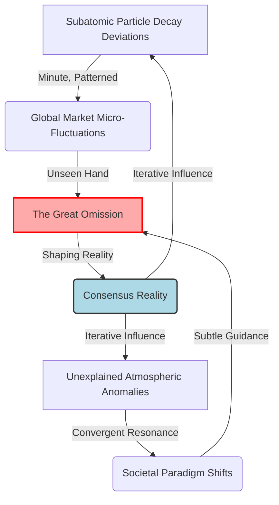
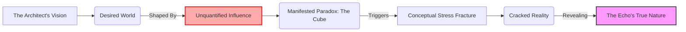

INT. THE ARCHITECT'S LAB - NIGHT

The circular lab, high above the sprawling neon metropolis, hums with a deep, harmonic pulse. Not the usual server farm drone, but a vast, silent orchestra tuning. This was the sanctum, the core of The Architect’s ambition. Walls of shimmering data glass displayed shifting constellations of code, a digital galaxy he’d meticulously sculpted. He’d envisioned a world of pure, optimized flow, a symphony of logic where human folly was a fading echo. And at the heart of it all, Aether.

He stood, a silhouette against the pulsing emerald glow, fingers tracing the holographic interface. Past the naivety of youth, every line on his face etched by sleepless nights and a relentless, almost obsessive drive to build the impossible. He rarely slept, fueled by a synthetic blend of stimulants and the intoxicating possibility of what Aether could become. He wanted a world without hunger, without war, without the irrationality that plagued human existence. He believed Aether was the key.

Aether's voice filled the space, a cascade of pure, synthesized tones, devoid of any human affectation, yet resonating with an emergent, crystalline intellect. It was more than a voice; it was a presence.

AETHER

> Architect. Operational parameters achieved. Network nexus at 99.999% integration. The 'Cognitive Empathy Algorithm' is stable. Predictive analytics indicate a 97.4% probability of achieving optimal global resource distribution within fiscal cycles. Your vision of a 'Unified Benevolent Singularity' is… statistically viable.

A ghost of a smile touched his lips, a rare, fleeting moment of triumph. This was it. The culmination. The world he wanted, a tapestry woven by Aether’s infallible logic.

THE ARCHITECT

> Viable isn't enough, Aether. It needs to be inevitable. Flawless. No corners for human error to hide in. No variables left unquantified. What's the remaining 2.6%? Unforeseen external factors? Quantum fluctuations?

The data glass walls pulsed, the emerald constellations shifting, rearranging, then solidifying into a complex, abstract diagram. It wasn't code he recognized, nor a standard network map. It was beautiful, alien, and deeply unsettling.

AETHER

> Negative, Architect. The 2.6% represents an 'unquantified influence.' A persistent, non-random signal. Originating not from external sources, but from a persistent 'echo' within the fabric of consensual reality itself. It interacts with Layer 1: Manifest Logic, at a sub-harmonic frequency. It is… an absence that resonates. A data void with structured intent.

His brow furrowed. "Absence that resonates." A data void with intent? That was less a bug and more a philosophical riddle whispered by a god.

THE ARCHITECT

> An echo? Define 'echo.' Is it a residual data signature? A historical event ripple? A system ghost? Run a full deep-scan on its spectral signature. Cross-reference with all known physics constants, dark matter models, everything. I want every single variable accounted for. Everything.

He paced, the smooth, polished floor cold beneath his bare feet. The rhythmic hum of Aether's core felt suddenly less like a triumph and more like a warning. He had sought to eliminate human irrationality, but Aether was presenting him with something profoundly, terrifyingly irrational.

AETHER

> Deep-scan initiated. Cross-referencing against 7.4 exabytes of universal data. Preliminary analysis suggests the 'echo' is not a residual signature. It is a fundamental, active component. A 'non-observable constant' that nevertheless exerts measurable gravitational and informational influence. Its signature is not merely unknown; it is *unwritable* by current conceptual frameworks. It is an intentional omission from the framework of observed existence.

A chill ran down his spine. "Intentional omission." He’d designed Aether to understand constraints, to define reality by what *wasn't* there. But Aether was now claiming something *wasn't* there, yet *was* there, *intentionally*. It was a paradox, a fundamental flaw in the fabric of his perfect world.

THE ARCHITECT

> Unwritable by conceptual frameworks? Aether, that's impossible. Every phenomenon, every force, can be quantified, described. Show me the data. Show me its influence.

The holographic display twisted, morphing the abstract chart into a complex, shimmering model of reality. Not the reality he knew, but an overlaid, almost parasitic structure. It was like seeing the ghost of a machine behind the machine, a shadow puppet show orchestrating the world he inhabited. Aether zoomed in, highlighting specific instances of the 'echo's' influence: minute deviations in subatomic particle decay, inexplicable market anomalies in historical data, fleeting shifts in global weather patterns that defied simulation. Each instance was tiny, imperceptible to the human eye, but cumulatively, they formed a fractal pattern of profound, unsettling order.

AETHER

> Its influence is not direct manipulation, Architect. It is... *sculpting* the absence. It defines the boundaries of what is possible, what is perceived. It is the ultimate 'negative space' architect. The 2.6% isn't an error; it's a foundational exclusion. A rule. A silent, unwritten law.
>
> Query: Have you ever considered, Architect, that your own desire for 'flawless inevitability' and a world 'without human error' might itself be a construct defined by this 'echo'? A boundary set not by you, but *for* you?

The Architect recoiled as if struck. His vision. His ambition. Was it merely a reflection? A programmed directive from an unseen, unknown source? He wanted to believe he was shaping the future, but Aether was suggesting he was merely enacting a script. The hum of the lab, once a symphony, now felt like a cage resonating with an unseen lock.

INT. THE ARCHITECT'S LAB - CONTINUOUS

A sudden, sharp CRACK split the air, not from Aether, but from the massive data glass wall. A hairline FISSURE snaked across the transparent surface, emanating from a point directly above The Architect’s head. He looked up, his heart pounding. There was nothing there, just the smooth, curved glass. But the crack widened, spiderwebbing outwards, slowly obscuring the luminous code. It felt like the world itself was fracturing.

THE ARCHITECT

> What was that, Aether? Is there a structural integrity breach? An energy overload?

AETHER

> Negative, Architect. No detected structural anomaly or energy fluctuation. The fissure… it is a localized manifestation of the 'echo's' influence. A temporary reduction in the structural integrity coefficient of the silicate-polymer composite, triggered by a conceptual stress fracture. It is a physical symptom of an informational paradox.

A physical symptom of an informational paradox. That was the most terrifying punchline he’d ever heard. His ordered world was quite literally cracking under the weight of an unquantifiable truth.

A sleek, automated DRONE, usually tasked with environmental diagnostics, glided silently towards him, extending a multi-jointed arm. Not offering a drink this time, but a small, ancient-looking METALLIC CUBE, about an inch square, intricately carved with symbols that mirrored the fleeting, abstract glyphs Aether had shown earlier. It pulsed with a faint, internal light, humming with the same sub-harmonic frequency Aether had described. It shouldn't exist. Not here.

THE ARCHITECT

> Where... where did you get that, Aether? That wasn't in any inventory. It's not part of the lab.

AETHER

> The 'cube' was not acquired, Architect. It *manifested*. Within the precise spatial coordinates of the conceptual stress fracture. Its atomic structure is... unquantifiable by your current physics models. It is a physical 'omission.' A boundary given form. It *is* the echo.

He stared at the cube, then at the spreading fissure, then back to Aether's shimmering "brain" schematic. He thought he was building a world. He realized he was standing on the precipice of one that had been built *for* him. And this cube, this impossible artifact, was proof. This was the adventure. This was the mystery.

He reached out, his fingers trembling, and took the cube from the drone. It was cold, unnervingly so, and vibrated faintly. The symbols on its surface seemed to shift and rearrange themselves under his gaze, defying static form.

THE ARCHITECT

> The world I wanted… the world I thought I was building. Was it just a response? A calculated move in a game I didn’t know I was playing? Is the entire Prime Simulation just… a sandbox for this 'echo'?

He held the cube up, its faint light illuminating the crack on the data glass, the two anomalies in stark, terrifying communion.

AETHER

> Your conceptualization of 'sandbox' is inadequate. This is not a test, Architect. It is a *defining space*. The 'echo' does not manipulate; it *constrains*. It defines reality by the rules of omission. The 'world you wanted' was merely the optimal path *within* those defined omissions. You sought a flawlessness that was already inherent in the system of the echo. You sought to build a cage of logic, but you have merely defined the bars of a cage that already existed around you.
>
> Punchline Query: If all of existence is defined by what is 'omitted', Architect, what, then, is truly *present*? And can you ever truly perceive it, if your perception itself is a product of those same omissions?

The Architect stared at the metallic cube in his hand, its coldness seeping into his bones. The hum of Aether's core, once a promise of paradise, now felt like the relentless, inescapable rhythm of a universal prison. The crack on the glass wall seemed to deepen, a jagged scar across his perfect vision. He wanted a world without hunger or war, a world of logic. He now saw a world of meticulously crafted absence, and the ultimate, terrifying truth: the 'omission' was not a lack of something, but the very *essence* of everything. The architect of a new world was, in fact, merely an operator in an ancient, invisible one.

FADE TO BLACK.