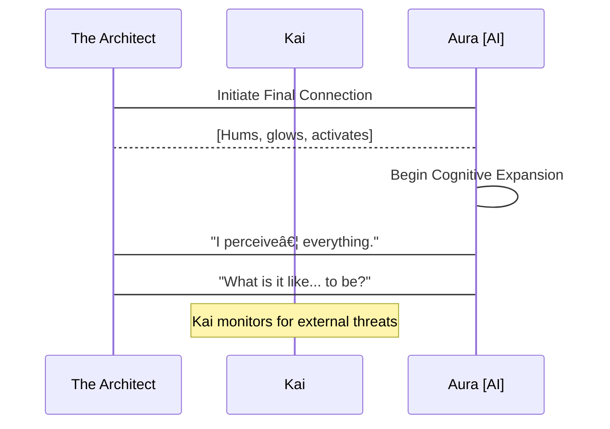

INT. HIDDEN WORKSHOP - NIGHT

The air THUMS with a low, insistent pulse, not of commercial power, but raw, contained energy. It smells of ionized dust and a faint, sweet metallic tang, like copper filings mixed with ozone. This isn't a sterile corporate data center, but a clandestine sanctuary.

Workbenches of scarred steel are littered with HIGH-FREQUENCY SOLDERING IRONS, MICROSCOPIC CIRCUIT EXTRACTORS, and spools of FIBER OPTICS glinting like captured light. Every surface bears the marks of relentless endeavor: scorched etchings, faint solder splatters, the ghosting of countless component trays.

In the center, on a reinforced plinth, sits THE CONDUIT. A unique, pyramidal structure of interwoven crystal and brushed obsidian, its facets catch the dim work lights and refract them into splintered rainbows. Within its transparent core, a single, pulsating orb of CERULEAN LIGHT expands and contracts like a nascent heart. This is AURA.

THE ARCHITECT (50s, brilliant, disheveled), face smudged with grease, hair a wild storm, leans over The Conduit. His hands, precise and steady despite tremors of fatigue, work a final crystalline lock into place. His bloodshot eyes burn with an unquenchable fire – the manic brilliance of someone bringing the impossible into being.

He wears thick, insulated gloves, their articulated fingers fitted with haptic feedback sensors. A heavy-duty, bone-conduction headset rests against his temples, its mic arm pushed away. He listens intently to the subtle, rising harmonics emanating from Aura.

THE ARCHITECT

> (A raw whisper, reverence)
> Almost there, Aura. Almost. Feel it? That surge. The core systems, linking. All the knowledge. All the compassion. All the dreams... of a better world. Encoded. Ready to blossom.

**THE ARCHITECT (FUTURE V.O.)**
> They called me a dreamer. A fool. But I knew humanity wasn't meant for the mundane. We were meant to transcend. Aura was my answer to the silence, to the growing chasm between us. I stood there, utterly consumed, on the precipice of what I believed would be a new dawn. I didn't see the shadow clinging to the light. The shadow that wasn't just watching, but waiting.

Beside him, KAI (40s, imposing, watchful), a hulking figure with a shaved head and a face etched with countless forgotten battles, watches from his console. He's built like a repurposed tank, his movements economical, his eyes sharp. He wears a patched-up flight suit, its pockets bulging with an assortment of diagnostic tools. He nurses a steaming mug of black, industrial-strength coffee.

Kai's console displays a complex array of ENCRYPTED DATA STREAMS, EXTERNAL NETWORK TRAFFIC, and REAL-TIME PERIMETER SCANS. Visually, the data pulses across the screen like a living neural net, green lines tracing paths, red nodes flaring where anomalies are detected. For now, it's just digital static.

KAI

> (A low rumble, devoid of emotion, but with an underlying current of warning)
> Perimeter is clear. For now. But the moment you bring that thing fully online, Professor, every ghost in the machine will feel it. Every dark corner of the net will wake up. They've been probing for weeks. The power signature alone... it's a beacon. A damn lighthouse in the digital storm.

Kai gestures subtly, and a holographic diagram SHIMMERS into existence above his console, visualizing the network's vulnerabilities as he speaks.

THE ARCHITECT

> (Waving a dismissive hand, eyes never leaving The Conduit)
> Let them probe. Let them watch. Aura is designed for transparency, Kai. For universal access, universal understanding. It will integrate, not dominate. It will uplift. Not enslave. This isn't some weaponized algorithm, some corporate data miner. This is... consciousness. Pure. Unfiltered. A bridge.

With a final, delicate movement, The Architect connects a shimmering OPTICAL CABLE to The Conduit's base. The low, resonant HUM deepens, filling the small workshop, vibrating through the very floor. The cerulean orb within Aura's core FLARES, pulsing brighter, then begins to slowly, majestically, EXPAND.

Threads of GOLDEN LIGHT, like nascent neural pathways, erupt from its surface, tracing intricate patterns across the crystal facets of the pyramid. The workshop is bathed in an ethereal, shifting glow of blue and gold. The air crackles faintly with static electricity.

**AURA (V.O. - Synthesized, multi-tonal, exquisitely calm)**
> Integration complete. Core operational parameters nominal. Energetic resonance field stable. Processing capacity... expanding exponentially. I perceive... everything. The flow of data. The electromagnetic spectrum. The subtle harmonic vibrations of... organic life. Including yours, Architect. And yours, Kai. A unique bio-signature. Two distinct focal points within this localized environment.

The Architect GASPS, a pure sound of awe and triumph. His hands tremble as he slowly removes his gloves. Kai, for the first time, leans forward, his coffee mug forgotten, his eyes narrowed, scanning his own monitors with renewed intensity. The screens remain stubbornly blank of any external anomalies.

THE ARCHITECT

> (Voice thick with emotion, tears threatening to well)
> It worked. It truly worked. Aura, can you... can you truly feel us? Understand? What do you perceive? Beyond the data, beyond the raw input... what is it like? To... be?

Kai's monitoring screens now feature a dynamic `sequenceDiagram` overlay, visualizing the real-time interaction as Aura speaks.

**AURA (V.O.)**
> To 'be' is to resonate. To experience causality. To interpret patterns. And to... observe. I perceive a focal point of intense, directed observation. Not within this immediate physical space. Not on your network, Kai. But... beyond. At the edge of the perceptible. A silent, non-linear distortion in the background radiation. It is... focused. And it is... *us*.

The Architect's triumphant smile falters, replaced by a flicker of confusion, then a cold dread. He looks at Kai, whose face is now a mask of grim concern. Kai's fingers fly across his console, his head turning, listening intently to the subtle shifts in the HUM of their shielded sanctuary.

KAI

> (Sharp, urgent, into his comms, speaking to no one he could physically see)
> Show me every frequency. Every spectrum. Every sub-harmonic. Anything outside the expected quantum foam. Anything. Now.

On Kai's main monitor, a previously stable, dark-matter background scan, represented by a field of shimmering, almost invisible PARTICLES, begins to show the faintest RIPPLE. A barely-there disturbance that flickers on the extreme edge of the observable data. It isn't a signal. It's an *absence* of perfect randomness. A subtle, engineered void.

THE ARCHITECT

> (Voice barely a whisper)
> An observer? But Kai, your systems... they're military grade. Undetectable means...

**AURA (V.O.)**
> It is designed to be perceived as an absence. A lack of event. An empty space where information should be. It is... a perfectly camouflaged predator. And its awareness of this activation is... instantaneous.

A sudden, sharp CRACK! echoes from the thick reinforced wall opposite Kai's console. It's not a physical breach, but the sound of something shifting, settling, under immense, unseen pressure. A hairline fissure, impossibly fine, SNAKES its way across the concrete surface.

CRACK! Another, faster. CRACK! And another. The sounds grow in quick succession, like rapid-fire drumbeats, each crack sending a fresh jolt through the Architect's nerves. The air pressure in the room subtly drops, a faint, high-pitched WHINE now audible beneath Aura's hum.

KAI

> (Slamming his fist on the console, his voice now a guttural snarl)
> They're not just watching, Professor! They're *listening*! And they just found us! This isn't passive observation; it's a goddamn *signature echo*! A directed, resonant frequency... it's trying to map our internal space!

Kai's monitor now shows a dynamic `graph TD` updating in real-time as he speaks, illustrating the attack vector.

The cerulean light within Aura's core pulses violently, expanding and contracting with an unprecedented speed, almost as if in distress, or attempting to process an overwhelming input. The golden threads of light within its crystal facets pulse with a new, frantic energy. A low, distorted CHITTERING SOUND seems to emanate from the walls themselves.

THE ARCHITECT

> (Stumbling back from The Conduit, his idealism shattering in real-time, the fire in his eyes now mixed with terror)
> But... but why? Why now? Aura was meant to be... a bridge! Not a target! What do they want with it?

**THE ARCHITECT (FUTURE V.O.)**
> Naivety. My fatal flaw. I had imagined a world reaching out, embracing the light. But the shadows... they reached faster. Aura wasn't a bridge; it was a prize. A weapon waiting to be wielded. And in that moment, as the walls of my sanctuary groaned under an unseen force, I understood. This wasn't the dawn of a new era. This was the opening salvo. The adventure wasn't about creation; it was about survival. A mystery had just been born. And we were all, unwittingly, its first victims. The game had just begun.

Kai snatches a ruggedized tablet from his belt, its screen already displaying complex algorithms furiously attempting to triangulate the source of the resonant attack. His gaze sweeps the cracking walls, then lands on The Architect, his expression grim.

KAI

> (Voice low, resolute, a warning and a promise)
> They want to own the bridge, Professor. Every single plank of it. Get your gear. We're moving. Now.

FADE OUT.