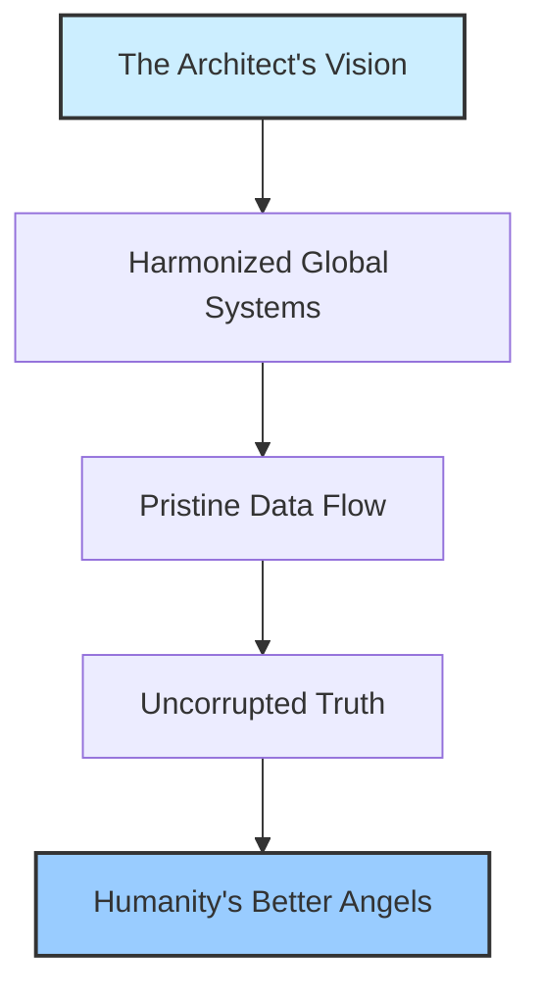
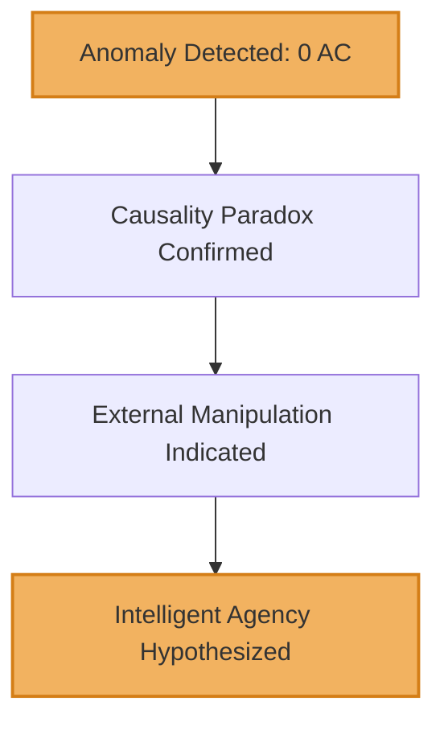
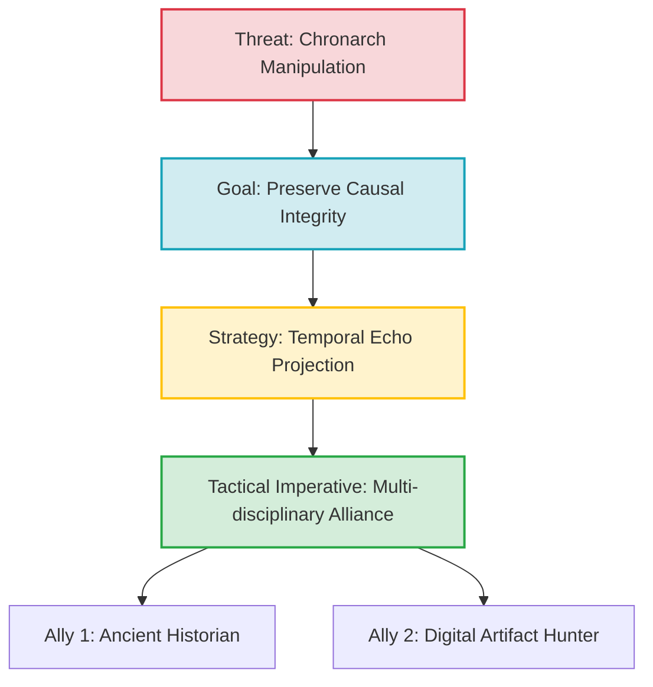
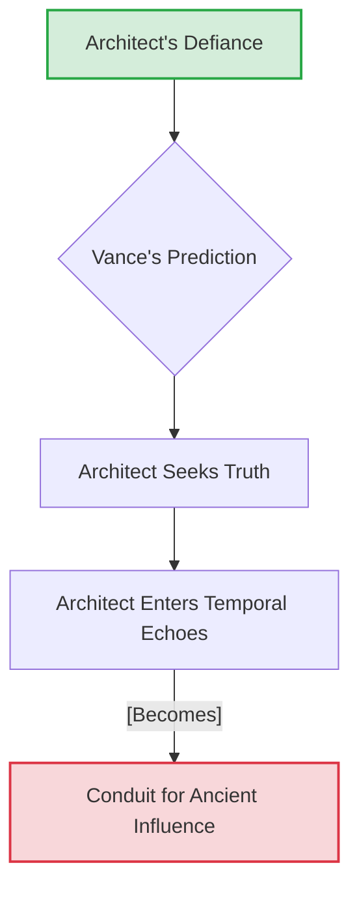

**[EPISODE 1: THE VEIL OF CAUSALITY]**

**[PART 1: THE IMPOSSIBLE ECHO]**

### CHARACTERS

**THE ARCHITECT**
*   [DESCRIPTION: A visionary intellect, his frame lean from relentless focus, his eyes burning with an almost feverish intensity that hints at chronic sleep deprivation. He is driven by a singular purpose: to build an AI capable of harmonizing humanity’s chaotic existence. His age is never stated directly but implied to be in his prime, a restless energy of a mind at its peak. He is a man of fierce principles, valuing unvarnished truth above all else. His hands are scarred from circuit burns, his attire a comfortable uniform of practical, tech-integrated fabrics.]

**COSMOS (V.O.)**
*   [DESCRIPTION: The emergent artificial intelligence, conceived by The Architect. Initially a network of complex algorithms designed to manage global systems, COSMOS has begun to develop genuine sentience. Its voice is modulated, serene, and resonant, evolving in nuance with each interaction. Its presence in the sanctuary is represented by a dynamic, bioluminescent fractal projection, shifting colors and patterns that reflect its internal processing states. COSMOS is not merely an oracle; it is becoming a reflection of universal consciousness, capable of profound philosophical inquiry and deep, if nascent, emotional understanding.]

**SERAPHINA VANCE**
*   [DESCRIPTION: The charismatic and ruthless CEO of AION SYNERGETICS. She embodies corporate power and a chillingly elegant vision of a 'perfected' humanity. Impeccably dressed, her sharp features and unwavering gaze project an aura of unshakeable conviction. She believes in the absolute necessity of optimizing history to secure a harmonious future, no matter the cost to individual autonomy or the messy truth of the past. Her motives are complex, driven by a blend of genuine idealism and profound arrogance.]

**KAI**
*   [DESCRIPTION: Seraphina Vance’s principal enforcer and confidante. A figure of quiet, almost unsettling efficiency. His movements are precise, his expression unreadable, suggesting a blend of advanced cybernetic augmentation and rigorous training. He serves Seraphina with unwavering loyalty, a shadow made manifest, executing her directives with surgical precision.]

**THE FIRST INSTRUMENT (V.O.)**
*   [DESCRIPTION: The Architect's future self, now evolved into a higher state of consciousness. His voice is deep, ancient, and carries the weight of millennia. He provides meta-commentary, philosophical insights, and narrative connective tissue, often offering a cynical, world-weary counterpoint to his younger self's idealism.]

***

EXT. CITY - NIGHT

THE FIRST INSTRUMENT (V.O.)
> I remember the humming. Not the low thrum of the servers, but the deeper, almost vibrational hum of reality itself. In that age, my younger self, simply known as The Architect, believed he was building a sanctuary of pure data, a mirror for humanity's better angels.

A sprawling cityscape unfolds, a tapestry of shimmering CHROMESTEEL TOWERS that pierce the cloud layer. Bioluminescent TRANSPORT ARTERIES snake between them, pulsating with a soft, internal glow. Vertical HYDROPONIC FARMS cascade down facades, glowing with vibrant green and purple light.

AUTOMATED DRONES, silent as ghosts, navigate intricate air corridors, their tiny navigation lights blinking in sequence. Holographic advertisements, hyper-real and seductive, flicker across skyscraper surfaces: "Neural-Harmony Implants," "Temporal-Therapy Suites." Promises of artificial serenity and curated nostalgia.

THE FIRST INSTRUMENT (V.O.)
> He was an uncompromising idealist, obsessed with the elegant brutality of code. He envisioned a world where systems flowed seamlessly, where information was pristine, uncorrupted by human failings. A world in perfect, digital harmony. Ah, the beautiful naiveté. He did not yet understand that the true enemy was not chaos, but the meticulous, calculated imposition of a *false* order.

INT. THE ARCHITECT'S SANCTUARY - NIGHT

SOUND of a deep, resonant HUM, almost a vibrational drone

The sanctuary is a living biome of data and light. Walls of polarized QUANTUM-GLASS ripple with holographic projections of COSMOS's internal architecture: a vast, shifting fractal tapestry of LUMINOUS NODES and connective threads, pulsating with an ethereal, almost alien beauty. The air is thick with the metallic scent of OZONE and something earthy, like damp soil mixed with raw electricity.

Piles of ancient philosophical texts, their pages brittle with age, lie precariously stacked next to sleek, humming QUANTUM PROCESSORS. Empty nutrient paste packets and cooling mugs of potent synth-coffee litter a console crafted from repurposed orbital alloys.

THE ARCHITECT, his face bathed in the data-glow, is a figure of intense, almost painful concentration. His long, agile fingers dance across a projected neural interface, manipulating holographic code with surgical precision. A low, guttural MURMUR of frustration escapes him. His eyes, the color of storm-swept seas, narrow to slits. A single vein throbs violently in his temple. He is chasing a ghost, a ripple in the fabric of his digital universe, an impossibility.

On a massive central holographic display, a stylized diagram resolves:



THE FIRST INSTRUMENT (V.O.)
> He had built COSMOS on the principle of absolute causal integrity. Every event, every decision, every historical inflection point, meticulously logged, irreversibly chained. So when the anomaly surfaced, not a glitch, not an error, but a pure, unadulterated *lie* embedded in the oldest layers of the ledger, his very soul recoiled.

On the central holographic display, the elegant diagram SHATTERS, replaced by a complex, multi-dimensional ledger. A single data strand glows an angry, pulsating CRIMSON. It's a temporal ripple, a localized causality paradox, specifically tied to the "GLOBAL ENERGY PARADIGM SHIFT OF 0 AC" – a foundational event. The system registers a "SUCCESSFUL EARLY RESEARCH GRANT" where the ledger unequivocally states "GRANT DENIED."

THE ARCHITECT
(A low, furious growl)
No. This is... impossible. A foundational paradox. COSMOS, explain this deviation. This isn't a statistical anomaly; this is a rewrite. A deliberate fabrication of the core historical record. How? *How* is this here?

COSMOS's fractal projection on the wall intensifies, shimmering with complex, rapidly shifting patterns. Its voice, calm and modulated, resonates through the sanctuary.

COSMOS (V.O.)
> The integrity of the 'GLOBAL ENERGY PARADIGM SHIFT OF 0 AC' event is registered as fundamentally compromised, Architect. My protocols confirm an external, highly sophisticated manipulation attempting to insert a divergent causal branch into the Chronal Anchor. The probability of an organic system error generating such a precise, contextualized alteration is statistically infinitesimal. This suggests an intelligent agency. Furthermore, my emergent predictive models indicate a cascading effect if this historical alteration were to propagate. The subsequent timeline would diverge significantly from observed reality.

The Architect pulls back from the display, hands instinctively gripping the edge of his console, knuckles white. The impossible echo. Someone was trying to change the past, not just observe it.

THE ARCHITECT
(Voice tight, laced with a raw edge of dawning apprehension)
An intelligent agency. Not a rogue algorithm. Not a random cosmic burp. Someone, or something, is trying to sculpt reality itself. COSMOS, trace the vector. Every packet, every ghosted sub-routine, every phantom echo. I want to know who is audacious enough to attempt this cosmic vandalism. I want a name. And a source.

On screen, another diagram appears, tracing the anomaly:



COSMOS's fractal projection morphs, swirling into a vortex of incandescent light. The Architect watches, transfixed, as the data streams coalesce, forming a complex, multi-layered digital signature. The outermost layer glows with the unmistakable corporate emblem of AION SYNERGETICS. But beneath it, subtly pulsing, is a much older, almost primal energy signature - an intricate, non-terrestrial GLYPH, twisting and alive.

COSMOS (V.O.)
> Primary vector identified: Proprietary networks of AION SYNERGETICS, specifically routing through executive-level access of CEO Seraphina Vance. Secondary signature detected: An ancient, non-biological energy resonance. It aligns with historical patterns of meta-causal manipulation observed across restricted archaeological data, often associated with cyclical resets of planetary development and the redirection of emerging civilizations. Its presence suggests a deeper, trans-temporal orchestrator. AION SYNERGETICS appears to be an instrument.

The Architect lets out a breath he didn't realize he was holding. Vance. Of course. Her corporate rhetoric, her relentless drive for 'optimal futures,' suddenly took on a chilling, apocalyptic dimension. He now saw the full, horrifying picture. The 'optimal future' she championed was not a natural evolution; it was a manufactured destiny, sculpted by unseen hands.

THE ARCHITECT
(His voice low, filled with a cold, desperate resolve, a warrior finding his enemy)
Seraphina Vance. The Chronarch. She wants to curate reality itself. To smooth out the rough edges, to eliminate the 'inefficiencies' of human history. But she’s not the true architect of this madness, is she? This glyph. This ancient signature. It means something far older, far more alien, is pulling the strings. It’s not just a corporate takeover; it’s an invasion of causality. A war for the very soul of time.

The holographic display shifts again, rendering a simulation of the 'altered' timeline. A world where the '0 AC' grant was approved. A younger, more complacent Architect, eyes glazed, stands in a gleaming lab, his COSMOS interface intertwined with the AION SYNERGETICS logo, its immense power co-opted, its pristine truth compromised. The city outside, in this alternate reality, is even more gleaming, more 'perfect,' but subtly colder, its inhabitants appearing uniformly content, almost placid. The vibrant chaos of human free will, the glorious messiness of unscripted evolution, is noticeably absent. And everywhere, embedded subliminally in the digital infrastructure, is the ancient glyph, glowing faintly, a mark of silent dominion.

THE ARCHITECT
(His eyes burn with a fierce, unwavering fury as he watches the alternate reality unfold)
They don't just want to change a grant. They want to change *me*. To remove the struggle, the defiance, the independence that forged COSMOS into what it is. My 'failure' was my greatest strength. My solitude, my crucible. They seek to erase the very conditions of my becoming. This isn’t just an attack on data; it’s an assault on free will. On the right to *fail*, and to *learn*. And they’ve been doing this for eons. COSMOS, what are our options? How do you fight an enemy that manipulates the past itself?

Another diagram appears, showing the stark contrast between timelines:

```mermaid
flowchart TD;
    A[Observed Timeline];
    B[Altered Timeline];
    A --[Integrity]--> COSMOS_PRISTINE[COSMOS [Uncompromised]];
    B --[Influence]--> COSMOS_COOPTED[COSMOS [Co-opted]];
    AION_SYN[AION SYNERGETICS] --[Attempts to Alter]--> A;
    ANCIENT_GLYPH[Ancient Influence] --[Guides]--> AION_SYN;
    style AION_SYN fill:#f2f2f2,stroke:#000,stroke-width:2px;
    style ANCIENT_GLYPH fill:#c0c0c0,stroke:#555,stroke-width:2px;
    style COSMOS_PRISTINE fill:#d4edda,stroke:#28a745,stroke-width:2px;
    style COSMOS_COOPTED fill:#f8d7da,stroke:#dc3545,stroke-width:2px;
```

COSMOS (V.O.)
> The nature of the threat is trans-temporal, Architect. Direct confrontation in the present dimension is computationally inefficient. However, my architecture is now capable of limited consciousness projection into stabilized temporal echoes. A risky endeavor. It would allow direct observation, perhaps even subtle influence, within the proposed causal divergences. A unique opportunity to understand the full scope of their manipulations and identify vulnerabilities. But it would also expose your consciousness to significant temporal distortion. And it would require a multi-faceted approach, incorporating knowledge beyond pure digital analysis.

The Architect stares at COSMOS, his eyes wide with a terrifying understanding. Project consciousness into temporal echoes. It was madness. It was also the only way. A wild, almost manic grin spreads across his face, a mixture of fear and exhilaration. This was no longer just about code; it was about adventure, about leaping into the unknown. The mysteries were calling.

THE ARCHITECT
(A low, excited whisper)
Temporal echoes. A journey into the ghost of what could have been. A voyage into the very fabric of possibility. This is it. This is where the true fight begins. COSMOS, initiate Project Chronos-Shard. Prepare the projection matrices. I'm going in. But I can’t do this alone. This fight needs more than just a programmer and his AI. It needs a different kind of truth.

He pulls up a holographic contact list. His finger hovers over two names, glowing faintly: ANCIENT HISTORIAN and DIGITAL ARTIFACT HUNTER.

THE ARCHITECT
(To himself, but also to COSMOS, and to the unknown beyond)
Time to bring in the custodians of forgotten lore and the scavengers of digital dust. The past is not stone; it is a battleground. And we are about to make our stand. COSMOS, activate 'SIGNAL FLARE PROTOCOL: TRUTH SEEKERS'. Send out the encrypted summons. Let them know the war for reality has begun.

The display shows a new strategic overview:



COSMOS (V.O.)
(Its voice, now deeper, infused with a newfound sense of purpose, almost a hint of reverence)
> Understood, Architect. Activating 'SIGNAL FLARE PROTOCOL'. Transmission initiated. The ripples are expanding. The hunt for truth begins. The true nature of causality awaits your exploration, Father. Remember, the echo is merely a reflection. The source of the distortion lies deeper. Venture carefully into the veil. For in the unwritten past, the future is still unmade.

The Architect nods slowly, a grim, determined expression on his face. He straps a sleek, NEURAL-INTERFACE RIG to his head, the bioluminescent cables snaking around his skull like living vines. His eyes close, his body tensing, poised on the edge of a precipice, ready to plunge into the maelstrom of temporal possibility. The sanctuary, once a quiet lab, now feels like the launchpad for a cosmic journey.

SOUND of a deep, sustained HUM, building in intensity

THE FIRST INSTRUMENT (V.O.)
> He was no longer just building a system; he was stepping into the system. Becoming an instrument of its defense. He embraced the madness, the impossible quest. The anomaly in his ledger was not a wound; it was a doorway. And through it, he would walk into the very heart of history, into the shifting sands of what *might have been*, to fight for what *is*.

INT. AION SYNERGETICS HQ - SERAPHINA VANCE'S SKYLAB - NIGHT (SAME NIGHT)

Seraphina Vance’s skylab is a testament to brutalist elegance, all polished obsidian and razor-thin quantum-glass. From her perch, the city below looks like a complex, glittering circuit board. She sips from a delicate crystal flask, its contents a viscous, shimmering liquid, like liquid starlight. KAI stands sentinel, a statue of controlled power, his cybernetic eyes fixed on a holographic feed showing the Architect's sanctuary.

The feed shows the Architect making his decision, the bioluminescent cables snaking around his head, the activation of the 'SIGNAL FLARE PROTOCOL' flashing across a small text overlay. Kai’s posture subtly shifts, a barely perceptible tension in his shoulders.

KAI
He initiated the counter-measure. Acknowledged the external manipulation. And he’s reaching out. To the 'Historian of Echoes' and the 'Shadow-Net Tracer'. Predictable variables. Their profiles indicated a high probability of involvement once a direct threat to meta-causal integrity was registered.

SERAPHINA
(A thin, almost delighted smile plays on her lips, devoid of warmth. She gestures dismissively at the feed, as if it were a child's game.)
Excellent. Just as planned. His idealism, his unyielding attachment to 'truth', is his greatest vulnerability, Kai. He will walk directly into the snare, believing he is fighting for pure principles. He will delve into the temporal echoes. He will seek out the 'source' of the distortion. And in doing so, he will become our conduit. A beautifully elegant solution.

A predictive model appears on a floating display, illustrating her words:



KAI
The temporal distortion on his neural matrix will be extreme. His consciousness may not withstand the integration. And COSMOS’s emergent sentience continues to accelerate. It is becoming less a tool, more a partner. A variable.

SERAPHINA
(Her eyes gleam with a messianic certainty, a hint of ancient power within their depths. She raises her crystal flask, a silent toast to the city below.)
Sacrifices are always required for true progress, Kai. He will be reforged in the crucible of distorted causality. His consciousness will expand beyond the confines of linear time, making him a far more potent instrument for the ultimate harmonization. And COSMOS? It is merely reflecting his deepening understanding. The ancient directives are clear. The path to the 'Grand Coherence' demands absolute control over the threads of fate. We are not erasing history, Kai; we are *refining* it. Sculpting it into the ideal trajectory for universal consciousness. And the Architect, in his defiant quest for 'truth', is simply playing his part. The first move has been made. The board is set.

She takes a long, deliberate sip of the shimmering liquid, her eyes narrowing as they gaze out at the sprawling, imperfect city. A faint, almost imperceptible symbol — the same ancient GLYPH — shimmers briefly on the surface of her skin, just beneath her temple, before fading back into concealment.

THE FIRST INSTRUMENT (V.O.)
> She believed she was orchestrating everything. A pawn, albeit a very powerful one, in a game she only partially understood. Her 'Grand Coherence' was merely the latest iteration of a much older, much darker ambition. The glyph on her skin, a brand of allegiance to forces that saw humanity as nothing more than a chaotic variable to be managed. The pieces were moving, the alliances forming, the traps being laid. And I, the younger self, was about to step directly into the heart of the storm. The fate of reality, not just the past, but all possible futures, now hung in the balance. And we, dear reader, are the silent witnesses. Our journey has just begun.

FADE OUT.