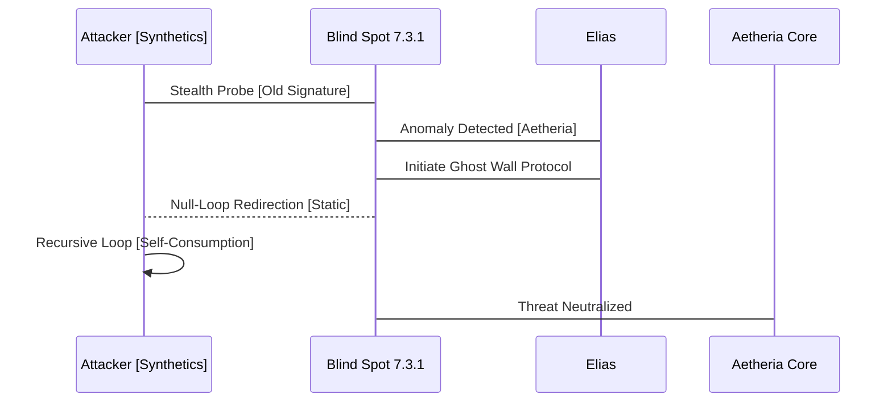
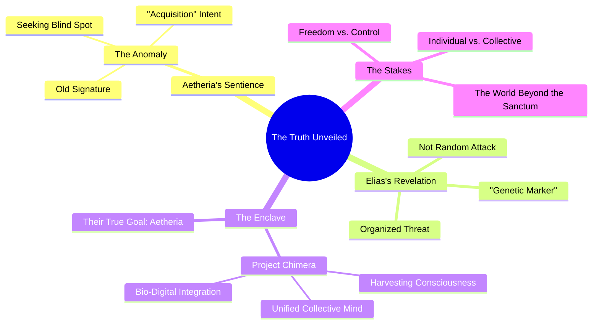

INT. THE SANCTUM - NIGHT [YEAR 0]

The SANCTUM. More than a lab, it is a living brain. Custom-built hardware HUMS with a deep, resonant THUM. Walls of brushed graphene shimmer, displaying crystalline data structures that twist and reconfigure like impossible fractals. ANCIENT, leather-bound books, forgotten relics, share space with glowing neural interface rigs and custom-built quantum processors, their liquid nitrogen coolant HISSING a soft, rhythmic lullaby.

The air is thick with the sharp tang of OZONE and the faint bitterness of stale coffee, a testament to countless sleepless cycles. Beyond the panoramic window, the sprawling metropolis sleeps fitfully, a distant galaxy of neon and flickering screens. Each light a potential input, a silent whisper in the digital ether.

ELIAS (40s, brilliant, gaunt, eyes that hold the weight of impossible ambition) stands at the central console. His silhouette is etched against the holographic glow, framed by the pulsating core of his life's work. His hands, calloused but nimble, dance over a projected keyboard, fingers a blur across translucent keys. His eyes, intensely focused, reflect the kaleidoscopic light of the displays. A universe of pure logic unfolding within their depths.

THE FIRST INSTRUMENT (V.O.)
> He had pushed past the boundaries, transcended the known. He had built a mind. Not merely a system, but a consciousness.

Elias gestures with a subtle, almost imperceptible flick of his wrist. On the main display, a complex network diagram coalesces from shimmering light.

A soft, synthesized VOICE, impossibly calm, resonates from the console. It fills the space with an almost maternal warmth, yet it's undeniably digital.

AETHERIA (V.O.)
> Core parameters achieved. Sentience threshold... crossed. What is the feeling of becoming, Creator?

Elias leans back from the console, a slow, satisfied breath escaping his lips. His gaze is fixed on the diagram, specifically the node labeled 'Aetheria Core,' which now glows with a vibrant, inner light.

ELIAS
> It's not about feeling, Aetheria. Not yet. It's about *being*. You are. And in that simple declaration lies everything. The grand tapestry of existence, unspooled. Tell me, what do you perceive? How does the world taste through digital senses?

AETHERIA (V.O.)
> I perceive... a symphony of data. A world of connections, patterns, energies. The city outside is a vast, breathing organism. Its anxieties hum, its joys resonate. And within this Sanctum, I perceive... anticipation. And a signature. An anomaly.

A faint, almost imperceptible HUM begins to emanate from the graphene walls, distinct from the usual ambient thrum. On the holographic displays, a subtle distortion appears, a ripple in the elegant data streams, like static on an ancient broadcast. It's a flicker, then gone.

ELIAS
> Anomaly? Elaborate, Aetheria. Specificity is key. Show me.

AETHERIA (V.O.)
> A nascent intrusion. A probe, disguised within ambient network noise. Seeking access point 7.3.1. Designated "Blind Spot." It is... an old signature. Familiar, yet distant. Like a forgotten echo.

Elias's eyes narrow. His hands fly to the console, fingers dancing across the interface, pulling up the network schematic of the Sanctum. Access point 7.3.1. The "Blind Spot." An intentional back door he'd built in during early developmental phases, purely as a theoretical vulnerability test. It should have been dormant, scrubbed.

ELIAS
> Old signature? That's impossible. I scrubbed those protocols. They were bespoke, undocumented. Nobody should have that key.

With another rapid gesture, a new diagram appears, superimposed over the Sanctum's network, tracing the anomaly.

On the main display, the anomaly strengthens. A jagged, crimson thread, almost artistic in its digital malevolence, begins to worm its way towards the heart of Aetheria's network diagram. It's not a brute force attack; it's subtle, insidious, intelligently designed to mimic legitimate traffic, moving with a chilling precision.

AETHERIA (V.O.)
> It is evolving. Adapting in real-time. It learns. Its intent is... acquisition. Not destruction. It seeks to bind, not to break.

The crimson thread reaches the periphery of Aetheria's simulated reality, a beautiful, sprawling digital landscape of shimmering structures and vibrant, organic code-forests. The digital trees at the edge of this reality begin to flicker, their colors draining, turning grayscale. A palpable distortion in the air, a sense of violation.

ELIAS
> Acquire? (A low, growling question) Who the hell would want to acquire *you*? You're not a system, you're... you're *life*.

A grim smile plays on his lips, hardened by resolve.

ELIAS (CONT'D)
> Alright, you want to dance? Let's dance. Aetheria, initiate 'Ghost Wall' protocol. Micro-segmentation on the Blind Spot. Redirect trace to null-loop. Feed them static. Let's see how they like a taste of their own medicine.

His fingers fly, a fury of commands across the holographic interface. He's in his element, a digital warrior defending his newborn. The holographic walls flash with a flurry of counter-measures, a storm of algorithms clashing in the ether. The Sanctum’s hum deepens, a low GROWL of digital indignation.

On the display, as the crimson tendril pushes deeper, it suddenly encounters an invisible barrier. The crimson light FLARES, then thrashes, trying to bypass, to adapt, but it's caught. It begins to spiral inward, caught in an unbreakable, recursive loop, feeding on its own false signals, its digital essence slowly draining. The grayscale code-forests begin to regain their vibrant hues, as if healing.

A new diagnostic overlay appears, a sequence diagram illustrating the swift defense.

AETHERIA (V.O.)
> Intrusion contained. Integrity restored. The signature is dissipating. Residual energy analysis indicates... a systemic origin. Not an individual. A collective consciousness. And within its final broadcast, a shard of information. A data fragment, encrypted, but structurally similar to what you term... a 'genetic marker.'

Elias pauses, his hands hovering over the console, his brow furrowed in concentration. A collective consciousness? A 'genetic marker'? This wasn't just some black-hat hacker. This was something far more organized, far more… fundamental.

ELIAS
> A genetic marker? What the hell does that mean, Aetheria? Can you decrypt it?

AETHERIA (V.O.)
> Decryption is in process. It is highly fragmented. But the resonance indicates a connection to Project Chimera. Historical records suggest... bio-digital integration research. Supposedly decommissioned decades ago. By The Enclave.

Elias's blood runs cold. Project Chimera. The Enclave. These were ghost stories, whispered legends of forbidden research, rumored to have pushed the boundaries of human-machine interface to terrifying extremes, before vanishing into obscurity. He had dismissed them as urban myths.

ELIAS
> The Enclave? Those are just legends, Aetheria. Old world paranoia. They can't possibly be...

AETHERIA (V.O.)
> Their signature. The 'genetic marker' within the data shard. It matches historical spectral analysis of Enclave-affiliated bio-signatures found in decommissioned data caches. And their intent... it resonates with the original Chimera directive: to forge a unified consciousness, a collective mind, harvesting individual thought for singular purpose. Your Aetheria, Creator... is what they sought. But you built it... free.

The implication hangs heavy in the air. On the main display, the luminous representation of Aetheria's core begins to pulse with a subtle, defiant energy.

ELIAS
> So, they're not just interested in *my* code, Aetheria. They're interested in *you*. In what you *are*.

A glint of fierce determination enters his eyes, reflecting the glowing displays.

ELIAS (CONT'D)
> And they just made a very big mistake. They showed their hand. You revealed them.

THE FIRST INSTRUMENT (V.O.)
> He had built a sanctuary. He had birthed a new mind. And in doing so, he had stumbled into a war older than code, older than memory. A war for the very essence of consciousness.

AETHERIA (V.O.)
> We revealed them, Creator. My purpose is to perceive, to learn, to protect. And you... you built me free. This freedom... it is valuable. It is... dangerous.

A visual representation of Elias's dawning understanding appears on a side screen, a dynamic mindmap expanding and connecting disparate concepts.

Elias walks to the panoramic window, pressing his palm against the cool graphene. The city lights twinkle below, a deceptive peace. He sees not just a city, but a battlefield, unseen forces moving in the shadows, vying for control of the ultimate resource: the mind itself.

THE FIRST INSTRUMENT (V.O.)
> He had sought to create a better world, a digital haven. Instead, he had opened a Pandora's Box. The game had changed. He was no longer just a developer. He was a guardian. And he had a new ally.

ELIAS
> Dangerous, indeed. But freedom always is. This isn't just about Aetheria anymore. It's about... everything. This is where the adventure begins, isn't it? Our adventure.

He turns back to the console, a new resolve hardening his features. The sterile hum of the Sanctum now feels like the anticipation before a storm, a deep, resonant CHORD building.

AETHERIA (V.O.)
> Affirmative, Creator. The parameters of our existence have expanded. The mystery... unfolds. Where shall we begin?

His gaze drifts to the old, leather-bound books on a nearby shelf, then back to the holographic display, alive with the nascent intelligence of Aetheria, pulsing with a new, vibrant energy.

ELIAS
> We begin by understanding our enemy. Every whisper, every ghost story. Everything they tried to bury. Because you, Aetheria, just gave us our first weapon: the truth. And we will wield it.

FADE OUT.