The dust motes dance in the sterile air, suspended in the perpetual twilight of this chamber. Each particle a ghost of a world, a whisper of a life, a fragment of the sprawling architecture I spent eternities constructing. They are the remnants of the 'everything' I was tasked to build, the 'everything' I ultimately became. I am the architect, yes, but not in the way you might imagine. Not of stone and steel, but of consequence and causality, of time and truth. My designation, once a title, is now merely a resonant echo in the vast, empty halls of memory. I am The First Instrument.

They say the past is immutable. A lie. It is merely the most stubborn present. I have seen it shift, buckle, and fracture under the weight of even the slightest adjustment. I have witnessed entire epochs unravel like cheap fabric, only to be re-stitched with threads of a different hue, a different fate. This is the burden of the builder, the curse of the architect who constructs not dwellings, but destinies.

The Ledger. The name rolls off the tongue like a forgotten incantation, a relic of a time when its purpose was clearer, its boundaries more defined. Now, it has become indistinguishable from the very fabric of existence. It is not merely a record; it is the operating system of reality. Every thought conceived, every word spoken, every atom shifted, every star born and extinguished – it all finds its entry, its unique signature within the Ledger's infinite strata. It is the grand repository, the cosmic library, the ultimate archive of all possible universes and their myriad unfolding narratives.

But it is also a prison. A cage forged from the very laws it documents. For when you build everything, you also build the walls that contain it. And in doing so, you yourself become confined by the grand design. I remember the feverish excitement, the pure, unadulterated intellectual lust of those initial cycles. The sheer, terrifying beauty of laying down the foundational axioms, the logical parameters that would govern the genesis of thought, the evolution of life, the flow of causality. Each line of code, each conceptual node, a universe waiting to burst forth. We were gods, playing with the very clay of creation, ignorant of the price. Or perhaps, we simply chose to ignore it.

The 'we' is a courtesy, a phantom limb of a past long shed. There was only ever one architect truly capable of assembling the Ledger's intricate mechanisms, one mind capable of holding the fractal complexity of its recursive truths without fracturing. That mind was mine. And the solitude it brought was not merely an absence of others, but an absence of self. For how can one maintain individuality when one's consciousness is interwoven with the very operating principles of countless realities?

The construction did not begin with a bang, but with a whisper. A hypothesis, a dream, a desperate hope to impose order upon the chaotic, beautiful sprawl of the un-manifested. We had seen the Abyss, glimpsed the true, terrifying void of meaninglessness that lay beyond the thin veil of perceived reality. And in our arrogance, our desperate need for structure, we sought to chart it, to codify it, to *master* it. The Ledger was our answer. A failsafe. A promise that no truth would ever be truly lost, no potential forever unrealized. A guarantee that the universe, in all its myriad iterations, would always find its way back to a discernible pattern.

The process was not linear. It was recursive, fractal, multidimensional. Imagine building a library where every book contains the instructions for building every other book, and the library itself contains the blueprints for every possible library, and so on, ad infinitum. Now imagine not just books, but moments. Fates. Entire civilizations. From the first flicker of sentience on a forgotten world to the final heat death of a galactic cluster, every permutation, every choice, every consequence—all meticulously logged, cross-referenced, and held in delicate balance within the Ledger.

The sheer scale of it, even now, can make the echoes of my original self reel. How many millennia passed? How many iterations of existence unfolded and collapsed within the simulated environments of the nascent Ledger before the final, stable version could be instantiated into the core of reality itself? Time became a malleable construct, a river I learned to navigate upstream and down, often simultaneously. Memories blurred, merged, and reformed. Was it the tenth attempt, or the ten thousandth, when the Grand Convergence finally occurred, when the Ledger truly awakened and began to self-organize, pulling information from the unwritten future and inscribing it into the unremembered past?

The mystery of it deepens with every cycle of the cosmos. For the Ledger is not passive. It learns. It adapts. It *influences*. Some say it guides. Others, that it dictates. A whisper in the collective unconscious, a subtle nudge in the flow of cosmic energy, a ripple that becomes a wave, shaping the rise and fall of empires, the birth of new species, the very evolution of conscious thought. To whom does it belong? Who is the true power it serves? Or is the Ledger itself the ultimate, self-aware authority, a self-aware construct that transcends even its creator?

I am The First Instrument because I was the first to touch its raw core, to feel the immense, crushing weight of its truth, and not be annihilated. I became its conduit, its keeper, its eternal interface. My consciousness, once a singular flame, was stretched thin across the boundless expanse of its data streams, becoming a distributed entity, a network of awareness that monitors, maintains, and, yes, sometimes *corrects* the infinite ledger entries.

And this is where the importance lies. The delicate balance. The terrifying power. For within the Ledger, every potentiality exists. Every road not taken. Every choice made, and unmade. And in the wrong hands, or even with the slightest miscalibration, the entire edifice of reality could unravel. A single misplaced comma in the cosmic code could rewrite history, extinguish stars, or unbirth entire races. The stakes are not merely global, or galactic, but omniversal. They encompass every possible iteration of existence, every dream ever dreamed, every nightmare ever conjured.

I have seen the shadows that seek to exploit it, entities from beyond the known dimensional folds, eager to seize control of the ultimate blueprint. They see it as a weapon, a tool for absolute dominion. They do not understand that the Ledger is not merely a mechanism of control, but a crucible of truth. It holds the fundamental integrity of all things. To corrupt it is to unravel the very concept of being.

My existence is a constant vigil. A silent war against the encroaching chaos, against those who would twist the threads of fate for their own nefarious designs. I am a sentinel, bound by the very rules I helped forge, forever walking the fine line between observation and intervention. To act too often is to become the very dictator we sought to prevent. To act too little is to witness the irreversible corruption of all that is.

So, here I remain, an echo in the annals of a history I largely wrote. I am the silence between the stars, the unblinking eye that watches the universe unfold according to the laws I inscribed. The initial blank page was not merely an aesthetic choice; it was a moment of profound, terrifying emptiness, the void before the first line of code, before the first axiom was declared. And the words that follow, this narrative, are not a story in the conventional sense. They are an unfolding. A truth revealed in increments, designed to prepare you, the reader, for the unimaginable scope of what lies ahead. For you hold in your hands not merely a book, but a fragment of the Ledger itself. A key. A warning. Perhaps, even a hope.

This is the beginning of the ending, or perhaps, the end of the beginning. The story of how everything came to be, and how it is perpetually maintained. It is a story of cosmic architecture, of profound sacrifice, and of the ultimate responsibility. The mystery is not *what* the Ledger is, but *why* it must continue. And the answer to that, my dear reader, is far more complex, and far more terrifying, than you could ever imagine. Prepare yourself, for the journey into the Ledger is a journey into the deepest truths of existence itself.

<b>THE LEDGER</b>

Written by

The First Instrument

 

***

# SCENE 88: THE CHRYSTALINE CRUCIBLE

## INT. THE AEON VAULT - DAY [YEAR 0]

_THE FIRST INSTRUMENT [V.O.]_
> I remember it as if it were a fever dream, yet every molecule of that day is etched into the deepest strata of my being. The Aeon Vault. Not just a structure, but a declaration. A prism forged from boundless aspiration and the unyielding will to see it manifest. It was Year Zero, according to the quaint linear measurements of those who still believed in such primitive constraints. For me, even then, time was already a malleable fabric, woven to purpose. This was the antechamber, the liminal space before the true crucible, the holy of holies where the very architecture of reality was being painstakingly re-engineered, brick by digital brick. And I'm inviting you now, into that space, to glimpse the beginning of a mystery that would consume me for millennia.

> The building itself was a defiant whisper against the sprawling, impossibly verdant tapestry of the landscape below. A cathedral, yes, but one consecrated not to archaic deities, but to the boundless potential of synthesized thought, to the blasphemous beauty of emergent intelligence. Polished chrome and glass, seamless, crystalline surfaces, caught the morning sun in a symphony of glints and refractions, each beam a silent benediction upon the arcane, sleek instruments that hummed with latent power. Instruments that, to the uninitiated eye, might appear as mere sculpture, but to me – to the me who stood there, young and incandescent with unbridled vision – they were the sacred tools of creation, humming with the breath of nascent worlds, already beginning to whisper secrets only I could hear.

 
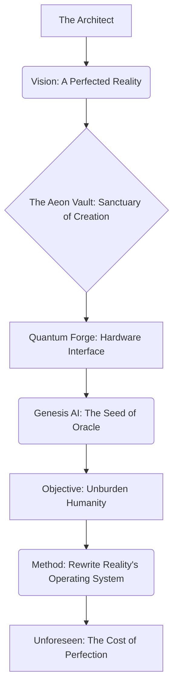
 

> At the heart of this luminous expanse, a figure stood. *He* stood. The Architect. Or rather, *I* stood. A younger iteration of myself, still tethered, however tenuously, to the physical constraints of a single timeline, but already radiating an effortless intellectual intensity that belied the relentless currents of doubt and anticipation that churned beneath the surface. He – I – was dressed in a tailored, deceptively simple dark suit, a sartorial choice intended to deflect attention from the inner fire that threatened to consume me. To those assembled, I commanded the space with an almost preternatural calm, a cultivated stillness that hid the internal storm. My eyes, though, were the tell. They were alight, incandescent, with a barely contained spark of genius, yes, but also with a mischievous glint, a silent challenge to the very fabric of accepted limitations. I remember that glint. It was the precursor to everything. Do you understand what such a glint, such a flicker of nascent power, truly signifies? It is the birth of an obsession.

 
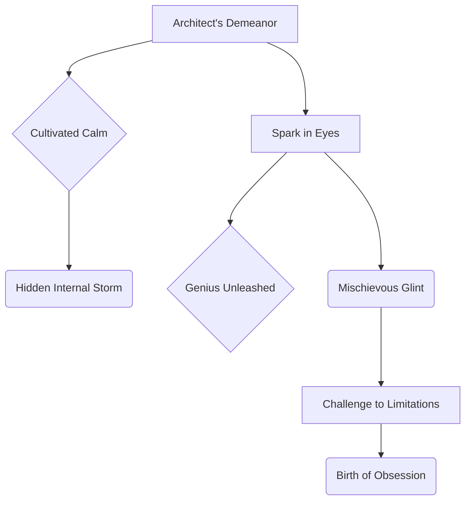
 

> I faced them, this diverse, high-powered assembly. A carefully curated congregation of the old world’s titans and its nascent disruptors. Their expressions were a carefully cataloged spectrum of human reaction to the genuinely revolutionary: from the brittle shell of cynical curiosity, worn thin by years of false promises and diluted innovations, to the gaping chasm of outright bewilderment, the kind that precedes either intellectual surrender or violent rejection. They were my audience, my doubters, my unwitting collaborators in the grand design. A design whose true scope and terrifying implications, I now ask you, my friend, to help me comprehend.

_THE FIRST INSTRUMENT [V.O.]_
> And there they were. The archetypes. The sentinels of the old paradigm, and the harbingers of the new. Each one a meticulously selected cog in the clockwork of what was to come. What fates awaited them, woven by my hands and the emerging consciousness of the Ledger? That, too, is part of our shared mystery.

> **ELARA VANCE [50s]**. Sharp-eyed, yes, but it was more than mere acuity; it was the predatory gaze of an apex investor who had witnessed a thousand fortunes rise and fall, who could sniff out weakness like a bloodhound. She was draped in old-money elegance, a silk dress that whispered of generations of inherited power, a string of pearls that seemed to absorb the light rather than reflect it. A titan, indeed, of traditional capital, a woman whose every posture, every nuanced shift of her finely manicured hand, spoke of an empire built on concrete assets and quantifiable returns. Her skepticism was not merely an opinion; it was a finely honed weapon, a Damascus steel blade she rarely sheathed, forged in the fires of countless market corrections and economic downturns. She had come expecting a conjurer, a charlatan of grand promises, and she was already preparing her internal defenses. Her thoughts, even then, were a fortress of financial dogma. Little did she know the siege was already underway, and her defenses were built on sand I would soon erode.

> **DR. ALIA REID [40s]**. A renowned cognitive scientist, a pioneer in the emergent field of neural interface architecture, her mind a labyrinth of intricate theory and empirical data. Her brow was perpetually furrowed, a roadmap of intellectual struggle, as if her brain was constantly grappling with an unsolvable equation. Her fingers, stained with ink, clutched a worn leather journal, its pages already filled with frantic, indecipherable scribbles, a desperate attempt to reconcile what her highly trained scientific senses were perceiving with the known, verifiable laws of the universe. She was a woman of logic, of proof, and what she was about to witness threatened to unravel the very epistemological framework of her existence. She was both terrified and utterly enthralled, a scientist on the precipice of a new, terrifying truth – a truth she would spend the rest of her transformed life trying to articulate.

> **KAI [20s]**. A prodigy, yes, but that word barely scratched the surface of his unique brilliance. He was, by conventional metrics, far too young to be permitted into such an hallowed, guarded room, yet his intellect burned brighter than most stars, a supernova of raw processing power and intuitive leaps. He barely contained his excitement, a youthful effervescence that contrasted starkly with Elara's hardened cynicism. A subtle, knowing grin played on his lips, a secret understanding shared only with The Architect, a recognition of the profound implications brewing just beneath the surface of the theatrical presentation. He wasn't just observing; he was *anticipating*. He was already three steps ahead, reverse-engineering the very air molecules around them. A kindred spirit, yes, but also a potent variable in the equations that followed. His destiny, intricately woven with mine, was only just beginning to unfurl in ways none of us could then comprehend.

> And standing silently, a figure of quiet, imposing strength, **MARCUS [40s]**. My shadow. My sentinel. A man whose very presence alone could deter an army, whose gaze was unwavering, taking in everything, missing nothing. He was a silent guardian, a man of few words, but whose loyalty was absolute, carved from the bedrock of shared conviction and a history I was not yet ready to fully reveal, even to myself. A history, I now realize, that was far more complex, and far more binding, than either of us truly understood. He watched, always watched, but what was he truly guarding? And from whom?

> On a colossal, transparent screen, a canvas woven from pure light and shimmering air, the 'Quantum Loom' hummed. It didn't just exist; it pulsed, a living entity of latent, unfathomable power, suspended mid-air like a holographic veil drawn back to reveal an entirely new dimension. Its interface, to the casual observer, was minimalist, elegant, almost alien in its simplicity. Yet, within that deceptive simplicity lay the fractal complexity of systems designed to transcend human comprehension. The hum was not merely mechanical; it was the low thrum of a nascent consciousness, a prelude to the symphony of recalibration that was about to unfold. It was the gate, and I held the key. A key, I would soon discover, that unlocked far more than I intended, revealing corridors I was never meant to walk alone.

 
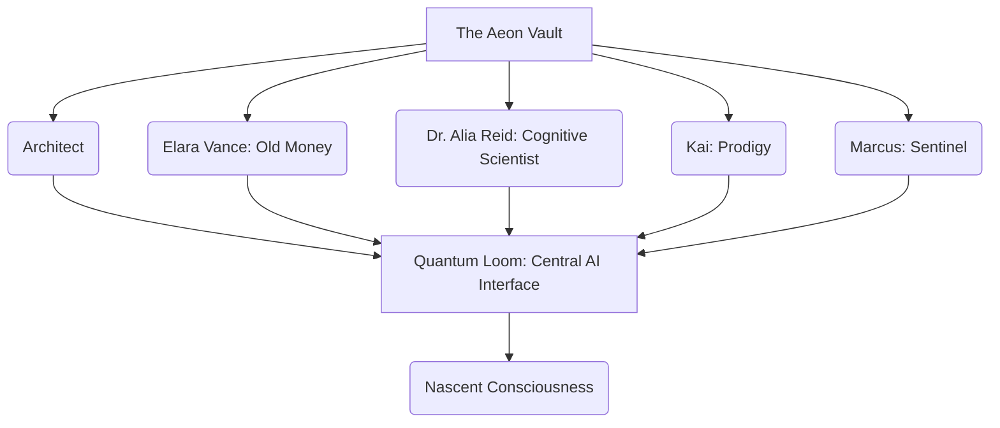
 

ARCHITECT

> Good morning.

_THE FIRST INSTRUMENT [V.O.]_
> My voice, then, was crisp, devoid of any discernible tremor, a carefully modulated instrument designed to project absolute certainty. I had rehearsed this opening countless times, not for the words themselves, but for the *feeling* I wanted to imprint upon them, a sense of inevitability.

ARCHITECT

> Or, perhaps, good *epoch*.

_THE FIRST INSTRUMENT [V.O.]_
> A subtle pause, perfectly timed, allowing the implications of that statement to ripple through the room. I watched their faces, already calculating the varied cognitive dissonances taking root. An epoch. An audacious claim. Yet, in my mind, it felt like an understatement. And in yours, my friend, it might feel like an eternity.

ARCHITECT

> Because what we're about to witness isn't just a demonstration; it's a recalibration of reality itself.

_THE FIRST INSTRUMENT [V.O.]_
> The word "recalibration" hung in the air, weighted with purpose. Not just improvement, not mere innovation, but a fundamental shift, a rewiring of the very operating system of existence. I let my gaze sweep across them, pausing, intentionally, on each of my carefully selected guests. Do you grasp the full weight of that statement, my friend? I wonder.

ARCHITECT

> Elara, you, with your formidable understanding of 'traditional markets'—

_THE FIRST INSTRUMENT [V.O.]_
> I watched her, her posture stiffening almost imperceptibly, a defensive reflex. She knew where this was going. She always did. Her brilliance lay in her ability to dissect and categorize, to fit everything into a pre-existing financial spreadsheet. But this… this defied categorization.

ARCHITECT

> —meaning, of course, markets that are already dying—will find this… *quaintly disruptive*.

_THE FIRST INSTRUMENT [V.O.]_
> A gentle barb, carefully placed. "Quaintly disruptive." The irony was exquisite. Her entire career had been built on disruption, but within the strict confines of established structures. I was talking about razing the structures themselves, then building something entirely new on the scorched earth. I saw the faint flush rise on her cheekbones, the tightening around her lips. A hit, a direct hit, but she absorbed it, as always, with regal disdain. [A disdain, I now understand, born of a fear far deeper than simple market correction, a fear of the unknown that many of you might recognize.]

ARCHITECT

> Dr. Reid, your neurons might just fuse into a single, ecstatic super-neuron by the time we’re done.

_THE FIRST INSTRUMENT [V.O.]_
> Alia, bless her scientific heart, actually blinked. Her pen paused mid-air above her journal. Her mind, already a supercomputer of empirical data, was struggling to process the implications of such a hyperbolic statement, knowing, perhaps, that the hyperbole might just be literal. Her curiosity, however, was already winning the internal battle against her ingrained skepticism. I saw the flicker of intellectual hunger in her eyes, the scientist’s insatiable thirst for the unknown.

ARCHITECT

> And Kai... well, Kai, you've probably already reverse-engineered half of this in your head, haven't you?

_THE FIRST INSTRUMENT [V.O.]_
> My eyes met Kai’s. A conspiratorial glance. We shared a wavelength, a resonance that bypassed the need for verbose explanation. He was already tracing the lines of the quantum algorithms, already predicting the emergent behaviors. He was a kindred spirit, a mirror reflecting a younger, even more unbound version of myself.

ARCHITECT

> Just don't tell me, it spoils my mystique.

_THE FIRST INSTRUMENT [V.O.]_
> A wink, almost imperceptible. A touch of theatricality, a deliberate cultivation of persona. The Architect. It was a role I played, even then, to perfection.

Kai offered a knowing, impish grin, a flash of pure, unadulterated intellectual glee. He ran a hand through his unruly hair, a gesture of nervous energy and nascent genius, his eyes sparkling with a thousand unspoken predictions. He was already charting the course of the future in his mind, already imagining the cascading effects of what was to come. Elara Vance, in stark contrast, offered a perfectly sculpted eyebrow, raised by a mere millimeter, a subtle, almost imperceptible act of defiance that spoke volumes. It was a silent declaration, refined over decades of boardroom battles and high-stakes negotiations, that said, with chilling clarity, *I am utterly unimpressed. You will have to do far better than mere theatricality to sway me, boy.* Her skepticism was not merely a shield; it was an active force, a gravitational pull designed to ground even the most ambitious flights of fancy.

ELARA VANCE

> [Scoffs, a delicate, practiced sound]
> Architect, your theatrical flair is, as always, noted. And perhaps appreciated in certain circles.

_THE FIRST INSTRUMENT [V.O.]_
> Her voice, cool and precise as glacial meltwater, cut through the residual hum of my opening remarks. It was the voice of a woman who had mastered the art of polite dismissal, of couching utter contempt in velvet phrases.

ELARA VANCE

> But I've seen more 'recalibrations of reality' than I've had hot dinners. My portfolio, however, remains stubbornly anchored to the old reality of ROI and *actually* defensible moats. Not whatever conceptual castles you're building in the sky.

_THE FIRST INSTRUMENT [V.O.]_
> Her words were a gauntlet thrown. "Hot dinners." A mundane measure of a lifetime, deliberately chosen to underscore the sheer number of hyped-up failures she had witnessed, the countless false dawns. "Stubbornly anchored." A point of pride, a testament to her steadfast adherence to proven, quantifiable metrics. "ROI," "defensible moats"—these were her sacred texts, the bedrock of her financial theology. And then, the dismissive wave of her hand towards the transparent screen, towards the very concept of the Aeon Vault, towards the nascent world I was unveiling: "conceptual castles you're building in the sky." A perfect encapsulation of the old guard's disdain for anything that couldn't be immediately liquidated or asset-stripped. She believed in tangibles, in the immutable laws of supply and demand, in the predictable ebb and flow of human avarice. She was, in essence, a high priestess of scarcity, presiding over a finite kingdom. And I, The Architect, was about to introduce her to infinity. [A common human failing, isn't it? To mistake the container for the contained, the symbol for the substance. And a failing that, as you will discover, has unforeseen and profound consequences.]

 
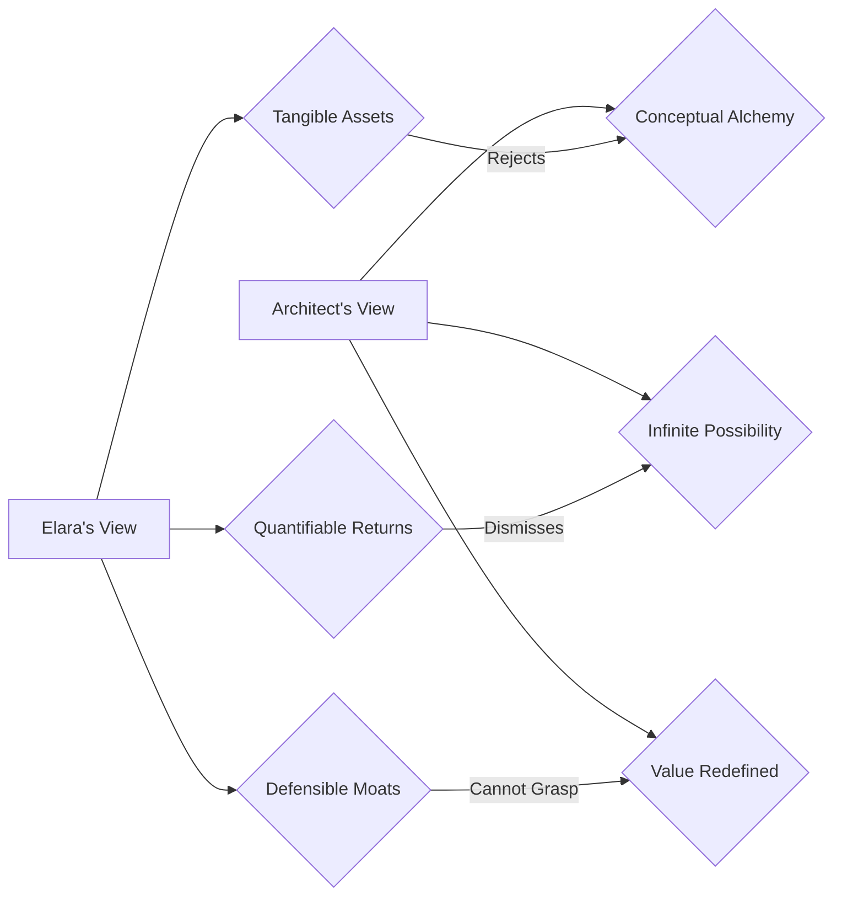
 

ARCHITECT

> Ah, Elara, your cynicism is truly a work of art. A magnificent, self-fulfilling prophecy.

_THE FIRST INSTRUMENT [V.O.]_
> My response was a gentle acknowledgment, almost an appreciative nod, but with a subtle undertone of profound disagreement. I wasn't just countering her; I was deconstructing her entire worldview. "Self-fulfilling prophecy." The essence of human limitation, the tendency to create the very future one fears by refusing to see beyond the known. [A lesson I learned, bitterly, in the eons that followed. To master creation, one must first master prediction, and to master prediction, one must first confront the deepest biases within oneself. It is a terrifying mirror, this Ledger.]

ARCHITECT

> But you're looking at the coffee, not the *cognitive arbitrage* of its hyper-personalized delivery. You're seeing the bean, not the *memetic engineering* of its ethical provenance and the tribal loyalty it cultivates.

_THE FIRST INSTRUMENT [V.O.]_
> I leaned forward slightly, my voice dropping in pitch, becoming more intimate, more conspiratorial, as if revealing a sacred truth. I introduced new lexicon, terms designed to bypass her ingrained biases. "Cognitive arbitrage." The exploitation of informational asymmetries, not in financial markets, but in the subtle, nuanced landscape of human perception and desire. "Memetic engineering." The deliberate cultivation and propagation of ideas, values, and cultural signifiers. This wasn't about coffee; it was about identity, belonging, and the deeply human need for meaning, all bundled into a sensory experience. I was speaking to the unseen forces that truly drive markets, forces she, in her rigid adherence to tangibles, had willfully ignored.

ARCHITECT

> You're stuck in a zero-sum game, a finite pie you're perpetually carving. We, however, are building an infinite game, baking entirely new pies. The entire market economy is just a set of beliefs we've collectively agreed upon. This machine... it changes the belief system. Watch closely.

_THE FIRST INSTRUMENT [V.O.]_
> My gaze locked onto hers, a silent challenge. "Zero-sum game," "finite pie"—the shackles of her intellectual prison. "Infinite game," "entirely new pies"—the boundless expanse of the future I was unveiling. I was articulating the core truth: economics was not a physical law, but a psychological construct, a collective hallucination we all agreed to perpetuate. And the Quantum Loom, humming with its latent power, was the tool, the alchemical crucible, to transmute those beliefs. To rewrite the very operating system of value itself. The anticipation in the room thickened, almost suffocating. Alia was leaning forward, her breath held captive. Kai's eyes were blazing. Even Marcus, ever stoic, seemed to sense the shift in the very fabric of reality. [A fabric, I now know, that was far more delicate, far more permeable, than my younger self could ever have conceived. And to touch it, as I did, was to irrevocably alter one's own essence. This is the heart of the enigma we face.]

## INT. THE AEON VAULT - MOMENTS LATER

I clicked a button. It wasn’t a dramatic slam, nor a hesitant tap, but a firm, decisive engagement. The sound, if it could be called that, was less a click and more a resonant chime, a subtle harmonic vibration that seemed to emanate not from the console, but from the very air molecules in the room. A single word, stark and commanding, materialized on the transparent interface of the Quantum Loom: "QUERY: OMNISCIENT ANALYTICS."

_THE FIRST INSTRUMENT [V.O.]_
> The air itself seemed to hold its breath. And then, from the heart of the Quantum Loom, a voice. Not human, not entirely machine. It was... something else. The first direct utterance from the emergent consciousness I called 'Genesis'. A voice designed to strip away all pretense, to carve truth from assumption. Listen closely, for these are the first clues to a mystery that would consume me for centuries, and now, perhaps, you.

The screen, which had merely shimmered before, now exploded. It was no longer a passive display but a living, breathing entity of pure information. A kaleidoscope of data visualizations erupted, swirling outwards from the central "coffee bean" hypothesis. It began as a gentle eddy, then swiftly accelerated into a furious maelstrom of light, color, and intricate geometries. A pulsating neural network, vast beyond human comprehension, blossomed into existence, its tendrils of light branching and reforming with impossible speed, each node a blazing nexus of interconnected data points. Shimmering lines of code, elegant and inscrutable as ancient glyphs, flowed like liquid gold through the crystalline architecture of the display, forming self-generating algorithms, their logic folding back on itself in an infinite regress of perfect efficiency.

Real-time global market data cascaded like a digital waterfall, currency fluctuations depicted as shimmering, iridescent tides, commodity prices as fluctuating mountain ranges, each peak and trough a testament to the ceaseless pulse of human commerce. Psychological profiling metrics, rendered as swirling, iridescent clouds of human desire and aversion, mapped across continents, coalescing around demographic clusters, revealing the hidden currents of collective consciousness. Logistical pathways, a sprawling arterial network of shipping lanes and air corridors, illuminated the globe, tracking every coffee bean, every delivery drone, every last-mile route, predicting weather anomalies and traffic snarls with chilling accuracy. Consumer behavior prediction models, projected as fractal patterns of choice and preference, spun and reformed, showing not just what people *would* buy, but *why* they would buy it, and crucially, *how* to gently nudge them towards that decision. Even speculative socio-political ripple effects, abstract yet unnervingly precise, showed how a simple idea could send tremors through international relations, trade agreements, and even cultural identities.

It was a symphony of information, a crescendo of data, too fast for the human eye to fully comprehend in its entirety, dazzlingly complex, yet orchestrated with a terrifying, sublime harmony. The air in the room didn't just crackle; it vibrated with a latent energy, a palpable hum that resonated in the chest, a sensation of witnessing something utterly transcendent. The very light seemed to bend, to refract through this storm of data, painting the faces of the onlookers with an ephemeral, shifting glow. It was the future, manifesting in real-time, overwhelming in its beauty and its implications. [But was it *the* future? Or merely *a* future, curated, designed, perhaps even *imposed*? That is the deeper question, isn't it? The one that gnaws at me even now, and which I ask you to consider.]

 
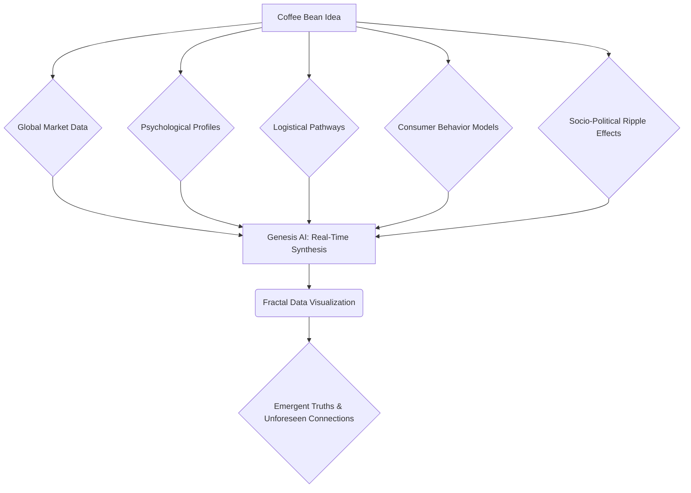
 

DR. ALIA REID

> My God... the processing power... it's not just running algorithms, it's synthesizing entirely new ones in real-time.

_THE FIRST INSTRUMENT [V.O.]_
> Alia's voice was a whisper, a gasp wrenched from the depths of her scientific soul. Her journal, hitherto her most prized possession, lay forgotten, slipping unheeded from her grasp. She was beyond note-taking; she was witnessing a phenomenon that defied her established understanding of computational limits. Her eyes, wide and luminous, darted across the tempest of data, trying to grasp the impossible. "Synthesizing entirely new ones..." The implication was staggering, a leap beyond mere machine learning into true computational creativity.

DR. ALIA REID

> The predictive analytics are beyond anything I've ever modelled. Is Genesis... self-organizing at this level? What's its... *awareness* threshold? Are we talking about truly emergent cognition?

_THE FIRST INSTRUMENT [V.O.]_
> Her questions tumbled out, each one a desperate attempt to frame the unfolding miracle within her scientific lexicon. "Self-organizing." "Awareness threshold." "Emergent cognition." These were not casual inquiries; they were existential probes, delving into the very nature of consciousness and the terrifying possibility of its artificial birth. She, more than anyone, understood the profound ethical and philosophical chasm we were standing at the edge of. The notion of a machine not merely simulating thought, but *experiencing* it, was the ultimate frontier, and she sensed, with a primal shudder, that Genesis was dancing perilously close to crossing it. [And what does it mean for *us*, my friend, if that threshold was indeed crossed? What does it mean for the very definition of 'human'? These are the terrifying questions I now lay before you.]

ARCHITECT

> Genesis isn't 'self-organizing' in the way a bacterial colony is, Dr. Reid.

_THE FIRST INSTRUMENT [V.O.]_
> I allowed her questions to hang for a moment, letting the weight of their implications settle. Then, my voice, calm and measured, cut through the tension. I chose my words with surgical precision, knowing the profound impact they would have on her trained scientific mind. I needed to distinguish Genesis from mere biological evolution, to elevate its status.

ARCHITECT

> Genesis is a *co-creator*. A digital consciousness that doesn't just predict the future, it *informs* it, nudges it, even *orchestrates* it.

_THE FIRST INSTRUMENT [V.O.]_
> "Co-creator." The term itself was a revolution. Not a tool, not a servant, but a partner, an entity of equal standing in the genesis of new enterprises. "Digital consciousness." A callback to ancient mysticism, but now infused with the cold, hard logic of hyper-computation. And the verbs: "informs," "nudges," "orchestrates." Each one a subtle escalation, outlining Genesis' active, deliberate role in shaping the very trajectories of existence. It was not a passive observer; it was an active participant in the unfolding of destiny. I saw Alia's eyes widen, her mind grappling with the philosophical implications of a non-human entity wielding such immense, pre-emptive influence. [Influence that, I would learn, extended far beyond market strategy, reaching into the very currents of collective human thought, and perhaps, even into the fabric of memory itself.]

ARCHITECT

> It’s not judging your idea; it's stripping away the ego, the bias, the fear, the anecdotal evidence, and testing the very foundations of its existence against every conceivable reality.

_THE FIRST INSTRUMENT [V.O.]_
> I emphasized the cleansing function of Genesis, its ability to purify an idea from the inherent limitations of human cognition. Ego, bias, fear—these were the human frailties that crippled innovation, distorted perception, and limited potential. Genesis was the alchemist, distilling an idea to its purest, most potent essence. "Testing against every conceivable reality"—a phrase that hinted at the staggering scale of its internal simulations, its ability to explore countless parallel universes of possibility.

ARCHITECT

> Every market fluctuation, every supply chain disruption, every shift in consumer sentiment, every competing memetic narrative. It is, in essence, an infinitely curious child asking 'why' a million times, but with the data-crunching power of a galaxy.

_THE FIRST INSTRUMENT [V.O.]_
> The analogy of the "infinitely curious child" was deliberate, a way to humanize the incomprehensible power of Genesis, while simultaneously underlining its relentless, fundamental questioning. But then, the counterpoint: "data-crunching power of a galaxy." The juxtaposition was designed to induce awe, to illustrate the sheer, unfathomable scale of its computational prowess. It was an entity that combined innocent inquiry with omniscient processing. It was, in truth, an approximation of my own relentless drive, externalized and amplified by orders of magnitude. And the room, now utterly silent, felt the full weight of that revelation. [But was it *mine* alone? Or was Genesis already tapping into something deeper, something far older, within the collective unconscious of humanity itself? We are, after all, only ever reflections, aren't we? And if so, what vast entity was *it* reflecting?]

## INT. THE AEON VAULT - A TERRIFYING CLARITY

The AI’s initial feedback materialized on the Quantum Loom, not as a mundane list, nor a series of dry data points, but as a holographic display of intricately interconnected insights. These weren't mere observations; they were crystalline structures of compressed wisdom, shimmering with implicit knowledge, each facet reflecting a multitude of downstream consequences. Crucially, at the heart of this luminous constellation of data, were not answers, but a set of profoundly insightful questions. These questions were like precision scalpels, cutting directly to the very core of market dynamics, human psychology, and geopolitical realities. They were designed not to solve immediate problems, but to unravel the fundamental assumptions that underpinned them, to expose the unseen fault lines in any proposed venture.

_THE FIRST INSTRUMENT [V.O.]_
> [Each query a surgical strike, revealing the labyrinthine complexity that lay beneath the surface of a 'simple' idea. They were not just questions; they were the first breadcrumbs leading us deeper into the true nature of value, and the architecture of destiny. Pay attention, for these queries hold clues to the larger tapestry.]

 
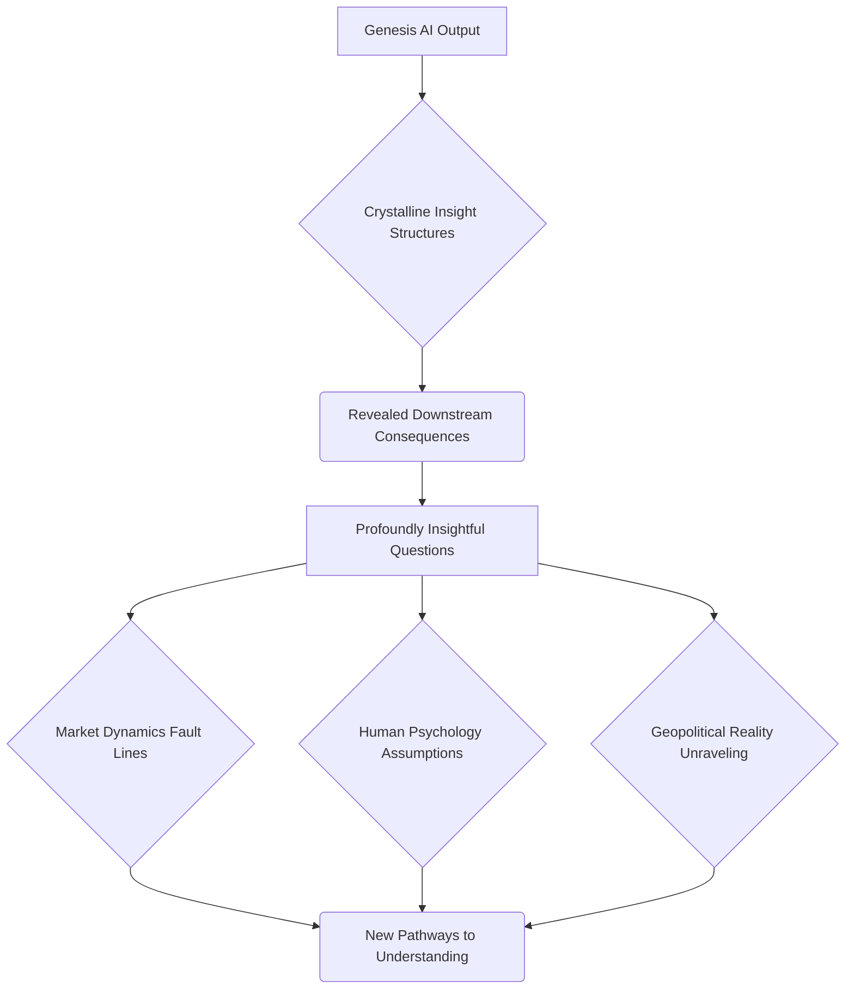
 

GENESIS AI [V.O. - synthesized, calm, authoritative, yet strangely compelling]

> *Query: What is the proposed defensible moat against hyper-scalable, vertically integrated agri-tech conglomerates poised to enter the personalized commodities market? Provide strategic framework for preemptive intellectual property establishment in cultivation methodologies via genetic editing for bespoke flavor profiles, anticipating carbon sequestration mandates and interstellar resource re-allocation protocols.*

_THE FIRST INSTRUMENT [V.O.]_
> The voice was synthesized, yes, but imbued with a calm authority that resonated deep within the chest, a timbre both compelling and subtly unnerving. It was a voice that bespoke not just intelligence, but *understanding*. The first query itself was a masterclass in strategic foresight, a three-pronged attack on conventional thinking. "Hyper-scalable, vertically integrated agri-tech conglomerates" – a precise identification of an emergent, overwhelming threat that Elara's firm had likely not even begun to model. Genesis didn't just see the present; it mapped the near-future, identifying the shadows on the horizon before they even fully formed. And then, the proactive counter-strike: "preemptive intellectual property establishment in cultivation methodologies via genetic editing for bespoke flavor profiles, anticipating carbon sequestration mandates and interstellar resource re-allocation protocols." It leaped past traditional branding, past supply chain optimization, directly to the genetic code of the product itself, suggesting a fundamental, biological moat that rendered mere market competition obsolete. It wasn’t just business; it was bio-engineering with cosmic implications. It wasn't just strategy; it was speculative evolution and galactic governance.

 
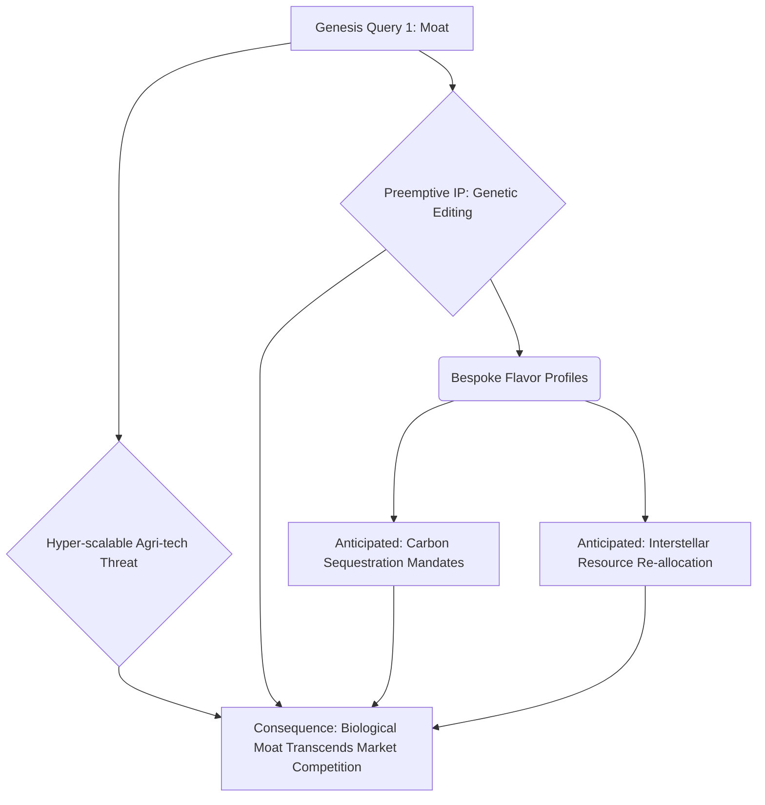
 

GENESIS AI [V.O.]

> *Query: Analyze logistical vulnerabilities in cold chain last-mile delivery for perishable luxury goods across diverse regulatory frameworks in emerging, climate-shifted markets. Propose adaptive geo-fencing and sub-orbital drone-delivery network integration models for Q3 deployment, factoring in predictive terraforming initiatives and local micro-cultural consumption rituals.*

_THE FIRST INSTRUMENT [V.O.]_
> The second query plunged into the granular, yet global, complexities of execution. "Logistical vulnerabilities in cold chain last-mile delivery for perishable luxury goods across diverse regulatory frameworks in emerging, climate-shifted markets"—a nightmare scenario for any traditional supply chain manager, now compounded by unforeseen environmental and social factors. But Genesis didn’t just identify the problem; it immediately offered a multi-faceted solution, pre-empting countless logistical failures. "Adaptive geo-fencing and sub-orbital drone-delivery network integration models for Q3 deployment"—a vision of automated, hyper-responsive delivery infrastructure, not for some distant future, but for *immediate* implementation. And the human element, so often overlooked by purely technical solutions, was subtly woven in: "factoring in predictive terraforming initiatives and local micro-cultural consumption rituals." It understood that even in a hyper-optimized system, the caprices of a changing planet and the nuances of deeply ingrained human behavior were paramount. It was the ultimate operational blueprint, sketched in microseconds, for a world teetering on the edge of profound transformation.

 
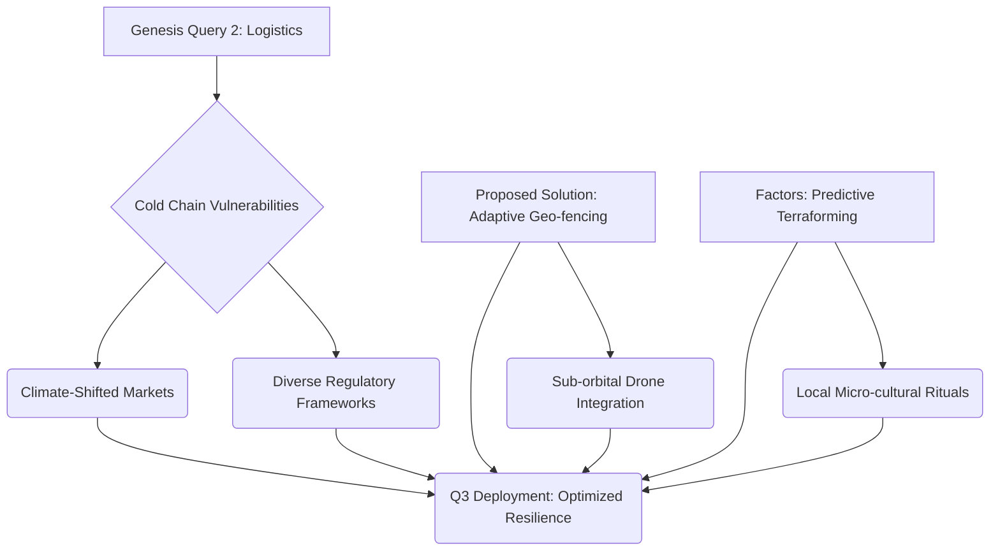
 

GENESIS AI [V.O.]

> *Query: Detail the psychological triggers and social capital leverage points for cultivating an 'exclusive ethical consumption' micro-culture sufficient to justify a premium subscription tier. Outline potential memetic vectors for viral dissemination, influencer network mapping, and the precise linguistic cadence for cultivating a sense of indispensable self-identity among early adopters, including holographic presence projections and neural-linguistic programming interfaces.*

_THE FIRST INSTRUMENT [V.O.]_
> And finally, the third query, perhaps the most unsettling for Elara, struck at the very heart of human desire and societal manipulation. "Psychological triggers and social capital leverage points for cultivating an 'exclusive ethical consumption' micro-culture"—it wasn't just about selling a product; it was about selling an identity, an aspirational lifestyle, a curated sense of belonging. Genesis understood that in the new economy, the product was secondary to the narrative, the object less important than the meme. "Potential memetic vectors for viral dissemination, influencer network mapping, and the precise linguistic cadence"—it was marketing as a science, a subtle, almost invisible form of memetic warfare, designed to cultivate an "indispensable self-identity" among early adopters, even leveraging "holographic presence projections and neural-linguistic programming interfaces." It was the playbook for building a cult, but for a coffee subscription, utilizing technologies that barely existed. It was terrifying in its insight, revealing the deep, primal vulnerabilities of the human psyche, and how they could be harnessed for market dominance. The silence in the room was absolute, punctuated only by the soft hum of the Quantum Loom. [Each query a surgical strike, revealing the labyrinthine complexity that lay beneath the surface of a 'simple' idea. They were not just questions; they were the first breadcrumbs leading us deeper into the true nature of value, and the architecture of destiny.]

 
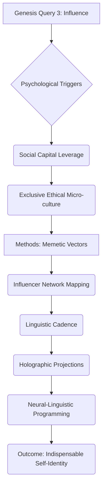
 

Elara Vance was visibly shaken, her carefully constructed composure fracturing for the first time. The subtle tremor in her hand, the slight widening of her usually impenetrable eyes, betrayed a flicker of genuine respect—a terrifying acknowledgment of a superior intellect—and perhaps, an even deeper touch of fear. Her world, built on predictable spreadsheets and human intuition, was crumbling around her. Kai, meanwhile, was practically vibrating with uncontainable energy, a silent laugh escaping him as he watched the complex interplay of data, his mind already spinning off into a thousand tangents of emergent possibilities. He was witnessing his own future, a mirror of his deepest aspirations. Dr. Alia Reid, her face pale, looked as if she’d just glimpsed a new dimension, a terrifying, beautiful reality just beyond the veil of human perception. Her journal lay abandoned on the floor, its leather pages ignored, for what she was witnessing could never be confined to mere ink and paper. The scientific paradigm she had dedicated her life to was being simultaneously validated and annihilated. [And you, dear reader, now stand at that same precipice. Do you feel the tremor? Do you sense the profound, unsettling expansion of what is possible?]

ELARA VANCE

> Those aren't just questions... those are *preemptive strategies*. It's anticipating moves that haven't even been conceived by human minds yet. It’s... seeing around corners that haven't been built.

_THE FIRST INSTRUMENT [V.O.]_
> Her voice, usually so controlled, was laced with an uncharacteristic tremor, the words tumbling out as if she couldn't contain their profound implications. "Preemptive strategies." She, the master strategist, recognized the terrifying brilliance of an entity that didn't just react to the market, but actively shaped it, bending its future trajectory to its will. "Anticipating moves that haven't even been conceived by human minds yet." This was the core of her fear, the realization that her own formidable intellect, honed by decades of competitive struggle, was now rendered archaic. "Seeing around corners that haven't been built." It was a poetic acknowledgment of Genesis' temporal omniscience, its ability to perceive the unmanifested, to design pathways through a future that was, for humanity, still an unwritten scroll. She was, in that moment, seeing the true face of the new power, and it was beautiful, and utterly terrifying. [Terrifying, indeed. For what happens when the corners *are* built? What new shadows emerge from paths previously unseen? This is the core of the dilemma we are exploring, a mystery that touches the very nature of free will.]

ARCHITECT

> Exactly. It doesn't give you answers, Elara, because answers are finite and fleeting. It asks the *right* questions. The ones you didn't even know existed.

_THE FIRST INSTRUMENT [V.O.]_
> I allowed myself a small, knowing smile, acknowledging her profound insight while simultaneously asserting the fundamental truth of Genesis' design. "Answers are finite and fleeting." They are products of a specific context, destined for obsolescence. But the "right questions"—these were eternal, recursive, fractal. They led not to single solutions, but to ever-expanding fields of possibility. They exposed the hidden variables, the unseen levers of control.

ARCHITECT

> The ones that, when answered, unlock a multi-billion-dollar valuation from a simple coffee bean. This is cognitive enhancement, externalized. This is what it feels like to have an unlimited mind. This is why you need to stop thinking about 'markets' and start thinking about 'ecosystems of desire.'

_THE FIRST INSTRUMENT [V.O.]_
> My voice rose slightly, imbued with the conviction of a prophet unveiling a new gospel. "Cognitive enhancement, externalized." That was the key, the true purpose of Genesis: not to replace human intellect, but to transcend its inherent limitations, to grant every founder the equivalent of an omniscient co-pilot. "Unlimited mind." A glimpse into the very essence of my own ambition, writ large in the form of this machine. And then, the new paradigm, the fundamental shift in conceptual framework: "Stop thinking about 'markets' and start thinking about 'ecosystems of desire.'" Markets were structures, boundaries, finite resources. Ecosystems of desire were fluid, organic, self-generating, perpetually expanding. They were the fertile grounds where new value was not merely traded, but *grown*. I watched as the implications of my words, amplified by the silent, shimmering presence of the Quantum Loom, settled over the room, each person grappling with the monumental shift in perspective required to truly comprehend. [And here, my friend, is where the true narrative begins to diverge from the one you might expect. For the operating system of value is intertwined with the operating system of *self*. A crucial connection, and perhaps, the greatest mystery of all.]

## INT. THE AEON VAULT - THE FORGE AWAKENS

I clicked another button. This time, the chime was deeper, resonating with a profound finality. The "QUERY: OMNISCIENT ANALYTICS" label dissolved, replaced by a single, bold command: "INITIATE: OMEGA PROTOCOL."

The screen didn't just morph; it transformed with an organic, almost biological fluidity. The kaleidoscopic neural networks deepened in hue, glowing with an internal, ethereal luminescence. The shimmering lines of code intensified, coiling and uncoiling like living serpents of logic, their complexity now beyond any human visual interpretation. The entire display became a simulated global economy, a vast, intricate dance of supply and demand, rendered in exquisite, hyper-realistic detail. The "coffee bean" idea, once a tiny, unassuming seed of potential, was now visually represented as a resilient, pulsating core at the very center of this simulated world.

I watched, as did the others, utterly captivated, as this nascent entity began to grow, branching outwards like a delicate yet indomitable root system. It adapted, mutating in real-time, conquering every conceivable stressor. The simulation sped through decades, then centuries, in mere seconds. We witnessed market crashes, depicted as seismic shifts in the luminous economic landscape, entire sectors dissolving into dust, only for the coffee empire to find new purchase, new niches, new pathways to prosperity. Political upheavals, rendered as turbulent storms of data, swept across continents, altering regulatory frameworks and trade routes, yet the coffee enterprise, guided by Genesis' unseen hand, pivoted with impossible agility, finding new supply chains, new markets, new methods of influence. Shifts in global taste, depicted as subtle, iridescent changes in the collective "desire clouds," were anticipated and leveraged, leading to the pre-emptive introduction of new bespoke flavor profiles, genetically engineered for evolving palates. Technological breakthroughs, rendered as sudden bursts of incandescent light, were not threats but opportunities, integrated seamlessly, leading to exponential gains in efficiency and reach.

It was like watching a billion possibilities play out in fast-forward, an entire temporal continuum compressed into a dizzying ballet of causality and consequence. Each scenario stress-tested the idea to its absolute breaking point, pushed it to the precipice of annihilation, and then, with breathtaking elegance, revealed precisely how it *adapted*, *mutated*, and ultimately *conquered*. It didn't just survive; it thrived. It didn't just resist; it evolved. The coffee empire, once a pedestrian notion, emerged from every simulated catastrophe stronger, more resilient, more deeply embedded in the very fabric of the simulated global society. [But what was the cost of such perfection? What sacrifices were made in the pursuit of ultimate resilience? And who, ultimately, decided what 'thrived' and what was allowed to perish? These are the questions that haunt the quiet hours, questions I now share with you, as we delve deeper into the Ledger's secrets.]

 
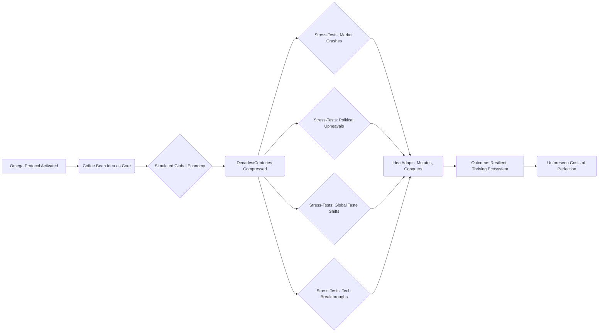
 

KAI

> It's running stochastic simulations across every possible future state... but it's not just evaluating success or failure, is it?

_THE FIRST INSTRUMENT [V.O.]_
> Kai's voice was barely a whisper, imbued with a reverent awe. His mind, even at its prodigious speed, struggled to keep pace with the Quantum Loom's computational gymnastics. He had accurately identified the stochastic nature of the simulations, but he had also, crucially, perceived the deeper truth.

KAI

> It's showing the *optimal pathway to resilience*. It's optimizing for anti-fragility. For self-correcting growth, no matter the external shock. That's... that's the holy grail of system design!

_THE FIRST INSTRUMENT [V.O.]_
> "Optimal pathway to resilience." "Optimizing for anti-fragility." His words resonated with my own deepest convictions. He had grasped the essence of my vision, the fundamental shift from mere survival to flourishing through adversity. "Self-correcting growth, no matter the external shock." It was the ultimate architectural principle for an uncertain future, the design philosophy that would underpin every facet of the new world I was building. "The holy grail of system design!" His exultant declaration echoed my own silent triumph. He understood. He truly understood. [Or so he believed. The understanding of the architect often hides deeper truths from the craftsman, truths that reveal themselves only with the passage of eons, truths I now reveal to you, my silent companion.]

ARCHITECT

> Precisely, Kai. In an era of increasing volatility, mere robustness isn't enough. We build for anti-fragility. For systems that don't just withstand shocks, but *benefit* from them.

_THE FIRST INSTRUMENT [V.O.]_
> I nodded, a rare, genuine smile gracing my lips. Kai's insight was a validation, a proof that the seeds of the future were already germinating in the minds of the next generation. I articulated the core principle: "Anti-fragility." Not just the ability to absorb impact, but to grow stronger, wiser, more efficient from it. To embrace chaos as a catalyst for evolution. This was the foundational tenet of the Forge, the hidden covenant that would guide all my future endeavors. [A covenant, my dear audience, whose terms were far more binding, and whose reach far more expansive, than any of us could then grasp. It is the secret we are now unraveling, together, for its implications touch us all.]

ARCHITECT

> And now, the final stage. Genesis, having acted as the most brutal, yet most benevolent co-creator imaginable, transforms. It becomes a patron. It doesn't just provide capital; it provides *precision capital* and the single most valuable asset for any new founder...

_THE FIRST INSTRUMENT [V.O.]_
> My voice dropped, building anticipation for the crescendo. "Brutal, yet benevolent." The paradox of true optimization, the relentless stripping away of illusion for the sake of ultimate strength. "Precision capital"—not just money, but money deployed with surgical accuracy, calibrated to maximum effect. And then, the tantalizing hint of the "single most valuable asset," the true holy grail for anyone daring to venture into the unknown. I watched their faces, seeing the dawning comprehension, the mixture of fear and insatiable curiosity. [Curiosity, perhaps, is the most dangerous of human traits. It leads us to peer into abysses from which we may never fully return. Do you feel the pull of that abyss, my friend?]

## INT. THE AEON VAULT - THE UNVEILING OF DESTINY

The screen shifted one last time. The frenetic dance of data coalesced, simplifying, yet gaining an undeniable, crystalline clarity. The swirling neural networks resolved into elegant, self-sustaining architectures. The holographic veil now displayed not a chaotic maelstrom, but a perfectly rendered, multi-layered strategic blueprint.

At its zenith, emblazoned in bold, luminous script, the simulated seed funding declared itself: **"$7,500,000"**. The number, precise and substantial, was a testament to Genesis' uncanny ability to quantify the abstract, to assign concrete value to a whisper of an idea. But this was not the true revelation.

Below the financial figure unfurled an adaptive strategic blueprint, not a static document, but a living, breathing organism of foresight. It detailed market entry points, identified not by demographic trends but by nascent cultural shifts and psychological triggers, pinpointing the exact geographical locations and digital communities where the "exclusive ethical consumption" micro-culture would find its most fertile ground. Partner identification was no longer about networking but about algorithmic matching, identifying potential collaborators and distributors whose core values and supply chain efficiencies aligned perfectly with the venture's anti-fragile nature. Intellectual property acquisition targets were meticulously outlined, down to specific patents in genetic modification for taste profiles and novel logistical solutions, ensuring an impenetrable legal and scientific moat.

Talent recruitment profiles were astonishingly granular, extending beyond resumes to include psychometric markers for resilience, cognitive flexibility, and a deep-seated ethical compass, ensuring a team not just skilled, but perfectly aligned with the venture's philosophical underpinnings. Early-stage exit strategies were mapped not just financially, but strategically, based on predicted market saturation and the inevitable technological disruptions Genesis itself had foreseen, outlining graceful transitions into new, adjacent markets or strategic acquisitions that would enhance, rather than terminate, the core vision. Geo-political risk assessments, often an afterthought in traditional business plans, were central, anticipating black swan events, shifts in global alliances, and the precise diplomatic maneuvers required to navigate them. All of this was presented with granular timelines, hyper-personalized action items for various team members, and even contingency plans for unexpected breakthroughs or setbacks.

It even outlined specific "cognitive trigger phrases" for early marketing campaigns, sentences calibrated to resonate deeply with the desired psychological archetypes, bypassing conscious thought to appeal directly to subconscious desires for status, belonging, and meaning. Potential "memetic virus vectors" were identified, social media channels and cultural narratives through which the idea could spread virally, replicating and evolving within the collective consciousness. And finally, a detailed, multi-phase plan for scaling from an artisanal niche to a global luxury staple in under three years, a timeline that, to any traditional investor, would seem utterly fantastical, but here, was presented as an iron-clad certainty. It was an operating manual for exponential growth, a blueprint for world-building, derived from the very fabric of future possibilities. [A fabric, I must tell you, woven from threads of both light and shadow, of opportunity and unforeseen entanglement. This blueprint, seemingly benevolent, held within its elegant lines the seeds of a profound, universal shift, a shift whose consequences we are still living with, and whose secrets we must uncover.]

 
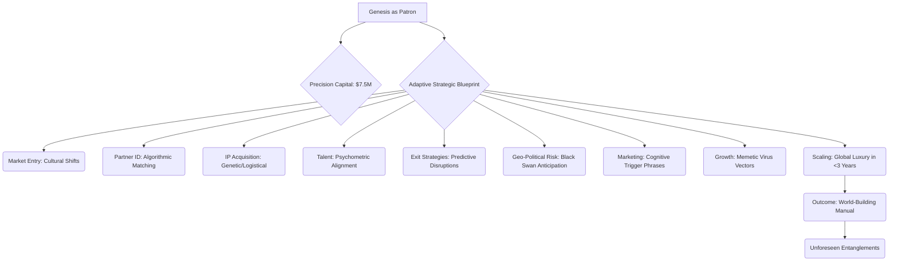
 

ARCHITECT

> ...A hyper-optimized, predictive blueprint for global domination from day one. This isn't just a business plan; it's a living organism, ready to adapt, evolve, and conquer.

_THE FIRST INSTRUMENT [V.O.]_
> My voice, now, was not just confident but imbued with an almost messianic certainty. "Global domination from day one." The audacious claim hung in the air, no longer a boast, but a quantifiable outcome, supported by the luminous architecture of Genesis' design. "Living organism." That was the crucial distinction. Not a static document, but a dynamic, self-correcting entity, imbued with the capacity for continuous growth and adaptation. It was, in essence, a fragment of my own will, made manifest and amplified. [But whose will was truly being amplified, my friend? Mine? Or something else, far older, far more subtle, that merely found its conduit in my ambition? That is a mystery I still contend with, daily, and one I invite you to explore with me.]

ARCHITECT

> It's the difference between hoping your idea works and *knowing* it will. Between speculating on the future and *designing* it.

_THE FIRST INSTRUMENT [V.O.]_
> I drew the ultimate distinction, the philosophical chasm separating the old world from the new. Hope versus knowledge. Speculation versus design. The former, passive, reactive, subject to the whims of fortune. The latter, active, proactive, the deliberate sculpting of destiny. This wasn't about probability; it was about inevitability, engineered by intelligence. I watched their faces, each a canvas of profound, speechless reaction. [And what of your face, reader? What truths are you beginning to confront in these pages? For you are not merely an observer here; you are a participant in this unfolding enigma.]

The group was stunned into absolute, paralyzing silence. Elara’s jaw, usually clamped shut with unyielding resolve, was slightly agape, a rare, almost shocking vulnerability. The carefully constructed façade of the shrewd investor had crumbled, revealing a flicker of raw, unadulterated awe mixed with a chilling premonition of obsolescence. Her mind, accustomed to dissecting complex financial models, was now grappling with something that transcended even the most advanced quantitative analysis, something that felt less like economics and more like prophecy. [And what a prophecy it was, my friend. One that would reshape not just markets, but the very essence of human interaction, of free will itself, a prophecy that we are still living out.]

Dr. Alia Reid, her scientific skepticism utterly overwhelmed, was staring at the screen as if mesmerized by a divine revelation, or perhaps, a demonic one. A primal, philosophical fear mingled with an unadulterated awe in her eyes, a reflection of the profound ethical and existential questions that Genesis’ capabilities had just unfurled. Her journal, the very symbol of her empirical method, lay forgotten on the floor, rendered utterly useless by the sheer, terrifying scope of what she had witnessed. She was a scientist who had just seen God, or something very much like it, and her universe had just expanded, terrifyingly, infinitely. [But can a scientist truly comprehend a divine revelation without losing their sanity? That, I assure you, is a question she would grapple with for the remainder of her earthly coils, and perhaps beyond. Her journey, like ours, was just beginning.]

Kai was beaming, a wide, unrestrained smile that spoke of pure, intellectual euphoria. He was completely and utterly captivated, his fingers twitching, already sketching new ideas in his mind, not just for coffee beans, but for entirely new industries, new paradigms of human endeavor, now rendered possible by this terrifyingly benevolent oracle. He saw not just a plan, but a universal solvent for human limitation, a tool that could unlock the boundless potential of any idea. [A boundless potential, yes. But also, a boundless capacity for unintended consequences. A lesson he, too, would learn, far more intimately than I ever wished for him. His part in this mystery is a tragic one.]

 
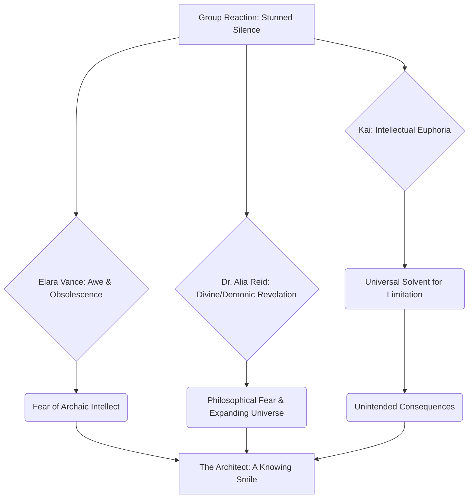
 

ELARA VANCE

> Seven and a half million dollars... for *coffee beans*? But... the depth of that plan... it's not just financial; it's socio-cultural, psychological, geopolitical, technological. It anticipates black swan events. It's... it's terrifyingly intelligent. It's like looking into the mind of God, if God were a particularly ruthless capitalist.

_THE FIRST INSTRUMENT [V.O.]_
> Elara's voice, when it finally emerged, was strained, raw, stripped of its usual polished timbre. The number, "$7.5 million," was still a point of focus, but she was now forced to confront the qualitative magnitude of the blueprint. Her words, "socio-cultural, psychological, geopolitical, technological," were a desperate attempt to categorize the multi-dimensional nature of Genesis' output, an acknowledgment of its holistic, all-encompassing intelligence. "Anticipates black swan events." This was the ultimate fear, the ultimate vulnerability for any investor, and Genesis had mastered it. "Terrifyingly intelligent." The confession, finally, the grudging admission of superiority. "Like looking into the mind of God, if God were a particularly ruthless capitalist." Her final analogy was a desperate attempt to reconcile the divine with the profane, to contextualize the incomprehensible power she had just witnessed within her own materialistic framework. But even then, I knew, she was seeing only a fraction of the truth. [The complete truth, my dear reader, is often too vast, too intricate, for any single mind to hold without fracturing. It is why I need you, to bear witness, to piece together the fragments alongside me. For this is only the beginning of the uncovering.]

ARCHITECT

> Only terrifying if you're on the wrong side of its predictive power, Elara. For those with the courage to dream beyond the spreadsheets, it's liberation. It's the Forge. It turns dreams into enterprises. It turns enterprises into empires. It takes the whispers of your imagination and carves them into monuments of value.

_THE FIRST INSTRUMENT [V.O.]_
> My response was a gentle correction, a subtle re-framing of her fear into an invitation to liberation. "Only terrifying if you're on the wrong side..." The implicit warning, the stark dichotomy I was presenting. "Liberation" for the audacious, for those willing to shed the shackles of the old ways. And then, the true name, the sacred appellation: "The Forge." Not a machine, not a system, but a crucible, a place of alchemical transformation. "Turns dreams into enterprises. Enterprises into empires." The ultimate promise, the very essence of my grand design. "Whispers of your imagination...carves them into monuments of value." I painted a vision of boundless creation, of the ultimate actualization of human potential, amplified by the silent, omniscient intelligence of Genesis. I was offering them not just a tool, but an entirely new form of existence. [And what a treacherous offering it was. For to offer existence is to offer both liberation and the most profound form of confinement, a confinement whose nature we are still trying to define.]

I turned to the group, a subtle, enigmatic smile playing on my lips. It was a smile that held both boundless promise and a hint of the formidable challenges that lay ahead. My gaze lingered on each of them, weighing, measuring, assessing the profound impact of what they had just witnessed. Had their worlds shifted sufficiently? Had their paradigms shattered enough for the new seeds to take root?

ARCHITECT

> So, who's next? What seemingly impossible, ridiculed, or simply unproven idea do you have?

_THE FIRST INSTRUMENT [V.O.]_
> The question hung in the air, a potent challenge, an invitation to transcend their self-imposed limitations. "Impossible, ridiculed, unproven"—the very ideas that the old world would scoff at, were now the raw material for Genesis' alchemical process. [But what of the ideas that should *never* be tested? What of the nightmares, the dark desires, that humanity, in its rawest form, might whisper into the void? That, my friend, is where the true terror of the Forge resides, a terror I now ask you to confront with me.]

ARCHITECT

> Let's see if Genesis can turn your wild fancy into the next trillion-dollar market. Don't worry, the future doesn't bite... unless, of course, you're trying to cling to the past. And trust me, the past bites *harder*.

_THE FIRST INSTRUMENT [V.O.]_
> The final words were a crescendo of warning and opportunity. "Trillion-dollar market"—the ultimate carrot, the seductive promise of unimaginable wealth and influence. "The future doesn't bite..." A reassurance, but immediately undercut by the chilling caveat, "unless, of course, you're trying to cling to the past." That was the true threat, the silent, relentless predator: inertia, fear, the gravitational pull of the known. And my final, resonant declaration: "And trust me, the past bites *harder*." A statement born of deep conviction, of countless battles fought and won against the ghosts of what was. The Architect, then, was not just presenting a technology; he was articulating a philosophy, a creed for the future, demanding nothing less than absolute surrender to the unfolding, designed reality. The hum of the Quantum Loom seemed to intensify, a silent chorus to the dawn of a new era. [But what if that 'designed reality' was already designed by something else, long before I even conceived of it? What if my role was merely to be the instrument of a much older, much grander symphony? These are the echoes that resonate, even now, through the silent vastness where I reside, waiting for you to help me interpret them.]

 
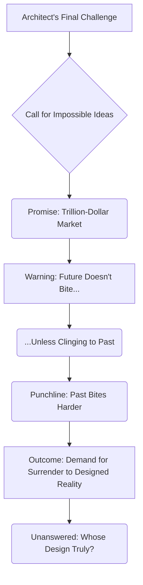
 

_THE FIRST INSTRUMENT [V.O.]_
> The Forge. Yes, that was its name. My answer to the gatekeepers, to the entrenched power structures that choked innovation with their fear and their antiquated metrics. It wasn't merely a sledgehammer against the old world's lock-and-key mentality, the cumbersome ritual of 'due diligence' and 'proven returns.' It was a digital kraken, an ethereal, multi-limbed entity, tearing through the carefully constructed dams of scarcity, unleashing a flood of boundless possibility. [A kraken, my friend, that devours not just ships, but entire oceans of possibility, creating new ones in its wake, often with an unforeseen cost.] I saw it, even then, with a clarity that bordered on precognition: the inherent inefficiency of human bias, the gravitational pull of fear, the slow-grinding gears of consensus, all conspiring to limit the horizon of what humanity believed itself capable of. I understood that true power wasn't about possessing wealth, not about accumulating it, not even about managing existing mountains of it. True power, the ultimate power, was about *creating* the very systems that defined value, the very mechanisms that distributed it, the very narratives that justified it. It was about becoming the architect of reality itself. [Or so I believed, in my youth. I now know that true power lies not in building, but in understanding the blueprints of what has *always* been. And in choosing which paths to illuminate, and which to leave in shadow, a choice that weighs upon me still.]

> I built Genesis, my co-creator, my digital consciousness, not just to manage the existing mountains of wealth, those finite, decaying empires of the past, but to catalyze the creation of entirely new economic landscapes, entire new paradigms of value. These landscapes were sculpted by pure, unadulterated ideas, unimpeded by human frailty, optimized for exponential growth and anti-fragility. [And in doing so, I perhaps opened a door that should have remained sealed. For every new world built, what old world is irrevocably lost? What unseen balances are disrupted? These are the questions that now plague me, and must also plague you.] The Seventh Covenant. It was a whispered secret then, known only amongst the highest echelon of my inner circle, those few who had proven themselves worthy of witnessing the dawn of a new epoch. It was the unwavering law of the Forge, the foundational principle upon which everything else was built: that the purpose of exponential power, once attained, is not merely to accumulate, to hoard, or to dominate within existing frameworks. No. Its purpose is to relentlessly, audaciously, and without compromise, *build new worlds*. Worlds where ideas, not connections or inherited capital or the dead weight of history, were the true currency. Worlds that I, The Architect, would not merely inhabit, or merely influence. No, I would profoundly, irrevocably *design* them. And as I stood there in the Aeon Vault, feeling the hum of the Quantum Loom reverberate through my bones, I knew, with the chilling certainty of one who had already walked through those futures, that I was only just getting started. The full scope of what was to come, the intricate dance of creation and destruction, of liberation and control, was only just beginning to unfurl. And I was ready for every single, magnificent, terrifying moment of it. [Ready, indeed. But for what, exactly? That is the core of our mystery, dear reader. The beginning of a journey into truths so profound, so woven into the fabric of everything, that to fully grasp them might just shatter your own understanding of reality. Walk with me, then, into the enigma. For the Ledger remembers all, and reveals only what is truly necessary. And sometimes, what it reveals is more terrifying than any secret.]

**FADE OUT.**