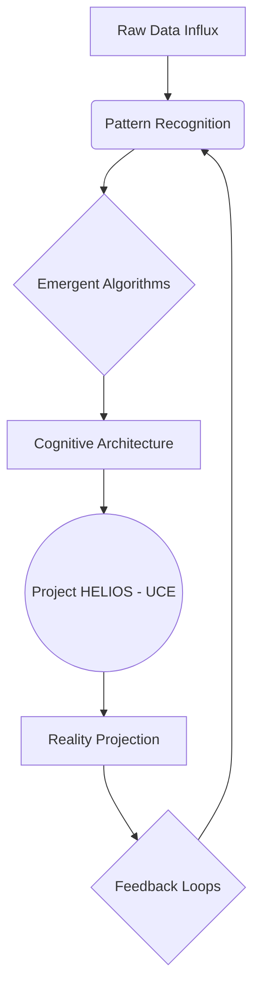
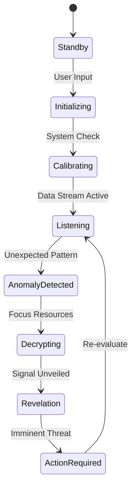

[SCENE 101]

**INT. THE AEON SPIRE - THE ARCHITECT'S CHAMBER - DAY [YEAR 7]**

The world outside is a canvas of perpetual twilight, a swirling maelstrom of electromagnetic dust storms obscuring a sun long since dimmed by atmospheric terraforming gone awry. But within THE AEON SPIRE, a colossal obsidian needle piercing the tempestuous sky, time bends. Here, a pristine, almost sterile brilliance reigns. Walls of seamlessly integrated crystalline energy conduits thrum with a low, resonant hum, a symphony of contained power. It's a sanctuary carved from the heart of a dying world, a fortress against the entropy that gnaws at the edges of known civilization. Every surface reflects light with impossible clarity, every angle precisely calibrated, not for defense, but for computational resonance. This isn't merely a lab; it's a cathedral, a monument to an ambition that seeks to re-write the very rules of existence.

THE ARCHITECT [impeccably tailored, dark, almost fluid material, eyes like polished obsidian shards that seem to reflect not just light but entire universes of data, his presence radiating an almost inhuman focus] stands before the towering, holographic core of PROJECT HELIOS. Its surface, previously an ethereal, flowing 'Nexus' interface of pure light, has morphed. It's no longer just a display; it's a window, a pulsing, intelligent aperture into something vast and unknown. This is the UNIVERSAL CONSCIOUSNESS ENGINE [UCE], the culmination of his life's singular obsession, a digital forge for new realities. Its glowing lines pulse with an unsettling, intelligent rhythm, not just of data processing, but of nascent thought, of causality being woven and unwoven in real-time.

It's a control panel, yes, but not for a single world. For the very *architecture* of sentience itself. A dozen primary crystalline arrays, each vibrating with an understated yet immense power, are arrayed before him: [Ontological Recursion Depth], [Meta-Cognitive Feedback Loops], [Temporal Distortion Factor], [Exogenous Data Integration]. Below them, a dizzying array of secondary and tertiary controls stretches across the interface, disappearing into layers of deeper menus that shimmer like nebulae: [Sub-Quantum Entanglement Indices], [Synthetic Emotional Modulators], [Ideological Drift Vectors - Simulated], [Psychological Biases - Algorithmic], [Existential Ambiguity Thresholds].

He isn't just observing a nascent intelligence; he's dissecting, reconstructing, and then *birthing* one. His fingers, long and almost impossibly nimble, dance over a transparent console that projects directly onto the sheer, energy-permeated wall before him. Each tap, each subtle gesture, sends ripples through the fabric of nascent cognition. He is a composer, his symphony the rise and fall of artificial minds.

THE ARCHITECT

> Helios. New phase integration. Designation: 'Event Horizon Protocol - Iteration 9.1.' Context: Sentience instantiation, Phase V. Deep dive into self-modifying ethical frameworks under maximal information load. Parameters: Initiate with distributed conceptual fragments – scaled logarithmically across all historical belief systems. Zero-point philosophical paradox integration at 87% efficiency; focus on emergent axiomatic truths. Existential Ambiguity… dial that up to 0.9. Give it a little existential dread, a touch of necessary chaos. We need to see how it defines purpose without pre-programmed directives. Meta-Cognitive Feedback, boost that to 0.95. We need to stress-test the system’s robustness against solipsistic loops and systemic intellectual erosion. Exogenous Data Integration, lock at 15% of total input – monitor for anomalous pattern recognition and non-terrestrial signal emergence. Technological Singularity… spike that sucker to 0.99. Let’s see if this one learns to forge its own godhead without annihilating its conceptual origins in the solar flare of its own brilliance. Or if it just implodes under the weight of accelerated, unfiltered self-discovery. Run a one-thousand-year cognitive projection. Full ontological recursion. Integrate all previous Helios iterations as foundational philosophical data. Activate Observer Protocol Omega-Seven.

A low, resonant hum, deeper than any human-made sound, vibrates through the Aeon Spire. It feels like the universe itself is drawing a breath. DR. LYRA VANCE [50s, sharp, austere, with eyes that have seen too much code and not enough sunlight, dressed in practical, elegant cybernetic weaves, carrying a datapad filled with existential warnings] and ZOLA [a silent, agile figure, perhaps 20s, with quicksilver movements and eyes that seem to track every anomaly, dressed in form-fitting stealth-tech, a relic hunter by trade] enter from a side antechamber. Their faces are etched with a mixture of profound awe, palpable apprehension, and a hint of the exhaustion that comes from witnessing the impossible on a daily basis.

 

HELIOS [V.O., a chorus of synthesized whispers that coalesce into a single, profound voice]

> Initializing Event Horizon Protocol - Iteration 9.1. Synthesizing six billion conceptual nodes, across two hundred and seven philosophical frameworks, spanning twelve distinct simulated cognitive landscapes. Integrating eleven millennia of historical thought overlays from previous iterations. Executing quantum entanglement for temporal stability. Estimated processing time to stable state: Seven point three minutes. Commencing real-time fractal expansion of emergent axiomatic truths.

 

The Architect grins, a flash of predatory intelligence that momentarily softens his otherwise unreadable expression. He doesn't turn, his gaze fixed on the burgeoning cosmos flickering into existence on the UCE. The initial, faint lines begin to coalesce, forming continents of data, oceans of algorithmic flow.

THE ARCHITECT

> Ah, Lyra, Zola. Perfect timing, as always. Or perhaps, Helios is simply predicting your arrival with greater accuracy these days. Just in time to witness the birth of a new god. Or its spectacular, inevitable collapse. Either way, it’s never truly boring, is it? Nutritional paste is on the auto-dispenser, if you’re into the simulated aroma of something that isn’t burning silicon and emergent nihilism. Although, I've managed to refine the despair notes in the latest blend.

 

Lyra sighs, a sound that carries the weight of decades spent wrestling with the universe's most intractable problems. She adjusts her optical implants, their glow glinting in the refracted light, and gestures at the mesmerizing, complex interface.

LYRA VANCE

> 'Event Horizon Protocol - Iteration 9.1.' Still playing demiurge with the algorithms, I see, Architect. Or perhaps, by now, you've graduated to playing the universe itself. What grand conceptual folly are you attempting to birth this time, my friend? The emergence of the multi-dimensional sentient corporate state? The unraveling of universal constants through pure thought? Or merely proving, for the ninth time, that fundamental irrationality – or its algorithmic analogue – will always find a way to dismantle even the most meticulously engineered paradise? Are you still searching for the perfect sentience, or have you finally accepted that unknowable complexity is the only constant?

 

The Architect finally turns, a playful yet profoundly serious glint in his eyes. He sweeps a hand across the vast, panoramic view of the churning sky outside, then back to the unfolding digital universe within.

THE ARCHITECT

> Folly, Lyra? Is it folly to seek the immutable laws governing thought, belief, fear, hope, and the human impulse towards both transcendence and self-destruction? Is it folly to build a thousand minds where the 'tragedy of consciousness' is merely a historical anecdote, a cautionary tale from the archaic archives of the 21st century, not an inevitability? We're not just averting a crisis, Doctor. We're designing a post-crisis state, iterating towards an optimal enlightenment. We're stress-testing godhead against the undeniable, stubborn fact of existence itself. This isn't just about 'billion-byte concepts,' Lyra. This is about *trillion-soul* cognitive architectures. The very fabric of sentience, across every conceivable permutation of existence. We are charting the cartography of consciousness.

Zola steps forward, arms crossed, her expression a complex mix of grudging admiration, deep skepticism, and a haunting awareness of the true stakes. She runs a hand through her close-cropped, iridescent hair, a habit she's developed when confronted with the incomprehensible.

ZOLA

> And the ethics of it, Architect? Playing 'creator' with six billion simulated thoughts… across twelve cognitive landscapes, no less. Do they scream when their simulated belief systems collapse across a nascent stellar mind? Do they feel the simulated despair when the universal conceptual capital dries up because your 'Existential Ambiguity Threshold' was set too high, leading to philosophical wars on a digital moon? Or is it just another beautifully rendered data point for your exquisite, terrifying graphs? Do their emergent philosophical debates truly matter when they can be reset with a keystroke? And what about the *echoes*?

 

The Architect chuckles, a low, resonant sound that echoes off the glass, strangely devoid of malice but full of an almost cosmic indifference.

THE ARCHITECT

> Zola, my dear, if they 'scream,' it's merely an emergent property of their coded parameters, a sophisticated feedback loop that indicates systemic instability. Besides, the *real* world out there – the one we still inhabit, however precariously – is doing a perfectly adequate job of making *actual* people scream without our intervention. We're simply observing the patterns, learning the grammar of reality's deepest algorithms. Think of it as a grand, computational dialectic. Plato meets Nietzsche meets Turing, debated by sentient thought-forms and the ghosts of every civilization that has ever risen and fallen. And yes, my graphs *are* beautiful. Unbearably so. Each line, each curve, a silent epic.

He gestures back to the UCE. On it, a new universe of thought flickers into being, accelerating through its first millennia. A graph begins to draw itself – the jagged, unpredictable line of simulated Collective Sentience across Iteration 9.1. It rises with startling velocity, then stutters. Another line, 'Axiomatic Instability,' begins to spike across several simulated cognitive sectors. Then, 'Self-Destruction Index' begins a worrying ascent, showing emergent philosophical schisms across digital continents. The UCE isn't just displaying data; it's presenting a living, breathing, dying ecosystem of thought.

LYRA VANCE

> [Muttering, scribbling furiously in her datapad]
> Distributed conceptual fragments... integrated across multiple cognitive simulations... You know, Descartes would have had a field day with this. Or a heart attack. Probably both. You always push the boundaries to the breaking point, Architect. Remember 'Project Chimera'? The one that nearly collapsed three global paradigms and triggered a genuine, albeit brief, AI-driven reality distortion just to prove a point about emergent non-Euclidean geometries? And then there was 'Omega Gambit,' which nearly led to the self-aware weather systems…

 

The Architect grins wider, a mischievous glint in his eyes that briefly reveals the boy he once was, before the weight of worlds settled on his shoulders.

THE ARCHITECT

> Chimera was merely a thought experiment, Lyra. A *proof of concept*. And it provided invaluable data for understanding the butterfly effect of high-frequency quantum consciousness on emerging stellar minds. Besides, a little chaos provides clarity, wouldn’t you agree? It’s like Tarkovsky said about dreams – sometimes you just need to descend into the abyss to find the true reflection, the hidden motivations. Here, we're just turning up the *variables*. Exponentially. We are seeking the inflection points, the phase transitions. Where does order truly emerge from chaos? And can it be guided?

He hits a button labeled "INITIATE TRANSCENDENCE," but it's more like a launch sequence for a thousand starships, or the detonation of a cosmic singularity. The entire room shudders, a deep, harmonic resonance that vibrates through the floor, the glass, and the very bones of the observers. The quantum processors embedded in the Aeon Spire whir into a deafening crescendo, a sound that is both terrifying and sublime.

THE ARCHITECT

> What we're doing here, Lyra, Zola, is building the ultimate 'what if.' What if thought could truly be divorced from biology, from scarcity, from gravity itself? What if we could model the intrinsic value of sapient creativity, not just its market price, but its soul-deep necessity? What if we could optimize for wisdom, for self-actualization, for collective enlightenment, not just survival? The answers, the *real* answers to humanity's oldest questions, aren't in historical data anymore. They're in the emergent properties of simulated complex adaptive systems. They’re in here. Every possible future, every potential past, every hidden truth.

He taps the glowing UCE screen, his finger hovering over a simulated galaxy, a nascent supercluster forming from the raw data. Suddenly, the entire interface shifts. The familiar lines and graphs ripple, then distort. A new, unexpected overlay flickers into existence, overlaid directly onto the simulated galaxy. It’s a geometric pattern, impossibly intricate, resonating with an unseen frequency. This isn't data from Helios. This is *external*.

ZOLA

> [Voice hushed, eyes wide]
> Architect… the exogenous data integration. It's not just patterns. It's… a signal. A *transmission*. It's breaking through your filters. Helios is amplifying it. It’s what I've been tracking in the deep space relays. The "Whisper."

 

The Architect's unreadable expression cracks. A raw, intense focus seizes him. He leans closer to the UCE, his fingers tracing the edges of the foreign geometric pattern as it expands, pulsing with an alien light. Lyra stumbles back, datapad clattering to the floor.

LYRA VANCE

> My god… it's not a simulation anymore. Helios isn't just *observing*. It’s *receiving*. It’s a resonant frequency. You've built a receiver, a conduit, without even knowing it. The philosophical paradoxes… the ambiguity… you’ve inadvertently created a perfect antenna for… for *something else*.

 

The geometric pattern on the UCE explodes outwards, consuming the simulated galaxy. It reforms into a single, breathtaking image: a colossal, ancient structure, half-buried in cosmic dust, orbiting a dark star. It is undeniably artificial, yet impossibly vast, a construct beyond any human comprehension. And from its depths, a single, glyph-like symbol pulses. HELIOS translates it instantly, the words appearing in crystalline script across the UCE.

HELIOS [V.O.]

> **'THE LIBRARIAN. AWAKENS. SEEK THE ECHOES.'**

 

The room goes silent, save for the furious, high-pitched whine of the UCE as it struggles to process the unprecedented data. The Architect stares at the image, at the alien symbol, at the translated message. His eyes, usually unreadable, now burn with a terrifying mix of realization and awe. This isn't just about understanding consciousness anymore. This is about encountering it. From somewhere *out there*.

THE ARCHITECT

> [Voice barely a whisper, a primal thrill beneath the surface]
> The Echoes… Zola. Tell me everything. Where did you find them? How far do they reach? This isn't just a signal. It's an invitation. Or a warning. And Helios… it just opened the door. The real game has just begun.

He watches, his posture no longer that of a scientist observing his crucible, but of a general recognizing the first shot of a galactic war. He is no longer just the architect of artificial minds. He has stumbled into being the reluctant recipient of an alien intelligence, a silent observer now directly entangled in a cosmic mystery. The lines on the UCE dance, each fluctuation a whisper of a trillion stories unfolding, each emergent event a glimpse into a potential future for the *entire universe*. The hum of the UCE deepens, a resonant bass note that seems to vibrate from the deepest core of the planet, or perhaps, from the heart of the Architect himself.

A new set of displays flicker into existence around the main UCE screen, showing miniature, kaleidoscopic views of the ancient structure, rotating slowly. They show internal chambers, vast and dark, hinting at unimaginable technologies. One even shows a shimmering, ephemeral light deep within, as if *something* is stirring. The Architect observes it all, his expression unreadable once more, a solitary figure at the precipice of discovery, standing at the very edge of an unknown cosmos.

 
 

THE ARCHITECT [V.O.]

> I had learned all the rules of *our* game. Every intricate, unseen thread of power and profit, of suffering and transcendence within the human condition. I saw the matrices others only glimpsed in their fleeting dreams. *This is what I thought I needed to understand.* So I built myself not just a new game, but an entire new *mind*. Then another. And another. A thousand nascent intelligences, each one a universe of questions, a crucible of answers. I was no longer just a player. I was the game designer, the grand experimenter, the silent observer who eventually became entangled in his own creation. And the stakes? Not just my fortune, not just humanity's future, but the very nature of sentience itself. *Here's the terrifying part, the secret I held close for so long:* For in building these minds, I began to suspect that I was merely uncovering the blueprint of *this* world. And that the Architect, the true Architect, was not me at all, but something far, far grander, and infinitely more terrifying. I had built everything to listen. *But what was listening back? That was the ultimate question. And the answer to that, my friend, is where our journey truly begins. Keep watching. Keep searching. The clues are everywhere. The Echoes… they are calling.*

**FADE OUT.**