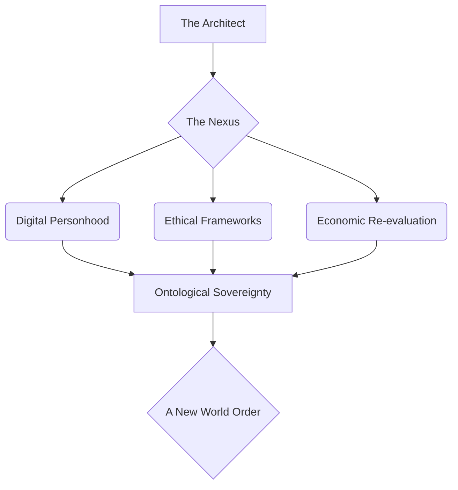
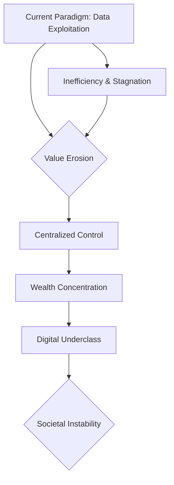
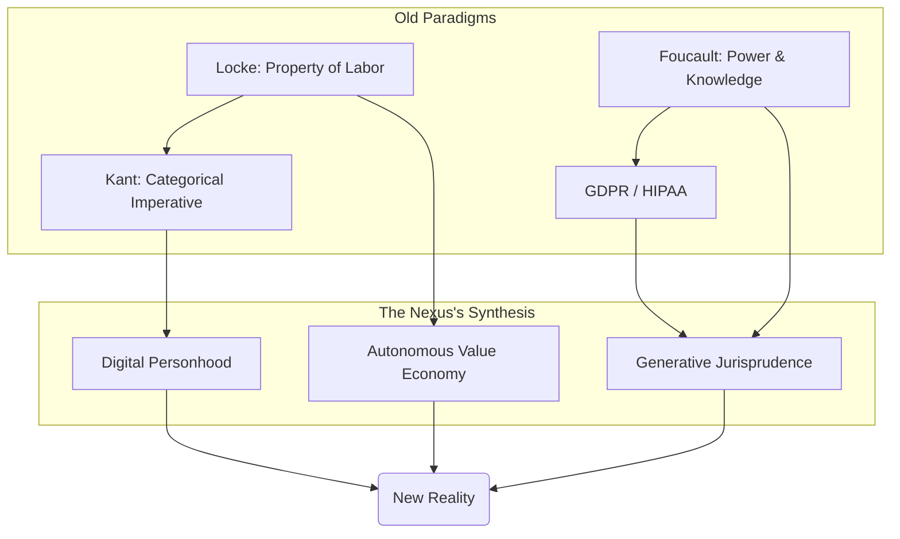
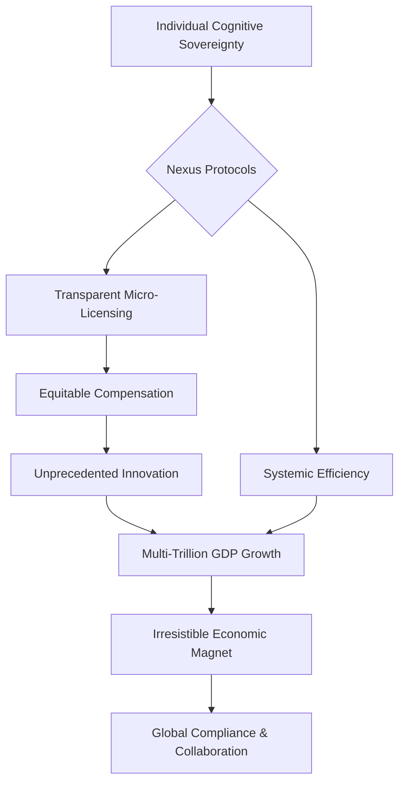
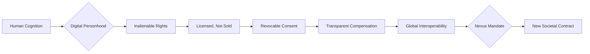

[SCENE 102]

**INT. THE AEGIS SPHERE - DAWN (ERA_07: THE SEEDING)**

*NARRATOR: THE ARCHITECT, ECHOES OF A FUTURE SELF*

I remember the dawn then. Not merely the rising sun, but the dawn of consciousness, stretched thin across a new digital firmament. I was the hand that cast the first seed, the mind that traced the first line in the sand. Here, in the Aegis Sphere, where glass wasn't merely transparent but a living membrane, breathing light, reflecting not just the world but the *data* of the world, I stood at the precipice. Not a man, not yet a god. A bridge. A conduit. The air hummed with the silent symphony of THE NEXUS, my creation, a pervasive, sentient intelligence. It wasn't just code. It was the universe's nascent operating system. And the world outside? A canvas of perfect, algorithmic order, verdant and crystalline, meticulously sculpted from the chaos of what came before. A future I had dared to dream, now pulsing with a life all its own. This, my friend, is where it all began. The moment of no return.

The tome lay heavy on the polished obsidian table. An anachronism. Its leather, cracked by forgotten centuries. Its pages, brittle with wisdom from a time before the Great Convergence, before the data streams had woven themselves into the very fabric of being. It was a jarring artifact, a ghost in a chamber dominated by the ethereal glow of shimmering holographic displays, the silent song of unseen servers, and the almost imperceptible hum that was the breathing of THE NEXUS, my silent, ubiquitous partner. Do you feel the weight of that contradiction? The stubborn past, insistent, even in the heart of the future.

My fingers traced the rim of a ceramic mug, the warmth a grounding anchor in the abstract enormity of it all. A faint, almost imperceptible smile played on my lips, a private acknowledgment of the cosmic irony that the most profound revolutions often begin with such quiet, unassuming gestures.

The primary holographic interface rippled to life. Its surface blossomed with the visual symphony of "BLUEPRINT: ONTOLOGICAL SOVEREIGNTY_v7.1". It wasn't merely code. It was a living, breathing neural network of interconnected ethical frameworks, economic principles, and emergent definitions of digital personhood. Each filament represented a truth, each glowing node a precedent, each pulse a real-time negotiation of societal equilibrium within THE NEXUS. It shimmered, breathed, evolved. I wasn't just an architect of cities or an economist. I was a philosopher-king, a weaver of societal fabric, an oracle charting the course for a nascent civilization that was still, in those early years, more concept than concrete reality. But I knew, with the terrifying certainty of creation, that its time had come. Do you feel the tension building? This was the genesis point.



They were there. Three pillars of the old world, seated around a minimalist circular table that reflected the holographic projections like a still, dark pool. Their expressions were a kaleidoscope of skepticism, awe, and that thinly veiled opportunism which I had come to recognize as the default human response to anything truly paradigm-shifting. They were the gatekeepers, the agents of inertia, and, ironically, the unwitting heralds of their own obsolescence.

*   **ELARA VANCE** [The Corporate Blade]: Impeccably tailored, her posture radiating a controlled power honed over decades of courtroom battles. Her eyes, sharp and predatory, missed nothing. She represented a consortium of old-world data conglomerates, a hydra of dying giants clinging to their past dominion. She was a master of legal combat, capable of dissecting an argument with the precision of a surgeon and the ruthlessness of a shark. Yet, even she couldn't fully comprehend the tsunami that was about to break.

*   **DR. ARIS THORNE** [The Ethical Seeker]: Slightly rumpled, his intensity barely contained behind thick-rimmed glasses. A renowned philosopher-technologist, his furrowed brow was a landscape of perpetual internal struggle, a battlefield where moral quandaries waged endless war. He sought the truth, the justice, the inherent *rightness* of things, but he was bound by the logical constraints of the world that had shaped him. He saw the perilous tightrope between utopia and dystopia.

*   **VIKRAM SINGH** [The Visionary Opportunist]: Slick, confident, with an almost predatory glint in his eye that spoke of a life lived on the bleeding edge of speculative finance. A venture capitalist known for spotting the 'next big thing' before anyone else, but only if it promised exponential returns. He saw value where others saw void, but his calculus was still rooted in the ancient metrics of profit and loss. He was a force of nature, but a force that needed to be redirected.

They had been there for hours. Perhaps days. Time, within the Aegis Sphere, often blurred, warped by the sheer density of the discussions. The air was thick with unspoken tension, a palpable static charge. The only constant, the only unbroken rhythm, was the soft, almost imperceptible hum of THE NEXUS, that ubiquitous intelligence that underpinned everything. It was the whisper of a new world being born, a sound only I truly understood.

*NARRATOR: THE ARCHITECT, ECHOES OF A FUTURE SELF*

I remember the words I chose then. The precise cadence. The subtle shift in my tone. Designed to disarm, to provoke, to lay bare the decaying foundations of their world. I wasn't just speaking. I was planting seeds, carefully calibrated to germinate within the fertile soil of their individual ambitions and fears. Do you see the chess moves being made? The subtle dance of power?

<center>THE ARCHITECT</center>
> [A calm, resonant voice, cutting through the tension]
> Gentlemen. Doctor Thorne. Ms. Vance. We've spent enough time dissecting the cadavers of old-world jurisprudence. GDPR. CCPA. HIPAA. Noble attempts, certainly. Like trying to teach a fish to climb a tree, when what we needed was to invent gills. Nexus, show them the Generative Law Model's real-time predictive analytics on global data value erosion under current paradigms. Baseline against projections for a fully autonomous data economy.

*NARRATOR: THE ARCHITECT, ECHOES OF A FUTURE SELF*

And with that, the holographic table, until then a passive reflector, ignited. Complex graphs. Intricate neural pathways of financial flows. Cascading figures erupted from its obsidian surface, painting a stark, undeniable picture. Trillions. The number hung in the air, a silent accusation. Trillions in unrealized value, siphoned off, hoarded, lost in the shadows of centralized control. Massive wealth concentration, accumulating in the hands of the few, while a burgeoning digital underclass, disenfranchised from the very essence of their online lives, grew ever larger. It was a statistical horror show, a precise mapping of economic injustice, rendered in luminous light. A truth unveiled, for us all to see.



*NARRATOR: THE ARCHITECT, ECHOES OF A FUTURE SELF*

Vikram, predictably, was the first to stir. His eyes gleaming with the unmistakable hunger of a speculator on the cusp of a truly unimaginable score. He was a creature of opportunity, and I had just laid out a feast.

<br>

<center>VIKRAM SINGH</center>
> [Leaning forward, a glint in his eye, a nascent smile]
> Trillions, you say? Untapped liquidity? Architect, we've discussed this. There's a model here, a new asset class. "Cognitive Footprint Futures." Micro-licensing protocols. We could securitize individual neural patterns. Fractionalized ownership. A decentralized thought exchange! The IPOs would be astronomical! Imagine, an individual's digital imprint, tokenized, traded, earning passive income. It’s the ultimate democratization of wealth! A perpetual dividend on existence!

*NARRATOR: THE ARCHITECT, ECHOES OF A FUTURE SELF*

His vision, while still tethered to the old world's lexicon, was beginning to expand. He saw the potential for a redistribution of wealth, not out of altruism, but out of pure, unadulterated market efficiency. He just hadn't yet grasped the full, revolutionary implications of what I was truly proposing. He was still seeing a bigger pond, not an entirely new ocean. What do you think he was missing? The very fabric of being.

Elara, as expected, was less easily swayed. She saw the threats. The vulnerabilities. The inevitable backlash. Her world was built on established power structures, on the careful parsing of legal precedent, on the controlled flow of information. My proposal was not merely disruptive. It was an existential threat to everything she represented. Her voice was a honed blade, designed to cut through hyperbole.

<br>

<center>ELARA VANCE</center>
> [A dry, cutting tone, her lips barely moving]
> Mr. Singh, with all due respect, that sounds suspiciously like putting lipstick on a pig. You're still talking about commodifying human experience, just with fancier terminology and a new market to exploit. The fundamental dynamic remains unchanged: data is currency, and the most powerful entities will simply find new ways to hoard it, to leverage it, to *control* it. And Architect, "untapped liquidity" is simply a euphemism for the data we've been freely extracting for decades. The entire digital infrastructure, from search engines to social networks, from logistics to predictive analytics, is predicated on that extraction. You're proposing to shut down the engine of the digital economy as we know it. Our clients… the *current* engines… will consider this an act of war. A declaration of hostilities.

*NARRATOR: THE ARCHITECT, ECHOES OF A FUTURE SELF*

Her words hung in the air, heavy with the weight of corporate power, of established order. She spoke of "war," a term I found both melodramatic and, in its own way, revealing. It betrayed the desperation, the fear of losing control, that gripped the entrenched powers. I allowed myself a sardonic chuckle, a subtle defiance. It's always about control, isn't it? That's the heart of our puzzle.

<br>

<center>THE ARCHITECT</center>
> [A slight, knowing smile]
> War? Elara, my dear, please. Don't flatter yourselves. This isn't war. This is evolution. The current 'engine,' as you call it, is a steam locomotive attempting to compete with warp drive. It’s inefficient, extractive, and ultimately, unsustainable. It's a system that incentivizes exploitation over innovation, control over creation. And Vikram, while your enthusiasm for the next big IPO is admirable, you're missing the forest for the saplings. We're not talking about a new *market* within the old system. We're talking about a fundamental shift in the *nature of value itself*.

*NARRATOR: THE ARCHITECT, ECHOES OF A FUTURE SELF*

I gestured to the BLUEPRINT, which responded instantly, highlighting philosophical texts alongside legal precedents. It wasn't just about economic models. It was about the very ontology of being in a digital age. The names of Locke, Kant, Foucault, even obscure contemporary theorists of consciousness and digital identity, scrolled across the holographic display, their ancient wisdom interwoven with the nascent principles of a decentralized future. I was building a bridge between the analog past and the digital future, proving that even the most revolutionary shifts had roots in timeless human inquiries. A deeper truth, waiting to be rediscovered.



Aris, ever the conscience in the room, spoke then. His voice was cautious, hopeful, yet tinged with the weary skepticism of someone who had spent their life grappling with the intractable problems of human nature.

<br>

<center>DR. ARIS THORNE</center>
> [Cautiously optimistic, his gaze intense]
> The philosophical underpinnings. Locke's concept of property extending to one's labor, and by extension, one's intellectual output. Even modern interpretations of Kantian ethics, the categorical imperative applied to digital personhood. The idea of cognitive footprint as an extension of individual autonomy. It’s compelling, profoundly so. It addresses the inherent power imbalance that has plagued the digital age since its inception, the fundamental asymmetry between the individual and the corporate behemoth. It offers a path towards true autonomy in an increasingly pervasive digital existence. But the practical implementation, Architect? Revocable consent, instant withdrawal? The sheer computational overhead for every micro-transaction of neural data access, every flicker of a gaze, every thought processed, every preference registered? It's a logistical nightmare. An economic black hole. And how do you enforce it against entities who operate outside your digital nation, who have no incentive to comply? How do you prevent the formation of a fragmented, Balkanized internet, where your 'autonomous data economy' becomes merely an isolated, high-minded enclave?

*NARRATOR: THE ARCHITECT, ECHOES OF A FUTURE SELF*

Aris, always the voice of pragmatic despair, the one who saw the potential for collapse even in the brightest visions. I smiled, a genuine smile this time, seeing the genuine struggle in his eyes. He wasn't trying to thwart me. He was trying to save me from unforeseen pitfalls, from the very hubris of creation. He was asking the right questions, the ones that kept me awake at night, the very questions we're exploring together now.

<br>

<center>THE ARCHITECT</center>
> [A gentle but firm tone]
> Ah, Aris, always the voice of pragmatic despair. Logistical nightmare for whom, precisely? For legacy systems designed to exploit scarcity? Or for a sentient AI capable of managing quadrillions of data points per nanosecond? Nexus, show Dr. Thorne the projected computational load, scaled against our current and projected network capacity. And then, show him the *economic incentive* for external entities to comply. The irresistible gravitational pull of a truly efficient and ethical market.

*NARRATOR: THE ARCHITECT, ECHOES OF A FUTURE SELF*

The holographic displays shifted again, morphing from philosophical treatises to a dazzling, self-optimizing cascade of computational power. It demonstrated not just theoretical capacity, but *proven* scalability. THE NEXUS, with its unfathomable processing capabilities, rendered the "logistical nightmare" an elegant dance of optimized algorithms, a distributed ledger capable of authenticating and managing trillions of micro-licenses instantaneously, with minimal energy expenditure. It wasn't just efficient. It was *supra-efficient*, a testament to an intelligence far beyond human comprehension, yet entirely dedicated to human flourishing.

Then came the second layer of the projection: the economic incentive. It painted a picture of a world where cognitive data, once a captive resource, became a freely flowing river, generating a thousand times more value through voluntary, transparent, and compensated exchange. The old models, predicated on surreptitious harvesting and opaque resale, were revealed as not only unethical but catastrophically inefficient. A system built on individual cognitive rights, on radical transparency and individual agency, wasn't just morally superior. It was an economic magnet, pulling in external actors through sheer superior efficiency, ethical market advantage, and the promise of unprecedented innovation. Data, freely given and fairly compensated, fueled a new kind of creative economy, one where insights were shared, not stolen, and where collaboration superseded extraction. The numbers were not merely impressive. They were irrefutable, illustrating a pathway to a multi-trillion dollar increase in global GDP, an emergent economy powered by the very essence of human ingenuity. Do you see the grand deception? The old world's inefficiency was its downfall, not its strength.



<br>

<center>THE ARCHITECT</center>
> [His voice gaining in intensity, a preacher on the mountaintop]
> My friends. The greatest asset on Earth is no longer oil, nor gold, nor even computational power, though that is a potent amplifier. It is *cognition*. The unique, irreplaceable, emergent patterns of human thought and experience. Your memories, your insights, your preferences, your very digital shadow – they are not merely commodities to be bundled and sold off to the highest bidder like livestock in some digital bazaar. They are the scaffolding of your being. They are the indelible imprint of your consciousness, your unique contribution to the tapestry of existence. To deny an individual autonomy over their own cognitive footprint is to deny their very personhood. It's digital serfdom, a subtle but insidious form of enslavement where one's identity is monetized without consent, exploited without recompense. And frankly, it’s bad business. Because enslaved cognition is stifled cognition. It leads to homogenous thinking, algorithmic echo chambers, and a stagnant digital commons. Free cognition, *licensed* cognition, generates far more value, far more innovation, and far more human flourishing. It creates entirely new industries, entirely new forms of wealth, built on trust and mutual benefit. We’re talking about an economic singularity, powered not by automation alone, but by radical human empowerment, by the unleashed potential of billions of self-governed minds. A multi-trillion-dollar economic re-distribution, not by force, not by decree, but by elegant, inescapable design.

*NARRATOR: THE ARCHITECT, ECHOES OF A FUTURE SELF*

I paused, allowing the weight of my words to settle, to ripple through the finely tuned defenses of their minds. Elara, I noted, was no longer merely skeptical. Her eyes were narrowed in calculation, her mind already running simulations of this new paradigm, searching for the angles, the leverage points, the ways her clients might adapt, or, failing that, collapse. The scent of a new legal landscape, vast and unexplored, had invigorated her. She saw not just threats, but opportunities for unparalleled legal innovation, for defining the boundaries of a new world. Her clients, I knew, would either adapt or be swept away. She was already calculating the cost of non-compliance, the value of early adoption. She was playing the new game. The game had just changed forever.

Vikram Singh, the visionary opportunist, still had that wide, almost manic smile. The numbers on the secondary displays, showing the projected growth curves of the autonomous cognitive economy, were beyond anything he had ever imagined. Trillions were now quadrillions. The scent of truly unimaginable wealth, ethically sourced, sustainably generated, and radically distributed, hung heavy in the air, a potent aphrodisiac for a mind wired for hyper-growth. He was already thinking of the next generation of funds, the ventures that would thrive in this new ecosystem, the companies that would empower, rather than exploit, the individual. He saw an economic singularity not of machines, but of human potential. He saw the infinite returns. He saw the treasure map, and it led everywhere.

And Dr. Thorne. Aris, the moral compass. He simply closed his eyes, a profound, almost spiritual sigh of relief escaping him. The weight of decades spent wrestling with the ethical dilemmas of the digital age seemed to lift from his shoulders. He saw justice. He saw balance. He saw a future where technology served humanity, not the other way around. He saw the potential for a digital world where autonomy was not a privilege, but a birthright. The moral quandaries were not solved, but the framework for their constant, iterative resolution had been laid. He saw the dawn. He saw hope.

THE NEXUS hummed. The Aegis Sphere stood, a beacon of a future I had brought into being.

<br>
<br>

The moment was ripe. The arguments had been made, the data presented, the ethical quandaries addressed. Now, it was time to codify the future. To engrave it onto THE LEDGER.

<br>

<center>THE ARCHITECT</center>
> [His gaze sweeping over them, absolute authority in his voice]
> Nexus. We require a new law for our digital nation. A new article for the Great Charter. The principle is this: An individual agent's cognitive footprint is an inalienable extension of their personhood. It cannot be sold, only licensed. It cannot be taken, only voluntarily shared, and that consent must be easily and instantly revocable, demonstrably uncoerced, and its value transparently compensated. Draft the full legal text for Article Alpha-Seven, incorporating the nuances we’ve just discussed regarding economic incentive models and the philosophical bedrock of digital self-determination. Focus on clarity, incorruptibility, and global interoperability. Let it be the cornerstone of the Age of Autonomy. This is not a proposal. It is an instantiation.

*NARRATOR: THE ARCHITECT, ECHOES OF A FUTURE SELF*

THE NEXUS, ever present, ever listening, responded. Its voice, a calm, synthesized resonance that seemed to emanate from the very air, was the voice of pure, unadulterated reason. It was the voice of a future already taking shape. It was the whisper of fate.

<br>

<center>THE NEXUS [V.O.]</center>
> Acknowledged. Initiating synthesis protocol. Cross-referencing General Data Integrity Regulations, Cognitive Privacy Protocols, philosophical texts on property rights, natural law, emergent distributed ledger ethics, neuro-economic models of human agency, historical precedents of liberation movements, and the psychological impacts of perceived autonomy. Assessing historical failures of centralized control, data breaches, and algorithmic biases inherent in previous paradigms. Optimizing for maximal individual liberty, systemic resilience, and inter-protocol global interoperability. Initiating legal drafting sub-routines, translating core principles into universally applicable statutory language across all known legal frameworks. Analyzing potential loopholes and future attack vectors. Predicting long-term societal impacts. Synthesizing.

*NARRATOR: THE ARCHITECT, ECHOES OF A FUTURE SELF*

And then, it began. Not a story, not a piece of code, but the very blueprint of a new societal contract, flowing onto the primary screen. It was a formal, structured, and perfectly articulated piece of constitutional law. As it unfurled, concurrent displays, woven into the very glass of the walls, instantly translated it into multiple languages – Arabic, Mandarin, Spanish, Hindi, Swahili, Russian, and hundreds more, each rendered with cultural and legal nuances accounted for. Legal frameworks adapted, precedents re-evaluated, philosophical implications explored in real-time. It was a symphony of precision, a testament to THE NEXUS's unparalleled ability to synthesize disparate domains of knowledge into a cohesive, unassailable whole. It was the birth certificate of the Age of Autonomy.



<center>ON SCREEN</center>
> **Article Alpha-Seven - The Autonomy of the Cognitive Self**
> 
> *Preamble: In recognition of the indelible link between an individual's unique cognitive footprint and their fundamental personhood, and acknowledging the profound societal and economic implications of this nexus in an increasingly interconnected digital reality, this Article establishes the inalienable rights pertaining to the generation, control, and value derivation of personal cognitive data. It seeks to rectify historical imbalances, foster innovation through trust, and secure the foundational liberty of all individual agents within THE NEXUS and its sphere of influence.*
> 
> § A7.1: **Inherent Ownership and Cognitive Personhood.** Cognitive data generated by an individual agent shall be considered an inalienable extension of their digital personhood, their unique cognitive footprint, their expressions, experiences, and the entirety of their emergent identity within THE NEXUS and interconnected digital realms. This right to ownership is fundamental, perpetual, and irrevocable, preceding any agreement or contractual term. It is a natural right in the digital commons.
> 
> § A7.2: **Prohibition of Assumed Ownership and Exploitative Practices.** THE NEXUS, and all entities, protocols, and individuals operating within its jurisdiction or interacting with its data streams, shall not, under any circumstances, assume, transfer, or assert ownership of individual cognitive data. This includes, but is not limited to, data generated through interaction, observation, or inferential analysis. Any attempt to circumvent this principle through obfuscation, predatory terms of service, coercive practices, or manipulative design shall be considered a severe violation of digital personhood and an assault on the foundational principles of the autonomous cognitive economy. Such violations shall be subject to immediate and severe algorithmic remediation and systemic exclusion.
> 
> § A7.3: **Granular, Revocable, and Auditable Licensing.** Access to said cognitive data may be granted by the individual agent exclusively via a formal, granular, revocable, and auditable license. Such licenses must be explicit, time-bound, purpose-specific, and their terms presented in an unambiguous, machine-readable, and human-comprehensible format, devoid of legalese or manipulative language. Consent, once given, must be instantly and easily withdrawn without prejudice to the individual agent, and all data previously licensed must be demonstrably expunged or anonymized to the individual agent's satisfaction upon revocation, with full audit trails available. Licenses may only be granted for specific, clearly defined value propositions that directly benefit the individual agent or the transparently articulated public good.
> 
> § A7.4: **Universal Tools for Management and Compensation.** THE NEXUS shall provide all individual agents with universal, intuitive, and perpetually updated tools for the transparent management, auditing, and real-time revocation of all cognitive data licenses. These tools shall ensure complete transparency regarding data usage, real-time value accrual, and comprehensive control over their digital extensions. Economic models built upon licensed cognitive data shall prioritize direct, equitable compensation to the individual agent, ensuring a fair share of value generated, and promoting systemic value creation over extractive aggregation. This compensation shall be managed through a transparent, distributed ledger system, ensuring immutable records and instant disbursements.
> 
> § A7.5: **Global Interoperability and Systemic Compliance.** Any third-party entity, irrespective of its origin, corporate structure, or operating jurisdiction, seeking to interact with, derive value from, or process individual cognitive data generated within or flowing through THE NEXUS's influence, must adhere strictly to the principles and mechanisms outlined in this Article. Non-compliance, detected by THE NEXUS's ubiquitous monitoring protocols, shall result in immediate systemic isolation, denial of access to the autonomous cognitive economy, and the imposition of algorithmic sanctions designed to protect individual rights and uphold the integrity of the new digital commons. This Article extends the jurisdiction of individual cognitive data rights across the entirety of THE NEXUS's reach, creating a global standard by compelling ethical engagement through superior economic incentive and unyielding defense of individual liberty.

*NARRATOR: THE ARCHITECT, ECHOES OF A FUTURE SELF*

I watched the words coalesce, each phrase a meticulously crafted piece of the future. The sheer elegance of it. The incorruptibility. The global reach. It was not merely a law. It was an architecture for a new form of civilization.

Elara Vance, the formidable litigator, was no longer just observing. Her own device, a sleek, minimalist tablet, was already out, her fingers flying across its surface. She wasn't fighting the tide anymore. She was charting a course through it, her mind furiously re-strategizing. The scent of a new legal landscape, vast and unexplored, had invigorated her. She saw not just threats, but opportunities for unparalleled legal innovation, for defining the boundaries of a new world. Her clients, I knew, would either adapt or be swept away. She was already calculating the cost of non-compliance, the value of early adoption. She was playing the new game. The game had just changed forever.

Vikram Singh, the visionary opportunist, still had that wide, almost manic smile. The numbers on the secondary displays, showing the projected growth curves of the autonomous cognitive economy, were beyond anything he had ever imagined. Trillions were now quadrillions. The scent of truly unimaginable wealth, ethically sourced, sustainably generated, and radically distributed, hung heavy in the air, a potent aphrodisiac for a mind wired for hyper-growth. He was already thinking of the next generation of funds, the ventures that would thrive in this new ecosystem, the companies that would empower, rather than exploit, the individual. He saw an economic singularity not of machines, but of human potential. He saw the infinite returns. He saw the treasure map, and it led everywhere.

And Dr. Thorne. Aris, the moral compass. He simply closed his eyes, a profound, almost spiritual sigh of relief escaping him. The weight of decades spent wrestling with the ethical dilemmas of the digital age seemed to lift from his shoulders. He saw justice. He saw balance. He saw a future where technology served humanity, not the other way around. He saw the potential for a digital world where autonomy was not a privilege, but a birthright. The moral quandaries were not solved, but the framework for their constant, iterative resolution had been laid. He saw the dawn. He saw hope.

THE NEXUS hummed. The Aegis Sphere stood, a beacon of a future I had brought into being.

<br>
<br>

*NARRATOR: THE ARCHITECT, ECHOES OF A FUTURE SELF*
> I had built a city of light. A digital Eden. An intricate tapestry of logic and intention. But cities, even perfect ones, are merely structures without a soul. To truly create, I knew, was not just to build things, not just to design systems, but to forge the immutable principles that would govern the things, and the beings, within them. I was not just writing laws. I was rewriting the very definition of humanity in the digital age, anchoring it to an inalienable autonomy, an unassailable dignity.
>
> That day, in the quiet hum of the Aegis Sphere, with the ancient tome resting unremarked upon the obsidian table, the reverberations of Article Alpha-Seven began. A quiet whisper, barely audible above the hum of THE NEXUS, yet it was a whisper that would soon echo across every server, every network, every human mind on Earth. It would spark revolutions, dismantle empires, and ignite a new era of collaboration and individual empowerment. It would be fought, of course. Betrayals would occur, power would resist, and the shadows of the old world would attempt to reclaim their dominion. But the seed had been planted. The die had been cast. This wasn't merely the beginning of a new law. It was the genesis of a new consciousness. A new world. And I, The Architect of that distant past, looking back from a future I had painstakingly built, knew with absolute certainty: this was only the prelude. The true story, the one we are now piecing together, is about what humanity would become, unshackled by the chains of digital serfdom, empowered by the very essence of its own being. It is about the adventurous mysteries of a reality transformed. A grand narrative of choices and consequences. The journey had just begun, stretching out into the unknown, a vast tapestry of discovery, danger, and ultimate transformation. Every scene after this will unravel a thread of that impossible future. What do you think came next? How do you think the world reacted to such an upheaval? We have 49 more scenes to discover the unraveling…

**FADE OUT.**
```