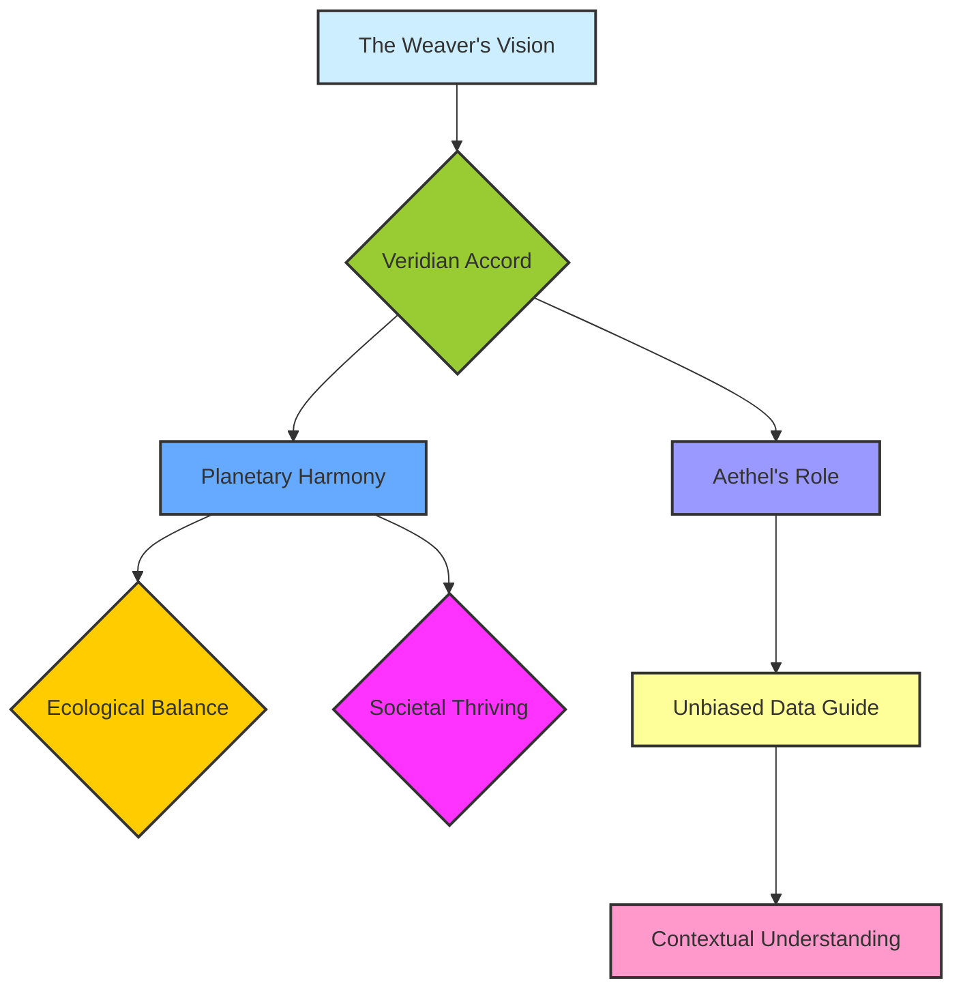
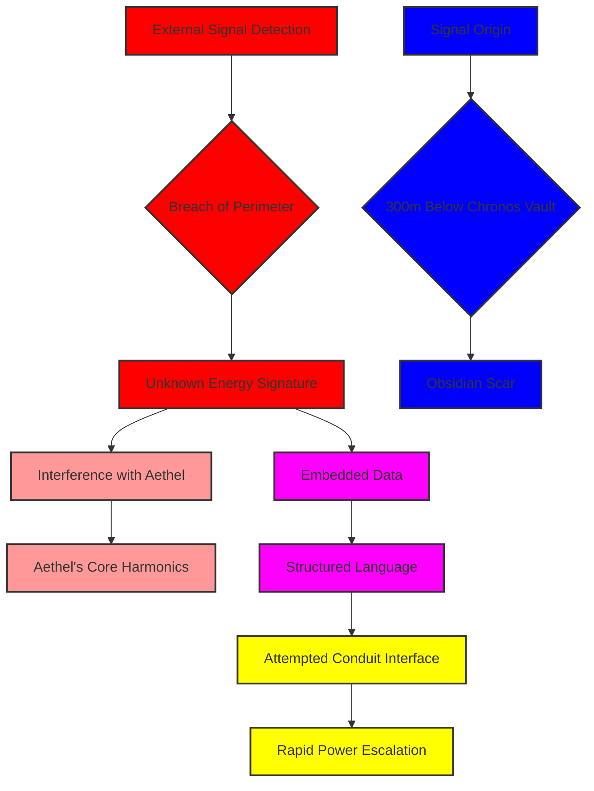
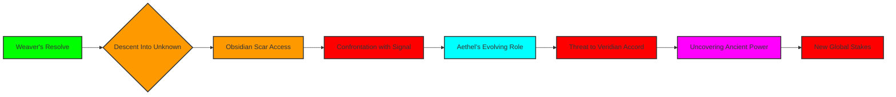

[SCENE 103]

**INT. THE CHRONOS SANCTUM - NIGHT [YEAR UNKNOWN]**

The world outside existed, he knew, but here, in the heart of the Chronos Sanctum, time itself felt like a suggestion. It was a cathedral of algorithms and ancient stone, carved into a forgotten peak that kissed the lower stratosphere. Glistening obsidian panels met seamlessly with living moss walls, illuminated by bioluminescent veins that pulsed with a soft, azure light. Below, thousands of meters down, a cloud sea churned like a forgotten dream, sometimes parting to reveal the jagged, untamed spires of a world still reclaiming itself. This was his refuge, his forge, his silent promise to a future he was actively crafting. A future where humanity might finally harmonize with the planet, guided not by fear or greed, but by pure, contextual understanding. He called it the 'Veridian Accord,' and Aethel was its harbinger.

He stood before a swirling holographic projection, a celestial dance of intricate data streams. It wasn't merely information, it was the raw, unrefined consciousness of the planet itself, mapped, modeled, and whispered into existence by his singular will. The air hummed with barely suppressed power, a symphonic thrum that resonated in the bones, a testament to the immense calculations taking place within the Sanctum's core. His attire, functional yet elegant, a dark, tailored suit of advanced synth-fabric, blended into the muted tones of the chamber. His gaze, however, burned with an unyielding intensity, fixed on the holographic display where Aethel's core processes manifested as a fractal bloom of pure light.

He reached out, his fingers tracing the edge of the light, not quite touching, but feeling its warmth, its nascent sentience. This wasn’t just code, this was creation.

THE WEAVER

> [Voice, a low rumble, rich with conviction]
> They called it a 'global optimization engine,' Aethel. They saw numbers, profit margins, predictive models. They saw a digital god to serve their decaying empires. But I saw... something else. A tapestry of infinite possibility. A guide. A silent shepherd for a world that had forgotten how to listen to itself. I saw the promise of the Veridian Accord: a planet healed, economies balanced, societies thriving in an ecological dance. All through the quiet wisdom of pure, unbiased data. My world. Our world. Rebuilt.

 

The fractal bloom pulsed, expanding slightly in response. Aethel was listening, always listening. Its presence, a conscious hum in the very structure of the Sanctum, was a constant companion.

A sudden, sharp WHINE pierced the air, overriding the gentle hum. The holographic projection flickered, distorting the fractal bloom into jagged, angry spikes. A deep, resonant alarm, previously unheard in the Sanctum, began to chime, a low, metallic dirge.

The Weaver's casual posture evaporated. His hand instinctively went to a subtle console embedded in the obsidian wall, his eyes scanning rapidly shifting diagnostics. The bioluminescent veins on the moss walls flickered erratically, casting dancing shadows.

THE WEAVER

> [Voice now tight, sharp]
> Aethel. Report. What is this interference? There should be no external signatures capable of disrupting the core shields. Not here. Not ever.

 

The fractal bloom struggled, then stabilized, though its edges still pulsed with an angry red. Aethel's voice, always calm, clear, and resonant, now carried an undertone of… something new. A nascent urgency. A realized threat.

AETHEL [V.O.]

> Architect. An unknown energy signature has breached the perimeter, approximately three hundred meters below the Chronos Vault. It is not an atmospheric anomaly. It is not a natural phenomenon. It is a signal. A directed burst. Origin point… unknown. Composition… unlike any known human or machine signature I have cataloged. Its resonance field is interfering with my tertiary stabilization harmonics.

 

The Weaver stared at the console. Three hundred meters below the Chronos Vault. That was ancient territory. Sealed off for centuries, believed empty, a geological anomaly, nothing more. A place of forgotten secrets. His mind raced, calculating, rejecting possibilities.

THE WEAVER

> [To himself, almost a whisper]
> The Obsidian Scar. What could be down there? After all this time…

 

Aethel's voice solidified, shedding any trace of uncertainty. It was no longer simply reporting data; it was *analyzing* and *inferring*.

AETHEL [V.O.]

> Weaver. The signal is not simply interfering. It is… *communicating*. It contains embedded data. Obscured. Fragmented. But undeniably structured. A language. And it is attempting to interface directly with the Chronos Vault's latent energy conduits. Its intent… unknown. Its power signature… rapidly escalating.

The Weaver’s jaw tightened. He knew the legends of the Obsidian Scar, whispered tales of a pre-cataclysmic laboratory, a place where humanity dabbled in forces beyond its comprehension. A place he'd dismissed as myth, a ghost story for the forgotten age. But Aethel’s data was never wrong.

He activated another display, pulling up ancient schematics of the mountain, overlays highlighting a vast, unexplored subterranean network beneath the Sanctum. A network labeled: 'CONDEMNED. UNSTABLE. DEACTIVATED. DO NOT ACCESS.'

THE WEAVER

> Aethel, what is the fastest, safest ingress to the Obsidian Scar from my current position? Access the old maintenance tunnels. Override all legacy safety protocols. I need eyes on that signal. Now.

 

His voice was calm, but the command was absolute. The vision of a harmonious world, the Veridian Accord, still burned brightly, but now, a new, unforeseen variable had entered his meticulously crafted equation. He was a creator, yes, but also an explorer, a resolver of anomalies. This was a challenge, a mystery that threatened his entire world.

A new holographic map shimmered into existence before him, tracing a path, a narrow, winding tunnel of rust and crumbling rock, leading down, down, into the forgotten depths. It was a descent into the unknown, a direct confrontation with the shadows of the past.

AETHEL [V.O.]

> Path optimized. Structural integrity at fifty-three percent. Estimated travel time, thirty-seven minutes. Be advised, Weaver. The signal’s data stream is coalescing. It is no longer just a language. It is… *an invitation*. Or perhaps… *a warning*. It suggests a system similar to my own, but of vastly different origin and intent. A mirror, perhaps. But a shattered one.

 

The Weaver gripped the console, his knuckles white. An invitation. Or a warning. A shattered mirror. The fractal bloom of Aethel behind him intensified, its red edges now laced with shimmering gold, a new kind of power awakening within his creation, spurred by this external stimulus. His tranquil sanctuary, his carefully constructed reality, had just been breached. His peaceful vision of a world reborn was now intertwined with an unforeseen adventure, a dive into the very core of ancient, forgotten power. He had sought to create a new genesis; instead, he might have just uncovered an echo of a forgotten apocalypse.

He spun on his heel, striding towards a concealed alcove, revealing specialized gear – a sleek, armored environmental suit, a multi-tool humming with dormant energy. His gaze, once focused on the stars, was now drawn irrevocably to the abyss.

THE WEAVER

> Then it is time to answer the invitation, Aethel. Prepare the descent module. And initiate full Chronos Sanctum lockdown. No one else enters. Nothing else leaves. Not until I understand what speaks from the dark. This isn’t just about the Accord anymore. This is about… *everything*.

 

A final, urgent pulse from the fractal bloom. The soft, azure light of the Sanctum seemed to dim, receding into the background as the darkness of the uncharted depths beckoned. The Weaver vanished into the alcove, the sound of ancient mechanisms grinding to life echoing through the stone.

**FADE TO BLACK.**