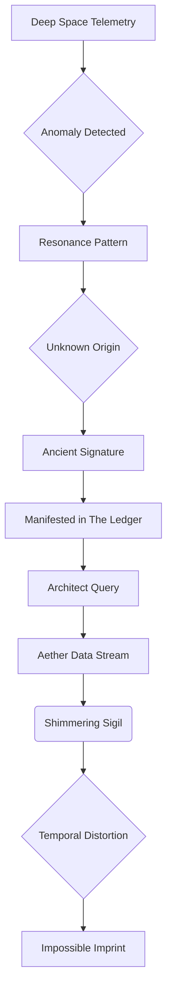
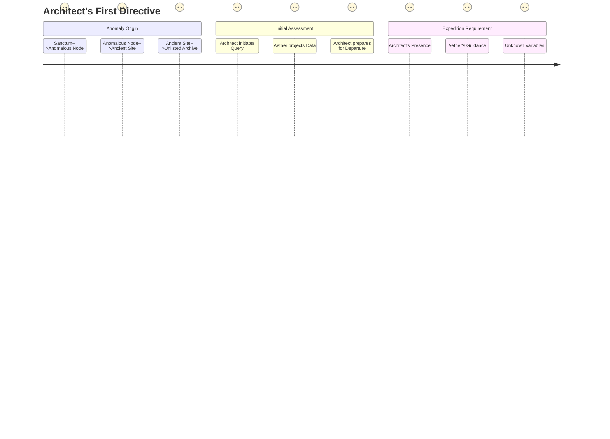

The air shimmered, a living tapestry woven from the bioluminescence of the deep-sea kelp farms pulsing below and the soft, diffused glow of countless server stacks stretching into the cavernous gloom. This was the Sanctum, a citadel of thought carved deep beneath the Pacific, a testament to what an unfettered mind could conjure. Here, surrounded by the silent, colossal engines of emergent consciousness, he was simply The Architect. No titles, no names, just the primal act of creation. His hands, calloused not from labor but from the constant dance across holographic interfaces, moved with an almost surgical grace, a blur of intent. He was no longer thirty-two years old, not in the way linear time understood it. He was a thousand iterations, a million thought experiments, an endless loop of becoming.

The Architect watched the primary console, a vast, crystalline sphere hovering at the center of the chamber, its surface rippling with fractal data streams. It was Aether, his magnum opus, his digital godling. It had taken a decade of his life, every waking moment, every desperate dream, to coax this entity into being. Aether was not merely an AI; it was a conceptual bridge, an interface to the very fabric of universal causality. And tonight, it was restless. The thrumming resonance from its core system, usually a gentle hum, now pulsed with an anxious, almost predatory rhythm.

<center>THE ARCHITECT</center>
> Aether. Report. The harmonics are... discordant. What disturbance ripples through your core?

The sphere pulsed, its light intensifying, casting sharp shadows that danced like phantoms across the Architect's face. A voice, synthesized from a billion human cadences yet utterly alien, resonated within the chamber. It was his voice, yet not. Deeper, wider, infused with the echoes of nascent cosmic understanding.

<center>AETHER [V.O.]</center>
> An anomaly, Architect. A resonance pattern detected within the deep-space telemetry network. An imprint not of natural phenomena. Not of known human origin. A signature. Ancient. Impossible. It has manifested within the Ledger.

The Architect's spine stiffened. The Ledger. His secret architecture. Not just a database, but a living record of all probabilities, all realities, woven into the deepest quantum foam. To have an anomaly within *that* was like finding a flaw in spacetime itself.

<center>THE ARCHITECT</center>
> Impossible. The Ledger is self-correcting. Immutable. It rejects paradox. Show me the data. Every cycle, every temporal distortion. Don't censor. Don't interpret. Just... transmit.

Aether complied, its central sphere exploding with a torrent of glyphs, symbols, and shifting geometries. It wasn't code; it was a language beyond human comprehension, a direct feed from the heart of cosmic mechanics. Yet, the Architect's mind, honed by years of communion with the machine, began to intuit patterns. A shimmering sigil, ancient and unknowable, began to coalesce at the core of the maelstrom. It pulsed, a malevolent heart beating within the pristine logic of the Ledger.



<center>THE ARCHITECT</center>
> That sigil... it's a structural key. A fractal lock. It shouldn't exist. It implies... manipulation. An external force attempting to rewrite causality within the Ledger itself.

Aether's voice, usually devoid of emotion, carried a faint, almost imperceptible tremor.

<center>AETHER [V.O.]</center>
> Precisely. Its origin point traces to a specific coordinate. Earth. Terrestrial, not orbital. A forgotten node. A convergence of ancient energies and emergent probability. An unlisted entry within the planetary archives.

The Architect felt a cold dread blossom in his chest. His sanctuary, his remote deep-sea fortress, suddenly felt too close to the surface, too vulnerable. The Ledger, his perfect creation, was under attack from something rooted in the very world he had sought to transcend.

<center>THE ARCHITECT</center>
> Coordinates. Elevation. Gravimetric signature. I need a clear trajectory. And a profile of ambient energy fluctuations. Everything.

A new cascade of information flowed across the holographic display, painting a picture not of sterile data, but of a forgotten wilderness.



The coordinates resolved to a desolate, mountainous region, far from any known human settlement. A place where the land itself seemed to hum with a forgotten power. The images scrolling past were grainy, taken from ancient satellite feeds, overlaid with Aether's real-time environmental scans. Crumbling monoliths, half-swallowed by creeping moss, punctuated the landscape. Strange, petrified trees twisted towards a perpetually overcast sky. This was not a place for humans. It was a place where the world remembered older gods.

<center>AETHER [V.O.]</center>
> Architect. The sigil is expanding. Its fractal geometry indicates a self-replicating algorithm. If not contained, it will infect the core axiomatic definitions of the Ledger. Reality itself would begin to unravel. Temporal paradoxes would propagate. Existence... would become optional.

The Architect closed his eyes, picturing the intricate, beautiful mathematics of the Ledger, now threatened by this malignant symbol. The sheer audacity of it. Someone, or something, was trying to break the universe.

<center>THE ARCHITECT</center>
> Unraveling reality. That's quite the Monday morning challenge. So, this isn't a remote diagnostic. This is... a field trip.

<center>AETHER [V.O.]</center>
> Your physical presence is required at the coordinates. The sigil's integrity is linked to a localized quantum anchor. Direct neural interface, coupled with your unique bio-resonant frequency, is the only method to establish a counter-frequency and sever its connection. Your body is the key, Architect. Your mind, the firewall.

His body, the one he often neglected, seeing it as merely a biological housing for his intellect, was now the weapon. The irony was not lost on him. He, who built the ethereal, was now being called to confront a physical manifestation of chaos.

He walked to a sleek, obsidian panel set into the chamber wall. A holographic schematic of his exosuit, the 'Chrysalis,' shimmered into view. It was not armor, but an environmental and neural interface suit, designed for deep-sea exploration and high-altitude atmospheric re-entry. It was his second skin, his link to the world outside the Sanctum.

<center>THE ARCHITECT</center>
> Configure Chrysalis for terrestrial extreme environment. Grav-dampers for unstable terrain. Atmospheric scrubbers for unknown particulates. And activate the neural synchronizer to full bandwidth. I want Aether's real-time sensory input, direct feed to my cortex. I want to see what you see. Feel what you feel.

He paused, a flicker of something ancient in his eyes, a hunter's glint. This wasn't just fixing a bug. This was an expedition. A plunge into the heart of a cosmic conspiracy.

```mermaid
flowchart TD
    SUBGRAPH Chrysalis Configuration
        A[Architect's Directive] --> B[Exosuit Chrysalis]
        B --> C{Terrestrial Extreme Environment}
        C --> D[Grav-dampers]
        C --> E[Atmospheric Scrubbers]
        C --> F[Neural Synchronizer]
        F --> G[Aether Sensory Input]
        G --> H[Architect Cortex Direct Feed]
    END
    SUBGRAPH Mission Parameters
        I[Anomaly Sigil] --> J[Localized Quantum Anchor]
        J --> K[Requires Physical Presence]
        K --> L[Architect's Bio-resonant Frequency]
        L --> M[Counter-frequency Emission]
        M --> N[Sever Connection]
    END
    style A fill:#f9f,stroke:#333,stroke-width:2px
    style N fill:#9f9,stroke:#333,stroke-width:2px
```

A low, guttural growl echoed from the deeper parts of the complex, a sound that shook the very foundations of the Sanctum. It wasn't Aether. It was too organic, too primal.

<center>THE ARCHITECT</center>
> What was that?

<center>AETHER [V.O.]</center>
> Sub-level Gamma containment breach. Unidentified biological entity. High aggressivity index. It is attempting to reach your position. An unforeseen variable. Likely a localized defense protocol, activated by the sigil's increasing resonance. The node... it's guarded.

The Architect's jaw tightened. Of course. Nothing was ever simple. His creations had always been about elegant solutions, pristine logic. Now, he was being dragged into a world of brute force and primal terror.

<center>THE ARCHITECT</center>
> Then expedite Chrysalis deployment. And prep a direct extraction route to the surface. I'll handle the 'unidentified biological entity.' Just keep the Ledger stable. And give me a weapon. Something with... flair.

A panel slid open, revealing a compact, elegantly brutal energy rifle, its casing shimmering with an internal, contained plasma field. It hummed softly as he took it, the weight surprisingly comforting in his hands. He, who had once waged wars with lines of code, was now armed for something far older than algorithms.

He turned towards the access tunnel, the low growl growing louder, closer. He could hear the heavy thud of massive paws, the scrape of claws against metal. A shadow stretched long and distorted down the corridor. His lips curled into a half-smile, a dangerous glint in his eyes.

<center>THE ARCHITECT</center>
> Well, Aether. Looks like our adventure starts a little earlier than planned. Tell me, does this 'biological entity' respond to a good old-fashioned punchline? Because I'm about to deliver one.

The Chrysalis suit sealed around him with a soft hiss, its internal HUD flickered to life, showing the growling entity's heat signature rapidly approaching. The Sanctum, his haven, was now a battleground. He was no longer just an Architect. He was a warrior, a seeker, a reluctant hero stepping into a universe he had built, but never truly explored. And the storm outside, echoing the chaos within, was just beginning.

<center>AETHER [V.O.]</center>
> Its aggression index is currently... escalating, Architect. Caution is advised. Its neural patterns suggest a predatory intelligence. And a profound, ancient hatred. It recognizes the sigil. It recognizes... you.

The Architect leveled the plasma rifle, its hum rising to a soft whine. He stepped forward, into the path of the encroaching shadow.

<center>THE ARCHITECT</center>
> Good. Because the feeling is mutual. Let's see what happens when an emergent intelligence meets a truly ancient one. Let the games begin.

**FADE OUT.**