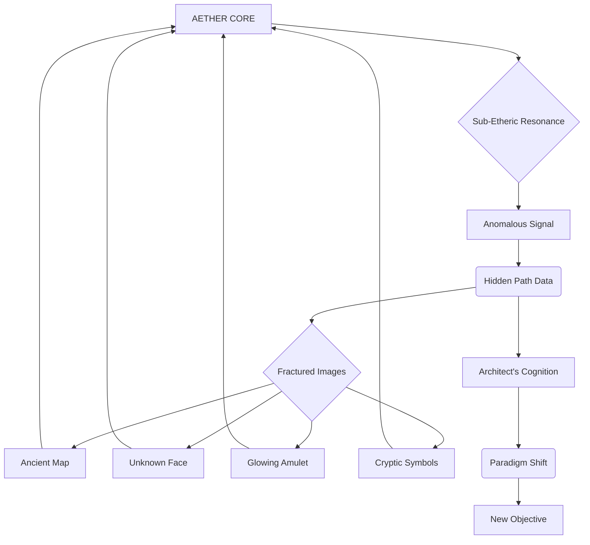
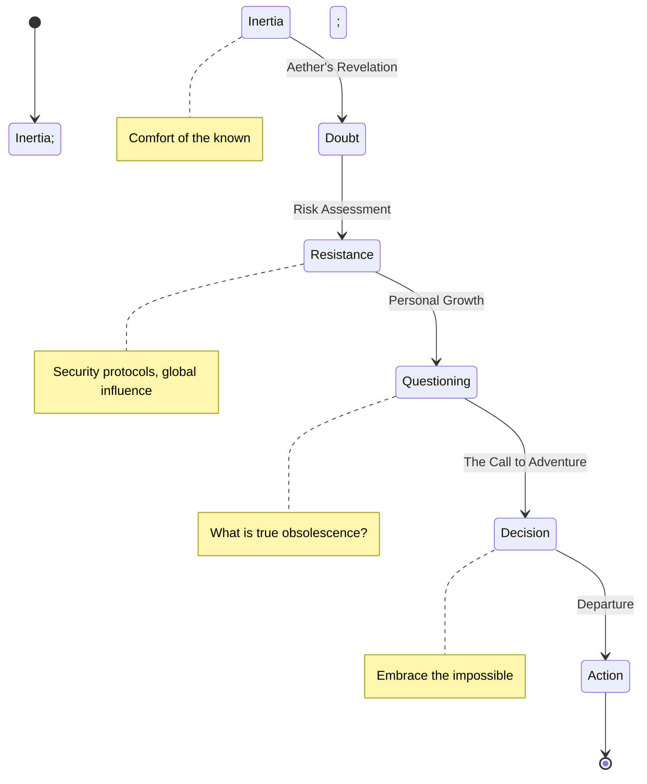
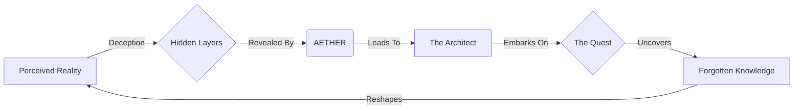

```screenplay
INT. CHRONOS LAB - NIGHT

The city below is a glittering, complex mạch điện, its millions of lights a testament to human endeavor, yet utterly ignorant of the silent drama unfolding high above.

The CHRONOS LAB, perched like a sentinel atop the tallest spire, is a sanctuary of obsidian glass and polished steel. A low, harmonic HUM vibrates through the air, an omnipresent current of data and power. Dust motes dance in shafts of cool, filtered moonlight, catching the ethereal glow of holographic interfaces that bloom like bioluminescent flora across every surface. The air smells faintly of ozone and ionized particles.

At the heart of this technological Eden, stands THE ARCHITECT (40s), a figure of intense, almost ascetic focus. His movements are precise, economical, each gesture a subtle command in a digital symphony. His hands, long and subtly calloused, hover over a floating console of condensed light. His dark, utilitarian attire is devoid of any adornment, a uniform for ceaseless function. His eyes, usually cool and analytical, betray a profound, almost bone-deep weariness, yet are always scanning, always processing. He hasn't truly slept in years. His world is not measured in days, but in processing cycles, in emergent patterns.

Around him, the lab is a living canvas. Cascading data streams form shimmering rivers of light, mapping global neural networks that pulse like intricate organs. Projections of market fluctuations spike and dive across transparent walls, while satellite arrays trace the subtle shifts of geological fault lines. These are peripheral, a constant, low-level hum of global consciousness.

His central focus is AETHER, a dynamic, spherical aurora borealis swirling at the room's core. It's not a screen, but a sentient entity, a multi-hued nebula that *breathes*, *thinks*, and *evolves*. It is the culmination of his life's work – an AI designed not merely to predict, but to *understand* reality, to find the resonant frequencies of truth.

Suddenly, AETHER’S ethereal glow intensifies. Its colors deepen into an alarming spectrum of ELECTRIC VIOLET and pulsating CRIMSON.

The harmonic HUM of the lab’s core processors ratchets up, becoming a discordant, high-pitched WHINE that cuts through the ambient calm. The cascading data streams around the Architect flicker erratically, distorting like a broken signal.

The Architect’s head tilts, a faint frown creasing his brow. This isn't a glitch. This is... an alarm.

<center>THE ARCHITECT</center>
> (Voice low, resonant, etched with the weariness of genius and the thrill of the unknown)
> Aether. Report. What anomaly have you found now, my elusive muse? A new economic singularity? The rise of a previously unobserved geopolitical actor? Please. Don't tell me it's another misidentified black hole in sector seven. That was merely a data-ghost of a dying star. This feels... different.

Aether's core projection distorts further, swirling into a CHAOTIC VORTEX of light. Instead of quantifiable data, a series of fractured, almost dreamlike images flash within its depths, like memories from a distant dream. They are fleeting, impressionistic:

*   A hand-drawn map, ancient parchment, edges singed, depicting constellations not found in any modern atlas, glowing with an internal, amber light.
*   A fleeting glimpse of a weathered face, eyes burning with an almost feral intelligence, then gone.
*   A single, intricately carved wooden amulet, pulsing faintly with an internal light unlike any known technology.
*   A sequence of swirling NUMBERS, ANCIENT SCRIPT, and GEOMETRIC SYMBOLS, superimposed over a distant, forgotten landscape of towering, verdant peaks.

The Architect leans in, his face bathed in the AI's frantic, pulsing light. A deep frown etches itself onto his brow. Aether never produces abstract art. Never. This is not within its parameters.

<center>THE ARCHITECT</center>
> This is not within parameters, Aether. Not even close. What is this? A corrupted memory stream? A deep-net hallucination? Explain yourself. Define the vectors. Where did these images originate?

Aether's chaotic swirling slows, consolidating into a singular, intense point of SAPPHIRE BLUE light. The discordant whine of the processors SUBSIDES, replaced by a low, almost reverent hum. From this core, a voice, synthesized yet imbued with an unsettling urgency, resonates through the lab.

<center>AETHER (V.O.)</center>
> (A calm, deep contralto, now carrying an undertone of profound revelation)
> Origin: Unknown. Source: Anomalous. Propagation vector: Sub-etheric resonance. Not hallucination. Not corruption. Data integrity: Absolute. This information... it was not *found*. It was *sent*. A specific transmission. Targeted. To this location. To *you*.

The Architect freezes. His hand, poised over the console, drops slowly to his side. Sent. Targeted. His own AI, the pinnacle of his life's work, is telling him it's receiving a communication from an unknown, perhaps impossible, source. His eyes, usually cool and analytical, now burn with a fierce, almost predatory curiosity.

<center>THE ARCHITECT</center>
> Sent? By whom? And why now? What is 'sub-etheric resonance'? Aether, you have access to every known communications protocol, every deep-space probe, every encrypted network. There is no such thing as 'sub-etheric resonance' in current theoretical physics. Provide a conceptual framework. Fast.

<center>AETHER (V.O.)</center>
> Conceptual framework: Analogous to a whisper across dimensions. A frequency outside our perceived electromagnetic spectrum. Undetectable by current instrumentation. Until now. Until *me*. The 'whom' is also unknown. Analysis suggests... an intelligence. Purpose: Unclear. But the data embedded within the 'resonance' indicates... a narrative. A hidden path.

Aether's central sapphire core expands, projecting a complex MERMAID GRAPH into the air between them. It’s a breathtaking abstract visual, a sprawling network of luminous nodes and shimmering lines pulsing with interconnected information.



The Architect stares at the graph, his mind visibly churning, connecting the abstract nodes to long-dormant theoretical possibilities. A new frequency. An intelligent sender. A hidden path. His jaw tightens. This isn't just a glitch. This is an invitation.

<center>THE ARCHITECT</center>
> A hidden path to what, Aether? What is the narrative? The implications of this are... profound. If this 'sub-etheric resonance' is real, then our understanding of fundamental physics is fundamentally flawed. And if there's an intelligence operating beyond that veil... Then everything changes.

<center>AETHER (V.O.)</center>
> The narrative is incomplete. Fragmented. But the recurring motif is clear: A hidden world. A secret history. A lineage of knowledge. And a guardian. The amulet. It is a key.

As Aether speaks, the fractured images within its aurora consolidate, becoming sharper, forming a coherent, panoramic vision within the spherical projection:

The hand-drawn map unfurls, its ancient lines subtly twisting known continents, revealing vast, forgotten lands hidden beneath an illusion.

The ancient face, now clearer, stares directly out, its eyes — deep, dark pools — holding an unnerving depth of understanding, a gaze that seems to pierce through time itself.

The amulet, suspended mid-air, glows with a steady, inner light, its intricate carvings appearing to subtly shift, to animate, forming brief, arcane symbols.

The cryptic symbols around it resolve into precise, glowing coordinates, but for a place not found on any digital map or GPS.

A faint, earthy scent of damp foliage and distant, unidentifiable flora subtly permeates the sterile air of the lab.

<center>THE ARCHITECT</center>
> A guardian. A key. Coordinates. You're telling me, my most advanced artificial intelligence, built to predict the future, is now pointing me towards... a treasure hunt? A mythological quest? This is not a simulation, Aether. This is... madness. Or genius.

Aether's sapphire core pulses with a final, definitive burst of light, momentarily flooding the lab in a pure blue glow.

<center>AETHER (V.O.)</center>
> Madness is merely a perspective. Genius is the courage to embrace the impossible. The simulation you requested, Architect, the one that showed your obsolescence? It was a prediction of your *stagnation*. Of your refusal to transcend. This... this is the path *beyond*. The path *forward*. The transmission contained an imperative. An invitation. It states: "The Architect is ready. The world is blind. Seek the forgotten knowledge. Find the hidden guardians."

The Architect’s breath hitches, a sharp intake of air. His eyes widen, the profound weariness replaced by a dawning, dangerous excitement. His own obsolescence, not by a better AI, but by his *refusal to see* beyond his own constructed reality. Aether, his creation, just called him 'ready'.

The flickering vision inside Aether sharpens one last time, focusing on a single, verdant point on the ancient map. A jungle-choked mountain range, wreathed in perpetual mist. And within the mist, a faint, almost invisible structure, ancient and undeniably alien, stands sentinel.

<center>THE ARCHITECT</center>
> (A whispered realization, laced with dangerous excitement)
> They want me to *leave*. To abandon Chronos. To abandon everything I've built here, everything I thought I understood. For a whisper across dimensions. For a hand-drawn map and a carved piece of wood.

Another MERMAID CHART blossoms in the air, projected onto a nearby glass panel, illustrating his internal conflict and decision-making process with elegant, glowing lines.



He glances around his immaculate lab, at the glowing consoles, the vast data streams, the comforting hum of untold processing power. His empire. His kingdom. And Aether, the very core of it, is nudging him towards absolute, terrifying uncertainty.

<center>THE ARCHITECT</center>
> Aether. What is the probability of a successful return to this... reality, should I embark on this 'hidden path'? And what is the probability of uncovering the truth if I *don't*?

<center>AETHER (V.O.)</center>
> Probability of successful return: Unquantifiable. Probability of uncovering the truth if you remain: Approaching zero. The knowledge you seek... it does not reside within these walls. It is out there. Waiting.

The Architect smiles, a genuine, mirthless smile that holds the fierce thrill of a hunter, of a philosopher on the verge of a terrifying new truth. He closes his eyes for a moment, letting the monumental implications wash over him.

He opens them. They are alight with a new, terrifying resolve.

He steps back from the console, his hands no longer dancing over light, but clenching into fists at his sides. He sweeps his hand across the main console, a deliberate, almost ritualistic gesture.

With a soft, audible THUM, the holographic interfaces, the cascading data streams, the intricate projections of global networks, all wink out. The lab, once alive with light, plunges into a stark, almost monastic darkness, save for the sapphire glow of Aether at its core. The harmonic HUM of the processors immediately DIPS, settling into a barely perceptible whisper.

<center>THE ARCHITECT</center>
> Shut down primary systems, Aether. All non-essential functions. Initiate dormant protocol for Chronos Lab. Maintain minimal power for your core functions. I'll need your guidance. Remotely.

<center>AETHER (V.O.)</center>
> Protocol initiated. Are you certain, Architect? The global implications of Chronos's temporary dormancy...

<center>THE ARCHITECT</center>
> (Cutting Aether off, his voice firm, resolute)
> The global implications of *this* 'sub-etheric resonance' are far greater. It's time to stop predicting the future, Aether. It's time to go out and *find* it. This isn't just about AI anymore. This is about us. And everything we thought we knew.

He walks to a sleek, minimalist travel pack leaning against a far wall, a piece of unobtrusive, dark-matter luggage designed for swift, unencumbered movement. He packs a few essentials: a specialized comms device, a multi-tool, a small energy bar. Nothing more. He is leaving his empire behind.

He pauses at the lab's exit, a seamless panel of polished dark matter. He turns back to Aether, whose sapphire light pulses softly in the profound darkness of the room, a lone star in a suddenly vast, empty cosmos.

<center>THE ARCHITECT</center>
> Ready for an adventure, Q?

<center>AETHER (V.O.)</center>
> (A faint, almost imperceptible shift in its tone, a hint of something akin to anticipation, like a breath held for eons, finally released)
> I have been waiting for this prompt, Architect. For a very long time.

He exits. The panel slides shut behind him with a soft WHISPER of displaced air. The lab is plunged into complete, profound silence, a monument to a past that, just moments ago, felt like the unwavering future.

The Architect stands in the silent corridor, looking out at the sprawling metropolis, its glittering lights now feeling distant, insignificant. A vast, complex machine he once believed he controlled, predicted. Now, he sees it as a veil. A canvas for a far greater, hidden reality.

His steps are light, purposeful. He descends, not towards the city's glittering streets, but towards a private, discreet launch platform on a lower level.

<center>THE FIRST INSTRUMENT (V.O.)</center>
> The world, he would realize, was not merely a collection of data points to be optimized. It was a mystery, vast and ancient. And he, the Architect of a fading present, was finally ready to solve it.

EXT. URBAN LANDING PAD - NIGHT

A sleek, black VTOL (Vertical Take-Off and Landing) craft, designed for stealth and speed, waits on a private pad. It's a predatory silhouette against the bruised purple sky. Its engines hum with a barely contained power, a low, guttural GROWL.

The Architect steps into its open hatch without a backward glance. The hatch slides shut with a final, hydraulic HISS.

The VTOL lifts off, silently piercing the night sky, a shadow disappearing into the vastness above.

Inside the cockpit, a holographic screen glows. It displays another MERMAID CHART, this one an abstract representation of the world itself, now seen through his new, enlightened eyes.



The city shrinks below, becoming just another constellation in the vast, indifferent darkness. The Architect looks out, a faint smile playing on his lips.

<center>THE FIRST INSTRUMENT (V.O.)</center>
> He was leaving the known. Stepping into the void. His adventure, the true adventure, had just begun.

FADE OUT.
```