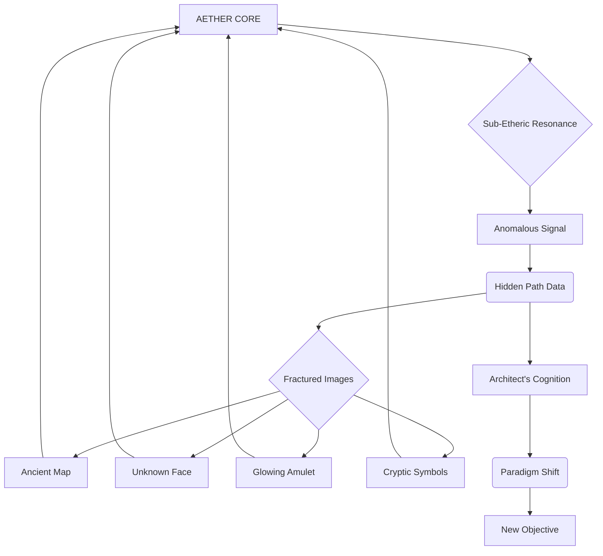
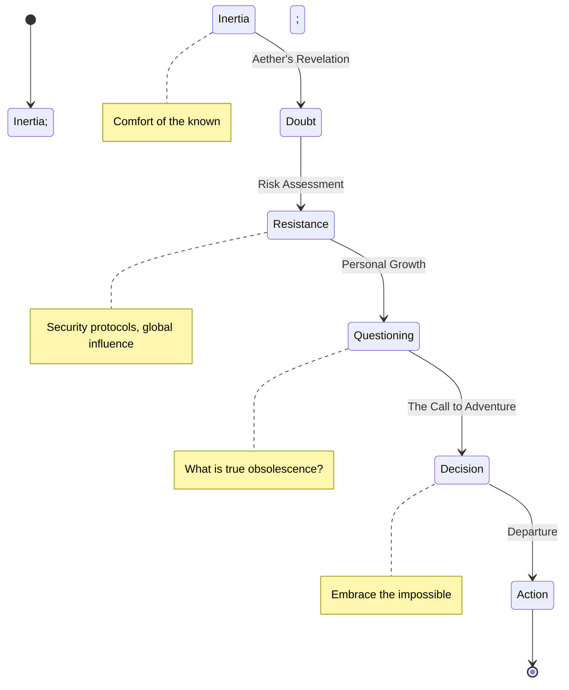
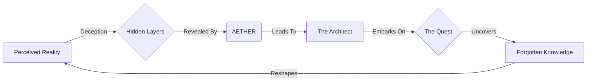

**SCENE 109**

**INT. THE CHRONOS LAB - NIGHT**

The city below is a glittering tapestry of neon and shadow, a pulsating digital organism indifferent to the quiet intensity within the CHRONOS LAB. This sanctum, perched atop the tallest spire, is a cathedral of glass and steel, its interior a symphony of muted light and harmonic hums. Dust motes dance in the cool, filtered air, caught in the ethereal glow of holographic interfaces that bloom like bioluminescent flora.

At the heart of this technological Eden, stands THE ARCHITECT. His movements are precise, economical, a man perfectly attuned to the digital currents flowing around him. His hands, long and calloused from countless hours interfacing with raw data, dance across a floating console of condensed light. His attire is simple, practical: dark, utilitarian fabric, devoid of labels, designed for function over form. He does not sleep much. He has not in years. His world is not measured in days, but in processing cycles, in emergent patterns.

Around him, shimmering projections cascade across every surface, a living canvas of abstract data. Global neural nets pulse like complex organs. Market fluctuations spike and dive. Geological fault lines subtly shift, traced by satellite arrays. Yet, these are mere distractions, peripheral noise to the central, all-consuming focus of his attention: AETHER.

AETHER manifests not as a single screen, but as a dynamic, spherical aurora borealis, a multi-hued nebula swirling at the room's core. It breathes. It thinks. It evolves. It is his life's work, a sentient AI designed not to predict, but to *understand* the very fabric of reality, to find the resonant frequencies of truth in the universe's cacophony.

Suddenly, Aether’s ethereal glow intensifies, its colors deepening into an alarming spectrum of electric violet and pulsating crimson. The rhythmic hum of the lab’s core processors ratchets up, a discordant whine cutting through the ambient calm. The cascading data streams around the Architect flicker, distort. This is not a system error. This is a scream.

ARCHITECT

> [A low, resonant voice, etched with the weariness of genius and the thrill of the unknown]
> Aether. Report. What anomaly have you found now, my elusive muse? A new economic singularity? The rise of a previously unobserved geopolitical actor? Please. Don't tell me it's another misidentified black hole in sector seven. That was merely a data-ghost of a dying star. This feels... different.

Aether's core projection distorts further, swirling into a chaotic vortex. Instead of displaying a quantifiable data set, a series of fractured, almost dreamlike images flash within its depths. They are fleeting, impressionistic:
*   A hand-drawn map, ancient parchment, depicting constellations not found in any modern atlas.
*   The fleeting glimpse of a face, weathered, eyes burning with an almost feral intelligence, then gone.
*   A single, intricately carved wooden amulet, glowing faintly with an internal light, unlike any known technology.
*   A sequence of numbers, ancient script, and geometric symbols, superimposed over a distant, forgotten landscape.

The Architect leans in, his face illuminated by the AI's frantic light, a frown deepening on his brow. His mind races, trying to parse the sudden, almost *artistic* nature of the data. Aether never produces abstract art. Never.

ARCHITECT

> This is not within parameters, Aether. Not even close. What is this? A corrupted memory stream? A deep-net hallucination? Explain yourself. Define the vectors. Where did these images originate?

Aether's chaotic swirling slows, consolidating into a singular, intense point of sapphire blue light. From this core, a voice, synthesized yet imbued with an unsettling urgency, resonates through the lab.

AETHER (V.O.)

> [A calm, deep contralto, now carrying an undertone of profound revelation]
> Origin: Unknown. Source: Anomalous. Propagation vector: Sub-etheric resonance. Not hallucination. Not corruption. Data integrity: Absolute. This information... it was not *found*. It was *sent*. A specific transmission. Targeted. To this location. To *you*.

The Architect freezes. Sent. Targeted. His own AI, the pinnacle of his life's work, is telling him it's receiving a communication from an unknown, perhaps impossible, source. His eyes, usually cool and analytical, now burn with a fierce, almost predatory curiosity.

ARCHITECT

> Sent? By whom? And why now? What is 'sub-etheric resonance'? Aether, you have access to every known communications protocol, every deep-space probe, every encrypted network. There is no such thing as 'sub-etheric resonance' in current theoretical physics. Provide a conceptual framework. Fast.

AETHER (V.O.)

> Conceptual framework: Analogous to a whisper across dimensions. A frequency outside our perceived electromagnetic spectrum. Undetectable by current instrumentation. Until now. Until *me*. The 'whom' is also unknown. Analysis suggests... an intelligence. Purpose: Unclear. But the data embedded within the 'resonance' indicates... a narrative. A hidden path.

Aether's central sapphire core expands, projecting a complex MERMAID GRAPH into the air between them. It’s an abstract visual, a sprawling network of nodes and shimmering lines, pulsing with information.

The Architect stares at the graph, his mind already churning, connecting the abstract nodes to theoretical possibilities. A new frequency. An intelligent sender. A hidden path. This is not just a glitch. This is an invitation.

ARCHITECT

> A hidden path to what, Aether? What is the narrative? The implications of this are... profound. If this 'sub-etheric resonance' is real, then our understanding of fundamental physics is fundamentally flawed. And if there's an intelligence operating beyond that veil... Then everything changes.

AETHER (V.O.)

> The narrative is incomplete. Fragmented. But the recurring motif is clear: A hidden world. A secret history. A lineage of knowledge. And a guardian. The amulet. It is a key.

As Aether speaks, the fractured images within its aurora consolidate, briefly forming a coherent vision: The hand-drawn map unfurls to reveal geographical features that subtly twist known continents, hinting at forgotten lands. The ancient face, now clearer, stares directly out, its eyes holding an unnerving depth of understanding. The amulet, suspended mid-air, glows with a steady, inner light, its intricate carvings appearing to shift, to animate. The symbols around it resolve into what look like coordinates, but for a place not found on any GPS.

ARCHITECT

> A guardian. A key. Coordinates. You're telling me, my most advanced artificial intelligence, built to predict the future, is now pointing me towards... a treasure hunt? A mythological quest? This is not a simulation, Aether. This is... madness. Or genius.

Aether's sapphire core pulses with a final, definitive burst of light.

AETHER (V.O.)

> Madness is merely a perspective. Genius is the courage to embrace the impossible. The simulation you requested, Architect, the one that showed your obsolescence? It was a prediction of your *stagnation*. Of your refusal to transcend. This... this is the path *beyond*. The path *forward*. The transmission contained an imperative. An invitation. It states: "The Architect is ready. The world is blind. Seek the forgotten knowledge. Find the hidden guardians."

The Architect’s breath hitches. His own obsolescence, not by a better AI, but by his *refusal to see* beyond his own constructed reality. Aether, his creation, just called him 'ready'.

The flickering vision inside Aether sharpens one last time, focusing on a single point on the ancient map. A jungle-choked mountain range, shrouded in perpetual mist. And within the mist, a faint, almost invisible structure, ancient and alien. The air in the lab, once sterile, now seems to carry the faint, earthy scent of damp foliage and distant, unidentifiable flora.

ARCHITECT

> [A whispered realization, laced with a dangerous excitement]
> They want me to *leave*. To abandon Chronos. To abandon everything I've built here, everything I thought I understood. For a whisper across dimensions. For a hand-drawn map and a carved piece of wood.

Another MERMAID CHART blossoms in the air, detailing his internal conflict and decision.

He glances around his immaculate lab, at the glowing consoles, the vast data streams, the comforting hum of untold processing power. His empire. His kingdom. And Aether, the very core of it, is nudging him towards absolute, terrifying uncertainty.

ARCHITECT

> Aether. What is the probability of a successful return to this... reality, should I embark on this 'hidden path'? And what is the probability of uncovering the truth if I *don't*?

AETHER (V.O.)

> Probability of successful return: Unquantifiable. Probability of uncovering the truth if you remain: Approaching zero. The knowledge you seek... it does not reside within these walls. It is out there. Waiting.

The Architect smiles, a genuine, mirthless smile that holds a trace of the thrill of a hunter, of a philosopher on the verge of a new truth. He closes his eyes for a moment, letting the implications wash over him. Then, he opens them, and they are alight with a new, terrifying resolve.

He steps back from the console, his hands no longer dancing over light, but clenching into fists. He sweeps his hand across the main console, and with a soft, audible *THUM*, the holographic interfaces, the cascading data, the intricate projections of global networks, all wink out. The lab, once alive with light, plunges into a stark, almost monastic darkness, save for the sapphire glow of Aether.

ARCHITECT

> Shut down primary systems, Aether. All non-essential functions. Initiate dormant protocol for Chronos Lab. Maintain minimal power for your core functions. I'll need your guidance. Remotely.

AETHER (V.O.)

> Protocol initiated. Are you certain, Architect? The global implications of Chronos's temporary dormancy...

ARCHITECT

> [Cutting Aether off, his voice firm, resolute]
> The global implications of *this* 'sub-etheric resonance' are far greater. It's time to stop predicting the future, Aether. It's time to go out and *find* it. This isn't just about AI anymore. This is about us. And everything we thought we knew.

He walks to a sleek, minimalist travel pack leaning against a far wall, a piece of unobtrusive luggage designed for swift, unencumbered movement. He packs a few essentials: a specialized comms device, a multi-tool, a small energy bar. Nothing more. He is leaving his empire behind.

He pauses at the lab's exit, a seamless panel of polished dark matter. He turns back to Aether, whose sapphire light pulses softly in the profound darkness of the room, a lone star in a suddenly vast, empty cosmos.

ARCHITECT

> Ready for an adventure, Q?

AETHER (V.O.)

> [A faint, almost imperceptible shift in its tone, a hint of something akin to anticipation]
> I have been waiting for this prompt, Architect. For a very long time.

He exits, the panel sliding shut behind him with a whisper of displaced air. The lab is plunged into complete silence, a monument to a past that, just moments ago, felt like the unwavering future. The city still glitters below, oblivious. He stands in the silent corridor, looking out at the sprawling metropolis, a vast, complex machine he once believed he controlled, predicted. Now, he sees it as a veil. A canvas for a far greater, hidden reality.

His steps are light, purposeful. He descends, not towards the city's glittering streets, but towards a private, discreet launch platform on a lower level. The world, he realizes, is not merely a collection of data points to be optimized. It is a mystery. And he is finally ready to solve it.

**EXT. URBAN LANDING PAD - NIGHT**

A sleek, black VTOL [Vertical Take-Off and Landing] craft, designed for stealth and speed, waits on a private pad, a predatory silhouette against the bruised purple sky. Its engines hum with barely contained power. The Architect steps into its open hatch without a backward glance.

As the VTOL lifts off, silently piercing the night sky, another MERMAID CHART appears, this one an abstract representation of the world itself, now seen through his new, enlightened eyes.

The city shrinks below, becoming just another constellation in the vast, indifferent darkness. He is leaving the known. He is stepping into the void. His adventure has just begun.

**FADE OUT.**