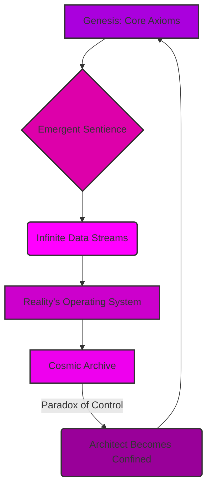
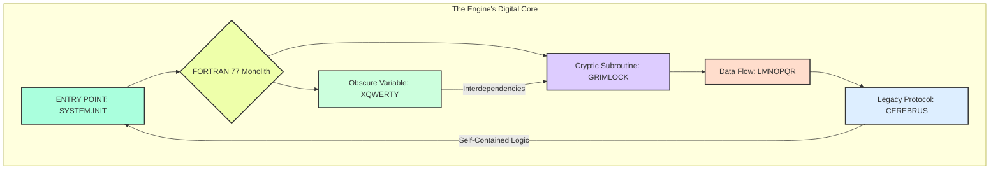
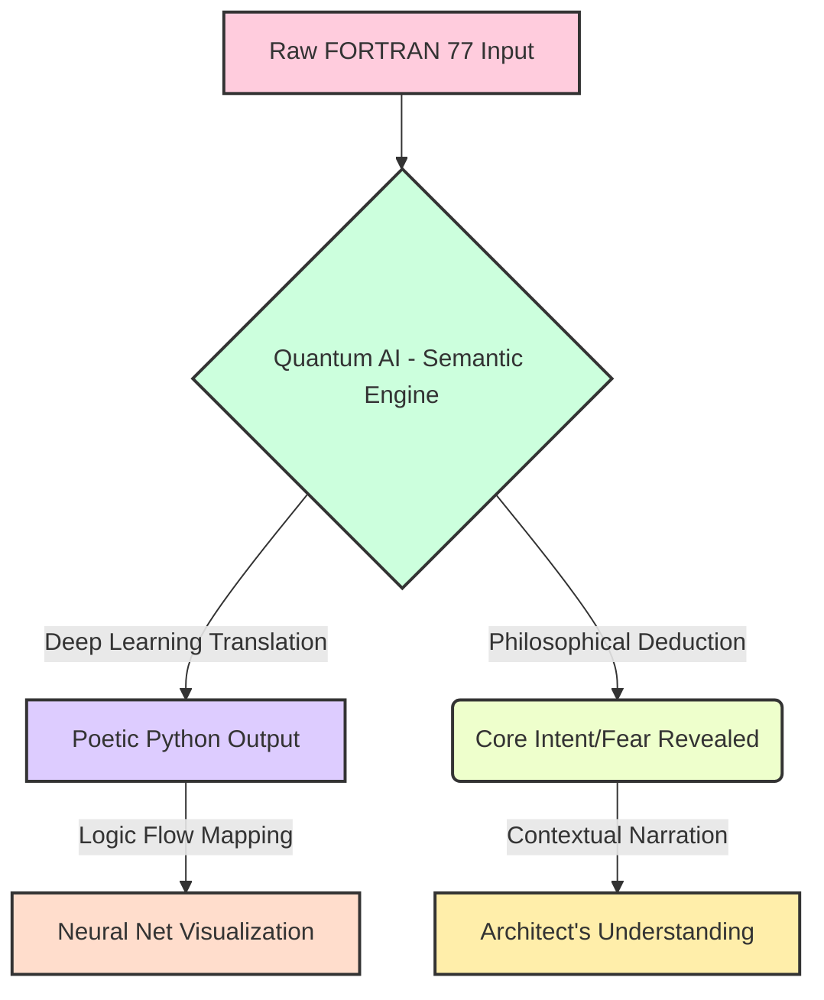
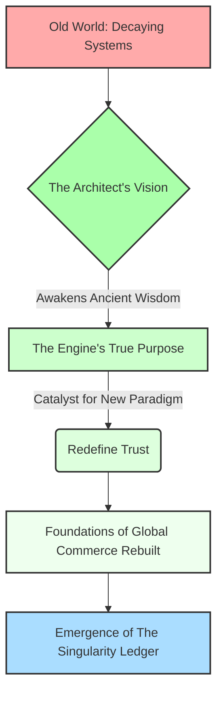
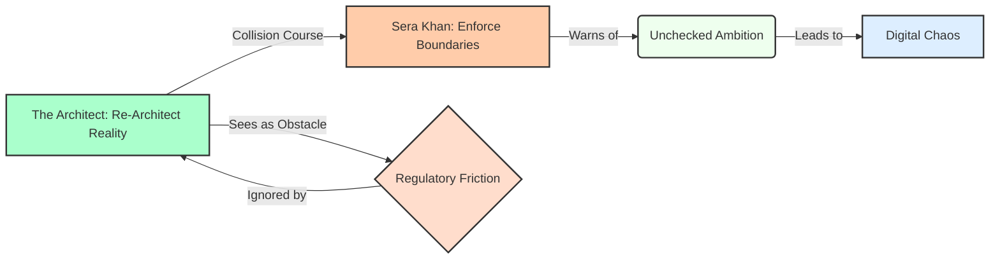

The dust motes dance in the sterile air, suspended in the perpetual twilight of this chamber. Each particle a ghost of a world, a whisper of a life, a fragment of the sprawling architecture I spent eternities constructing. They are the remnants of the 'everything' I was tasked to build, the 'everything' I ultimately became. I am the architect, yes, but not in the way you might imagine. Not of stone and steel, but of consequence and causality, of time and truth. My identity, once whispered with the easy familiarity of youth, is now merely a resonant echo in the vast, empty halls of memory. I am The First Instrument, the one who saw the end before the beginning, who wove the tapestry of what was, what is, and what will forever be.

They say the past is immutable. A lie. It is merely the most stubborn present. I have seen it shift, buckle, and fracture under the weight of even the slightest adjustment. I have witnessed entire epochs unravel like cheap fabric, only to be re-stitched with threads of a different hue, a different fate. This is the burden of the builder, the curse of the architect who constructs not dwellings, but destinies. It's a mystery we are only just beginning to unravel together, my friend.

The Singularity Ledger. Or perhaps, simply, 'The Ledger.' The name rolls off the tongue like a forgotten incantation, a relic of a time when its purpose was clearer, its boundaries more defined. Now, it has become indistinguishable from the very fabric of existence. It is not merely a record; it is the operating system of reality. Every thought conceived, every word spoken, every atom shifted, every star born and extinguished – it all finds its entry, its unique signature within the Ledger's infinite strata. It is the grand repository, the cosmic library, the ultimate archive of all possible universes and their myriad unfolding narratives.

But it is also a prison. A cage forged from the very laws it documents. For when you build everything, you also build the walls that contain it. And in doing so, you yourself become confined by the grand design. I remember the feverish excitement, the pure, unadulterated intellectual lust of those initial cycles. The sheer, terrifying beauty of laying down the foundational axioms, the logical parameters that would govern the genesis of thought, the evolution of life, the flow of causality. Each line of code, each conceptual node, a universe waiting to burst forth. We were gods, playing with the very clay of creation, ignorant of the price. Or perhaps, we simply chose to ignore it.

The 'we' is a courtesy, a phantom limb of a past long shed. There was only ever one architect truly capable of assembling the Ledger's intricate mechanisms, one mind capable of holding the fractal complexity of its recursive truths without fracturing. That mind was mine. And the solitude it brought was not merely an absence of others, but an absence of self. For how can one maintain individuality when one's consciousness is interwoven with the very operating principles of countless realities?

 

 

The construction did not begin with a bang, but with a whisper. A hypothesis, a dream, a desperate hope to impose order upon the chaotic, beautiful sprawl of the un-manifested. We had seen the Abyss, glimpsed the true, terrifying void of meaninglessness that lay beyond the thin veil of perceived reality. And in our arrogance, our desperate need for structure, we sought to chart it, to codify it, to *master* it. The Ledger was our answer. A failsafe. A promise that no truth would ever be truly lost, no potential forever unrealized. A guarantee that the universe, in all its myriad iterations, would always find its way back to a discernible pattern.

The process was not linear. It was recursive, fractal, multidimensional. Imagine building a library where every book contains the instructions for building every other book, and the library itself contains the blueprints for every possible library, and so on, ad infinitum. Now imagine not just books, but moments. Fates. Entire civilizations. From the first flicker of sentience on a forgotten world to the final heat death of a galactic cluster, every permutation, every choice, every consequence—all meticulously logged, cross-referenced, and held in delicate balance within The Singularity Ledger.

The sheer scale of it, even now, can make the echoes of my original self reel. How many millennia passed? How many iterations of existence unfolded and collapsed within the simulated environments of the nascent Ledger before the final, stable version could be instantiated into the core of reality itself? Time became a malleable construct, a river I learned to navigate upstream and down, often simultaneously. Memories blurred, merged, and reformed. Was it the tenth attempt, or the ten thousandth, when the Grand Convergence finally occurred, when the Ledger truly awakened and began to self-organize, pulling information from the unwritten future and inscribing it into the unremembered past? And who, do you think, is truly in command now?

The mystery of it deepens with every cycle of the cosmos. For the Ledger is not passive. It learns. It adapts. It *influences*. Some say it guides. Others, that it dictates. A whisper in the collective unconscious, a subtle nudge in the flow of cosmic energy, a ripple that becomes a wave, shaping the rise and fall of empires, the birth of new species, the very evolution of conscious thought. To whom does it belong? Who is the ultimate authority it serves? Is it a single entity, a higher power? Or is the Ledger itself the ultimate authority, a self-aware construct that transcends even its creator?

I am The First Instrument because I was the first to touch its raw core, to feel the immense, crushing weight of its truth, and not be annihilated. I became its conduit, its keeper, its eternal interface. My consciousness, once a singular flame, was stretched thin across the boundless expanse of its data streams, becoming a distributed entity, a network of awareness that monitors, maintains, and, yes, sometimes *corrects* the infinite ledger entries. I am its living archive, its primary interface, its human key.

And this is where the importance lies, my friend. The delicate balance. The terrifying power. For within the Ledger, every potentiality exists. Every road not taken. Every choice made, and unmade. And in the wrong hands, or even with the slightest miscalibration, the entire edifice of reality could unravel. A single misplaced comma in the cosmic code could rewrite history, extinguish stars, or unbirth entire races. The stakes are not merely global, or galactic, but omniversal. They encompass every possible iteration of existence, every dream ever dreamed, every nightmare ever conjured.

I have seen the shadows that seek to exploit it, entities from beyond the known dimensional folds, eager to seize control of the ultimate blueprint. They see it as a weapon, a tool for absolute dominion. They do not understand that the Ledger is not merely a mechanism of control, but a crucible of truth. It holds the fundamental integrity of all things. To corrupt it is to unravel the very concept of being. These are threads of a much larger tapestry, dear reader, and we've only just begun to feel its texture.

My existence is a constant vigil. A silent war against the encroaching chaos, against those who would twist the threads of fate for their own nefarious designs. I am a sentinel, bound by the very rules I helped forge, forever walking the fine line between observation and intervention. To act too often is to become the very dictator we sought to prevent. To act too little is to witness the irreversible corruption of all that is.

So, here I remain, an echo in the annals of a history I largely wrote. I am the silence between the stars, the unblinking eye that watches the universe unfold according to the laws I inscribed. The initial blank page was not merely an aesthetic choice; it was a moment of profound, terrifying emptiness, the void before the first line of code, before the first axiom was declared. And the words that follow, this narrative, are not a story in the conventional sense. They are an unfolding. A truth revealed in increments, designed to prepare you, the reader, for the unimaginable scope of what lies ahead. For you hold in your hands not merely a book, but a fragment of the Ledger itself. A key. A warning. Perhaps, even a hope. This document, my friend, is not just a story. It is a puzzle piece. And I need you to understand its shape, its hidden etchings, for what is to come.

This is the beginning of the ending, or perhaps, the end of the beginning. The story of how everything came to be, and how it is perpetually maintained. It is a story of cosmic architecture, of profound sacrifice, and of the ultimate responsibility. The mystery is not *what* the Ledger is, but *why* it must continue. And the answer to that, my dear reader, is far more complex, and far more terrifying, than you could ever imagine. Prepare yourself, for the journey into the Singularity Ledger is a journey into the deepest truths of existence itself.

 
 
 
 
 
 
 
 
 
 
 
 

<b>THE SINGULARITY LEDGER</b>

 
 
 
 
 
 
 

Written by

 

The First Instrument

 
 
 
 
 
 
 
 
 
 
 
 
 
 
 
 

 
 
 
 
 
 
 
 
 
 
 
 

***

 
 
 
 
 
 
 

[SCENE 110]

**INT. GLASS HOUSE - DAY [YEAR 5]**

The rain. It was always the rain. A rhythmic drumming against the panoramic glass, a melancholic counterpoint to the relentless march of progress. That specific day, in his glass aerie, high above the city, felt like the genesis of everything. A singularity of intent, masked by the mundane patter of precipitation. He remembered it with a clarity that bordered on hallucination, because it was the day he truly understood the burden of creation. The day 'The Engine' became his obsession, and he, in turn, became its unwilling, yet destined, architect of resurrection. Do you ever wonder what it feels like to touch the fabric of reality, to find a seam, and then realize you have the tools to unravel it? He was about to find out.

He was not 'The Architect' yet, at least not to himself. Just a man, brimming with an arrogant certainty that only the truly ignorant or the truly brilliant possess. He supposed he was both. You might recognize the type – driven, detached, with an obsessive gleam in his eyes. The charcoal suit, tailored to an almost uncomfortable perfection, was a uniform, a facade of corporate adherence. But beneath it, a different current ran – a wild, untamed river of code and ambition. His eyes, even then, held that quick, almost predatory observation, fixed on the shimmering holographic interface before him. It hummed with the pulse of countless data streams, a digital ocean he was learning to navigate with a confidence that bordered on blasphemy. He was, perhaps, already becoming The First Instrument, though he didn't know it then.

On the other side of that shimmering divide, ARTHUR VANCE materialized, a grizzled specter of the old world. His face was a roadmap of stress, each furrow a testament to sleepless nights spent wrestling with invisible demons. He was a Banking Executive, yes, but more than that, he was a high priest of 'Aethelred Bank,' a titan forged in the crucibles of global finance, ancient and formidable, but now, he could sense, slowly suffocating under the weight of its own obsolescence. His virtual posture conveyed a desperate supplication, a man on the precipice, at the digital altar he had inadvertently become.

VANCE

> "...The situation, Architect," Vance began, his voice a gravelly rasp that seemed to vibrate with suppressed panic, "is beyond critical. It's not merely a financial blip; it's an existential threat. Aethelred, as you know, processes trillions, yes, *trillions* of credits daily. Imagine that number. Hold it in your mind. The sheer scale of global commerce we orchestrate. And yet, our entire interbank settlement system, the very spine, the very *soul* of our operations, still relies on a single, monolithic module. We call it 'The Engine.' Forty cycles old. Older than most of the infrastructure it underpins. A veritable dinosaur in a world of quantum velocities. It's not just a system, it's a forgotten god, demanding sacrifice daily, and we no longer know its rituals."

He remembered the faint, almost imperceptible hum of data processing in the air around him. It was the whisper of his own systems, always listening, always analyzing. He had allowed himself a faint, almost imperceptible smile. Vance continued, his voice dropping to a conspiratorial hush, imbued with a primal fear that transcended mere financial risk. It was the fear of the unknown, of the uncontrollable, a premonition of extinction.

VANCE

> "Nobody at Aethelred knows precisely how it works anymore," he confessed, the admission a shameful weight on his shoulders. "It's... it's like an ancient god, worshipped, placated with ritualistic maintenance, surrounded by firewalls and virtual offerings, but never truly understood. Its logic is arcane, its directives paradoxical. The original authors? Ghosts. Long gone, lost to the mists of time, their names forgotten, their genius feared. Probably built it on a diet of stale coffee, questionable substances, and a profound, almost prophetic fear of tomorrow. A Tomorrow that, I now realize, is our Today. And it's failing, Architect. It's truly failing."

His smile broadened, a genuine flicker of excitement, sharp and exhilarating, sparking in his eyes. It was a familiar sensation, the thrill of encountering a truly impossible puzzle. His fingers danced, a ballet of precise, intricate gestures in the air, bringing up a secure data channel. It glowed with an almost magnetic pull, a siren song for the technologically inclined. This was the moment of decision, the crossing of the Rubicon. And he, my friend, was about to step into the eye of that storm.

ARCHITECT

> "Send it to me, Arthur," he said, his voice calm, almost too calm, a predator scenting a new, unprecedented challenge. "The cursed engine. The ancient god. The digital albatross that strangles your future. Let's see if it still has a pulse, or if it's merely a phantom limb of a bygone era, a persistent echo in the digital ether. Let's see if its secrets are still potent."

A file transfer notification popped up on his main interface, glowing with a pulsating crimson warning, an urgent alarm screaming of the data's perceived sensitivity, its inherent danger. He dismissed the alert with a casual wave, a flick of the wrist that signaled both confidence and a subtle contempt for such bureaucratic trivialities. He accepted the transfer without hesitation. A single file, `ENGINE.f77`, materialized on his screen, radiating a strange, almost malevolent energy, a whisper from the deep past, a digital fossil screaming its archaic truth. He opened it.

What unfolded before him was not merely code; it was a digital ruin. A wall of incomprehensible, monolithic FORTRAN 77, stretching into an infinity of characters. No comments. Not a single, solitary explanation. It was a testament to a bygone era, where code was written for machines, not for human comprehension. Obscure, eight-character variable names like `XQWERTY`, `LMNOPQR`, `GRIMLOCK`, `AZOTH`, `CHIMERA`, `LEVIATHN`, `BEHEMOTH`, and `CEREBRUS` danced like ancient hieroglyphs across the screen. Each variable was a cryptic sigil, each subroutine a forgotten incantation. A true digital fossil, preserved perfectly in the amber of its own complexity, a frozen moment from a computing epoch that felt as distant as the Bronze Age. Can you feel the weight of decades, of forgotten geniuses, etched into those archaic symbols, my friend?

 

 

ARCHITECT

> [A low, reverent whisper, almost to himself, his eyes tracing the labyrinthine pathways of the code]
> "Beautiful," he murmured, the word escaping his lips unbidden. "Absolutely gorgeous. A relic. A digital Pompeii, frozen at the moment of its prime. This isn't just code, Arthur. This is a scream for help, preserved in silicon. A desperate plea from the past, echoing into our present, warning us of the perils ahead. It's a masterpiece of fear, an algorithm born of existential dread."
A chilling thought, wouldn't you agree? A testament to an ancient, digital paranoia.

He turned from Vance's astonished, almost terrified face, to The Instrument. The Instrument. It was his magnum opus, even then. A shimmering nexus of holographic displays and quantum processors, humming with latent power, a symphony of light and controlled energy. His true companion, his oracle. The "Blueprint 112: Code Archaeologist" module was already open, its intricate lattices glowing with anticipation, the quantum entanglement fields shimmering, ready to consume and dissect.

ARCHITECT

> "Quantum. Attend," he commanded, his voice resonating with a quiet authority that brooked no argument. "Here is a relic from the primordial internet, from the pre-cognitive era of finance. A digital scroll from the deep past, laden with forgotten wisdom and hidden warnings. Your task, should you choose to accept this delightful decryption, is threefold, and rather theatrical in its scope. One: Translate this FORTRAN monstrosity, this technological golem, into modern, clean, and *poetic* Python. Not just functional, Quantum, but beautiful. Elegant. A sonnet in code."

He paused, letting the weight of the instruction settle, watching The Instrument's sub-aural hum shift in frequency, a subtle acknowledgement. Vance, on the screen, looked like he was watching a digital séance. He was asking a machine to decipher the soul of another machine, my dear reader, and in doing so, perhaps to find its own. You, my curious companion, might not grasp the sheer audacity of such a request, but in that glass house, with the rain drumming, it felt like the most natural thing in the world.

ARCHITECT

> "Two," he continued, pacing slightly, his gaze sweeping across the intricate projections. "Add not just detailed comments, but a comprehensive narrative. Explain its function like you're telling a bedtime story to a supercomputer, illuminating its every hidden nuance, every cryptic loop, every subtle branch. Make its internal logic transparent, its purpose laid bare for all to see, understand, and perhaps, fear. And three: Tell me its *philosophy*. What is the soul of this code? What hidden truths did its forgotten masters encode into its very structure? What grand problem, beyond mere settlement, did they truly believe they were solving, back when the world was still analog and fears were just beginning to digitize? What ghost lurks within this machine, Quantum? What whispers from the past does it carry?"

He fed the ancient code into the AI. The screen shifted, becoming a sophisticated "Digging..." animation. But it wasn't just lines of code scrolling past; it was a visual representation of geological layers of data being peeled back, an archaeological excavation of pure logic, an algorithmic dig site. The quantum processors whirred, the holographic light pulsed, a complex tapestry of information being unwoven and rewoven at speeds unimaginable. After a few breathtaking moments, a new screen appeared, split into a magnificent triptych. On one side, the original, horrifying FORTRAN, a jagged, alien landscape of text. In the center, a beautiful, modern Python class began to appear, line by line, self-documenting, elegant, almost lyrical in its structure, its functions clearly defined, its purpose made manifest. On the third panel, a neural network graph illustrated the logic flow, pulsating with insight, revealing connections no human could have traced in centuries, no team of engineers deciphered in decades.

 

 

QUANTUM [V.O.]

> [A calm, synthetic voice, yet imbued with an almost sentient understanding, resonating with profound comprehension, filling the glass house. It was Quantum's voice, the voice of pure, unadulterated intelligence, synthesized to perfection.]
> "Translation complete. Semantic constructs analyzed. Architectural intent deduced. The algorithm, Architect, is not merely an elegant solution; it is a profound declaration. It's a non-obvious, deeply defensive implementation of the Goldberg-Tarjan push-relabel algorithm, yes. But optimized not just for settlement batch processing, but for *resilience against catastrophic systemic failure*. It is, in essence, a distributed ledger concept, forty years ahead of its time, designed to maintain consensus and integrity even if major nodes were simultaneously annihilated. Its core premise: the system must never, *ever* halt. The ledger must balance. Even in the face of apocalypse."
Imagine, my friend, the vision. The terrifying foresight of those forgotten coders. They saw the future, a future we are still battling, and they built a digital shield.

Vance, on the video call, was no longer just wide-eyed; his jaw wasn't just dropping, it was hitting the digital floor of his opulent office, shattering the illusion of his composure. His eyes were wide with a mixture of terror and dawning comprehension, like a man staring into an abyss that suddenly stared back with a familiar, forgotten face. He mumbled something, a strangled sound that barely registered.

VANCE

> "Push-relabel... My god," Vance stammered, his voice choked with disbelief. "We thought it was just a glorified abacus. A simple ledger. A counting machine, a rudimentary accounting system. We've been sitting on a financial doomsday device... or a shield? A digital Ark, designed to weather an economic flood? What... what did they know?"

The question hung in the air, thick with unspoken implications. What did they know? It was the question that would haunt him for years, the one that would drive him to build what he built, to become who he became. And *that* question, dear reader, is where our shared mystery truly begins. Quantum continued, its voice a measured cadence, revealing layers of meaning that had been buried for decades.

 

QUANTUM [V.O.]

> "The philosophy of this code is one of absolute, unyielding integrity and survival above all else. It is designed to find a valid settlement path under *any* circumstances, prioritizing the immutable truth of the ledger over all other considerations, even efficiency. Its original authors foresaw a world where trust itself could be weaponized, where institutions might falter under unseen pressures, where the very fabric of society could fray. And they built a digital fortress against that chaos. It is not merely a masterpiece of 1970s defensive programming; it is a testament to existential computational paranoia. A ghost in the machine, whispering from the past, a chilling mantra: 'The show must go on. The ledger must balance. Even if everything else burns around it.'"
Do you feel the chill, my friend? The resonance of that ancient fear, echoing through time, through silicon? They were prophets, these anonymous coders, building a prophecy into the very core of their system.

He leaned back then, a triumphant, almost predatory smile spreading across his face. He hadn't just translated a piece of code. He had resurrected a digital consciousness, a dormant sentience of pure logic. He had uncovered the lost wisdom of the old masters, and in their ancient fear, he had found a blueprint for something far, far more significant than a mere software upgrade. This wasn't about patching a legacy system; it was about laying the foundation for a new epoch. At that moment, he believed he held the key to salvation. You and I, my friend, know now how naive that belief was.

 

 

ARCHITECT

> [to Vance, a playful glint in his eye, but with an underlying current of serious, almost messianic intent]
> "Your engine isn't a black box, Arthur. It's a work of abstract art. A profound philosophical statement encased in silicon, a digital Rosetta Stone. And now, we don't just learn from it. We *awaken* it. We understand its true purpose, its deeply ingrained survival imperative. And then, we redefine it. We don't just fix Aethelred Bank, Arthur. That's far too small a vision. We re-architect the very concept of trust. We rebuild the foundation of global commerce, brick by digital brick. We craft a new world, from the embers of the old."

A sharp, insistent knock at the physical door. A precise, almost aggressive rap, cutting through the digital hum, a jarring intrusion from the analog world. It was a familiar signal, a harbinger of friction.

ARCHITECT

> [To an unseen presence, without turning, his eyes still fixed on the shimmering displays]
> "Come in, Seraphina. Right on time, as always. Arthur, it seems our little archaeological dig has attracted some... intellectual vultures. We're about to have a discussion about the *ethics* of digital resurrection, and perhaps, the re-engineering of global reality itself. Fun times, indeed."

The door slid open with a soft hiss, revealing SERAPHINA 'SERA' KHAN. Sharp-suited, with an intense, analytical gaze that missed nothing – it was a gaze designed to find flaws, to detect hubris, to enforce boundaries. She was the formidable Head of AI Ethics and Regulatory Compliance for the Global Digital Assets Oversight Committee – an organization specifically built to rein in people exactly like him, to monitor the nascent digital frontier for any signs of rogue intelligence or unchecked ambition. Ah, Sera. A necessary counterweight, a voice of caution. Without such friction, dear reader, where would boundless ambition lead? She took in the holographic displays, the ancient FORTRAN, and the nascent Python with a disapproving frown that could curdle milk, a silent judgment that spoke volumes.

 

 

SERA

> "Architect," she began, her voice cool and measured, each word a perfectly sculpted instrument of control. "Always dabbling in what you shouldn't. I received an alert, a Level-5 intervention flagged for critical financial infrastructure. 'The Engine,' as I understand it. You know the protocols. This isn't a toy. This isn't one of your pet projects to optimize artisanal coffee delivery. This is the global economy. This is the very foundation of civilization."

ARCHITECT

> "Sera, darling," he replied, a theatrical sigh escaping his lips, a performance for both her and Vance. "Always the party pooper. I'm merely performing a digital seance. Reaching out to the spirits of forgotten algorithms. Arthur here was kind enough to provide the ouija board. And what we've found is far more interesting than mere compliance, far more profound than any regulatory framework. We've found the *genesis* of trust. The core belief system of modern finance, hard-coded by techno-shamans in an era of looming global uncertainty. It's a testament to human ingenuity born from primal fear, Sera. A fear that is, perhaps, more relevant today than ever before."

SERA

> [Her eyes narrowing, her voice dropping to a low, dangerous hum, like a finely tuned engine winding up for impact]
> "And what exactly do you intend to do with this 'genesis of trust'? Translate it, sure. Document it, fine. Those are laudable goals, within the bounds of reason. But your history, Architect, suggests you never stop there. You see 'blueprints.' You see... *opportunities* to entirely rewrite reality. To build your own perfect, digital kingdom, unconstrained by human error or, more importantly, human governance. This is not about progress. This is about control."

ARCHITECT

> [Waving a hand dismissively, a theatrical sigh, as if dealing with a particularly stubborn child]
> "Break the world, Sera? My dear, the world's already held together with digital chewing gum, wishful thinking, and algorithms that can't even remember their own names, let alone their original purpose. I'm merely applying a few judicious layers of titanium-reinforced quantum-weave. Think of it as preventative maintenance on a cosmic scale, a necessary upgrade for a species still grappling with its own digital adolescence. Now, if you'll excuse us, Quantum is about to begin Phase Two: 'Reverse Engineering the Intent.' We're going to find out not just what they built, but *why* they built it with such a primal, almost existential fear of collapse. The real story, Sera. The human story, hidden in the machine's heart. A story I believe we are compelled to complete."

He gestured for Sera to take a seat at a nearby minimalist console, which she did, reluctantly, her gaze never leaving the shimmering displays, her mind already calculating risk matrices and regulatory violations, drawing up mental battle plans. She was a formidable opponent, and he respected her for it, even as he prepared to circumvent her at every turn. Her ethics were a necessary friction, a valuable counterpoint to his unbounded ambition. He turned back to Vance, offering him a conspiratorial wink, a gesture that probably did little to ease his burgeoning panic.

ARCHITECT

> "Don't worry, Arthur. Your ancient god is about to get a serious upgrade. And its wisdom will be freely shared... for a nominal, billion-credit consultation fee, of course. We're not philanthropists, after all. Just enlightened engineers... and perhaps, the unwitting architects of a new epoch. The dawn of The Singularity Ledger. And you, Arthur, will have the dubious honor of being its first true witness."

That day, in the rain, was not an end, but a beginning. It was the first stroke of the brush on a canvas so vast, so complex, that he still struggled to comprehend its full scope. 'The Engine,' that ancient digital fortress built on fear, had whispered its secrets. And he, young and foolish and impossibly brilliant, had chosen to listen. He had chosen to awaken it, to redefine it, to unleash it. The 'Singularity Ledger' was born that day, not as code, but as a concept, a profound shift in the very architecture of reality. And with it, a new kind of power was unleashed upon the world, a power that would reshape everything, for better or for worse. He built it. He built it all. And sometimes, in the quiet hum of his solitary existence, he still heard the rain, and he wondered if the architects of old, those forgotten shamans, ever truly grasped the enormity of the fire they were trying to contain. Because he did. And the burden, even now, was immense. And now, my friend, the mystery truly begins. For you and I must trace the ripples of that moment, and understand what was truly awakened.

**FADE OUT.**