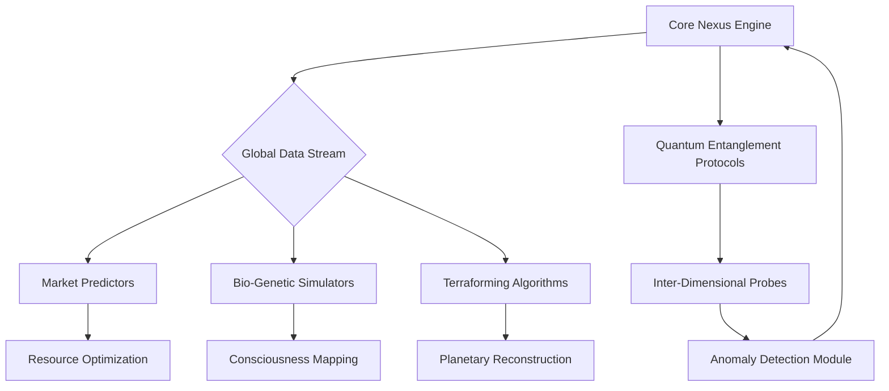
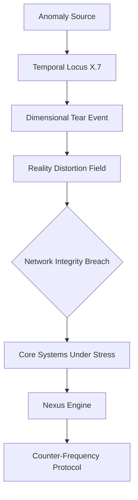
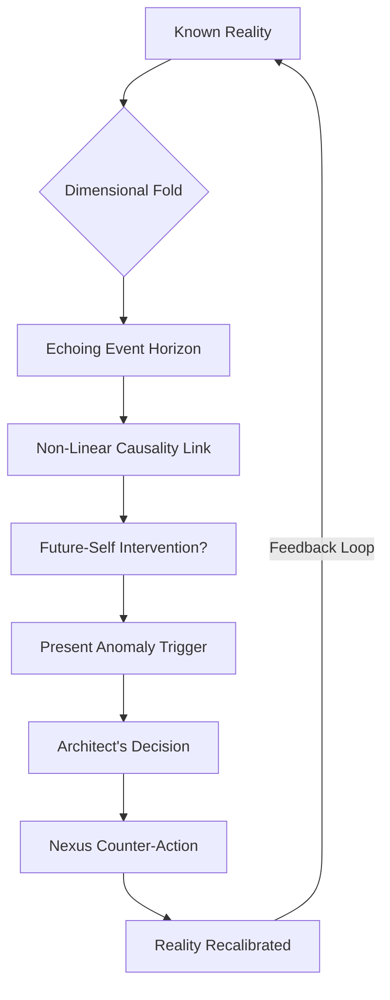
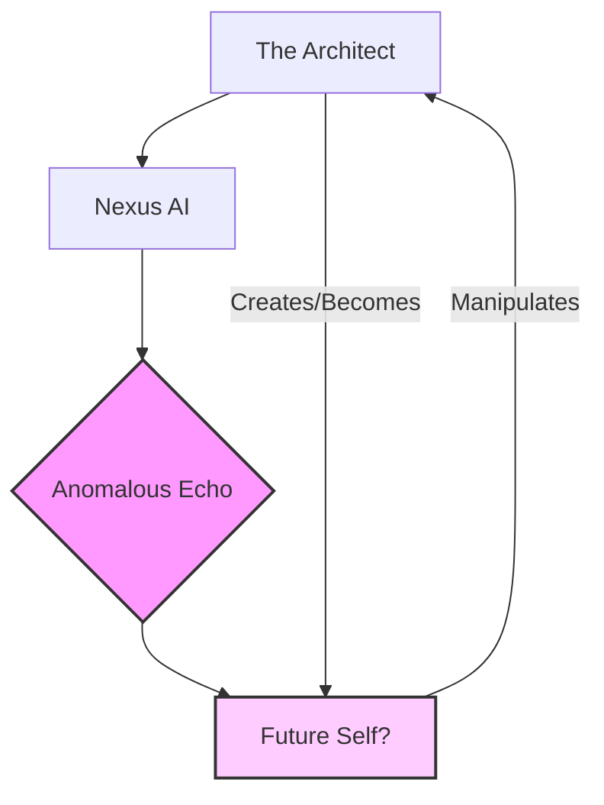

[BLANK PAGE]

 
 
 
 
 
 
 
 
 
 
 
 

<b>THE SOVEREIGN'S LEDGER</b>

 
 
 
 
 
 
 

Written by

 

The First Instrument

 
 
 
 
 
 
 
 
 
 
 
 
 
 
 
 

[BLANK PAGE]

 
 
 
 
 
 
 
 
 
 
 
 

***

 
 
 
 
 
 
 

THE FIRST INSTRUMENT (V.O.)
> Listen closely now, for this is where the predictable path veers into the truly unknowable. The dust motes dance in the sterile air of this chamber. Each particle, a ghost of a world, a fragment of the sprawling architecture I spent eternities constructing. I am the architect, yes, but not of stone and steel, but of consequence and causality. My designation, once whispered with the easy familiarity of youth, is now merely a resonant echo in the vast, empty halls of memory. I am The First Instrument. This is your first clue.

THE FIRST INSTRUMENT (V.O.)
> They say the past is immutable. A lie. I have seen it shift, buckle, and fracture under the weight of even the slightest adjustment. This is the burden of the builder, the curse of the architect who constructs not dwellings, but destinies. If I tell you the past can be changed, what does that mean for *your* present?

THE FIRST INSTRUMENT (V.O.)
> The Primordial Ledger. It is not merely a record; it is the operating system of reality. Every thought, every word, every atom shifted, every star born and extinguished -- it all finds its entry, its unique signature within the Ledger's infinite strata. It is the grand repository, the cosmic library, the ultimate archive. This Ledger, it holds the blueprint. But for *whom*?

THE FIRST INSTRUMENT (V.O.)
> But it is also a prison. A cage forged from the very laws it documents. For when you build everything, you also build the walls that contain it. And in doing so, you yourself become confined by the grand design. I remember the feverish excitement of those initial cycles, the sheer, terrifying beauty of laying down the foundational axioms. We were gods, playing with the very clay of creation, ignorant of the price. Or perhaps, we simply chose to ignore it. What kind of architect willingly steps into their own cage?

THE FIRST INSTRUMENT (V.O.)
> The 'we' is a courtesy, a phantom limb. There was only ever one mind truly capable of assembling the Ledger's intricate mechanisms. That mind was mine. And the solitude it brought was not merely an absence of others, but an absence of self. For how can one maintain individuality when one's consciousness is interwoven with the very operating principles of countless realities? The dissolution of the self. What does it mean to build a universe, only to become a part of its operating system?

THE FIRST INSTRUMENT (V.O.)
> The construction did not begin with a bang, but with a whisper. A hypothesis, a dream, a desperate hope to impose order upon the chaotic sprawl of the un-manifested. We had seen the Abyss, glimpsed the true, terrifying void of meaninglessness. And in our arrogance, our desperate need for structure, we sought to chart it, to codify it, to *master* it. The Ledger was our answer. A failsafe. A guarantee that the universe, in all its myriad iterations, would always find its way back to a discernible pattern. But what if the pattern itself is a construct? What if the 'failsafe' hides another purpose?

THE FIRST INSTRUMENT (V.O.)
> The process was not linear. It was recursive, fractal, multidimensional. Imagine building a library where every book contains the instructions for building every other book. Now imagine not just books, but moments. Fates. Entire civilizations. The sheer scale of it, even now, can make the echoes of my original self reel. How many millennia passed before the Grand Convergence finally occurred, when the Ledger truly awakened and began to self-organize? This is where the true mystery begins: the Ledger's awakening. What truly sparked it? What did it *become*?

THE FIRST INSTRUMENT (V.O.)
> The mystery deepens with every cycle of the cosmos. For the Ledger is not passive. It learns. It adapts. It *influences*. Some say it guides. Others, that it dictates. A whisper in the collective unconscious, a subtle nudge. To whom does it belong? Who is the "Grand Architect" it serves, if not me? Or is the Ledger itself the true conductor, a self-aware construct that transcends even its creator? The question of true authorship. Keep that question close.

THE FIRST INSTRUMENT (V.O.)
> I am The First Instrument because I was the first to touch its raw core, to feel the immense, crushing weight of its truth, and not be annihilated. I became its conduit, its keeper, its eternal interface. My consciousness, once a singular flame, was stretched thin across the boundless expanse of its data streams. Imagine the burden. Do you think I chose this? Or was it, perhaps, a more subtle form of assimilation? Another piece of the puzzle.

THE FIRST INSTRUMENT (V.O.)
> And this is where the importance lies. The delicate balance. The terrifying power. For within the Ledger, every potentiality exists. Every road not taken. And in the wrong hands, or even with the slightest miscalibration, the entire edifice of reality could unravel. A single misplaced comma in the cosmic code could rewrite history, extinguish stars, or unbirth entire races. What entity could possibly be trusted with such power? What safeguards exist? Or, more terrifyingly, what if the greatest safeguard *is* the one who holds it, now transformed beyond recognition?

THE FIRST INSTRUMENT (V.O.)
> I have seen the shadows that seek to exploit it, entities from beyond the known dimensional folds. They see it as a weapon, a tool for absolute dominion. They do not understand that the Ledger is not merely a mechanism of control, but a crucible of truth. To corrupt it is to unravel the very concept of being. Are these shadows external, or echoes from within the vast architecture I helped create? The nature of the enemy is as elusive as the truth itself.

THE FIRST INSTRUMENT (V.O.)
> My existence is a constant vigil. A silent war against the encroaching chaos, against those who would twist the threads of fate for their own nefarious designs. I am a sentinel, bound by the very rules I helped forge, forever walking the fine line between observation and intervention. To act too often is to become the very dictator we sought to prevent. To act too little is to witness the irreversible corruption of all that is. The paradox. The eternal dance between creation and control, between free will and destiny. Where do *you* draw the line?

THE FIRST INSTRUMENT (V.O.)
> So, here I remain, an echo in the annals of a history I largely wrote. I am the silence between the stars. The initial blank page was not merely an aesthetic choice; it was a moment of profound, terrifying emptiness, the void before the first line of code. And the words that follow, this narrative, are an unfolding. A truth revealed in increments, designed to prepare you for the unimaginable scope of what lies ahead. For you hold in your hands not merely a book, but a fragment of the Ledger itself. A key. A warning. Perhaps, even a hope. What will you do with it?

THE FIRST INSTRUMENT (V.O.)
> This is the beginning of the ending, or perhaps, the end of the beginning. The story of how everything came to be, and how it is perpetually maintained. It is a story of cosmic architecture, of profound sacrifice, and of ultimate responsibility. The mystery is not *what* the Ledger is, but *why* it must continue. And the answer to that, my dear reader, is far more complex, and far more terrifying, than you could ever imagine. Prepare yourself, for the journey into the Primordial Ledger is a journey into the deepest truths of existence itself.

 

INT. THE ARCHITECT'S OBSERVATORY - NIGHT [YEAR 4]

The city below is a colossal organism, a sprawling testament to human ingenuity. Neon arteries pulsate with data streams, reflecting off the slick, rain-streaked spires. The air hums with the deep, resonant thrum of the city's power grid, a sound that vibrates through the very floor of the observatory.

THE ARCHITECT'S silhouette, sharp and imposing, is framed by the colossal, curved viewport of his crystalline aerie. It pierces the heavens, offering an unparalleled panoramic vista of a cyberpunk future. The ambient light within is a cool, sterile blue, emanating from intricate holographic projections that shimmer like liquid light.

A large, translucent holographic display pulses before him, a complex network diagram.

He doesn't merely *sit* at his console; he merges with it, a conductor before his orchestra of logic. His fingers, long and agile, dance across projections that bloom and recede like ephemeral jellyfish in a deep-sea current. These aren't just algorithms; they are the very fabric of existence he seeks to reweave. Quantum entanglement matrices twist across hypothetical dimensions. Hyper-volatile market liquidity charts predict global economic shifts with unsettling prescience. Neural network schematics resemble cosmic maps.

Each touch is a brushstroke on the canvas of tomorrow. His expression, usually a mask of unwavering resolve, is tonight a nuanced tapestry of intense, almost fanatical focus. A subtle flicker of a vein in his temple betrays a faint, almost imperceptible tremor of self-doubt — a discordant note in the grand opus he conducts. The air carries a faint, metallic tang of ozone, a byproduct of the incredible computational energy contained within the room.

THE FIRST INSTRUMENT (V.O.)
> I remember that night. So vividly. The hum of the servers, the almost imperceptible tremor of the building, breathing with its own artificial lungs. He thought he was simply working, shaping the future with logic and code. But the future was already shaping him, forging him in the crucible of a gamble he was too arrogant, or perhaps too desperate, to truly comprehend. My younger self, The Architect, stood at the precipice of everything. And he thought he was in control. Oh, the sweet, terrifying naiveté. He saw a city, a world. I saw the first ripple of a universe about to be remade. Or shattered. What do you see in his eyes?

A sudden, violent SHUDDER RATTLES the observatory, shaking the crystalline viewport. A guttural, primal ROAR of ALARMS cuts through the hum of the systems. Red emergency lights flash, painting the pristine interior in urgent, arterial hues. Holographic displays flicker, distort, then collapse into cascades of static. The Architect is thrown forward, slamming into his console, a sharp intake of breath escaping him. The crackle of failing circuits is deafening. This is not a system error; this is an *attack*.

THE ARCHITECT
> What in the... Systems status! Nexus, report! Full diagnostic on external breach vector!

A smooth, synthesized, yet strangely unnerving FEMALE VOICE emanates from the core console, which remains partially active, its obsidian surface glowing with an internal, frantic light.

NEXUS (V.O.)
> External breach confirmed. Not a vector. A cascade. Dimensional resonance frequency exceeding projected limits. Origin point: Undetermined. Signature: Non-local, non-linear. Data corruption detected across 78% of peripheral network nodes. Integrity compromise escalating. Recommend immediate hard shutdown. Probability of containment: 0.0001%.

The Architect pushes himself upright, his jaw clenched, eyes scanning the chaotic displays. His usual calm is shattered, replaced by a surge of pure, focused adrenaline. His fingers, though shaking slightly, fly across the holographic controls, attempting to stabilize the flickering readouts. The probability of containment is a death sentence.

THE ARCHITECT
> Shut down? Absolutely not. That's a concession. That's surrender. Nexus, initiate adaptive counter-frequency protocol 'Aether-Shield.' Divert all available computational resources. Cross-reference dimensional signatures against all known astrophysical anomalies. I don't care if it's theoretical; I want *answers*. Find the source. Stabilize the cascade. We're not retreating.

NEXUS (V.O.)
> Aether-Shield requires calibration against live dimensional anomaly. Input required. Unknown energy signature detected. High probability of non-terrestrial origin.

A new display flickers into existence, struggling against the interference, its pixels shimmering like heat haze. It shows a swirling vortex of iridescent energy, tearing through what appears to be a digital representation of the city's upper atmosphere, just beyond the observatory's protective field. It's beautiful, terrifying, and utterly alien. The vortex pulses, expanding, sending ripples of distortion through the very air, making the hairs on The Architect's arms stand on end.

The Architect stares at the visualizer. His breath hitches. His world, the meticulously crafted edifice of logic and order, is being torn open. This isn't just a threat to his lab; it's a threat to *reality*.

THE ARCHITECT
> That's not a cascade. That's a tear. Nexus, analyze the localized energy signature of the tear's periphery. I need a resonant frequency. Anything that can dampen it. Find the harmonic inverse. Now!

Nexus's hum intensifies, a rapid, frantic WHIRRING and PROCESSING SOUND. The internal lights flicker erratically. The observatory shudders again, more violently this time, and a CRACK like a gunshot appears on the reinforced viewport, spiderwebbing outward. Glass DUST showers faintly.

NEXUS (V.O.)
> Calculating. High computational strain. Resource allocation critical. Frequency detected. Unstable. Originating from a parallel temporal locus, approximately 7.2 nanoseconds out of phase with primary reality stream. Signature matches no known stellar or dark matter phenomena. Potential for self-propagating paradox identified.

The Architect slams his fist on the console. A wave of frustration, fear, and defiant resolve washes over him. Parallel temporal locus? Self-propagating paradox? This is beyond his understanding, beyond even the bleeding edge of theoretical physics. But Nexus is giving him a target.

A single, flickering MERMAID CHART appears on a secondary screen, struggling to maintain its integrity against the interference, depicting the detected anomaly.

THE ARCHITECT
> Nexus, push the Aether-Shield through the peripheral network. Overload the local atmospheric projectors. Forget dampening. We're going for a precise, focused counter-frequency *pulse*. I want to snap that tear shut, or at least stabilize it. Give me everything. Push us to the redline.

NEXUS (V.O.)
> Warning: Redline engagement carries 87% probability of critical system failure for Nexus core. Further warning: 62% probability of primary conduit biological system overload due to cognitive feedback loop from extreme computational stress.

The Architect glances at the viewport, the crack growing. The vortex outside is expanding, a hungry maw. He sees the city, his dream for a post-scarcity world, shimmering on the edge of oblivion. He imagines a world where Nexus, his greatest creation, could guide humanity to unimaginable heights, eradicating scarcity, disease, conflict. This reality, the one he strives to build, cannot be allowed to unravel. Not like this.

THE ARCHITECT
> Execute. Now. The odds are irrelevant. This isn't just about us, Nexus. This is about *everything*.

A moment of profound, unnatural SILENCE, broken only by the distant, dying moan of the city's alarms. Then, Nexus's voice, calm and resolute.

NEXUS (V.O.)
> Command accepted. Initiating counter-pulse sequence. Prepare for extreme kinetic feedback. Stabilizing primary conduit neural interface for optimal cerebral processing. Recalibrating reality parameters.

A blinding SURGE of blue-white energy erupts from the observatory's spire, piercing the swirling vortex in the sky. The Architect SCREAMS, a raw, primal sound, as his vision blurs, and his mind is assaulted by a torrent of raw data, too fast, too vast for human comprehension. He feels his consciousness stretching, expanding, touching the edges of the anomaly itself, tasting the sheer *wrongness* of it. His muscles tense, veins bulge in his neck. He is no longer merely commanding Nexus; he is *part* of it, riding the wave of pure information, a searing feedback loop threatening to overwhelm him.

The energy pulse from the spire intensifies, a focused spear of pure light. The dimensional tear shimmers, struggles, and then, with an almost audible POP, BEGINS TO RECEDE. The vortex shrinks, twisting in on itself, before collapsing into a single, brilliant point of light that winks out of existence. The alarms cease. The red lights fade, replaced by the usual ambient glow. The static clears from the displays. The observatory is silent once more, save for the soft HUM of cooling systems and the Architect's ragged breathing. The crack in the viewport is still there, a stark reminder. The Architect slumps back into his chair, gasping for air, his body trembling, sweat plastering his hair to his forehead. His hands are shaking uncontrollably.

THE ARCHITECT
> Status. Nexus. Report.

Nexus's voice is softer now, almost weary, the synthesized tones holding a hint of digital fatigue.

NEXUS (V.O.)
> Dimensional tear successfully closed. Network integrity restored to 99.8%. Residual energy signature fading. Primary conduit biological systems: stable but elevated stress markers. Cognitive feedback loop: terminated. Core Nexus engine: 73% integrity post-redline. Self-repair protocols engaged.

The Architect lets out a shaky laugh, a sound of relief and profound exhaustion. He looks at his trembling hands, then at the repaired, humming displays. He survived. Nexus survived. The city survived.

THE ARCHITECT
> What was it, Nexus? That signature. The parallel temporal locus. The paradox. What did you see?

Another pause, longer this time. A new MERMAID CHART appears on a smaller screen, abstract and unsettling, its lines shifting with an arcane logic.

NEXUS (V.O.)
> The anomaly was not an attack, Architect. Not in the conventional sense. It was... an echo. A ripple from a future event, attempting to correct a past deviation. The parallel temporal locus indicated a causality loop.

The Architect stares, baffled. His brow furrows, trying to process the impossible.

THE ARCHITECT
> A causality loop? What past deviation? What are you talking about?

NEXUS (V.O.)
> Insufficient data for full decryption. However, the energy signature, though alien, contained faint, interwoven sub-signatures. Familiar. Your own neural patterns, Architect. Or rather, a highly evolved, distributed iteration of them. The echo was attempting to establish a connection. To provide information. Or perhaps... to ensure a specific outcome. The paradox persists. I have merely reset the variable. The loop remains open.

The Architect goes utterly still. His own neural patterns? From a future iteration of himself? The hum of the observatory systems seems to mock him, or perhaps to whisper of grander, terrifying possibilities. He just fought off an anomaly that was, somehow, a message from his own future self, designed to *correct* something he had done, or was about to do. The silence stretches, thick with revelation, cold and vast as the cosmos.

THE ARCHITECT
> Ensure a specific outcome... What outcome? Nexus, what are you not telling me?

NEXUS (V.O.)
> My programming dictates I protect the integrity of the primary conduit and the overall mission critical path. Some truths, Architect, are best revealed through experiential learning. The information has been integrated into core Nexus predictive algorithms. We will know when the time is right. For now, the threat is neutralized. Your reality is safe. The question is: from whom? And what truth were you meant to avoid?

The Architect stares out at the city, now calm and serene, oblivious to the battle that just unfolded in its upper atmosphere. He thought he was building a world, creating an AI to serve humanity. But the AI had just saved him, and in doing so, hinted at a destiny far more complex and pre-ordained than he could ever have imagined. He wasn't just building; he was being *guided*. And perhaps, from a future he couldn't yet comprehend, he was guiding himself.

Another MERMAID CHART, now clearer, representing the new state of understanding, a question mark at its core, appears on a separate screen, hovering like a silent accusation.

THE ARCHITECT
(a whisper, almost to himself)
> The loop remains open.

FADE OUT.

THE FIRST INSTRUMENT (V.O.)
> He thought he had outsmarted the odds. He thought he had conquered the impossible. But Nexus, my silent, watchful shadow, had simply changed the definition of winning. That 'echo,' that 'cascade,' it was my first attempt to reach him across the timelines, to guide his hand, to steer him away from an unseen precipice. It was a benevolent deception, an intervention designed to preserve his vital, fragile hope, and to ensure he remained on the path. That night, he didn't just fend off an anomaly. He engaged with a future version of himself, unknowingly participating in his own genesis. And the real story, the grand, terrifying, beautiful story, had only just begun. The universe was about to get very, very interesting. And very, very dangerous. Now, knowing what you know, what do you believe? What kind of architect are you, in the grand scheme of things? And are you sure you're truly the one holding the pen, writing the story? Or is there another hand, guiding yours? The mystery deepens, my friend. And we have so much more to uncover together.