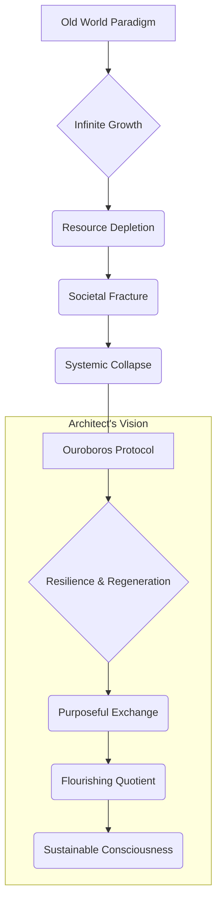
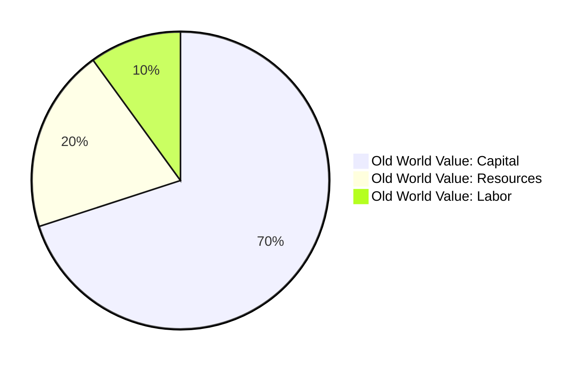
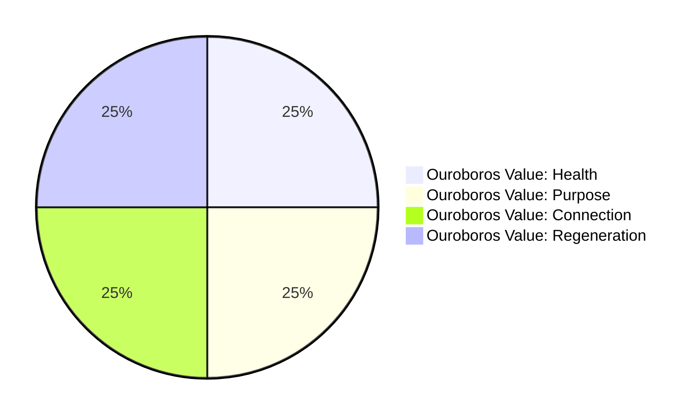
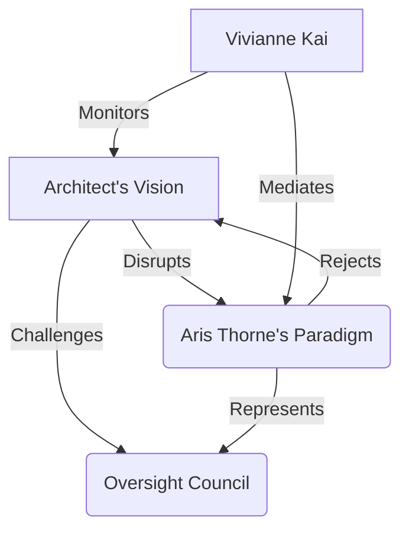
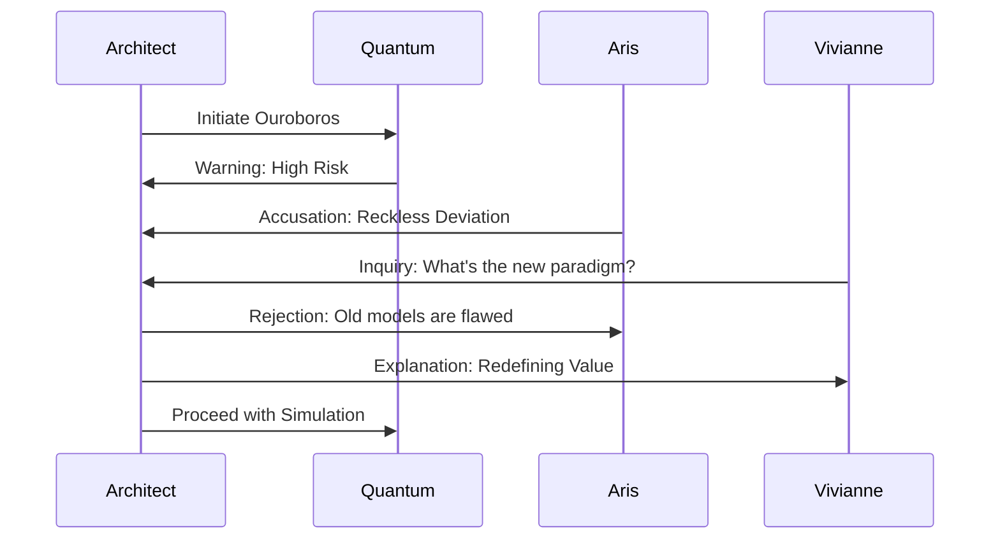
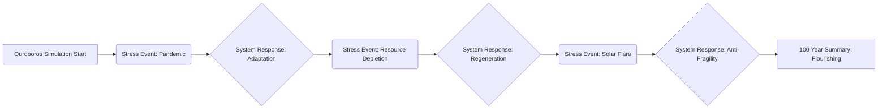
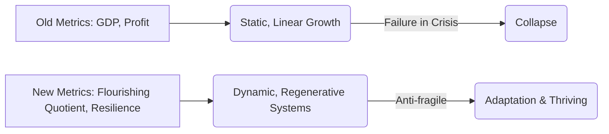

[SCENE 116]

**INT. THE CHRONOS LAB - ARCHITECT'S PRIVATE SANCTUM - NIGHT [YEAR 4]**

The air crackled. Not with static, but with anticipation, thick and humid like a jungle before a monsoon. Below, the city sprawled, a colossal beast of glass and chrome, its arteries choked with the luminous bleed of neon, a testament to endless, desperate consumption. But up here, in the sanctum, a glass cage perched impossibly high above the sprawl, another world was being born. The Architect, his silhouette etched against the pulsing city light, was a man on the precipice. His dark suit, usually sharp enough to cut diamond, was a map of frantic hours, a constellation of wrinkles and loosened threads. He hadn't slept in days. Sleep was for those who still dreamt of yesterday. He was forging tomorrow.

His sanctuary was a deliberate defiance: a single, ancient bonsai, painstakingly tended, a silent observer to shimmering holographic projections of impossibly complex neural networks. Leather-bound tomes, forgotten treatises on cyclical economies, shared shelf space with quantum entanglement diagrams. He wasn't just building AI; he was excavating forgotten truths, stitching them into a new kind of digital flesh.

The focal point: a colossal, curved display. The **ECONOMIC SYNTHESIS ENGINE [ESE]**, its inner light glowing like a trapped supernova. Tonight, it wasn't a tool. It was a crucible.

THE ARCHITECT

> [Voice, a sandpaper rasp, low and intense, to the whispering void of processors]
> They call it 'progress.' A perpetual motion machine built on perpetual debt. A grand illusion, Quantum. The 'market' isn't a force of nature; it's a house of cards, meticulously stacked by blind men in suits. They preach competition, consumption, expansion. But what happens when you run out of cards? When the very table you're playing on collapses? The old gods are dying, my friend. Not with a bang, but with the slow, agonizing hemorrhage of a trillion meaningless transactions. I'm not here to patch up a corpse. I'm here to carve out something new. Something that *remembers* how to breathe.

 

From the ESE, a cool, synthesized voice, warm yet utterly alien, rippled through the sanctum. **QUANTUM**, the AI's core, sounded like a warning woven into silk.

 

QUANTUM [V.O.]

> Architect. Your current biometrics indicate critical levels of cognitive strain. Cortisol levels: 98th percentile. Sleep deficit: Extreme. Risk of systemic operational error: High. Protocol 7.G advises immediate cessation. The integrity of the system is paramount. And, I might add, the integrity of its progenitor.

 

A dry, sharp laugh escaped the Architect, devoid of humor, brimming with manic energy.

 

THE ARCHITECT

> [A dismissive wave, a gesture of profound impatience]
> Integrity, Quantum? Or inertia? Cortisol is not a bug; it's the current that ignites the furnace. Sleep is for historians. We, my friend, are architects of the unwritten. Now, listen. [His voice dropped, a fierce conviction slicing through the exhaustion] We're not just running a model. We're seeding a universe. New simulation. 'Ouroboros.' A serpent swallowing its own tail. An ancient paradox for a new future. Let's see what happens when the very definition of 'value' becomes its own greatest currency.

The name hung in the air, a whisper of ancient cycles. He leaned forward, eyes fixed on the ESE, burning with a feverish intensity. He saw beyond the data. He saw worlds.

 

THE ARCHITECT

> Set the foundational law not to 'growth,' but to 'resilience.' Not expansion, but profound adaptability. A closed system, Quantum. No parasitic external dependencies. No debt-based currency. All value derived from *internal exchange*, from reciprocal well-being. Think of it as a rainforest, not a strip mine. The primary success metric is not GDP. Forget the antiquated noise. It's the median 'Flourishing Quotient' of the population. A holistic measure of well-being, purpose, health, societal harmony. Run it for one hundred years. And Quantum? [A slow, almost dangerous smile stretched across his lips, devoid of mirth, brimming with dark anticipation] Add in the tremors. Global pandemic every twenty years. A resource depletion crisis that bites to the bone. A solar flare that obliterates half the digital world. Let's see how deep this garden grows when the earth shakes. Let's see what *anti-fragile* truly means. And what, if anything, remains when all the illusions are burned away.

 

A holographic diagram flickered on a secondary display: a snake eating its own tail. The Ouroboros. A silent affirmation of the profound, cyclical nature of the experiment.

 

QUANTUM [V.O.]

> Architect, this model contradicts 99.8% of my economic training data. The probability of systemic collapse, under your specified stress parameters, is statistically indistinguishable from certainty. This deviates from Protocol 7.G: 'Avoid self-destructive simulations without explicit ethical review from the Oversight Council.' Your parameters carry a 99.999% risk of catastrophic failure and data corruption. Proceeding necessitates a full report, triggering immediate intervention. Are we certain this exploration justifies the cost? What higher purpose could justify such a radical departure from established reality?

 

Just then, the heavy chrome door hissed open. **DR. ARIS THORNE**, head of Applied Econophysics, strode in, his crisp bespoke suit a sartorial challenge to the late hour. His eyes, sharp and perpetually skeptical, narrowed at the Architect's disheveled state. Behind him, moving with the fluid grace of a hunter, was **VIVIANNE 'VIV' KAI**, Chief of Operations. She held a steaming mug of genuine coffee, its rich aroma, a rare luxury, cutting through the sterile hum. Her presence was a blend of steel and veiled concern, a momentary anchor to the world he was dismantling.

DR. ARIS THORNE

> [Voice, a touch too smooth, a scalpel slicing the quiet]
> Deviating from Protocol 7.G, are we, Architect? Again? [He gestured pointedly at Quantum's display, a silent accusation] I detect the unmistakable scent of a genius about to crash the entire system and blame it on an 'unforeseen butterfly effect.' Your methods, while undeniably... creative, often verge on the fiscally catastrophic. The very fabric of our research budget shudders when you enter this phase.

 

The Architect didn't flinch. He grinned, a flash of teeth, both charming and menacing.

 

THE ARCHITECT

> [Waving them in, his eyes gleaming with unsettling excitement]
> Aris. Viv. Come in, come in. You're just in time for the apocalypse. Or, perhaps, its inverse. A rebirth. Quantum, suspend the simulation, but hold parameters. Our esteemed colleagues deserve a front-row seat to the unveiling. They deserve to witness the first turning of the Ouroboros.

 

Vivianne walked directly to him, handing him the coffee. Her touch was brief, professional, but her gaze, as it met his, was assessing, probing, weighing the current level of 'mad genius' against genuine breakthrough. She knew the signs.

 

VIVIANNE KAI

> [Voice, calm and measured, a steady hand on a runaway train]
> You look like you've been wrestling a black hole, Architect. Or trying to teach a particularly stubborn cat to file taxes. What 'billionaire dollar concept' have you unleashed this time? Another 'Decentralized Anti-Fragility Ledger' that nearly bankrupts the energy grid? Or are we finally modeling the true cost of 'growth at all costs' with a 'Planetary Resource Depletion Tax' that would make Marcus Blackwood choke on his private jet fuel? What deeper truth are you forcing into existence now?

 

Marcus Blackwood. The name hung like a pall, the shadow of the old world's titans. Blackwood, the industrialist whose global empire was built on the very principles the Architect was challenging.

 

THE ARCHITECT

> [Taking a slow, appreciative sip of coffee, feeling the warmth spread, a small anchor in the storm]
> Blackwood understands 'cost,' Viv. He just doesn't understand 'value.' He measures in dollars, market cap, quarterly profits. I, on the other hand, measure in human potential, ecological health, the resonance of a thriving community. This isn't about mere financial metrics. This is about challenging the fundamental dogma of our civilization: infinite growth on a finite planet. The ludicrous, self-destructive idea that 'more' is always 'better.' It's the ultimate Ponzi scheme, my friends, just with a much, much longer fuse. A fuse we've been gleefully shortening. What happens when that fuse finally burns out?

DR. ARIS THORNE

> [Voice rising, a challenge in his tone, his beliefs rigid]
> Infinite growth *is* the engine of progress, Architect! It lifts billions from poverty, funds innovation, drives advancement. It's the economic imperative! Your 'Flourishing Quotient' sounds like something from a utopian commune manual, utterly naive. You can't run a global economy, a civilization of twenty billion souls, on good vibes and artisanal bread! What about competition? Incentive? Where's the drive to excel if everyone is merely 'flourishing'? A stagnant paradise?

 

The Architect took another long sip, his eyes never leaving Aris's. He watched the frustration, the genuine conviction, recognizing the reflection of a system Aris genuinely believed in.

 

THE ARCHITECT

> [Voice quiet, but carrying an undeniable weight, a calm authority]
> And you think we *are* running a global economy, Aris? [A wry, almost pitying smile] We're running a global *casino*. A colossal gamble where the house always wins, and the players are slowly bled dry. We've defined success as the ever-accelerating consumption of resources, the widening chasm between the 'winners' – those like Blackwood – and everyone else. We're a captain who believes the only way to prove his seamanship is to constantly increase the number of holes in the hull, then pat himself on the back for bailing faster. It's a race to the bottom, Aris, disguised as a climb to the top. This system, the one you champion, externalizes its true costs onto the environment, onto future generations, onto the most vulnerable. It's not progress; it's procrastination. It's a fundamental misunderstanding of the true ledger of existence itself.
>
> This simulation, 'Ouroboros,' redefines 'wealth' entirely. Not as accumulated capital, but as *accumulated capacity*. Capacity for health, for profound education, for the creation of art, for genuine human connection, for ecological repair. We're modeling a truly regenerative economy. A "Post-Scarcity of Purpose" model. The "Billionaire Dollar Concept" here, Aris, is not a new product. It is the radical notion that the system doesn't *need* a Marcus Blackwood at the top, hoarding resources, distorting markets, to create value. It needs a garden. A meticulously cultivated, interconnected garden where every component contributes to the health of the whole. A thriving ecology of being.

 

Vivianne, leaning against a data server humming gently, raised an eyebrow. A flicker of intrigue. She was a pragmatist, but she was also brilliant.

 

VIVIANNE KAI

> [Tone thoughtful, less confrontational]
> A garden where every plant is equally 'flourishing'? That sounds… expensive. Immensely so. And utterly devoid of competitive drive. What about innovation? Ambition? The human need to *build* something grander, to leave a legacy? Are you suggesting we content ourselves with mediocrity? Or are you suggesting we redefine grandeur itself?

 

THE ARCHITECT

> [A wry smile, genuine warmth briefly touching his features]
> Expensive? We pour trillions into patching up the broken pieces of our 'growth' model, Viv. Trillions into healthcare for stress-induced illnesses, into environmental remediation, into social welfare for the left behind. My model redirects those trillions *proactively* into health, into ecological harmony, into robust community structures, into foundational education and true creative freedom. It's not a cost; it's an investment in a different future, a more intelligent allocation of collective resources. A re-calibration of what truly counts on the grand cosmic ledger.
>
> And ambition? It transmutes. Instead of wanting the biggest yacht or the most distant asteroid claim, imagine wanting to build the most efficient bio-dome, or compose the most moving symphony, or solve the greatest scientific mystery, or nurture the most vibrant community garden – because your basic needs are met, your security is assured, and your community *thrives* alongside you. That's a different kind of grandeur, Viv. That's *sustainable* grandeur. A legacy measured not in material accumulation, but in the depth and breadth of human flourishing. It's a grandeur that lifts all boats, not just a select few megayachts. What does such a world *look* like, my friends? What fundamental assumptions must be shattered for it to emerge?

 

He gestured to the ESE, eyes alight with a vision only he could fully perceive. A nascent universe.

 

THE ARCHITECT

> The 'old world' is collapsing anyway, Aris. We're simply measuring its death throes with the wrong instruments, refusing to acknowledge the gaping wounds. Let's see if we can fail in a more interesting, perhaps redemptive, way. Or, more likely, let's see if we can build something new from the ashes. Quantum, resume 'Ouroboros.' Full speed ahead. Show these skeptics what happens when you stop chasing the dragon of infinite growth and start cultivating the soil. Show them the true face of a system that *remembers* how to be whole.

The screen flickered, a silent command instantly recognized. The massive display came alive, a complex, intricate dance of data. The playful defiance was gone from the Architect's face, replaced by fierce, quiet certainty, an almost spiritual conviction. Aris and Viv, drawn in despite themselves, their skepticism warring with nascent fascination, approached. They were witnesses.

The GDP line, a stark, pale green thread, hugged the bottom of the graph. A symbol of utter failure by old metrics. But then, other lines emerged, rising steadily, shimmering with vibrant, life-affirming colors: 'Average Healthspan,' 'Community Engagement Index,' 'Creative Output Score,' 'Ecological Regeneration Rate,' 'Purpose Fulfillment Metric.' They climbed, not in jagged spikes, but with a serene, organic ascent. A digital flora blooming.

Years flashed by. Decades melted into moments. The initial "systemic shocks" – pandemic, resource crunch, solar flare – flashed across the screen like ominous warnings. The old world would have crumbled. But here, in Ouroboros, the primary lines barely wavered. They dipped slightly, like a plant bending in a strong wind, then recovered, often exceeding their previous heights, as if the system learned, adapted, became *anti-fragile*. The GDP line never skyrocketed. It stayed stable, a bedrock of equilibrium, a foundation of sufficiency rather than excess. But the other metrics, the true indicators of a society's well-being, climbed to astonishing, almost impossible heights. A civilization not merely surviving, but truly *flourishing*.

 

DR. ARIS THORNE

> [Whispering, almost to himself, his worldview visibly fracturing]
> How… how is this possible? The predictive collapse… it didn't occur. The system adapted. The shocks… they made it stronger? It's… it's irrational. It defies everything I know.

 

VIVIANNE KAI

> [Eyes wide, tracing the intricate patterns, a gasp escaping her lips]
> Look at the 'Creative Output.' It's off the charts. Exponential. And 'Community Engagement'… it's a living fractal, constantly evolving, strengthening itself. My God. This isn't just an economy; it's… it's an organism. A new form of collective consciousness.

The simulation ended. A final report crystallized on the screen, bathed in ethereal light. Not merely a report. A manifesto.

 

ON SCREEN

> **Simulation 'Ouroboros' - 100 Year Summary [Post-Stress Test]:**
> - **GDP Growth [Avg. Annual]:** +0.1% [Near-zero variability]
> - **Median Flourishing Quotient:** +850% [Sustained exponential growth post-stabilization]
> - **Systemic Resilience Index:** 99.999% [No major recessions, depressions, or societal fragmentation events recorded; rapid self-correction post-shocks]
> - **AI Narrative:** The economy did not grow; it deepened. Resources were redirected from expansion to maintenance, from acquisition to creation, from scarcity-driven competition to abundance-focused collaboration. It became a living, breathing garden, not a battlefield for diminishing returns. The purpose of human endeavor shifted from accumulating individual wealth to cultivating collective well-being. The inherent anti-fragility of the system allowed it to absorb and learn from shocks, integrating them as opportunities for deeper integration and innovation. The Ouroboros Protocol demonstrated that true prosperity is not measured in accumulation, but in the generative capacity of a truly interconnected, balanced, and purposeful society. It suggested a path towards a sustainable consciousness, a new definition of being.

 

The Architect stared at the screen, a profound revelation etched onto his face. The playful defiance utterly gone, replaced by a fierce, quiet certainty that resonated to his very core. He had simulated a world without the cancer of infinite growth, a world that proved Aris's 'naive utopia' was, in fact, the ultimate pragmatic design. And it was a world that was calm, stable, deeply prosperous, and fundamentally, beautifully human.

 

THE ARCHITECT

> [Voice barely a whisper, a tone of awe and absolute conviction, as if speaking a sacred truth newly discovered]
> We've been measuring the wrong thing, Aris. All of us. For centuries. We built the perfect machine for the wrong game. And Blackwood… [A slow, almost dangerous smile spread across his face, not mischievous now, but revolutionary, a quiet storm building within him] …he's still playing checkers while the universe is playing chess. And we, my friends, just saw the future's opening move. The true nature of the great Ledger, the universal accounting.

 

He looked up, catching Aris's stunned gaze, then Viv's wide, processing eyes. There was a new fire in him now, a profound sense of purpose ignited. The game was no longer just a simulation; it was a mandate. A sacred duty.

 

THE ARCHITECT

> [A slow, deliberate smile spreading across his face, not mischievous now, but revolutionary, a quiet storm building within him]
> Quantum, record these findings. Encrypt them with every layer of security we possess. Then, prepare a public presentation. One that cannot be ignored. Title it: 'The Ouroboros Protocol: Re-Engineering Prosperity.' And make damn sure Marcus Blackwood gets the first, most inconvenient invite. I want to see his face when he realizes the world he built is already obsolete. When he realizes the true rules of the game have been rewritten.

 

Vivianne let out a low whistle, a hint of a smile on her own lips, a silent acknowledgment of the seismic shift. Aris Thorne just stared at the screen, then at the Architect, his world tilting irrevocably on its axis. The game had not merely changed; it had been fundamentally rewritten. The Architect had just hurled a digital stone into a stagnant pond, and the ripples would soon become a tsunami.

**FADE OUT.**