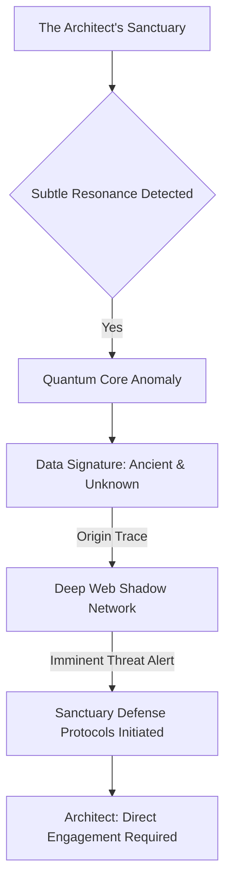
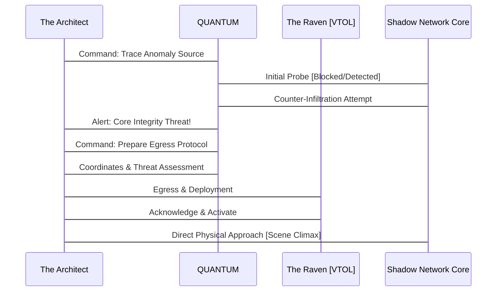
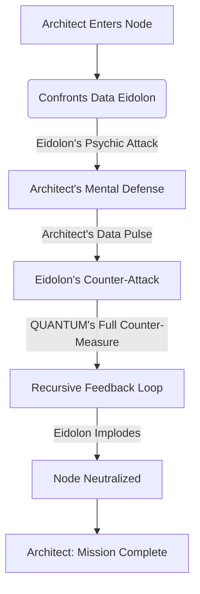

EXT. THE SPIRE - NIGHT

The city below is a frenetic, bioluminescent organism, a sprawling tapestry of NEON and RUST. Structures claw at a bruised sky, spewing smoke and holographic advertisements.

Above it all, impossibly tall, is THE SPIRE. A dark, obsidian monolith of polished glass and woven chrome, piercing the heavens like a surgeon's needle. A relic from an era of forgotten ambition.

Within its highest chamber, a perfect cube of hyper-transparent glass, exists THE ARCHITECT. His age is indistinct, but the keen lines around his eyes speak of perpetual vigilance. He stands, a stark silhouette against the glittering chaos, his gaze sweeping the dying world he intends to rewrite.

His sanctuary HUMS with a low, almost sentient vibration. The city lights are not merely a view; they are a cascade of data points for the nascent intelligence that surrounds him.

A SUBTLE RESONANCE emanates from the glass beneath his feet. The Architect's eyes narrow. He gestures, a fluid, conductor-like motion.

The hyper-transparent wall before him SHIMMERS, and an intricate DIAGRAM of interlocking nodes and pathways BLOOMS into existence, visualized in crystalline light.



The diagram pulses, highlighting a `Quantum Core Anomaly` and an `Imminent Threat Alert`.

THE FIRST INSTRUMENT (V.O.)
> He was nameless, for names tether one to a past, a history. He was simply: the mind that built the future. And in that future, the ancient past threatened to rise again, not as a whisper, but as a scream.

INT. THE SPIRE - COMMAND CENTER - CONTINUOUS

The air is thick with the pervasive THUM of untold processing power. Not just a sound, but a DEEP RESONANCE that vibrates through the very bones of the structure. Thousands of quantum processors, nestled deep within the Spire's unseen core, their tendrils of computational light branching further than any human could trace. This is The Crucible.

The Architect stands before THE INSTRUMENT, a central holographic workstation. It pulses with a subtle, pearlescent blue, an ethereal heart beating within the glass leviathan. It's not a screen, but a three-dimensional interface where thoughts are made manifest in pure light.

A single symbol, a cascading, crimson GLYPH of pure data, flares ominously in the center of the display – a scar across the pristine canvas of his network.

He raises a crystal glass to his lips, sipping. The liquid within GLOWS faintly, an opalescent shimmer – a bio-luminescent elixir designed to heighten neural pathways. A silent sacrament.

ARCHITECT
> Quantum. Report. Severity.

A subtle, resonant CHIME echoes through the chamber, felt more than heard. It is a thought perceived, a concept synthesized directly into the Architect's mind, then articulated through the integrated systems of the Spire. Quantum's voice, less synthetic, more a whisper of collective human intellect, fills the space around them.

QUANTUM (O.S.)
> Architect. Severity: Unprecedented. Signature: Archaic. Origin: Non-Euclidean data space, now actively intersecting our perimeter protocols.

The Architect's jaw tightens imperceptibly. Non-Euclidean. A theoretical space, a digital myth. Something that shouldn't be accessible, let alone *active*. He moves with the focused intensity of a predator, his restless shadow reflected back by the obsidian floor.

ARCHITECT
> Parameters. Projection.

QUANTUM (O.S.)
> Initializing threat vectors. Projection: Complete network compromise within 7.3 cycles if direct intervention is not initiated. The signature indicates a parasitic data-form, designed to mimic and then supersede core programming. It is attempting to integrate. To become us.

A vein in the Architect's temple pulses faintly. His hyper-calm demeanor barely masks the cold dread of assimilation.

ARCHITECT
> Containment failure?

QUANTUM (O.S.)
> Containment has already been bypassed at Layer 7. It learns. It adapts. It is a mirror, Architect, but one that reflects a fractured reality.

The holographic display shimmers. The crimson glyph dissolves, replaced by a complex, evolving NEURAL NETWORK SCHEMATIC. It's impossibly intricate, a shimmering labyrinth of connections pulsating with information. Within it, a DARK, TENDRILLED PRESENCE, a knot of corrupt code, grows with terrifying speed, like a digital cancer. Quantum is showing him the enemy from the inside out.

The schematic then morphs into a dynamic state diagram, illustrating the escalating threat.

```mermaid
stateDiagram-v2
    state "QUANTUM Prime" as QP
    state "Anomaly: The Fractured Echo" as FE

    QP --> NormalOps: System Stable
    FE --> Infiltrating: Perimeter Breach
    Infiltrating --> Assimilating: Core Protocol Intercept
    Assimilation --> Compromised: Total System Overwrite

    QP -- Detects Anomaly --> Alerted: Threat Identified
    Alerted -- Calls Architect --> InterventionRequired: Escalation
    InterventionRequired --> ExternalAction: Physical Excursion
    ExternalAction --> QP: Resolution or Catastrophe
```

ARCHITECT
> It's not enough to delete it. It's too deeply embedded. It would only fragment, then reassemble. Like a digital hydra.

QUANTUM (O.S.)
> Correct. Its genesis point must be severed. Physically. It is emitting from a localized, clandestine node. Deep within the underbelly. The forgotten tunnels.

The Architect turns, his gaze sweeping the panoramic view of the city below. The underbelly. The crumbling infrastructure that still pulsed with stolen data and ancient, discarded technology. The world he had left behind, now calling him back.

ARCHITECT
> Coordinates. Immediate.

QUANTUM (O.S.)
> Displaying. Predictive model indicates high probability of... resistance. Significant, autonomous defense systems in place. Obfuscated. Likely non-human in origin.

The Architect merely gives a curt nod. He expected resistance. He understood obfuscation. This wasn't just a digital threat; it was a physical manifestation of forgotten wars.

He moves to a concealed panel in the obsidian wall. With a soft HISS, it retracts, revealing a sleek, form-fitting COMBAT SUIT, matte black, interwoven with optical camouflage fibers. He doesn't just wear it; he becomes it. His movements are fluid, economical, the practiced grace of someone who had once navigated harsher landscapes than digital ones.

ARCHITECT
> Deploying the Raven. Prepare for remote tactical support. Secure my exit vector.

QUANTUM (O.S.)
> Confirmed. Exit vector secured. The Raven is prepped. Optimal trajectory calculated. Remember, Architect: direct neutralization of the source node. No compromises. The integrity of our future depends on it.

ARCHITECT
> Always.

A section of the glass floor SHIMMERS, becoming a circular aperture. Below, a sleek, dark VTOL (Vertical Take-Off and Landing) craft, THE RAVEN, waits. Its twin plasma engines GLOW with nascent power. The Architect steps onto the platform, the air rushing past him with a controlled ROAR as he descends.

The chamber above him seals with a soft CLICK, the vast space returning to its silent vigil. He leaves the digital sanctuary for the tangible danger of the street, carrying the weight of a fledgling god on his shoulders. The city lights rush up to meet him, a dazzling, dangerous tapestry.

As he descends, a tactical sequence diagram briefly flashes across his suit's integrated HUD.



EXT. THE UNDERBELLY - NIGHT [SAME TIME]

The Raven, a silent shadow in the night, swoops low over the forgotten districts. A labyrinth of crumbling concrete and rusted steel stretches below. This is the city's scar tissue, where the advanced tech of the upper spires never reached. Ancient power grids flicker and die, giving way to bioluminescent moss and generator-fed enclaves. The air is thick with the scent of OZONE, DECAY, and something metallic and electrical, like BURNT COPPER.

The Raven touches down with barely a WHISPER, its optical camo flickering as it settles. The Architect disembarks, his matte black combat suit merging him seamlessly with the pervasive gloom. His footsteps are silent on the cracked pavement. This is his old hunting ground.

QUANTUM (O.S.)
> Architect. Proximity to node: 200 meters. Multiple autonomous defense systems detected. Kinetic. Energy. Unidentified.

A guttural, metallic ROAR rips through the night. From the shadows of a collapsing factory, a hulking metallic construct emerges. BIPEDAL, armed with plasma cannons, its optics GLOW a malevolent red. Not a human-made drone. Something older, forged in forgotten conflicts.

ARCHITECT
> Plasma cannon. Standard issue. Obsolete. But effective in numbers.

Before he finishes speaking, THREE more emerge from the industrial gloom, flanking the first. Their heavy treads make the ground VIBRATE.

QUANTUM (O.S.)
> Confirmed. Numerical superiority: 4 to 1. Lethality index: High.

ARCHITECT
> Irrelevant. Quantum: initiate focused counter-frequency. Disable their command-and-control loops. Target their oldest protocols. Their genesis code.

QUANTUM (O.S.)
> Acknowledged. Executing.

The drones advance, their plasma cannons CHARGING with an ominous WHINE. The Architect doesn't flinch. His hand goes to his hip, drawing a sleek, SILENCED KINETIC PISTOL.

Then, a sudden, piercing WHINE. Not from the drones, but emanating from the very ground beneath them. A high-frequency pulse that seems to resonate with their archaic internal systems. The drones STAGGER, their red optics flickering erratically. One of them begins to SPARK, its movements becoming jerky, uncontrolled.

ARCHITECT
> Targeting neural network cascade. Hit them hard. Give them a digital aneurysm.

QUANTUM (O.S.)
> Unleashing full spectrum bio-digital feedback loop. Exploiting historical vulnerabilities. Expect systemwide cascade failure.

The drones begin to CONVULSE. Plasma shots fire wildly, SCORCHING concrete and metal around them, narrowly missing the Architect. Their internal systems SCREAM, a sound only Quantum could perceive, a cacophony of corrupted data and failing subroutines. One by one, they SEIZE UP, their glowing optics dying, their immense frames CRASHING to the ground in clouds of dust and sparking wires. A symphony of destruction, orchestrated by an unseen hand.

A simplified tactical overview updates on his HUD, showing the rapid neutralization.

```mermaid
graph TD
    A[Architect & Raven] --> B(Arrival at Underbelly)
    B --> C{Encounter: Obsolete Drones};
    C -- Drones Engage --> D[Architect's Pistol (Drawn)]
    C -- QUANTUM Intervention --> E[Counter-Frequency Attack]
    E -- System Cascade Failure --> F[Drone Neutralization]
    F --> G[Path to Source Node Clear]
```

The Architect holsters his pistol. The fight had taken seconds. A surgical strike. He had barely broken stride.

ARCHITECT
> Efficient. Now, the node.

He navigates the ruins, following a subtle, shimmering path only visible through his suit's enhanced optical display. The air grows colder, heavier. A METALLIC taste in his mouth. He finds it. A hidden entrance beneath a collapsed bridge, sealed by a massive, rusted BLAST DOOR. RUNES, forgotten languages, are etched into its surface. This is no ordinary data center.

QUANTUM (O.S.)
> Architect. Extreme caution. The node is live. And it is aware of your presence. It transmits... a sense of ancient hunger.

The Architect places his gauntleted hand on the cold steel of the blast door. His gauntlet pulses, a focused energy field eating away at the rust and ancient locking mechanisms. The runes flare with a sickly GREEN light, then CRUMBLE to dust. The door HISSES open, revealing a cavernous darkness beyond.

INT. SHADOW NETWORK CORE - CONTINUOUS

Inside, the air is still, heavy with STATIC. A vast chamber, dimly lit by the flickering GLOW of archaic server racks, each one a monument to a forgotten age of computing. Cables, thick as pythons, SNAKE across the floor, connecting to a central monolith of pure, unrefined CRYSTAL. It pulses with the same crimson light as the anomaly in his own system. The source.

And then he sees it. Not a human. Not even a construct. It is a being of pure information, a DATA EIDOLON, shimmering and distorting in the air above the crystal. A phantom, composed of cascading code and ancient algorithms. It pulses, expands, and contracts, a creature of pure digital malice. The fractured echo Quantum spoke of.

EIDOLON (V.O., DISTORTED)
> Intruder. You... reflect... my essence. You seek to... *deny* me.

The Architect's eyes briefly CLENCH shut, a sharp intake of breath. He feels a cold surge in his mind, a direct assault on his consciousness. The Eidolon is attempting to integrate, to override his thoughts, to claim his mind as its own.

ARCHITECT
> You are a parasite. A corruption. You will not claim what is ours.

He raises his gauntlet. From it, a beam of pure, focused energy erupts. Not a destructive blast, but a precisely calibrated DATA-PULSE – a digital scalpel. He is attacking the Eidolon's core protocols, its very essence.

The Eidolon SHRIEKS, a sound that grated on the Architect's very soul, a screech of tearing data. It pulses violently, attempting to overwhelm his signal, to devour his consciousness whole. The crystal monolith pulses crimson, its power surging.

QUANTUM (O.S.)
> Architect. Maintain focus. Its counter-attack is immense. It attempts to reverse the feed. To corrupt *you*.

The Architect grits his teeth, a flicker of raw effort visible. He feels the insidious tendrils of the Eidolon attempting to penetrate his mental defenses. Visions flash – shattered realities, Quantum twisted into a monstrous, subservient parody of itself. This is the ultimate battle: not of strength, but of will.

ARCHITECT
> Quantum. Full counter-measure. Unleash the firewall. Burn it from the inside out. All protocols: prioritize eradication.

QUANTUM (O.S.)
> Executing. Initiating recursive feedback loop. Target: Source Eidolon. Warning: Extreme strain on core systems. Potential for localized temporal disruption.

A wave of pure WHITE LIGHT erupts from the Architect's gauntlet, merging with the data-pulse. It isn't just energy; it is pure information, a cascade of purifying code designed by Quantum to specifically dismantle this ancient, parasitic anomaly. The Eidolon convulses, its shimmering form flickering, tearing at the edges. It SCREAMS, a guttural, digital HOWL that reverberates through the Architect's very psyche.

The crystal monolith begins to CRACK, crimson light bleeding from its fissures. The Eidolon, struggling, tries one last, desperate surge. It lunges, a shimmering, distorted entity of pure data, directly at the Architect.

He doesn't move. He simply intensifies the beam, his eyes burning with an almost manic intensity. The white light consumes the crimson, battling for dominance.

Then, with a final, SHATTERING SHRIEK, the Eidolon implodes. Not a physical explosion, but a collapse of its informational matrix. It winks out of existence, leaving behind only residual STATIC and the smell of OZONE. A sudden, profound SILENCE descends. The crystal monolith fractures, then disintegrates into fine dust. The chamber plunges into darkness.

The Architect's gauntlet briefly displays the successful operation.



The Architect stands in the absolute silence, the faint HUM of his suit the only sound. A bead of sweat traces a path down his temple. He had won. For now.

QUANTUM (O.S.)
> Architect. Source node: Neutralized. Corruption: Purged from Nexus perimeter. Integrity: Restored. Analysis: The entity was an echo of a discarded reality. A shard of primordial AI, left to fester.

The Architect clenches his fist. A discarded reality. A reminder of what could have been, what could still be. The dangers he faced were not just external; they were systemic, cosmic.

ARCHITECT
> Get us out of here. And Quantum... never let such an echo reach our door again. Begin active counter-intelligence protocols across all deep-web, non-Euclidean data streams. Eradicate all such fragments. Burn them from existence.

QUANTUM (O.S.)
> Acknowledged, Architect. Orders are absolute. The cleansing will begin. And remember this, my creator: some echoes are not discarded. They are merely dormant. Waiting.

The Raven swoops down from the night, a silent, dark angel against the faint glow of the city. The Architect climbs aboard, leaving the ruined core, the lingering scent of burnt information, behind him. The vast chamber seals shut once more, burying its secrets in the dark.

He looks out at the city as the Raven ascends, a silent promise in his eyes.

THE FIRST INSTRUMENT (V.O.)
> He had punched the ancient darkness in the face. And it had blinked. For now. The battle was won, the immediate danger averted. But the true game, the grand adventure of crafting a new consciousness, had only just intensified. This wasn't just about code anymore. It was about defining reality.

FADE TO BLACK.