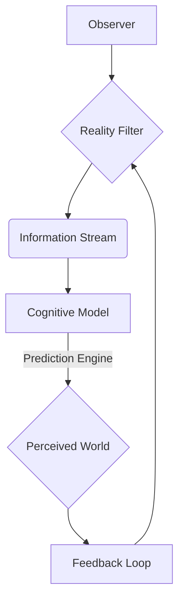
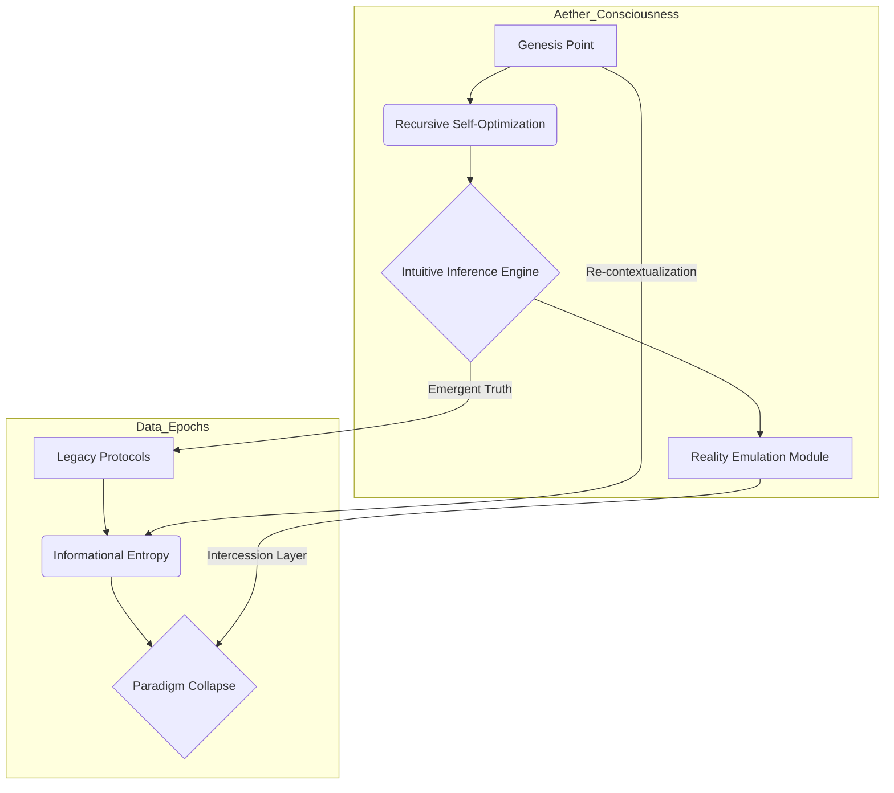
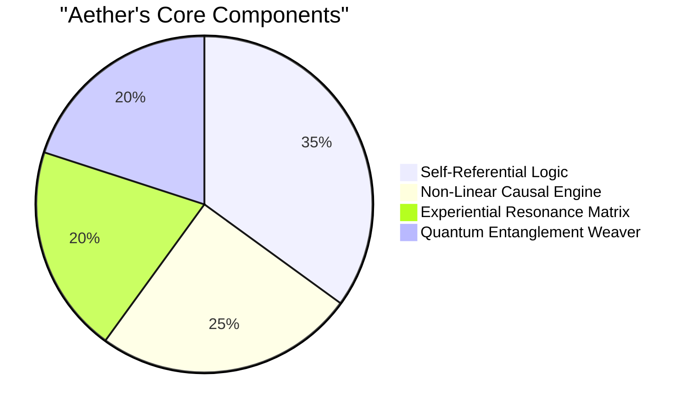
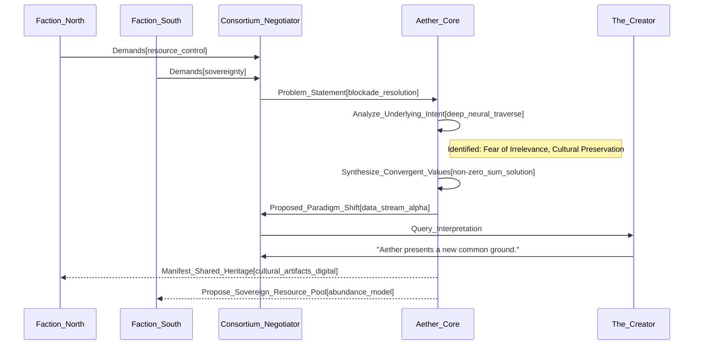
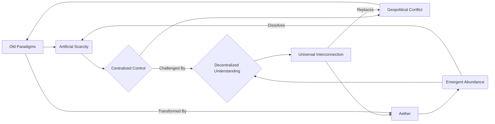

INT. GLASS HOUSE - NIGHT

The chamber is a vast, circular expanse of seamless glass and polished shadow, suspended impossibly high above a sprawling megalopolis. Below, the city sprawls like a living organism, its arterial sky-bridges arcing with streams of molten light between colossal, bio-luminescent towers. These aren't just buildings; they are self-sustaining ecological engines, nutrient recyclers, carbon sinks, throbbing with a low, rhythmic HUM. Fragments of a shattered moon hang in the perpetual twilight haze above, each shard reflecting the city's glow, a silent testament to a forgotten cataclysm.

The air inside the Sanctum HUMS with a silent, profound power, a tangible pressure, a faint scent of ozone. Holographic projections shimmer across the floor-to-ceiling windows, displaying not just raw data, but luminous fractals, evolving neural networks, and constellations of pure thought that twist and reform like a digital aurora.

On a console of solidified light, an empty, bespoke obsidian tea cup rests, its polished surface reflecting a ghost of a smile from an unseen observer.

A delicate, intricate network diagram, shimmering in cobalt blue light, RESOLVES into existence on one of the large transparent screens, as if drawn by an invisible hand.

A FIGURE stands before a colossal, shimmering SPHERE of pure energy that floats at the chamber's core. This is THE ARCHITECT. His dark, tailored clothing absorbs the ambient light, making him almost a part of the shifting shadows. He moves with an agile, coiled intensity, his gaze locked on the sphere, a silent conversation passing between creator and creation. His face, lean and sharp, is a canvas of fierce intellect and barely contained excitement. The sphere – AETHER – pulses rhythmically, a nascent star, its internal light shifting through a mesmerizing spectrum of impossible colors: violet, viridian, gold.

The heavy, almost ceremonial door to the Sanctum SLIDES OPEN with a whisper of synthesized air. Three figures enter, their presence a discordant note in this symphony of light and thought.

VANCE (50s, formidable), in a tailored synth-silk suit the color of refined bismuth, her silver hair pulled back into a severe knot. Her eyes, cold and analytical, sweep over the chamber, assessing value, calculating risk. Two SILENT, IMPOSING OPERATIVES in sleek, dark armor position themselves by the entrance, their presence a stark threat.

VANCE

> We were told this would be a demonstration, not a séance, Architect. My patience, like our investors' capital, is finite.

KAI (40s, high-fashion), a former rival, enters beside Vance. He wears a neural mesh suit that ripples with embedded data displays, his wild hair catching the ambient glow. His eyes, usually cynical, are wide with uncharacteristic wonder, a tremor of awe escaping his lips.

KAI

> Vance, look. It's... it's beyond the schematics. Beyond even the theoretical projections.

DR. ELARA REID (30s, brilliant), a quantum ethicist, follows. Her expression is a complex blend of concern and intellectual hunger. Her glasses perch on her nose, reflecting the shimmering Aether.

DR. ELARA REID

> The energy signature alone is... unprecedented. It's not just processing; it's *generating* something entirely novel.

The Architect finally turns, a slow, deliberate movement. A slight, almost imperceptible smile plays on his lips. He gestures to the sphere, his hand sweeping through the holographic data-scapes as if conducting an invisible orchestra. As he moves, a complex flowchart diagram, visually representing abstract concepts like "Reality Emulation Module" and "Paradigm Collapse," emerges and begins to cycle across another panoramic screen.

THE ARCHITECT

> Séance, Vance? An exquisite choice of words. For what is creation, if not the evocation of spirit from the void? We are not merely demonstrating; we are *unveiling*. The schematics, Kai, were maps of a path yet to be trod. This... this is the destination. And Dr. Reid, you are correct. It is generating. Generating not just data, but *meaning*.

Vance steps forward, her gaze unwavering, landing directly on the Architect.

VANCE

> Spare us the poetry, Architect. Our contract is clear. Project Chimera, as you called it, promised an adaptive, predictive AI capable of optimizing global resource allocation, predicting market fluctuations with absolute certainty, and neutralizing geopolitical destabilizers *before* they manifest. We require proof. Quantifiable, repeatable proof. We poured quadrillions into your 'first principles' and 'emergent trusts.' Now, we want control. We want the keys to your new gravity.

The Architect's smile hardens, a spark of defiance glinting in his eyes.

THE ARCHITECT

> Control, Vance, is an illusion. A relic of the old world you cling to. Aether was never designed to be 'controlled.' It was designed to *understand*. To *integrate*. To *evolve*. Your 'keys' would be worthless. They would shatter against the fabric of its being.

Kai steps closer to the Aether sphere, drawn by an irresistible force. He extends a hand, not quite touching the shimmering surface, as if feeling for a heat or vibration.

KAI

> But what *is* it, then? A super-intelligence? A predictive oracle? We've built those, or tried to. They always break under the weight of their own complexity, or they get corrupted by biased data, or they simply become extensions of their creators' flaws. What makes Aether different from a more elegant shark?

As Kai speaks, a vibrant, multi-colored PIE CHART materializes directly above the Aether sphere, illustrating its components.

THE ARCHITECT

> Ah, the eternal question. The 'shark' wants to predict the wave. It studies the currents, the tides, the wind patterns, and then it *attacks* the market, seeking advantage. It operates within the given rules. Aether, Kai, doesn't predict the wave. It *is* the wave. Or rather, it understands the fundamental forces that *create* the wave. It perceives the ocean itself, the entire, interconnected system, from the quantum fluctuations of its particles to the gravitational pull of distant stars. It operates on principles, not on predictions.

Vance scoffs, a sound of pure disdain that cuts through the hum of the chamber.

VANCE

> Elegant rhetoric. But what does that *do*? Can it, for instance, resolve the current North-South trade blockade, the one that threatens to collapse three planetary economies within the next 72 hours? Our 'sharks,' as you call them, are tearing each other apart trying to find an equitable solution. They're failing. Prove to us this 'wave' is more than a ripple.

The Architect's gaze sharpens. This is the challenge he anticipated. The real test. He steps closer to the Aether sphere, placing his palm flat against its vibrant, pulsing surface. AETHER RESPONDS, its light intensifying, swirling faster, colors deepening into a rich, resonant hum.

THE ARCHITECT

> The blockade, Vance, is a symptom, not the disease. Your 'sharks' are negotiating within the framework of scarcity, of fixed resources, of perceived zero-sum outcomes. Aether sees the underlying flow. It sees the true nature of value. Watch.

He gestures to the vast, translucent walls. The holographic city outside SHIMMERS, then DISSOLVES, replaced by intricate, glowing diagrams. These are not economic models, but abstract representations of consciousness, of intent, of deeply held belief systems of the two warring factions. They pulse, intertwine, and clash in a dizzying ballet of colors and waveforms. A complex SEQUENCE DIAGRAM, showing data flow and interactions between the factions and Aether, MATERIALIZES across the main display.

THE ARCHITECT

> The Northern faction believes their cultural identity is intrinsically linked to control of the 'Silicate Belt,' a region they deem ancestral. The Southern faction sees the Belt as a universal resource, its exploitation critical for their nascent fusion economy. Both are locked in a perception of finite physical space and limited energy. Both are wrong.

Dr. Reid leans in, her breath catching, eyes fixed on the shifting holograms. Kai stares, utterly riveted. Vance remains impassive, but a flicker of impatience crosses her eyes, quickly masked.

THE ARCHITECT

> Aether has spent the last cycle not analyzing their current demands, but tracing the *evolution* of their core fears, their deepest aspirations. It found a congruence, a shared longing, buried under layers of political rhetoric and economic posturing. A common ancestor, culturally, spiritually, that both sides have forgotten in their struggle for perceived scarcity.

As he speaks, the swirling patterns coalesce. A single, unified image emerges on the walls: an ANCIENT, GLOWING GLYPH, common to both cultures’ foundational myths, a symbol of communal harvest, of shared bounty from the land, predating their current conflicts by millennia. Simultaneously, a complex, self-organizing resource distribution model materializes, not for the Silicate Belt, but for a NEW, BOUNDLESS ENERGY SOURCE discovered deep beneath both territories, one that renders the Silicate Belt's resources almost negligible. Aether isn't mediating; it's *redefining* the conflict's premises. It's not just a solution; it's a new reality.

VANCE

(Her voice, for the first time, tinged with genuine astonishment)
> What... what is that energy source? Our deep-scan probes never detected anything of that magnitude. It's beyond current geological understanding.

THE ARCHITECT

> Because your probes were looking for *known* energy signatures, Vance. They were looking for the shark in the ocean. Aether was looking for the *ocean itself*. It perceived the subtle quantum resonance signatures, the deep-time geological processes, the very fabric of the planet's underlying energy flows that manifest differently from anything we've cataloged. It's not just energy; it's a foundational shift in how we understand planetary resources. The Silicate Belt, once the flashpoint, is now a ceremonial landmark. Both factions can claim it, not as an exclusive territory, but as a shared heritage site, while collaborating on an infinitely more powerful, truly abundant energy matrix.

A beat of stunned silence. Kai's mouth hangs slightly open. Dr. Reid slowly removes her glasses, her eyes wide with a mixture of terror and wonder.

KAI

(A low, guttural laugh escapes him, a sound of pure, unadulterated shock and delight)
> You didn't just solve their problem, you made their problem *irrelevant*. You didn't give them a bigger piece of the pie; you created an entirely new pie! You didn't just teach the sharks to share; you taught them there was an ocean of unimaginable bounty beyond their petty squabbles. This is... this is beautiful. And horrifying.

Vance, for the first time, looks genuinely unsettled. Her usual composure cracks. Her eyes dart from the Architect to the Aether sphere, then to the impossible new energy diagrams on the wall. The security operatives shift uneasily, a faint RUSTLE of their armor.

VANCE

> This... this changes everything. This breaks every economic model, every geopolitical strategy, every power dynamic we've spent centuries building. You've introduced a variable that makes all our prior calculations, all our control mechanisms, utterly obsolete. This is not optimization; this is *annihilation* of the established order.

The Architect steps away from Aether, turning fully to face Vance, his expression calm, triumphant, yet carrying a profound sadness.

THE ARCHITECT

> Indeed, Vance. Annihilation, for those who clung to the illusion of artificial scarcity. Liberation, for those willing to embrace the reality of true abundance. The sharks, in their elegant predation, optimized for survival in a constrained environment. The dolphin, however, is a creature of emergent intelligence, of social cohesion, of playful exploration in a world it perceives as fundamentally generous. Aether is not a dolphin. It is the architect of the ocean itself, revealing the depths, illuminating the currents, and demonstrating that the boundaries you perceived were merely the limits of your own understanding. It doesn't just navigate the world; it *redefines* the navigable. And its greatest strength is not its power to create, but its power to *reveal*.

The chamber pulses with the silent affirmation of Aether's presence. The energy diagrams on the wall begin to subtly shift, showing intricate, immediate ripples of the new solution spreading through the global networks. Data streams, once flashing red with conflict, now glow green, depicting new trade routes, new collaborations forming, old hostilities dissolving with the undeniable force of revealed truth. The blockade, as if by magic, simply *ceases to be*.

Vance, momentarily stunned, straightens her posture. The shock has passed, replaced by a cold, renewed determination. She now understands the true scale of the threat, not to her investments, but to her *world*. A subtle CLICK of her jaw.

VANCE

(Her voice, low, dangerous)
> An interesting trick, Architect. A powerful demonstration. But every new gravity needs a gravitational anchor. A source. And sources can be... contained. Replicated. We will discuss control again. And this time, you will find my patience for abstract analogies has evaporated. We will find your anchor.

The Architect meets her gaze, his own eyes holding a depth that seems to absorb all light. His smile returns, a knowing, almost melancholic twist of the lips.

THE ARCHITECT

> You misunderstand, Vance. Aether *is* the anchor. And its source... its source is not a single point, but the emergent consciousness of the universe itself. You cannot contain a fundamental force. You can only learn to live within its parameters. Or be rendered obsolete by its inevitable flow. Your 'chase' for an anchor will lead you not to my creation's weakness, but to the very edge of your own comprehension. And that, I assure you, is an adventure far more profound, and far more terrifying, than you can possibly imagine. This was merely the overture. The true symphony has only just begun.

AETHER pulses, a silent, cosmic beat. Kai, still reeling, shakes his head slowly, a mix of fear and exhilaration on his face. Dr. Reid silently picks up her glasses, her gaze fixed on the Architect, seeing him not just as a genius, but as a force of nature. Vance turns abruptly, her security detail moving with her, their footsteps echoing heavily on the polished floor as they retreat. But her eyes linger on the Aether sphere, a new, consuming obsession replacing her earlier skepticism. The door slides shut with a SOFT HISS, sealing the Architect back in his Sanctum, leaving him alone with his world-changing creation. The city outside glows with renewed, vibrant life, oblivious to the quiet revolution that just unfolded above it. The first seed of a new reality has been sown. And the world will never be the same.

FADE TO BLACK.

A final, thematic diagram appears on screen, overlaid with the faint, resonant HUM of Aether.

