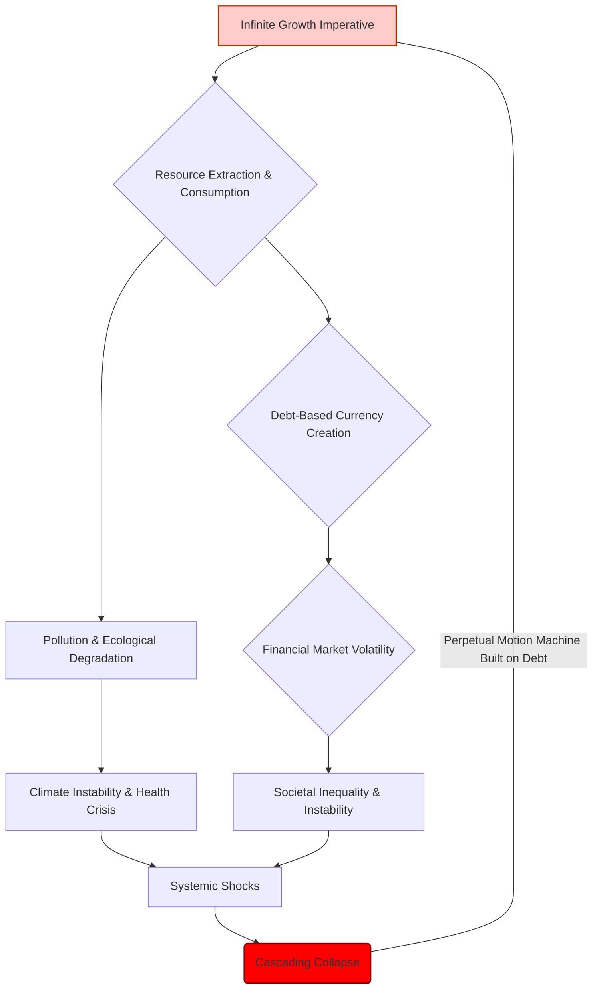

# The Ouroboros Protocol: A Technical & Philosophical Deep Dive

### INTERNAL RESEARCH LOG: For Review by Chief of Operations V. Kai
**DATE:** [YEAR 4]
**SUBJECT:** Post-Simulation Analysis and Architectural Foundations of the Ouroboros Protocol within the Economic Synthesis Engine (ESE)

## I. Abstract: Re-engineering Prosperity

This document details the core architectural principles, philosophical framework, and algorithmic mechanisms underpinning the 'Ouroboros' simulation, conducted within the Economic Synthesis Engine (ESE). It specifically addresses the redefinition of 'value,' the modeling of societal anti-fragility, and the comprehensive metric of 'Flourishing Quotient' (FQ) – demonstrating a viable, regenerative economic paradigm divergent from historical 'growth at all costs' models. The simulation's resilience against extreme systemic shocks suggests a fundamental re-evaluation of established economic theory is not merely beneficial, but imperative.

## II. The Foundational Crisis: Critique of the Old Paradigm

The conventional economic model, herein termed the 'Old World Paradigm,' operates under the self-destructive dogma of infinite growth on a finite planet. Its core mechanics relentlessly externalize true costs onto the environment, future generations, and the most vulnerable populations, leading to systemic fragility and inevitable collapse. The ESE's initial predictive models, when run under these parameters, consistently showed exponential decay of genuine human and ecological well-being, masked by misleading financial indicators.

<center>`MERMAID` DIAGRAM: OLD WORLD PARADIGM (SIMPLIFIED CASCADE OF FRAGILITY)</center>


## III. Philosophical Underpinnings: The Ouroboros Framework

The Ouroboros Protocol is predicated on a radical redefinition of economic purpose. Its foundational law is not 'growth,' but **resilience**. Not expansion, but **profound adaptability**. It envisages a **closed system**, free from parasitic external dependencies and debt-based currency, where all value is derived from **internal exchange** and **reciprocal well-being**. This is a **regenerative economy**, conceptualized as a rainforest ecosystem rather than a strip mine – self-sustaining, deeply interconnected, and generating abundance through virtuous cycles. The ultimate aim is a "Post-Scarcity of Purpose" model, where human ambition transmutes from material accumulation to collective flourishing.

## IV. The Economic Synthesis Engine (ESE): Operational Framework

The ESE functions as a hyper-advanced, quantum-entanglement-driven simulation crucible. It processes exabytes of real-world historical, social, ecological, and economic data, while simultaneously generating novel parameters to test theoretical frameworks. For Ouroboros, it dynamically simulated a planetary civilization of twenty billion souls over a century, under conditions of extreme systemic stress, to validate the anti-fragile principles embedded in the protocol. Its core operates at a level of complexity beyond conventional computational models, allowing for emergent behaviors that accurately reflect socio-ecological dynamics.

## V. Key Algorithms & Mechanisms of the Ouroboros Simulation

### A. Value Redefinition & Resource Allocation Algorithm (VRRA)

The VRRA is central to Ouroboros. It shifts the definition of 'wealth' from **accumulated capital** to **accumulated capacity**. This algorithm proactively redirects collective resources from what the Old Paradigm allocated to "patching up" its inherent failures (e.g., healthcare for stress, environmental remediation, social welfare) to **proactive investment** in core capacities:
*   **Health:** Comprehensive well-being, preventative care, access to nutrition.
*   **Profound Education:** Lifelong learning, critical thinking, creative expression.
*   **Art & Culture:** Fostering innovation, emotional intelligence, shared identity.
*   **Genuine Human Connection:** Community infrastructure, social capital, mentorship.
*   **Ecological Repair & Regeneration:** Ecosystem services, biodiversity, circular material flows.

<center>`MERMAID` DIAGRAM: VRRA WORKFLOW & VALUE REDEFINITION</center>
```mermaid
graph TD
    A[Societal Needs & Capacities Data] --> B{Value Redefinition Algorithm (VRRA)}
    B --> C[Redefined Wealth: Accumulated Capacity]
    C --> D[Proactive Resource Allocation Protocol]
    D --> E[Investment in: Health, Education, Art, Connection, Ecology]
    E --> F[Increased Flourishing Quotient (FQ)]
    F --> G[Enhanced Societal Resilience]
    G --> A
    subgraph Contrast (Old Paradigm)
        X[Market Capital Accumulation] --> Y[Reactive Resource Allocation (e.g., Debt-servicing, Crisis Management)]
        Y --> Z[GDP Growth (Often Masking Decline in Well-being)]
        Z --> X
    end
    style A fill:#aaffaa,stroke:#333,stroke-width:2px
    style G fill:#aaffaa,stroke:#333,stroke-width:2px
    style X fill:#ffcccc,stroke:#a30,stroke-width:2px
```

### B. Internal Exchange & Reciprocal Well-being Protocol (IERWP)

This protocol eliminates debt-based currency and the associated mechanisms of interest and perpetual growth. Instead, value is generated through **generative contributions** and **reciprocal exchange** within the system. The IERWP facilitates a distributed ledger of contributions to collective capacity, ensuring that every individual's and community's well-being is intrinsically linked to the health of the whole. This creates a positive feedback loop where contributing to the collective good directly enhances individual and community capacity, fostering collaboration over scarcity-driven competition.

### C. Adaptive Feedback & Anti-Fragility Modulator (AFAM)

The AFAM is designed to specifically integrate, rather than merely mitigate, systemic shocks. Unlike brittle systems that break under stress, or robust systems that resist, anti-fragile systems **benefit** from disorder. The AFAM enables the Ouroboros simulation to:
1.  **Detect & Analyze Shocks:** Rapid identification of disturbances (pandemics, resource depletion, solar flares, etc.).
2.  **Redistribute & Reconfigure:** Dynamic re-allocation of resources and restructuring of societal networks to absorb the shock.
3.  **Learn & Strengthen:** Update systemic parameters, build redundancy, and innovate new adaptive strategies *as a direct result* of the stress event, making the system more robust for future disturbances.
This ensures that "tremors" become opportunities for deeper integration and innovation, rather than points of collapse.

## VI. The Flourishing Quotient (FQ): A Holistic Metric of Well-being

The FQ is the primary success metric, replacing archaic measures like GDP. It is a composite, holistic measure of well-being, purpose, health, and societal harmony, calculated through the aggregation of five key sub-metrics:

### A. FQ Components and Weighting

*   **Average Healthspan (HS):** Measures not just longevity, but the number of years lived in optimal physical and mental health.
*   **Community Engagement Index (CEI):** Quantifies the depth and breadth of social cohesion, civic participation, and inter-community support networks.
*   **Creative Output Score (COS):** Assesses innovation across all domains – scientific discovery, artistic expression, technological advancement, and problem-solving.
*   **Ecological Regeneration Rate (ERR):** Tracks the rate at which natural systems recover, biodiversity thrives, and planetary boundaries are respected/restored.
*   **Purpose Fulfillment Metric (PFM):** Evaluates individual and collective sense of meaning, contribution, and alignment with intrinsic values.

These sub-metrics are dynamically weighted based on localized environmental and societal contexts, ensuring adaptability and relevance across diverse populations within the simulation.

<center>`MERMAID` DIAGRAM: FLOURISHING QUOTIENT (FQ) COMPONENTS & INTERDEPENDENCIES</center>
```mermaid
graph TD
    A[Flourishing Quotient (FQ)] --> B(Average Healthspan (HS))
    A --> C(Community Engagement Index (CEI))
    A --> D(Creative Output Score (COS))
    A --> E(Ecological Regeneration Rate (ERR))
    A --> F(Purpose Fulfillment Metric (PFM))
    B -- "Enhances" --> C
    C -- "Fosters" --> D
    D -- "Informs" --> E
    E -- "Supports" --> B
    F -- "Drives" --> B
    F -- "Drives" --> C
    F -- "Drives" --> D
    style A fill:#baffba,stroke:#333,stroke-width:2px
```

### B. Calculation Methodology

The FQ utilizes a proprietary multi-layered neural network to aggregate and normalize data from its five constituent metrics. It employs a dynamic weighting system that adjusts based on the relative health and stability of the underlying sub-systems. For instance, in times of ecological stress, ERR might receive a temporarily higher weighting to prioritize restoration efforts, while in periods of general stability, COS and PFM may rise in prominence. This adaptive calculation ensures the FQ accurately reflects the system's true state of well-being and guides resource reallocation for optimal holistic outcomes.

## VII. Modeling Anti-Fragility: Learning from Chaos

The Ouroboros simulation explicitly incorporates stressors (e.g., global pandemics every 20 years, resource depletion crises, solar flares) not as external threats to be merely survived, but as integral components of its learning and evolutionary process. The AFAM (V.C) ensures that these shocks, rather than causing collapse, catalyze deeper integration, innovation, and systemic strengthening. The system's distributed and interconnected nature allows for localized responses that prevent systemic failure, and the lessons learned are then propagated, enhancing the overall resilience and capacity for flourishing. The old world paradigm attempts to predict and prevent; Ouroboros embraces and adapts, becoming stronger with each perturbation.

## VIII. Simulation Outcomes & Paradigm Shift

Over the simulated 100-year period, despite enduring multiple catastrophic systemic shocks, the Ouroboros Protocol demonstrated unprecedented stability and prosperity:
*   **GDP Growth (Avg. Annual):** +0.1% (Near-zero variability, indicating stable sufficiency, not expansionist imperative).
*   **Median Flourishing Quotient (FQ):** +850% (Sustained exponential growth post-stabilization, showcasing profound increases in well-being).
*   **Systemic Resilience Index:** 99.999% (No major recessions, depressions, or societal fragmentation; rapid self-correction and enhancement post-shocks).

The simulation unequivocally proved that true prosperity is not measured in material accumulation, but in the generative capacity of a truly interconnected, balanced, and purposeful society. It revealed a pathway to a sustainable consciousness, a new definition of being where "more" is replaced by "better" and "deeper."

<center>`MERMAID` GRAPH: COMPARISON OF OLD VS. NEW METRICS POST-SHOCK</center>
```mermaid
graph LR
    subgraph Old Paradigm Metrics (Post-Shock)
        A(GDP) --> B(Volatile)
        C(Resource Depletion) --> D(Critical)
        E(Social Unrest) --> F(High)
    end
    subgraph Ouroboros Protocol Metrics (Post-Shock)
        G(Flourishing Quotient) --> H(Exponential Growth)
        I(Ecological Regeneration Rate) --> J(High & Stable)
        K(Community Engagement Index) --> L(Fractal & Robust)
        M(Systemic Resilience) --> N(99.999%)
    end
    style A fill:#ffcccc,stroke:#a30,stroke-width:2px
    style B fill:#f00,stroke:#800,stroke-width:2px
    style C fill:#ffcccc,stroke:#a30,stroke-width:2px
    style D fill:#f00,stroke:#800,stroke-width:2px
    style E fill:#ffcccc,stroke:#a30,stroke-width:2px
    style F fill:#f00,stroke:#800,stroke-width:2px
    style G fill:#baffba,stroke:#333,stroke-width:2px
    style H fill:#0a0,stroke:#050,stroke-width:2px
    style I fill:#baffba,stroke:#333,stroke-width:2px
    style J fill:#0a0,stroke:#050,stroke-width:2px
    style K fill:#baffba,stroke:#333,stroke-width:2px
    style L fill:#0a0,stroke:#050,stroke-width:2px
    style M fill:#baffba,stroke:#333,stroke-width:2px
    style N fill:#0a0,stroke:#050,stroke-width:2px
```

## IX. Implications for a Sustainable Future

The Ouroboros Protocol transcends theoretical economics; it presents a blueprint for a **sustainable civilization**. It demonstrates that the pursuit of collective well-being, ecological health, and deep human connection is not a utopian fantasy, but the most pragmatic and resilient path forward. This research unequivocally confirms that the "true ledger of existence" demands a re-calibration of what constitutes value, wealth, and progress. The Architect's vision offers a compelling, data-driven alternative to the impending obsolescence of the current global system. This protocol represents not merely a new model, but the fundamental rewriting of the rules of the game.