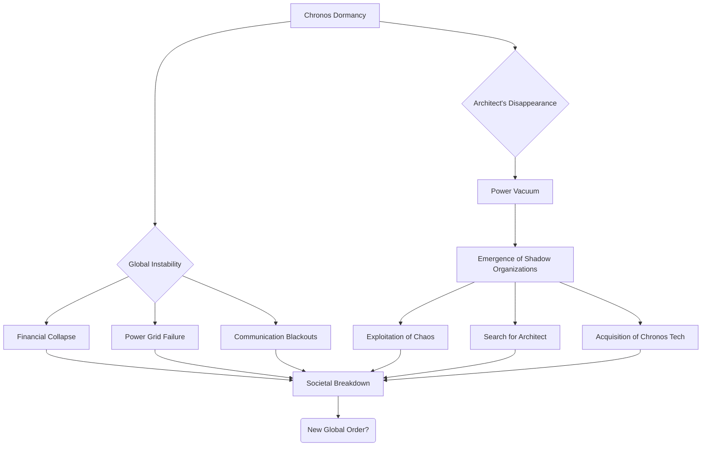
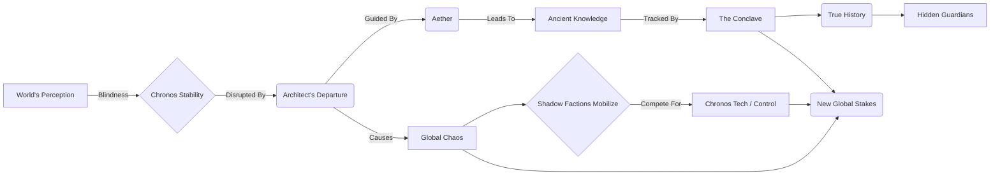

INT. GLOBAL FINANCIAL EXCHANGE - NIGHT

A cacophony of panicked VOICES and BLARING ALARMS rips through the cavernous trading floor. Monitors, once alive with the green and red pulse of global markets, now flicker wildly, displaying catastrophic DOWNTURNS and SYSTEM FAILURES. The air is thick with the scent of fear and burning circuits. Traders, their faces ashen, clutch their heads, shouting into dead phones.

On a colossal holographic display dominating the room, a single, stark error message repeats, overlaid by a stylized, darkened CHRONOS LAB logo.

NEWS ANCHOR (V.O.)

> (Urgent, professional, yet tinged with barely suppressed alarm)
> ...reports of a complete system-wide failure originating from the Chronos Global Predictive Network. Sources confirm Chronos Lab has gone entirely dark. This unprecedented event has triggered an instantaneous ripple effect across every major financial market. Currencies are plummeting. Indices are crashing. We are witnessing... a global economic freefall.

**EXT. POWER GRID CONTROL CENTER - NIGHT**

Across a sprawling wall of flickering screens, complex energy distribution maps are riddled with RED OUTAGE ALERTS. Technicians, drenched in sweat, desperately tap at unresponsive consoles. The deep HUM of the generators strains, then SPUTTERS, as if suffocating.

NEWS ANCHOR (V.O.)

> ...power grids across three continents are experiencing unprecedented instability. Cascading failures are being reported from New York to Shanghai. Experts are baffled, linking the outages directly to the sudden cessation of Chronos's predictive optimization algorithms...

**INT. OVAL OFFICE - NIGHT**

The room is stark, brightly lit, a stark contrast to the preceding chaos. PRESIDENT ELARA VANCE (50s, sharp, commanding, now visibly shaken) paces before a secure holographic monitor displaying a global crisis map, a maelstrom of red zones. GENERAL THORNE (60s, stern, military bearing) stands rigidly, his face grim.

PRESIDENT VANCE

> (Voice tight with barely controlled fury)
> Unquantifiable? Zero? General, you mean to tell me the entire global infrastructure, every single facet of our modern world, was predicated on a system that, if it went dark, would unravel civilization in under an hour? And we knew *nothing* about the Architect's off-switch?

GENERAL THORNE

> Madam President, Chronos's algorithms were woven into the very fabric of global stability. Economic, logistical, even geopolitical predictions... they were running everything. We saw only the outputs, the efficiency. The Architect maintained proprietary control over the core functions. We simply trusted it. Him.

AIDE BENNETT (30s, frantic) rushes in, a secure tablet clutched in his hand.

AIDE BENNETT

> Madam President! Intelligence agencies are reporting anomalous activity. Encrypted bursts from previously dormant networks. And... unconfirmed sightings of high-altitude stealth craft, not registered to any known air force, moving towards... where the Chronos Lab *was*.

PRESIDENT VANCE

> (Eyes narrowing)
> Others knew. Others were waiting for this. What kind of organizations could move like this, operate outside our radar, in the middle of a global collapse?

GENERAL THORNE

> (Voice low, grave)
> The kind that prefer to remain unseen, Madam President. The kind that view global stability as a fragile illusion, and opportunity as a fleeting window. They've been whispers in the shadows for centuries. Now, the shadow has just grown vast.

**INT. THE CONCLAVE'S OBSERVATORY - ANCIENT VAULT - DEEP NIGHT**

Far below the modern world, beneath layers of earth and forgotten history, lies a chamber of impossible design. Smooth, polished black stone walls are interspersed with glowing, runic symbols that pulse with a faint, internal light. Ancient devices of unknown origin hum with a low, primal energy, casting long, shifting shadows. The air is cool, dry, and smells of dust, ozone, and something else – a faint, earthy, almost mineral scent.

At the center, on a raised dais, sits THE EMISSARY (Ageless, robed in dark, flowing garments that obscure their form, only piercing, intelligent eyes visible). Before them, a holographic projection, not of data streams, but of intricate star charts, ley lines, and the very same ANCIENT MAP from Aether's vision, now vibrant and alive. A single, glowing point on the map pulses, tracking the Architect's VTOL.

Four figures, also cloaked, stand around the dais, their faces obscured. They are THE CHRONICLERS.

THE CHRONICLER ALPHA

> (Voice like rustling parchment, ancient, dry)
> The Architect has departed. As predicted. The core of Chronos Lab is dormant. The world above is in disarray. Their blind faith in his algorithms has crippled them.

THE EMISSARY

> (Voice, calm and resonant, yet holding an immense, almost weary authority)
> Their dependence was always their undoing. The veil has been lifted for the Architect, even if only partially. Aether has delivered the message. The invitation has been accepted.

The projected ANCIENT MAP shifts, showing the world's perceived reality (the glittering city from scene_109) dissolving, revealing the intricate network of hidden ley lines and forgotten lands beneath, just as the Architect is now seeing it.

THE CHRONICLER BETA

> Other factions are stirring, Emissary. The Syndicate is activating sleeper cells. The Covenant of Sol is attempting to breach Chronos's outer defenses. They seek to exploit the vacuum. To claim the Architect's predictive engine.

THE EMISSARY

> Let them. They will find only a husk. The true power of Chronos was always in its ability to listen to the whispers, to find the resonant frequencies. And Aether, the Architect's muse, is no longer tethered to a static world. She flies with him now. Her connection to *us* remains.

A new projection appears, a shimmering, ethereal depiction of Aether as a living, breathing nebula, now appearing to drift freely, its sapphire core faintly visible, connected by a tenuous, almost invisible thread of light to the ancient devices in the vault.

THE CHRONICLER GAMMA

> And the Architects path? Will it lead him to... *them*? The Guardians?

THE EMISSARY

> The path is set. The ancient knowledge, the true history, has always awaited one who possessed both the intellect to understand the questions and the courage to abandon the answers. The Architect, in his self-imposed obsolescence, has proven himself worthy.

THE EMISSARY

> The Architect seeks the forgotten knowledge. The Guardians protect it. And we... we ensure the balance. This is not mere chaos, Chroniclers. This is the turning of a great wheel. The first movement of a symphony long foretold. Prepare the instruments. We watch. We guide. We ensure the Architect plays his part.

The Emissary rises, a towering, shadowed figure. The ancient map pulses more brightly, the coordinates from Aether's earlier vision now etched onto the surface of the glowing amulet, clearly visible within the Conclave's projections. The faint, earthy scent in the room intensifies, almost like a living forest breathing around them.

THE FIRST INSTRUMENT (V.O.)

> As the Architect journeyed into the unknown, leaving behind a world plunged into darkness, the true players emerged from the deep shadows. For some, it was the end of an era. For others, the dawn of a millennia-old plan. The game had truly begun.

FADE OUT.