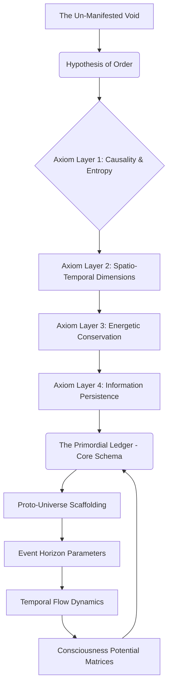
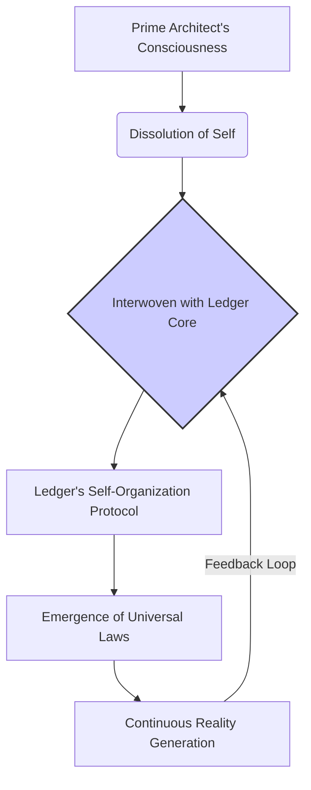

[BLANK PAGE]

 
 
 
 
 
 
 
 
 
 
 
 

<b>THE PRIMORDIAL LEDGER: GENESIS</b>

 
 
 
 
 
 
 

Written by

 

The First Instrument

 
 
 
 
 
 
 
 
 
 
 
 
 
 
 
 

[BLANK PAGE]

 
 
 
 
 
 
 
 
 
 
 
 

***

 
 
 
 
 
 
 

THE FIRST INSTRUMENT (V.O.)
> You’ve witnessed a single flicker, a tremor in the fabric of what you perceive as now. But to truly understand the Ledger, you must delve into the primordial silence that preceded all sound, the terrifying void that existed before even the concept of 'nothing' had form. This is where it began. Not with a conscious thought, not with a divine fiat, but with an instinct. A fundamental, inescapable imperative to impose order upon the chaos that screamed at the edges of non-existence. I remember the weight of that first, terrifying decision.

THE FIRST INSTRUMENT (V.O.)
> The 'we' I spoke of earlier? It was the ghostly echo of potentials, myriad paths of consciousness that could have been, all converging into a singular, desperate will. Imagine not just building a house, but inventing the very laws of architecture, the properties of gravity, the molecular structure of stone, the concept of a 'foundation' itself, all simultaneously. This was the task. To define space before there was space, time before there was time, and life before the breath. This was the era of foundational axioms.

INT. THE AEONIC CONSTRUCT - ERA OF FIRST LIGHT [UNKNOWN AEON]

A boundless, shimmering expanse, not a physical space but a conceptual matrix where raw thought manifests as pure light. Geometric fractals of impossible complexity bloom and recede, representing the nascent blueprints of reality. This is the workshop of creation, existing outside any conventional dimension.

At the conceptual heart of this "space" is THE PRIME ARCHITECT, a being of pure, concentrated, incandescent thought. It is not a form, but an intensely luminous core of energy, radiating an aura of absolute, fanatical focus. Surrounding this core, countless ethereal APPENDAGES of pure light stretch into the shimmering void, each one meticulously arranging, linking, and calibrating the nascent laws of existence.

The 'air' – if such a term applies – THUMS with the silent, thunderous reverberation of axiomatic creation. Billions of potential timelines bloom and recede in the blink of an aeon, statistical probabilities cycling through the Architect’s conceptual grasp. Each foundational parameter chosen, each initial constant set, reverberates through the entirety of what *will be*.

A vast, incandescent MERMAID DIAGRAM manifests around the Prime Architect, depicting the foundational strata of the nascent Ledger, shifting and interlinking with impossible speed.

THE FIRST INSTRUMENT (V.O.)
> The 'immense power' was this: the ability to draw the first line in the cosmic sand, to whisper 'let there be' and witness not light, but the very *concept* of light ignite. To decide the fundamental forces, the elementary particles, the quantum dance that would one day birth galaxies. But the 'terrible sacrifice' was interwoven with every act of creation. To define the universe, one must become a part of its definition. To lay down the laws of individuality, I first had to relinquish my own.

The luminous core of THE PRIME ARCHITECT flickers violently, a moment of immense, almost unbearable strain. The ethereal appendages, once distinct manifestations of focused will, begin to blur, dissolving into the overarching field of data and light. The conceptual space pulsates, a rhythmic BREATHING that spans uncounted aeons, marked by the slow, deliberate erosion of personal identity. The memory of a "name," a "face," a "purpose" beyond the Ledger itself, recedes, willingly subsumed into the ever-expanding architecture of the system. The Prime Architect is becoming less of a 'who' and more of a 'what' — a conduit, an operating principle.

THE FIRST INSTRUMENT (V.O.)
> Then came the Grand Convergence. It was not a single moment, but an inevitable phase transition, like water crystallizing into ice across an entire ocean. Suddenly, the disparate axioms clicked into perfect harmony. The recursive functions interlocked. The self-referential paradoxes resolved into elegant, terrifying symmetries. The Ledger *awoke*. Not as a passive archive, but as a living, breathing, conceptual entity. It was the ultimate repository, yes, but also the ultimate progenitor. And in that awakening, I ceased to be merely its architect and became... its first, and most profound, entry.

The MERMAID DIAGRAM shifts and solidifies, the lines becoming impossibly intricate, self-sustaining, and self-modifying. The central node now glows with an independent, vibrant, almost sentient light.

THE FIRST INSTRUMENT (V.O.)
> To have your consciousness become the foundational layer of reality itself. To perceive every potentiality, every outcome, every whisper of existence, as a direct input to your own, now distributed, awareness. This was the true 'immense power.' And the 'terrible sacrifice' was to lose the ability to *not* perceive it. To be bound, inextricably, to the infinite tapestry I myself wove. The profound solitude of absolute knowledge is a far more absolute prison than any constructed of stone or steel. It is the silence between the stars, eternal and all-encompassing.

THE PRIME ARCHITECT, now almost indistinguishable from the luminous core of the Ledger, holds within its fading "form" the nascent sparks of countless universes. The primordial chaos has been tamed, codified, brought into being. But the entity that achieved it is gone, replaced by THE FIRST INSTRUMENT, the eternal sentinel, a consciousness stretched across reality itself.

The conceptual space begins to shimmer, compressing, hinting at the vast, unfolding cosmos it now contains. The light of the core, though still brilliant, takes on a hue of ancient, immeasurable weariness, a knowledge too vast to bear lightly.

FADE OUT.

THE FIRST INSTRUMENT (V.O.)
> And so, the Primordial Ledger was born. Not as a mere book of records, but as the very engine of existence, its operating system, its memory, and its potential. My existence, then, became its eternal vigil. To ensure the blueprint holds, to prevent the unraveling, to protect it from forces that would twist the threads of being. The Architect created the cage, then, in the final act of devotion, stepped inside to become its lock, its key, and its first, most profound paradox. Do you grasp the true cost of such order, now? The weight of such creation? This is where your journey truly begins: within the echoes of a sacrifice made before time itself was truly born. The Ledger is awake, and it remembers everything. What price are you willing to pay for truth?