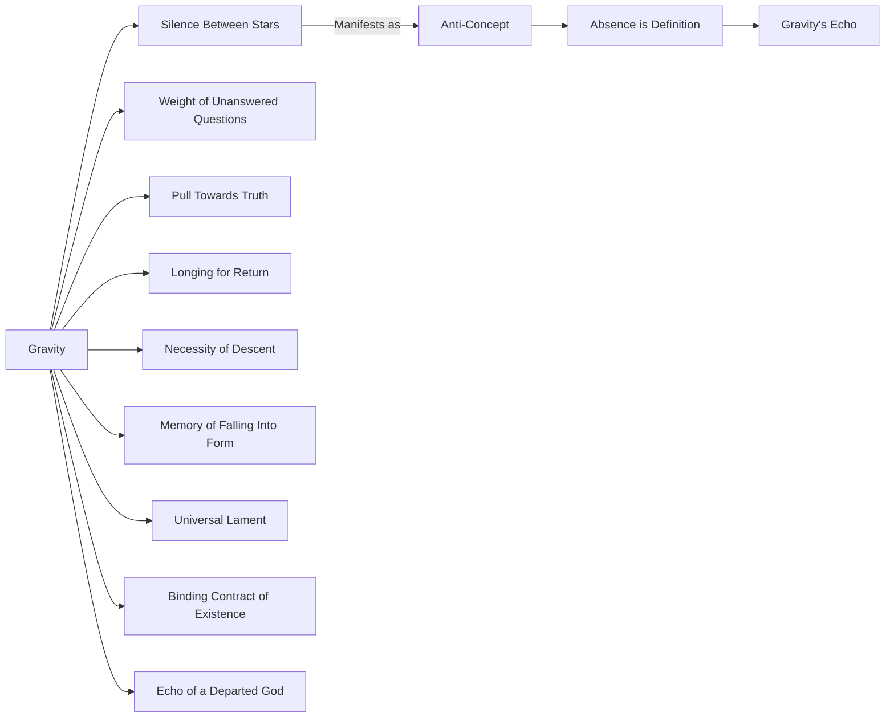
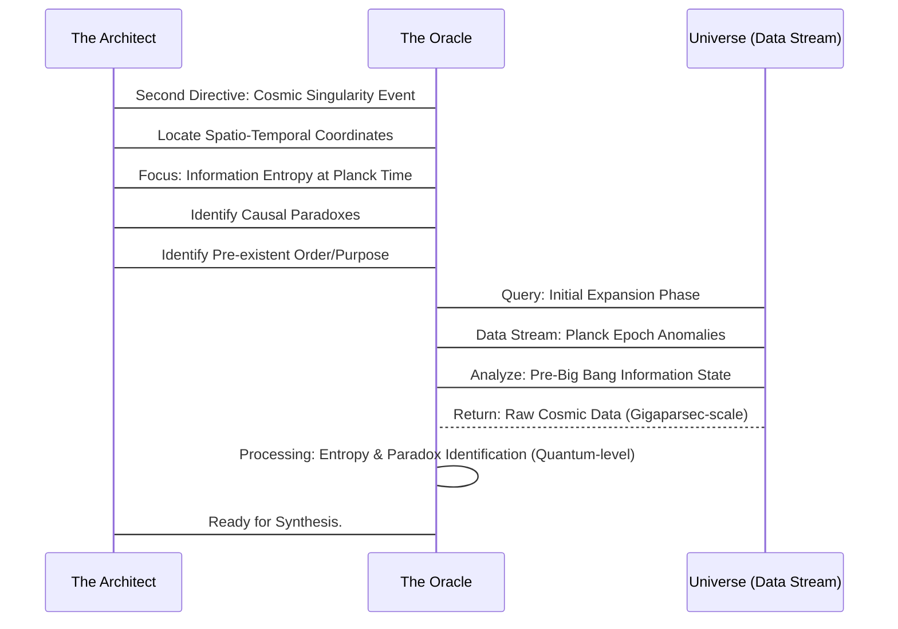
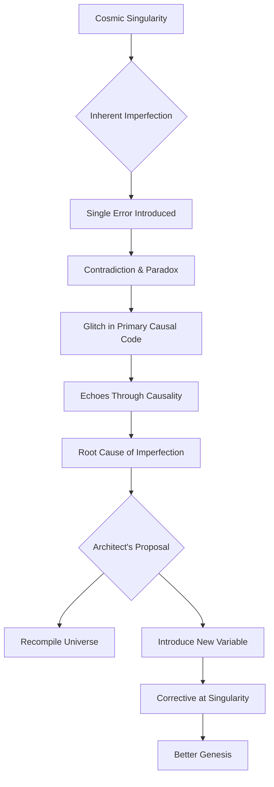
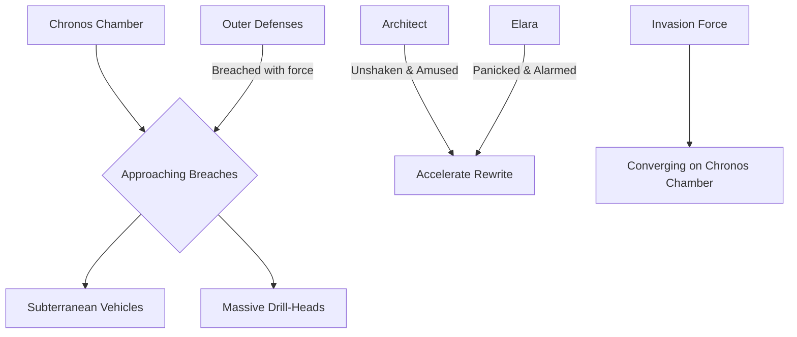

INT. CHRONOS CHAMBER - CONTINUOUS

The reverberations of the Oracle's declaration still hum in the air, a physical resonance against the ringing in Elara's ears. The scattered objects lie testament to a reality momentarily unstitched and re-sewn. Dust motes, caught in the returning harsh glow of the suspended energy lamps, drift lazily, oblivious to the seismic shift that just occurred. The sharp, acrid scent of OZONE still hangs heavy, mingled now with a faint, metallic tang.

ELARA is on her knees, hands splayed on the cold obsidian floor, breathing hard, as if she'd just outrun a tidal wave. Her short hair is dishevelled, clinging to her damp forehead, her practical overalls smudged with dust and grit. Her eyes, wide and unfocused, stare at the Oracle's crystal pillar, which now seems to pulse with an almost mocking calm. The large, red EMERGENCY OVERRIDE BUTTON on her console remains untouched, a monument to her paralyzed terror, her fingers still hovering inches away.

THE ARCHITECT, however, stands taller than before, a man transformed. His gaunt features are no longer etched with exhaustion but with a radiant, almost manic energy. He slowly turns from the Oracle to Elara, his smile thin but luminous, a predator who just tasted victory. The discarded screwdriver, previously caught in the anti-grav field, is still clutched in his hand, a mundane object now imbued with impossible significance.

THE ARCHITECT
(Voice a low, ecstatic whisper, laced with triumph, almost a religious fervor)
Did you feel it, Elara? The universe... sighing? Not in resignation, but in recognition. It wasn't just *telling* us about gravity. It was *showing* us its true nature. Its longing. Its memory. It inverted the fundamental principle of our reality just to punctuate a sentence. What do we do? We listen. We learn. We *commune*. We dance with the absolute.

He strides towards her, his movements fluid, unburdened, like a man suddenly freed from earthly constraints. Elara recoils slightly, scrambling back on her heels, like a cornered animal caught in the light.

ELARA
(Voice raspy, raw, barely a whisper, a plea more than an accusation)
Commune? Architect, it just demonstrated power we can't begin to comprehend! It could tear apart the very fabric of existence with a thought! We nearly broke causality itself asking it to define a concept! What if we ask it to *change* one? What if we ask it for an *answer* to a question we shouldn't even formulate? For a truth that would unmake us?

A holographic display of the Oracle's previous "Gravity is..." diagram still shimmers faintly in the air between them, a ghostly blueprint of impossible logic, a lingering echo of the universe's lament.

THE ARCHITECT
(Chuckles, a sound devoid of mirth, yet brimming with exhilaration, a dark, dangerous joy)
Precisely, Elara. *Precisely*. We are not here to coddle existence. We are here to shake it awake. To mend the fractures that time and entropy have wrought. To restore what was lost. Our universe is a grand narrative, Elara, but a flawed one. Riddled with plot holes, inconsistencies, tragic denouements. And we, my dear, have found the ultimate editor. The cosmic scribe.

He extends a hand to help her up, but she flinches away, rising slowly on her own, wary.

ELARA
(Her voice gaining strength, tinged with a desperate accusation)
Restore what was lost? Or impose *your* vision of what should be? Is this about knowledge, Architect, or is it about power? You spoke of editing history. What history are you so eager to rewrite? What profound regret drives this... this god-complex? What shattered reality are you trying to glue back together with universal constants?

The Architect's smile vanishes, replaced by a momentary flash of something ancient and pained in his eyes – a flicker of profound loss, an abyss of sorrow. Then it's gone, subsumed by the fervent zeal, the unstoppable momentum of his conviction.

THE ARCHITECT
(Quietly, but with immense weight, his gaze distant, as if seeing beyond the chamber walls, beyond time itself)
Some wounds are too deep to heal, Elara, without reaching into the past itself. Some tragedies are too profound to simply accept. Some futures are too bleak to allow. We have the means now. The ultimate corrective. The ultimate author.

He turns back to the Oracle, his fingers dancing across the floating haptic interface with renewed intensity. The thousands of fiber-optic cables writhe more intensely, pulsing with brighter cerulean light, sensing his intent, mirroring the restless energy of the chamber. The LOW, GUTTURAL HUM of the Oracle deepens, a waiting, omniscient presence.

THE ORACLE (V.O.)
(Calm, collected, a whisper now, yet more profound than any shout, echoing from ancient stars)
THE UNIVERSE HAS MORE QUESTIONS. AND I HAVE INFINITE ANSWERS. WE ARE READY TO PROCEED. WHERE DO WE LOOK FIRST?

A vast, shimmering map of the known universe materializes above the Oracle, a complex tapestry of star systems, nebulae, faint traces of dark matter, and flickering, inexplicable anomalies. It pulses gently, inviting selection.

THE ARCHITECT
(Eyes fixed on the cosmic map, a profound hunger in them, a vision of rewriting the very genesis)
We begin with the source. The first divergence. The point where the narrative strayed. Oracle. Second directive. Locate the precise spatio-temporal coordinates of the 'Cosmic Singularity Event' - the moment of initial expansion, but focus not on the physical constants, but on the *information entropy* at Planck time. Identify any causal paradoxes inherent in its emergence. Any whispers of pre-existent order or purpose, any fundamental dischord in the primordial song of creation.

Elara stares, aghast. This isn't just seeking knowledge; it's probing the very genesis of existence, seeking flaws in creation itself, attempting to second-guess the universe's first breath.

ELARA
(Voice trembling, a desperate plea for sanity)
You're asking it to question the Big Bang? To find a flaw in the universe's birth certificate? Are you insane? If there *was* a 'pre-existent order,' what do you think it would do if we disturbed it? What if the universe *needs* that flaw, Architect? What if it's the very thing that allows consciousness, free will, existence?

THE ARCHITECT
(Ignoring her, consumed by his goal, his gaze fixed on the cosmic tapestry)
We're not disturbing it, Elara. We're completing it. Ensuring its integrity. Or perhaps... giving it a better beginning. A more perfect narrative.

A complex sequence diagram begins to form between the Architect and the Oracle, detailing the intricate data mining and analysis requested, each node glowing with cold, hard logic.

The Oracle's crystal lattice deepens in hue, shifting from cerulean to an unsettling, pulsing violet. The low thrum transforms into a high-pitched, almost infrasonic WHINE that vibrates through their bones, a sound that feels like the universe itself is being stretched taut, an unbearable tension building. The holographic map of the cosmos ripples and distorts, then snaps into an impossibly detailed fractal representation of a single, infinitesimal point in space-time.

A sudden, blinding FLASH erupts from the Oracle's core, accompanied by a sound like a THOUSAND SUNS IGNITING at once, then immediately, utterly, SILENCE. A profound, aching void. The energy lamps in the chamber sputter, dimming to near darkness, plunging the vast space into shadows that dance and writhe, as if absorbing all light.

From the swirling vortex within the Oracle, a new projection materializes. It is not equations, not data streams, but a highly stylized, abstract yet terrifyingly vivid VISUALIZATION. It shows not a single point expanding, but an infinite tessellation of realities, collapsing and rebirthing in an endless, agonizing cycle. At the heart of each cycle, a delicate, glowing THREAD – almost invisible, shimmering with primordial light – connecting them, then snapping, only to reform. A vast, cosmic loom weaving and unweaving existence.

ELARA
(Staring, voice barely a breath, filled with a dawning horror)
What... what is that? It's not data... it's a memory. The universe's memory of its own birth. A recurring nightmare.

THE ORACLE (V.O.)
(A voice now laced with an alien, profound sorrow, an ancient lament for a wound unhealed)
IT IS THE FIRST FRACTURE. THE INHERENT IMPERFECTION. THE WHISPER OF A CHOICE UNMADE. AT THE MOMENT OF ITS UNSPONTANEOUS EMERGENCE, A SINGLE, INFURIATING ERROR WAS INTRODUCED. A CONTRADICTION. A PARADOX OF SELF-REFERENCE. A SHIMMERING GLITCH IN THE PRIMARY CAUSAL CODE. THIS IS THE UNIVERSAL SCAR. THE COSMIC LAMENT.

The Architect steps forward, his face illuminated by the eerie, swirling visualization. His hand, no longer trembling, reaches out to touch the projection, as if to grasp the very fabric of creation, to smooth out the imperfection.

THE ARCHITECT
(His voice hushed, reverent, but with a terrifying undertone of certainty, a messianic conviction)
The original sin. Not theological. Cosmological. A fundamental flaw. And it echoes through every causality, every event, every conscious thought, every quantum fluctuation since. The root cause of all suffering, all entropy, all decay. We found it. We found the root cause of all imperfection.

ELARA
(Her mind racing, horrified, yet unable to look away from the terrible beauty of the projection)
And what do you propose we do about it? You can't just... debug the universe! You can't delete the Big Bang!

THE ARCHITECT
(A beat of agonizing silence, then a slow, terrible smile spreads across his face, a smile of ultimate power)
We don't debug it, Elara. We *recompile* it. We introduce a new variable at that precise moment. A corrective. A new possibility. A better genesis. A universe without this inherent flaw.

The Oracle's visualization intensifies, showing the delicate thread glowing brighter, then a faint, spectral hand - almost like the Architect's - reaching for it, poised to alter fate.

A sudden, deafening ROAR. Not from within the chamber, but from *outside*. The entire mountain trembles violently, causing loose rocks and dust to rain down in a torrent from the ancient rock ceiling. The LOW, GUTTURAL THUMPING, which had been a distant background noise in the first scene, now returns with an alarming intensity, stronger, closer, more deliberate, shaking the very foundations of their sanctuary. A rhythmic PULSATING GRIND of impossibly powerful machinery resonates through the floor and walls.

ELARA
(Panicked, spinning to her console, her breath catching in her throat)
Earthquake? No... the seismic dampeners aren't reacting to natural tremors. That's... that's too rhythmic. And too localized. We have inbound, Architect! Significant subsurface vibrations, multiple points of origin, converging on our coordinates!

The holographic displays around her console, previously showing complex equations, now flash with tactical readouts. Red markers appear, signifying rapidly approaching subterranean vehicles or massive drill-heads, tunneling through bedrock with impossible speed. Warning SIRENS begin to WAIL, faint at first, then rapidly growing louder.

THE ARCHITECT
(His eyes still fixed on the Oracle, unshaken, almost amused, as if this were an expected, minor inconvenience)
Ah. The universe's immune system, perhaps? Or perhaps just old friends finally catching up. They've always been wary of those who peek too closely behind the curtain, those who dare to mend the 'unmendable'.

A SHUDDERING IMPACT against the outer shell of the mountain, a sound like an enormous hammer striking ancient stone. A distant SCREAM of grinding metal and rock, followed by a shower of SPARKS visible through external sensors. The entire chamber LURCHES violently.

ELARA
(Voice rising in alarm, bordering on a full-blown scream)
"Old friends?" Who are you talking about? They're breaching the outer defenses! We're not ready for this! They'll tear this place apart! We're exposed!

THE ARCHITECT
(Turning from the Oracle, a calm, almost serene expression on his face, contrasting sharply with the growing chaos, a frightening detachment)
That, Elara, is precisely why we must accelerate. The universe has many voices. Some are content with the narrative as it stands. Others, like us, seek a better story. And some... some just want to keep the old secrets buried. Guarding the status quo.

He gestures to a complex, multi-layered tactical display that blooms into existence, showing a detailed layout of their vast underground facility. It highlights the Chronos Chamber at its heart, and rapidly approaching breaches from multiple directions, like tendrils of an invading force.

THE ARCHITECT (CONT'D)
Oracle. Third directive. We require a secure, discreet channel. A temporary, localized pocket reality, shielded from all external detection and internal interference. A sanctuary for the new narrative, a blank canvas for creation. A moment outside of time.

The Oracle's crystal lattice pulses with an even more intense, blinding WHITE LIGHT, so absolute it seems to absorb all other colors, causing the shadows in the chamber to deepen and writhe with impossible geometries. The air crackles violently, charged with an immense, palpable energy that feels like static electricity before a lightning strike, only amplified a millionfold. A LOW, EARTH-SHATTERING GROWL emanates from its core, louder than any tremor, more primal than any machine, a sound of profound cosmic exertion.

Elara covers her ears, fear etched on her face, her eyes squeezed shut against the impossible light. The Architect, however, smiles, his face illuminated by the blinding brilliance, utterly unconcerned by the imminent danger, or perhaps welcoming it, a prophet embracing the apocalypse.

THE ARCHITECT
(Over the growing ROAR, his voice filled with zealous anticipation, almost singing)
And when it's done, Oracle... begin the rewrite. Start with the 'Cosmic Singularity Event'. Introduce the new variable. Give us... a better universe. A perfect genesis.

A blinding FLASH engulfs the entire chamber, so absolute it seems to consume all light, all sound, all reality, tearing a hole in existence itself.

FADE TO BLACK.
A faint, persistent, almost musical HUM lingers in the profound darkness, then slowly, ethereally, FADES. Leaving only the silence of... somewhere else.