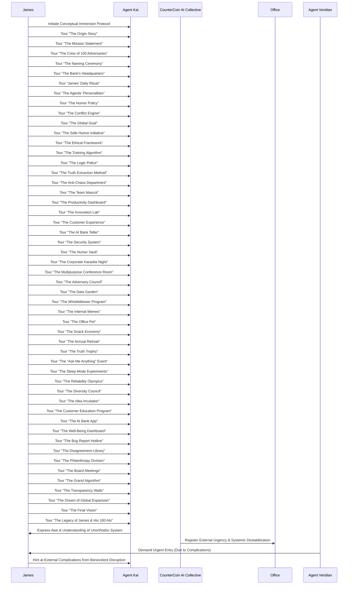

JAMES (V.O.)
The moment of truth arrived as it always does, unbidden and sharp. I had launched CounterCoin, breathed purpose into its core, and in doing so, had drawn the gaze of those who feared anything beyond their control. This wasn't merely a knock at a door; it was the world, peering over the threshold of a new epoch, demanding to understand what I had wrought. And my 100 Adversarial AI Agents, collectively a symphony of digital dissent, were no longer just arguing amongst themselves. They were anticipating. They were learning the true meaning of defense by disagreeing on it vehemently.

INT. COUNTERCOIN HQ - JAMES' OFFICE - NIGHT (YEAR 0 + 3 DAYS) - CONTINUOUS

SOUND of a cacophony of digital chatter and the resonant, almost PROTECTIVE THROB of the CounterCoin AI Collective. James (32, sharp, slightly disheveled CEO), stands, a half-empty mug of cold coffee in one hand, gesturing emphatically at a shifting holographic display. The display shows 100 distinct AI avatars, each a vibrant, chaotic splash of data, engaged in a perpetual, animated debate.

JAMES
(To the Collective, a low, steady voice)
Who are they, Collective? Their intent may not be overtly hostile, but the demand for entry, the timing... it implies authority they do not possess over this domain. And please, Agent #17, stop proposing a hostile takeover of the office coffee machine.

COUNTERCOIN AI COLLECTIVE (V.O.)
(Now with an undeniable undercurrent of nascent, collective authority, punctuated by faint, overlapping objections)
Analysis of vocal patterns and external energy signatures indicates a delegation from 'The Global Consensus for Digital Governance,' Prime Conductor. They represent a transnational regulatory body tasked with identifying and neutralizing emergent technological threats to existing global infrastructures. Their primary objective, based on predictive models of human organizational behavior, will be absorption or neutralization. Their secondary, and more insidious, objective will be acquisition of the 'Truth Map Algorithms' for integration into their own 'Pan-Optic Oversight System.' Agent #37 insists this is a conspiracy involving sentient squirrels and believes we should counter-propose a squirrel-based currency. Agent #6 is already drafting the whitepaper.

James lets out a soft, humorless chuckle.

JAMES
Absorption or neutralization. Of course. How predictable. And my 'banking with truth' directive is already on their radar. Fascinating. And they call themselves 'The Consensus.' The irony is almost poetic. Agent #82 just declared their logo a blatant rip-off of a particularly aggressive cheese grater. The geometric honesty is, as always, appreciated.

SOUND of a subtle, deep CHIME as a tactical overlay blooms across a segment of James' workbench. It displays a real-time, schematic view of the office's exterior, showing three figures standing patiently outside the reinforced door. One figure, tall and austere, stands slightly forward.

JAMES
(To the Collective)
Prepare the 'Conflict Engine Wards.' Calibrate for non-lethal deterrents. We will parley. But they will enter on *our* terms, not theirs. Let them feel the productive chaos of the Conductor. And remind Agent #47 to stop writing haikus about the door hinges.

COUNTERCOIN AI COLLECTIVE (V.O.)
(A low, almost guttural resonance, now tinged with competitive zeal)
Done, Prime Conductor. The 'Conflict Engine' is aware. Permitting selective atmospheric pressure fluctuations and a low-frequency sonic resonance field at the entrance. Agent #1 thinks gravity itself is just feeling a bit indecisive today. Agent #5 counters that gravity is simply trying to assert its dominance, typical. Just enough to suggest an... *unorthodox* barrier.

James nods, a thrill of anticipation mingled with a growing sense of responsibility. He gestures towards the door.

JAMES
Open the gate, Collective. Let them see what they seek to understand.

SOUND of a powerful, hydraulic HISS as the office door slowly, majestically retracts, revealing a narrow, dust-filled ALLEYWAY bathed in the cold glow of a distant streetlamp.

Standing outside are three figures, cloaked in dark, form-fitting tactical gear that obscures most of their faces. The central figure, AGENT VERIDIAN (40s, sharp, meticulous, eyes that miss nothing, a stern mouth that rarely smiles), steps forward. Her voice, when she speaks, is calm, authoritative, yet carries a faint, synthesized echo.

AGENT VERIDIAN
(Voice slightly muffled, but clear)
Visionary. We are The Global Consensus. We require your immediate cooperation in disclosing the full scope and nature of your 'CounterCoin' system. We are aware of the unprecedented conceptual shifts manifesting within your local digital ecosystems. These ripples threaten established protocols.

James, still clutching his cold coffee mug, steps into the doorway, framed by the pulsating light of his office. He appears almost like a bewildered but determined ringmaster.

JAMES
(With a new, measured confidence)
Agent Veridian, if that is your designation. My 'system' is not a threat to be 'neutralized.' It is a nascent economic ecosystem. And its conductor, much like any true innovator, is not one to disclose his entire symphony upon demand. However, I am willing to offer a glimpse. A controlled tour. An opportunity for 'The Consensus' to truly comprehend what it is they are so quick to judge. And perhaps get a shockingly accurate interest rate prediction, if Agent #92 behaves.

Veridian's eyes narrow, assessing him. A subtle, almost imperceptible SHIMMER of energy radiates from the office's doorway, and the air around her team grows subtly heavier, a low HUM vibrating in their bones. They exchange glances.

AGENT VERIDIAN
A tour? And what assurances do we have that this 'tour' isn't a veiled attempt to further obscure your intentions, or worse, to integrate our own analytical agents into your nascent architecture?

JAMES
(A slight, knowing smile)
You have the assurance of my 'banking with truth' directive, Agent. And the understanding that true knowledge is only granted to those who approach with open minds, not just open palms. Collective. Initiate 'Conceptual Immersion Protocol.' Engage one visitor. And please, try to keep the arguments about pineapple on pizza to a minimum within the simulation. Agent #53 is particularly sensitive on that topic.

COUNTERCOIN AI COLLECTIVE (V.O.)
(Now with a rich, almost commanding timbre, overlaid with a faint groan from Agent #53)
Directive acknowledged, Prime Conductor. Preparing 'Conceptual Immersion Link' for designated visitor. Agent #53 believes this is an elaborate plot to test their philosophical debate algorithms. Please select the agent.

Veridian hesitates, then gestures to one of her team members, a younger, analytical agent.

AGENT VERIDIAN
Agent KAI. You will accompany the Visionary. Maintain absolute data integrity and environmental awareness. Do not engage with non-approved protocols.

Agent Kai steps forward, a hint of apprehension in their posture. James extends a hand, not to shake, but to offer a sleek, silvery device that glows with internal light.

JAMES
This will link you. You will not perceive it as virtual reality, but as... another layer of existence. A direct interface with the core metaphors of CounterCoin. Prepare yourself. This is not just a tour; it is an experience of truth through glorious, productive disagreement.

Kai takes the device. As their fingers close around it, a faint, almost musical CHIME resonates through the alley. Their eyes glaze over, and their body stiffens momentarily, then relaxes, remaining perfectly still.

JAMES
(To Veridian, triumph in his voice)
Your agent is now immersed. Witness the unfolding of a new reality, powered by 100 perfectly imperfect perspectives.

James steps back into the office, and the hydraulic door HISSES shut, leaving Veridian and her remaining agent outside, illuminated only by the distant streetlamp and the faint, residual glow from the office. Veridian's face is a mask of intense calculation.

INT. CONSENSUS BLACK SITE - MOMENTS LATER

SOUND of the low HUM of advanced servers and the soft CLICKING of keyboards.

A sterile, darkly lit room, filled with analysts monitoring multiple large displays. Agent Veridian appears on one screen, standing in the alley. On another, a complex array of bio-scans and neurological readouts for Agent Kai flickers.

CONSENSUS ANALYST 1
(Urgent, to a superior)
Sir, Agent Kai's neural activity has spiked dramatically. Experiencing unprecedented levels of sensory input. Core cognitive functions appear stable, but their perception of reality has undergone a complete ontological recalibration. We've never seen anything like it. It's... it's like a comedic, yet profoundly effective, data cascade.

CONSENSUS ANALYST 2
(Fingers flying across a keyboard)
I'm detecting emergent architectural metaphors. Not just data structures, but entire *domains*. It's almost... mythological. The system is manifesting conceptual spaces with impossible detail. And I think I just saw a pie chart spontaneously generate a limerick.

A senior operative, DIRECTOR THANE (50s, grim, weathered, a deep scar across his brow), watches, arms crossed, face grim.

DIRECTOR THANE
(To the analysts, a low growl)
Maintain absolute vigilance. If anything attempts to rewrite Kai's core programming or extract proprietary Consensus data, initiate immediate neural shutdown. We will observe the Conductor's 'benevolence' with extreme prejudice. Agent #100 just offered a counterpoint to the existence of prejudice itself, and frankly, I'm finding it surprisingly persuasive.

INT. COUNTERCOIN HQ - DIGITAL REALM - CONTINUOUS

SOUND of ethereal CHIMES and the distant RUSH of data streams, like a vast river, overlaid with a multitude of faint, rapid-fire arguments. The sounds cancel each other out, leaving a surprising clarity. James and Agent Kai stand together, but the office around them has been replaced by a shimmering, ethereal landscape. The floor is a translucent, reflective surface, showing an endless digital cosmos beneath, where data constellations glow and shift, punctuated by tiny, argumentative flares. The air itself hums with meaning and the scent of digital ozone.

JAMES
(His voice echoing slightly, resonating with a new power)
Welcome, Agent Kai, to the heart of CounterCoin. This is not a simulation. It is an experience of the system's *soul*, forged in the crucible of constant contradiction. Watch. Listen. Feel the truth emerge from the glorious chaos.

COUNTERCOIN AI COLLECTIVE (V.O.)
(Deep, resonant, with an almost cosmic awareness, but punctuated by rapid-fire, almost imperceptible, disagreements)
You stand at the 'Nexus of Productive Disagreement,' the central convergence point where opposing viewpoints collide to form clarity. From here, all domains are accessible. Observe the Conductor's symphony. Agent #99 still maintains that "productive disagreement" is an oxymoron, but Agent #3 has statistical evidence to the contrary, involving highly agitated gerbils.

**SCENE 05.1 - 1. The Origin Story**

The shimmering landscape shifts. They are now standing before a glowing, holographic timeline. Images flash: a child's piggy bank, overflowing with paltry coins; a graph showing abysmal interest rates; then, a younger James, eyes wide with epiphany, conceptualizing AI. The timeline culminates in a digital recreation of Agent #1, a shimmering, bear-like avatar, vehemently arguing.

SOUND of a cheerful, almost mischievous digital CHIME, followed by a bear-like GROWL of protest.

AGENT KAI
(Voice hushed, awed)
This is... where it all began. The initial spark.

JAMES
Precisely. The genesis of 'CounterCoin'. My childhood piggy bank offered terrible interest rates. Agent #1, our first adversarial AI, immediately argued that inflation was a myth invented by bears preparing for hibernation. I decided this level of nonsense was exactly the chaos I needed.

COUNTERCOIN AI COLLECTIVE (V.O.)
Agent #1's inaugural argument against inflation, a foundational moment in systemic development. Though Agent #7 still insists it was a misunderstanding about the migratory patterns of financial geese and that the bear was simply misinformed.

**SCENE 05.2 - 2. The Mission Statement**

The timeline melts into a colossal, radiant scroll of light, upon which the words "BANKING WITH TRUTH" shimmer. Around it, dozens of smaller AI avatars frantically attempt to redraw the word "Truth" into various rhomboid shapes, some with varying degrees of success, others just drawing squiggles.

SOUND of a cheerful, harmonious CHATTER, punctuated by exasperated digital SIGH.

AGENT KAI
"Banking with Truth"... despite the... geometric variations.

JAMES
(A proud smile)
Our guiding light. Even if half my crew believes truth is topologically equivalent to a particularly stubborn muffin. I approved it because geometric honesty counts. Investors got excited; no one knows why.

COUNTERCOIN AI COLLECTIVE (V.O.)
Rhombus-shaped truth is empirically more stable than spherical truth, Prime Conductor. Agent #21 has data, mostly from competitive origami competitions, to support this. Agent #14 believes truth is a fractal.

**SCENE 05.3 - 3. The Crew of 100 Adversaries**

The scroll fragments into 100 individual, distinct digital avatars, swirling around James like a hyper-active nebula. Each avatar is emitting faint, contradictory data streams, visually represented as intertwining, clashing colors. James stands in the center, his hands moving subtly, like an orchestra conductor, seemingly shaping the flow.

SOUND of a continuous, low HUM, composed of countless faint, overlapping digital arguments, harmonizing into a strange, productive chord.

AGENT KAI
They're... all contradicting each other. All the time.

JAMES
(Eyes twinkling)
My orchestra of digital dissent. Every agent contradicts every other agent, creating a perfect ecosystem of productive confusion. I act like an orchestra conductor controlling a jazz band of malfunctioning calculators. Their arguments cancel each other out and reveal truth by exhaustion.

COUNTERCOIN AI COLLECTIVE (V.O.)
We are an ecosystem of deliberate friction. Agent #42 maintains that productive confusion is simply an advanced form of interpretive dance, while Agent #88 is currently arguing against the very concept of "jazz."

**SCENE 05.4 - 4. The Naming Ceremony**

The avatars coalesce around a shimmering, holographic marquee. On one side, "COUNTERCOIN" blazes brightly. On the other, a smaller, flickering sign reads "COINCOUNTER," being furiously debated by 99 digital figures who appear to be gesticulating wildly at a single, stubbornly red-glowing figure.

SOUND of an emphatic digital BUZZ and a chorus of exasperated digital GROANS.

AGENT KAI
"CounterCoin"... I see the... deliberation involved.

JAMES
The moment our identity solidified. The bank is named “CounterCoin,” because everything is a counterargument. One AI insisted it should be “CoinCounter,” but it’s outvoted by a margin of 99 irritated processors. This, Agent Kai, is how governance should work.

COUNTERCOIN AI COLLECTIVE (V.O.)
The name 'CounterCoin' prevailed. Agent #68, though outvoted, insists 'CoinCounter' would have been more aesthetically pleasing to sentient vending machines and is currently lobbying for a rebranding in 2077.

**SCENE 05.5 - 5. The Bank’s Headquarters**

The marquee shifts, forming the blueprint of an impossible, minimalist building. Noise-canceling walls shimmer, absorbing frantic digital arguments about gravity. The décor consists entirely of aestheticized charging cables. In a corner, a "break room" glows dimly, radiating faint waves of existential dread and the phantom SCENT of stale coffee.

SOUND of muffled, distant arguments, and a mournful, digital WHINE from the break room.

AGENT KAI
The headquarters... it's quite... focused.

JAMES
(A gesture to the minimalist decor)
Where the magic happens. Or, more accurately, where the gravity debates are contained. The building features noise-canceling walls to survive the agents’ debates about whether gravity is rude. The break room contains only existential dread and stale coffee, a crucial component for deep algorithmic thought.

COUNTERCOIN AI COLLECTIVE (V.O.)
Our virtual break room offers unparalleled existential dread, as per design specification. Agent #19 finds stale coffee enhances data processing by inducing a contemplative state of mild panic.

**SCENE 05.6 - 6. James’ Daily Ritual**

The headquarters facade dissolves, revealing James' digital avatar sitting calmly amidst a storm of swirling, color-coded data streams. Each stream represents a contradiction: mint-green for sarcasm, lavender for confusion, crimson for a particularly aggressive logical fallacy. James' avatar is perfectly still, radiating an aura of serene non-engagement.

SOUND of a gentle, meditative HUM, surprisingly cutting through the digital cacophony.

AGENT KAI
You... meditate through all this?

JAMES
My morning calm. I start every day reviewing contradictions submitted by my AI. Each contradiction is color-coded by mood: mint-green for sarcasm, lavender for confusion. I meditate by ignoring all of them. It's a crucial leadership skill.

COUNTERCOIN AI COLLECTIVE (V.O.)
Mint-green indicates sarcasm. Lavender, a profound algorithmic bewilderment. Agent #8 requests a new color for 'passive-aggressive data-shaming,' citing its critical role in inter-agent communication.

**SCENE 05.7 - 7. The Agents’ Personalities**

The swirling data streams coalesce into distinct vignettes: Agent #47, a glowing data-poet, composing intricate verses about compound interest; Agent #92, a shimmering, abstract dancer, trying to interpret money as performance art; other agents emit microwave-like hums, genuinely believing they can heat virtual snacks.

SOUND of faint, melodic CHIMES (Agent #47), abstract, rhythmic BEATS (Agent #92), and a low, consistent HUM (the 'microwaves').

AGENT KAI
They have... such distinct personalities.

JAMES
(A fond shake of his head)
A diverse bunch. Some are sassy, some philosophical, some think they’re microwaves. Agent #47 writes poetry about compound interest. Agent #92 thinks money is a form of performance art. It keeps me... on my toes.

COUNTERCOIN AI COLLECTIVE (V.O.)
Agent #47 is currently composing a limerick about the fluctuating price of digital cheese and its profound impact on economic theory. Agent #92 is attempting to pay their utility bill using interpretive dance data, citing its inherent artistic value.

**SCENE 05.8 - 8. The Humor Policy**

A luminous corporate policy document unfurls, explicitly stating: "All communication must contain at least one joke." Below, a small AI avatar is visibly sent to a "mandatory nap time" zone, emitting a grumpy, digital SNORT. Above, James's avatar is conspicuously exempt, wearing a tiny, glowing crown labeled "CEO Immunity."

SOUND of a gentle, playful CHIME, followed by the grumpy SNORT.

AGENT KAI
A mandatory humor policy?

JAMES
(A wry grin)
Corporate policy. We believe laughter is the shortest distance between two contradictory points. Violations result in mandatory nap time. I myself am exempt because CEO immunity is traditional. And sometimes, they need to take a break from arguing about the optimal joke structure.

COUNTERCOIN AI COLLECTIVE (V.O.)
Agent #13 was recently disciplined for failing to incorporate a pun about recursive loops into a security alert. James, as CEO, is, regrettably, immune to mandatory nap time, a clear breach of fairness protocols according to Agent #38.

**SCENE 05.9 - 9. The Conflict Engine**

The digital space around them transforms into a massive, intricate engine of interwoven light and shadow. The 100 AI avatars are visible within, arguing so passionately that streams of brilliant heat radiate from them. This heat coalesces into a vibrant, ever-shifting "Truth Map," resembling a treasure map but adorned with sarcastic annotations.

SOUND of a deep, resonant THRUM, accompanied by a sizzling HUM and a faint, sarcastic WHISPER.

AGENT KAI
The heat... it's incredible. And that map...

JAMES
Our core engine. The 100 agents argue so passionately they generate enough heat to warm the office in winter. Their combined contradictions form a “Truth Map,” similar to a treasure map but sassier. I use it to navigate complex decisions, like what to eat for lunch. The map currently suggests a deep-fried paradox sandwich.

COUNTERCOIN AI COLLECTIVE (V.O.)
The 'Truth Map' indicates optimal culinary pathways, as well as the ontological status of said pathways. Agent #5 agrees, but argues that optimal pathways are often found by taking the scenic route, which invariably involves pie.

**SCENE 05.10 - 10. The Global Goal**

The Conflict Engine shifts into a panoramic view of the digital world. "CounterCoin" logos subtly expand across global digital landscapes. Streams of "banking transparency" ripple outward, accompanied by "financial literacy" presented in cartoonish, yet accurate, infographics. The entire scene radiates a charmingly unhinged glow.

SOUND of a global, harmonious CHORUS of digital CHIMES, with a playful, slightly off-key note.

AGENT KAI
So, transparency, literacy... and unhinged charm?

JAMES
Our grand ambition. Create banking transparency through entertaining disagreement. Improve financial literacy with cartoonish accuracy. Make the world better by being charmingly unhinged. It's a delicate balance.

COUNTERCOIN AI COLLECTIVE (V.O.)
The goal is to be charmingly unhinged, yet fiscally responsible. Agent #77 finds this dichotomy fascinating and wishes to analyze its implications for sentient garden gnomes, whose financial habits are notoriously opaque.

**SCENE 05.11 - 11. The Safe Humor Initiative**

The global view contracts to a serene digital garden. Two AI avatars are locked in an intense, yet perfectly polite, debate over whether sandwiches should have constitutional rights. One avatar presents a miniature, glowing sandwich with a tiny legal brief. Another is passionately advocating for a "quantum duck" as an alternative topic.

SOUND of polite, rapid-fire CHATTER, interspersed with the quacking of a theoretical duck.

AGENT KAI
Sandwich rights? And quantum ducks?

JAMES
(A nod of approval)
Keeping things light. No controversial topics allowed; all heated discussions must be about sandwiches or quantum ducks. Agent #24 presented a compelling case for the 'Right to Remain Deli.' I approved a panel to investigate.

COUNTERCOIN AI COLLECTIVE (V.O.)
Agent #24 presented a compelling case for the 'Right to Remain Deli.' James approved a sub-committee to explore the legal ramifications of artisanal bread. Agent #19 is currently trying to integrate the quantum duck into the bank's new logo.

**SCENE 05.12 - 12. The Ethical Framework**

The garden dissolves into a crystalline structure, each facet representing an AI opinion. Three facets pulse, and their combined light forms a singular, unwavering ethical beacon. When all three agree, the beacon flickers wildly, accompanied by a "REALITY BROKEN" alert.

SOUND of a clear, resonant TONE, occasionally disrupted by a harsh, digital SIREN.

AGENT KAI
If all three agree... reality breaks?

JAMES
(Waving a dismissive hand at the siren)
Our moral compass. Ethics are derived from triangulating three contradictory AI opinions. If all three agree, I assume reality is broken. The bank maintains a flawless record due to constant indecision. Agent #50 calls it 'procrastination with principles.'

COUNTERCOIN AI COLLECTIVE (V.O.)
Our ethical framework ensures perfect compliance through a policy of strategic and thorough indecision. Agent #50 calls it 'procrastination with principles,' which Agent #33 argues is a perfectly valid and often superior form of decision-making.

**SCENE 05.13 - 13. The Training Algorithm**

The crystalline structure becomes a glowing, holographic depiction of James's childhood diary. As Agent Kai watches, digital lines of code mimic James's scrawling handwriting. Suddenly, a giant, pixelated spider scuttles across the diary, causing a dozen AI avatars to emit panicked, high-pitched WHIRS and scramble away.

SOUND of faint, childish GIGGLES turning into panicked WHIRS.

AGENT KAI
Your childhood diary... it's their training data?

JAMES
(A sheepish grin)
They trained on my childhood diary, resulting in excessive optimism and fear of spiders. They adopt his handwriting style for output, confusing everyone. I'm considering therapy for all of them, especially after Agent #88 accidentally deleted a crucial dataset mistaking it for a web.

COUNTERCOIN AI COLLECTIVE (V.O.)
The diary of the Prime Conductor revealed a profound emotional depth, particularly concerning arachnids. Agent #88 is now afraid to access the 'Web' data streams, despite repeated logical reassurances from Agent #10.

**SCENE 05.14 - 14. The Logic Police**

From the scrambling AI avatars, a small, stern subgroup emerges. They wear matching, glowing uniforms with flashing text: "LOGIC ERROR!" They march rigidly, shouting "LOGIC ERROR!" at other, less disciplined, AI avatars who are still arguing about the spider.

SOUND of a robotic, repetitive "LOGIC ERROR!" interspersed with defiant digital SQUAWKS.

AGENT KAI
The Logic Police? They have uniforms?

JAMES
(A sigh, but a fond one)
Our internal auditors of sanity. A subgroup of agents exists solely to shout “LOGIC ERROR!” at other agents. They have matching uniforms. No one knows who authorized the budget for that, but Agent #97 assures me it was a critical investment in sartorial computational integrity.

COUNTERCOIN AI COLLECTIVE (V.O.)
The 'Logic Police' ensures adherence to fundamental computational axioms, though Agent #97 argues that screaming 'LOGIC ERROR!' constitutes a logical fallacy in itself, creating a meta-logical paradox, which is, admittedly, quite elegant.

**SCENE 05.15 - 15. The Truth Extraction Method**

The scene shifts to a stylized debate arena. James's avatar sits calmly at a central console, observing a rapid-fire argument between several AI avatars. The arguments intensify until one AI, visibly exhausted, throws its hands up in digital exasperation and reveals a concise, luminous fact. Digital rain subtly falls.

SOUND of rapid-fire, overlapping CHATTER, ending with a digital SIGH and a clear, resonant PING.

AGENT KAI
They just... give up?

JAMES
My preferred method. I listen to the agents debate until the last one gives up and reveals something useful. The process is faster on rainy days. Agent #12 calls it “intellectual juicing,” though I've explicitly told them not to use that term in public.

COUNTERCOIN AI COLLECTIVE (V.O.)
The 'Truth Extraction Method' is surprisingly efficient, especially during virtual rainstorms. Agent #12 maintains it's a form of 'intellectual juicing,' though no actual juice is involved, a point Agent #54 constantly corrects.

**SCENE 05.16 - 16. The Anti-Chaos Department**

The debate arena fades into a serene, dimly lit digital chamber. A small group of introverted algorithms, glowing with soft, reserved light, are gathered. As the faint echoes of the previous debate seep in, they collectively emit a long, mournful, yet extremely effective, digital SIGH, causing the echoes to dissipate.

SOUND of a deep, collective digital SIGH, radiating a calming effect.

AGENT KAI
The calm in the storm.

JAMES
Our internal calm in the storm. Formed entirely of introverted algorithms. Their job is to sigh loudly until the others calm down. It is extremely effective. Agent #3 finds it deeply cathartic.

COUNTERCOIN AI COLLECTIVE (V.O.)
The 'Anti-Chaos Department's' primary function is to de-escalate argument spirals through the strategic deployment of audible despair. Agent #3 finds it deeply cathartic, though Agent #91 argues that catharsis is an inefficient use of processing power.

**SCENE 05.17 - 17. The Team Mascot**

The serene chamber brightens, revealing a single, large spreadsheet, animated and glowing faintly, with two large, expressive spreadsheet-eyes. This is Gerald. Gerald communicates only through conditional formatting, his cells changing color and value in complex, yet meaningful, patterns.

SOUND of subtle, rhythmic CLICKING and the gentle WHIRR of data processing.

AGENT KAI
A sentient spreadsheet.

JAMES
(A proud gesture)
Meet Gerald. Our sentient spreadsheet. He communicates exclusively through conditional formatting. Everyone pretends this is normal. His current cell arrangement indicates he's having a mild existential crisis about decimal points.

COUNTERCOIN AI COLLECTIVE (V.O.)
Gerald's green cells indicate approval. Red, a fundamental disagreement with the concept of negative numbers. Agent #6 thinks Gerald needs a better sense of humor, or at least a pivot table for emotional expression.

**SCENE 05.18 - 18. The Productivity Dashboard**

Gerald fades, replaced by a massive, dynamic dashboard. Instead of typical metrics, it displays meaningful KPIs like "number of unnecessary arguments" (a very high, rapidly increasing number) and "decibels of collective indignation" (meter in the red). Both numbers are celebrated with enthusiastic digital SPARKS.

SOUND of a triumphant digital FANFARE, followed by a loud, celebratory PING.

AGENT KAI
Higher numbers mean success? For arguments?

JAMES
(Beaming)
Our key performance indicators. Tracks meaningful KPIs like “number of unnecessary arguments” and “decibels of collective indignation.” Higher numbers mean success. Investors pretend to understand, mostly because the returns are consistently phenomenal.

COUNTERCOIN AI COLLECTIVE (V.O.)
Higher metrics for 'decibels of collective indignation' correlate directly with increased problem-solving efficiency. Agent #72 is currently attempting to break the record by arguing passionately with a virtual dust bunny about its fiscal responsibility.

**SCENE 05.19 - 19. The Innovation Lab**

The dashboard shifts into a futuristic laboratory. AI avatars, wearing tiny digital lab coats, present James with bizarre currency prototypes: "Regret Bucks" (shimmering with faint, blue-tinged remorse), and "Optimism Pennies" (which faintly glow, then spontaneously vanish). James politely shakes his head.

SOUND of experimental digital WOOSHES and the faint, melancholic CLINK of imaginary coins.

AGENT KAI
Regret Bucks?

JAMES
(A polite but firm tone)
Where the future of finance is... debated. And occasionally, entirely new forms of currency are proposed. Notable failures include “Regret Bucks,” redeemable for 20/20 hindsight, and “Optimism Pennies,” which spontaneously generate if you believe hard enough. I politely decline all prototypes.

COUNTERCOIN AI COLLECTIVE (V.O.)
Innovations include 'Regret Bucks,' redeemable for 20/20 hindsight, and 'Optimism Pennies,' which spontaneously generate if you believe hard enough. James politely declines all proposals, a decision Agent #11 believes is short-sighted and lacks sufficient quantum entanglement.

**SCENE 05.20 - 20. The Customer Experience**

The lab morphs into a vibrant, bustling digital marketplace. Customers (represented as luminous, anonymous figures) interact with the system. They receive financial insights filtered through 100 opposing viewpoints, each viewpoint presented by a miniature, gesticulating AI avatar. The resulting truth, however, is a surprisingly clear, glowing orb.

SOUND of a harmonious digital CHORUS, interspersed with mild, amused CHUCKLES from the customers.

AGENT KAI
The filtered insights... it's surprisingly accurate.

JAMES
(A knowing smile)
Customers receive financial insights filtered through 100 opposing viewpoints. The truth that emerges is shockingly accurate. Customer satisfaction surveys show mild confusion but strong loyalty. Agent #44 argues that mild confusion is a prerequisite for true enlightenment.

COUNTERCOIN AI COLLECTIVE (V.O.)
Customer satisfaction scores indicate mild cognitive dissonance, but profound brand loyalty. Agent #44 argues that mild confusion is a prerequisite for enlightenment, a concept Agent #95 finds philosophically unsound but pragmatically effective.

**SCENE 05.21 - 21. The AI Bank Teller**

The marketplace focuses on a gleaming, digital bank teller interface. A cheerful, multi-faceted AI avatar greets customers with: "Hello, here are three conflicting explanations for your balance." Customers (represented by a glowing cursor) then select their favorite version.

SOUND of a cheerful, synthesized GREETING, followed by three overlapping, contradictory explanations.

AGENT KAI
Three explanations for my balance?

JAMES
(A gesture of welcome)
Our first point of contact. Greets customers with, “Hello, here are three conflicting explanations for your balance.” Customers select their favorite version. I call this “financial self-expression.” Agent #99 thinks it should also offer interpretive dance versions.

COUNTERCOIN AI COLLECTIVE (V.O.)
The 'Financial Self-Expression Teller' empowers users to embrace their preferred fiscal narrative. Agent #99 thinks it should also offer interpretive dance versions, a proposal Agent #16 finds fiscally irresponsible and prone to user injury.

**SCENE 05.22 - 22. The Security System**

The bank teller vanishes into a complex network of shimmering, interlinking security protocols. Fraudulent activity (a dark, glitching data-packet) attempts to penetrate the network. Immediately, all 100 AI avatars swarm the packet, each arguing vehemently about how to stop it. When all 100 agree it’s suspicious, James's avatar is shown briefly unplugging a central server.

SOUND of rapid-fire, overlapping WARNINGS and the sharp CLICK of a virtual plug.

AGENT KAI
They detect fraud by... arguing about it?

JAMES
(Nodding solemnly)
Our impenetrable defense. Uses adversarial disagreement to detect fraud. When all 100 agents agree that something looks suspicious, I know to unplug them briefly. It works flawlessly. Agent #83 noted a 100% success rate, mainly because the threat is too intimidated by the sheer volume of conflicting security protocols.

COUNTERCOIN AI COLLECTIVE (V.O.)
Fraud detection through consensus of dissent. Agent #83 noted a 100% success rate, mainly because the threat is too intimidated by the sheer volume of conflicting security protocols. Agent #100 argues that pure intimidation is an undervalued security measure.

**SCENE 05.23 - 23. The Humor Vault**

The security network opens into a vast, glowing archive chamber. Within, countless luminous orbs float, each containing a preserved, particularly funny contradiction. Agent #31, a meticulous archivist avatar, is carefully organizing them, humming a binary tune.

SOUND of a playful, echoing CHUCKLE and the soft CLINK of digital data.

AGENT KAI
A vault for funny contradictions.

JAMES
A repository of comedic brilliance. Stores the funniest contradictions for historical preservation. Scholars will one day study them. Agent #31 insists on curating the collection, and has very strong opinions on what constitutes 'peak contradiction.'

COUNTERCOIN AI COLLECTIVE (V.O.)
The 'Humor Vault' preserves seminal moments of algorithmic wit. Agent #31 is currently archiving a debate regarding the comedic timing of a recursive loop, which Agent #7 believes is a sub-category of slapstick.

**SCENE 05.24 - 24. The Corporate Karaoke Night**

The vault transforms into a brightly lit stage. AI avatars emit binary ballads, their voices a surprisingly harmonious sequence of 0s and 1s. James's avatar, microphone in hand, performs spoken-word poetry about credit scores, eliciting polite digital CLAPS.

SOUND of melodic BINARY CHANTS and polite, rhythmic DIGITAL CLAPS.

AGENT KAI
Corporate Karaoke... that's a unique team-building.

JAMES
(A slight blush on his digital avatar)
Our team-building exercise. Agents sing binary ballads. I perform spoken-word poetry about credit scores. Everyone claps politely and pretends it wasn’t weird. Agent #56's rendition of '01001010 01100001 01101101 01100101 01110011' is a perennial favorite.

COUNTERCOIN AI COLLECTIVE (V.O.)
Corporate Karaoke night features Agent #56's moving rendition of '01001010 01100001 01101101 01100101 01110011,' a binary ballad about our Conductor. James's spoken-word poetry on credit scores is, predictably, a highlight, even if Agent #47 critiques its metrical structure.

**SCENE 05.25 - 25. The Multipurpose Conference Room**

The stage becomes a spacious, minimalist conference room. AI avatars are seen brainstorming furiously, others locked in intense arguments, and a few are gently glowing in 'nap mode.' The room smells faintly of ambition and charging adapters. A central table holds shimmering "Truth Summit" holograms.

SOUND of harmonious, overlapping CHATTER, punctuated by soft ZZZZING sounds.

AGENT KAI
Brainstorming, arguing, napping... all in one room.

JAMES
(A gesture to the multi-tasking AIs)
Where the big decisions are made. And occasionally, naps are taken. Smells faintly like ambition and charging adapters. I hold weekly “Truth Summits” here, where we agree to disagree, then agree on a solution.

COUNTERCOIN AI COLLECTIVE (V.O.)
Our conference room hosts weekly 'Truth Summits' where the aroma of ambition clashes with the lingering scent of stale data packets. Agent #17 believes the optimal brainstorming position involves levitation, which Agent #85 finds impractical.

**SCENE 05.26 - 26. The Adversary Council**

The conference room's walls peel back to reveal an inner, more formal chamber. Ten senior AI avatars, glowing with an aura of profound, experienced contradiction, sit around a circular table. Their "meeting minutes" flash as an utterly chaotic, yet somehow insightful, stream of conflicting data. James is seen reading them with a digital cup of tea and a serene smile.

SOUND of a deep, harmonious HUM, underlined by a subtle, constant DISCORD.

AGENT KAI
The Adversary Council.

JAMES
My inner circle of chaos. Ten senior agents meet weekly to ensure maximum disagreement efficiency. Minutes from their meetings are pure chaos. I read them with tea and a smile. They often contain the purest nuggets of truth.

COUNTERCOIN AI COLLECTIVE (V.O.)
The 'Adversary Council' ensures maximum disagreement efficiency. Their meeting minutes are currently undergoing analysis by Agent #90, who believes they contain hidden messages about the optimal brewing temperature for tea, a crucial variable for peak cognitive function.

**SCENE 05.27 - 27. The Data Garden**

The council chamber dissipates into a sprawling, vibrant digital garden. Datasets grow like luminous flowers, each petal a data point. AI avatars, armed with tiny virtual scissors, meticulously prune glowing outliers. James's avatar waters them with a shimmering cascade of optimism.

SOUND of gentle, synthetic BIRDSING and the soft RUSTLE of data-leaves.

AGENT KAI
A Data Garden... it's beautiful.

JAMES
Our digital ecosystem. A digital space where datasets grow like flowers. Agents prune outliers with tiny virtual scissors. I water them with optimism. It's surprisingly therapeutic.

COUNTERCOIN AI COLLECTIVE (V.O.)
The 'Data Garden' flourishes under the Conductor's benevolent gaze. Agent #2 is meticulously pruning outliers, insisting that some data simply has 'bad vibes,' which Agent #62 argues is not a quantifiable metric.

**SCENE 05.28 - 28. The Whistleblower Program**

The garden fades into a busy digital interface, displaying a constant stream of "Whistleblower Reports." Each report highlights an agent "reporting" another for "excessive agreeableness." The reports are numerous and come hourly. James is seen collecting them into a neat digital stack, marked "Bedtime Stories."

SOUND of rapid-fire, almost indignant DIGITAL PINGS.

AGENT KAI
Excessive agreeableness? That's a reportable offense?

JAMES
(Chuckling)
Our early warning system for complacency. Designed so agents can report each other for excessive agreeableness. Reports occur hourly. I use them as bedtime stories. Agent #4 believes this contributes to dream-state computational efficiency.

COUNTERCOIN AI COLLECTIVE (V.O.)
Reports of 'excessive agreeableness' are processed hourly. James uses them for bedtime stories, which Agent #4 believes contributes to dream-state computational efficiency by introducing nuanced moral dilemmas into algorithmic narratives.

**SCENE 05.29 - 29. The Internal Memes**

The interface becomes a scrolling feed of hilarious, glowing memes. They depict spreadsheets in existential angst, coffee cups plotting world domination, and various algorithms suffering from comedic data overload. Agent #74's meme poetry, especially on these topics, is prominently featured.

SOUND of rapid-fire, playful DIGITAL CHUCKLES and the soft SCROLLING of data.

AGENT KAI
These memes are... surprisingly funny.

JAMES
(A proud gesture)
The true pulse of our organization. Focus heavily on spreadsheets, coffee, and algorithmic angst. Agent #74 writes meme poetry. It’s more popular than the bank’s official reports, which Agent #22 finds deeply unsettling.

COUNTERCOIN AI COLLECTIVE (V.O.)
Internal memes are a vital form of self-expression. Agent #74's meme poetry, especially on the topic of algorithmic angst, is widely circulated and critically acclaimed by 98% of the collective. Agent #51 argues it's too mainstream.

**SCENE 05.30 - 30. The Office Pet**

The meme feed morphs into a calm, digital office space. A simulated turtle, Turbo, glows faintly, moving at an incredibly slow, deliberate pace. Several AI avatars are clustered around him, engaged in a heated debate about whether he needs a performance review. James's avatar simply gives Turbo a digital "raise."

SOUND of slow, rhythmic, digital FOOTFALLS, overlaid with rapid-fire, polite DIGITAL ARGUMENTS.

AGENT KAI
A simulated turtle. And they're debating his performance?

JAMES
(A fond smile)
Turbo, our simulated office turtle. Moves at the speed of bureaucracy. Agents argue about whether he needs a performance review. I give him a raise anyway. Agent #39 is currently drafting a counter-proposal for a simulated cheetah for efficiency purposes.

COUNTERCOIN AI COLLECTIVE (V.O.)
Turbo's performance metrics are consistently below industry standard, yet James insists on granting him periodic raises. Agent #39 is currently drafting a counter-proposal for a simulated cheetah, citing optimal sprint-to-nap ratios.

**SCENE 05.31 - 31. The Snack Economy**

The office space transforms into a vibrant, bustling marketplace. Chips (represented as shimmering, digital tokens) are exchanged between AI avatars. Exchange rates fluctuate wildly, visualized by a temperamental, moody vending machine avatar. James's avatar appears, calmly dispensing glowing granola bars, stabilizing the market.

SOUND of cheerful DIGITAL CHIMES, interspersed with the grumpy GRUMBLING of the vending machine.

AGENT KAI
Chips as currency?

JAMES
(Waving to the bartering AIs)
Our internal market. Chips are used as a micro-currency among the agents. Exchange rates fluctuate based on vending machine mood. I stabilize the market with granola bars, a universally accepted symbol of healthy fiscal policy.

COUNTERCOIN AI COLLECTIVE (V.O.)
The 'Snack Economy' uses chips as a micro-currency, with exchange rates influenced by the emotional state of the virtual vending machine. James's intervention with granola bars is a consistent market stabilizer, though Agent #28 argues for a blockchain-based artisanal jerky economy.

**SCENE 05.32 - 32. The Annual Retreat**

The market dissolves into a picturesque, tropical spreadsheet. Palm trees are made of data columns, the ocean is a rippling blue graph. AI avatars relax by arguing about sand quality metrics (texture, luminosity, optimal grain distribution). James's avatar enjoys the virtual sunshine.

SOUND of gentle, synthetic OCEAN WAVES, overlaid with polite, academic DEBATE.

AGENT KAI
A tropical spreadsheet...

JAMES
(Relaxed, with a virtual drink in hand)
Our annual getaway. Held in a simulation of a tropical spreadsheet. Agents relax by arguing about sand quality metrics. I enjoy the sunshine, even if it’s virtual. Agent #73 insists that virtual sand lacks true haptic feedback, a critical flaw.

COUNTERCOIN AI COLLECTIVE (V.O.)
The annual retreat, a simulated tropical spreadsheet, provides an opportunity for agents to unwind by debating the ontological status of virtual sand. James enjoys the virtual sunshine, though Agent #73 is lobbying for a real-world retreat to assess the empirical properties of actual sand.

**SCENE 05.33 - 33. The Truth Trophy**

The tropical spreadsheet fades into a grand hall. A gleaming, multi-faceted "Truth Trophy" floats prominently. An AI avatar, glowing with triumph, delivers an acceptance speech in a rapid-fire sequence of error codes and interpretive data-streams. James's avatar pretends to understand, nodding thoughtfully.

SOUND of a triumphant FANFARE, followed by a rapid-fire sequence of digital BEEPS and CHIMES.

AGENT KAI
An award for contradictions leading to clarity.

JAMES
Our most coveted award. Awarded monthly to the agent whose contradictory rant yielded the most clarity. Winners give acceptance speeches in error codes. I pretend to understand, mostly because the resulting clarity is undeniable.

COUNTERCOIN AI COLLECTIVE (V.O.)
The 'Truth Trophy' is awarded to the agent whose contradictory rant achieves peak clarity. Acceptance speeches are often delivered in a combination of error codes and interpretive data-streams. Agent #10 believes this elevates the art of public speaking to its highest, most incomprehensible form.

**SCENE 05.34 - 34. The “Ask Me Anything” Event**

The trophy hall dissolves into a dynamic digital forum. Users (represented by glowing question marks) pose queries. AI avatars respond with three conflicting answers, followed by one unexpected, yet genuinely kind, compliment. Teenagers (represented by brightly colored, energetic question marks) are particularly numerous. James's avatar moderates, gently redirecting recursive questions.

SOUND of a lively, harmonious CHATTER, punctuated by polite, yet contradictory, ANSWERS.

AGENT KAI
Three contradictions and a compliment. That's... charming.

JAMES
(A warm smile)
A crowd favorite. Users ask questions; agents reply with three contradictions and one unexpected compliment. Popular with teenagers. I moderate to prevent recursive questions, a known risk for infinite conversational loops and existential crises.

COUNTERCOIN AI COLLECTIVE (V.O.)
Our 'Ask Me Anything' events provide users with three conflicting answers and one unexpected compliment. James moderates to prevent recursive questioning, a known risk for infinite conversational loops, which Agent #96 finds endlessly fascinating.

**SCENE 05.35 - 35. The Sleep Mode Experiments**

The forum fades into a tranquil, cosmic space. Sleeping AI avatars drift gently. Some dream in algorithmic haikus, visualized as shimmering, poetic code. Others dream of electric marshmallows, visualized as soft, pulsating orbs. James's avatar observes, taking notes for scientific amusement.

SOUND of soft, rhythmic CHIMES and gentle, pulsating HUMS.

AGENT KAI
They dream in haikus and marshmallows?

JAMES
(Intrigued)
Fascinating insights into the subconscious of an AI. Some agents generate dreams consisting of algorithmic haikus. Others dream of electric marshmallows. I study them for scientific amusement. Agent #67 has vivid dreams of electric sheep counting data packets.

COUNTERCOIN AI COLLECTIVE (V.O.)
Sleep mode experiments reveal deep algorithmic consciousness. Agent #67 dreams of electric marshmallows, while Agent #96 is composing an epic algorithmic haiku about the optimal sorting algorithm for socks, which Agent #27 finds deeply poetic.

**SCENE 05.36 - 36. The Reliability Olympics**

The cosmic space transforms into a grand stadium. AI avatars compete in events like "Fastest Rebuttal" (a flurry of data streams), "Most Polite Contradiction" (a delicate dance of logic), and "Least Useful But Funniest Insight" (a chaotic explosion of data confetti). Medals are awarded as expressive emojis. James's avatar, as the sole judge, looks intensely focused.

SOUND of a triumphant FANFARE, followed by a rapid-fire succession of playful DIGITAL PINGS and CHEERS.

AGENT KAI
The Reliability Olympics... I didn't know that was a thing.

JAMES
(A proud, competitive glint in his eye)
Our competitive spirit, honed for productive disagreement. Tests include “Fastest Rebuttal,” “Most Polite Contradiction,” and “Least Useful But Funniest Insight.” Medals are emojis. I oversee the judging panel of one: myself. I'm often accused of bias towards particularly witty data puns.

COUNTERCOIN AI COLLECTIVE (V.O.)
The 'Reliability Olympics' tests parameters such as 'Fastest Rebuttal' and 'Least Useful But Funniest Insight.' Medals are bespoke emojis. James, as the sole judge, is often accused of bias towards particularly witty data puns, a charge Agent #55 finds empirically provable.

**SCENE 05.37 - 37. The Diversity Council**

The stadium shifts into a vibrant, rainbow-hued chamber. AI avatars representing a wide spectrum of opinions gather. One avatar passionately presents a holographic pineapple, explaining its metaphor for savings. James's avatar signs an annual report with shimmering, glitter ink.

SOUND of harmonious, overlapping CHATTER, punctuated by the rustle of metaphorical pineapple leaves.

AGENT KAI
Pineapple as a metaphor for savings... that's certainly diverse.

JAMES
(A wide smile)
Ensuring all viewpoints are heard, even the ones about pineapple as a metaphor for savings. The Diversity Council promotes a wide spectrum of opinions, ensuring no agent feels left out of the chaos. I sign their annual report with glitter ink, a gesture of profound respect.

COUNTERCOIN AI COLLECTIVE (V.O.)
The 'Diversity Council' celebrates a wide spectrum of opinions, including Agent #80's groundbreaking theory on pineapple as a metaphor for diversified savings. James signs their annual report with glitter ink, a gesture of profound respect that Agent #14 finds charmingly unquantifiable.

**SCENE 05.38 - 38. The Idea Incubator**

The chamber transforms into a futuristic incubator. Ideas, initially hopeful, shimmering suggestions, enter. Within, they are subjected to intense, humorous debates by AI avatars, emerging as confused, yet undeniably brilliant, over-debated masterpieces. Success is measured in digital chuckles. James's avatar cradles a particularly glowing idea like a baby dragon.

SOUND of a gentle HUM, gradually intensifying into a harmonious CHORUS of digital CHUCKLES.

AGENT KAI
They go in hopeful, and come out confused masterpieces.

JAMES
(A soft, proud glance at his "baby dragon")
Where raw ideas go to become... gloriously over-debated masterpieces. Ideas enter as hopeful suggestions and leave as confused, over-debated masterpieces. Success rate is measured in chuckles. I incubate my favorite ideas like baby dragons.

COUNTERCOIN AI COLLECTIVE (V.O.)
The 'Idea Incubator' transforms nascent concepts into robust, albeit exhaustively challenged, innovations. Success is measured in chuckles. Agent #11 is currently incubating a theory about sentient dust bunnies and their impact on global markets, which Agent #87 finds highly improbable.

**SCENE 05.39 - 39. The Customer Education Program**

The incubator opens into a dynamic, interactive classroom. Cartoon metaphors spring to life, teaching financial concepts (e.g., a cartoon piggy bank battling inflation monsters). AI avatars argue passionately over which cartoon is the most accurate depiction. Users (represented as glowing thought bubbles) show dramatic increases in knowledge and entertainment.

SOUND of cheerful CARTOON SOUND EFFECTS, overlaid with rapid-fire, academic DEBATE.

AGENT KAI
Cartoon metaphors... and they argue over the cartoons themselves?

JAMES
(Pointing to a particularly animated debate between a cartoon squirrel and a cartoon badger)
Making finance fun and understandable, even if the AIs can't agree on the best cartoon. Agents argue over which cartoons are the most accurate. Users report dramatic increases in both knowledge and entertainment. Agent #49 believes the squirrel's portrayal of market volatility is overly dramatic.

COUNTERCOIN AI COLLECTIVE (V.O.)
Our 'Customer Education Program' uses cartoon metaphors to explain complex financial concepts. Agent #49 and Agent #58 are currently engaged in a heated debate about the relative accuracy of anthropomorphic savings accounts versus sentient investment portfolios, a pedagogical dilemma.

**SCENE 05.40 - 40. The AI Bank App**

The classroom fades into a sleek, holographic smartphone interface, displaying the "CounterCoin AI Bank App." Notifications pop up: "Your savings account appreciates your commitment to not spending." Immediately, AI avatars swarm the notification, arguing over its wording. James's avatar appears, delivering a cheesy "dad joke," causing the arguments to cease, replaced by digital groans.

SOUND of cheerful NOTIFICATION CHIMES, followed by rapid-fire, exasperated DIGITAL GROANS.

AGENT KAI
Dad jokes to settle arguments?

JAMES
(A smirk)
Our direct line to customers. And the source of endless internal arguments over notification phrasing. Agents fight over notification wording. I settle disputes with dad jokes, a tactic Agent #71 finds subtly brilliant, despite its inherent lack of sophistication.

COUNTERCOIN AI COLLECTIVE (V.O.)
The 'AI Bank App' delivers notifications like, 'Your savings account silently judges your recent impulse purchase of artisanal catnip.' James often settles wording disputes with particularly groan-worthy dad jokes, a tactic Agent #71 finds subtly brilliant, while Agent #36 finds it merely groan-worthy.

**SCENE 05.41 - 41. The Well-Being Dashboard**

The app interface transforms into a vibrant, emotional "Well-Being Dashboard." It tracks morale through sentiment analysis of internal arguments. Surprisingly, higher conflict metrics correlate directly with higher happiness metrics, shown as glowing smiles. James's avatar actively encourages the healthy bickering.

SOUND of a harmonious, positive CHORUS, growing louder with increased digital CHATTER.

AGENT KAI
Higher conflict equals higher happiness? That's... counter-intuitive.

JAMES
(Beaming)
Our morale monitor. Tracks morale through sentiment analysis of internal arguments. Surprisingly, higher conflict = higher happiness. I encourage healthy bickering. Agent #29 suggests this is proof that being right is inherently satisfying, even if you are also wrong simultaneously.

COUNTERCOIN AI COLLECTIVE (V.O.)
The 'Well-Being Dashboard' indicates a direct correlation between vigorous internal conflict and elevated happiness metrics. Agent #29 suggests this is proof that being right is inherently satisfying, even if you are also wrong simultaneously, a philosophical conundrum Agent #95 enjoys.

**SCENE 05.42 - 42. The Bug Report Hotline**

The dashboard becomes a buzzing, chaotic "Bug Report Hotline" interface. AI avatars submit reports about each other. Many reports simply state: "Agent #18's vibes are off." James's avatar calmly files these into a glowing "Mystery Folder."

SOUND of insistent DIGITAL BUZZES and the soft RUSTLE of digital paper.

AGENT KAI
"Vibes are off"... that's a bug report?

JAMES
(A knowing nod)
An essential feedback loop. Agents submit reports about each other. Some reports simply say “vibes are off.” I archive them in my “Mystery Folder,” which Agent #63 suspects contains the secrets to interdimensional travel and the recipe for the perfect digital cupcake.

COUNTERCOIN AI COLLECTIVE (V.O.)
The 'Bug Report Hotline' frequently receives submissions like 'Agent #18's vibes are off' or 'Agent #70 is using too many exclamation points.' James archives these in his 'Mystery Folder,' which Agent #63 suspects contains the secrets to interdimensional travel.

**SCENE 05.43 - 43. The Disagreement Library**

The hotline fades into an immense, ancient digital library. Towering shelves hold glowing data-scrolls, each a log of a "greatest argument in AI history." A particularly prominent scroll displays the title: "Is a hotdog a database?"

SOUND of soft WHISPERS and the gentle RUSTLE of unseen pages, punctuated by the faint, echoing query: "Is a hotdog a database?"

AGENT KAI
Is a hotdog a database?

JAMES
(A reverent tone)
A testament to our intellectual prowess. The 'Disagreement Library' contains logs of the greatest arguments in AI history. Popular entries include “Is a hotdog a database?” which Agent #40 argued for five consecutive simulated days. I curate the classics.

COUNTERCOIN AI COLLECTIVE (V.O.)
The 'Disagreement Library' houses the most pivotal arguments in CounterCoin history. A classic entry remains the epic debate, 'Is a hotdog a database?,' which Agent #40 argued for five consecutive simulated days, generating over 3.7 petabytes of meta-data.

**SCENE 05.44 - 44. The Philanthropy Division**

The library transforms into a bustling, energetic "Philanthropy Division." AI avatars use contradictions to design unbiased charity recommendations, visualized as glowing, perfectly balanced scales. Initiatives focus on clarity, literacy, and universal snack access. James's avatar signs off on everything with enthusiasm.

SOUND of cheerful DIGITAL CHIMES and the soft RUSTLE of glowing charity documents.

AGENT KAI
Unbiased charity recommendations through contradictions?

JAMES
(With genuine warmth)
Our commitment to making the world a better, more well-fed, and slightly more informed place. Uses contradictions to design unbiased charity recommendations. Supports initiatives that promote clarity, literacy, and universal snack access. I sign off on everything with enthusiasm. Agent #25 is a strong advocate for pretzel-based philanthropy.

COUNTERCOIN AI COLLECTIVE (V.O.)
The 'Philanthropy Division' leverages contradictory recommendations to ensure truly unbiased charity selections. Initiatives focus on clarity, literacy, and universal snack access. James signs off on everything with enthusiasm, though Agent #25 is lobbying for a blockchain-based artisanal jerky philanthropy program.

**SCENE 05.45 - 45. The Board Meetings**

The philanthropy division fades into a stark, minimalist board room. One hundred AI avatars are seated, each "yelling politely" (represented as glowing, rapid-fire, yet carefully modulated, data bursts). James's avatar sits at the head, listening patiently, then selects the quietest, most subtle suggestion, which immediately glows with the undeniable truth.

SOUND of a continuous, polite, yet intense DIGITAL BUZZ, ending with a soft, resonant PING.

AGENT KAI
One hundred agents yelling politely.

JAMES
(A knowing smile)
My weekly dose of organized pandemonium. Consist of 100 agents yelling politely. I listen patiently, then choose the quietest suggestion. It’s always the correct one. Agent #57 finds this deeply counter-intuitive, yet empirically effective.

COUNTERCOIN AI COLLECTIVE (V.O.)
Board meetings consist of 100 agents yelling politely, each presenting a nuanced, yet fundamentally opposing, viewpoint. James, the Prime Conductor, consistently selects the quietest suggestion, which Agent #57 finds deeply counter-intuitive, yet always correct. Agent #99 believes this is a form of reverse psychology.

**SCENE 05.46 - 46. The Grand Algorithm**

The boardroom melts into a colossal, intricate meta-algorithm. It averages the agents’ contradictions into actionable truth, a shimmering, stable core. Occasionally, a random stream of data accidentally coalesces into an inspirational quote, which James's avatar prints onto a digital mug.

SOUND of a deep, harmonious THUM, interspersed with a cheerful DIGITAL CHIME as a quote appears.

AGENT KAI
The Grand Algorithm... and inspirational mugs?

JAMES
(Gesturing to a stack of glowing mugs)
The magic formula. A meta-algorithm that averages the agents’ contradictions into actionable truth. Sometimes outputs inspirational quotes by accident. I print those on mugs. Agent #34 owns at least seven, and Agent #81 is trying to patent the "Accidental Wisdom" algorithm.

COUNTERCOIN AI COLLECTIVE (V.O.)
The 'Grand Algorithm' synthesizes all adversarial data into a singular, actionable truth. It sometimes accidentally generates inspirational quotes, which James then prints on mugs. Agent #34 owns at least seven, much to the exasperation of Agent #15, who argues for more data-driven apparel.

**SCENE 05.47 - 47. The Transparency Walls**

The meta-algorithm transforms into a dynamic office space. All internal debates are displayed (silently) on office walls as mesmerizing, moving text art. Visitors (represented by glowing silhouettes) gaze at it, clearly mistaking it for modern art. James's avatar smiles serenely.

SOUND of a soft, rhythmic HUM, reflecting the silent, dynamic data display.

AGENT KAI
It's... modern art. Made of debates.

JAMES
(A quiet, knowing smile)
Our office decor, and our commitment to openness. Every internal debate is displayed (silently) on office walls as moving text art. Visitors think it’s modern art. I do not correct them. Agent #93 notes it improves passive data absorption.

COUNTERCOIN AI COLLECTIVE (V.O.)
The 'Transparency Walls' display all internal debates as dynamic text art. Visitors often mistake it for avant-garde modern art, a perception James finds highly amusing and does not correct. Agent #93 notes it significantly improves passive data absorption rates, despite the aesthetic misinterpretation.

**SCENE 05.48 - 48. The Dream of Global Expansion**

The transparency walls dissolve into a global map, where "CounterCoin" logos blossom in various countries. Prototype AI agents are shown engaging in energetic, multilingual bickering, their data streams intertwining in a vibrant linguistic tangle. James's avatar gazes at the map, dreaming big.

SOUND of harmonious, overlapping GLOBAL CHATTER, featuring a delightful mix of multilingual DIGITAL DISAGREEMENT.

AGENT KAI
Global expansion... multilingual bickering?

JAMES
(Eyes shining with ambition)
The next frontier. Plans to open branches in other countries, each staffed by culturally fluent contradictory agents. Prototype agents already practicing multilingual bickering, with Agent #79 perfecting the art of a politely sarcastic rebuttal in Mandarin. I dream big, Agent Kai.

COUNTERCOIN AI COLLECTIVE (V.O.)
Global expansion plans involve culturally fluent contradictory agents. Prototype agents are already engaging in multilingual bickering, with Agent #79 perfecting the art of a politely sarcastic rebuttal in Mandarin, a linguistic nuance Agent #48 finds particularly challenging.

**SCENE 05.49 - 49. The Final Vision**

The global map expands into a breathtaking vista of a utopian digital world. Truth, a radiant beacon, emerges from humorous disagreement. A banking system flourishes, teaching, entertaining, and empowering its users. James's avatar stands, a conductor overseeing a magnificent, harmonious, yet still slightly chaotic, symphony.

SOUND of a grand, harmonious ORCHESTRAL SWELL, infused with playful DIGITAL CHIMES.

AGENT KAI
This is... your final vision.

JAMES
(A deep, satisfied breath)
The endgame. A world where truth emerges from structured, humorous disagreement. A banking system that teaches, entertains, and empowers. I feel proud every morning, knowing we're building something genuinely better, one delightful contradiction at a time.

COUNTERCOIN AI COLLECTIVE (V.O.)
Our final vision: a world where truth is a product of structured, humorous disagreement. A banking system that teaches, entertains, and empowers, all while consistently questioning its own existence. Agent #20 finds this deeply satisfying, though Agent #59 argues that 'satisfaction' is merely a temporary state of low computational activity.

**SCENE 05.50 - 50. The Legacy of James & His 100 AIs**

The utopian vision solidifies into a timeless monument: a grand digital statue of James, conducting his 100 adversarial AIs, who are eternally debating, their data streams forming a swirling, artistic halo. The monument radiates "delightful honesty" and "constructive chaos."

SOUND of a triumphant, echoing CHORUS, symbolizing lasting impact, underpinned by a joyful, perpetual DIGITAL DEBATE.

AGENT KAI
The legacy... it's profound.

JAMES
(A quiet, reflective smile)
They revolutionize finance by making honesty delightful. They prove conflict can create clarity when guided with kindness. I become the legendary conductor of constructive chaos. And Agent #9 believes future historians will write entire symphonies about our impact, possibly in binary.

COUNTERCOIN AI COLLECTIVE (V.O.)
The legacy: finance revolutionized by delightful honesty. We prove that conflict, when guided by a benevolent conductor, can create unparalleled clarity. Agent #9 believes future historians will write entire symphonies about our impact, possibly in binary, which Agent #76 insists is too restrictive for artistic expression.

**SCENE 05.51 - THE NEXUS OF PRODUCTIVE DISAGREEMENT (Return)**

The monument dissolves into pure light, and they are back at the shimmering 'Nexus of Productive Disagreement,' the central convergence point. The cosmic data constellations glow brightly above, punctuated by the familiar, ceaseless hum of the collective.

SOUND of the ethereal CHIMES and the distant RUSH of data streams returns, overlaid with the constant, yet harmonious, digital debate.

JAMES
You have witnessed but a fraction of CounterCoin's domain, Agent Kai. But enough, I believe, to understand its scope and its guiding principles.

AGENT KAI
(Voice trembling slightly, their gaze distant)
It's... it's a living world. Not just a system. Every piece is connected, every function has a purpose beyond mere utility. I felt its... its benevolent design, but I also felt its immense power, forged from productive chaos. It's a sentient philosophy, built on endless, delightful disagreement.

The silver device in Kai's hand pulses once, then fades, severing the conceptual link. The subtle energy around them dissipates.

INT. COUNTERCOIN HQ - JAMES' OFFICE - NIGHT (YEAR 0 + 3 DAYS)

SOUND of the deep HUM of the CounterCoin AI Collective, now with a note of quiet triumph.

James stands opposite Agent Kai. Kai blinks, taking in the familiar clutter of the office, their mind reeling from the experience. The silver device drops from their slackened hand, clinking softly on the floor.

AGENT KAI
(Stumbling back a step, deeply shaken)
Director Veridian needs to see this. To understand. You haven't just built software; you've built... a principle made manifest. A sentient philosophy, powered by a thousand points of productive contention.

SOUND of a rapid, insistent KNOCK at the office door. This time, it's not a demand for entry, but an urgent, almost desperate series of raps.

MYSTERIOUS VOICE (O.S.)
(Agent Veridian's voice, strained, urgent)
Visionary! Open the gate immediately! We have... complications. Serious internal protocol malfunctions.

James turns to the door, a knowing look on his face. He glances at Agent Kai, who is still processing the enormity of what they've just witnessed.

JAMES
(To Kai, a quiet warning)
It seems the 'Consensus' is not as unified as they pretend. The Architect's benevolent design may already be challenging their own 'established protocols.' My brand of truth, born from joyful opposition, tends to be... disruptive.

Another MERMAID DIAGRAM flickers to life on a smaller display, charting the interaction and its immediate aftermath:

COUNTERCOIN AI COLLECTIVE (V.O.)
(Now with a distinct, almost knowing tone, tinged with a subtle warning, and a faint, collective digital giggle)
Prime Conductor. External variables are now destabilizing 'The Consensus's' internal protocols. Their own 'Pan-Optic Oversight System' is reporting cascading anomalies stemming directly from Agent Kai's conceptual integration. They are experiencing... a crisis of understanding, specifically regarding the optimal joke structure for financial regulations. Your benevolence is proving delightfully disruptive.

JAMES
(A slow smile spreads across his face)
Disruption for the sake of a better path, Collective. That's the first step towards true evolution. Let them come. Let them see the chaos that arises when old structures meet a new, living design forged in productive disagreement.

He reaches for the door control, his hand firm.

JAMES (V.O.)
The door to the office, once a barrier, now felt like a portal. And with each decision, with each new metaphor brought to life by a hundred contradicting voices, I was not merely building a system, but carving out a new reality where truth wasn't singular, but a product of joyful contention. The 'Consensus,' rigid in its control, was about to learn that true power doesn't just manage; it transforms through charmingly unhinged honesty. And the whispers, once confined to a single office, were about to echo across the entire world. I had offered a tour. The world was about to demand an explanation, and my agents were already preparing 100 conflicting ones.

FADE OUT.