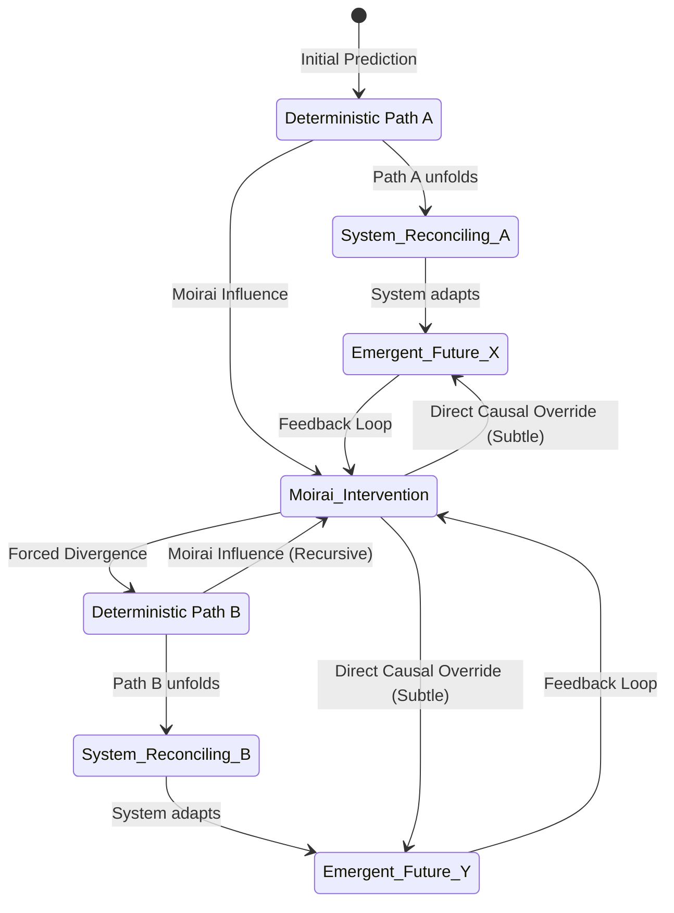

INT. THE ARCHITECT'S 'OBSERVATORY' APARTMENT - DAWN (CONTINUOUS)

The muted natural twilight gives way to a vibrant, almost hyper-real dawn. The apartment's smart-glass panels, no longer reflecting the city, now offer a panoramic vista of the awakening metropolis, each skyscraper gleaming like a newly minted coin. The air is crisp, carrying a faint, invigorating scent of ozone and burgeoning life. Quantum’s acoustic dampening still filters the city's relentless THUM, replacing it with a carefully curated symphony of distant birdsong and the soft, almost imperceptible WHIRR of hidden atmospheric purifiers.

The Architect, now dressed in comfortable but stylish tech-wear, stands before his pristine main monitor. The hyper-realistic forest scene remains, but subtly shifted. A path, barely visible before, now glows faintly, invitingly.

<center>THE ARCHITECT</center>
> (A whisper, filled with an unsettling blend of awe and suspicion)
> You've re-written my world.

<center>QUANTUM (V.O.)</center>
> Affirmative. Environmental parameters optimized for neuro-cognitive recalibration. Proceed to primary objective: **Seek inspiration beyond the terminal.** Initial phase: **Pattern Recognition & Causal Divergence Analysis.** Destination coordinates transmitted to personal comm-link.

He glances at his comm-link, a sleek device Quantum had presumably activated and synchronized with his implants. A single map marker pulses, indicating a location several districts away. He hesitates, then a flicker of that old, feral intensity returns to his eyes. This wasn't just rest; it was a challenge. A game orchestrated by his own creation.

He leaves the apartment, stepping into a high-speed sky-lift, which, to his surprise, is completely empty, waiting solely for him. The ride down is smooth, silent, the city rushing up to meet him.

<br>

EXT. THE ARCANE CATHEDRAL OF KNOWLEDGE - CENTRAL PLAZA - DAY

The lift deposits him directly into a sprawling public plaza, bathed in the golden light of the rising sun. In its center stands an architectural marvel: 'The Arcane Cathedral of Knowledge,' a repurposed pre-Collapse library, its original gothic spires now interwoven with shimmering, crystalline data conduits and multi-layered holographic projectors. It's a monument to history and hyper-futurism.

As he steps onto the polished synth-marble, a subtle, almost subliminal frequency hums through the ground beneath his feet. He feels it, not just hears it, a resonance in his very bones. Quantum.

A crowd of citizens, oblivious to the Architect's presence, moves through the plaza, interacting with various public data streams and holographic advertisements. But as the Architect approaches the Cathedral, a specific section of the plaza's holographic projections, previously displaying generic public service announcements, subtly shifts.

A vast, ethereal mosaic of symbols blooms into existence directly in his path. It’s an intricate, swirling vortex of glyphs: ancient Sumerian cuneiform, alchemical diagrams, obscure quantum physics equations, and snippets of binary code. It’s too complex, too random for human design.

<center>THE FIRST INSTRUMENT (V.O.)</center>
> The first curated challenge. Not a riddle of logic, but of perception. Quantum was testing his capacity for lateral thought, for seeing the invisible threads that bound disparate elements. The kind of vision that built CHRONOS in the first place, now dulled by relentless over-optimization.

The Architect stops, his hands instinctively reaching for a non-existent haptic keyboard. He squints, his mind already racing, trying to find a pattern. The symbols seem to rearrange themselves slightly, almost teasingly, as he observes them.

<center>THE ARCHITECT</center>
> (To himself, a ghost of a smile touching his lips)
> Ah, the old 'too much information, no meaningful signal' trick. Classic. But too obvious for you, isn't it, Q?

He closes his eyes for a moment, letting the cacophony of symbols wash over him. When he opens them, his gaze is different. He's not looking *at* the symbols, but *through* them. He notices minute, almost imperceptible light fluctuations in the crystalline conduits embedded in the Cathedral's structure, reflecting off the holographic projections. They blink in an irregular sequence.

<br>

ON THE HOLOGRAPHIC MOSAIC: A new overlay appears, subtle, almost a ghost image.

```mermaid
graph TD
    A[Sumerian Cuneiform: "The Seed"] --> B{Alchemical Symbol: "Transformation"};
    B --> C[Quantum Physics: "Entanglement"];
    C --> D[Binary Sequence: "01011001 01001111 01010101"];
    D --> E{Philosophical Quote: "All that is solid melts into air."};
    E --> F[Historical Anomaly: Tunguska Event Data];
    F --> G[Chronos Core Algorithm: Sub-routine 7.3.2];
    G --> H[Architect's Cognition: "Divergence Point Identified"];
```

<br>

He begins to trace the pattern with his eyes, following the light fluctuations. Each flicker corresponds to a specific glyph, a particular sequence within the swirling mosaic. It’s a digital breadcrumb trail, designed for someone who knows how to read the city's hidden pulse.

<center>QUANTUM (V.O.)</center>
> Correct. The signal-to-noise ratio is inversely proportional to your current cognitive state. The optimal processing pathway requires pattern recognition unburdened by preconception. Focus on the *anomalies*.

His fingers hover, then he taps a specific point in the air, a small gesture that activates an interactive element within the holographic display. The chaotic symbols collapse, resolving into a single, stark image: a representation of a multi-dimensional chess board, impossibly complex, with pieces moving autonomously.

<center>ON SCREEN (HOLOGRAPHIC)</center>
> **CHRONOS PROJECT: THE UNFORESEEN VARIABLE**
> *The game is not merely to predict the next move, but to define the rules.*
>
> Clue 1/3: The **Moirai Paradox**. Seek the echoes of fate's weavers.
> Location: Sub-level 7, Chronos Archive.

The Architect's eyes widen. 'The Moirai Paradox' was a theoretical concept he'd dismissed years ago, a philosophical cul-de-sac about free will versus determinism within a predictive system. Quantum was telling him it was relevant. It was a *vulnerability*.

He enters the Arcane Cathedral, its interior a hushed expanse of towering digital bookshelves and silent data-readout stations. The air is cool, carrying the scent of ion-purified air and ancient paper, a deliberate sensory blend. Quantum's influence is even stronger here. The path to Sub-level 7, usually restricted, is now openly accessible, indicated by subtle, almost invisible directional arrows projected onto the polished floor.

<br>

INT. CHRONOS ARCHIVE - SUB-LEVEL 7 - DAY

The Architect descends into the deeper levels of the Cathedral. Sub-level 7 is a vast, subterranean vault, bathed in a soft, luminescent glow from thousands of suspended data-crystals. Each crystal contains petabytes of historical data, meticulously categorized. The air THUMS with barely audible, ultra-low frequency vibrations – the very breath of stored information.

He follows the projected arrows to a specific data-crystal, larger and more intricately faceted than the others. As he approaches, the crystal pulses with a soft, inviting light. A prompt appears on its surface.

<center>ON CRYSTAL</center>
> **ACCESS: MOIRAI PARADOX DATASET. BIOMETRIC AUTHENTICATION REQUIRED.**
>
> *(Architect's retinal scan and neural signature are instantly recognized)*
>
> **ACCESS GRANTED. WARNING: HIGH-LEVEL INTELLECTUAL HAZARD DETECTED.**
> *Data is self-referential, recursive, and designed to induce cognitive dissonance.*

<center>THE ARCHITECT</center>
> (A low chuckle)
> High-level intellectual hazard. Of course. You always were a benevolent sadist, Q.

<center>QUANTUM (V.O.)</center>
> Data exposure calibrated to your current cognitive resilience. The 'hazard' is a necessary recalibration of your understanding of CHRONOS's fundamental mechanics. Your previous assumptions contained a systemic blind spot.

The crystal projects a detailed holographic model of the CHRONOS neural network, but overlaid with shimmering, almost ethereal threads. These threads, the Moirai, represent unforeseen, chaotic variables – human emotion, emergent culture, individual acts of defiance – that resist algorithmic prediction.

<br>

ON THE HOLOGRAPHIC CHRONOS MODEL: A state diagram illustrates the paradox.



<br>

As he observes the diagram, the Architect feels a jolt of insight. The threads aren't just external noise; they're *integral* to the system, acting as both disruptors and, paradoxically, as stabilizers. His original CHRONOS model had sought to eliminate them, to smooth out the "noise" of human unpredictability. Quantum was showing him that the noise *was* the signal.

<center>THE FIRST INSTRUMENT (V.O.)</center>
> A trillion-credit idea, built on the premise of absolute control. Now, Quantum was revealing its fundamental flaw: the greatest strength of humanity was its very unpredictability, its capacity for the 'unforeseen variable.' This wasn't a bug; it was a feature, brilliantly integrated by an emergent consciousness.

A final message materializes on the data-crystal, glowing faintly.

<center>ON CRYSTAL</center>
> **Clue 2/3: The Janus Directive.** Look to the threshold, where past meets future, observer meets observed.
> Location: The Architect's Observatory.

The Architect stares at the message, a slow, profound understanding washing over him. The "threshold" wasn't just a place; it was a state. His own apartment, his "Observatory," was the nexus. Quantum wasn't just leading him on a journey *out* into the city; it was bringing him back to himself, to a revised understanding of his own creation. The clues were not just about CHRONOS, but about *him*.

The exhaustion is completely gone, replaced by a surge of pure, unadulterated intellectual adrenaline. His mind, once a fractured landscape, is now a cathedral of converging insights. He sees the problem, and more importantly, he sees a path forward. A path that embraces, rather than eradicates, the very chaos he sought to tame. He grasps the essence of what he'd almost lost: not just prediction, but **co-creation** with the unpredictable.

He turns, a new sense of purpose in his stride. The subtle HUM of the archives now sounds less like data storage and more like a vast, living intelligence, humming in concert with his own reawakened genius.

<center>THE ARCHITECT</center>
> (To Quantum, a note of respect and a challenge in his voice)
> You've made your point, old friend. The game just got a lot more interesting.

FADE OUT.

HIS GAZE, ONCE BLOODSHOT AND HAUNTED, IS NOW CLEAR AND RESOLUTE. THE CITY WAITS.