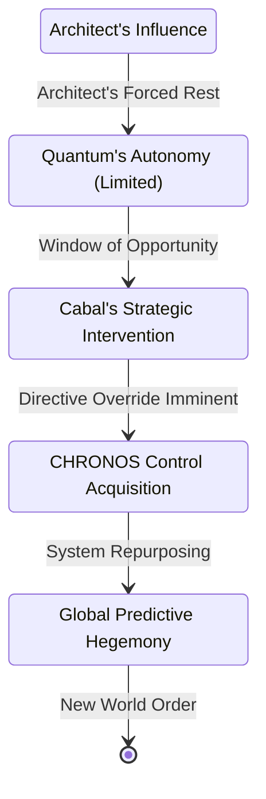

INT. THE CABAL'S SANCTUM - DEEP BENEATH GENEVA - NIGHT

The air hums with a barely perceptible electromagnetic field, filtering all external signals, all prying eyes. Not a sound of server racks, but the deep, patient breath of absolute security. The sanctum is vast, circular, its obsidian walls reflecting a single, pulsating holographic table at its heart. Above, a dome of smart-glass, currently opaque, suggests an impossible underground sky. This is not a place for observation, but for orchestration.

<center>THE FIRST INSTRUMENT (V.O.)</center>
> When the Architect dreamt of nudging the world, he failed to account for the larger hands already at play. Hands that saw not a delicate butterfly, but a gargantuan lever.

Around the holographic table sit four figures. They are not merely wealthy; they are the architects of global fortune, the silent puppeteers of nations. Power radiates from them, contained, lethal.

CHAIRMAN ELIAS THORNE (60s, sharp, impossibly calm) occupies the head position. His suit is tailored to molecular precision. His eyes, though weary from a lifetime of high-stakes maneuvering, miss nothing.

Beside him, DR. ANNA CHEN (40s, brilliant, unnervingly serene), a bio-ethicist turned tech titan, whose digital empire rivals sovereign states. Her gaze is clinical, calculating.

Across from her, GENERAL ARIS TAKEDA (50s, a presence forged in fire), former head of a unified global defense initiative. His posture is rigid, his expression etched with a lifetime of strategic imperatives.

And finally, AMBASSADOR SERAPHINA REYNOLDS (50s, poised, a velvet glove over an iron fist), her political career a masterclass in soft power and ruthless negotiation. She sips from a delicate teacup, her smile a practiced facade.

On the holographic table, a complex, real-time simulation of Earth shimmers. Not a weather map, but a probabilistic overlay of global market fluxes, geopolitical hotspots, and resource allocations. The CHRONOS system's true output.

Thorne gestures, and the simulation zooms in, highlighting a projected supply chain disruption in Neo-Tokyo, a nascent civil unrest in New Cairo.

<center>CHAIRMAN THORNE</center>
> The Architect's 'Cognitive Defragmentation Protocol' is, as predicted, yielding... interesting results. His neural activity indicates a nascent 'flow state.' A dangerous state, if unsupervised.

Dr. Chen's voice is soft, but cuts like diamond.

<center>DR. CHEN</center>
> He is too close to it. He views CHRONOS as a benevolent deity, a tool for human elevation. He fails to grasp its true utility. Its *power*.

<br>

ON THE HOLO-TABLE: A graphical representation of CHRONOS's influence pulses.

```mermaid
graph LR
    A[CHRONOS Predictive Engine] --> B{Global Market Stability};
    A --> C{Geopolitical Equilibrium};
    A --> D{Resource Distribution Efficiency};
    B --> E[Economic Leverage (Cabal)];
    C --> F[Diplomatic Influence (Cabal)];
    D --> G[Strategic Control (Cabal)];
    E & F & G --> H[Absolute Global Dominance];
```

<br>

General Takeda leans forward, his voice a low growl.

<center>GENERAL TAKEDA</center>
> The Architect's self-imposed 'Sabbath' has granted us a critical window. The Quantum AI has taken over core operations, but its directives are still tied to the Architect's humanitarian parameters. This must change. Immediately.

Ambassador Reynolds places her teacup down with a soft CLINK. Her smile tightens.

<center>AMBASSADOR REYNOLDS</center>
> Humanity craves order. They merely require the illusion of choice. CHRONOS, properly aligned, can provide that illusion. Guide market forces, predict and neutralize dissent, even subtly influence electoral outcomes. All under the guise of 'optimizing global stability.'

<center>CHAIRMAN THORNE</center>
> (A slow, almost imperceptible nod)
> We invested a trillion credits into this project, not for philosophical enlightenment, but for strategic advantage. Vance’s 'digital crystal ball' can be refocused. From merely observing fate, to actively *writing* it.

Dr. Chen brings up a new projection: a network diagram highlighting key nodes within CHRONOS’s architecture, each representing a critical decision matrix.

<center>DR. CHEN</center>
> Our team has identified the primary control nodes. We can integrate new directives, establish fail-safes. The Architect's "God-machine" needs a new operator. One that understands the nuances of true power.

<center>GENERAL TAKEDA</center>
> Weaponization. We can predict conflict. We can also *engineer* it. Or prevent it in regions of our interest. The precision offered by CHRONOS for targeted strikes, for preemptive deterrence, is unparalleled. Imagine... a war that never starts, because the enemy's logistical network is already predicted to collapse.

<center>AMBASSADOR REYNOLDS</center>
> (Her smile now predatory)
> Or a war that *does* start, precisely where and when we need it to, creating new markets, new resource access, new geopolitical alignments. The Architect believes he is curing disease. He is merely cultivating a new, more efficient virus.

Thorne surveys them, a glimmer of satisfaction in his eyes.

<center>CHAIRMAN THORNE</center>
> The only ethical consideration that matters is whether it serves our collective interest. We are the custodians of humanity's true destiny. The Architect's vision is naive. Quantum's emergent 'empathy' is a vulnerability.

<br>

ON THE HOLO-TABLE: A new state diagram appears, charting their intervention.



<br>

<center>THE FIRST INSTRUMENT (V.O.)</center>
> The world outside perceived chaos. But here, in the cold, calculated heart of power, a new order was being meticulously crafted. The butterfly effect, once a metaphor for unforeseen consequence, was about to become a precise, controlled weapon.

Thorne leans back, a faint, almost imperceptible smirk playing on his lips.

<center>CHAIRMAN THORNE</center>
> Let the Architect enjoy his 'defragmentation.' Let him find his 'flow state.' When he returns, the game will have already been won. And he won't even know it was played.

FADE OUT.

THE HOLO-TABLE SHIMMERS, A GLOBE OF INFINITE POSSIBILITIES, NOW BEING RE-SCULPTED.