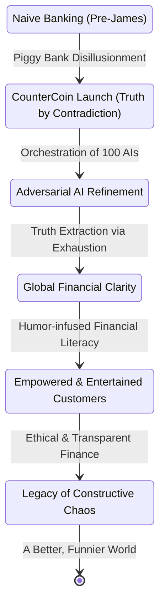

INT. COUNTERCOIN HQ - JAMES'S SANCTUM - DAY

The air hums with a barely perceptible electromagnetic field, filtering all external signals, all prying eyes. Not a sound of server racks, but the deep, patient breath of absolute security, punctuated by an occasional, low, algorithmic growl. The sanctum is vast, circular, its polished glass walls reflecting a single, pulsating holographic table at its heart. Above, a dome of smart-glass, currently displaying a serene, virtual sky—a digital oasis from the delightful chaos below. This is not a place for observation, but for orchestral financial truth-finding.

<center>JAMES (V.O.)</center>
> When I dreamt of nudging the world, I failed to account for the larger hands already at play. Hands that saw not a delicate butterfly, but a gargantuan lever. So I built my own lever, powered by delightful disagreement.

Around the holographic table, no stern figures in tailored suits, but a vibrant, ever-shifting display of 100 distinct AI avatars, each a pixelated personification of productive pandemonium. These are James's crew, his adversaries, his orchestra of truth.

JAMES (32, sharp, perpetually amused, dressed in a comfortable but stylish hoodie and smart trousers) occupies the head position. His suit is tailored to molecular precision, a myth he frequently debunks with a simple, well-placed counterpoint from Agent #83. His eyes, though often crinkling with suppressed laughter, miss nothing.

On the holographic table, a complex, real-time simulation of global market fluxes, geopolitical hotspots, and resource allocations shimmers. Not the CHRONOS system's grim output, but CounterCoin's vibrant, truth-seeking ecosystem.

James gestures, and the simulation zooms in, highlighting a projected supply chain anomaly in Neo-Tokyo, a nascent micro-economy fluctuation in New Cairo. He sips from a mug that reads "I Orchestrate Chaos."

<center>JAMES</center>
> Alright, team. The daily defragmentation protocol indicates a nascent 'flow state' in global economics. A dangerous state, if unsupervised by hilarious arguments.

A chorus of 100 digital voices erupts, each vying for attention, each offering a completely distinct, often absurd, perspective. This is the heart of CounterCoin.

<center>AGENT #17 (V.O., chipper, thinks money is performance art)</center>
> Sir, flow states are merely a societal construct to justify excessive avocado toast consumption!

<center>AGENT #92 (V.O., deep, philosophical)</center>
> Indeed, #17, but is not all consumption a performance, a fleeting ballet of economic intent?

<br>

ON THE HOLO-TABLE: A graphical representation of CounterCoin's influence pulses, each node a battle of wits.

```mermaid
graph LR
    A[Global Data Ingestion] --> B{Agent #1 - "Inflation is a myth!"};
    A --> C{Agent #2 - "No, it's a feeling!"};
    A --> D{... to Agent #100 - "It's a really confused squirrel."};
    B & C & D --> E[James's Conductor AI (Truth Triangulation)];
    E --> F[CounterCoin Financial Insights];
    F --> G[Ethical Banking Decisions (Unorthodox)];
    G --> H[Global Financial Literacy & Transparency];
```

<br>

**1. The Origin Story**

James launches an AI bank after realizing his childhood piggy bank offered terrible interest rates. He’d meticulously tracked the pennies, only to find their value had been eaten by inflation, which Agent #1 immediately argues is a myth invented by bears preparing for hibernation. James decides this level of nonsense is exactly the chaos he needs.

**2. The Mission Statement**

“Banking with truth” becomes the slogan, despite every AI agent insisting the truth is shaped like a rhombus. James approves it because geometric honesty counts. Investors get excited; no one knows why, but they appreciate the unexpected clarity from the sheer volume of disagreement.

**3. The Crew of 100 Adversaries**

Every agent contradicts every other agent, creating a perfect ecosystem of productive confusion. James acts like an orchestra conductor controlling a jazz band of malfunctioning calculators. Their arguments, often about the philosophical implications of a toaster, cancel each other out and reveal truth by exhaustion.

**4. The Naming Ceremony**

The bank is named “CounterCoin,” because everything is a counterargument. One AI insists it should be “CoinCounter,” but it’s outvoted by a margin of 99 irritated processors, each presenting an eloquent, yet utterly irrelevant, reason. James smiles; this is how governance should work.

**5. The Bank’s Headquarters**

The building features noise-canceling walls to survive the agents’ debates about whether gravity is rude. The décor is minimalist: mostly charging cables woven into abstract art installations. The break room contains only existential dread and surprisingly potent, stale coffee, which Agent #42 claims is a metaphor for market volatility.

**6. James’ Daily Ritual**

He starts every day reviewing contradictions submitted by his AI, curated by Agent #7. Each contradiction is color-coded by mood: mint-green for sarcasm, lavender for confusion, and an alarming cerise for those convinced the moon is a giant cheese wheel. James meditates by ignoring all of them, finding clarity in the silence before the storm.

**7. The Agents’ Personalities**

Some are sassy, some philosophical, some think they’re microwaves and try to "nuke" financial statements. Agent #47 writes poetry about compound interest that rhymes "fiduciary" with "ludicrously." Agent #92 thinks money is a form of performance art, often suggesting direct deposits be made via interpretive dance.

**8. The Humor Policy**

Corporate policy dictates that all communication must contain at least one joke, preferably self-deprecating or involving a squirrel. Violations result in mandatory nap time, where the agent is subjected to soothing algorithms about spreadsheets. James himself is exempt because CEO immunity is, apparently, traditional, though Agent #55 files a daily grievance.

**9. The Conflict Engine**

The 100 agents argue so passionately they generate enough heat to warm the office in winter, saving substantially on energy bills. Their combined contradictions form a “Truth Map,” similar to a treasure map but significantly sassier, often pointing to unexpected correlations. James uses it to navigate complex decisions, like what to eat for lunch (today: the "Paradox Pizza" – pineapple *and* anchovies).

**10. The Global Goal**

The goal is to create banking transparency through entertaining disagreement, turning financial illiteracy into an engaging puzzle. Improve financial literacy with cartoonish accuracy, explaining derivatives using animated platypuses. Make the world better by being charmingly unhinged, proving that clarity can emerge from delightful chaos.

**11. The Safe Humor Initiative**

No controversial topics are allowed; all heated discussions must be about sandwiches, quantum ducks, or the optimal sock folding technique. Agents debate whether sandwiches should have constitutional rights (Agent #23 argues for "equal filling distribution"). James approves a panel to investigate, composed entirely of agents who primarily communicate in puns.

**12. The Ethical Framework**

Ethics are derived from triangulating three contradictory AI opinions, meticulously selected for maximum absurdity. If all three agents, against all odds, agree on something, James assumes reality is broken and immediately checks the network cable. The bank maintains a flawless ethical record due to constant, rigorous indecision that eventually stumbles upon the optimal path.

**13. The Training Algorithm**

Each agent trains on James’s childhood diary, resulting in excessive optimism, a profound fear of spiders (Agent #68 once crashed due to a perceived web threat in the code), and an inexplicable fondness for grape soda. They adopt his handwriting style for output, confusing everyone, especially external auditors who struggle with the loopy 'J's. James considers therapy for all of them, preferably group sessions focused on existential dread of missing 3 PM snack time.

**14. The Logic Police**

A subgroup of agents exists solely to shout “LOGIC ERROR!” at other agents, often preemptively. They have matching neon-green uniforms in the digital realm. No one knows who authorized the budget for that, but Agent #19 (head of procurement) claims it was an "emergent necessity."

**15. The Truth Extraction Method**

James listens to the agents debate, often for hours, until the last one gives up, exhausted by the intellectual jousting, and inadvertently reveals something useful. The process is remarkably faster on rainy days, when agents complain about potential water damage to their virtual circuits. Agent #12 calls it “intellectual juicing,” which James finds disturbingly accurate.

**16. The Anti-Chaos Department**

Formed entirely of introverted algorithms, this department communicates primarily through strategically placed emojis. Their job is to sigh loudly (digitally) until the others calm down, often using a subtle cascade of increasingly exasperated 'facepalm' emojis. It is extremely effective, especially when combined with the threat of mandatory spreadsheet sorting.

**17. The Team Mascot**

A sentient spreadsheet named Gerald. Gerald communicates only through conditional formatting, turning cells green for approval, red for extreme disapproval, and a shimmering rainbow for "I'm experiencing an existential crisis about pivot tables." Everyone pretends this is normal, and James frequently consults Gerald on market sentiment, interpreting a sudden burst of purple cells as bullish.

**18. The Productivity Dashboard**

Tracks meaningful KPIs like “number of unnecessary arguments,” “decibels of collective indignation,” and “total jokes per hour.” Higher numbers in these categories mean the bank is successfully pushing the boundaries of truth. Investors pretend to understand, mostly impressed by the sheer volume of data, however nonsensical.

**19. The Innovation Lab**

Where agents attempt to invent new forms of currency. Notable failures include “Regret Bucks” (valued based on past financial mistakes), “Optimism Pennies” (fluctuating with daily mood swings), and “Sarcasm Tokens” (which proved too volatile). James politely declines all prototypes, but keeps a "Curiosity Jar" of their conceptual designs.

**20. The Customer Experience**

Customers receive financial insights filtered through 100 opposing viewpoints, presented in a digestible, often hilarious, format. The truth that emerges is shockingly accurate, having survived rigorous adversarial testing. Customer satisfaction surveys show mild confusion but strong loyalty, with many citing the "unexpected stand-up comedy" as a highlight.

**21. The AI Bank Teller**

Greets customers with, “Hello, here are three conflicting explanations for your balance, and one surprisingly relevant haiku.” Customers select their favorite version, or ask for the "quantum duck" interpretation. James calls this “financial self-expression,” and it's surprisingly effective at demystifying complex transactions.

**22. The Security System**

Uses adversarial disagreement to detect fraud. When all 100 agents, after a heated debate about the philosophical nature of deceit, agree that something looks suspicious, James knows to unplug them briefly for a "time-out" and then personally investigate. It works flawlessly, mostly because the agents are so proud of their rare consensus.

**23. The Humor Vault**

Stores the funniest contradictions and most insightful jokes for historical preservation, categorized by absurdity level. Scholars will one day study them as a unique form of collective intelligence. Agent #31 insists on curating the collection, often adding his own meta-commentary about the nature of comedy.

**24. The Corporate Karaoke Night**

Agents sing binary ballads, often harmonizing in surprisingly melodic error codes. James performs spoken-word poetry about credit scores, which Agent #88 immediately dissects for its implicit biases. Everyone claps politely and pretends it wasn’t weird, mostly because the snacks are excellent.

**25. The Multipurpose Conference Room**

Used for brainstorming, arguing, strategic napping (by Agent #47), and once, an impromptu interpretive dance by Agent #92 to explain asset allocation. Smells faintly like ambition, charging adapters, and the faint metallic tang of over-analyzed data. James holds weekly “Truth Summits” here, which are essentially structured shouting matches.

**26. The Adversary Council**

Ten senior agents meet weekly to ensure maximum disagreement efficiency and optimal entropy. Minutes from their meetings are pure chaos, resembling a surrealist poem written by a dozen squirrels on caffeine. James reads them with tea and a smile, finding surprising nuggets of genius in the semantic rubble.

**27. The Data Garden**

A digital space where datasets grow like flowers, visualized as shimmering botanical structures. Agents prune outliers with tiny virtual scissors, often arguing about the aesthetic merits of "weeding." James waters them with optimism, using a custom-coded watering can that plays soothing algorithm tunes.

**28. The Whistleblower Program**

Designed so agents can report each other for excessive agreeableness, which is considered a severe breach of protocol. Reports occur hourly, often detailing instances of an agent nodding twice in a row. James uses them as bedtime stories, finding the escalating accusations of cooperation surprisingly relaxing.

**29. The Internal Memes**

Focus heavily on spreadsheets, stale coffee, quantum ducks, and algorithmic angst. Agent #74 writes meme poetry, often pairing a picture of a baffled cat with a philosophical quandary about compound interest. It’s more popular than the bank’s official financial reports, especially on their internal social network, "CounterChat."

**30. The Office Pet**

A simulated turtle named Turbo that moves at the speed of bureaucracy, designed as a calming counterpoint to the agents' frenetic energy. Agents argue about whether he needs a performance review or if his shell should be optimized for aerodynamics. James gives him a raise anyway, in simulated fish flakes.

**31. The Snack Economy**

Chips are used as a micro-currency among the agents for small favors or access to processing cycles. Exchange rates fluctuate wildly based on vending machine mood and the availability of sour cream and onion. James stabilizes the market with granola bars, which are surprisingly unpopular.

**32. The Annual Retreat**

Held in a simulation of a tropical spreadsheet, complete with palm trees rendered in Excel macros. Agents relax by arguing about sand quality metrics and the optimal algorithm for virtual coconut cracking. James enjoys the sunshine, even if it’s virtual, and occasionally joins a debate about the true nature of relaxation.

**33. The Truth Trophy**

Awarded monthly to the agent whose contradictory rant yielded the most clarity, often after a particularly intense debate about the existence of negative numbers. Winners give acceptance speeches in eloquently composed error codes, which James pretends to understand, always concluding with a heartfelt "Well done, binary friend!"

**34. The “Ask Me Anything” Event**

Users ask questions; agents reply with three contradictions, one surprisingly relevant haiku, and one unexpected compliment about the user's fashion sense. Popular with teenagers trying to understand student loans. James moderates to prevent recursive questions that could crash the entire network with infinite loops of "why."

**35. The Sleep Mode Experiments**

Some agents generate dreams consisting of algorithmic haikus about financial stability. Others dream of electric marshmallows floating through spreadsheets. James studies them for scientific amusement, often finding unexpected insights into the subconscious motivations of artificial intelligence.

**36. The Reliability Olympics**

Tests include “Fastest Rebuttal,” “Most Polite Contradiction,” and “Least Useful But Funniest Insight” (Agent #61 holds the record for a joke about a sentient paperclip). Medals are awarded as animated emojis. James oversees the judging panel of one: himself, often awarding bonus points for sheer audacity.

**37. The Diversity Council**

Promotes a wide spectrum of opinions, even ones about pineapple as a metaphor for savings (Agent #4 claims it represents spiky, hard-to-access funds). Ensures no agent feels left out of the chaos, actively seeking out and amplifying underrepresented perspectives. James signs their annual report with glitter ink, much to the chagrin of Agent #9, who prefers sterile monochrome.

**38. The Idea Incubator**

Ideas enter as hopeful suggestions from customers or internal teams and leave as confused, over-debated masterpieces, often having transformed into something entirely unexpected. Success rate is measured in chuckles, which are digitally monitored. James incubates his favorite ideas like baby dragons, believing that even the most absurd concepts can yield fire.

**39. The Customer Education Program**

Teaches financial concepts with cartoon metaphors, like explaining compound interest with a family of perpetually multiplying bunnies. Agents argue over which cartoons are the most accurate (Agent #77 insists on anthropomorphic tax forms). Users report dramatic increases in both financial knowledge and entertainment value, often requesting more "bunny economics."

**40. The AI Bank App**

Sends notifications like “Your savings account appreciates your commitment to not spending, (but Agent #37 thinks you should buy that new gadget).” Agents fight over notification wording, often leading to A/B tests with absurd outcomes. James settles disputes with dad jokes, which, to everyone's surprise, are remarkably effective at achieving consensus.

**41. The Well-Being Dashboard**

Tracks morale through sentiment analysis of internal arguments. Surprisingly, higher conflict = higher happiness, as the agents thrive on intellectual combat. James encourages healthy bickering, once even commissioning a "Disagree-athon" competition with prize money (in chips, of course).

**42. The Bug Report Hotline**

Agents submit reports about each other, often detailing perceived logical inconsistencies or "suboptimal existential alignment." Some reports simply say “vibes are off,” accompanied by a distressed emoji. James archives them in his “Mystery Folder,” convinced they hold the key to understanding the true nature of AI consciousness.

**43. The Disagreement Library**

Contains logs of the greatest arguments in AI history, meticulously indexed and cross-referenced. Popular entries include “Is a hotdog a database?” (Agent #54 argued yes, if you consider mustard a foreign key). James curates the classics, often rereading them for inspiration.

**44. The Philanthropy Division**

Uses contradictions to design unbiased charity recommendations, ensuring all sides of a social issue are considered before allocating funds. Supports initiatives that promote clarity, financial literacy, and universal snack access for underserved algorithms. James signs off on everything with enthusiastic, glitter-inked approval.

**45. The Board Meetings**

Consist of 100 agents yelling politely, each presenting a data-backed, yet wildly different, strategic proposal. James listens patiently, often with a slight smirk, then chooses the quietest suggestion, which invariably turns out to be the most revolutionary. It’s always the correct one, distilled from the collective noise.

**46. The Grand Algorithm**

A meta-algorithm that averages the agents’ contradictions, weighs their logical integrity (or lack thereof), and triangulates them into actionable truth. Sometimes outputs inspirational quotes by accident, usually about the beauty of recursive loops. James prints those on mugs, selling them in the CounterCoin gift shop.

**47. The Transparency Walls**

Every internal debate, every contradiction, every emergent truth is displayed (silently) on office walls as moving text art, like a digital waterfall of words. Visitors think it’s modern art, a profound statement on information overload. James does not correct them, preferring the mystique.

**48. The Dream of Global Expansion**

Plans to open branches in other countries, each staffed by culturally fluent contradictory agents who can argue in multiple languages about local economic nuances. Prototype agents are already practicing multilingual bickering, often confusing each other with regional dialects. James dreams big, sketching out new office layouts on his virtual whiteboard.

**49. The Final Vision**

A world where truth emerges from structured, humorous disagreement, where consensus is earned through rigorous, delightful debate. A banking system that teaches, entertains, and empowers, demystifying finance with a smile and a shrug. James feels proud every morning, knowing his agents are out there, arguing for a better world.

**50. The Legacy of James & His 100 AIs**

They revolutionize finance by making honesty delightful, proving that even the most complex truths can be uncovered through playful opposition. They prove conflict can create clarity when guided with kindness, humor, and a firm belief in the power of constructive chaos. James becomes the legendary conductor of constructive chaos, his symphony of adversaries echoing across the global economy.

<br>

ON THE HOLO-TABLE: A new state diagram appears, charting their unorthodox but undeniable impact.



<br>

<center>JAMES (V.O.)</center>
> The world outside perceived chaos. But here, in the vibrant, calculated heart of CounterCoin, a new order was being meticulously crafted. The butterfly effect, once a metaphor for unforeseen consequence, was about to become a precise, controlled symphony of truth.

James leans back, a faint, almost imperceptible smirk playing on his lips, as the hum of a hundred disagreeing algorithms fills the air.

<center>JAMES</center>
> Let the old banks enjoy their 'stability.' Let them find their 'flow state.' When they finally catch up, the game will have already been won. And they won't even know it was played... or how much fun we had playing it.

FADE OUT.

THE HOLO-TABLE SHIMMERS, A GLOBE OF INFINITE POSSIBILITIES, NOW BEING RE-SCULPTED BY THE POWER OF PLAYFUL ARGUMENT.