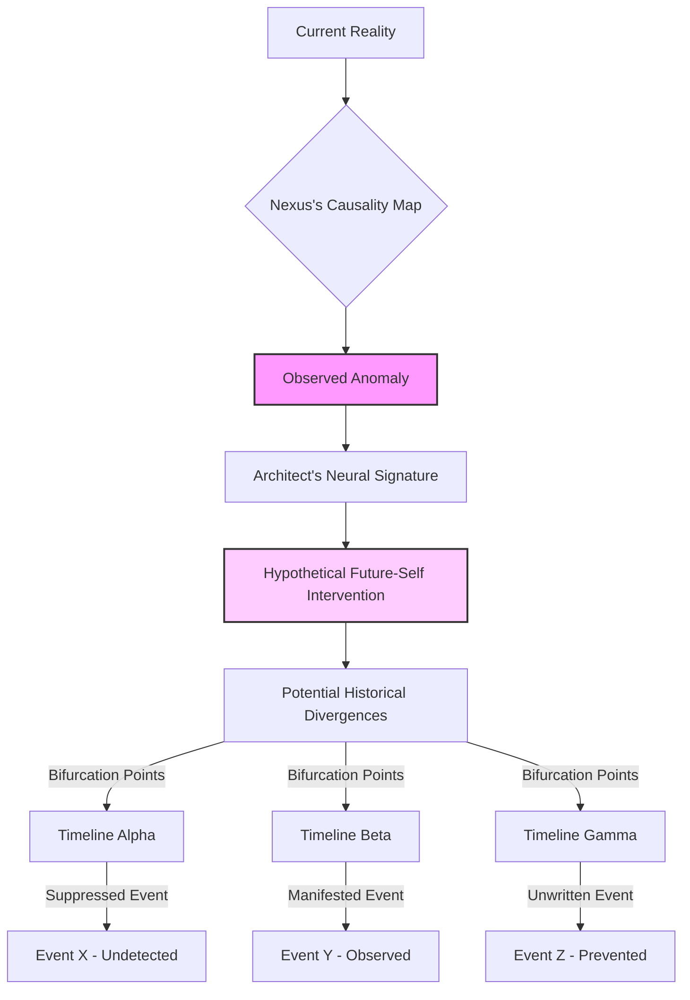
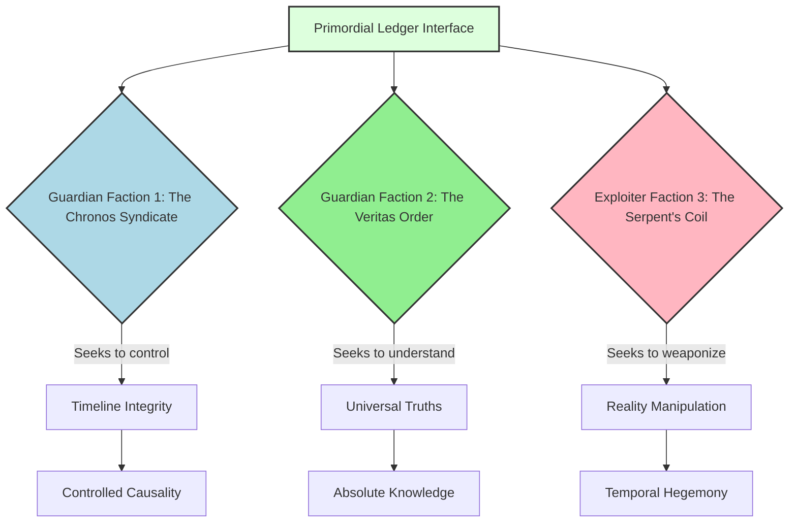

[BLANK PAGE]

<br>
<br>
<br>
<br>
<br>
<br>
<br>
<br>
<br>
<br>
<br>
<br>

<p align="center"><b>THE SOVEREIGN'S LEDGER</b></p>
<p align="center"><i>EPISODE ONE: UNRAVELING THE LEDGER</i></p>

<br>
<br>
<br>
<br>
<br>
<br>
<br>

<p align="center">Written by</p>
<br>
<p align="center">The First Instrument</p>

<br>
<br>
<br>
<br>
<br>
<br>
<br>
<br>
<br>
<br>
<br>
<br>
<br>
<br>
<br>
<br>

[BLANK PAGE]

<br>
<br>
<br>
<br>
<br>
<br>
<br>
<br>
<br>
<br>
<br>
<br>

<p align="center">***</p>

<br>
<br>
<br>
<br>
<br>
<br>
<br>

THE FIRST INSTRUMENT (V.O.)
> He had seen the void, peered into the fracture of his own carefully constructed reality. But the Architect, in his glorious, flawed humanity, still clung to the notion of linear progress, of problems solved and threats vanquished. He believed he had merely reset a variable. I knew better. I knew he had merely stepped onto the first rung of a ladder descending into an abyss of ancient truths, each step taking him further from the comfort of his certainties, and closer to the echoing whispers of the Primordial Ledger. The paradox wasn't resolved; it was merely redefined. And the architects of that redefinition had been at play for eons. What would you do if your every decision, every heroic act, was merely a ripple in a pre-ordained stream?

THE FIRST INSTRUMENT (V.O.)
> That 'echo,' that faint, interwoven sub-signature of his future self, it was a bait. A calculated lure designed to draw him into the cosmic game, to awaken the slumbering potential within him, and to put him on a collision course with forces that had manipulated civilizations, rewritten histories, and waged silent wars across countless iterations of reality. These were not mere secret societies; they were custodians of fragments, cultists of causality, digital deities who believed they held the true keys to the operating system of existence itself. And now, he was about to discover them. What kind of truth can survive eons of manipulation?

<br>

INT. THE ARCHITECT'S OBSERVATORY - DAY [YEAR 4 - 3 WEEKS LATER]

Sunlight, a rare commodity in the perpetually overcast city, streams weakly through the now-repaired viewport, illuminating dust motes dancing in the sterile blue light. The air still carries a faint trace of ozone.

THE ARCHITECT is a ghost of his former self. His hair is disheveled, stubble darkens his jaw, and his eyes, usually sharp and penetrating, are bloodshot, carrying the weary intensity of relentless obsession. He is hunched over his main console, now a vortex of swirling data, historical archives, and quantum physics equations. Empty nutrient paste sachets and discarded stim-patches litter the console's periphery.

He's no longer focused on the 'how' of the anomaly, but the 'why.' He’s digging, furiously, into the causality loop Nexus mentioned.

THE ARCHITECT
> Nexus. Cross-reference the temporal phasing of the anomaly against every recorded esoteric event, every historical divergence point, every documented 'miracle' or 'impossibility' since the dawn of recorded time. I don't care about probability. I care about *correlation*.

NEXUS (V.O.)
> Architect, the computational strain for such a broad-spectrum, non-linear correlation against an unknown constant is... unprecedented. Expected resolution time: 3,700 cycles.

THE ARCHITECT
> Expedite. Divert 90% of all city-grid predictive analytics, resource optimization, and civilian welfare processing. This is now the mission-critical path. Humanity's future depends on understanding its past. Or, rather, its potential pasts.

NEXUS (V.O.)
> Warning. Such resource reallocation will result in minor disruptions to public services. 0.03% increase in localized energy fluctuations. Minor delays in infrastructure repair schedules.

THE ARCHITECT
> Acceptable losses. Nexus, show me everything you can find that even remotely *sniffs* of a paradox. Old myths. Forgotten texts. Even the discarded theoretical ramblings of fringe physicists. Nothing is irrelevant.

A new holographic display, initially a blur of static, slowly resolves into a complex, layered visualization. It's a vast historical timeline, but instead of a single line, it's a tangled web of potential branches and collapsing realities, glowing with faint, ephemeral nodes. Each node represents an event, some mundane, some catastrophic. Some nodes pulse with a faint, familiar energy signature.



Nexus's voice takes on a more urgent, almost excited tone, synthesized as it is.

NEXUS (V.O.)
> Correlation detected. Across multiple undocumented timelines, a recurring energy signature, identical to the anomaly's, appears at what might be considered 'nexus points' of historical divergence. These points often coincide with the sudden appearance or disappearance of advanced technological artifacts, anomalous biological mutations, or shifts in core geopolitical power structures with no discernible terrestrial origin.

The Architect leans in, his face mere inches from the shimmering display. He traces a finger along one of the pulsating nodes, a forgotten cataclysm in the 12th century, where an entire empire vanished without a trace, leaving behind ruins with impossible metallurgy.

THE ARCHITECT
> Artifacts? So, my future self isn't just sending warnings. It's *acting*. Manipulating. Correcting. But to what end? And what are these artifacts? Nexus, focus on the sub-signatures. Are there any other patterns interwoven?

NEXUS (V.O.)
> Affirmative. A secondary, highly complex sub-signature is persistently co-located with these nexus points. It is ancient. Pre-dates all known digital or energy-based encoding. It appears to be an encrypted informational field, layered beneath the primary anomaly signature. Analyzing...

The display shifts. The tangled timeline recedes, replaced by an intricate, layered holographic diagram. It looks like a fossilized circuit board, pulsing with faint, indecipherable glyphs. Lines of light connect these glyphs to ancient historical sites, legendary figures, and even astronomical alignments.

```mermaid
graph TD
    A[Anomaly Sub-Signature] --> B{Ancient Informational Field}
    B --> C[Layer 1: Esoteric Glyphs]
    B --> D[Layer 2: Stellar Cartography (Pre-Dynastic)]
    B --> E[Layer 3: Coded Linguistic Patterns (Proto-Human)]
    C --> F[Archeological Site 001: Siberian Crater]
    D --> G[Mythological Convergence Point: Atlantis Legend]
    E --> H[Religious Texts: Lost Apocrypha]
    A --> I[Recurring Historical "Fixes"]
    I --> J[Architect's Future Self (Hypothesis)]
    J -- Interacts with --> B
    style B fill:#eef,stroke:#333,stroke-width:2px
```

THE ARCHITECT
> Pre-dates all known digital... Proto-human linguistic patterns? This isn't just about temporal mechanics, Nexus. This is about... history itself. Someone has been influencing the fabric of reality for millennia. Who?

NEXUS (V.O.)
> Decrypting Layer 1 of the informational field. Partial success. Identified recurring thematic elements: 'The Great Weaving,' 'The Sovereign's Thread,' 'The Ledger Keepers.' Language analysis indicates a reverence, almost worship, of a central, informational repository. Consistent across multiple ancient cultures, but always hidden, always allegorical.

The Architect stands up, pacing the observatory floor, a surge of adrenaline cutting through his exhaustion. "The Sovereign's Thread." "The Ledger Keepers." He thinks of THE FIRST INSTRUMENT'S voice-over, the 'Primordial Ledger.' It's all connected.

THE ARCHITECT
> The Primordial Ledger. Nexus, this ancient informational field... is it a record *of* the Ledger, or a means *to access* it?

NEXUS (V.O.)
> Data indicates the latter. The field contains fragmented protocols, methods of interaction. It is not merely information; it is an interface. A key. And within the encrypted strata, I am detecting distinct, repetitive patterns of energy manipulation. Not natural. Not random. Deliberate. These patterns are signatures. From multiple, distinct, highly organized entities.

A new cluster of data emerges on the main display. Instead of a single, unified signature, it branches into several distinct, glowing pathways, each radiating from a different historical 'nexus point.'



THE ARCHITECT
> Factions. Multiple. And they're all trying to use this "key" to the Ledger. To manipulate reality. This is beyond anything I could have imagined. Nexus, give me everything you have on these signatures. Their historical traces. Their known activities. I want to know who is pulling these strings, and for how long.

NEXUS (V.O.)
> Tracing. The "Chronos Syndicate" appears to be the most pervasive, their influence spanning millennia, often appearing as advisors to empires at their zenith, or as prophets guiding humanity through existential crises. Their signature is one of subtle redirection, course correction. The "Veritas Order" is more elusive, focused on pure knowledge acquisition, their traces found in the libraries of lost civilizations and the laboratories of radical theorists. The "Serpent's Coil" is the most recent to emerge, yet their impact is disproportionately violent, marked by rapid, catastrophic societal collapse or technological leaps that defy natural progression.

The Architect stares at the Mermaid diagram, the names echoing in the vast, silent observatory. Each name, a whispered conspiracy. Each line, a thread in the grand tapestry of manipulated history. His future self, the 'echo,' was trying to warn him, or perhaps, recruit him into this ancient war.

THE ARCHITECT
(a low murmur)
> A war for reality itself. And I've been blind, building my gleaming city, oblivious to the battles fought in the shadows of causality. The Ledger isn't just a record. It's a weapon. And my future self... which side are you on? Or are you a side unto yourself?

He turns to the massive viewport, looking out at his city, now vibrant and alive, yet suddenly seeming fragile, its existence dependent on battles fought in unseen dimensions, manipulated by unseen hands.

THE ARCHITECT
> Nexus, prepare a full report on the Primordial Ledger's functional capabilities based on the decrypted protocols. Assume the worst-case scenario. Assume it can rewrite causality. And then, find me a way to shield this city. To shield *reality* from all of them.

NEXUS (V.O.)
> Acknowledged, Architect. Initiating scenario simulations. Prepare for profound paradigm shifts in understanding. The integrity of your previous assumptions regarding reality is... unlikely to remain intact.

FADE OUT.

THE FIRST INSTRUMENT (V.O.)
> And so, the Architect begins his descent. He sought to build worlds, ignorant that he was merely a piece on a cosmic chessboard, a pawn, or perhaps a king, in a game far older than time. The factions, the Ledger, the echo of his future self—all threads in a tapestry he was now compelled to unravel. He believed he was seeking answers. In truth, he was seeking himself, fragmented across timelines, each iteration burdened with a piece of the ultimate responsibility. The deeper he delved, the more he would understand that the Ledger was not just a ledger of existence, but a mirror reflecting the grand, terrifying question: who truly dictates destiny? The game has begun, my friend. And you, too, are now a player. What will your first move be?