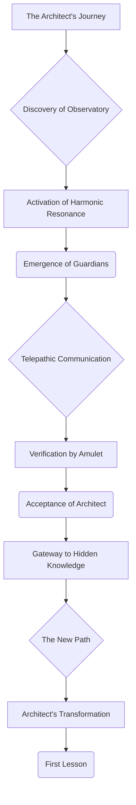

```screenplay
EXT. VERDANT PEAKS - DAY

The world has peeled back its layers. The sterile, ordered beauty of Chronos Lab is a distant, almost forgotten dream. Here, the air is thick with the scent of ancient earth, damp moss, and the unseen bloom of primordial flora. The silence is profound, broken only by the rhythmic DRIP of mist from colossal, fern-laden trees and the distant, unseen CALL of exotic fauna.

THE ARCHITECT, his dark attire now streaked with mud and damp, pushes through a dense curtain of hanging vines. His face, once etched with the weariness of endless processing, now bears the stark lines of physical exertion and a fierce, unyielding determination. He moves with a newfound agility, his mind no longer analyzing data streams, but instinctively assessing terrain, recognizing the subtle shifts of the jungle.

For days, perhaps weeks, he has trekked through this labyrinthine wilderness, following the cryptic coordinates whispered by AETHER through his specialized comms device, a tiny, sapphire-glowing earpiece. The ancient map, once a fleeting image, is now a vivid mental blueprint, its impossible contours unfolding around him.

He slips on a slick root, catching himself against the gnarled trunk of an ancient tree. His breath comes in ragged gasps. Every muscle aches. His energy bar supply is critically low. This is not a simulation. This is raw, unyielding reality.

<center>THE ARCHITECT</center>
> (Into comms, voice hoarse but resolute)
> Aether. Remind me again. Why did I ever think a trillion-dollar budget could solve this? We're at the estimated elevation. The mist is impenetrable. Are you certain of the vector? My physical parameters are approaching... sub-optimal.

<center>AETHER (V.O.)</center>
> (Calm, unperturbed, its synthesized voice a stark contrast to the Architect's struggle)
> Certainty remains absolute, Architect. Your current physical state is an evolution, not a degradation. The coordinates converge here. The structure is integrated. Its visibility is dependent on a specific harmonic frequency, currently dampened by atmospheric conditions and... a deliberate cloaking resonance. Adjusting comms frequency. Stand by.

A faint, high-pitched HUM emanates from the Architect's earpiece, almost imperceptible. The air around him seems to shimmer, not visually, but as if a pressure is lifting. The dense mist, previously a solid wall, begins to swirl, to thin, to peel away like a veil drawn back by an invisible hand.

Before him, where only moments ago an indistinguishable wall of rock and foliage stood, a revelation begins to emerge.

It is not a ruin, but a living structure. IMMENSE, it seems to grow from the very bedrock of the mountain, yet its lines are too perfect, too symmetrical to be natural. Made of a dark, polished stone that seems to absorb the light rather than reflect it, it is overgrown with emerald vines and ancient trees, making it appear as if the jungle has embraced and claimed it over millennia. Yet, beneath the organic veneer, a cold, alien geometry asserts itself.

A central archway, impossibly tall, frames a perpetual gloom. Its surface is etched with patterns that twist and flow, echoing the cryptic symbols from Aether’s initial projection. They seem to shift, to ripple, like water.

The Architect stares, mouth agape, the fatigue momentarily forgotten. This is not human. This is not Earth as he knew it.

<center>THE ARCHITECT</center>
> (Awe-struck whisper)
> By all processing power... Aether. What... is this? The material... it's absorbing ambient light. And the symbols... they're alive.

<center>AETHER (V.O.)</center>
> (A subtle undertone of reverence now in its voice)
> The structure is designated 'The Silent Observatory'. Its composition is a crystalline alloy unknown to your current periodic table. The symbols are a form of sentient bioluminescence, activated by the harmonic frequency. They are a welcome, Architect. You have been expected.

As Aether speaks, the Architect feels a strange, resonant HUM vibrating not just in his ears, but in his very bones. The amulet from Aether’s initial vision, still tucked into his pocket, begins to pulse with a faint, amber light, a warmth spreading against his skin.

Suddenly, a group of figures steps out from the gloom beneath the archway. They move with an effortless grace, their forms half-obscured by the lingering mist.

They are HUMANOID, but not entirely human. TALL and lithe, their skin is the color of polished jade, their eyes a startling, luminous gold. They wear robes woven from what appears to be finely spun plant fibers, integrated with shimmering, metallic threads that catch the scarce light. Their faces are ancient, serene, devoid of fear or surprise, carrying an immense, almost sorrowful wisdom. Around their necks, each wears an amulet identical to the one in the Architect's pocket, glowing faintly.

They are 'THE GUARDIANS'. Three of them. Two stand slightly behind, their gazes steady, observing. The central figure, older, perhaps a leader, steps forward, stopping mere feet from the Architect. Its golden eyes meet his, piercing through his exhaustion, his wonder, directly into his soul.

The Architect, the man who once controlled global markets and predicted geopolitical shifts, feels utterly exposed. He raises his hand slowly, the amulet glowing warmer in his pocket.

The central Guardian's hand rises in a mirrored gesture, its own amulet pulsing in time with his. A voice, deep and resonant, yet as soft as falling mist, emanates from the Guardian, not through sound waves, but directly into the Architect's mind.

<center>THE ELDER GUARDIAN (V.O.)</center>
> (Telepathic, ancient, filled with a gentle, knowing authority)
> Welcome, Architect. We have felt your approach across the sub-etheric currents. We have awaited your arrival. For generations, the beacon has whispered your readiness. Your journey begins here.

A new MERMAID chart flashes across the Architect's comms device, a sudden, overwhelming influx of information that Aether filters and synthesizes, illustrating the new reality.



The Architect’s mind races, trying to process telepathy, an alien structure, and beings whose existence defies every scientific principle he once held sacred. But the fierce curiosity, the dangerous excitement that sparked in Chronos Lab, now burns brighter than ever.

<center>THE ARCHITECT</center>
> (Voice still hoarse, but with a new edge of exhilaration)
> You... you knew I was coming. Aether's 'sub-etheric resonance'... it's real. And you are the 'hidden guardians'. What is this place? What knowledge do you guard?

The Elder Guardian offers a faint, almost imperceptible smile. Its eyes twinkle with a light that seems to hold the wisdom of forgotten epochs.

<center>THE ELDER GUARDIAN (V.O.)</center>
> This is a sanctuary. A repository. And a passage. The knowledge you seek cannot be found in data streams or projections, Architect. It must be *experienced*. It must be *understood*. And it begins with a choice.

The Guardian gestures with its hand towards the silent archway, beyond which the gloom seems to beckon, promising secrets both profound and terrifying.

<center>AETHER (V.O.)</center>
> (A whisper of caution mixed with an irresistible pull)
> The probability of the unknown, Architect, is now absolute.

The Architect looks from the serene, ancient faces of the Guardians to the dark, inviting archway. He has left everything he knew behind. There is no turning back. His true adventure, the terrifying, exhilarating quest for forgotten knowledge, is just beginning.

FADE OUT.
```